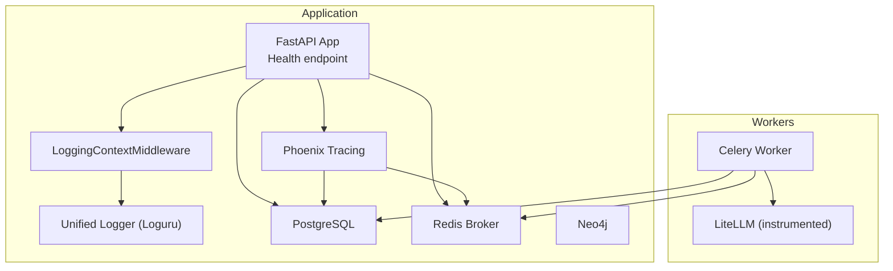
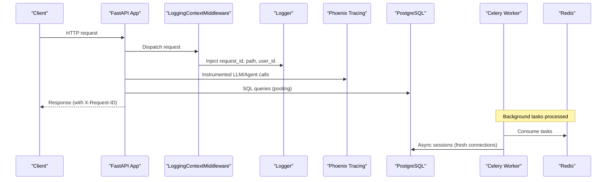
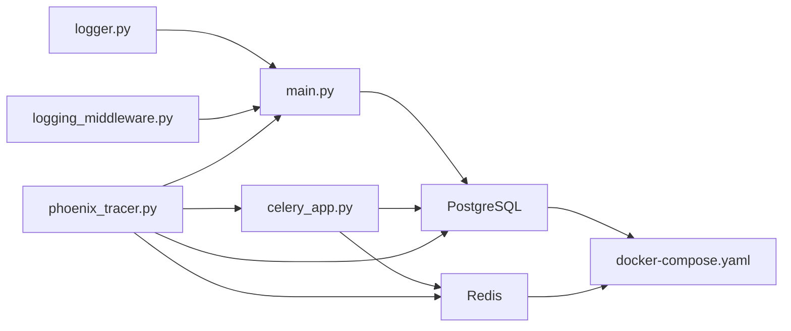

# Monitoring & Maintenance

<cite>
**Referenced Files in This Document**
- [app/main.py](file://app/main.py)
- [app/core/database.py](file://app/core/database.py)
- [app/modules/utils/logger.py](file://app/modules/utils/logger.py)
- [app/modules/utils/logging_middleware.py](file://app/modules/utils/logging_middleware.py)
- [app/modules/intelligence/tracing/phoenix_tracer.py](file://app/modules/intelligence/tracing/phoenix_tracer.py)
- [app/modules/utils/posthog_helper.py](file://app/modules/utils/posthog_helper.py)
- [app/celery/celery_app.py](file://app/celery/celery_app.py)
- [app/modules/parsing/services/inference_cache_service.py](file://app/modules/parsing/services/inference_cache_service.py)
- [app/modules/parsing/tasks/cache_cleanup_tasks.py](file://app/modules/parsing/tasks/cache_cleanup_tasks.py)
- [scripts/clear_celery_queue.py](file://scripts/clear_celery_queue.py)
- [docker-compose.yaml](file://docker-compose.yaml)
- [.env.template](file://.env.template)
- [deployment/prod/mom-api/mom-api-supervisord.conf](file://deployment/prod/mom-api/mom-api-supervisord.conf)
</cite>

## Table of Contents
1. [Introduction](#introduction)
2. [Project Structure](#project-structure)
3. [Core Components](#core-components)
4. [Architecture Overview](#architecture-overview)
5. [Detailed Component Analysis](#detailed-component-analysis)
6. [Dependency Analysis](#dependency-analysis)
7. [Performance Considerations](#performance-considerations)
8. [Troubleshooting Guide](#troubleshooting-guide)
9. [Conclusion](#conclusion)
10. [Appendices](#appendices)

## Introduction
This document provides comprehensive monitoring and maintenance guidance for Potpie with a focus on operational observability and system maintenance. It covers logging configuration, metrics collection, performance monitoring, database maintenance, backup procedures, system health checks, alerting strategies, log analysis, performance tuning, incident response, troubleshooting, maintenance windows, update procedures, and system evolution strategies. The content is grounded in the repository’s codebase and uses terminology consistent with the application.

## Project Structure
Potpie is a FastAPI application with integrated Celery workers and Phoenix tracing. Observability is implemented via a unified logging pipeline (Loguru + standard logging interception), request-scoped logging context injection, optional Phoenix tracing for LLM operations, and PostHog analytics in production. Infrastructure dependencies include PostgreSQL, Neo4j, and Redis, orchestrated via Docker Compose.

**Diagram sources**
- [app/main.py](file://app/main.py#L173-L183)
- [app/modules/utils/logging_middleware.py](file://app/modules/utils/logging_middleware.py#L20-L59)
- [app/modules/utils/logger.py](file://app/modules/utils/logger.py#L187-L313)
- [app/modules/intelligence/tracing/phoenix_tracer.py](file://app/modules/intelligence/tracing/phoenix_tracer.py#L71-L277)
- [app/core/database.py](file://app/core/database.py#L13-L52)
- [app/celery/celery_app.py](file://app/celery/celery_app.py#L67-L147)

**Section sources**
- [app/main.py](file://app/main.py#L1-L217)
- [docker-compose.yaml](file://docker-compose.yaml#L1-L57)

## Core Components
- Unified logging with Loguru and standard logging interception, including sensitive data redaction and environment-aware sinks.
- Request-scoped logging context injection for traceability.
- Phoenix tracing for LLM and agent operations.
- PostHog analytics in production.
- Celery worker configuration optimized for stability and memory management.
- Database connection pooling and async session factories.
- Health endpoint for system readiness checks.
- Docker Compose healthchecks for infrastructure.

**Section sources**
- [app/modules/utils/logger.py](file://app/modules/utils/logger.py#L187-L313)
- [app/modules/utils/logging_middleware.py](file://app/modules/utils/logging_middleware.py#L20-L59)
- [app/modules/intelligence/tracing/phoenix_tracer.py](file://app/modules/intelligence/tracing/phoenix_tracer.py#L71-L277)
- [app/modules/utils/posthog_helper.py](file://app/modules/utils/posthog_helper.py#L9-L46)
- [app/celery/celery_app.py](file://app/celery/celery_app.py#L80-L126)
- [app/core/database.py](file://app/core/database.py#L13-L52)
- [app/main.py](file://app/main.py#L173-L183)
- [docker-compose.yaml](file://docker-compose.yaml#L15-L19)

## Architecture Overview
The monitoring and maintenance architecture integrates:
- Application logging and request tracing
- Distributed task execution with Celery and Redis
- Database connectivity with connection pooling
- Optional LLM and agent tracing via Phoenix
- Analytics capture in production

**Diagram sources**
- [app/main.py](file://app/main.py#L173-L183)
- [app/modules/utils/logging_middleware.py](file://app/modules/utils/logging_middleware.py#L33-L59)
- [app/modules/intelligence/tracing/phoenix_tracer.py](file://app/modules/intelligence/tracing/phoenix_tracer.py#L234-L241)
- [app/core/database.py](file://app/core/database.py#L55-L92)
- [app/celery/celery_app.py](file://app/celery/celery_app.py#L67-L147)

## Detailed Component Analysis

### Logging Configuration and Redaction
- Centralized logging configuration with environment-aware sinks:
  - Production: JSONL sink for machine parsing with sensitive data redaction.
  - Development: Colorized console output with extra field filtering.
- Sensitive data redaction patterns include credentials, tokens, bearer/basic auth, database/Redis URLs, OAuth codes, and API keys.
- Standard library logging is intercepted and routed through Loguru for unified control.
- Library-level log levels are tuned to reduce noise (e.g., SQLAlchemy, Celery, HTTP clients).

Practical tips:
- Adjust LOG_LEVEL via environment variable to increase verbosity for diagnostics.
- Use LOG_STACK_TRACES to toggle stack traces in production logs.
- Use log_context(...) for domain-specific IDs (e.g., conversation_id, project_id) within request scopes.

**Section sources**
- [app/modules/utils/logger.py](file://app/modules/utils/logger.py#L187-L313)
- [app/modules/utils/logger.py](file://app/modules/utils/logger.py#L85-L102)
- [app/modules/utils/logger.py](file://app/modules/utils/logger.py#L315-L358)

### Request-Scoped Logging Context
- Middleware injects request_id, path, method, and user_id into logs for end-to-end traceability.
- Response headers include X-Request-ID for client-side correlation.

Operational guidance:
- Always include domain-specific IDs using log_context in routes where available.
- Use request_id to correlate logs across API, Celery worker, and Phoenix traces.

**Section sources**
- [app/modules/utils/logging_middleware.py](file://app/modules/utils/logging_middleware.py#L20-L59)

### Phoenix Tracing for LLM Monitoring
- Phoenix tracing is initialized at application startup and can be conditionally enabled/disabled via environment variables.
- Auto-instruments LiteLLM and Pydantic AI for agent operations, tool calls, and token usage.
- Includes a sanitizing span exporter to mitigate OpenTelemetry encoding issues with None values.
- Provides health checks for the Phoenix endpoint and graceful handling when tracing is unavailable.

Operational guidance:
- Start Phoenix locally or configure PHOENIX_COLLECTOR_ENDPOINT for remote collectors.
- Use PHOENIX_PROJECT_NAME and ENV to tag traces by environment.
- Monitor Phoenix UI for latency, token usage, and agent performance.

**Section sources**
- [app/modules/intelligence/tracing/phoenix_tracer.py](file://app/modules/intelligence/tracing/phoenix_tracer.py#L71-L277)
- [app/modules/intelligence/tracing/phoenix_tracer.py](file://app/modules/intelligence/tracing/phoenix_tracer.py#L314-L490)
- [app/main.py](file://app/main.py#L89-L99)

### PostHog Analytics
- PostHog client is initialized only in production and sends custom events with user_id and properties.
- Errors in event sending are logged for investigation.

Operational guidance:
- Ensure POSTHOG_API_KEY and POSTHOG_HOST are set in production.
- Use events to track feature adoption and user actions.

**Section sources**
- [app/modules/utils/posthog_helper.py](file://app/modules/utils/posthog_helper.py#L9-L46)

### Celery Worker Monitoring and Stability
- Celery configuration emphasizes stability:
  - Prefetch multiplier set to 1 for fair task distribution.
  - Late acks enabled to prevent task loss.
  - Time limits and restart policies to avoid memory leaks.
  - Visibility timeout and broker transport options tuned for reliability.
- LiteLLM logging is configured synchronously in workers to avoid async handler issues.
- Worker memory logging and shutdown cleanup routines to prevent lingering tasks.

Maintenance checklist:
- Monitor worker memory usage and restart thresholds.
- Verify Redis connectivity and ping on startup.
- Use scripts to purge queues when stuck tasks accumulate.

**Section sources**
- [app/celery/celery_app.py](file://app/celery/celery_app.py#L80-L126)
- [app/celery/celery_app.py](file://app/celery/celery_app.py#L150-L360)
- [app/celery/celery_app.py](file://app/celery/celery_app.py#L362-L453)

### Database Connectivity and Pooling
- SQLAlchemy engine with connection pooling, pre-ping, and recycle settings.
- Separate async engine/session factory for async routes and a special factory for Celery tasks to avoid cross-task Future binding issues.
- Environment variable controls for enabling SQL logging (echo) and async pool behavior.

Operational guidance:
- Keep echo=False in production; enable temporarily for debugging.
- Monitor pool utilization and timeouts under load.
- Use create_celery_async_session for long-running tasks to avoid connection reuse pitfalls.

**Section sources**
- [app/core/database.py](file://app/core/database.py#L13-L52)
- [app/core/database.py](file://app/core/database.py#L55-L92)

### Health Checks and Readiness
- Application exposes a /health endpoint returning status and version.
- Docker Compose defines healthchecks for PostgreSQL.

Operational guidance:
- Integrate /health into load balancer and orchestrator probes.
- Use Docker healthchecks to detect DB issues early.

**Section sources**
- [app/main.py](file://app/main.py#L173-L183)
- [docker-compose.yaml](file://docker-compose.yaml#L15-L19)

### Inference Cache Monitoring and Cleanup
- Inference cache service supports cache lookup, storage, and statistics retrieval.
- Celery tasks periodically clean up expired and least-accessed cache entries.

Operational guidance:
- Track cache stats via cache cleanup tasks.
- Schedule periodic cleanup tasks to maintain cache size and freshness.

**Section sources**
- [app/modules/parsing/services/inference_cache_service.py](file://app/modules/parsing/services/inference_cache_service.py#L10-L149)
- [app/modules/parsing/tasks/cache_cleanup_tasks.py](file://app/modules/parsing/tasks/cache_cleanup_tasks.py#L10-L75)

### Maintenance Utilities
- Script to purge Celery queues by name or all configured queues, with optional listing and confirmation.

Operational guidance:
- Use the script to recover from stuck queues during maintenance windows.
- Always confirm before purging in production.

**Section sources**
- [scripts/clear_celery_queue.py](file://scripts/clear_celery_queue.py#L28-L90)
- [scripts/clear_celery_queue.py](file://scripts/clear_celery_queue.py#L114-L155)

## Dependency Analysis
Key dependencies and their roles in observability:
- Logging: Loguru + InterceptHandler for unified logging.
- Tracing: Phoenix (OTLP exporter) for LLM and agent telemetry.
- Metrics/analytics: PostHog client in production.
- Tasking: Celery with Redis broker and specialized LiteLLM configuration.
- Data persistence: SQLAlchemy engines and sessions for sync/async operations.

**Diagram sources**
- [app/modules/utils/logger.py](file://app/modules/utils/logger.py#L187-L313)
- [app/modules/utils/logging_middleware.py](file://app/modules/utils/logging_middleware.py#L20-L59)
- [app/modules/intelligence/tracing/phoenix_tracer.py](file://app/modules/intelligence/tracing/phoenix_tracer.py#L71-L277)
- [app/celery/celery_app.py](file://app/celery/celery_app.py#L67-L147)
- [app/main.py](file://app/main.py#L173-L183)
- [docker-compose.yaml](file://docker-compose.yaml#L1-L57)

**Section sources**
- [app/modules/utils/logger.py](file://app/modules/utils/logger.py#L187-L313)
- [app/modules/intelligence/tracing/phoenix_tracer.py](file://app/modules/intelligence/tracing/phoenix_tracer.py#L71-L277)
- [app/celery/celery_app.py](file://app/celery/celery_app.py#L67-L147)
- [app/main.py](file://app/main.py#L173-L183)
- [docker-compose.yaml](file://docker-compose.yaml#L1-L57)

## Performance Considerations
- Logging overhead:
  - Production sink writes flat JSON for efficient ingestion.
  - InterceptHandler minimizes cross-library noise by setting targeted log levels.
- Database performance:
  - Connection pooling reduces overhead; pre-ping avoids stale connections.
  - Async sessions avoid blocking; Celery uses fresh connections to prevent Future binding issues.
- Celery stability:
  - Late acks and prefetch=1 improve fairness and reduce task duplication risk.
  - Worker restart policies mitigate memory leaks.
- Tracing resilience:
  - Sanitizing exporter and batch processors reduce failure impact.
  - Health checks prevent tracing from causing downtime.

[No sources needed since this section provides general guidance]

## Troubleshooting Guide
Common scenarios and remedies:
- Redis connectivity issues:
  - Verify REDISHOST/REDISPORT and credentials; sanitize_redis_url masks secrets in logs.
  - Use the queue clearing script to purge stuck tasks.
- Celery worker instability:
  - Review worker memory logs and restart thresholds.
  - Ensure LiteLLM logging is configured synchronously to avoid async handler errors.
- Database connection problems:
  - Check pool settings and pre-ping behavior.
  - Use separate async sessions for long-running tasks.
- Phoenix tracing not visible:
  - Confirm PHOENIX_ENABLED and endpoint reachability.
  - Validate OTLP export timeout and sanitization settings.
- PostHog event failures:
  - Check API key/host configuration and inspect exceptions in logs.

**Section sources**
- [app/celery/celery_app.py](file://app/celery/celery_app.py#L37-L78)
- [scripts/clear_celery_queue.py](file://scripts/clear_celery_queue.py#L41-L54)
- [app/celery/celery_app.py](file://app/celery/celery_app.py#L150-L360)
- [app/core/database.py](file://app/core/database.py#L55-L92)
- [app/modules/intelligence/tracing/phoenix_tracer.py](file://app/modules/intelligence/tracing/phoenix_tracer.py#L174-L181)
- [app/modules/utils/posthog_helper.py](file://app/modules/utils/posthog_helper.py#L33-L45)

## Conclusion
Potpie’s observability stack combines unified logging, request-scoped context, optional Phoenix tracing, and production-grade Celery and database configurations. Operators can rely on health endpoints, Docker healthchecks, and maintenance scripts to keep the system stable. For advanced insights, integrate Phoenix dashboards and leverage cache statistics and PostHog events to monitor performance and usage.

[No sources needed since this section summarizes without analyzing specific files]

## Appendices

### A. Environment Variables for Monitoring and Maintenance
- Logging and tracing:
  - LOG_LEVEL, LOG_STACK_TRACES
  - PHOENIX_ENABLED, PHOENIX_COLLECTOR_ENDPOINT, PHOENIX_API_KEY, PHOENIX_PROJECT_NAME
  - OTLP_EXPORT_TIMEOUT
- Infrastructure:
  - POSTGRES_SERVER, REDISHOST, REDISPORT, REDISUSER, REDISPASSWORD
  - NEO4J_URI, NEO4J_USERNAME, NEO4J_PASSWORD
- Production analytics:
  - POSTHOG_API_KEY, POSTHOG_HOST
- Celery:
  - CELERY_QUEUE_NAME, LITELLM_DEBUG, CELERY_WORKER_MAX_MEMORY_KB

**Section sources**
- [.env.template](file://.env.template#L1-L116)
- [app/modules/utils/logger.py](file://app/modules/utils/logger.py#L204-L205)
- [app/modules/intelligence/tracing/phoenix_tracer.py](file://app/modules/intelligence/tracing/phoenix_tracer.py#L156-L172)
- [app/celery/celery_app.py](file://app/celery/celery_app.py#L117-L119)

### B. Practical Dashboards and Metric Interpretation
- Phoenix UI:
  - Observe agent latency, token usage, and tool call success rates.
  - Use environment/source tagging to segment by deployment.
- Logs:
  - Filter by request_id for end-to-end correlation.
  - Use extra fields (user_id, conversation_id) for user-centric dashboards.
- Database:
  - Monitor pool utilization and timeouts; watch for long-running transactions.
- Celery:
  - Track task throughput, retries, and worker memory trends.

[No sources needed since this section provides general guidance]

### C. Maintenance Windows and Update Procedures
- Pre-update steps:
  - Drain traffic and run /health checks.
  - Back up PostgreSQL and Redis data.
- Update procedure:
  - Deploy new images; supervisord runs Alembic migrations and starts Gunicorn.
  - Validate Phoenix and analytics after rollout.
- Recovery:
  - Use scripts to clear queues if tasks stall.
  - Rollback to previous image/tag if critical issues arise.

**Section sources**
- [deployment/prod/mom-api/mom-api-supervisord.conf](file://deployment/prod/mom-api/mom-api-supervisord.conf#L6-L8)
- [docker-compose.yaml](file://docker-compose.yaml#L1-L57)

### D. Capacity Planning and Optimization Techniques
- Database:
  - Tune pool_size and max_overflow based on concurrent workload.
  - Monitor connection recycle and pre-ping effectiveness.
- Celery:
  - Adjust worker_prefetch_multiplier and worker_max_tasks_per_child for throughput vs. fairness.
  - Set CELERY_WORKER_MAX_MEMORY_KB to prevent OS-level kills.
- Tracing:
  - Increase OTLP_EXPORT_TIMEOUT for unreliable networks.
  - Use BatchSpanProcessor to smooth intermittent exporter failures.

[No sources needed since this section provides general guidance]