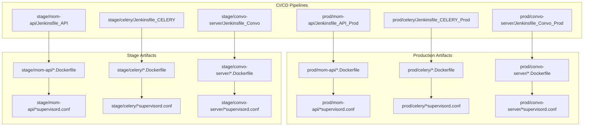
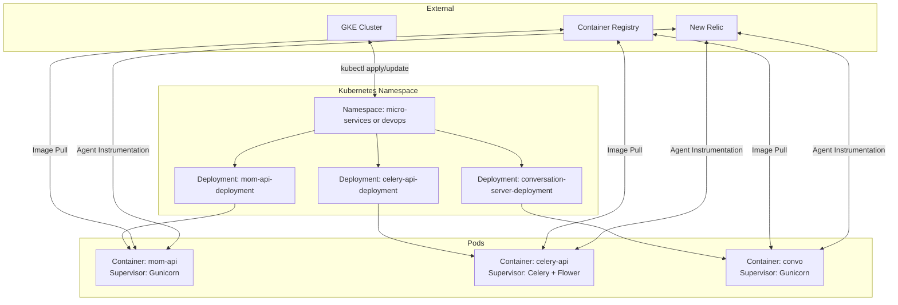
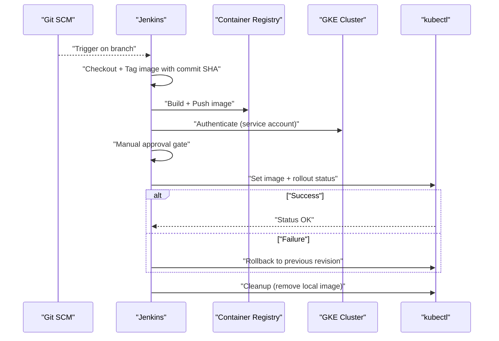
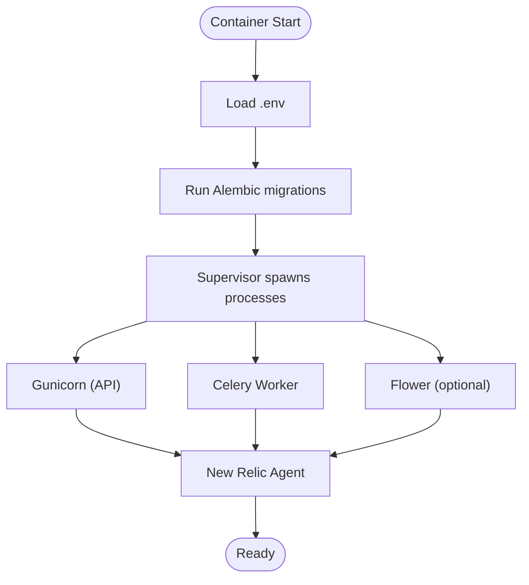
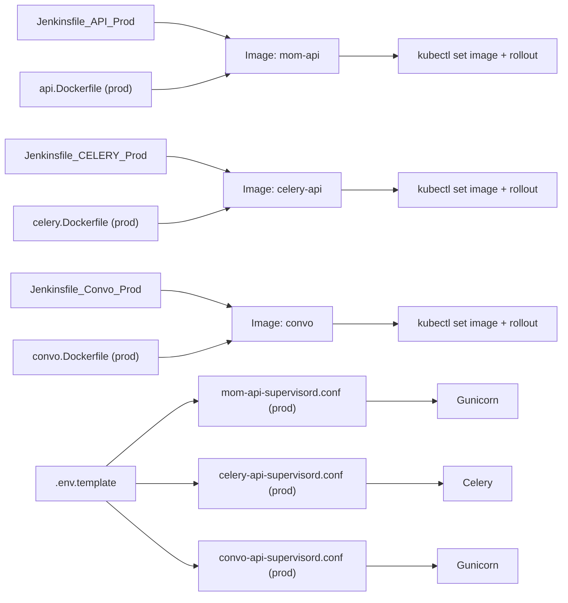

# Production Deployment

<cite>
**Referenced Files in This Document**
- [Jenkinsfile_API_Prod](file://deployment/prod/mom-api/Jenkinsfile_API_Prod)
- [Jenkinsfile_CELERY_Prod](file://deployment/prod/celery/Jenkinsfile_CELERY_Prod)
- [Jenkinsfile_Convo_Prod](file://deployment/prod/convo-server/Jenkinsfile_Convo_Prod)
- [Jenkinsfile_API](file://deployment/stage/mom-api/Jenkinsfile_API)
- [Jenkinsfile_CELERY](file://deployment/stage/celery/Jenkinsfile_CELERY)
- [Jenkinsfile_Convo](file://deployment/stage/convo-server/Jenkinsfile_Convo)
- [api.Dockerfile (prod)](file://deployment/prod/mom-api/api.Dockerfile)
- [celery.Dockerfile (prod)](file://deployment/prod/celery/celery.Dockerfile)
- [convo.Dockerfile (prod)](file://deployment/prod/convo-server/convo.Dockerfile)
- [api.Dockerfile (stage)](file://deployment/stage/mom-api/api.Dockerfile)
- [celery.Dockerfile (stage)](file://deployment/stage/celery/celery.Dockerfile)
- [convo.Dockerfile (stage)](file://deployment/stage/convo-server/convo.Dockerfile)
- [mom-api-supervisord.conf (prod)](file://deployment/prod/mom-api/mom-api-supervisord.conf)
- [celery-api-supervisord.conf (prod)](file://deployment/prod/celery/celery-api-supervisord.conf)
- [convo-api-supervisord.conf (prod)](file://deployment/prod/convo-server/convo-api-supervisord.conf)
- [mom-api-supervisord.conf (stage)](file://deployment/stage/mom-api/mom-api-supervisord.conf)
- [celery-api-supervisord.conf (stage)](file://deployment/stage/celery/celery-api-supervisord.conf)
- [convo-api-supervisord.conf (stage)](file://deployment/stage/convo-server/convo-api-supervisord.conf)
- [main.py](file://app/main.py)
- [celery_app.py](file://app/celery/celery_app.py)
- [worker.py](file://app/celery/worker.py)
- [alembic env.py](file://app/alembic/env.py)
- [docker-compose.yaml](file://docker-compose.yaml)
- [.env.template](file://.env.template)
</cite>

## Table of Contents
1. [Introduction](#introduction)
2. [Project Structure](#project-structure)
3. [Core Components](#core-components)
4. [Architecture Overview](#architecture-overview)
5. [Detailed Component Analysis](#detailed-component-analysis)
6. [Dependency Analysis](#dependency-analysis)
7. [Performance Considerations](#performance-considerations)
8. [Troubleshooting Guide](#troubleshooting-guide)
9. [Conclusion](#conclusion)
10. [Appendices](#appendices)

## Introduction
This document provides enterprise-grade production deployment guidance for Potpie across development, staging, and production environments. It covers CI/CD pipelines, environment-specific configurations, service orchestration, high availability, blue-green and canary strategies, monitoring and logging, disaster recovery, scaling, and cost optimization. The content aligns with the repository’s Jenkins pipelines, Dockerfiles, and Supervisor configurations to ensure accurate, actionable guidance for both beginners and experienced DevOps engineers.

## Project Structure
Potpie’s deployment assets are organized per environment and service:
- deployment/
  - prod/ and stage/
    - mom-api/, celery/, convo-server/
      - Jenkinsfile_*: CI/CD pipelines
      - *.Dockerfile: Container builds
      - *_supervisord.conf: Process supervision
- app/: Application code and Celery workers
- docker-compose.yaml and .env.template: Local and shared environment templates

**Diagram sources**
- [Jenkinsfile_API_Prod](file://deployment/prod/mom-api/Jenkinsfile_API_Prod#L1-L165)
- [Jenkinsfile_CELERY_Prod](file://deployment/prod/celery/Jenkinsfile_CELERY_Prod#L1-L165)
- [Jenkinsfile_Convo_Prod](file://deployment/prod/convo-server/Jenkinsfile_Convo_Prod#L1-L167)
- [Jenkinsfile_API](file://deployment/stage/mom-api/Jenkinsfile_API#L1-L155)
- [Jenkinsfile_CELERY](file://deployment/stage/celery/Jenkinsfile_CELERY#L1-L155)
- [Jenkinsfile_Convo](file://deployment/stage/convo-server/Jenkinsfile_Convo#L1-L155)
- [api.Dockerfile (prod)](file://deployment/prod/mom-api/api.Dockerfile#L1-L46)
- [celery.Dockerfile (prod)](file://deployment/prod/celery/celery.Dockerfile#L1-L46)
- [convo.Dockerfile (prod)](file://deployment/prod/convo-server/convo.Dockerfile#L1-L43)
- [api.Dockerfile (stage)](file://deployment/stage/mom-api/api.Dockerfile#L1-L46)
- [celery.Dockerfile (stage)](file://deployment/stage/celery/celery.Dockerfile#L1-L46)
- [convo.Dockerfile (stage)](file://deployment/stage/convo-server/convo.Dockerfile#L1-L43)
- [mom-api-supervisord.conf (prod)](file://deployment/prod/mom-api/mom-api-supervisord.conf#L1-L14)
- [celery-api-supervisord.conf (prod)](file://deployment/prod/celery/celery-api-supervisord.conf#L1-L14)
- [convo-api-supervisord.conf (prod)](file://deployment/prod/convo-server/convo-api-supervisord.conf#L1-L14)
- [mom-api-supervisord.conf (stage)](file://deployment/stage/mom-api/mom-api-supervisord.conf#L1-L14)
- [celery-api-supervisord.conf (stage)](file://deployment/stage/celery/celery-api-supervisord.conf#L1-L14)
- [convo-api-supervisord.conf (stage)](file://deployment/stage/convo-server/convo-api-supervisord.conf#L1-L14)

**Section sources**
- [Jenkinsfile_API_Prod](file://deployment/prod/mom-api/Jenkinsfile_API_Prod#L1-L165)
- [Jenkinsfile_CELERY_Prod](file://deployment/prod/celery/Jenkinsfile_CELERY_Prod#L1-L165)
- [Jenkinsfile_Convo_Prod](file://deployment/prod/convo-server/Jenkinsfile_Convo_Prod#L1-L167)
- [Jenkinsfile_API](file://deployment/stage/mom-api/Jenkinsfile_API#L1-L155)
- [Jenkinsfile_CELERY](file://deployment/stage/celery/Jenkinsfile_CELERY#L1-L155)
- [Jenkinsfile_Convo](file://deployment/stage/convo-server/Jenkinsfile_Convo#L1-L155)
- [api.Dockerfile (prod)](file://deployment/prod/mom-api/api.Dockerfile#L1-L46)
- [celery.Dockerfile (prod)](file://deployment/prod/celery/celery.Dockerfile#L1-L46)
- [convo.Dockerfile (prod)](file://deployment/prod/convo-server/convo.Dockerfile#L1-L43)
- [api.Dockerfile (stage)](file://deployment/stage/mom-api/api.Dockerfile#L1-L46)
- [celery.Dockerfile (stage)](file://deployment/stage/celery/celery.Dockerfile#L1-L46)
- [convo.Dockerfile (stage)](file://deployment/stage/convo-server/convo.Dockerfile#L1-L43)

## Core Components
- Mom-API (REST API): Orchestrated via Gunicorn under Supervisor, instrumented with New Relic, and migrated with Alembic on startup.
- Celery Worker: Runs task queues for parsing and agent tasks, supervised by Supervisor and monitored by New Relic.
- Conversation Server: Serves streaming and real-time features, also supervised and instrumented.
- CI/CD: Jenkins pipelines build images, push to registry, authenticate to GKE, deploy via kubectl, and roll back on failure.
- Environment Config: .env.template defines environment variables consumed by Supervisor commands.

Key operational characteristics:
- Process supervision with Supervisor ensures single-container multi-process execution.
- Alembic migrations run at container startup to keep DB schema aligned.
- New Relic agent wraps process execution for observability.
- Rollback on deployment failure is automated via kubectl rollout undo.

**Section sources**
- [mom-api-supervisord.conf (prod)](file://deployment/prod/mom-api/mom-api-supervisord.conf#L5-L14)
- [celery-api-supervisord.conf (prod)](file://deployment/prod/celery/celery-api-supervisord.conf#L5-L14)
- [convo-api-supervisord.conf (prod)](file://deployment/prod/convo-server/convo-api-supervisord.conf#L5-L14)
- [mom-api-supervisord.conf (stage)](file://deployment/stage/mom-api/mom-api-supervisord.conf#L5-L14)
- [celery-api-supervisord.conf (stage)](file://deployment/stage/celery/celery-api-supervisord.conf#L5-L14)
- [convo-api-supervisord.conf (stage)](file://deployment/stage/convo-server/convo-api-supervisord.conf#L5-L14)
- [api.Dockerfile (prod)](file://deployment/prod/mom-api/api.Dockerfile#L29-L45)
- [celery.Dockerfile (prod)](file://deployment/prod/celery/celery.Dockerfile#L29-L45)
- [convo.Dockerfile (prod)](file://deployment/prod/convo-server/convo.Dockerfile#L29-L42)
- [api.Dockerfile (stage)](file://deployment/stage/mom-api/api.Dockerfile#L29-L45)
- [celery.Dockerfile (stage)](file://deployment/stage/celery/celery.Dockerfile#L29-L45)
- [convo.Dockerfile (stage)](file://deployment/stage/convo-server/convo.Dockerfile#L29-L42)
- [Jenkinsfile_API_Prod](file://deployment/prod/mom-api/Jenkinsfile_API_Prod#L105-L130)
- [Jenkinsfile_CELERY_Prod](file://deployment/prod/celery/Jenkinsfile_CELERY_Prod#L105-L130)
- [Jenkinsfile_Convo_Prod](file://deployment/prod/convo-server/Jenkinsfile_Convo_Prod#L107-L132)
- [Jenkinsfile_API](file://deployment/stage/mom-api/Jenkinsfile_API#L95-L120)
- [Jenkinsfile_CELERY](file://deployment/stage/celery/Jenkinsfile_CELERY#L95-L120)
- [Jenkinsfile_Convo](file://deployment/stage/convo-server/Jenkinsfile_Convo#L95-L120)
- [.env.template](file://.env.template)

## Architecture Overview
The production architecture centers on Kubernetes deployments with rolling updates and rollback safety. Each service runs a single container with multiple supervised processes:
- Mom-API: Gunicorn + Alembic + New Relic
- Celery: Celery worker + Flower + Alembic + New Relic
- Conversation Server: Gunicorn + Alembic + New Relic

**Diagram sources**
- [Jenkinsfile_API_Prod](file://deployment/prod/mom-api/Jenkinsfile_API_Prod#L105-L130)
- [Jenkinsfile_CELERY_Prod](file://deployment/prod/celery/Jenkinsfile_CELERY_Prod#L105-L130)
- [Jenkinsfile_Convo_Prod](file://deployment/prod/convo-server/Jenkinsfile_Convo_Prod#L107-L132)
- [mom-api-supervisord.conf (prod)](file://deployment/prod/mom-api/mom-api-supervisord.conf#L5-L14)
- [celery-api-supervisord.conf (prod)](file://deployment/prod/celery/celery-api-supervisord.conf#L5-L14)
- [convo-api-supervisord.conf (prod)](file://deployment/prod/convo-server/convo-api-supervisord.conf#L5-L14)

## Detailed Component Analysis

### CI/CD Pipelines and Release Control
- Branch gating and environment selection: Pipelines validate branches and set environment variables accordingly.
- Docker build and push: Images tagged with short Git commit SHA are built and pushed to configured registries.
- GKE authentication: Service account activation and cluster credential retrieval enable kubectl operations.
- Manual promotion gate: An input step requires explicit approval before deployment.
- Deployment and rollback: kubectl rollout status validates success; on failure, kubectl rollout undo reverts to the previous revision.
- Cleanup: Post-stage removes local images to save disk space.

**Diagram sources**
- [Jenkinsfile_API_Prod](file://deployment/prod/mom-api/Jenkinsfile_API_Prod#L16-L165)
- [Jenkinsfile_CELERY_Prod](file://deployment/prod/celery/Jenkinsfile_CELERY_Prod#L16-L165)
- [Jenkinsfile_Convo_Prod](file://deployment/prod/convo-server/Jenkinsfile_Convo_Prod#L16-L167)
- [Jenkinsfile_API](file://deployment/stage/mom-api/Jenkinsfile_API#L16-L155)
- [Jenkinsfile_CELERY](file://deployment/stage/celery/Jenkinsfile_CELERY#L16-L155)
- [Jenkinsfile_Convo](file://deployment/stage/convo-server/Jenkinsfile_Convo#L16-L155)

**Section sources**
- [Jenkinsfile_API_Prod](file://deployment/prod/mom-api/Jenkinsfile_API_Prod#L16-L165)
- [Jenkinsfile_CELERY_Prod](file://deployment/prod/celery/Jenkinsfile_CELERY_Prod#L16-L165)
- [Jenkinsfile_Convo_Prod](file://deployment/prod/convo-server/Jenkinsfile_Convo_Prod#L16-L167)
- [Jenkinsfile_API](file://deployment/stage/mom-api/Jenkinsfile_API#L16-L155)
- [Jenkinsfile_CELERY](file://deployment/stage/celery/Jenkinsfile_CELERY#L16-L155)
- [Jenkinsfile_Convo](file://deployment/stage/convo-server/Jenkinsfile_Convo#L16-L155)

### Service Orchestration and Process Supervision
Each service container runs Supervisor to manage processes:
- Mom-API and Conversation Server: Gunicorn process supervised with New Relic instrumentation and Alembic migrations executed at startup.
- Celery: Celery worker supervised with queue configuration, concurrency, and memory limits; optional Flower endpoint exposed.

**Diagram sources**
- [mom-api-supervisord.conf (prod)](file://deployment/prod/mom-api/mom-api-supervisord.conf#L5-L14)
- [celery-api-supervisord.conf (prod)](file://deployment/prod/celery/celery-api-supervisord.conf#L5-L14)
- [convo-api-supervisord.conf (prod)](file://deployment/prod/convo-server/convo-api-supervisord.conf#L5-L14)
- [api.Dockerfile (prod)](file://deployment/prod/mom-api/api.Dockerfile#L29-L45)
- [celery.Dockerfile (prod)](file://deployment/prod/celery/celery.Dockerfile#L29-L45)
- [convo.Dockerfile (prod)](file://deployment/prod/convo-server/convo.Dockerfile#L29-L42)

**Section sources**
- [mom-api-supervisord.conf (prod)](file://deployment/prod/mom-api/mom-api-supervisord.conf#L5-L14)
- [celery-api-supervisord.conf (prod)](file://deployment/prod/celery/celery-api-supervisord.conf#L5-L14)
- [convo-api-supervisord.conf (prod)](file://deployment/prod/convo-server/convo-api-supervisord.conf#L5-L14)
- [api.Dockerfile (prod)](file://deployment/prod/mom-api/api.Dockerfile#L29-L45)
- [celery.Dockerfile (prod)](file://deployment/prod/celery/celery.Dockerfile#L29-L45)
- [convo.Dockerfile (prod)](file://deployment/prod/convo-server/convo.Dockerfile#L29-L42)

### Environment-Specific Settings
- Production vs Stage differences:
  - Namespaces differ (e.g., micro-services vs devops).
  - Branch gating differs (production pipelines restrict to specific branches).
  - Supervisor and Dockerfiles are identical per service, ensuring parity in process supervision and build steps.
- Shared environment variables are loaded from .env via Supervisor command invocation.

Practical guidance:
- Use separate namespaces per environment to isolate resources.
- Maintain distinct credentials for registries and GCP service accounts per environment.
- Keep .env.template synchronized with required keys for each service.

**Section sources**
- [Jenkinsfile_API_Prod](file://deployment/prod/mom-api/Jenkinsfile_API_Prod#L4-L6)
- [Jenkinsfile_API](file://deployment/stage/mom-api/Jenkinsfile_API#L4-L6)
- [Jenkinsfile_CELERY_Prod](file://deployment/prod/celery/Jenkinsfile_CELERY_Prod#L4-L6)
- [Jenkinsfile_CELERY](file://deployment/stage/celery/Jenkinsfile_CELERY#L4-L6)
- [Jenkinsfile_Convo_Prod](file://deployment/prod/convo-server/Jenkinsfile_Convo_Prod#L4-L6)
- [Jenkinsfile_Convo](file://deployment/stage/convo-server/Jenkinsfile_Convo#L4-L6)
- [.env.template](file://.env.template)

### High Availability and Rolling Updates
- Rolling updates: kubectl rollout status verifies deployment health after image update.
- Rollback on failure: Automatic rollback to the previous revision prevents prolonged outages.
- Pod readiness: Supervisor-managed processes must start successfully; otherwise, pods remain unhealthy.

Operational tips:
- Monitor rollout progress and pod status post-deploy.
- Use manual approval gates to reduce risk during production pushes.
- Ensure adequate replicas and resource requests/limits for HA.

**Section sources**
- [Jenkinsfile_API_Prod](file://deployment/prod/mom-api/Jenkinsfile_API_Prod#L105-L130)
- [Jenkinsfile_CELERY_Prod](file://deployment/prod/celery/Jenkinsfile_CELERY_Prod#L105-L130)
- [Jenkinsfile_Convo_Prod](file://deployment/prod/convo-server/Jenkinsfile_Convo_Prod#L107-L132)
- [Jenkinsfile_API](file://deployment/stage/mom-api/Jenkinsfile_API#L95-L120)
- [Jenkinsfile_CELERY](file://deployment/stage/celery/Jenkinsfile_CELERY#L95-L120)
- [Jenkinsfile_Convo](file://deployment/stage/convo-server/Jenkinsfile_Convo#L95-L120)

### Blue-Green and Canary Deployments
Conceptual guidance:
- Blue-Green: Maintain two identical environments (blue/green). Switch traffic by updating a routing rule to point to the newly deployed green environment. Validate and switch back if issues arise.
- Canary: Gradually shift a small percentage of traffic to the new version. Monitor metrics and slow-roll if errors increase.

Implementation considerations:
- Use separate namespaces or dedicated deployments per environment.
- Employ traffic splitting at the ingress or service mesh level.
- Automate rollback thresholds with alerting.

[No sources needed since this section provides conceptual guidance]

### Monitoring, Logging, and Alerting
- Observability: New Relic agent wraps process execution for all services, enabling performance and error tracking.
- Logs: Supervisor stdout/stderr logs are streamed to container logs for collection by platform log systems.
- Recommendations:
  - Centralize logs using a managed log aggregator.
  - Configure alerting on error rates, latency p95, and pod restart counts.
  - Add synthetic checks for critical endpoints.

**Section sources**
- [api.Dockerfile (prod)](file://deployment/prod/mom-api/api.Dockerfile#L29-L45)
- [celery.Dockerfile (prod)](file://deployment/prod/celery/celery.Dockerfile#L29-L45)
- [convo.Dockerfile (prod)](file://deployment/prod/convo-server/convo.Dockerfile#L29-L42)
- [mom-api-supervisord.conf (prod)](file://deployment/prod/mom-api/mom-api-supervisord.conf#L5-L14)
- [celery-api-supervisord.conf (prod)](file://deployment/prod/celery/celery-api-supervisord.conf#L5-L14)
- [convo-api-supervisord.conf (prod)](file://deployment/prod/convo-server/convo-api-supervisord.conf#L5-L14)

### Disaster Recovery, Backups, and Maintenance Windows
- Backup strategy:
  - Database backups: Schedule regular snapshots of managed databases.
  - Artifact retention: Maintain recent image digests for quick restoration.
- Disaster recovery:
  - Rebuild environments from manifests and restore data from backups.
  - Validate rollback procedures regularly.
- Maintenance windows:
  - Perform deployments during scheduled maintenance windows.
  - Communicate planned downtime and rollback readiness.

[No sources needed since this section provides general guidance]

### Scaling Patterns and Cost Optimization
- Horizontal scaling: Increase replica counts for stateless services (API servers) behind load balancers.
- Resource requests/limits: Right-size CPU/memory per workload to avoid throttling and overprovisioning.
- Auto-scaling: Enable HPA based on CPU/utilization or custom metrics.
- Cost controls:
  - Use reserved instances or sustained use discounts for predictable workloads.
  - Consolidate under-utilized namespaces.
  - Monitor and remove unused images and volumes.

[No sources needed since this section provides general guidance]

## Dependency Analysis
The deployment relies on coordinated components across CI/CD, containerization, and Kubernetes:

**Diagram sources**
- [Jenkinsfile_API_Prod](file://deployment/prod/mom-api/Jenkinsfile_API_Prod#L50-L73)
- [Jenkinsfile_CELERY_Prod](file://deployment/prod/celery/Jenkinsfile_CELERY_Prod#L50-L73)
- [Jenkinsfile_Convo_Prod](file://deployment/prod/convo-server/Jenkinsfile_Convo_Prod#L52-L75)
- [api.Dockerfile (prod)](file://deployment/prod/mom-api/api.Dockerfile#L1-L46)
- [celery.Dockerfile (prod)](file://deployment/prod/celery/celery.Dockerfile#L1-L46)
- [convo.Dockerfile (prod)](file://deployment/prod/convo-server/convo.Dockerfile#L1-L43)
- [mom-api-supervisord.conf (prod)](file://deployment/prod/mom-api/mom-api-supervisord.conf#L5-L14)
- [celery-api-supervisord.conf (prod)](file://deployment/prod/celery/celery-api-supervisord.conf#L5-L14)
- [convo-api-supervisord.conf (prod)](file://deployment/prod/convo-server/convo-api-supervisord.conf#L5-L14)
- [.env.template](file://.env.template)

**Section sources**
- [Jenkinsfile_API_Prod](file://deployment/prod/mom-api/Jenkinsfile_API_Prod#L50-L130)
- [Jenkinsfile_CELERY_Prod](file://deployment/prod/celery/Jenkinsfile_CELERY_Prod#L50-L130)
- [Jenkinsfile_Convo_Prod](file://deployment/prod/convo-server/Jenkinsfile_Convo_Prod#L52-L132)
- [api.Dockerfile (prod)](file://deployment/prod/mom-api/api.Dockerfile#L1-L46)
- [celery.Dockerfile (prod)](file://deployment/prod/celery/celery.Dockerfile#L1-L46)
- [convo.Dockerfile (prod)](file://deployment/prod/convo-server/convo.Dockerfile#L1-L43)
- [mom-api-supervisord.conf (prod)](file://deployment/prod/mom-api/mom-api-supervisord.conf#L5-L14)
- [celery-api-supervisord.conf (prod)](file://deployment/prod/celery/celery-api-supervisord.conf#L5-L14)
- [convo-api-supervisord.conf (prod)](file://deployment/prod/convo-server/convo-api-supervisord.conf#L5-L14)
- [.env.template](file://.env.template)

## Performance Considerations
- Process sizing:
  - Gunicorn workers scale with CPU cores; ensure appropriate CPU requests/limits.
  - Celery concurrency tuned per workload; memory limits prevent leaks.
- Network and timeouts:
  - Gunicorn timeout configured for long-running operations.
- Observability:
  - New Relic agent adds overhead; monitor to balance visibility and performance.
- Storage:
  - Ensure persistent volumes for caches and logs if needed; otherwise rely on ephemeral storage.

[No sources needed since this section provides general guidance]

## Troubleshooting Guide
Common issues and remedies:
- Deployment stuck or failing:
  - Verify rollout status and pod logs; check Supervisor logs for process failures.
  - Trigger rollback using the documented rollback step in the pipelines.
- Migration failures:
  - Confirm database connectivity and schema permissions; Alembic runs at startup.
- Registry authentication:
  - Ensure gcloud configure-docker ran with correct registry host.
- Environment variables:
  - Confirm .env values are present and readable by Supervisor.

**Section sources**
- [Jenkinsfile_API_Prod](file://deployment/prod/mom-api/Jenkinsfile_API_Prod#L105-L130)
- [Jenkinsfile_CELERY_Prod](file://deployment/prod/celery/Jenkinsfile_CELERY_Prod#L105-L130)
- [Jenkinsfile_Convo_Prod](file://deployment/prod/convo-server/Jenkinsfile_Convo_Prod#L107-L132)
- [mom-api-supervisord.conf (prod)](file://deployment/prod/mom-api/mom-api-supervisord.conf#L5-L14)
- [celery-api-supervisord.conf (prod)](file://deployment/prod/celery/celery-api-supervisord.conf#L5-L14)
- [convo-api-supervisord.conf (prod)](file://deployment/prod/convo-server/convo-api-supervisord.conf#L5-L14)
- [alembic env.py](file://app/alembic/env.py)

## Conclusion
Potpie’s production deployment model leverages robust CI/CD pipelines, containerized services with Supervisor-based orchestration, and Kubernetes rollouts with automatic rollback. By applying the strategies outlined—environment isolation, blue-green/canary practices, observability, and disciplined scaling—you can achieve reliable, scalable, and secure operations across development, staging, and production.

[No sources needed since this section summarizes without analyzing specific files]

## Appendices

### Appendix A: Environment Variables Reference
- Required keys are loaded from .env via Supervisor command sourcing.
- Keys include database URIs, queue names, and provider credentials referenced by services.

**Section sources**
- [.env.template](file://.env.template)
- [mom-api-supervisord.conf (prod)](file://deployment/prod/mom-api/mom-api-supervisord.conf#L6)
- [celery-api-supervisord.conf (prod)](file://deployment/prod/celery/celery-api-supervisord.conf#L6)
- [convo-api-supervisord.conf (prod)](file://deployment/prod/convo-server/convo-api-supervisord.conf#L6)

### Appendix B: Local Development Notes
- docker-compose.yaml and start scripts support local orchestration for development and testing.
- These assets help validate environment configuration and service startup locally before deploying.

**Section sources**
- [docker-compose.yaml](file://docker-compose.yaml)
- [start.sh](file://start.sh)
- [start_event_worker.sh](file://start_event_worker.sh)
- [start_event_listener.sh](file://start_event_listener.sh)