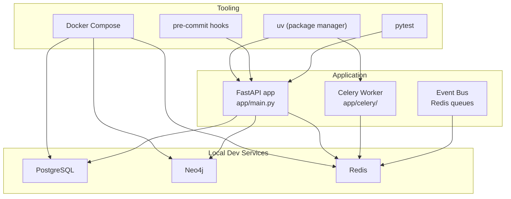
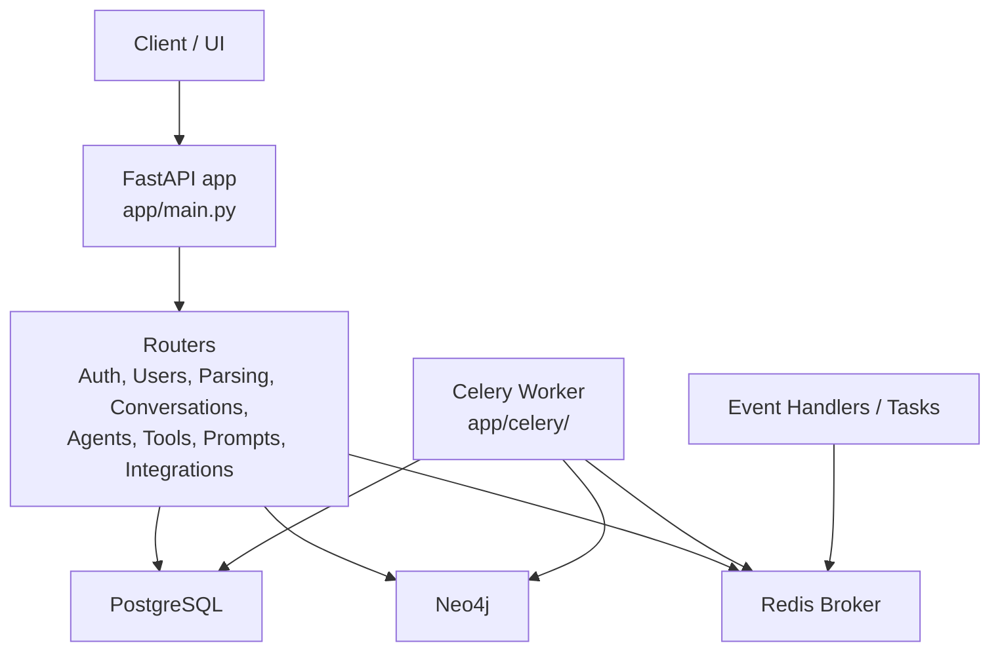
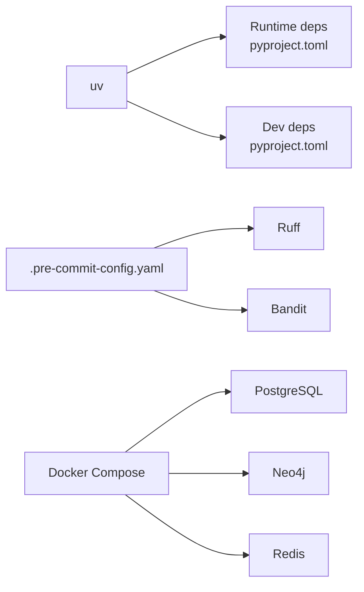

# Development Guidelines

<cite>
**Referenced Files in This Document**
- [README.md](file://README.md)
- [GETTING_STARTED.md](file://GETTING_STARTED.md)
- [contributing.md](file://contributing.md)
- [pyproject.toml](file://pyproject.toml)
- [.pre-commit-config.yaml](file://.pre-commit-config.yaml)
- [pytest.ini](file://pytest.ini)
- [docker-compose.yaml](file://docker-compose.yaml)
- [Jenkinsfile](file://Jenkinsfile)
- [supervisord.conf](file://supervisord.conf)
- [.env.template](file://.env.template)
- [app/main.py](file://app/main.py)
- [start_event_listener.sh](file://start_event_listener.sh)
- [start_event_worker.sh](file://start_event_worker.sh)
- [stop.sh](file://stop.sh)
</cite>

## Table of Contents
1. [Introduction](#introduction)
2. [Project Structure](#project-structure)
3. [Core Components](#core-components)
4. [Architecture Overview](#architecture-overview)
5. [Detailed Component Analysis](#detailed-component-analysis)
6. [Dependency Analysis](#dependency-analysis)
7. [Performance Considerations](#performance-considerations)
8. [Troubleshooting Guide](#troubleshooting-guide)
9. [Conclusion](#conclusion)
10. [Appendices](#appendices)

## Introduction
This document provides comprehensive development guidelines for contributing to Potpie. It covers code standards, testing strategy, development workflow, contribution procedures, quality assurance processes, environment configuration, debugging, performance profiling, and release procedures. The guidelines are grounded in the repository’s configuration and scripts to ensure consistency with the existing setup.

## Project Structure
Potpie is a FastAPI-based backend with integrated Celery workers, Neo4j, PostgreSQL, and Redis. Development relies on uv for dependency management, Docker Compose for local services, and pre-commit hooks for code quality. Tests are organized under module-specific test suites and configured via pytest markers.

**Diagram sources**
- [docker-compose.yaml](file://docker-compose.yaml#L1-L57)
- [app/main.py](file://app/main.py#L1-L217)
- [pyproject.toml](file://pyproject.toml#L1-L112)
- [.pre-commit-config.yaml](file://.pre-commit-config.yaml#L1-L30)
- [pytest.ini](file://pytest.ini#L1-L31)

**Section sources**
- [docker-compose.yaml](file://docker-compose.yaml#L1-L57)
- [app/main.py](file://app/main.py#L1-L217)
- [pyproject.toml](file://pyproject.toml#L1-L112)
- [.pre-commit-config.yaml](file://.pre-commit-config.yaml#L1-L30)
- [pytest.ini](file://pytest.ini#L1-L31)

## Core Components
- FastAPI application entrypoint initializes routers, logging, CORS, Sentry (in production), and Phoenix tracing. It also sets up a health endpoint and performs database initialization on startup.
- Celery worker runs via supervisord with configurable queue names and concurrency. Event bus tasks are isolated on dedicated queues.
- Local services (PostgreSQL, Neo4j, Redis) are orchestrated by Docker Compose for development.
- Environment variables are managed via a template and loaded at runtime; development mode toggles Firebase setup and enables local parsing.

Key responsibilities:
- app/main.py: Application lifecycle, middleware, routing, health checks, and startup initialization.
- supervisord.conf: Manages Celery and Gunicorn processes inside containers.
- docker-compose.yaml: Defines local service dependencies and health checks.
- .env.template: Centralized environment configuration for local and production modes.

**Section sources**
- [app/main.py](file://app/main.py#L46-L217)
- [supervisord.conf](file://supervisord.conf#L1-L25)
- [docker-compose.yaml](file://docker-compose.yaml#L1-L57)
- [.env.template](file://.env.template#L1-L116)

## Architecture Overview
The system integrates FastAPI, Celery, and Redis for asynchronous task processing, with Neo4j and PostgreSQL for persistence. Phoenix tracing and Sentry are integrated conditionally for observability. Development mode simplifies setup by bypassing external dependencies.

**Diagram sources**
- [app/main.py](file://app/main.py#L13-L36)
- [docker-compose.yaml](file://docker-compose.yaml#L1-L57)
- [supervisord.conf](file://supervisord.conf#L5-L24)

**Section sources**
- [app/main.py](file://app/main.py#L13-L36)
- [docker-compose.yaml](file://docker-compose.yaml#L1-L57)
- [supervisord.conf](file://supervisord.conf#L5-L24)

## Detailed Component Analysis

### Development Environment Setup
- Install uv and ensure it is in PATH.
- Prepare .env from .env.template with required variables for development mode.
- Start local services with Docker Compose and run the application with uv.
- Optional: Phoenix tracing requires a separate local server process.

Practical steps:
- Install uv and create virtual environment via uv sync.
- Configure environment variables for databases, broker, provider models, and optional tracing.
- Bring up services with Docker Compose and start the API server.
- For event-driven features, start the event listener and worker scripts.

**Section sources**
- [GETTING_STARTED.md](file://GETTING_STARTED.md#L1-L61)
- [.env.template](file://.env.template#L1-L116)
- [docker-compose.yaml](file://docker-compose.yaml#L1-L57)
- [app/main.py](file://app/main.py#L46-L114)

### Testing Strategy
- Test discovery and markers are configured in pytest.ini.
- Tests are grouped under module-specific directories (e.g., auth tests).
- Async tests are supported with asyncio mode enabled.
- Coverage can be optionally enabled via pytest options.

Recommended practices:
- Add unit tests for new features and update existing tests when changing behavior.
- Use asyncio marker for async tests and strict markers to enforce test categorization.
- Run tests locally before submitting changes.

**Section sources**
- [pytest.ini](file://pytest.ini#L1-L31)

### Code Quality and Pre-commit Hooks
- Pre-commit hooks enforce YAML/TOML checks, whitespace fixes, merge conflict detection, large file limits, and debug statement checks.
- Ruff is used for linting and formatting with exclusions for Alembic migrations.
- Bandit is configured for security scanning with exclusions for test and Alembic directories.

Workflow:
- Install pre-commit and run it locally before committing.
- Fix lint/formatting issues flagged by Ruff.
- Address security concerns raised by Bandit.

**Section sources**
- [.pre-commit-config.yaml](file://.pre-commit-config.yaml#L1-L30)
- [pyproject.toml](file://pyproject.toml#L91-L112)

### Contribution Procedures
- Fork the repository, create a feature branch, and follow the development workflow.
- Commit messages should be descriptive; push to your fork and open a Pull Request.
- Describe changes and link related issues; request reviews and respond to feedback promptly.

**Section sources**
- [contributing.md](file://contributing.md#L63-L114)

### Continuous Integration and Release
- Jenkins pipeline builds Docker images tagged with the Git commit hash, authenticates with Docker and GCP, and deploys to GKE with user confirmation.
- Rollback is performed on deployment failure; cleanup removes local images after completion.

Release procedure:
- Merge approved PRs to supported branches.
- Pipeline triggers on selected branches, builds and pushes images, prompts for confirmation, and rolls back on failure.

**Section sources**
- [Jenkinsfile](file://Jenkinsfile#L1-L167)

### Debugging and Observability
- Sentry is initialized in production mode with explicit integrations.
- Phoenix tracing is initialized at startup; a local server can be launched for viewing traces.
- Logging middleware injects request context into logs for correlation.

Debugging tips:
- Use logging context middleware to correlate logs by request_id and user_id.
- Enable Phoenix tracing locally and view traces at the default endpoint.
- For async tasks, inspect Celery worker logs and Redis queues.

**Section sources**
- [app/main.py](file://app/main.py#L64-L129)

### Performance Profiling
- New Relic can wrap Celery and Gunicorn processes when a configuration file is present.
- Profiling sample rates are configured for Sentry in production.

Guidance:
- Use profiling tools during development and enable New Relic instrumentation when available.
- Monitor task latency and throughput via Celery Flower (included in dependencies).

**Section sources**
- [supervisord.conf](file://supervisord.conf#L6-L19)

### Adding New Features and Maintaining Compatibility
- Introduce new routers and integrate them into the main application.
- Ensure environment variables are documented in .env.template and validated at startup.
- Maintain backward compatibility by preserving existing API endpoints and schemas.
- Add tests for new functionality and update existing tests accordingly.

**Section sources**
- [app/main.py](file://app/main.py#L147-L171)
- [.env.template](file://.env.template#L1-L116)

### Backward Compatibility and Migration
- Alembic migrations are maintained under app/alembic/versions; follow standard migration practices.
- Keep migrations deterministic and reversible where possible.

**Section sources**
- [README.md](file://README.md#L1-L460)

### Event Bus and Task Processing
- Dedicated event listener and worker scripts demonstrate how to start and manage event-driven tasks.
- Queues are isolated for external events and Celery task events.

Operational commands:
- Start event listener and worker using provided scripts.
- Tail logs and stop processes using PIDs stored in pid files.

**Section sources**
- [start_event_listener.sh](file://start_event_listener.sh#L1-L44)
- [start_event_worker.sh](file://start_event_worker.sh#L1-L47)

### Stopping Services
- A stop script terminates FastAPI and Celery processes and shuts down Docker Compose services.

**Section sources**
- [stop.sh](file://stop.sh#L1-L16)

## Dependency Analysis
The project uses uv for dependency management and defines both runtime and development groups. Tooling includes Ruff for linting/formatting, Bandit for security, and pre-commit for local enforcement. Docker Compose orchestrates local services.

**Diagram sources**
- [pyproject.toml](file://pyproject.toml#L1-L112)
- [.pre-commit-config.yaml](file://.pre-commit-config.yaml#L1-L30)
- [docker-compose.yaml](file://docker-compose.yaml#L1-L57)

**Section sources**
- [pyproject.toml](file://pyproject.toml#L1-L112)
- [.pre-commit-config.yaml](file://.pre-commit-config.yaml#L1-L30)
- [docker-compose.yaml](file://docker-compose.yaml#L1-L57)

## Performance Considerations
- Use uv for efficient dependency resolution and virtual environment management.
- Configure Celery concurrency appropriately for CPU-bound vs I/O-bound tasks.
- Monitor task queues and adjust queue names and priorities as needed.
- Enable profiling and tracing in production environments to identify bottlenecks.

## Troubleshooting Guide
Common issues and resolutions:
- Sentry initialization failures are logged but non-fatal; investigate configuration and DSN.
- Phoenix tracing initialization failures are logged; ensure local Phoenix server is running when enabled.
- CORS misconfiguration can block frontend requests; verify allowed origins in environment.
- Redis connectivity issues halt event listeners/workers; confirm Redis is healthy and reachable.
- Docker Compose health checks ensure services are ready before application startup.

**Section sources**
- [app/main.py](file://app/main.py#L64-L99)
- [docker-compose.yaml](file://docker-compose.yaml#L15-L19)

## Conclusion
These guidelines consolidate the repository’s development practices, environment setup, testing, quality assurance, and release procedures. By following the outlined workflows—using uv, Docker Compose, pre-commit hooks, pytest, and Jenkins—you can contribute effectively while maintaining code quality and system reliability.

## Appendices

### Quick Start Checklist
- Install uv and run uv sync.
- Copy .env.template to .env and set required variables.
- Start Docker services and the application.
- Run tests and pre-commit hooks locally.
- Open a Pull Request with descriptive changes and links to issues.

**Section sources**
- [GETTING_STARTED.md](file://GETTING_STARTED.md#L1-L61)
- [.env.template](file://.env.template#L1-L116)
- [pytest.ini](file://pytest.ini#L1-L31)
- [.pre-commit-config.yaml](file://.pre-commit-config.yaml#L1-L30)