# Atlassian Suite Integration

<cite>
**Referenced Files in This Document**
- [atlassian_oauth_base.py](file://app/modules/integrations/atlassian_oauth_base.py)
- [jira_oauth.py](file://app/modules/integrations/jira_oauth.py)
- [confluence_oauth.py](file://app/modules/integrations/confluence_oauth.py)
- [linear_oauth.py](file://app/modules/integrations/linear_oauth.py)
- [integrations_service.py](file://app/modules/integrations/integrations_service.py)
- [integrations_router.py](file://app/modules/integrations/integrations_router.py)
- [integrations_schema.py](file://app/modules/integrations/integrations_schema.py)
- [integration_model.py](file://app/modules/integrations/integration_model.py)
- [token_encryption.py](file://app/modules/integrations/token_encryption.py)
- [add_jira_comment_tool.py](file://app/modules/intelligence/tools/jira_tools/add_jira_comment_tool.py)
- [update_jira_issue_tool.py](file://app/modules/intelligence/tools/jira_tools/update_jira_issue_tool.py)
- [update_confluence_page_tool.py](file://app/modules/intelligence/tools/confluence_tools/update_confluence_page_tool.py)
- [create_confluence_page_tool.py](file://app/modules/intelligence/tools/confluence_tools/create_confluence_page_tool.py)
</cite>

## Table of Contents
1. [Introduction](#introduction)
2. [Project Structure](#project-structure)
3. [Core Components](#core-components)
4. [Architecture Overview](#architecture-overview)
5. [Detailed Component Analysis](#detailed-component-analysis)
6. [Dependency Analysis](#dependency-analysis)
7. [Performance Considerations](#performance-considerations)
8. [Troubleshooting Guide](#troubleshooting-guide)
9. [Conclusion](#conclusion)
10. [Appendices](#appendices)

## Introduction
This document explains the Atlassian suite integration built for Jira, Confluence, and Linear within the application. It covers the shared OAuth base class, service-specific implementations, OAuth flows, token management, API communication patterns, and practical usage examples for creating Jira issues, updating Confluence pages, and managing Linear issues. It also documents authentication configuration, scope management, webhook handling for real-time updates, integration schemas, data models, error handling, rate limiting considerations, and best practices.

## Project Structure
The Atlassian integrations are implemented under the integrations module with a shared OAuth base class and product-specific adapters. Supporting components include the integration service, router endpoints, Pydantic schemas, database model, and token encryption utilities. Intelligence tools demonstrate how integrations are consumed to perform operations like adding comments to Jira issues and updating Confluence pages.

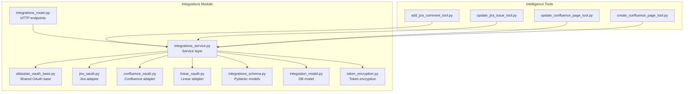

**Diagram sources**
- [atlassian_oauth_base.py](file://app/modules/integrations/atlassian_oauth_base.py#L56-L383)
- [jira_oauth.py](file://app/modules/integrations/jira_oauth.py#L12-L149)
- [confluence_oauth.py](file://app/modules/integrations/confluence_oauth.py#L16-L82)
- [linear_oauth.py](file://app/modules/integrations/linear_oauth.py#L51-L264)
- [integrations_service.py](file://app/modules/integrations/integrations_service.py#L40-L49)
- [integrations_router.py](file://app/modules/integrations/integrations_router.py#L1-L117)
- [integrations_schema.py](file://app/modules/integrations/integrations_schema.py#L1-L120)
- [integration_model.py](file://app/modules/integrations/integration_model.py#L7-L44)
- [token_encryption.py](file://app/modules/integrations/token_encryption.py#L14-L108)
- [add_jira_comment_tool.py](file://app/modules/intelligence/tools/jira_tools/add_jira_comment_tool.py#L44-L72)
- [update_jira_issue_tool.py](file://app/modules/intelligence/tools/jira_tools/update_jira_issue_tool.py#L75-L103)
- [update_confluence_page_tool.py](file://app/modules/intelligence/tools/confluence_tools/update_confluence_page_tool.py#L116-L191)
- [create_confluence_page_tool.py](file://app/modules/intelligence/tools/confluence_tools/create_confluence_page_tool.py#L114-L149)

**Section sources**
- [integrations_router.py](file://app/modules/integrations/integrations_router.py#L1-L117)
- [integrations_service.py](file://app/modules/integrations/integrations_service.py#L40-L49)

## Core Components
- Shared OAuth base class: Provides common OAuth 2.0 (3LO) infrastructure for Atlassian products, including authorization URL generation, token exchange, refresh, accessible resources discovery, callback handling, and token caching.
- Product-specific adapters:
  - Jira adapter: Extends the base class and adds Jira-specific API endpoints, scopes, and webhook management.
  - Confluence adapter: Extends the base class with Confluence-specific scopes; note that Confluence OAuth 2.0 apps cannot register webhooks programmatically.
  - Linear adapter: Standalone OAuth implementation for Linear’s OAuth flow and GraphQL user info retrieval.
- Integration service: Orchestrates OAuth flows, token persistence, encryption, webhook registration/cleanup, and exposes typed APIs for Jira/Confluence operations.
- Router endpoints: Expose OAuth initiation, callbacks, status checks, revocation, and webhook logging.
- Pydantic schemas and database model: Define integration data structures and persistence schema.
- Token encryption: Securely stores tokens using symmetric encryption.

**Section sources**
- [atlassian_oauth_base.py](file://app/modules/integrations/atlassian_oauth_base.py#L56-L383)
- [jira_oauth.py](file://app/modules/integrations/jira_oauth.py#L12-L149)
- [confluence_oauth.py](file://app/modules/integrations/confluence_oauth.py#L16-L82)
- [linear_oauth.py](file://app/modules/integrations/linear_oauth.py#L51-L264)
- [integrations_service.py](file://app/modules/integrations/integrations_service.py#L40-L49)
- [integrations_schema.py](file://app/modules/integrations/integrations_schema.py#L65-L96)
- [integration_model.py](file://app/modules/integrations/integration_model.py#L7-L44)
- [token_encryption.py](file://app/modules/integrations/token_encryption.py#L14-L108)

## Architecture Overview
The integration architecture follows a layered design:
- HTTP endpoints in the router trigger OAuth flows and expose status and webhook utilities.
- The service layer coordinates OAuth exchanges, token encryption, and integration persistence.
- Adapters encapsulate product-specific OAuth and API behaviors.
- The database persists integration metadata, encrypted tokens, and scope data.

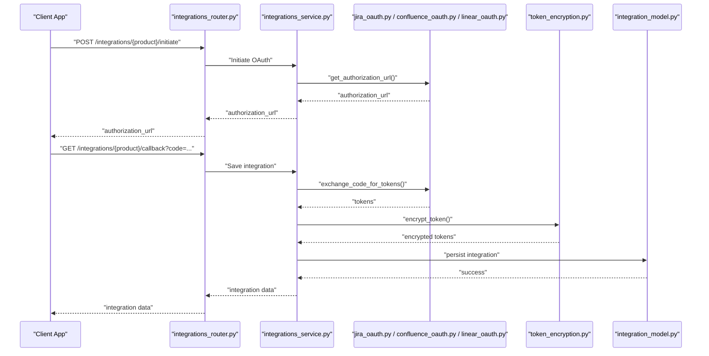

**Diagram sources**
- [integrations_router.py](file://app/modules/integrations/integrations_router.py#L617-L784)
- [integrations_service.py](file://app/modules/integrations/integrations_service.py#L1782-L2009)
- [jira_oauth.py](file://app/modules/integrations/jira_oauth.py#L12-L149)
- [confluence_oauth.py](file://app/modules/integrations/confluence_oauth.py#L16-L82)
- [linear_oauth.py](file://app/modules/integrations/linear_oauth.py#L51-L264)
- [token_encryption.py](file://app/modules/integrations/token_encryption.py#L63-L93)
- [integration_model.py](file://app/modules/integrations/integration_model.py#L7-L44)

## Detailed Component Analysis

### Shared OAuth Base Class (Atlassian)
The base class centralizes Atlassian OAuth 3LO behavior:
- Common endpoints: authorization, token exchange, and accessible resources discovery.
- State signing/unsigning for CSRF protection.
- Token caching with expiration checks.
- Callback parsing and error propagation.
- Product-specific overrides for scopes and API base URLs.

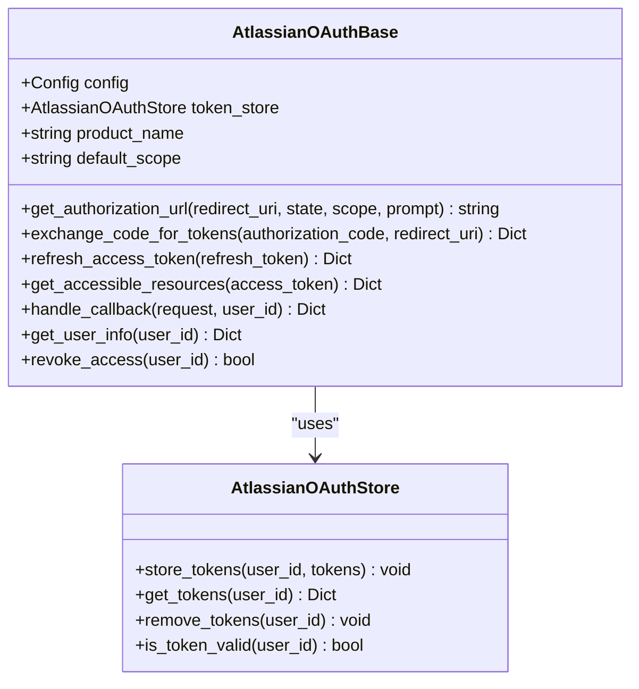

**Diagram sources**
- [atlassian_oauth_base.py](file://app/modules/integrations/atlassian_oauth_base.py#L56-L383)

**Section sources**
- [atlassian_oauth_base.py](file://app/modules/integrations/atlassian_oauth_base.py#L56-L383)

### Jira OAuth Adapter
- Extends the base class with Jira-specific scopes and API base URL construction.
- Adds webhook management: creation and deletion using Jira’s OAuth dynamic registration format.
- Supports accessible resources discovery to resolve site identifiers.

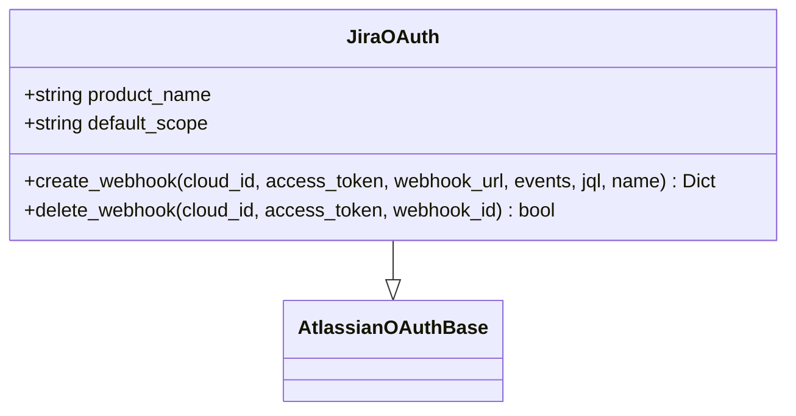

**Diagram sources**
- [jira_oauth.py](file://app/modules/integrations/jira_oauth.py#L12-L149)
- [atlassian_oauth_base.py](file://app/modules/integrations/atlassian_oauth_base.py#L56-L383)

**Section sources**
- [jira_oauth.py](file://app/modules/integrations/jira_oauth.py#L12-L149)

### Confluence OAuth Adapter
- Extends the base class with Confluence-specific scopes.
- Notes that Confluence OAuth 2.0 apps cannot register webhooks programmatically; webhooks are only available for Connect apps.

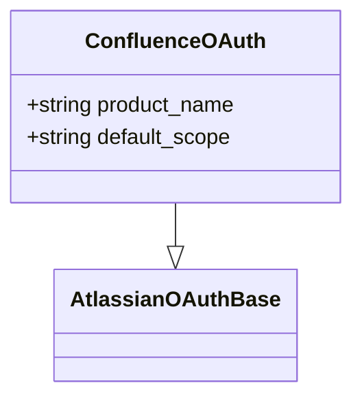

**Diagram sources**
- [confluence_oauth.py](file://app/modules/integrations/confluence_oauth.py#L16-L82)
- [atlassian_oauth_base.py](file://app/modules/integrations/atlassian_oauth_base.py#L56-L383)

**Section sources**
- [confluence_oauth.py](file://app/modules/integrations/confluence_oauth.py#L16-L82)

### Linear OAuth Adapter
- Standalone OAuth implementation for Linear’s OAuth flow and GraphQL user info retrieval.
- Manages token lifecycle and callback handling with token storage.

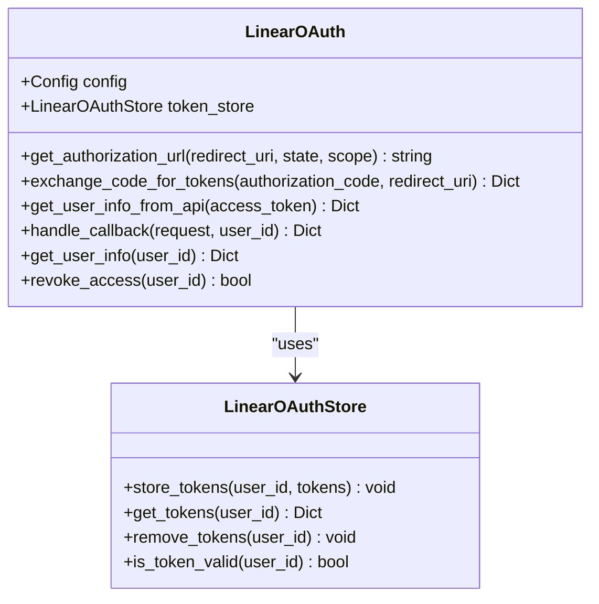

**Diagram sources**
- [linear_oauth.py](file://app/modules/integrations/linear_oauth.py#L51-L264)

**Section sources**
- [linear_oauth.py](file://app/modules/integrations/linear_oauth.py#L51-L264)

### Integration Service Layer
- Initializes adapters and manages OAuth flows, token encryption, and persistence.
- Provides typed APIs for Jira/Confluence operations, including accessible resources, projects, and project details.
- Handles webhook registration and cleanup for Jira integrations.
- Offers status checks and revocation utilities.

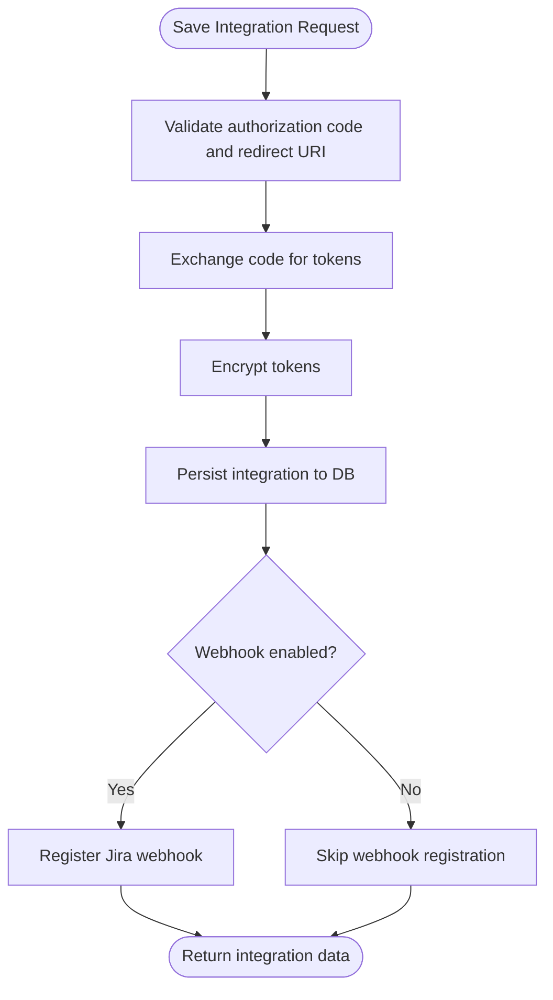

**Diagram sources**
- [integrations_service.py](file://app/modules/integrations/integrations_service.py#L1782-L2009)

**Section sources**
- [integrations_service.py](file://app/modules/integrations/integrations_service.py#L40-L49)
- [integrations_service.py](file://app/modules/integrations/integrations_service.py#L1782-L2009)

### Router Endpoints
- OAuth initiation and callback endpoints for Jira, Confluence, and Linear.
- Status and revocation endpoints per provider.
- Webhook logging endpoints for debugging.

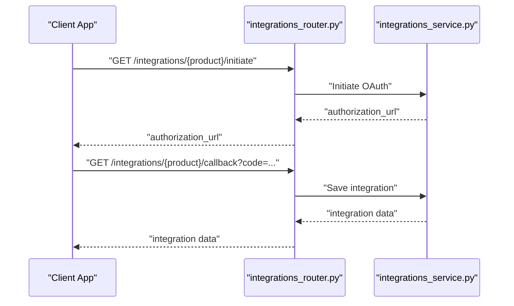

**Diagram sources**
- [integrations_router.py](file://app/modules/integrations/integrations_router.py#L617-L784)
- [integrations_service.py](file://app/modules/integrations/integrations_service.py#L1782-L2009)

**Section sources**
- [integrations_router.py](file://app/modules/integrations/integrations_router.py#L617-L784)

### Integration Schemas and Database Model
- Pydantic models define integration types, statuses, auth data, scope data, and metadata.
- Database model stores integration records with JSON fields for extensibility.

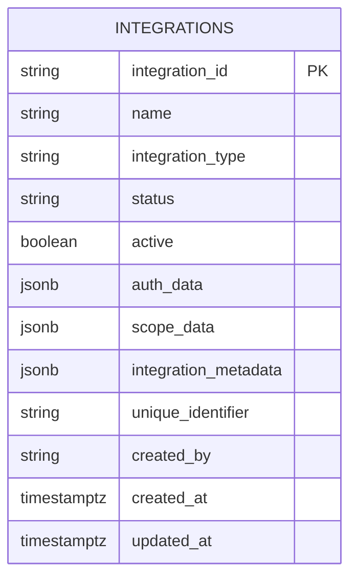

**Diagram sources**
- [integration_model.py](file://app/modules/integrations/integration_model.py#L7-L44)
- [integrations_schema.py](file://app/modules/integrations/integrations_schema.py#L65-L96)

**Section sources**
- [integrations_schema.py](file://app/modules/integrations/integrations_schema.py#L65-L96)
- [integration_model.py](file://app/modules/integrations/integration_model.py#L7-L44)

### Token Encryption Utilities
- Provides symmetric encryption/decryption for securely storing tokens.
- Initializes from environment key and supports development key generation.

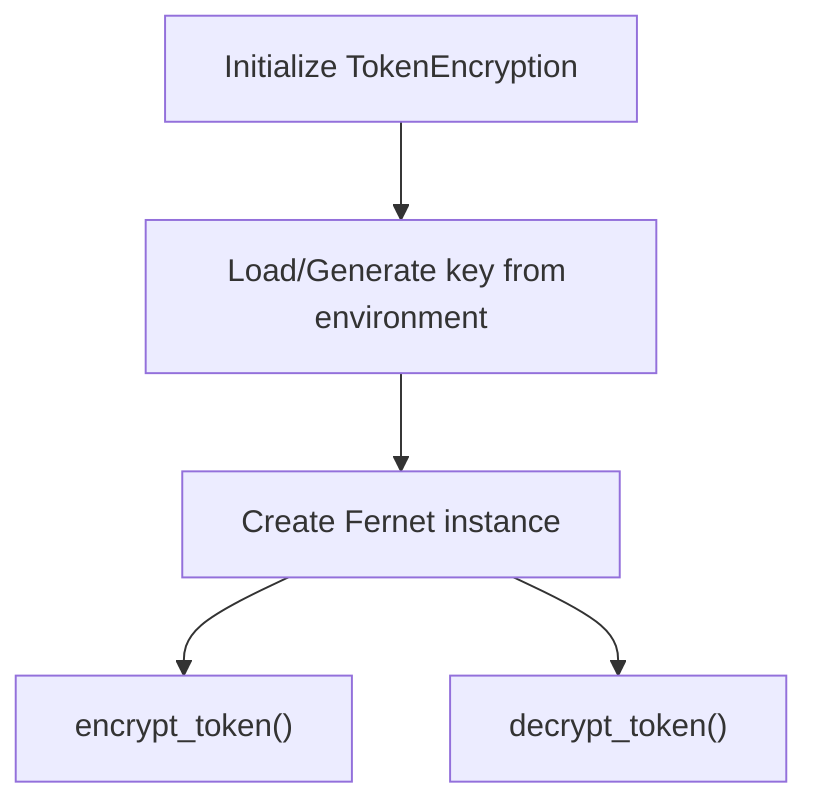

**Diagram sources**
- [token_encryption.py](file://app/modules/integrations/token_encryption.py#L14-L108)

**Section sources**
- [token_encryption.py](file://app/modules/integrations/token_encryption.py#L14-L108)

## Dependency Analysis
The integrations module composes several layers:
- Router depends on the service layer.
- Service depends on adapters, database model, and encryption utilities.
- Adapters depend on the shared OAuth base class and product-specific APIs.

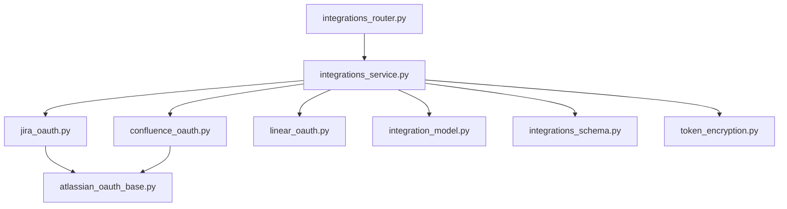

**Diagram sources**
- [integrations_router.py](file://app/modules/integrations/integrations_router.py#L1-L117)
- [integrations_service.py](file://app/modules/integrations/integrations_service.py#L40-L49)
- [jira_oauth.py](file://app/modules/integrations/jira_oauth.py#L12-L149)
- [confluence_oauth.py](file://app/modules/integrations/confluence_oauth.py#L16-L82)
- [linear_oauth.py](file://app/modules/integrations/linear_oauth.py#L51-L264)
- [integration_model.py](file://app/modules/integrations/integration_model.py#L7-L44)
- [integrations_schema.py](file://app/modules/integrations/integrations_schema.py#L65-L96)
- [token_encryption.py](file://app/modules/integrations/token_encryption.py#L14-L108)
- [atlassian_oauth_base.py](file://app/modules/integrations/atlassian_oauth_base.py#L56-L383)

**Section sources**
- [integrations_service.py](file://app/modules/integrations/integrations_service.py#L40-L49)

## Performance Considerations
- Asynchronous HTTP clients are used for OAuth exchanges and API calls to minimize latency.
- Token caching reduces repeated token exchanges for the same user.
- Webhook registration is attempted during integration creation; failures are logged but do not block integration persistence.
- Encryption operations occur only on token persistence and retrieval to balance security and performance.

[No sources needed since this section provides general guidance]

## Troubleshooting Guide
Common issues and resolutions:
- OAuth authorization failures:
  - Invalid or expired authorization codes, mismatched redirect URIs, or incorrect client credentials.
  - The service provides helpful error messages and sanitizes responses for logging.
- Token refresh failures:
  - Inspect sanitized error messages and full response bodies for structured details.
- Webhook registration failures:
  - Ensure webhook callback URL is configured; registration attempts are logged with warnings on failure.
- State verification failures:
  - Signed state tokens must be configured; otherwise, state verification falls back to raw state.

**Section sources**
- [integrations_service.py](file://app/modules/integrations/integrations_service.py#L196-L297)
- [integrations_router.py](file://app/modules/integrations/integrations_router.py#L119-L178)

## Conclusion
The Atlassian suite integration provides a robust, extensible framework for Jira, Confluence, and Linear OAuth flows. It leverages a shared base class for common behaviors, product-specific adapters for API nuances, and a service layer that manages encryption, persistence, and webhook lifecycle. The included schemas and database model enable flexible integration metadata storage. Practical tools demonstrate how integrations can be used to create and update issues and pages.

[No sources needed since this section summarizes without analyzing specific files]

## Appendices

### OAuth Flow for Jira
- Initiate OAuth via router endpoint to receive an authorization URL.
- After user consent, handle the callback to exchange the code for tokens.
- Persist integration with encrypted tokens and optionally register a webhook.

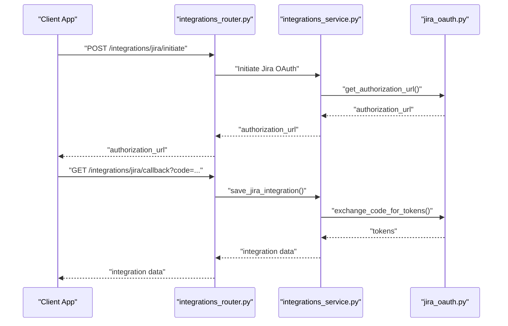

**Diagram sources**
- [integrations_router.py](file://app/modules/integrations/integrations_router.py#L617-L784)
- [integrations_service.py](file://app/modules/integrations/integrations_service.py#L1782-L2009)
- [jira_oauth.py](file://app/modules/integrations/jira_oauth.py#L12-L149)

### OAuth Flow for Confluence
- Similar to Jira, but Confluence OAuth 2.0 apps cannot register webhooks programmatically.

**Section sources**
- [integrations_router.py](file://app/modules/integrations/integrations_router.py#L617-L784)
- [integrations_service.py](file://app/modules/integrations/integrations_service.py#L2311-L2399)
- [confluence_oauth.py](file://app/modules/integrations/confluence_oauth.py#L16-L82)

### OAuth Flow for Linear
- Initiate OAuth and handle callback to exchange code for tokens and retrieve user info.

**Section sources**
- [integrations_router.py](file://app/modules/integrations/integrations_router.py#L385-L542)
- [integrations_service.py](file://app/modules/integrations/integrations_service.py#L1501-L1687)
- [linear_oauth.py](file://app/modules/integrations/linear_oauth.py#L51-L264)

### Token Management
- Tokens are encrypted before storage and decrypted on demand.
- Access tokens are refreshed automatically when expired, using refresh tokens if available.

**Section sources**
- [token_encryption.py](file://app/modules/integrations/token_encryption.py#L63-L93)
- [integrations_service.py](file://app/modules/integrations/integrations_service.py#L2042-L2093)

### API Communication Patterns
- Jira projects and project details are fetched using the product API base URL constructed from the site ID.
- Confluence and Linear integrations rely on accessible resources discovery and GraphQL endpoints respectively.

**Section sources**
- [integrations_service.py](file://app/modules/integrations/integrations_service.py#L2132-L2215)
- [linear_oauth.py](file://app/modules/integrations/linear_oauth.py#L158-L206)

### Practical Examples

#### Creating a Jira Issue
- Use intelligence tools to add comments or update issues via the Jira client bound to the user’s integration.

**Section sources**
- [add_jira_comment_tool.py](file://app/modules/intelligence/tools/jira_tools/add_jira_comment_tool.py#L44-L72)
- [update_jira_issue_tool.py](file://app/modules/intelligence/tools/jira_tools/update_jira_issue_tool.py#L75-L103)

#### Updating a Confluence Page
- Use intelligence tools to update page content with version handling.

**Section sources**
- [update_confluence_page_tool.py](file://app/modules/intelligence/tools/confluence_tools/update_confluence_page_tool.py#L116-L191)
- [create_confluence_page_tool.py](file://app/modules/intelligence/tools/confluence_tools/create_confluence_page_tool.py#L114-L149)

### Authentication Configuration and Scopes
- Environment variables for client credentials and redirect URIs are loaded via Starlette Config.
- Scopes are configured per product and can be overridden via environment variables.

**Section sources**
- [jira_oauth.py](file://app/modules/integrations/jira_oauth.py#L21-L24)
- [confluence_oauth.py](file://app/modules/integrations/confluence_oauth.py#L45-L68)
- [integrations_router.py](file://app/modules/integrations/integrations_router.py#L119-L178)

### Webhook Handling
- Jira webhooks are registered during integration creation and cleaned up on deletion.
- Webhook logging endpoints capture payloads for debugging.

**Section sources**
- [integrations_service.py](file://app/modules/integrations/integrations_service.py#L1888-L1970)
- [integrations_service.py](file://app/modules/integrations/integrations_service.py#L922-L987)
- [integrations_router.py](file://app/modules/integrations/integrations_router.py#L1-L117)

### Error Handling and Rate Limiting
- HTTP errors are captured with sanitized messages; full responses are logged at debug level for troubleshooting.
- Rate limiting is not explicitly implemented in the code; external providers’ limits should be respected by clients.

**Section sources**
- [integrations_service.py](file://app/modules/integrations/integrations_service.py#L196-L297)
- [jira_oauth.py](file://app/modules/integrations/jira_oauth.py#L98-L104)

### Best Practices
- Always sign OAuth state tokens using a configured secret.
- Use HTTPS for redirect URIs and webhook callbacks.
- Store tokens securely using the encryption utility.
- Validate OAuth configuration and log sanitized diagnostics.
- Handle token expiration gracefully with automatic refresh.

**Section sources**
- [integrations_router.py](file://app/modules/integrations/integrations_router.py#L119-L178)
- [token_encryption.py](file://app/modules/integrations/token_encryption.py#L14-L108)
- [integrations_service.py](file://app/modules/integrations/integrations_service.py#L1179-L1251)