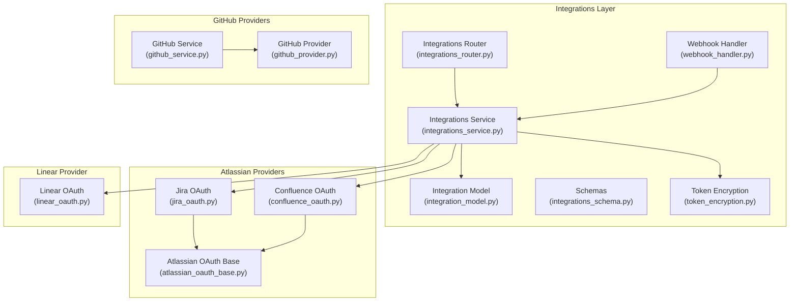
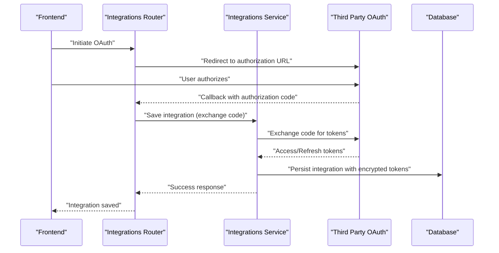
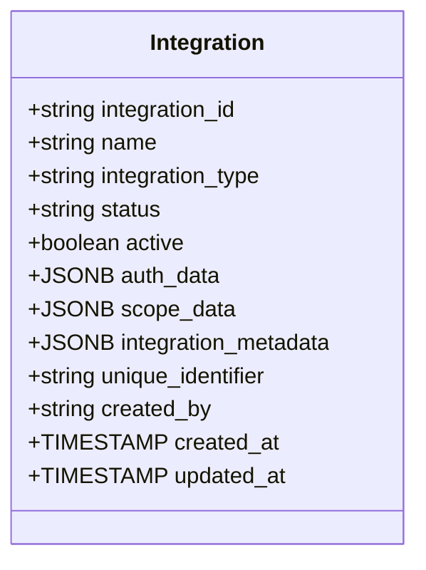
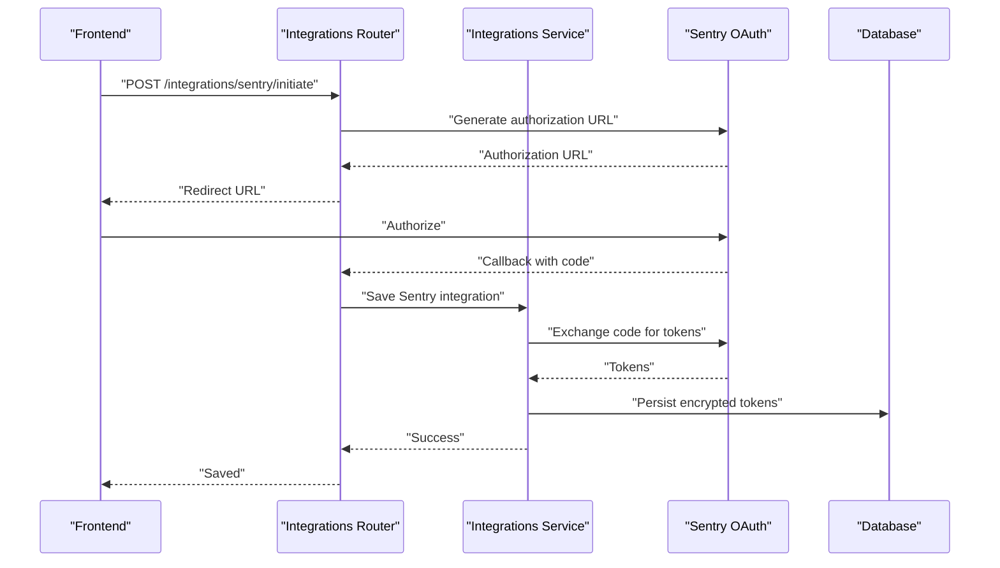
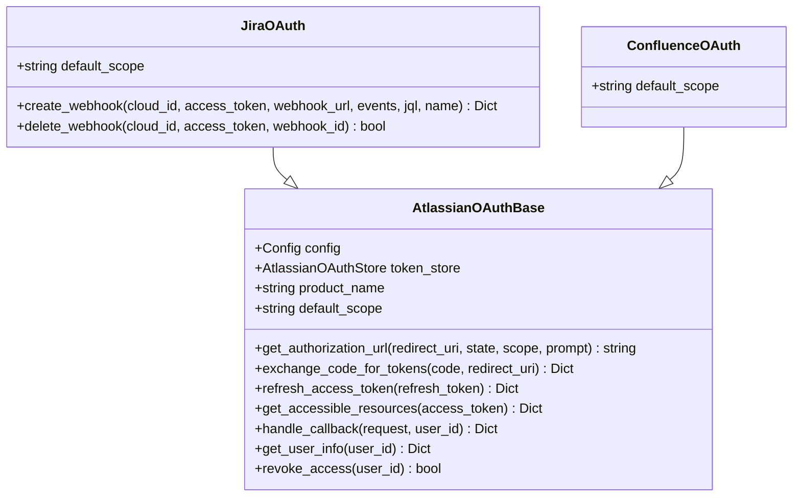
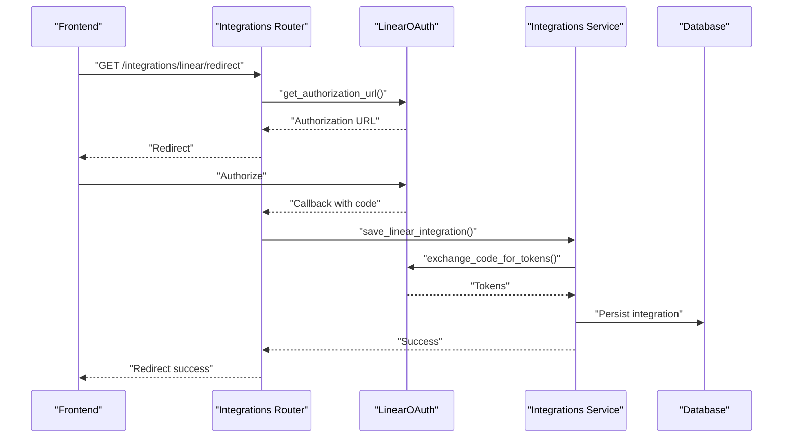
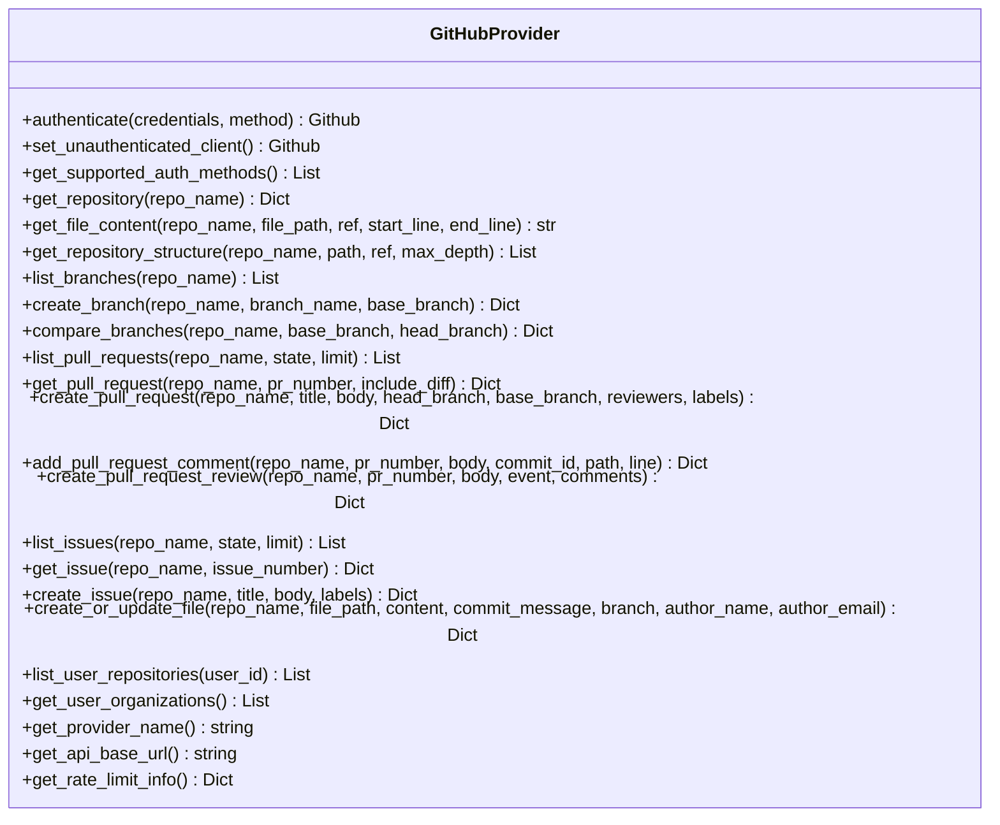
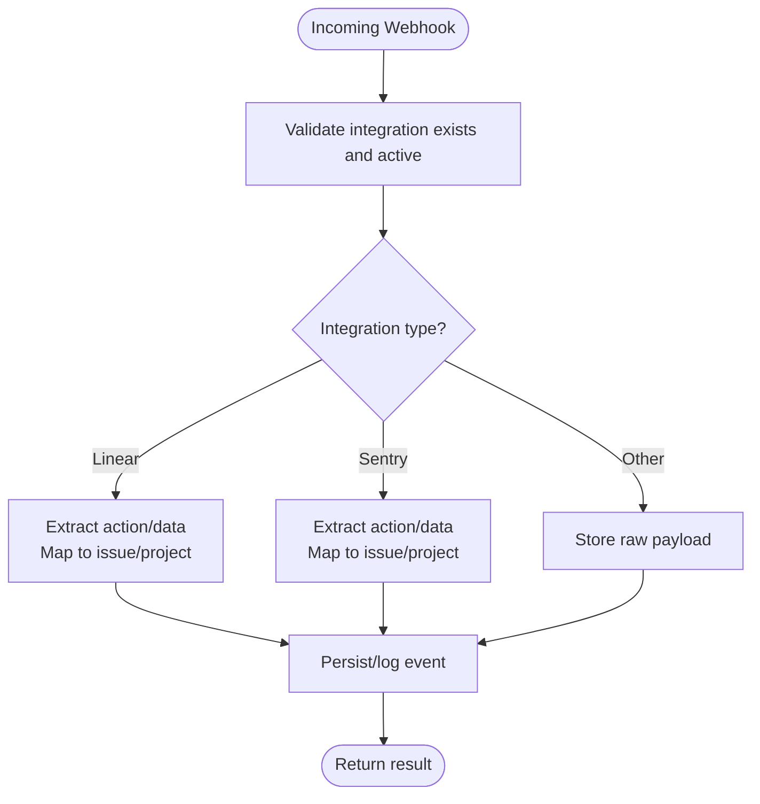
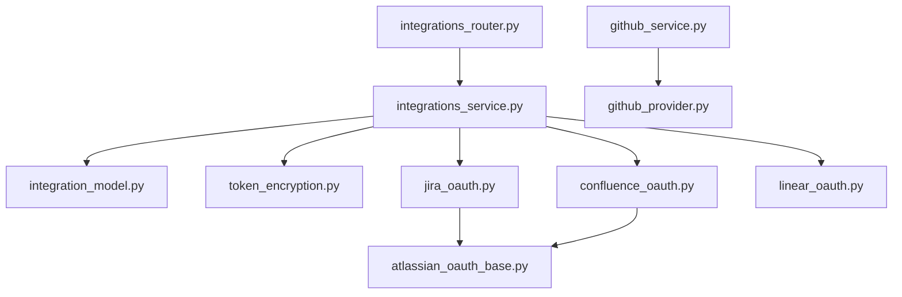

# External Integrations

<cite>
**Referenced Files in This Document**
- [integration_model.py](file://app/modules/integrations/integration_model.py)
- [integrations_service.py](file://app/modules/integrations/integrations_service.py)
- [integrations_router.py](file://app/modules/integrations/integrations_router.py)
- [integrations_schema.py](file://app/modules/integrations/integrations_schema.py)
- [atlassian_oauth_base.py](file://app/modules/integrations/atlassian_oauth_base.py)
- [jira_oauth.py](file://app/modules/integrations/jira_oauth.py)
- [confluence_oauth.py](file://app/modules/integrations/confluence_oauth.py)
- [linear_oauth.py](file://app/modules/integrations/linear_oauth.py)
- [token_encryption.py](file://app/modules/integrations/token_encryption.py)
- [webhook_handler.py](file://app/modules/event_bus/handlers/webhook_handler.py)
- [github_provider.py](file://app/modules/code_provider/github/github_provider.py)
- [github_service.py](file://app/modules/code_provider/github/github_service.py)
</cite>

## Table of Contents
1. [Introduction](#introduction)
2. [Project Structure](#project-structure)
3. [Core Components](#core-components)
4. [Architecture Overview](#architecture-overview)
5. [Detailed Component Analysis](#detailed-component-analysis)
6. [Dependency Analysis](#dependency-analysis)
7. [Performance Considerations](#performance-considerations)
8. [Troubleshooting Guide](#troubleshooting-guide)
9. [Conclusion](#conclusion)
10. [Appendices](#appendices)

## Introduction
This document explains Potpie’s external integration system that connects the platform with third-party services such as GitHub, Sentry, Linear, and Atlassian’s Jira and Confluence. It covers the integration layer’s purpose, OAuth flows, token management, API communication patterns, and service-specific tooling. The guide is designed for both beginners (conceptual overviews) and experienced developers (implementation details, schemas, and workflows).

## Project Structure
The integration system is organized around:
- A shared database model for integrations
- A service layer orchestrating OAuth, token lifecycle, and API calls
- Router endpoints for OAuth initiation, callbacks, and webhook handling
- Provider abstractions for GitHub
- Atlassian OAuth base class and product-specific handlers
- Token encryption utilities
- Webhook event processing

**Diagram sources**
- [integration_model.py](file://app/modules/integrations/integration_model.py#L7-L44)
- [integrations_service.py](file://app/modules/integrations/integrations_service.py#L40-L49)
- [integrations_router.py](file://app/modules/integrations/integrations_router.py#L52-L117)
- [integrations_schema.py](file://app/modules/integrations/integrations_schema.py#L65-L96)
- [token_encryption.py](file://app/modules/integrations/token_encryption.py#L14-L97)
- [webhook_handler.py](file://app/modules/event_bus/handlers/webhook_handler.py#L17-L29)
- [atlassian_oauth_base.py](file://app/modules/integrations/atlassian_oauth_base.py#L56-L71)
- [jira_oauth.py](file://app/modules/integrations/jira_oauth.py#L12-L31)
- [confluence_oauth.py](file://app/modules/integrations/confluence_oauth.py#L16-L76)
- [linear_oauth.py](file://app/modules/integrations/linear_oauth.py#L51-L64)
- [github_provider.py](file://app/modules/code_provider/github/github_provider.py#L16-L25)
- [github_service.py](file://app/modules/code_provider/github/github_service.py#L35-L60)

**Section sources**
- [integration_model.py](file://app/modules/integrations/integration_model.py#L7-L44)
- [integrations_service.py](file://app/modules/integrations/integrations_service.py#L40-L49)
- [integrations_router.py](file://app/modules/integrations/integrations_router.py#L52-L117)
- [integrations_schema.py](file://app/modules/integrations/integrations_schema.py#L65-L96)
- [token_encryption.py](file://app/modules/integrations/token_encryption.py#L14-L97)
- [webhook_handler.py](file://app/modules/event_bus/handlers/webhook_handler.py#L17-L29)
- [atlassian_oauth_base.py](file://app/modules/integrations/atlassian_oauth_base.py#L56-L71)
- [jira_oauth.py](file://app/modules/integrations/jira_oauth.py#L12-L31)
- [confluence_oauth.py](file://app/modules/integrations/confluence_oauth.py#L16-L76)
- [linear_oauth.py](file://app/modules/integrations/linear_oauth.py#L51-L64)
- [github_provider.py](file://app/modules/code_provider/github/github_provider.py#L16-L25)
- [github_service.py](file://app/modules/code_provider/github/github_service.py#L35-L60)

## Core Components
- Integration Model: Defines the persistent structure for integrations, including auth_data, scope_data, and metadata.
- Integrations Service: Central coordinator for OAuth flows, token lifecycle, API calls, and integration persistence.
- Integrations Router: Exposes endpoints for OAuth initiation, callbacks, status checks, revocation, and webhook redirections.
- Schemas: Strongly typed request/response models for integrations and OAuth operations.
- Atlassian OAuth Base: Shared OAuth 2.0 (3LO) implementation for Jira and Confluence.
- Jira OAuth: Adds product-specific API calls and webhook management.
- Confluence OAuth: Extends Atlassian base with product-specific scopes.
- Linear OAuth: Handles Linear OAuth flow and token exchange.
- Token Encryption: Securely stores tokens using symmetric encryption.
- Webhook Handler: Processes inbound webhook events and routes them by integration type.

**Section sources**
- [integration_model.py](file://app/modules/integrations/integration_model.py#L7-L44)
- [integrations_service.py](file://app/modules/integrations/integrations_service.py#L40-L49)
- [integrations_router.py](file://app/modules/integrations/integrations_router.py#L52-L117)
- [integrations_schema.py](file://app/modules/integrations/integrations_schema.py#L65-L96)
- [atlassian_oauth_base.py](file://app/modules/integrations/atlassian_oauth_base.py#L56-L71)
- [jira_oauth.py](file://app/modules/integrations/jira_oauth.py#L12-L31)
- [confluence_oauth.py](file://app/modules/integrations/confluence_oauth.py#L16-L76)
- [linear_oauth.py](file://app/modules/integrations/linear_oauth.py#L51-L64)
- [token_encryption.py](file://app/modules/integrations/token_encryption.py#L14-L97)
- [webhook_handler.py](file://app/modules/event_bus/handlers/webhook_handler.py#L17-L29)

## Architecture Overview
The integration layer follows a layered architecture:
- Router exposes endpoints for OAuth and webhook handling.
- Service layer manages OAuth exchanges, token storage, and API calls.
- Database persists integration records with encrypted tokens.
- Providers encapsulate product-specific logic (Atlassian OAuth base, Linear, GitHub).

**Diagram sources**
- [integrations_router.py](file://app/modules/integrations/integrations_router.py#L180-L243)
- [integrations_service.py](file://app/modules/integrations/integrations_service.py#L595-L788)
- [integration_model.py](file://app/modules/integrations/integration_model.py#L7-L44)
- [token_encryption.py](file://app/modules/integrations/token_encryption.py#L63-L93)

## Detailed Component Analysis

### Integration Model and Persistence
- Stores integration identifiers, type, status, and activity flag.
- Holds JSON fields for auth_data (tokens, scopes), scope_data (org/workspace/project), and metadata.
- Includes system fields for ownership and timestamps.

**Diagram sources**
- [integration_model.py](file://app/modules/integrations/integration_model.py#L7-L44)

**Section sources**
- [integration_model.py](file://app/modules/integrations/integration_model.py#L7-L44)

### OAuth Flows and Token Management
- Sentry OAuth: Router endpoints for initiation, callback, status, and revocation; service handles token exchange, refresh, and API calls; tokens are encrypted before storage.
- Linear OAuth: Router endpoints for initiation, callback, status, and revocation; service saves integration after exchanging code; tokens cached per user.
- Atlassian OAuth (Jira/Confluence): Shared base class implements authorization URL generation, token exchange, refresh, and accessible resources discovery; product-specific handlers add API calls and Jira webhook management.

**Diagram sources**
- [integrations_router.py](file://app/modules/integrations/integrations_router.py#L180-L243)
- [integrations_service.py](file://app/modules/integrations/integrations_service.py#L595-L788)
- [token_encryption.py](file://app/modules/integrations/token_encryption.py#L63-L93)

**Section sources**
- [integrations_router.py](file://app/modules/integrations/integrations_router.py#L180-L243)
- [integrations_service.py](file://app/modules/integrations/integrations_service.py#L132-L162)
- [integrations_service.py](file://app/modules/integrations/integrations_service.py#L354-L487)
- [integrations_service.py](file://app/modules/integrations/integrations_service.py#L595-L788)
- [token_encryption.py](file://app/modules/integrations/token_encryption.py#L63-L93)

### Atlassian OAuth Base and Jira/Confluence Providers
- AtlassianOAuthBase: Provides shared OAuth 2.0 (3LO) infrastructure, including authorization URL construction, token exchange, refresh, and accessible resources retrieval.
- JiraOAuth: Extends base with product-specific scopes and adds webhook creation/deletion APIs.
- ConfluenceOAuth: Extends base with product-specific scopes; notes that Confluence OAuth 2.0 apps cannot register webhooks via API.

**Diagram sources**
- [atlassian_oauth_base.py](file://app/modules/integrations/atlassian_oauth_base.py#L56-L383)
- [jira_oauth.py](file://app/modules/integrations/jira_oauth.py#L12-L149)
- [confluence_oauth.py](file://app/modules/integrations/confluence_oauth.py#L16-L82)

**Section sources**
- [atlassian_oauth_base.py](file://app/modules/integrations/atlassian_oauth_base.py#L56-L383)
- [jira_oauth.py](file://app/modules/integrations/jira_oauth.py#L12-L149)
- [confluence_oauth.py](file://app/modules/integrations/confluence_oauth.py#L16-L82)

### Linear OAuth Integration
- Router endpoints for initiation, callback, status, and revocation.
- Service saves integration after exchanging authorization code for tokens.
- Tokens cached per user in-memory store.

**Diagram sources**
- [integrations_router.py](file://app/modules/integrations/integrations_router.py#L385-L542)
- [linear_oauth.py](file://app/modules/integrations/linear_oauth.py#L65-L156)
- [integrations_service.py](file://app/modules/integrations/integrations_service.py#L595-L788)

**Section sources**
- [integrations_router.py](file://app/modules/integrations/integrations_router.py#L385-L542)
- [linear_oauth.py](file://app/modules/integrations/linear_oauth.py#L65-L156)
- [integrations_service.py](file://app/modules/integrations/integrations_service.py#L595-L788)

### GitHub Integration
- GitHubProvider implements ICodeProvider with support for PAT, OAuth token, and App installation authentication.
- GitHubService coordinates repository access, file content retrieval, branch listing, and project structure traversal; supports both authenticated and public access with fallback strategies.

**Diagram sources**
- [github_provider.py](file://app/modules/code_provider/github/github_provider.py#L16-L733)

**Section sources**
- [github_provider.py](file://app/modules/code_provider/github/github_provider.py#L16-L733)
- [github_service.py](file://app/modules/code_provider/github/github_service.py#L35-L60)
- [github_service.py](file://app/modules/code_provider/github/github_service.py#L690-L704)

### Webhook Handling
- WebhookEventHandler processes inbound webhook events, validates integration presence, and routes processing by integration type.
- Integrations Router includes endpoints to log and route webhook events for Sentry, Linear, and Jira.

**Diagram sources**
- [webhook_handler.py](file://app/modules/event_bus/handlers/webhook_handler.py#L30-L177)
- [integrations_router.py](file://app/modules/integrations/integrations_router.py#L385-L542)

**Section sources**
- [webhook_handler.py](file://app/modules/event_bus/handlers/webhook_handler.py#L30-L177)
- [integrations_router.py](file://app/modules/integrations/integrations_router.py#L385-L542)

## Dependency Analysis
- Router depends on service layer and provider instances for OAuth.
- Service depends on provider implementations, database model, and token encryption.
- Atlassian providers depend on shared base class and product-specific configuration.
- GitHub service depends on provider factory and GitHub provider.

**Diagram sources**
- [integrations_router.py](file://app/modules/integrations/integrations_router.py#L52-L117)
- [integrations_service.py](file://app/modules/integrations/integrations_service.py#L40-L49)
- [integration_model.py](file://app/modules/integrations/integration_model.py#L7-L44)
- [token_encryption.py](file://app/modules/integrations/token_encryption.py#L14-L97)
- [jira_oauth.py](file://app/modules/integrations/jira_oauth.py#L12-L31)
- [confluence_oauth.py](file://app/modules/integrations/confluence_oauth.py#L16-L76)
- [linear_oauth.py](file://app/modules/integrations/linear_oauth.py#L51-L64)
- [atlassian_oauth_base.py](file://app/modules/integrations/atlassian_oauth_base.py#L56-L71)
- [github_service.py](file://app/modules/code_provider/github/github_service.py#L35-L60)
- [github_provider.py](file://app/modules/code_provider/github/github_provider.py#L16-L25)

**Section sources**
- [integrations_router.py](file://app/modules/integrations/integrations_router.py#L52-L117)
- [integrations_service.py](file://app/modules/integrations/integrations_service.py#L40-L49)
- [integration_model.py](file://app/modules/integrations/integration_model.py#L7-L44)
- [token_encryption.py](file://app/modules/integrations/token_encryption.py#L14-L97)
- [jira_oauth.py](file://app/modules/integrations/jira_oauth.py#L12-L31)
- [confluence_oauth.py](file://app/modules/integrations/confluence_oauth.py#L16-L76)
- [linear_oauth.py](file://app/modules/integrations/linear_oauth.py#L51-L64)
- [atlassian_oauth_base.py](file://app/modules/integrations/atlassian_oauth_base.py#L56-L71)
- [github_service.py](file://app/modules/code_provider/github/github_service.py#L35-L60)
- [github_provider.py](file://app/modules/code_provider/github/github_provider.py#L16-L25)

## Performance Considerations
- Token encryption/decryption adds CPU overhead; cache tokens per user in memory for short-lived operations.
- Use asynchronous HTTP clients for OAuth token exchanges and API calls to minimize latency.
- Paginate and batch GitHub API requests; leverage Redis caching for repeated project structure queries.
- Avoid storing authorization codes after exchange; clear sensitive fields post-processing.

## Troubleshooting Guide
Common issues and resolutions:
- OAuth initiation failures: Verify OAuth credentials and redirect URI configuration; ensure state signing secret is set.
- Token exchange failures: Check client credentials, redirect URI match, and code freshness; inspect sanitized error responses.
- Token refresh failures: Confirm refresh token availability and environment configuration; review error logs for structured error fields.
- Webhook processing errors: Validate integration existence and active status; inspect event payload and integration type routing.
- GitHub access errors: Ensure fallback to PAT token list or system tokens; confirm App installation access.

**Section sources**
- [integrations_router.py](file://app/modules/integrations/integrations_router.py#L119-L178)
- [integrations_service.py](file://app/modules/integrations/integrations_service.py#L213-L254)
- [integrations_service.py](file://app/modules/integrations/integrations_service.py#L298-L302)
- [webhook_handler.py](file://app/modules/event_bus/handlers/webhook_handler.py#L50-L86)
- [github_service.py](file://app/modules/code_provider/github/github_service.py#L340-L363)

## Conclusion
Potpie’s integration layer provides a robust, extensible framework for connecting with GitHub, Sentry, Linear, and Atlassian’s Jira and Confluence. It emphasizes secure token handling, standardized OAuth flows, and flexible webhook processing. The modular design enables straightforward addition of new integrations while maintaining consistent patterns across providers.

## Appendices

### Public Interfaces and Parameters
- Integration Model Fields:
  - integration_id, name, integration_type, status, active
  - auth_data: access_token, refresh_token, token_type, expires_at, scope, code
  - scope_data: org_slug, installation_id, workspace_id, project_id
  - integration_metadata: instance_name, created_via, version, description, tags
  - unique_identifier, created_by, created_at, updated_at

- Integration Save Requests:
  - SentrySaveRequest: code, redirect_uri, instance_name, integration_type, timestamp
  - LinearSaveRequest: code, redirect_uri, instance_name, integration_type, timestamp
  - JiraSaveRequest: code, redirect_uri, instance_name, user_id, integration_type, timestamp
  - ConfluenceSaveRequest: code, redirect_uri, instance_name, user_id, integration_type, timestamp

- OAuth Initiation:
  - OAuthInitiateRequest: redirect_uri, state

- OAuth Status Responses:
  - SentryIntegrationStatus: user_id, is_connected, connected_at, scope, expires_at
  - LinearIntegrationStatus: user_id, is_connected, connected_at, scope, expires_at
  - JiraIntegrationStatus: user_id, is_connected, connected_at, scope, expires_at
  - ConfluenceIntegrationStatus: user_id, is_connected, connected_at, scope, expires_at

- Webhook Logging:
  - log_linear_webhook(webhook_data): returns status, message, logged_at, webhook_data
  - log_jira_webhook(webhook_data): returns status, message, logged_at, webhook_data

**Section sources**
- [integrations_schema.py](file://app/modules/integrations/integrations_schema.py#L65-L96)
- [integrations_schema.py](file://app/modules/integrations/integrations_schema.py#L204-L233)
- [integrations_schema.py](file://app/modules/integrations/integrations_schema.py#L254-L283)
- [integrations_schema.py](file://app/modules/integrations/integrations_schema.py#L296-L321)
- [integrations_schema.py](file://app/modules/integrations/integrations_schema.py#L334-L361)
- [integrations_schema.py](file://app/modules/integrations/integrations_schema.py#L144-L151)
- [integrations_schema.py](file://app/modules/integrations/integrations_schema.py#L178-L186)
- [integrations_schema.py](file://app/modules/integrations/integrations_schema.py#L236-L244)
- [integrations_schema.py](file://app/modules/integrations/integrations_schema.py#L286-L294)
- [integrations_schema.py](file://app/modules/integrations/integrations_schema.py#L324-L332)
- [integrations_service.py](file://app/modules/integrations/integrations_service.py#L1323-L1333)
- [integrations_service.py](file://app/modules/integrations/integrations_service.py#L1305-L1321)

### OAuth Configuration Examples
- Sentry:
  - Environment variables: SENTRY_CLIENT_ID, SENTRY_CLIENT_SECRET, SENTRY_REDIRECT_URI
  - Router endpoints: POST /integrations/sentry/initiate, GET /integrations/sentry/callback, GET /integrations/sentry/status/{user_id}, DELETE /integrations/sentry/revoke/{user_id}

- Linear:
  - Environment variables: LINEAR_CLIENT_ID, LINEAR_CLIENT_SECRET
  - Router endpoints: GET /integrations/linear/redirect, GET /integrations/linear/callback, GET /integrations/linear/status/{user_id}, DELETE /integrations/linear/revoke/{user_id}

- Atlassian (Jira/Confluence):
  - Environment variables: JIRA_CLIENT_ID, JIRA_CLIENT_SECRET, CONFLUENCE_CLIENT_ID, CONFLUENCE_CLIENT_SECRET
  - Router endpoints: POST /integrations/jira/initiate, GET /integrations/jira/callback, GET /integrations/jira/status/{user_id}
  - Jira-specific: create/delete webhooks via JiraOAuth methods

**Section sources**
- [integrations_router.py](file://app/modules/integrations/integrations_router.py#L180-L243)
- [integrations_router.py](file://app/modules/integrations/integrations_router.py#L222-L243)
- [integrations_router.py](file://app/modules/integrations/integrations_router.py#L245-L294)
- [integrations_router.py](file://app/modules/integrations/integrations_router.py#L385-L542)
- [integrations_router.py](file://app/modules/integrations/integrations_router.py#L545-L594)
- [integrations_router.py](file://app/modules/integrations/integrations_router.py#L617-L784)
- [jira_oauth.py](file://app/modules/integrations/jira_oauth.py#L32-L149)
- [confluence_oauth.py](file://app/modules/integrations/confluence_oauth.py#L16-L82)