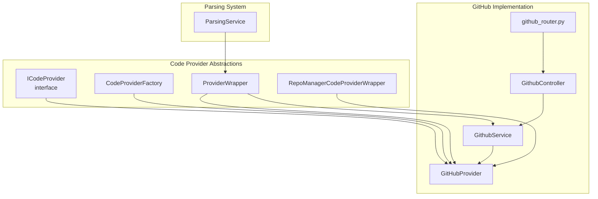
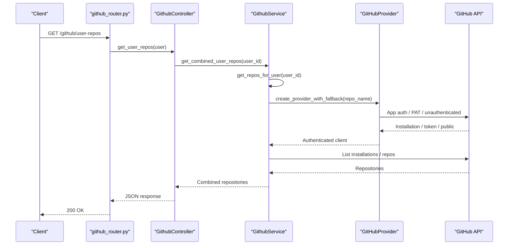
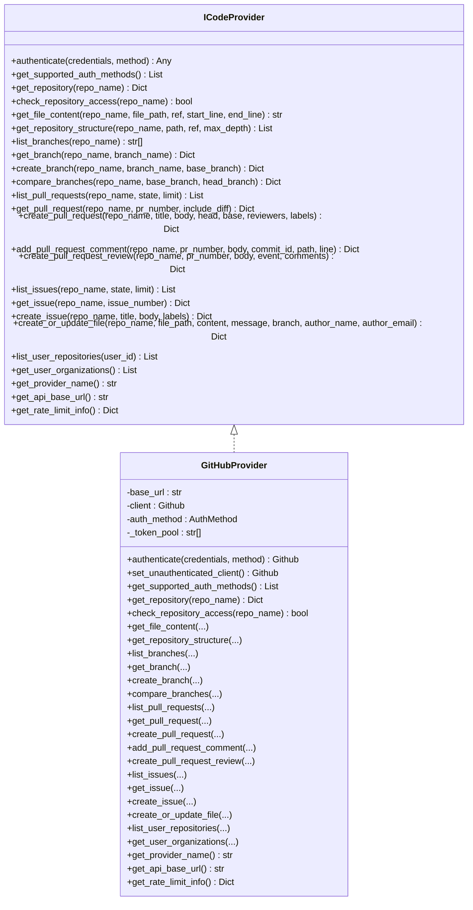
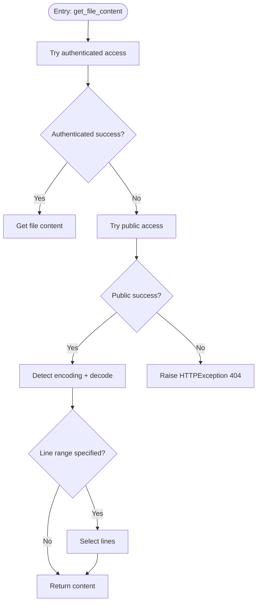
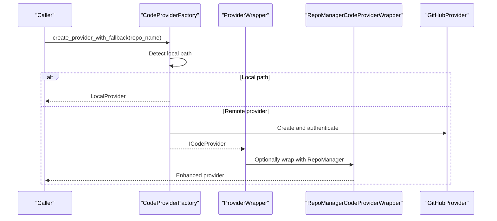
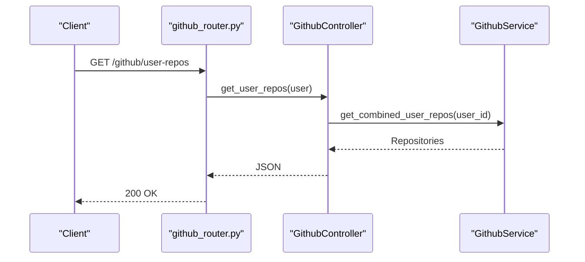
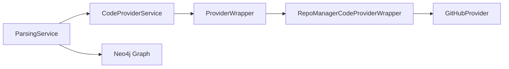
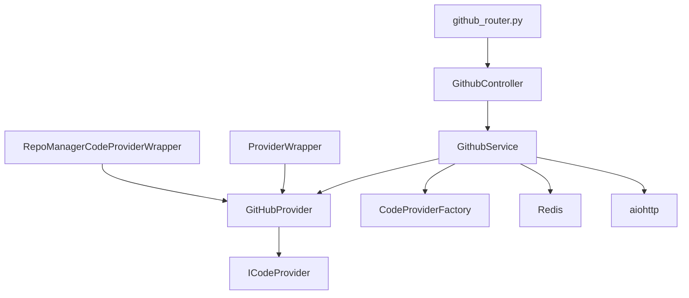

# GitHub Integration

<cite>
**Referenced Files in This Document**
- [github_provider.py](file://app/modules/code_provider/github/github_provider.py)
- [github_service.py](file://app/modules/code_provider/github/github_service.py)
- [github_controller.py](file://app/modules/code_provider/github/github_controller.py)
- [github_router.py](file://app/modules/code_provider/github/github_router.py)
- [code_provider_interface.py](file://app/modules/code_provider/base/code_provider_interface.py)
- [provider_factory.py](file://app/modules/code_provider/provider_factory.py)
- [code_provider_service.py](file://app/modules/code_provider/code_provider_service.py)
- [repo_manager_wrapper.py](file://app/modules/code_provider/repo_manager_wrapper.py)
- [test_github_service.py](file://tests/integration-tests/code_provider/test_github_service.py)
- [README.md](file://README.md)
- [parsing_service.py](file://app/modules/parsing/graph_construction/parsing_service.py)
</cite>

## Table of Contents
1. [Introduction](#introduction)
2. [Project Structure](#project-structure)
3. [Core Components](#core-components)
4. [Architecture Overview](#architecture-overview)
5. [Detailed Component Analysis](#detailed-component-analysis)
6. [Dependency Analysis](#dependency-analysis)
7. [Performance Considerations](#performance-considerations)
8. [Troubleshooting Guide](#troubleshooting-guide)
9. [Conclusion](#conclusion)
10. [Appendices](#appendices)

## Introduction
This document explains the GitHub integration functionality in the codebase, focusing on the GitHub code provider implementation that powers repository analysis, PR commenting, branch creation, and file updates. It covers the GitHub service architecture, authentication flows, API rate limiting, repository management, controller and router endpoints, and how GitHub integration connects to the broader code parsing system. Practical workflows such as repository cloning, PR creation, and comment posting are included, along with authentication methods, token management, and webhook handling. Common GitHub API limitations, error handling strategies, and best practices for repository analysis are addressed.

## Project Structure
The GitHub integration spans several modules:
- Code provider abstractions define the interface and factory-driven instantiation.
- GitHub-specific provider, service, controller, and router implement GitHub operations and endpoints.
- Repo manager wrapper integrates local repository copies for performance and offline access.
- Tests validate live and cached behavior for public and private repositories.
- The parsing service consumes the code provider to analyze repositories and build knowledge graphs.

**Diagram sources**
- [code_provider_interface.py](file://app/modules/code_provider/base/code_provider_interface.py#L15-L275)
- [provider_factory.py](file://app/modules/code_provider/provider_factory.py#L29-L455)
- [code_provider_service.py](file://app/modules/code_provider/code_provider_service.py#L143-L467)
- [repo_manager_wrapper.py](file://app/modules/code_provider/repo_manager_wrapper.py#L24-L732)
- [github_provider.py](file://app/modules/code_provider/github/github_provider.py#L16-L733)
- [github_service.py](file://app/modules/code_provider/github/github_service.py#L35-L965)
- [github_controller.py](file://app/modules/code_provider/github/github_controller.py#L7-L23)
- [github_router.py](file://app/modules/code_provider/github/github_router.py#L10-L52)
- [parsing_service.py](file://app/modules/parsing/graph_construction/parsing_service.py#L33-L477)

**Section sources**
- [github_provider.py](file://app/modules/code_provider/github/github_provider.py#L16-L733)
- [github_service.py](file://app/modules/code_provider/github/github_service.py#L35-L965)
- [github_controller.py](file://app/modules/code_provider/github/github_controller.py#L7-L23)
- [github_router.py](file://app/modules/code_provider/github/github_router.py#L10-L52)
- [code_provider_interface.py](file://app/modules/code_provider/base/code_provider_interface.py#L15-L275)
- [provider_factory.py](file://app/modules/code_provider/provider_factory.py#L29-L455)
- [code_provider_service.py](file://app/modules/code_provider/code_provider_service.py#L143-L467)
- [repo_manager_wrapper.py](file://app/modules/code_provider/repo_manager_wrapper.py#L24-L732)
- [parsing_service.py](file://app/modules/parsing/graph_construction/parsing_service.py#L33-L477)

## Core Components
- GitHubProvider: Implements ICodeProvider for GitHub, supporting PAT, OAuth, and App installation authentication. Provides repository, content, branch, PR, issue, and file modification operations.
- GithubService: Orchestrates GitHub access with robust fallbacks (GitHub App → PAT pool → unauthenticated), async repository listing, branch listing, and project structure retrieval with Redis caching.
- CodeProviderFactory: Centralized factory for creating providers with comprehensive fallback strategies across GitHub, GitBucket, and local providers.
- ProviderWrapper and RepoManagerCodeProviderWrapper: Unified access layer and local-copy-aware wrapper that prioritizes local worktrees for file content and structure operations.
- GitHubController and github_router.py: Expose endpoints for user repositories, branch lists, and public repository checks.

Key capabilities:
- Authentication: PAT, OAuth, App installation, and unauthenticated access.
- Repository operations: Get repository metadata, list branches, compare branches.
- Content operations: Get file content with line slicing and encoding detection.
- PR operations: List, get, create, add comments, and reviews.
- Issue operations: List, get, create.
- File updates: Create or update files with commit author customization.
- Rate limiting: Expose rate limit info via provider interface.

**Section sources**
- [github_provider.py](file://app/modules/code_provider/github/github_provider.py#L16-L733)
- [github_service.py](file://app/modules/code_provider/github/github_service.py#L35-L965)
- [code_provider_interface.py](file://app/modules/code_provider/base/code_provider_interface.py#L15-L275)
- [provider_factory.py](file://app/modules/code_provider/provider_factory.py#L29-L455)
- [code_provider_service.py](file://app/modules/code_provider/code_provider_service.py#L143-L467)
- [repo_manager_wrapper.py](file://app/modules/code_provider/repo_manager_wrapper.py#L24-L732)
- [github_controller.py](file://app/modules/code_provider/github/github_controller.py#L7-L23)
- [github_router.py](file://app/modules/code_provider/github/github_router.py#L10-L52)

## Architecture Overview
The GitHub integration follows a layered architecture:
- Abstraction Layer: ICodeProvider defines the contract for all code providers.
- Factory Layer: CodeProviderFactory selects and configures providers with fallback strategies.
- GitHub Layer: GitHubProvider implements provider-specific logic; GithubService adds orchestration and async features.
- Controller/Router Layer: FastAPI endpoints expose GitHub operations to clients.
- Parsing Integration: ParsingService uses ProviderWrapper to access repositories for knowledge graph construction.

**Diagram sources**
- [github_router.py](file://app/modules/code_provider/github/github_router.py#L13-L33)
- [github_controller.py](file://app/modules/code_provider/github/github_controller.py#L11-L13)
- [github_service.py](file://app/modules/code_provider/github/github_service.py#L582-L628)
- [provider_factory.py](file://app/modules/code_provider/provider_factory.py#L247-L382)
- [github_provider.py](file://app/modules/code_provider/github/github_provider.py#L16-L733)

## Detailed Component Analysis

### GitHubProvider
Implements ICodeProvider for GitHub with:
- Authentication: PAT, OAuth, App installation, and unauthenticated client.
- Repository operations: get_repository, check_repository_access.
- Content operations: get_file_content with encoding detection and line slicing, get_repository_structure with recursion and depth limits.
- Branch operations: list_branches, get_branch, create_branch, compare_branches.
- PR operations: list_pull_requests, get_pull_request, create_pull_request, add_pull_request_comment, create_pull_request_review.
- Issue operations: list_issues, get_issue, create_issue.
- File modification: create_or_update_file with support for author customization.
- User/Organization: list_user_repositories, get_user_organizations.
- Provider metadata: get_provider_name, get_api_base_url, get_rate_limit_info.

**Diagram sources**
- [code_provider_interface.py](file://app/modules/code_provider/base/code_provider_interface.py#L15-L275)
- [github_provider.py](file://app/modules/code_provider/github/github_provider.py#L16-L733)

**Section sources**
- [github_provider.py](file://app/modules/code_provider/github/github_provider.py#L16-L733)
- [code_provider_interface.py](file://app/modules/code_provider/base/code_provider_interface.py#L15-L275)

### GithubService
Provides orchestration and async features:
- Token initialization from GH_TOKEN_LIST.
- App-based client acquisition via JWT and installation auth.
- File content retrieval with fallbacks and encoding detection.
- OAuth token resolution from unified auth provider and legacy provider_info.
- Async repository listing with pagination, filtering, and deduplication.
- Combined user repositories from projects and GitHub installations.
- Branch listing supporting local and remote repositories.
- Public GitHub instance creation for PAT pool usage.
- Repository access with fallback chain and error propagation.
- Project structure retrieval with Redis caching and depth control.

**Diagram sources**
- [github_service.py](file://app/modules/code_provider/github/github_service.py#L103-L168)

**Section sources**
- [github_service.py](file://app/modules/code_provider/github/github_service.py#L35-L965)

### CodeProviderFactory and ProviderWrapper
- CodeProviderFactory: Creates providers with fallback order: local path detection → GitHub App → GH_TOKEN_LIST (GitHub) → CODE_PROVIDER_TOKEN (others) → unauthenticated (GitHub public).
- ProviderWrapper: Wraps providers for unified access, with RepoManagerCodeProviderWrapper using local worktrees for file content and structure when available.

**Diagram sources**
- [provider_factory.py](file://app/modules/code_provider/provider_factory.py#L247-L382)
- [code_provider_service.py](file://app/modules/code_provider/code_provider_service.py#L143-L467)
- [repo_manager_wrapper.py](file://app/modules/code_provider/repo_manager_wrapper.py#L24-L732)

**Section sources**
- [provider_factory.py](file://app/modules/code_provider/provider_factory.py#L29-L455)
- [code_provider_service.py](file://app/modules/code_provider/code_provider_service.py#L143-L467)
- [repo_manager_wrapper.py](file://app/modules/code_provider/repo_manager_wrapper.py#L24-L732)

### GitHubController and Router Endpoints
- Routes:
  - GET /github/user-repos: Lists combined repositories for a user (projects + GitHub installations).
  - GET /github/get-branch-list: Lists branches for a repository (supports local and remote).
  - GET /github/check-public-repo: Checks if a repository is public.
- Controller delegates to GithubService or CodeProviderController depending on endpoint.

**Diagram sources**
- [github_router.py](file://app/modules/code_provider/github/github_router.py#L13-L33)
- [github_controller.py](file://app/modules/code_provider/github/github_controller.py#L11-L13)
- [github_service.py](file://app/modules/code_provider/github/github_service.py#L582-L628)

**Section sources**
- [github_router.py](file://app/modules/code_provider/github/github_router.py#L10-L52)
- [github_controller.py](file://app/modules/code_provider/github/github_controller.py#L7-L23)

### Relationship to the Broader Parsing System
- ParsingService uses CodeProviderService (via ProviderWrapper) to access repositories for parsing.
- ProviderWrapper resolves authentication and optionally uses RepoManagerCodeProviderWrapper to leverage local worktrees for faster file access.
- This integration enables efficient repository analysis and knowledge graph construction.

**Diagram sources**
- [parsing_service.py](file://app/modules/parsing/graph_construction/parsing_service.py#L33-L477)
- [code_provider_service.py](file://app/modules/code_provider/code_provider_service.py#L431-L467)
- [repo_manager_wrapper.py](file://app/modules/code_provider/repo_manager_wrapper.py#L24-L732)
- [github_provider.py](file://app/modules/code_provider/github/github_provider.py#L16-L733)

**Section sources**
- [parsing_service.py](file://app/modules/parsing/graph_construction/parsing_service.py#L33-L477)
- [code_provider_service.py](file://app/modules/code_provider/code_provider_service.py#L431-L467)
- [repo_manager_wrapper.py](file://app/modules/code_provider/repo_manager_wrapper.py#L24-L732)

## Dependency Analysis
- GitHubProvider depends on the PyGithub library and implements ICodeProvider.
- GithubService depends on CodeProviderFactory for authentication, Redis for caching, aiohttp for async HTTP, and SQLAlchemy for persistence.
- ProviderWrapper and RepoManagerCodeProviderWrapper depend on IRepoManager for local repository management.
- Router and Controller depend on AuthService for authentication and CodeProviderController for provider-agnostic operations.

**Diagram sources**
- [github_provider.py](file://app/modules/code_provider/github/github_provider.py#L16-L733)
- [github_service.py](file://app/modules/code_provider/github/github_service.py#L35-L965)
- [code_provider_interface.py](file://app/modules/code_provider/base/code_provider_interface.py#L15-L275)
- [provider_factory.py](file://app/modules/code_provider/provider_factory.py#L29-L455)
- [code_provider_service.py](file://app/modules/code_provider/code_provider_service.py#L143-L467)
- [repo_manager_wrapper.py](file://app/modules/code_provider/repo_manager_wrapper.py#L24-L732)
- [github_router.py](file://app/modules/code_provider/github/github_router.py#L10-L52)
- [github_controller.py](file://app/modules/code_provider/github/github_controller.py#L7-L23)

**Section sources**
- [github_provider.py](file://app/modules/code_provider/github/github_provider.py#L16-L733)
- [github_service.py](file://app/modules/code_provider/github/github_service.py#L35-L965)
- [code_provider_interface.py](file://app/modules/code_provider/base/code_provider_interface.py#L15-L275)
- [provider_factory.py](file://app/modules/code_provider/provider_factory.py#L29-L455)
- [code_provider_service.py](file://app/modules/code_provider/code_provider_service.py#L143-L467)
- [repo_manager_wrapper.py](file://app/modules/code_provider/repo_manager_wrapper.py#L24-L732)
- [github_router.py](file://app/modules/code_provider/github/github_router.py#L10-L52)
- [github_controller.py](file://app/modules/code_provider/github/github_controller.py#L7-L23)

## Performance Considerations
- Token Pooling: GH_TOKEN_LIST enables load distribution across multiple PATs for GitHub.com, increasing rate limits.
- Caching: GithubService caches project structure in Redis to reduce repeated API calls.
- Local Copies: RepoManagerCodeProviderWrapper leverages local worktrees to avoid API calls for file content and structure.
- Async Pagination: GithubService uses async HTTP with pagination and batching to improve responsiveness.
- Encoding Detection: Robust encoding detection prevents unnecessary retries and decoding failures.

[No sources needed since this section provides general guidance]

## Troubleshooting Guide
Common scenarios and strategies:
- 401 Unauthorized: ProviderWrapper and CodeProviderController attempt unauthenticated access for public repos and GitHub App fallback.
- 404 Not Found: GithubService includes a final PAT fallback when App auth fails with 404.
- Rate Limiting: Use PATs from GH_TOKEN_LIST to increase limits; check get_rate_limit_info via provider interface.
- Encoding Issues: GithubService detects encoding and falls back to UTF-8 or Latin-1 with replacement.
- Private Repositories: Ensure GH_TOKEN_LIST contains tokens with appropriate scopes; verify installation permissions for GitHub App.

**Section sources**
- [code_provider_service.py](file://app/modules/code_provider/code_provider_service.py#L200-L238)
- [code_provider_service.py](file://app/modules/code_provider/code_provider_service.py#L263-L306)
- [github_service.py](file://app/modules/code_provider/github/github_service.py#L706-L760)
- [github_provider.py](file://app/modules/code_provider/github/github_provider.py#L722-L732)

## Conclusion
The GitHub integration is built on a robust, extensible architecture centered around ICodeProvider and CodeProviderFactory. GitHubProvider encapsulates provider-specific logic, while GithubService adds async orchestration, caching, and fallback strategies. ProviderWrapper and RepoManagerCodeProviderWrapper unify access and optimize performance with local repository copies. Together, these components enable reliable repository analysis, PR operations, and seamless integration with the broader parsing system.

[No sources needed since this section summarizes without analyzing specific files]

## Appendices

### Practical Workflows

- Repository Cloning and Analysis
  - Use ParsingService to clone or copy repositories and analyze directory structure for knowledge graph construction.
  - ProviderWrapper resolves authentication and may use local worktrees for faster access.

- Pull Request Creation
  - Use GitHubProvider.create_pull_request with head and base branches; optionally add reviewers and labels.

- Comment Posting
  - Use GitHubProvider.add_pull_request_comment for general or inline comments on PRs.

- Branch Creation and Comparison
  - Use GitHubProvider.create_branch and compare_branches to analyze differences between branches.

- Token Management
  - Configure GH_TOKEN_LIST for GitHub.com; ensure tokens have appropriate scopes.
  - For GitHub App, set GITHUB_APP_ID and GITHUB_PRIVATE_KEY; installation permissions are required.

- Webhook Handling
  - Webhooks are handled by the event bus and related components; GitHub integration endpoints remain REST-based.

**Section sources**
- [parsing_service.py](file://app/modules/parsing/graph_construction/parsing_service.py#L33-L477)
- [github_provider.py](file://app/modules/code_provider/github/github_provider.py#L412-L546)
- [github_provider.py](file://app/modules/code_provider/github/github_provider.py#L261-L301)
- [github_provider.py](file://app/modules/code_provider/github/github_provider.py#L302-L347)
- [README.md](file://README.md#L216-L254)