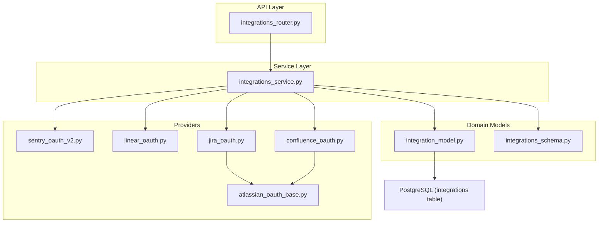
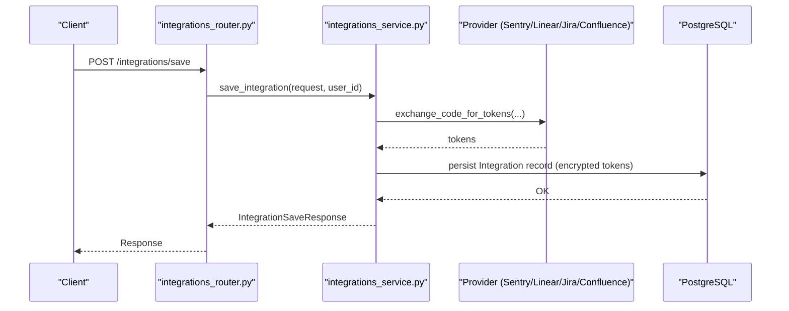
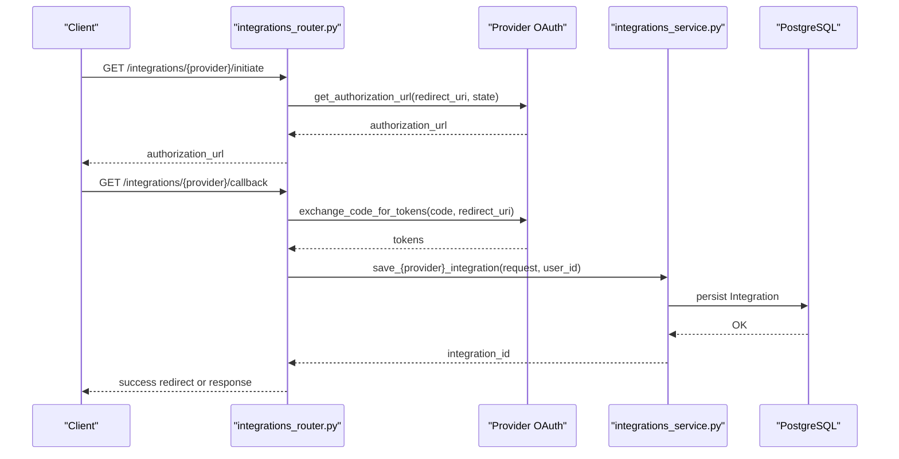
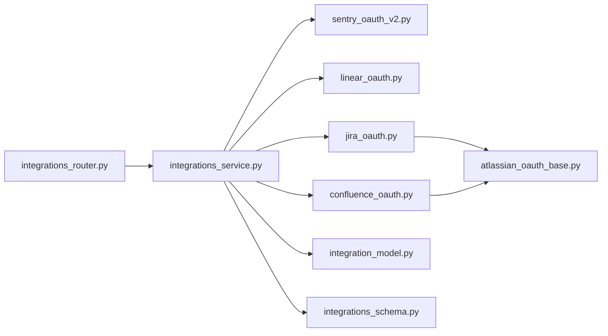
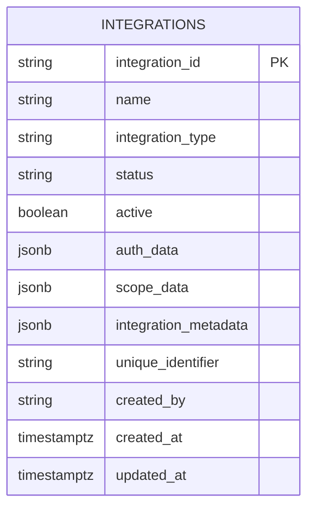

# Integration Management

<cite>
**Referenced Files in This Document**
- [integration_model.py](file://app/modules/integrations/integration_model.py)
- [integrations_schema.py](file://app/modules/integrations/integrations_schema.py)
- [integrations_service.py](file://app/modules/integrations/integrations_service.py)
- [integrations_router.py](file://app/modules/integrations/integrations_router.py)
- [sentry_oauth_v2.py](file://app/modules/integrations/sentry_oauth_v2.py)
- [linear_oauth.py](file://app/modules/integrations/linear_oauth.py)
- [jira_oauth.py](file://app/modules/integrations/jira_oauth.py)
- [confluence_oauth.py](file://app/modules/integrations/confluence_oauth.py)
- [atlassian_oauth_base.py](file://app/modules/integrations/atlassian_oauth_base.py)
</cite>

## Table of Contents
1. [Introduction](#introduction)
2. [Project Structure](#project-structure)
3. [Core Components](#core-components)
4. [Architecture Overview](#architecture-overview)
5. [Detailed Component Analysis](#detailed-component-analysis)
6. [Dependency Analysis](#dependency-analysis)
7. [Performance Considerations](#performance-considerations)
8. [Troubleshooting Guide](#troubleshooting-guide)
9. [Conclusion](#conclusion)
10. [Appendices](#appendices)

## Introduction
This document describes the integration management functionality that governs the lifecycle of external service connections. It covers the architecture, CRUD operations, status tracking, connection validation, discovery, health checking, monitoring, cleanup, and maintenance procedures. It also documents router endpoints for programmatic management, integration types, metadata handling, schemas, validation rules, and strategies for bulk/batch operations and synchronization.

## Project Structure
The integration management feature is organized around a modular structure:
- Router: Exposes REST endpoints for integration lifecycle and provider-specific flows.
- Service: Encapsulates business logic, persistence, token management, and provider interactions.
- Models/Schemas: Define data structures, validation, and serialization for integrations.
- Providers: OAuth clients for Sentry, Linear, Jira, and Confluence (Atlassian 3LO).
- Database Model: Persistent representation of integrations with JSON fields for extensibility.

**Diagram sources**
- [integrations_router.py](file://app/modules/integrations/integrations_router.py#L1-L2584)
- [integrations_service.py](file://app/modules/integrations/integrations_service.py#L1-L2665)
- [integration_model.py](file://app/modules/integrations/integration_model.py#L1-L44)
- [integrations_schema.py](file://app/modules/integrations/integrations_schema.py#L1-L428)
- [sentry_oauth_v2.py](file://app/modules/integrations/sentry_oauth_v2.py#L1-L268)
- [linear_oauth.py](file://app/modules/integrations/linear_oauth.py#L1-L264)
- [jira_oauth.py](file://app/modules/integrations/jira_oauth.py#L1-L149)
- [confluence_oauth.py](file://app/modules/integrations/confluence_oauth.py)
- [atlassian_oauth_base.py](file://app/modules/integrations/atlassian_oauth_base.py#L1-L383)

**Section sources**
- [integrations_router.py](file://app/modules/integrations/integrations_router.py#L1-L2584)
- [integrations_service.py](file://app/modules/integrations/integrations_service.py#L1-L2665)
- [integration_model.py](file://app/modules/integrations/integration_model.py#L1-L44)
- [integrations_schema.py](file://app/modules/integrations/integrations_schema.py#L1-L428)
- [sentry_oauth_v2.py](file://app/modules/integrations/sentry_oauth_v2.py#L1-L268)
- [linear_oauth.py](file://app/modules/integrations/linear_oauth.py#L1-L264)
- [jira_oauth.py](file://app/modules/integrations/jira_oauth.py#L1-L149)
- [confluence_oauth.py](file://app/modules/integrations/confluence_oauth.py)
- [atlassian_oauth_base.py](file://app/modules/integrations/atlassian_oauth_base.py#L1-L383)

## Core Components
- Integration Model: Defines the persistent structure with JSONB fields for extensibility, including identifiers, type, status, active flag, and metadata.
- Integration Schemas: Pydantic models for validation, serialization, and typed API contracts across integration types and OAuth flows.
- Integrations Service: Orchestrates CRUD, token exchange, validation, refresh, API calls, and webhook routing.
- Provider Clients: OAuth implementations for Sentry, Linear, and Atlassian products (Jira/Confluence) with shared base logic.
- Router Endpoints: Public endpoints for OAuth initiation, callbacks, status checks, revocation, listing, retrieval, updates, deletions, and provider-specific operations.

**Section sources**
- [integration_model.py](file://app/modules/integrations/integration_model.py#L7-L44)
- [integrations_schema.py](file://app/modules/integrations/integrations_schema.py#L65-L96)
- [integrations_service.py](file://app/modules/integrations/integrations_service.py#L40-L103)
- [integrations_router.py](file://app/modules/integrations/integrations_router.py#L52-L116)

## Architecture Overview
The system follows a layered architecture:
- Router validates and authenticates requests, delegates to the service layer.
- Service manages persistence, provider interactions, token lifecycle, and event publishing.
- Providers encapsulate OAuth flows and resource access for external systems.
- Database persists integration records with JSON fields for flexible metadata.

**Diagram sources**
- [integrations_router.py](file://app/modules/integrations/integrations_router.py#L1835-L1854)
- [integrations_service.py](file://app/modules/integrations/integrations_service.py#L595-L788)
- [sentry_oauth_v2.py](file://app/modules/integrations/sentry_oauth_v2.py#L124-L182)
- [linear_oauth.py](file://app/modules/integrations/linear_oauth.py#L89-L156)
- [jira_oauth.py](file://app/modules/integrations/jira_oauth.py#L1-L149)
- [confluence_oauth.py](file://app/modules/integrations/confluence_oauth.py)
- [integration_model.py](file://app/modules/integrations/integration_model.py#L7-L44)

## Detailed Component Analysis

### Integration Types and Status Management
- Supported integration types include Sentry, GitHub, Slack, Jira, Linear, and Confluence.
- Status values include active, inactive, pending, and error.
- Active flag indicates whether the integration is currently usable.
- Metadata supports human-friendly names, creation mode, versioning, descriptions, and tags.

**Section sources**
- [integrations_schema.py](file://app/modules/integrations/integrations_schema.py#L7-L25)
- [integrations_schema.py](file://app/modules/integrations/integrations_schema.py#L65-L96)
- [integrations_schema.py](file://app/modules/integrations/integrations_schema.py#L49-L63)

### Integration Schema and Validation Rules
- IntegrationCreateRequest enforces presence of name, integration_type, auth_data, scope_data, metadata, unique_identifier, and created_by.
- IntegrationUpdateRequest currently supports name updates with min/max length constraints.
- IntegrationSaveRequest supports optional fields with sensible defaults for status, active, auth_data, scope_data, and metadata.
- OAuthInitiateRequest requires redirect_uri and optionally state.
- OAuth-related responses and provider-specific requests/responses ensure consistent payloads.

**Section sources**
- [integrations_schema.py](file://app/modules/integrations/integrations_schema.py#L99-L120)
- [integrations_schema.py](file://app/modules/integrations/integrations_schema.py#L364-L428)
- [integrations_schema.py](file://app/modules/integrations/integrations_schema.py#L144-L151)
- [integrations_schema.py](file://app/modules/integrations/integrations_schema.py#L169-L175)

### CRUD Operations and Ownership Controls
- Create: POST /integrations/create or POST /integrations/save.
- Retrieve: GET /integrations/{integration_id} or GET /integrations/schema/{integration_id}.
- List: GET /integrations/list or GET /integrations/schema/list with optional filters.
- Update: PATCH /integrations/{integration_id}/status or PUT /integrations/schema/{integration_id}.
- Delete: DELETE /integrations/{integration_id} or DELETE /integrations/schema/{integration_id}.
- Ownership checks ensure users can only operate on their own integrations.

**Section sources**
- [integrations_router.py](file://app/modules/integrations/integrations_router.py#L1931-L2025)
- [integrations_router.py](file://app/modules/integrations/integrations_router.py#L2075-L2164)
- [integrations_router.py](file://app/modules/integrations/integrations_router.py#L2223-L2237)
- [integrations_router.py](file://app/modules/integrations/integrations_router.py#L2027-L2071)

### OAuth Flows and Provider Integrations
- Sentry: Initiate OAuth, handle callback, status, revoke, webhook redirection, and API endpoints for organizations/projects/issues.
- Linear: Initiate OAuth, handle callback, status, revoke, and webhook handling.
- Jira/Confluence (Atlassian 3LO): Initiate OAuth, handle callback, status, revoke, resource discovery, project/spaces retrieval, webhook handling with JWT verification, and provider-specific endpoints.

**Diagram sources**
- [integrations_router.py](file://app/modules/integrations/integrations_router.py#L180-L322)
- [integrations_router.py](file://app/modules/integrations/integrations_router.py#L424-L542)
- [integrations_router.py](file://app/modules/integrations/integrations_router.py#L617-L784)
- [integrations_router.py](file://app/modules/integrations/integrations_router.py#L998-L1104)
- [sentry_oauth_v2.py](file://app/modules/integrations/sentry_oauth_v2.py#L66-L123)
- [linear_oauth.py](file://app/modules/integrations/linear_oauth.py#L65-L88)
- [jira_oauth.py](file://app/modules/integrations/jira_oauth.py#L12-L31)
- [confluence_oauth.py](file://app/modules/integrations/confluence_oauth.py)
- [integrations_service.py](file://app/modules/integrations/integrations_service.py#L595-L788)

**Section sources**
- [integrations_router.py](file://app/modules/integrations/integrations_router.py#L180-L322)
- [integrations_router.py](file://app/modules/integrations/integrations_router.py#L424-L542)
- [integrations_router.py](file://app/modules/integrations/integrations_router.py#L617-L784)
- [integrations_router.py](file://app/modules/integrations/integrations_router.py#L998-L1104)
- [sentry_oauth_v2.py](file://app/modules/integrations/sentry_oauth_v2.py#L66-L123)
- [linear_oauth.py](file://app/modules/integrations/linear_oauth.py#L65-L88)
- [jira_oauth.py](file://app/modules/integrations/jira_oauth.py#L12-L31)
- [confluence_oauth.py](file://app/modules/integrations/confluence_oauth.py)
- [atlassian_oauth_base.py](file://app/modules/integrations/atlassian_oauth_base.py#L114-L157)

### Status Tracking and Connection Validation
- Status tracking: Integration status is persisted and can be updated via PATCH.
- Connection validation: Provider-specific helpers validate token validity and refresh tokens when needed.
- Health endpoints: Provider status endpoints and token status endpoints provide quick health checks.

**Section sources**
- [integrations_router.py](file://app/modules/integrations/integrations_router.py#L2027-L2071)
- [integrations_router.py](file://app/modules/integrations/integrations_router.py#L2408-L2442)
- [integrations_service.py](file://app/modules/integrations/integrations_service.py#L132-L146)
- [integrations_service.py](file://app/modules/integrations/integrations_service.py#L164-L352)

### Discovery, Resources, and Monitoring
- Resource discovery: Provider endpoints expose accessible resources (e.g., Jira projects, Confluence spaces).
- Monitoring: Webhook endpoints accept provider events, sanitize headers, parse payloads, and publish to the event bus.
- Jira webhook verification: Validates JWT signatures using client secret for authenticity.

**Section sources**
- [integrations_router.py](file://app/modules/integrations/integrations_router.py#L833-L895)
- [integrations_router.py](file://app/modules/integrations/integrations_router.py#L1151-L1219)
- [integrations_router.py](file://app/modules/integrations/integrations_router.py#L1572-L1811)
- [integrations_router.py](file://app/modules/integrations/integrations_router.py#L1245-L1370)
- [integrations_router.py](file://app/modules/integrations/integrations_router.py#L1373-L1526)

### Cleanup, Orphaned Connections, and Maintenance
- Revocation: Providers support revoking access, and service methods deactivate related integrations for user-driven revocation.
- Deletion: Users can delete their integrations; ownership is enforced.
- Maintenance: Debug endpoints validate OAuth configuration, test token exchange, and provide Sentry app setup guidance.

**Section sources**
- [integrations_router.py](file://app/modules/integrations/integrations_router.py#L271-L293)
- [integrations_router.py](file://app/modules/integrations/integrations_router.py#L571-L593)
- [integrations_router.py](file://app/modules/integrations/integrations_router.py#L803-L830)
- [integrations_router.py](file://app/modules/integrations/integrations_router.py#L1122-L1148)
- [integrations_router.py](file://app/modules/integrations/integrations_router.py#L1965-L2024)
- [integrations_router.py](file://app/modules/integrations/integrations_router.py#L2445-L2515)
- [integrations_router.py](file://app/modules/integrations/integrations_router.py#L2518-L2541)
- [integrations_router.py](file://app/modules/integrations/integrations_router.py#L2544-L2583)

### Bulk Operations and Synchronization Strategies
- Listing with filters: Filter by integration_type or org_slug for targeted operations.
- Schema-based list: Strongly-typed listing with filtering by type, status, and active flag.
- Synchronization: Use listing endpoints to discover integrations and reconcile state; leverage status updates to activate/deactivate integrations in bulk.

**Section sources**
- [integrations_router.py](file://app/modules/integrations/integrations_router.py#L1888-L1928)
- [integrations_router.py](file://app/modules/integrations/integrations_router.py#L2223-L2237)

### Practical Examples

- Create an integration (programmatic):
  - Endpoint: POST /integrations/save
  - Body: IntegrationSaveRequest with name, integration_type, optional auth_data, scope_data, metadata, unique_identifier
  - Response: IntegrationSaveResponse with success/data/error

- Update integration status:
  - Endpoint: PATCH /integrations/{integration_id}/status
  - Body: active (boolean)
  - Response: success message

- Delete an integration:
  - Endpoint: DELETE /integrations/{integration_id}
  - Response: success message with deleted details

- List integrations:
  - Endpoint: GET /integrations/list or GET /integrations/schema/list
  - Query: integration_type, status, active (optional)
  - Response: count and integrations map

- Provider-specific example (Sentry):
  - Initiate OAuth: GET /integrations/sentry/initiate
  - Callback: GET /integrations/sentry/callback
  - Status: GET /integrations/sentry/status/{user_id}
  - Revoke: DELETE /integrations/sentry/revoke/{user_id}

**Section sources**
- [integrations_router.py](file://app/modules/integrations/integrations_router.py#L1835-L1854)
- [integrations_router.py](file://app/modules/integrations/integrations_router.py#L2027-L2071)
- [integrations_router.py](file://app/modules/integrations/integrations_router.py#L1965-L2024)
- [integrations_router.py](file://app/modules/integrations/integrations_router.py#L1888-L1928)
- [integrations_router.py](file://app/modules/integrations/integrations_router.py#L2223-L2237)
- [integrations_router.py](file://app/modules/integrations/integrations_router.py#L180-L293)
- [integrations_router.py](file://app/modules/integrations/integrations_router.py#L2445-L2515)

## Dependency Analysis
The integration module exhibits clear separation of concerns:
- Router depends on service and provider instances.
- Service depends on provider clients and database models.
- Providers depend on shared base classes and HTTP clients.
- Database model is consumed by service and router for persistence and retrieval.

**Diagram sources**
- [integrations_router.py](file://app/modules/integrations/integrations_router.py#L1-L2584)
- [integrations_service.py](file://app/modules/integrations/integrations_service.py#L1-L2665)
- [sentry_oauth_v2.py](file://app/modules/integrations/sentry_oauth_v2.py#L1-L268)
- [linear_oauth.py](file://app/modules/integrations/linear_oauth.py#L1-L264)
- [jira_oauth.py](file://app/modules/integrations/jira_oauth.py#L1-L149)
- [confluence_oauth.py](file://app/modules/integrations/confluence_oauth.py)
- [atlassian_oauth_base.py](file://app/modules/integrations/atlassian_oauth_base.py#L1-L383)
- [integration_model.py](file://app/modules/integrations/integration_model.py#L1-L44)
- [integrations_schema.py](file://app/modules/integrations/integrations_schema.py#L1-L428)

**Section sources**
- [integrations_router.py](file://app/modules/integrations/integrations_router.py#L1-L2584)
- [integrations_service.py](file://app/modules/integrations/integrations_service.py#L1-L2665)

## Performance Considerations
- Asynchronous HTTP calls: Providers use async HTTP clients to minimize latency during token exchange and resource discovery.
- Token caching: Providers maintain in-memory token stores to reduce repeated network calls for token validation.
- Minimal logging overhead: Sensitive data is redacted in logs; summaries are used for request introspection.
- Pagination and filtering: Listing endpoints support pagination parameters to control payload sizes.

[No sources needed since this section provides general guidance]

## Troubleshooting Guide
- OAuth initiation failures: Check provider credentials and redirect URI configuration; use debug endpoints to validate configuration.
- Token exchange failures: Verify authorization code freshness, redirect URI exactness, and client credentials; use debug token exchange endpoint.
- Webhook verification failures: Ensure client secret is configured for Jira; verify JWT signature and claims.
- Token refresh failures: Inspect refresh token availability and provider responses; review sanitized error logs.
- Ownership errors: Confirm user_id in auth headers matches created_by on integration.

**Section sources**
- [integrations_router.py](file://app/modules/integrations/integrations_router.py#L2445-L2515)
- [integrations_router.py](file://app/modules/integrations/integrations_router.py#L2518-L2541)
- [integrations_router.py](file://app/modules/integrations/integrations_router.py#L1599-L1621)
- [integrations_router.py](file://app/modules/integrations/integrations_router.py#L2544-L2583)
- [integrations_service.py](file://app/modules/integrations/integrations_service.py#L298-L302)

## Conclusion
The integration management system provides a robust, extensible framework for external service connections. It supports multiple providers, strong validation, secure token handling, comprehensive CRUD operations, and operational tooling for health and maintenance. The modular design enables straightforward addition of new providers and integration types while maintaining consistent APIs and data models.

## Appendices

### Integration Database Model

**Diagram sources**
- [integration_model.py](file://app/modules/integrations/integration_model.py#L7-L44)