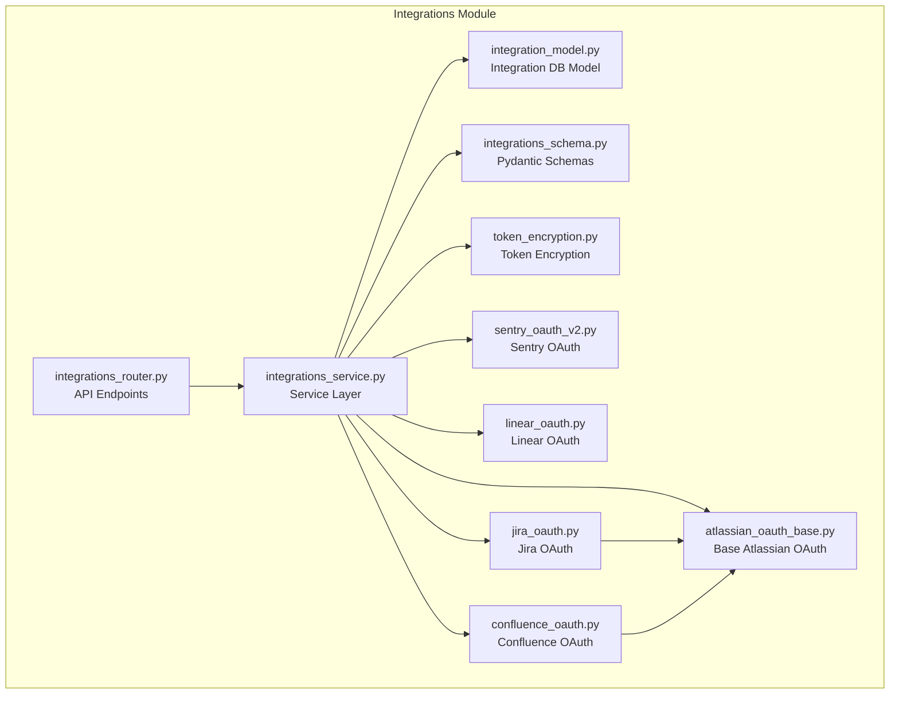
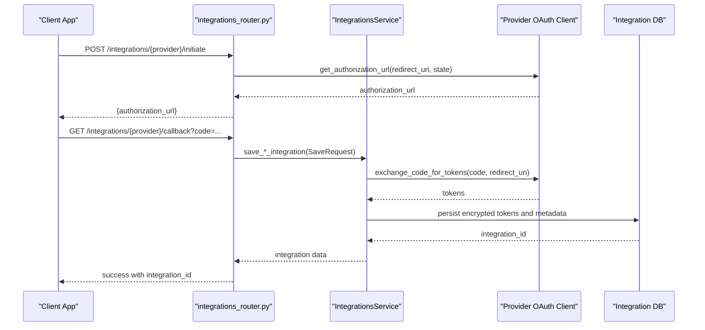
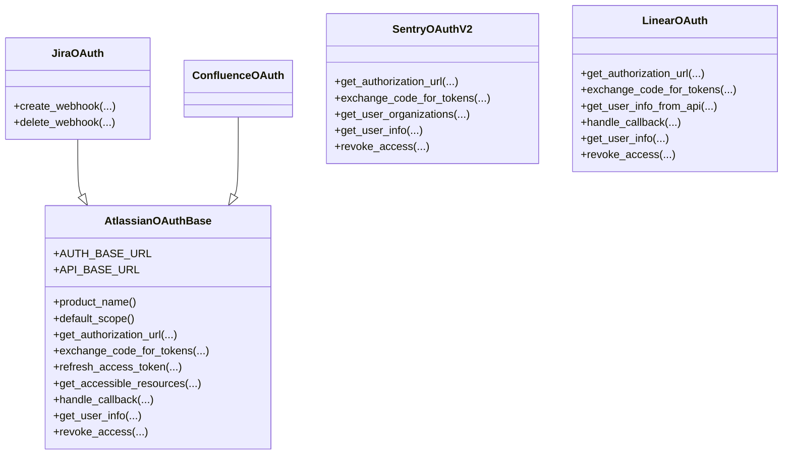
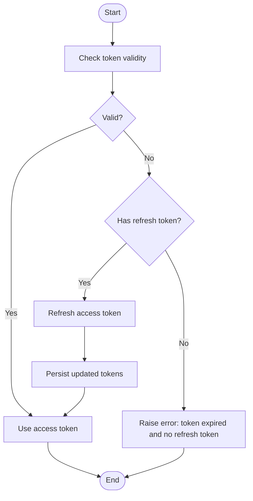
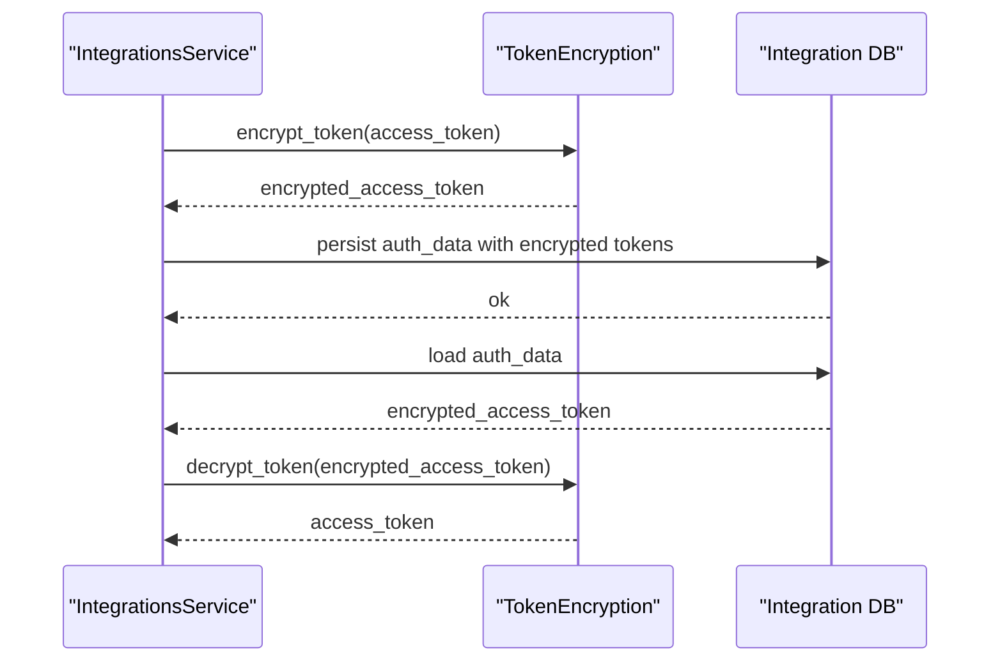
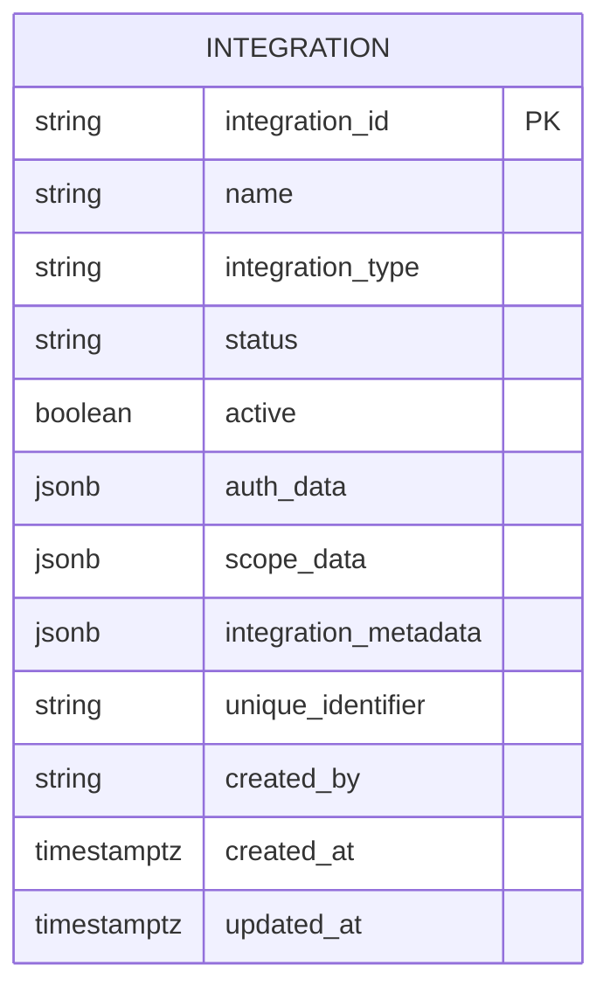
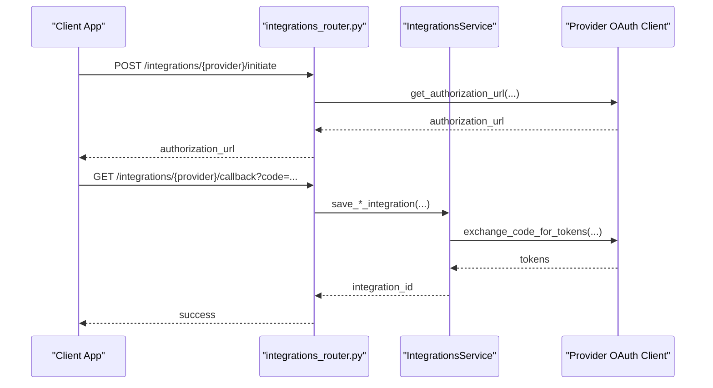
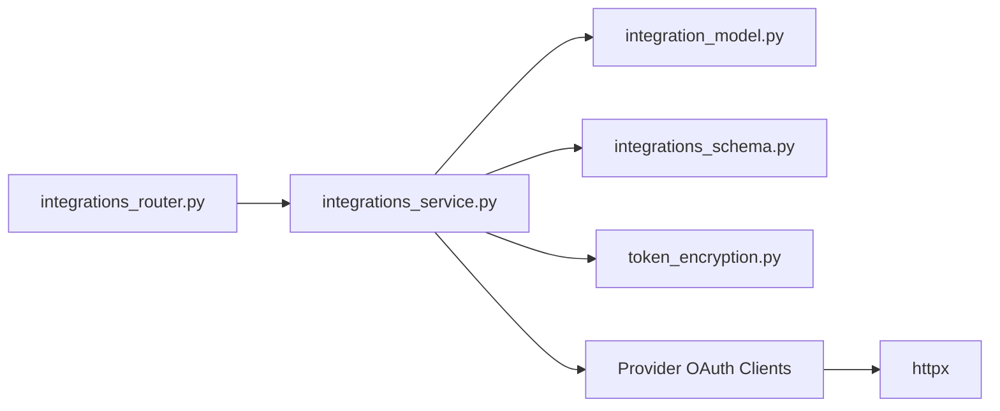

# OAuth Implementation

<cite>
**Referenced Files in This Document**
- [atlassian_oauth_base.py](file://app/modules/integrations/atlassian_oauth_base.py)
- [token_encryption.py](file://app/modules/integrations/token_encryption.py)
- [integration_model.py](file://app/modules/integrations/integration_model.py)
- [integrations_schema.py](file://app/modules/integrations/integrations_schema.py)
- [integrations_service.py](file://app/modules/integrations/integrations_service.py)
- [sentry_oauth_v2.py](file://app/modules/integrations/sentry_oauth_v2.py)
- [linear_oauth.py](file://app/modules/integrations/linear_oauth.py)
- [jira_oauth.py](file://app/modules/integrations/jira_oauth.py)
- [confluence_oauth.py](file://app/modules/integrations/confluence_oauth.py)
- [integrations_router.py](file://app/modules/integrations/integrations_router.py)
</cite>

## Table of Contents
1. [Introduction](#introduction)
2. [Project Structure](#project-structure)
3. [Core Components](#core-components)
4. [Architecture Overview](#architecture-overview)
5. [Detailed Component Analysis](#detailed-component-analysis)
6. [Dependency Analysis](#dependency-analysis)
7. [Performance Considerations](#performance-considerations)
8. [Troubleshooting Guide](#troubleshooting-guide)
9. [Conclusion](#conclusion)
10. [Appendices](#appendices)

## Introduction
This document describes the OAuth implementation framework used across external integrations. It explains the OAuth flow architecture, token encryption/decryption mechanisms, and secure credential storage. It documents the OAuth base classes and service-specific implementations, token lifecycle management (including refresh tokens, expiration handling, and automatic renewal), and provides practical examples for configuration, authorization code exchange, and access token validation. It also covers integration schemas and data models for OAuth credentials, along with security best practices for token storage, encryption algorithms, and credential rotation. Common OAuth challenges such as token expiration, rate limiting, and error handling strategies are addressed.

## Project Structure
The OAuth implementation spans several modules under app/modules/integrations:
- Base OAuth abstractions and shared utilities
- Provider-specific OAuth handlers
- Token encryption utilities
- Database model and Pydantic schemas for integrations
- Service layer orchestrating persistence and token lifecycle
- Router endpoints exposing OAuth flows and webhook handling

**Diagram sources**
- [atlassian_oauth_base.py](file://app/modules/integrations/atlassian_oauth_base.py#L56-L383)
- [sentry_oauth_v2.py](file://app/modules/integrations/sentry_oauth_v2.py#L50-L268)
- [linear_oauth.py](file://app/modules/integrations/linear_oauth.py#L51-L264)
- [jira_oauth.py](file://app/modules/integrations/jira_oauth.py#L12-L149)
- [confluence_oauth.py](file://app/modules/integrations/confluence_oauth.py#L16-L82)
- [token_encryption.py](file://app/modules/integrations/token_encryption.py#L14-L108)
- [integration_model.py](file://app/modules/integrations/integration_model.py#L7-L44)
- [integrations_schema.py](file://app/modules/integrations/integrations_schema.py#L65-L428)
- [integrations_service.py](file://app/modules/integrations/integrations_service.py#L40-L800)
- [integrations_router.py](file://app/modules/integrations/integrations_router.py#L52-L2584)

**Section sources**
- [integrations_router.py](file://app/modules/integrations/integrations_router.py#L52-L2584)
- [integrations_service.py](file://app/modules/integrations/integrations_service.py#L40-L800)
- [integration_model.py](file://app/modules/integrations/integration_model.py#L7-L44)
- [integrations_schema.py](file://app/modules/integrations/integrations_schema.py#L65-L428)

## Core Components
- OAuth base classes:
  - AtlassianOAuthBase: Provides shared OAuth 2.0 (3LO) logic for Atlassian products (Jira, Confluence), including authorization URL generation, token exchange, refresh, accessible resources retrieval, and callback handling.
  - SentryOAuthV2: Provider-specific OAuth for Sentry, including authorization URL generation, token exchange, organization retrieval, and user info helpers.
  - LinearOAuth: Provider-specific OAuth for Linear, including authorization URL generation, token exchange, GraphQL user info retrieval, and callback handling.
- Token encryption utilities:
  - TokenEncryption: Manages encryption/decryption of tokens using Fernet with a key derived from ENCRYPTION_KEY, padding/truncating to 32 bytes, and safe handling of missing keys in development.
- Integration data model and schemas:
  - Integration (SQLAlchemy): Stores integration records with JSONB fields for extensible auth_data, scope_data, and metadata.
  - Pydantic schemas: Define AuthData, ScopeData, Integration, and provider-specific requests/responses for OAuth flows and statuses.
- Service layer:
  - IntegrationsService: Orchestrates OAuth flows, token lifecycle, database persistence, webhook publication, and provider-specific operations.
- Router endpoints:
  - Expose OAuth initiation, callbacks, status checks, revocation, and webhook handling for Sentry, Linear, Jira, and Confluence.

**Section sources**
- [atlassian_oauth_base.py](file://app/modules/integrations/atlassian_oauth_base.py#L56-L383)
- [sentry_oauth_v2.py](file://app/modules/integrations/sentry_oauth_v2.py#L50-L268)
- [linear_oauth.py](file://app/modules/integrations/linear_oauth.py#L51-L264)
- [token_encryption.py](file://app/modules/integrations/token_encryption.py#L14-L108)
- [integration_model.py](file://app/modules/integrations/integration_model.py#L7-L44)
- [integrations_schema.py](file://app/modules/integrations/integrations_schema.py#L27-L428)
- [integrations_service.py](file://app/modules/integrations/integrations_service.py#L40-L800)
- [integrations_router.py](file://app/modules/integrations/integrations_router.py#L52-L2584)

## Architecture Overview
The OAuth framework follows a layered architecture:
- Router layer exposes endpoints for OAuth initiation, callbacks, status, revocation, and webhook handling.
- Service layer coordinates provider-specific OAuth clients, token lifecycle, database persistence, and event bus publishing.
- Provider-specific OAuth clients encapsulate provider-specific flows and endpoints.
- Token encryption utilities ensure secure storage of tokens.
- Database model and schemas define persistent structures and request/response contracts.

**Diagram sources**
- [integrations_router.py](file://app/modules/integrations/integrations_router.py#L180-L784)
- [integrations_service.py](file://app/modules/integrations/integrations_service.py#L595-L788)
- [sentry_oauth_v2.py](file://app/modules/integrations/sentry_oauth_v2.py#L124-L194)
- [linear_oauth.py](file://app/modules/integrations/linear_oauth.py#L89-L157)
- [jira_oauth.py](file://app/modules/integrations/jira_oauth.py#L12-L149)
- [confluence_oauth.py](file://app/modules/integrations/confluence_oauth.py#L16-L82)
- [integration_model.py](file://app/modules/integrations/integration_model.py#L7-L44)

## Detailed Component Analysis

### OAuth Base Classes and Providers
- AtlassianOAuthBase:
  - Provides shared authorization URL generation, token exchange, refresh, accessible resources retrieval, and callback handling.
  - Uses a shared token store for in-memory caching and validity checks.
  - Supports product-specific customization via subclass properties (product_name, default_scope).
- SentryOAuthV2:
  - Generates authorization URL with proper encoding and sanitization.
  - Exchanges authorization code for tokens and retrieves organization info.
  - Includes user info helpers and revocation compatibility methods.
- LinearOAuth:
  - Generates authorization URL with configurable scope.
  - Exchanges authorization code for tokens and retrieves user info via GraphQL.
  - Handles callback and revocation.
- JiraOAuth and ConfluenceOAuth:
  - Subclass AtlassianOAuthBase to reuse shared OAuth logic.
  - Jira adds webhook creation/deletion helpers.
  - Confluence defines default scopes and notes about webhook limitations.

**Diagram sources**
- [atlassian_oauth_base.py](file://app/modules/integrations/atlassian_oauth_base.py#L56-L383)
- [jira_oauth.py](file://app/modules/integrations/jira_oauth.py#L12-L149)
- [confluence_oauth.py](file://app/modules/integrations/confluence_oauth.py#L16-L82)
- [sentry_oauth_v2.py](file://app/modules/integrations/sentry_oauth_v2.py#L50-L268)
- [linear_oauth.py](file://app/modules/integrations/linear_oauth.py#L51-L264)

**Section sources**
- [atlassian_oauth_base.py](file://app/modules/integrations/atlassian_oauth_base.py#L56-L383)
- [jira_oauth.py](file://app/modules/integrations/jira_oauth.py#L12-L149)
- [confluence_oauth.py](file://app/modules/integrations/confluence_oauth.py#L16-L82)
- [sentry_oauth_v2.py](file://app/modules/integrations/sentry_oauth_v2.py#L50-L268)
- [linear_oauth.py](file://app/modules/integrations/linear_oauth.py#L51-L264)

### Token Lifecycle Management
- Token exchange:
  - Providers exchange authorization code for tokens using provider-specific endpoints.
  - Sentry and Linear use form-encoded data; Atlassian uses JSON payload.
- Token refresh:
  - Sentry refresh flow decrypts stored refresh token, requests new tokens, re-encrypts, and persists updated auth_data.
  - Atlassian refresh flow uses shared token endpoint and updates in-memory store.
- Expiration handling:
  - Tokens carry expires_in or expires_at; service validates expiration and triggers refresh when needed.
  - Automatic renewal obtains a new access token using stored refresh token before making API calls.
- Revocation:
  - Providers expose revoke_access to invalidate tokens; service deactivates integrations for user.

**Diagram sources**
- [integrations_service.py](file://app/modules/integrations/integrations_service.py#L304-L353)
- [integrations_service.py](file://app/modules/integrations/integrations_service.py#L164-L297)
- [atlassian_oauth_base.py](file://app/modules/integrations/atlassian_oauth_base.py#L224-L282)

**Section sources**
- [integrations_service.py](file://app/modules/integrations/integrations_service.py#L164-L297)
- [integrations_service.py](file://app/modules/integrations/integrations_service.py#L304-L353)
- [atlassian_oauth_base.py](file://app/modules/integrations/atlassian_oauth_base.py#L224-L282)

### Secure Credential Storage and Encryption
- TokenEncryption:
  - Initializes Fernet with ENCRYPTION_KEY, padding/truncating to 32 bytes, and logs a non-reversible fingerprint in development.
  - Provides encrypt_token and decrypt_token for secure storage and use.
- Database storage:
  - Integration.auth_data stores encrypted tokens and metadata; scope_data captures provider-specific identifiers.
- Best practices:
  - Store only encrypted tokens in DB.
  - Rotate ENCRYPTION_KEY by re-encrypting stored tokens during migration.
  - Avoid logging sensitive tokens; sanitize headers and query parameters.

**Diagram sources**
- [token_encryption.py](file://app/modules/integrations/token_encryption.py#L14-L108)
- [integrations_service.py](file://app/modules/integrations/integrations_service.py#L600-L766)
- [integration_model.py](file://app/modules/integrations/integration_model.py#L22-L27)

**Section sources**
- [token_encryption.py](file://app/modules/integrations/token_encryption.py#L14-L108)
- [integration_model.py](file://app/modules/integrations/integration_model.py#L22-L27)
- [integrations_service.py](file://app/modules/integrations/integrations_service.py#L600-L766)

### Integration Schemas and Data Models
- Integration (SQLAlchemy):
  - Fields: integration_id, name, integration_type, status, active, auth_data (JSONB), scope_data (JSONB), integration_metadata (JSONB), unique_identifier, created_by, created_at, updated_at.
- Pydantic schemas:
  - AuthData: access_token, refresh_token, token_type, expires_at, scope, code.
  - ScopeData: org_slug, installation_id, workspace_id, project_id.
  - Integration, IntegrationCreateRequest, IntegrationUpdateRequest, IntegrationResponse, IntegrationListResponse.
  - Provider-specific schemas for Sentry, Linear, Jira, Confluence including status and save requests.

**Diagram sources**
- [integration_model.py](file://app/modules/integrations/integration_model.py#L7-L44)

**Section sources**
- [integration_model.py](file://app/modules/integrations/integration_model.py#L7-L44)
- [integrations_schema.py](file://app/modules/integrations/integrations_schema.py#L27-L428)

### Practical Examples

#### OAuth Configuration
- Environment variables:
  - Sentry: SENTRY_CLIENT_ID, SENTRY_CLIENT_SECRET, SENTRY_REDIRECT_URI
  - Linear: LINEAR_CLIENT_ID, LINEAR_CLIENT_SECRET
  - Jira: JIRA_CLIENT_ID, JIRA_CLIENT_SECRET, JIRA_OAUTH_SCOPE, JIRA_REDIRECT_URI
  - Confluence: CONFLUENCE_CLIENT_ID, CONFLUENCE_CLIENT_SECRET, CONFLUENCE_OAUTH_SCOPE, CONFLUENCE_REDIRECT_URI
  - Atlassian: ATLAS_CLIENT_ID, ATLAS_CLIENT_SECRET (shared)
  - State protection: OAUTH_STATE_SECRET
  - Encryption: ENCRYPTION_KEY
- Router debug endpoints:
  - GET /integrations/debug/oauth-config
  - GET /integrations/debug/sentry-app-info

**Section sources**
- [integrations_router.py](file://app/modules/integrations/integrations_router.py#L2445-L2584)
- [integrations_router.py](file://app/modules/integrations/integrations_router.py#L2445-L2584)

#### Authorization Code Exchange
- Sentry:
  - Initiate: POST /integrations/sentry/initiate
  - Callback: GET /integrations/sentry/callback
  - Save: POST /integrations/sentry/save
- Linear:
  - Initiate: GET /integrations/linear/redirect
  - Callback: GET /integrations/linear/callback
  - Save: POST /integrations/linear/save
- Jira:
  - Initiate: POST /integrations/jira/initiate
  - Callback: GET /integrations/jira/callback
  - Save: POST /integrations/jira/save
- Confluence:
  - Initiate: POST /integrations/confluence/initiate
  - Callback: GET /integrations/confluence/callback
  - Save: POST /integrations/confluence/save

**Diagram sources**
- [integrations_router.py](file://app/modules/integrations/integrations_router.py#L180-L784)
- [integrations_service.py](file://app/modules/integrations/integrations_service.py#L595-L788)

**Section sources**
- [integrations_router.py](file://app/modules/integrations/integrations_router.py#L180-L784)
- [integrations_service.py](file://app/modules/integrations/integrations_service.py#L595-L788)

#### Access Token Validation and Renewal
- Endpoint: GET /integrations/sentry/{integration_id}/token-status
- Service logic:
  - Load integration and auth_data.
  - If token expired, refresh using stored refresh token.
  - Decrypt and return access token for immediate use.

**Section sources**
- [integrations_router.py](file://app/modules/integrations/integrations_router.py#L2408-L2443)
- [integrations_service.py](file://app/modules/integrations/integrations_service.py#L304-L353)

### Webhook Handling and Security
- Sentry webhook:
  - POST /integrations/sentry/webhook
  - Logs and publishes to event bus; extracts integration_id from query/header/payload.
- Linear webhook:
  - POST /integrations/linear/webhook
  - Logs and publishes to event bus; attempts to resolve integration by organizationId.
- Jira webhook:
  - POST /integrations/jira/webhook
  - Verifies JWT signature using HS256 with JIRA_CLIENT_SECRET; resolves integration by matchedWebhookIds + site_id; publishes to event bus.

**Section sources**
- [integrations_router.py](file://app/modules/integrations/integrations_router.py#L1245-L1527)
- [integrations_router.py](file://app/modules/integrations/integrations_router.py#L1572-L1812)

## Dependency Analysis
- Router depends on Service and provider OAuth clients.
- Service depends on provider OAuth clients, database model/schema, and TokenEncryption.
- Provider OAuth clients depend on httpx and provider endpoints.
- TokenEncryption depends on cryptography and environment variables.

**Diagram sources**
- [integrations_router.py](file://app/modules/integrations/integrations_router.py#L52-L2584)
- [integrations_service.py](file://app/modules/integrations/integrations_service.py#L40-L800)
- [integration_model.py](file://app/modules/integrations/integration_model.py#L7-L44)
- [integrations_schema.py](file://app/modules/integrations/integrations_schema.py#L65-L428)
- [token_encryption.py](file://app/modules/integrations/token_encryption.py#L14-L108)
- [sentry_oauth_v2.py](file://app/modules/integrations/sentry_oauth_v2.py#L50-L268)
- [linear_oauth.py](file://app/modules/integrations/linear_oauth.py#L51-L264)
- [jira_oauth.py](file://app/modules/integrations/jira_oauth.py#L12-L149)
- [confluence_oauth.py](file://app/modules/integrations/confluence_oauth.py#L16-L82)

**Section sources**
- [integrations_router.py](file://app/modules/integrations/integrations_router.py#L52-L2584)
- [integrations_service.py](file://app/modules/integrations/integrations_service.py#L40-L800)

## Performance Considerations
- Asynchronous HTTP calls:
  - All token exchanges and API calls use httpx.AsyncClient to minimize latency.
- Token caching:
  - In-memory token stores reduce repeated provider calls for short-lived validations.
- Minimal logging of sensitive data:
  - Sanitized headers and truncated previews prevent accidental exposure.
- Batch operations:
  - Webhook processing publishes events asynchronously via event bus.

[No sources needed since this section provides general guidance]

## Troubleshooting Guide
- Common OAuth errors:
  - invalid_grant: Often caused by expired authorization code, mismatched redirect_uri, or incorrect client credentials.
  - Rate limiting: Implement retries with exponential backoff and respect provider limits.
  - Network failures: Wrap HTTP calls with timeouts and retry logic.
- Error handling strategies:
  - Sanitized error responses: The service parses provider error bodies and logs sanitized messages.
  - State verification: Signed state prevents CSRF and ensures user identity.
  - Token refresh on demand: Automatically refreshes tokens when expired to maintain uptime.
- Debugging endpoints:
  - GET /integrations/debug/oauth-config
  - GET /integrations/debug/test-token-exchange
  - GET /integrations/debug/sentry-app-info

**Section sources**
- [integrations_service.py](file://app/modules/integrations/integrations_service.py#L213-L255)
- [integrations_router.py](file://app/modules/integrations/integrations_router.py#L2445-L2584)
- [integrations_router.py](file://app/modules/integrations/integrations_router.py#L2518-L2542)

## Conclusion
The OAuth implementation framework provides a robust, provider-agnostic foundation for integrating external services. It centralizes OAuth flows, manages token lifecycle securely, and offers strong protections for sensitive data. By leveraging shared base classes, encryption utilities, and schema-driven persistence, the system supports Sentry, Linear, Jira, and Confluence with consistent patterns and clear extension points.

[No sources needed since this section summarizes without analyzing specific files]

## Appendices

### Security Best Practices
- Encryption:
  - Always store tokens encrypted using TokenEncryption.
  - Rotate ENCRYPTION_KEY and re-encrypt stored tokens during migration.
- Secrets:
  - Configure OAUTH_STATE_SECRET for signed state tokens.
  - Protect JIRA_CLIENT_SECRET for webhook JWT verification.
- Logging:
  - Sanitize headers and truncate request bodies to avoid leaking secrets.
- Token lifecycle:
  - Validate expiration before use; refresh automatically when needed.
  - Revoke tokens on user request and deactivate integrations.

**Section sources**
- [token_encryption.py](file://app/modules/integrations/token_encryption.py#L14-L108)
- [integrations_router.py](file://app/modules/integrations/integrations_router.py#L119-L178)
- [integrations_router.py](file://app/modules/integrations/integrations_router.py#L1529-L1570)