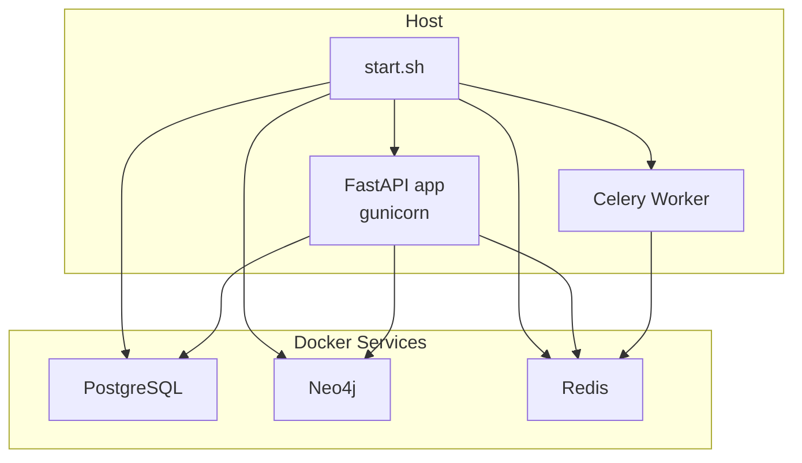

# Getting Started

<cite>
**Referenced Files in This Document**
- [README.md](file://README.md)
- [GETTING_STARTED.md](file://GETTING_STARTED.md)
- [start.sh](file://start.sh)
- [stop.sh](file://stop.sh)
- [docker-compose.yaml](file://docker-compose.yaml)
- [.env.template](file://.env.template)
- [pyproject.toml](file://pyproject.toml)
- [app/main.py](file://app/main.py)
- [app/modules/auth/auth_router.py](file://app/modules/auth/auth_router.py)
- [app/modules/parsing/graph_construction/parsing_router.py](file://app/modules/parsing/graph_construction/parsing_router.py)
- [app/modules/conversations/conversations_router.py](file://app/modules/conversations/conversations_router.py)
- [app/modules/intelligence/agents/agents_router.py](file://app/modules/intelligence/agents/agents_router.py)
- [scripts/install_gvisor.py](file://scripts/install_gvisor.py)
</cite>

## Table of Contents
1. [Introduction](#introduction)
2. [Prerequisites](#prerequisites)
3. [Quick Start](#quick-start)
4. [Environment Setup](#environment-setup)
5. [Authentication Setup](#authentication-setup)
6. [Repository Parsing](#repository-parsing)
7. [Basic API Usage](#basic-api-usage)
8. [Architecture Overview](#architecture-overview)
9. [Troubleshooting Guide](#troubleshooting-guide)
10. [Conclusion](#conclusion)

## Introduction
Potpie is an open-source platform that builds a knowledge graph of your codebase and powers AI agents to help with debugging, testing, code generation, and more. This guide walks you through installing prerequisites, setting up the environment, authenticating, parsing repositories, and interacting with agents via the API.

## Prerequisites
- Docker installed and running
- Git installed (for repository access)
- Python 3.11+ (required for uv and dependencies)
- uv package manager (install via the official installer)

These are required for both development and production setups. The project template provides defaults for local databases and services.

**Section sources**
- [README.md](file://README.md#L121-L127)
- [.env.template](file://.env.template#L1-L116)

## Quick Start
Follow these steps to get Potpie running locally:

1. Install uv and ensure it is in your PATH.
2. Prepare your environment:
   - Create a `.env` file from the template.
   - Set required variables for databases, queues, and LLM providers.
3. Install dependencies using uv.
4. Start all services with the provided script.
5. Optionally install gVisor for command isolation (optional).
6. Initialize repository parsing and start chatting with agents.

Key commands:
- Install dependencies: uv sync
- Start services: ./start.sh
- Stop services: ./stop.sh

**Section sources**
- [GETTING_STARTED.md](file://GETTING_STARTED.md#L5-L27)
- [README.md](file://README.md#L174-L214)
- [start.sh](file://start.sh#L29-L48)

## Environment Setup
- Create a `.env` file from the template and set:
  - Databases: POSTGRES_SERVER, NEO4J_URI, NEO4J_USERNAME, NEO4J_PASSWORD
  - Queue: REDISHOST, REDISPORT, BROKER_URL, CELERY_QUEUE_NAME
  - LLM: INFERENCE_MODEL, CHAT_MODEL, and provider API keys
  - Optional: Phoenix tracing, storage providers, and GitHub/GitBucket settings
- For local models, set INFERENCE_MODEL and CHAT_MODEL to your provider/model format.
- For production, configure Firebase, Google Cloud, and GitHub App credentials.

Notes:
- The application expects a managed virtual environment created by uv.
- The script sets up the environment and runs migrations automatically.

**Section sources**
- [.env.template](file://.env.template#L1-L116)
- [GETTING_STARTED.md](file://GETTING_STARTED.md#L17-L46)
- [README.md](file://README.md#L184-L214)
- [start.sh](file://start.sh#L76-L84)

## Authentication Setup
- Development mode:
  - Dummy user is created automatically during startup.
  - No external authentication required for local testing.
- Production mode:
  - Use Firebase Authentication with GitHub or SSO providers.
  - Configure GitHub App credentials or PAT pools for GitHub access.
  - For self-hosted Git servers, set CODE_PROVIDER, CODE_PROVIDER_BASE_URL, and CODE_PROVIDER_TOKEN.

API endpoints:
- POST /api/v1/login (email/password)
- POST /api/v1/sso/login (SSO providers)
- GET /api/v1/providers/me (list providers)
- POST /api/v1/providers/confirm-linking (link providers)
- DELETE /api/v1/providers/unlink (unlink providers)

**Section sources**
- [app/main.py](file://app/main.py#L131-L142)
- [app/modules/auth/auth_router.py](file://app/modules/auth/auth_router.py#L52-L800)
- [.env.template](file://.env.template#L62-L95)

## Repository Parsing
After starting services, parse a repository to build the knowledge graph:

- Development mode:
  - Use a local path for repo_path and specify branch_name.
- Production mode:
  - Use owner/repo-name for repo_name and specify branch_name.
- Monitor parsing progress via parsing-status endpoints.

Endpoints:
- POST /api/v1/parse (start parsing)
- GET /api/v1/parsing-status/{project_id} (poll status)
- POST /api/v1/parsing-status (by repo details)

Example requests:
- Start parsing with repo_path and branch_name
- Poll status using project_id
- Use repo_name and branch_name for hosted repos

**Section sources**
- [app/modules/parsing/graph_construction/parsing_router.py](file://app/modules/parsing/graph_construction/parsing_router.py#L16-L39)
- [README.md](file://README.md#L316-L341)

## Basic API Usage
Interact with Potpie using the following endpoints:

- Agents:
  - GET /api/v1/list-available-agents/?list_system_agents=true
- Conversations:
  - POST /api/v1/conversations/ (create)
  - GET /api/v1/conversations/{conversation_id}/messages/?start=0&limit=10 (history)
  - POST /api/v1/conversations/{conversation_id}/message/ (send message)
- Authentication:
  - POST /api/v1/login (email/password)
  - POST /api/v1/sso/login (SSO)
- Parsing:
  - POST /api/v1/parse
  - GET /api/v1/parsing-status/{project_id}

Example flows:
- Initialize repository parsing
- Monitor parsing status
- View available agents
- Create a conversation
- Send messages and receive streamed responses

**Section sources**
- [app/modules/intelligence/agents/agents_router.py](file://app/modules/intelligence/agents/agents_router.py#L32-L46)
- [app/modules/conversations/conversations_router.py](file://app/modules/conversations/conversations_router.py#L83-L102)
- [app/modules/conversations/conversations_router.py](file://app/modules/conversations/conversations_router.py#L161-L286)
- [app/modules/auth/auth_router.py](file://app/modules/auth/auth_router.py#L52-L71)
- [app/modules/auth/auth_router.py](file://app/modules/auth/auth_router.py#L441-L570)

## Architecture Overview
Potpie runs as a FastAPI application backed by Dockerized services for persistence and queuing. The startup script orchestrates:
- Docker Compose services (PostgreSQL, Neo4j, Redis)
- uv-managed Python environment
- Alembic migrations
- FastAPI app (gunicorn) and Celery worker

**Diagram sources**
- [start.sh](file://start.sh#L16-L92)
- [docker-compose.yaml](file://docker-compose.yaml#L1-L57)

**Section sources**
- [start.sh](file://start.sh#L16-L92)
- [docker-compose.yaml](file://docker-compose.yaml#L1-L57)
- [app/main.py](file://app/main.py#L208-L217)

## Troubleshooting Guide
Common setup issues and resolutions:

- uv not found:
  - Ensure uv is installed and in PATH. The script checks for uv and exits if missing.
- Docker not running:
  - Start Docker Desktop or Docker Engine. The script waits for PostgreSQL readiness.
- PostgreSQL readiness:
  - The script polls pg_isready; ensure the container is healthy.
- Managed environment:
  - The script activates a uv-managed venv and runs migrations automatically.
- gVisor installation:
  - Optional step for command isolation. The script attempts installation and prints guidance for Docker Desktop if applicable.
- Authentication:
  - In development mode, a dummy user is created. For production, configure Firebase and GitHub App credentials.
- Local vs Production models:
  - Set INFERENCE_MODEL and CHAT_MODEL appropriately for your provider.

**Section sources**
- [start.sh](file://start.sh#L29-L48)
- [start.sh](file://start.sh#L76-L84)
- [scripts/install_gvisor.py](file://scripts/install_gvisor.py#L1-L25)
- [app/main.py](file://app/main.py#L131-L142)
- [.env.template](file://.env.template#L15-L25)

## Conclusion
You are now ready to use Potpie locally. Start by preparing your environment, running the startup script, parsing a repository, and interacting with agents via the API. For production deployments, configure Firebase, GitHub App, and Google Cloud as needed.