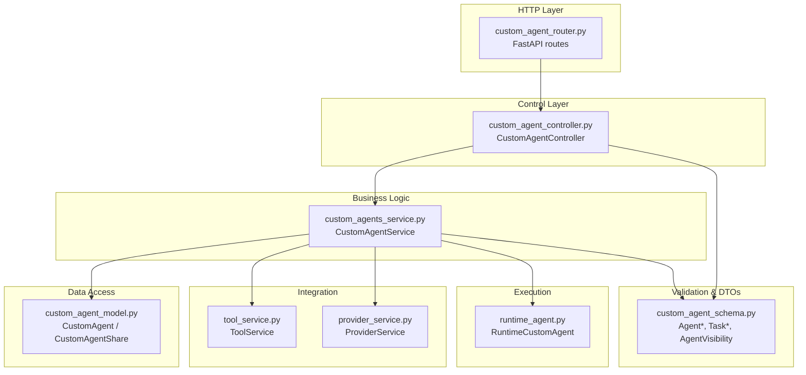
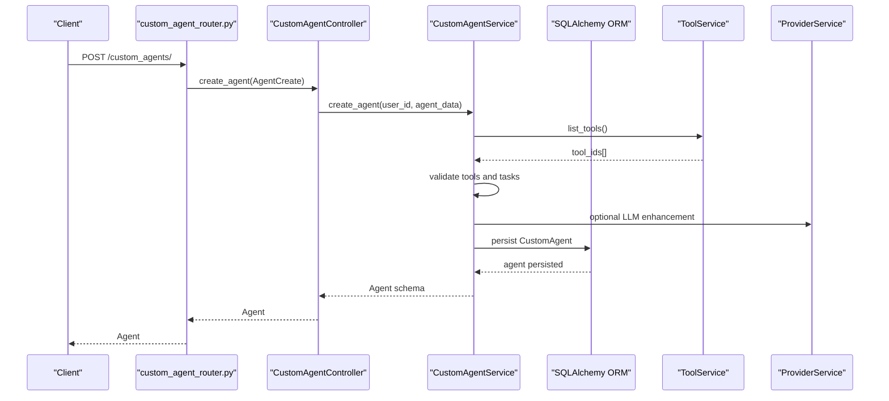
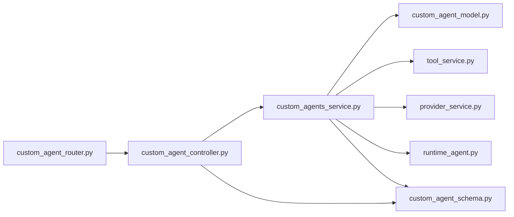
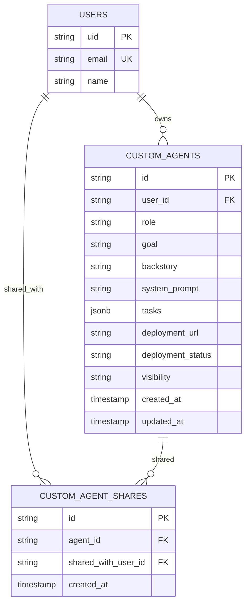
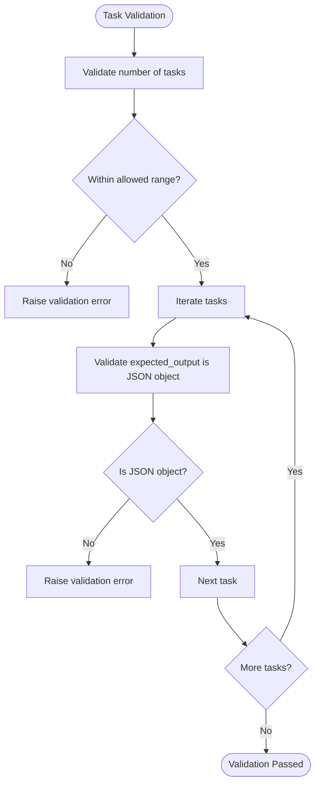
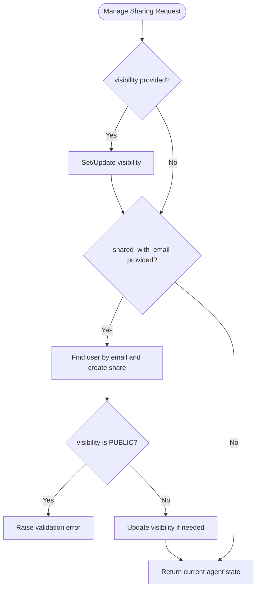

# Custom Agent Creation & Configuration

<cite>
**Referenced Files in This Document**
- [custom_agent_controller.py](file://app/modules/intelligence/agents/custom_agents/custom_agent_controller.py)
- [custom_agent_router.py](file://app/modules/intelligence/agents/custom_agents/custom_agent_router.py)
- [custom_agent_schema.py](file://app/modules/intelligence/agents/custom_agents/custom_agent_schema.py)
- [custom_agent_model.py](file://app/modules/intelligence/agents/custom_agents/custom_agent_model.py)
- [custom_agents_service.py](file://app/modules/intelligence/agents/custom_agents/custom_agents_service.py)
- [runtime_agent.py](file://app/modules/intelligence/agents/custom_agents/runtime_agent.py)
- [tool_service.py](file://app/modules/intelligence/tools/tool_service.py)
- [provider_service.py](file://app/modules/intelligence/provider/provider_service.py)
- [20241020111943_262d870e9686_custom_agents.py](file://app/alembic/versions/20241020111943_262d870e9686_custom_agents.py)
- [20250303164854_414f9ab20475_custom_agent_sharing.py](file://app/alembic/versions/20250303164854_414f9ab20475_custom_agent_sharing.py)
- [20250310201406_97a740b07a50_custom_agent_sharing.py](file://app/alembic/versions/20250310201406_97a740b07a50_custom_agent_sharing.py)
</cite>

## Table of Contents
1. [Introduction](#introduction)
2. [Project Structure](#project-structure)
3. [Core Components](#core-components)
4. [Architecture Overview](#architecture-overview)
5. [Detailed Component Analysis](#detailed-component-analysis)
6. [Dependency Analysis](#dependency-analysis)
7. [Performance Considerations](#performance-considerations)
8. [Troubleshooting Guide](#troubleshooting-guide)
9. [Conclusion](#conclusion)
10. [Appendices](#appendices)

## Introduction
This document explains how to create and configure custom agents in the system. It covers the agent creation workflow from request to persistence, including schema validation, parameter configuration, and initial setup. It documents the controller, service, router, schema, and model layers, and clarifies how runtime execution is handled. Practical examples, validation scenarios, and troubleshooting guidance are included to help you build robust custom agents tailored to specific use cases.

## Project Structure
The custom agent feature is organized around a clear separation of concerns:
- Router: Exposes HTTP endpoints for agent lifecycle operations.
- Controller: Orchestrates cross-service operations and enforces authorization.
- Service: Implements business logic, validation, persistence, and runtime execution.
- Schema: Defines Pydantic models for request/response validation and serialization.
- Model: SQLAlchemy ORM models representing persisted agent records and shares.
- Runtime Agent: Executes agents at runtime without deployment, integrating tools and providers.

**Diagram sources**
- [custom_agent_router.py](file://app/modules/intelligence/agents/custom_agents/custom_agent_router.py#L26-L226)
- [custom_agent_controller.py](file://app/modules/intelligence/agents/custom_agents/custom_agent_controller.py#L24-L338)
- [custom_agents_service.py](file://app/modules/intelligence/agents/custom_agents/custom_agents_service.py#L37-L1157)
- [custom_agent_model.py](file://app/modules/intelligence/agents/custom_agents/custom_agent_model.py#L9-L61)
- [custom_agent_schema.py](file://app/modules/intelligence/agents/custom_agents/custom_agent_schema.py#L36-L159)
- [runtime_agent.py](file://app/modules/intelligence/agents/custom_agents/runtime_agent.py#L44-L172)
- [tool_service.py](file://app/modules/intelligence/tools/tool_service.py#L99-L200)
- [provider_service.py](file://app/modules/intelligence/provider/provider_service.py#L472-L1343)

**Section sources**
- [custom_agent_router.py](file://app/modules/intelligence/agents/custom_agents/custom_agent_router.py#L1-L227)
- [custom_agent_controller.py](file://app/modules/intelligence/agents/custom_agents/custom_agent_controller.py#L1-L338)
- [custom_agents_service.py](file://app/modules/intelligence/agents/custom_agents/custom_agents_service.py#L1-L1157)
- [custom_agent_model.py](file://app/modules/intelligence/agents/custom_agents/custom_agent_model.py#L1-L61)
- [custom_agent_schema.py](file://app/modules/intelligence/agents/custom_agents/custom_agent_schema.py#L1-L159)
- [runtime_agent.py](file://app/modules/intelligence/agents/custom_agents/runtime_agent.py#L1-L172)
- [tool_service.py](file://app/modules/intelligence/tools/tool_service.py#L1-L200)
- [provider_service.py](file://app/modules/intelligence/provider/provider_service.py#L472-L1343)

## Core Components
- Router: Provides endpoints for creating, listing, retrieving, updating, deleting, sharing, revoking access, and listing shares for agents. It depends on authentication and database sessions and delegates to the controller.
- Controller: Coordinates service operations and user access checks. It initializes ProviderService, ToolService, and UserService to support agent creation and sharing.
- Service: Implements agent creation, validation, persistence, updates, deletion, runtime execution, and sharing management. It validates tools, enhances tasks via LLM, converts models to schemas, and manages visibility and shares.
- Schema: Defines Agent, AgentCreate, AgentUpdate, Task, TaskCreate, AgentVisibility, and related request/response models with Pydantic validators and field-level constraints.
- Model: SQLAlchemy ORM models for custom agents and agent shares, including relationships and foreign keys to users.
- Runtime Agent: Builds and runs agents at runtime using tools and provider capabilities, supporting multi-agent modes and MCP server configuration.

**Section sources**
- [custom_agent_router.py](file://app/modules/intelligence/agents/custom_agents/custom_agent_router.py#L26-L226)
- [custom_agent_controller.py](file://app/modules/intelligence/agents/custom_agents/custom_agent_controller.py#L24-L338)
- [custom_agents_service.py](file://app/modules/intelligence/agents/custom_agents/custom_agents_service.py#L37-L1157)
- [custom_agent_schema.py](file://app/modules/intelligence/agents/custom_agents/custom_agent_schema.py#L36-L159)
- [custom_agent_model.py](file://app/modules/intelligence/agents/custom_agents/custom_agent_model.py#L9-L61)
- [runtime_agent.py](file://app/modules/intelligence/agents/custom_agents/runtime_agent.py#L44-L172)

## Architecture Overview
The agent creation pipeline follows a layered architecture:
- HTTP request enters the router, validated by Pydantic models.
- Controller enforces ownership and permission checks.
- Service performs validation, tool availability checks, optional LLM-enhanced task descriptions, and persists the agent.
- Model layer stores agent metadata and tasks (JSONB), and maintains share relationships.
- Runtime agent integrates tools and providers for execution.

**Diagram sources**
- [custom_agent_router.py](file://app/modules/intelligence/agents/custom_agents/custom_agent_router.py#L26-L44)
- [custom_agent_controller.py](file://app/modules/intelligence/agents/custom_agents/custom_agent_controller.py#L32-L41)
- [custom_agents_service.py](file://app/modules/intelligence/agents/custom_agents/custom_agents_service.py#L367-L412)
- [tool_service.py](file://app/modules/intelligence/tools/tool_service.py#L99-L200)
- [provider_service.py](file://app/modules/intelligence/provider/provider_service.py#L472-L1343)

## Detailed Component Analysis

### CustomAgentController
Responsibilities:
- Delegates agent creation, updates, retrieval, listing, deletion, and sharing operations to the service layer.
- Enforces ownership and permission checks for sensitive operations (sharing, revocation, listing shares).
- Initializes ProviderService, ToolService, and UserService for agent operations.

Key methods:
- create_agent: Validates and creates a new agent via service.
- manage_agent_sharing: Updates visibility or shares with a user; enforces mutual exclusivity (cannot be both public and shared with a specific user).
- revoke_agent_access: Revokes a specific user’s access and adjusts visibility if necessary.
- list_agent_shares: Lists emails an agent has been shared with.
- list_agents, update_agent, delete_agent, get_agent: CRUD operations with permission checks.

Common validations:
- Ownership verification before modifying sharing or access.
- Visibility transitions and cascading share removals.

**Section sources**
- [custom_agent_controller.py](file://app/modules/intelligence/agents/custom_agents/custom_agent_controller.py#L24-L338)

### CustomAgentService
Responsibilities:
- Validation and persistence of agents.
- Tool availability checks and task enhancement via LLM.
- Visibility and sharing management with automatic cleanup of orphaned shares.
- Agent retrieval with permission checks (owner, public, shared).
- Runtime execution orchestration using RuntimeCustomAgent.

Key methods:
- create_agent: Extracts tool IDs, validates against available tools, optionally enhances tasks, and persists the agent.
- persist_agent: Creates the ORM record and converts to schema.
- update_agent: Applies partial updates, handles visibility enum conversion, and refreshes state.
- get_agent: Retrieves agent with permission checks and visibility-aware access control.
- list_agents: Queries agents owned by user, plus public/shared based on flags.
- create_agent_from_prompt: Generates a plan from LLM, validates structure, and persists.
- execute_agent_runtime: Builds RuntimeCustomAgent and streams responses.
- Sharing helpers: create_share, revoke_share, list_agent_shares, make_agent_private.

Validation highlights:
- Tasks must be non-empty and limited to a maximum count.
- Expected output must be a JSON object.
- Visibility must be one of the allowed enum values; invalid values default to private.

**Section sources**
- [custom_agents_service.py](file://app/modules/intelligence/agents/custom_agents/custom_agents_service.py#L37-L1157)

### Router Endpoints
Endpoints:
- POST /custom_agents/: Create a new agent (AgentCreate).
- POST /custom_agents/share: Share an agent or change visibility (AgentSharingRequest).
- POST /custom_agents/revoke-access: Revoke access for a user (RevokeAgentAccessRequest).
- GET /custom_agents/: List agents (ListAgentsRequest).
- DELETE /custom_agents/{agent_id}: Delete an agent.
- PUT /custom_agents/{agent_id}: Update an agent (AgentUpdate).
- GET /custom_agents/{agent_id}: Retrieve agent details.
- GET /custom_agents/{agent_id}/shares: List shared emails.

Authorization:
- All endpoints depend on authenticated user context.

Error handling:
- Converts exceptions to HTTPException with appropriate status codes.

**Section sources**
- [custom_agent_router.py](file://app/modules/intelligence/agents/custom_agents/custom_agent_router.py#L26-L226)

### Schema Definitions
Agent model family:
- AgentBase: role, goal, backstory, system_prompt.
- AgentCreate: extends AgentBase with tasks (List[TaskCreate]).
- AgentUpdate: optional fields of AgentBase plus tasks and visibility.
- Agent: extends AgentBase with id, user_id, tasks (List[Task]), deployment fields, timestamps, and visibility.

Task model family:
- TaskBase: description, tools, mcp_servers, expected_output (must be a JSON object).
- TaskCreate: creation-time task.
- Task: runtime task with id and attributes.

Visibility:
- AgentVisibility enum: private, public, shared.

Requests/responses:
- AgentSharingRequest: requires either visibility change or shared_with_email; mutually exclusive with public visibility.
- RevokeAgentAccessRequest: agent_id and user_email.
- AgentSharesResponse: agent_id and shared_with list.
- ListAgentsRequest: include_public and include_shared flags.
- PromptBasedAgentRequest: prompt for plan generation.

Validators:
- Tasks length constrained and expected_output validated as JSON object.
- AgentSharingRequest enforces model-level constraints.

**Section sources**
- [custom_agent_schema.py](file://app/modules/intelligence/agents/custom_agents/custom_agent_schema.py#L36-L159)

### Model Definitions
Tables:
- custom_agents: Stores agent metadata and tasks (JSONB), visibility, timestamps, and user foreign key.
- custom_agent_shares: Stores share relationships with cascade deletes.

Relationships:
- CustomAgent.user: back-populated from users.
- CustomAgent.shares: back-populated to CustomAgentShare; cascade delete on agent removal.
- CustomAgentShare.shared_with_user: back-populated from users.

Indexes and constraints:
- Foreign keys to users.
- Indexes on id and user_id.
- Migration adds visibility column and enforces non-null user_id.

**Section sources**
- [custom_agent_model.py](file://app/modules/intelligence/agents/custom_agents/custom_agent_model.py#L9-L61)
- [20241020111943_262d870e9686_custom_agents.py](file://app/alembic/versions/20241020111943_262d870e9686_custom_agents.py#L25-L56)
- [20250303164854_414f9ab20475_custom_agent_sharing.py](file://app/alembic/versions/20250303164854_414f9ab20475_custom_agent_sharing.py#L22-L54)
- [20250310201406_97a740b07a50_custom_agent_sharing.py](file://app/alembic/versions/20250310201406_97a740b07a50_custom_agent_sharing.py#L23-L34)

### Runtime Agent Execution
RuntimeCustomAgent:
- Accepts provider and tool services and builds a ChatAgent based on configuration.
- Supports multi-agent mode when provider supports Pydantic and configuration allows.
- Extracts MCP servers from task configuration with graceful fallback.
- Streams responses via run_stream.

Execution flow:
- Service constructs agent_config and instantiates RuntimeCustomAgent.
- RuntimeCustomAgent builds underlying agent and yields chunks.

**Section sources**
- [runtime_agent.py](file://app/modules/intelligence/agents/custom_agents/runtime_agent.py#L44-L172)
- [custom_agents_service.py](file://app/modules/intelligence/agents/custom_agents/custom_agents_service.py#L598-L694)

## Dependency Analysis
High-level dependencies:
- Router depends on Controller.
- Controller depends on Service, ProviderService, ToolService, and UserService.
- Service depends on Models, ToolService, ProviderService, and RuntimeCustomAgent.
- Models depend on SQLAlchemy and relationships to users and shares.
- RuntimeCustomAgent depends on ToolService and ProviderService.

**Diagram sources**
- [custom_agent_router.py](file://app/modules/intelligence/agents/custom_agents/custom_agent_router.py#L1-L227)
- [custom_agent_controller.py](file://app/modules/intelligence/agents/custom_agents/custom_agent_controller.py#L1-L338)
- [custom_agents_service.py](file://app/modules/intelligence/agents/custom_agents/custom_agents_service.py#L1-L1157)
- [custom_agent_model.py](file://app/modules/intelligence/agents/custom_agents/custom_agent_model.py#L1-L61)
- [custom_agent_schema.py](file://app/modules/intelligence/agents/custom_agents/custom_agent_schema.py#L1-L159)
- [runtime_agent.py](file://app/modules/intelligence/agents/custom_agents/runtime_agent.py#L1-L172)
- [tool_service.py](file://app/modules/intelligence/tools/tool_service.py#L1-L200)
- [provider_service.py](file://app/modules/intelligence/provider/provider_service.py#L472-L1343)

**Section sources**
- [custom_agent_router.py](file://app/modules/intelligence/agents/custom_agents/custom_agent_router.py#L1-L227)
- [custom_agent_controller.py](file://app/modules/intelligence/agents/custom_agents/custom_agent_controller.py#L1-L338)
- [custom_agents_service.py](file://app/modules/intelligence/agents/custom_agents/custom_agents_service.py#L1-L1157)
- [custom_agent_model.py](file://app/modules/intelligence/agents/custom_agents/custom_agent_model.py#L1-L61)
- [custom_agent_schema.py](file://app/modules/intelligence/agents/custom_agents/custom_agent_schema.py#L1-L159)
- [runtime_agent.py](file://app/modules/intelligence/agents/custom_agents/runtime_agent.py#L1-L172)
- [tool_service.py](file://app/modules/intelligence/tools/tool_service.py#L1-L200)
- [provider_service.py](file://app/modules/intelligence/provider/provider_service.py#L472-L1343)

## Performance Considerations
- Tool validation: Ensures only available tools are used, preventing unnecessary downstream failures.
- JSONB tasks: Efficient storage of task arrays; ensure expected_output is valid JSON to avoid decode overhead.
- Visibility and shares: Efficient filtering via OR conditions and subqueries; maintain indexes on user_id and agent id.
- Runtime execution: Multi-agent mode leverages provider capabilities; ensure provider supports Pydantic to avoid runtime errors.
- LLM enhancements: Offload task enhancement to provider service; batch operations where possible.

[No sources needed since this section provides general guidance]

## Troubleshooting Guide
Common validation failures:
- Missing or invalid expected_output in tasks: Ensure it is a JSON object.
- Too many tasks: Maximum allowed count enforced during validation.
- Invalid tool IDs: Service compares task tool lists against available tools and raises HTTP 400 with details.

Permission errors:
- Sharing or revocation: Requires ownership; otherwise HTTP 403.
- Listing shares: Requires ownership or admin access.

Runtime errors:
- Unsupported provider: If provider does not support Pydantic-based agents, runtime agent raises an error indicating unsupported model.
- Agent not found: Retrieval or execution returns 404 when agent does not exist or user lacks access.

Operational tips:
- Verify tool availability before creating agents.
- Confirm visibility transitions and share cleanup after revocation.
- Ensure provider configuration supports the chosen model for runtime execution.

**Section sources**
- [custom_agent_schema.py](file://app/modules/intelligence/agents/custom_agents/custom_agent_schema.py#L19-L23)
- [custom_agent_schema.py](file://app/modules/intelligence/agents/custom_agents/custom_agent_schema.py#L52-L58)
- [custom_agent_controller.py](file://app/modules/intelligence/agents/custom_agents/custom_agent_controller.py#L52-L63)
- [custom_agent_controller.py](file://app/modules/intelligence/agents/custom_agents/custom_agent_controller.py#L166-L177)
- [runtime_agent.py](file://app/modules/intelligence/agents/custom_agents/runtime_agent.py#L128-L134)
- [custom_agents_service.py](file://app/modules/intelligence/agents/custom_agents/custom_agents_service.py#L380-L384)
- [custom_agents_service.py](file://app/modules/intelligence/agents/custom_agents/custom_agents_service.py#L654-L662)

## Conclusion
The custom agent feature provides a robust, validated pipeline for creating, configuring, and running agents. The schema enforces strong validation, the service layer ensures tool compatibility and persistence, and the controller and router provide secure, user-friendly APIs. Runtime execution integrates seamlessly with tools and providers, enabling flexible, multi-agent workflows.

[No sources needed since this section summarizes without analyzing specific files]

## Appendices

### Step-by-Step: Creating a Basic Custom Agent
1. Prepare AgentCreate payload:
   - role, goal, backstory, system_prompt.
   - tasks: list of TaskCreate with description, tools, optional mcp_servers, and expected_output as a JSON object.
2. Send POST request to /custom_agents/.
3. On success, receive Agent with id, timestamps, and visibility.

Validation checklist:
- At least one task and no more than allowed maximum.
- Each task’s expected_output is a JSON object.
- All tool IDs exist in user’s available tools.

**Section sources**
- [custom_agent_router.py](file://app/modules/intelligence/agents/custom_agents/custom_agent_router.py#L26-L44)
- [custom_agent_schema.py](file://app/modules/intelligence/agents/custom_agents/custom_agent_schema.py#L49-L68)
- [custom_agent_schema.py](file://app/modules/intelligence/agents/custom_agents/custom_agent_schema.py#L19-L23)
- [custom_agents_service.py](file://app/modules/intelligence/agents/custom_agents/custom_agents_service.py#L367-L412)

### Step-by-Step: Creating an Agent from a Natural Language Prompt
1. Prepare PromptBasedAgentRequest with a prompt describing the desired agent.
2. Send POST request to /custom_agents/auto/.
3. Service generates a plan via LLM, validates structure, and persists the agent.

Validation checklist:
- Response must include role, goal, backstory, system_prompt, and tasks.
- Each task must include description and tools; expected_output defaults if missing.

**Section sources**
- [custom_agent_router.py](file://app/modules/intelligence/agents/custom_agents/custom_agent_router.py#L208-L226)
- [custom_agents_service.py](file://app/modules/intelligence/agents/custom_agents/custom_agents_service.py#L721-L797)

### Step-by-Step: Managing Agent Visibility and Sharing
1. To change visibility:
   - Send POST to /custom_agents/share with AgentSharingRequest containing agent_id and visibility.
2. To share with a user:
   - Provide shared_with_email; service verifies user existence and creates share.
3. To revoke access:
   - Send POST to /custom_agents/revoke-access with RevokeAgentAccessRequest.
4. To list shares:
   - GET /custom_agents/{agent_id}/shares.

Constraints:
- Cannot set visibility to public and share with a specific user simultaneously.
- Making an agent private removes all shares.

**Section sources**
- [custom_agent_router.py](file://app/modules/intelligence/agents/custom_agents/custom_agent_router.py#L47-L93)
- [custom_agent_router.py](file://app/modules/intelligence/agents/custom_agents/custom_agent_router.py#L182-L205)
- [custom_agent_controller.py](file://app/modules/intelligence/agents/custom_agents/custom_agent_controller.py#L43-L150)
- [custom_agent_controller.py](file://app/modules/intelligence/agents/custom_agents/custom_agent_controller.py#L161-L211)

### Step-by-Step: Updating an Agent
1. Prepare AgentUpdate with optional fields (role, goal, backstory, system_prompt, tasks, visibility).
2. Send PUT to /custom_agents/{agent_id}.
3. Service applies partial updates and returns the updated Agent.

Notes:
- Visibility is converted from enum to string before persistence.
- Tasks are converted to dictionaries before update.

**Section sources**
- [custom_agent_router.py](file://app/modules/intelligence/agents/custom_agents/custom_agent_router.py#L138-L159)
- [custom_agents_service.py](file://app/modules/intelligence/agents/custom_agents/custom_agents_service.py#L434-L500)

### Step-by-Step: Deleting an Agent
1. Send DELETE to /custom_agents/{agent_id}.
2. Service verifies ownership and deletes the agent.
3. Returns success or failure with message.

**Section sources**
- [custom_agent_router.py](file://app/modules/intelligence/agents/custom_agents/custom_agent_router.py#L118-L135)
- [custom_agents_service.py](file://app/modules/intelligence/agents/custom_agents/custom_agents_service.py#L502-L522)

### Step-by-Step: Listing Agents
1. Send GET to /custom_agents/?include_public=true|false&include_shared=true|false.
2. Service returns agents owned by user, plus public/shared based on flags.

**Section sources**
- [custom_agent_router.py](file://app/modules/intelligence/agents/custom_agents/custom_agent_router.py#L96-L115)
- [custom_agents_service.py](file://app/modules/intelligence/agents/custom_agents/custom_agents_service.py#L266-L296)

### Step-by-Step: Retrieving Agent Details
1. Send GET to /custom_agents/{agent_id}.
2. Service checks permissions and returns the Agent.

**Section sources**
- [custom_agent_router.py](file://app/modules/intelligence/agents/custom_agents/custom_agent_router.py#L161-L179)
- [custom_agents_service.py](file://app/modules/intelligence/agents/custom_agents/custom_agents_service.py#L524-L596)

### Data Model Diagram

**Diagram sources**
- [custom_agent_model.py](file://app/modules/intelligence/agents/custom_agents/custom_agent_model.py#L9-L61)
- [20241020111943_262d870e9686_custom_agents.py](file://app/alembic/versions/20241020111943_262d870e9686_custom_agents.py#L27-L41)
- [20250303164854_414f9ab20475_custom_agent_sharing.py](file://app/alembic/versions/20250303164854_414f9ab20475_custom_agent_sharing.py#L24-L52)
- [20250310201406_97a740b07a50_custom_agent_sharing.py](file://app/alembic/versions/20250310201406_97a740b07a50_custom_agent_sharing.py#L23-L34)

### Validation Flow for Tasks

**Diagram sources**
- [custom_agent_schema.py](file://app/modules/intelligence/agents/custom_agents/custom_agent_schema.py#L52-L58)
- [custom_agent_schema.py](file://app/modules/intelligence/agents/custom_agents/custom_agent_schema.py#L19-L23)

### Sharing Constraints Flow

**Diagram sources**
- [custom_agent_schema.py](file://app/modules/intelligence/agents/custom_agents/custom_agent_schema.py#L96-L109)
- [custom_agent_controller.py](file://app/modules/intelligence/agents/custom_agents/custom_agent_controller.py#L43-L150)