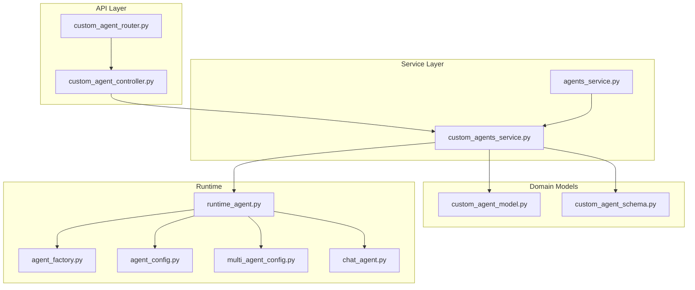
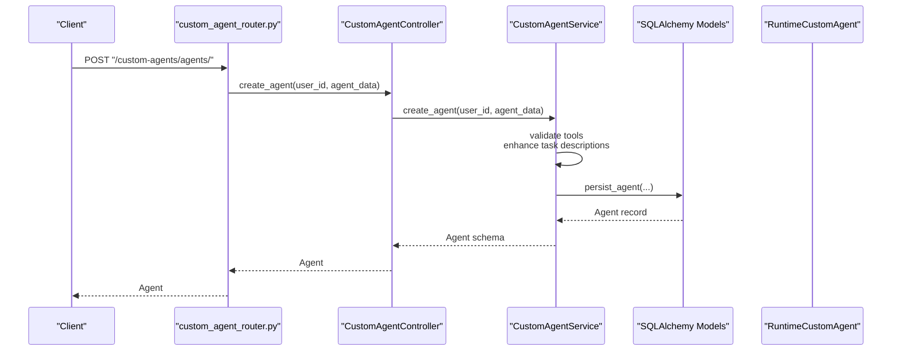
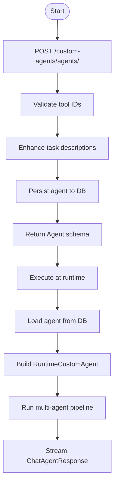
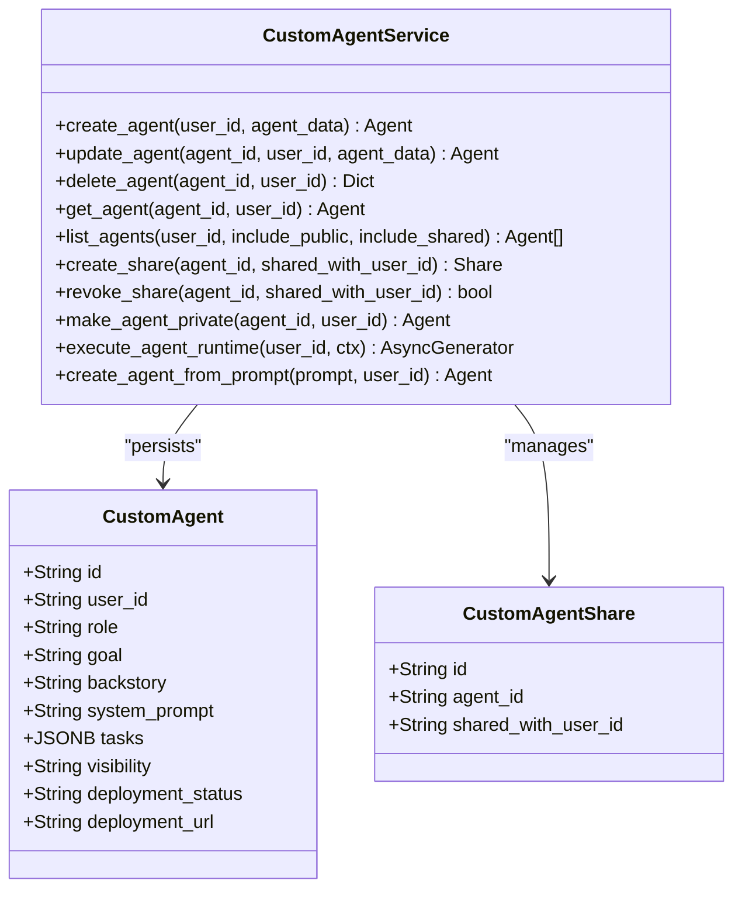
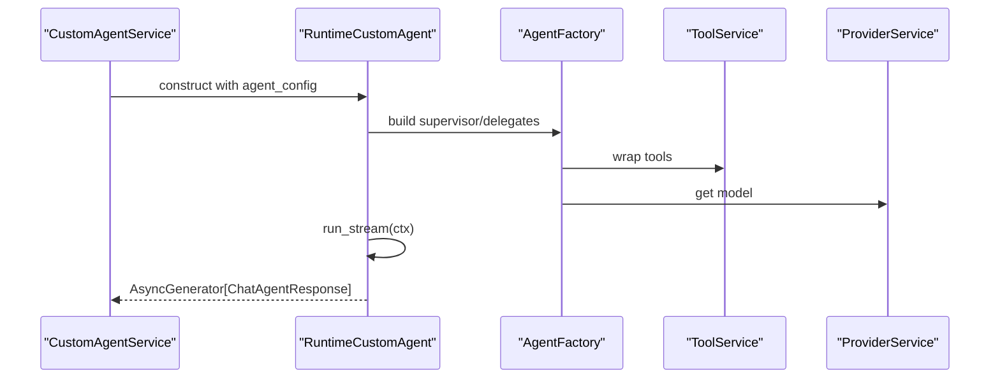
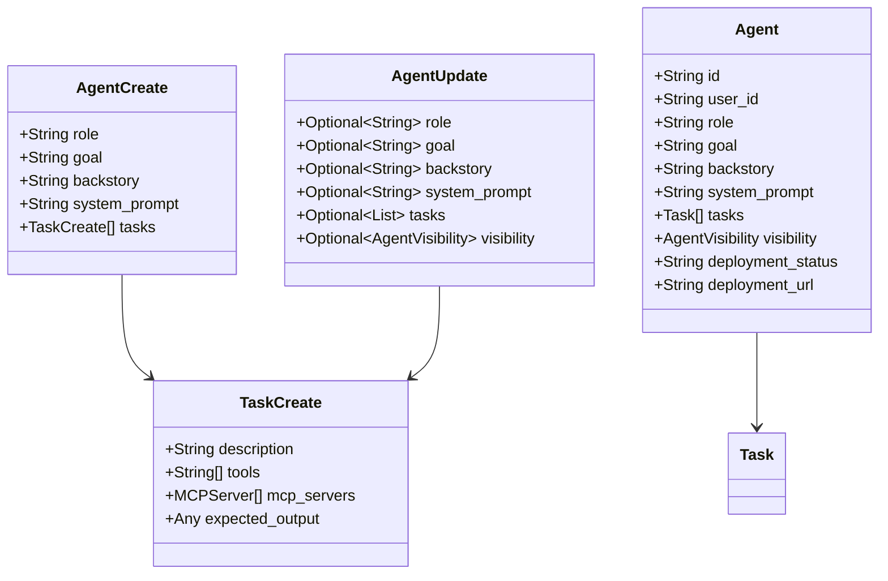
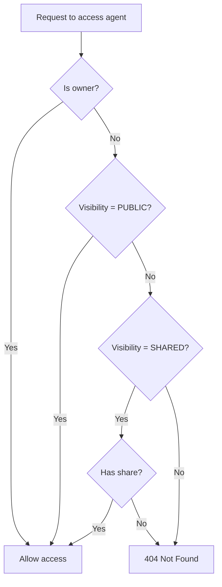
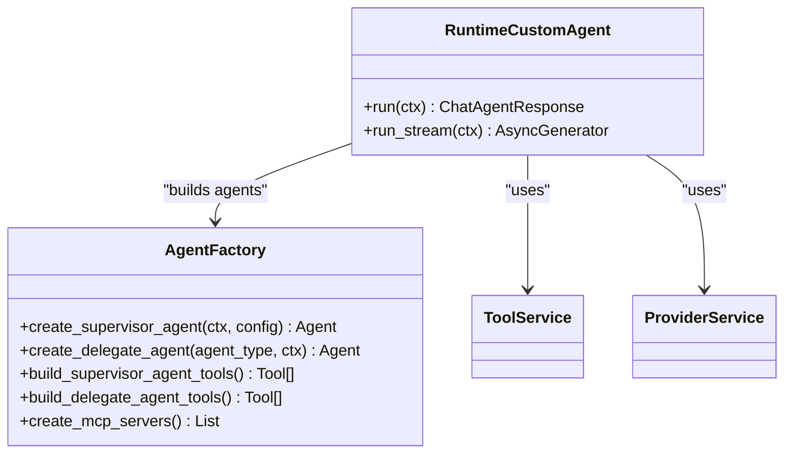
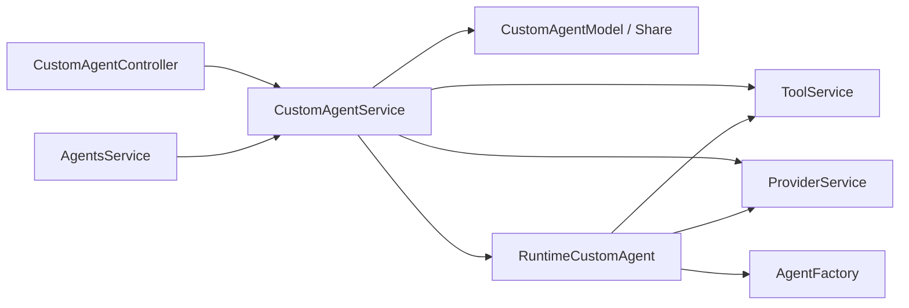

# Custom Agents

<cite>
**Referenced Files in This Document**
- [custom_agent_controller.py](file://app/modules/intelligence/agents/custom_agents/custom_agent_controller.py)
- [custom_agent_router.py](file://app/modules/intelligence/agents/custom_agents/custom_agent_router.py)
- [custom_agent_schema.py](file://app/modules/intelligence/agents/custom_agents/custom_agent_schema.py)
- [custom_agent_model.py](file://app/modules/intelligence/agents/custom_agents/custom_agent_model.py)
- [custom_agents_service.py](file://app/modules/intelligence/agents/custom_agents/custom_agents_service.py)
- [runtime_agent.py](file://app/modules/intelligence/agents/custom_agents/runtime_agent.py)
- [agents_router.py](file://app/modules/intelligence/agents/agents_router.py)
- [agents_service.py](file://app/modules/intelligence/agents/agents_service.py)
- [agent_factory.py](file://app/modules/intelligence/agents/chat_agents/multi_agent/agent_factory.py)
- [chat_agent.py](file://app/modules/intelligence/agents/chat_agent.py)
- [agent_config.py](file://app/modules/intelligence/agents/chat_agents/agent_config.py)
- [multi_agent_config.py](file://app/modules/intelligence/agents/multi_agent_config.py)
</cite>

## Table of Contents
1. [Introduction](#introduction)
2. [Project Structure](#project-structure)
3. [Core Components](#core-components)
4. [Architecture Overview](#architecture-overview)
5. [Detailed Component Analysis](#detailed-component-analysis)
6. [Dependency Analysis](#dependency-analysis)
7. [Performance Considerations](#performance-considerations)
8. [Troubleshooting Guide](#troubleshooting-guide)
9. [Conclusion](#conclusion)
10. [Appendices](#appendices)

## Introduction
This document explains the custom agent creation and management system. It covers the full lifecycle from creation to runtime execution, including configuration, tool assignment, persistence, and sharing. It documents the CustomAgentService, agent persistence, runtime agent management, and relationships with the agent factory, runtime environment, and sharing mechanisms. Practical examples are drawn from the actual codebase to illustrate workflows, configuration schemas, and deployment processes. Guidance is included for validation, resource allocation, and troubleshooting failed deployments.

## Project Structure
The custom agent subsystem is organized around a clear separation of concerns:
- Routing and controllers expose REST endpoints and orchestrate user actions.
- Services encapsulate business logic for creation, updates, listing, sharing, and runtime execution.
- Models define persistence and relationships.
- Schemas define request/response validation and configuration structures.
- Runtime agent integrates with the multi-agent framework and tool providers.

**Diagram sources**
- [custom_agent_router.py](file://app/modules/intelligence/agents/custom_agents/custom_agent_router.py#L1-L227)
- [custom_agent_controller.py](file://app/modules/intelligence/agents/custom_agents/custom_agent_controller.py#L1-L338)
- [custom_agents_service.py](file://app/modules/intelligence/agents/custom_agents/custom_agents_service.py#L1-L1157)
- [custom_agent_model.py](file://app/modules/intelligence/agents/custom_agents/custom_agent_model.py#L1-L61)
- [custom_agent_schema.py](file://app/modules/intelligence/agents/custom_agents/custom_agent_schema.py#L1-L159)
- [runtime_agent.py](file://app/modules/intelligence/agents/custom_agents/runtime_agent.py#L1-L172)
- [agent_factory.py](file://app/modules/intelligence/agents/chat_agents/multi_agent/agent_factory.py#L1-L705)
- [agent_config.py](file://app/modules/intelligence/agents/chat_agents/agent_config.py#L1-L21)
- [multi_agent_config.py](file://app/modules/intelligence/agents/multi_agent_config.py#L1-L119)
- [chat_agent.py](file://app/modules/intelligence/agents/chat_agent.py#L1-L121)
- [agents_service.py](file://app/modules/intelligence/agents/agents_service.py#L1-L203)

**Section sources**
- [custom_agent_router.py](file://app/modules/intelligence/agents/custom_agents/custom_agent_router.py#L1-L227)
- [custom_agent_controller.py](file://app/modules/intelligence/agents/custom_agents/custom_agent_controller.py#L1-L338)
- [custom_agents_service.py](file://app/modules/intelligence/agents/custom_agents/custom_agents_service.py#L1-L1157)
- [custom_agent_model.py](file://app/modules/intelligence/agents/custom_agents/custom_agent_model.py#L1-L61)
- [custom_agent_schema.py](file://app/modules/intelligence/agents/custom_agents/custom_agent_schema.py#L1-L159)
- [runtime_agent.py](file://app/modules/intelligence/agents/custom_agents/runtime_agent.py#L1-L172)
- [agent_factory.py](file://app/modules/intelligence/agents/chat_agents/multi_agent/agent_factory.py#L1-L705)
- [agent_config.py](file://app/modules/intelligence/agents/chat_agents/agent_config.py#L1-L21)
- [multi_agent_config.py](file://app/modules/intelligence/agents/multi_agent_config.py#L1-L119)
- [chat_agent.py](file://app/modules/intelligence/agents/chat_agent.py#L1-L121)
- [agents_service.py](file://app/modules/intelligence/agents/agents_service.py#L1-L203)

## Core Components
- CustomAgentController: Exposes endpoints for creating, updating, listing, sharing, revoking access, and deleting agents. It delegates to CustomAgentService and performs permission checks and user validation.
- CustomAgentService: Implements core logic for agent persistence, sharing, visibility management, runtime execution, and plan generation from prompts. It validates tools, converts between models and schemas, and orchestrates runtime agents.
- CustomAgentModel and CustomAgentShare: SQLAlchemy models for agent records and sharing relationships.
- CustomAgentSchema: Pydantic models for request/response validation, including agent configuration, task definitions, visibility, and sharing requests.
- RuntimeCustomAgent: Builds and runs a runtime agent from persisted agent configuration, integrating with the multi-agent framework and tool providers.
- AgentFactory and related configs: Provide the underlying multi-agent infrastructure, including supervisor/delegate agent creation, tool wrapping, and MCP server integration.
- AgentsService and agents_router: Integrate custom agents into the broader agent ecosystem and list available agents.

Key responsibilities:
- Creation: Validate tasks, resolve tools, enhance descriptions, persist agent.
- Sharing: Manage visibility and share/unshare with users.
- Runtime: Load agent, assemble tools, build multi-agent pipeline, stream results.
- Validation: Enforce task limits, tool availability, JSON expectations, and visibility rules.

**Section sources**
- [custom_agent_controller.py](file://app/modules/intelligence/agents/custom_agents/custom_agent_controller.py#L24-L338)
- [custom_agents_service.py](file://app/modules/intelligence/agents/custom_agents/custom_agents_service.py#L37-L1157)
- [custom_agent_model.py](file://app/modules/intelligence/agents/custom_agents/custom_agent_model.py#L9-L61)
- [custom_agent_schema.py](file://app/modules/intelligence/agents/custom_agents/custom_agent_schema.py#L36-L159)
- [runtime_agent.py](file://app/modules/intelligence/agents/custom_agents/runtime_agent.py#L44-L172)
- [agent_factory.py](file://app/modules/intelligence/agents/chat_agents/multi_agent/agent_factory.py#L29-L705)
- [agents_router.py](file://app/modules/intelligence/agents/agents_router.py#L1-L46)
- [agents_service.py](file://app/modules/intelligence/agents/agents_service.py#L47-L203)

## Architecture Overview
The system follows a layered architecture:
- API layer: FastAPI routers and controllers.
- Service layer: Business logic for custom agents and runtime orchestration.
- Persistence layer: SQLAlchemy models and relationships.
- Runtime layer: Multi-agent pipeline built via AgentFactory and executed by RuntimeCustomAgent.

**Diagram sources**
- [custom_agent_router.py](file://app/modules/intelligence/agents/custom_agents/custom_agent_router.py#L26-L44)
- [custom_agent_controller.py](file://app/modules/intelligence/agents/custom_agents/custom_agent_controller.py#L32-L41)
- [custom_agents_service.py](file://app/modules/intelligence/agents/custom_agents/custom_agents_service.py#L367-L413)
- [custom_agent_model.py](file://app/modules/intelligence/agents/custom_agents/custom_agent_model.py#L9-L40)

## Detailed Component Analysis

### Custom Agent Lifecycle: Creation to Deployment
- Creation workflow:
  - Endpoint: POST "/custom-agents/agents/".
  - Controller validates inputs and delegates to service.
  - Service validates tool IDs against user’s available tools, enhances tasks, persists agent, and returns schema.
- Update workflow:
  - Endpoint: PUT "/custom-agents/agents/{agent_id}".
  - Controller forwards to service; service applies partial updates and commits.
- Runtime execution:
  - Service loads agent, constructs RuntimeCustomAgent, and streams results.
  - Runtime builds a multi-agent pipeline using AgentFactory and ToolService.
- Sharing and visibility:
  - Endpoint: POST "/custom-agents/agents/share".
  - Controller enforces ownership and visibility rules; service manages shares and visibility transitions.

**Diagram sources**
- [custom_agent_router.py](file://app/modules/intelligence/agents/custom_agents/custom_agent_router.py#L26-L44)
- [custom_agent_controller.py](file://app/modules/intelligence/agents/custom_agents/custom_agent_controller.py#L32-L41)
- [custom_agents_service.py](file://app/modules/intelligence/agents/custom_agents/custom_agents_service.py#L367-L413)
- [runtime_agent.py](file://app/modules/intelligence/agents/custom_agents/runtime_agent.py#L44-L154)

**Section sources**
- [custom_agent_router.py](file://app/modules/intelligence/agents/custom_agents/custom_agent_router.py#L26-L227)
- [custom_agent_controller.py](file://app/modules/intelligence/agents/custom_agents/custom_agent_controller.py#L32-L338)
- [custom_agents_service.py](file://app/modules/intelligence/agents/custom_agents/custom_agents_service.py#L367-L695)
- [runtime_agent.py](file://app/modules/intelligence/agents/custom_agents/runtime_agent.py#L44-L154)

### CustomAgentService: Implementation Details
- Persistence and retrieval:
  - Persists agent with role, goal, backstory, system prompt, and tasks.
  - Converts between SQLAlchemy model and Pydantic schema, normalizing visibility and expected_output.
- Sharing and visibility:
  - Supports PRIVATE, SHARED, PUBLIC visibility.
  - Manages CustomAgentShare entries and visibility transitions.
- Runtime execution:
  - Loads agent, builds RuntimeCustomAgent, and streams results.
  - Validates access (owner/public/shared) before execution.
- Prompt-driven creation:
  - Generates agent plan from prompt using ProviderService, parses and validates JSON, then persists.

**Diagram sources**
- [custom_agents_service.py](file://app/modules/intelligence/agents/custom_agents/custom_agents_service.py#L37-L523)
- [custom_agent_model.py](file://app/modules/intelligence/agents/custom_agents/custom_agent_model.py#L9-L61)

**Section sources**
- [custom_agents_service.py](file://app/modules/intelligence/agents/custom_agents/custom_agents_service.py#L37-L523)
- [custom_agent_model.py](file://app/modules/intelligence/agents/custom_agents/custom_agent_model.py#L9-L61)

### Runtime Agent Management
- RuntimeCustomAgent:
  - Accepts agent_config (role, goal, backstory, tasks, tools).
  - Builds a Pydantic-based multi-agent pipeline via AgentFactory.
  - Supports MCP servers and integrates with ToolService.
  - Streams ChatAgentResponse chunks for real-time output.
- Multi-agent configuration:
  - Global and per-agent toggles enable/disable multi-agent mode.
  - Defaults to multi-agent for custom agents.

**Diagram sources**
- [runtime_agent.py](file://app/modules/intelligence/agents/custom_agents/runtime_agent.py#L44-L154)
- [agent_factory.py](file://app/modules/intelligence/agents/chat_agents/multi_agent/agent_factory.py#L29-L705)
- [multi_agent_config.py](file://app/modules/intelligence/agents/multi_agent_config.py#L12-L64)

**Section sources**
- [runtime_agent.py](file://app/modules/intelligence/agents/custom_agents/runtime_agent.py#L44-L154)
- [agent_factory.py](file://app/modules/intelligence/agents/chat_agents/multi_agent/agent_factory.py#L29-L705)
- [multi_agent_config.py](file://app/modules/intelligence/agents/multi_agent_config.py#L12-L64)

### Configuration Options and Schemas
- AgentCreate and AgentUpdate:
  - Tasks must be provided; maximum 5 tasks.
  - Expected_output must be a JSON object.
- Task schema:
  - description, tools, mcp_servers, expected_output.
- Visibility:
  - PRIVATE, SHARED, PUBLIC.
- Runtime configuration:
  - CustomAgentConfig includes user_id, role, goal, backstory, system_prompt, tasks, project_id, use_multi_agent flag.

**Diagram sources**
- [custom_agent_schema.py](file://app/modules/intelligence/agents/custom_agents/custom_agent_schema.py#L36-L80)

**Section sources**
- [custom_agent_schema.py](file://app/modules/intelligence/agents/custom_agents/custom_agent_schema.py#L36-L159)

### Sharing Mechanisms and Access Control
- Ownership checks:
  - Controllers verify ownership before allowing updates or deletions.
- Visibility enforcement:
  - Public agents are accessible to all; shared agents require share membership; private agents are owner-only.
- Sharing operations:
  - Change visibility or share with a specific user; revocation removes access and adjusts visibility if needed.

**Diagram sources**
- [custom_agent_controller.py](file://app/modules/intelligence/agents/custom_agents/custom_agent_controller.py#L43-L150)
- [custom_agents_service.py](file://app/modules/intelligence/agents/custom_agents/custom_agents_service.py#L524-L665)

**Section sources**
- [custom_agent_controller.py](file://app/modules/intelligence/agents/custom_agents/custom_agent_controller.py#L43-L211)
- [custom_agents_service.py](file://app/modules/intelligence/agents/custom_agents/custom_agents_service.py#L524-L665)

### Relationship with Agent Factory and Runtime Environment
- AgentFactory:
  - Creates supervisor and delegate agents, wraps tools, and manages MCP servers.
  - Provides integration-specific agents (Jira, GitHub, Confluence, Linear).
- RuntimeCustomAgent:
  - Uses AgentFactory to build a multi-agent system.
  - Integrates with ToolService and ProviderService.
- MultiAgentConfig:
  - Controls global and per-agent multi-agent behavior.

**Diagram sources**
- [agent_factory.py](file://app/modules/intelligence/agents/chat_agents/multi_agent/agent_factory.py#L29-L705)
- [runtime_agent.py](file://app/modules/intelligence/agents/custom_agents/runtime_agent.py#L44-L154)

**Section sources**
- [agent_factory.py](file://app/modules/intelligence/agents/chat_agents/multi_agent/agent_factory.py#L29-L705)
- [runtime_agent.py](file://app/modules/intelligence/agents/custom_agents/runtime_agent.py#L44-L154)
- [multi_agent_config.py](file://app/modules/intelligence/agents/multi_agent_config.py#L12-L64)

## Dependency Analysis
- Controllers depend on CustomAgentService and user services for validation.
- CustomAgentService depends on:
  - SQLAlchemy models for persistence.
  - ToolService for tool resolution.
  - ProviderService for LLM calls and model capabilities.
  - SecretManager for secure configuration.
- RuntimeCustomAgent depends on:
  - AgentFactory for agent construction.
  - ToolService for tool wrapping.
  - ProviderService for model selection and capabilities.
- AgentsService integrates custom agents into the broader agent ecosystem.

**Diagram sources**
- [custom_agent_controller.py](file://app/modules/intelligence/agents/custom_agents/custom_agent_controller.py#L24-L31)
- [custom_agents_service.py](file://app/modules/intelligence/agents/custom_agents/custom_agents_service.py#L37-L44)
- [runtime_agent.py](file://app/modules/intelligence/agents/custom_agents/runtime_agent.py#L44-L53)
- [agents_service.py](file://app/modules/intelligence/agents/agents_service.py#L47-L66)

**Section sources**
- [custom_agent_controller.py](file://app/modules/intelligence/agents/custom_agents/custom_agent_controller.py#L24-L31)
- [custom_agents_service.py](file://app/modules/intelligence/agents/custom_agents/custom_agents_service.py#L37-L44)
- [runtime_agent.py](file://app/modules/intelligence/agents/custom_agents/runtime_agent.py#L44-L53)
- [agents_service.py](file://app/modules/intelligence/agents/agents_service.py#L47-L66)

## Performance Considerations
- Tool resolution and wrapping:
  - Filtering tools by names can be expensive; ensure tool lists are reasonably sized and deduplicated.
- Multi-agent mode:
  - Enabling multi-agent increases overhead; tune environment variables to balance performance and capability.
- Streaming:
  - RuntimeCustomAgent streams results; ensure upstream tool calls are efficient to maintain responsiveness.
- Database transactions:
  - Batch operations and minimize round-trips; rollback on errors to prevent inconsistent states.

[No sources needed since this section provides general guidance]

## Troubleshooting Guide
Common issues and resolutions:
- Invalid tool IDs during creation:
  - Ensure tool IDs belong to the user’s available tools; service raises HTTP 400 with details.
- Task validation failures:
  - Tasks must be provided and expected_output must be a JSON object; service raises HTTP 422 for invalid schemas.
- Access denied:
  - Non-owners attempting to access private agents receive HTTP 404; verify visibility and shares.
- Runtime execution errors:
  - Unsupported model for Pydantic agents raises UnsupportedProviderError; switch to a compatible model.
- JSON parsing errors:
  - Prompt-generated plans must contain valid JSON; service extracts JSON blocks when needed.

Operational tips:
- Enable multi-agent only when needed; adjust environment variables to disable for constrained environments.
- Monitor tool availability and provider capabilities before runtime execution.
- Use streaming endpoints to detect early failures and reduce latency.

**Section sources**
- [custom_agents_service.py](file://app/modules/intelligence/agents/custom_agents/custom_agents_service.py#L375-L412)
- [custom_agent_schema.py](file://app/modules/intelligence/agents/custom_agents/custom_agent_schema.py#L19-L23)
- [runtime_agent.py](file://app/modules/intelligence/agents/custom_agents/runtime_agent.py#L128-L134)
- [custom_agent_controller.py](file://app/modules/intelligence/agents/custom_agents/custom_agent_controller.py#L52-L63)

## Conclusion
The custom agent system provides a robust, extensible framework for creating, persisting, sharing, and executing agents. It leverages a multi-agent architecture, strict validation, and clear separation of concerns to support both simple and complex workflows. By tuning configuration options and following best practices, teams can optimize performance and reliability for diverse use cases.

[No sources needed since this section summarizes without analyzing specific files]

## Appendices

### API Endpoints Summary
- POST "/custom-agents/agents/": Create agent.
- POST "/custom-agents/agents/share": Change visibility or share with user.
- POST "/custom-agents/agents/revoke-access": Revoke access.
- GET "/custom-agents/agents/": List agents (public/shared inclusion configurable).
- DELETE "/custom-agents/agents/{agent_id}": Delete agent.
- PUT "/custom-agents/agents/{agent_id}": Update agent.
- GET "/custom-agents/agents/{agent_id}": Get agent info.
- GET "/custom-agents/agents/{agent_id}/shares": List shared emails.
- POST "/custom-agents/agents/auto/": Create agent from prompt.

**Section sources**
- [custom_agent_router.py](file://app/modules/intelligence/agents/custom_agents/custom_agent_router.py#L26-L227)

### Configuration Options Reference
- Multi-agent toggles:
  - ENABLE_MULTI_AGENT, GENERAL_PURPOSE_MULTI_AGENT, CODE_GEN_MULTI_AGENT, QNA_MULTI_AGENT, DEBUG_MULTI_AGENT, UNIT_TEST_MULTI_AGENT, INTEGRATION_TEST_MULTI_AGENT, LLD_MULTI_AGENT, CODE_CHANGES_MULTI_AGENT, SWEB_DEBUG_MULTI_AGENT, CUSTOM_AGENT_MULTI_AGENT.
- Behavior:
  - Defaults to multi-agent enabled for all agents; can be disabled globally or per agent type.

**Section sources**
- [multi_agent_config.py](file://app/modules/intelligence/agents/multi_agent_config.py#L12-L119)