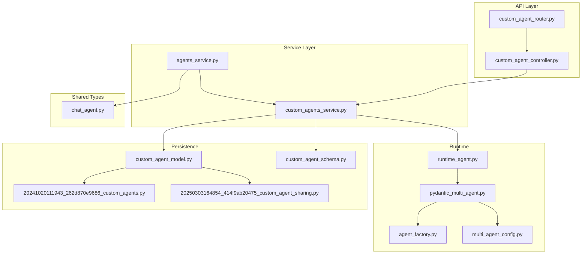
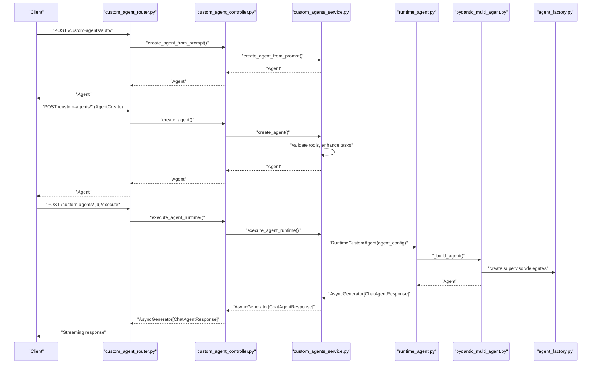
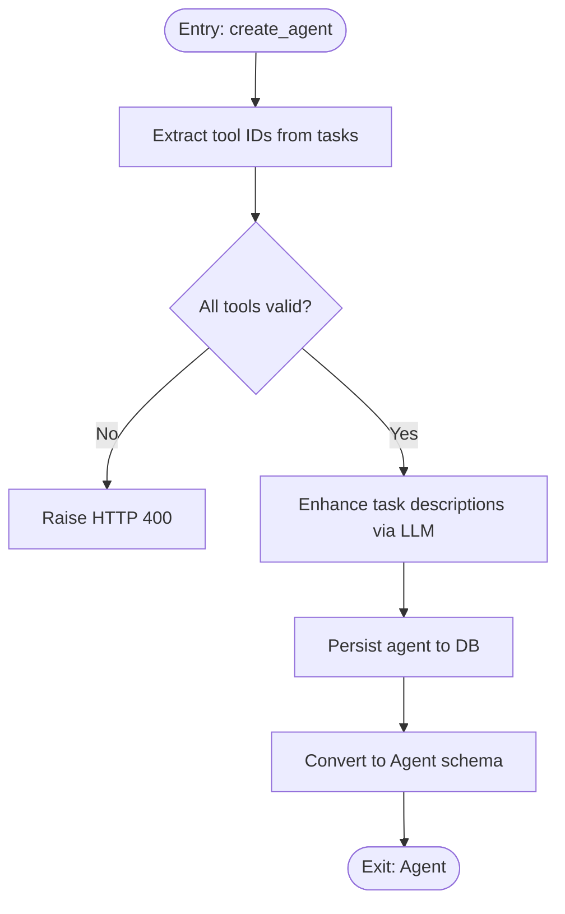
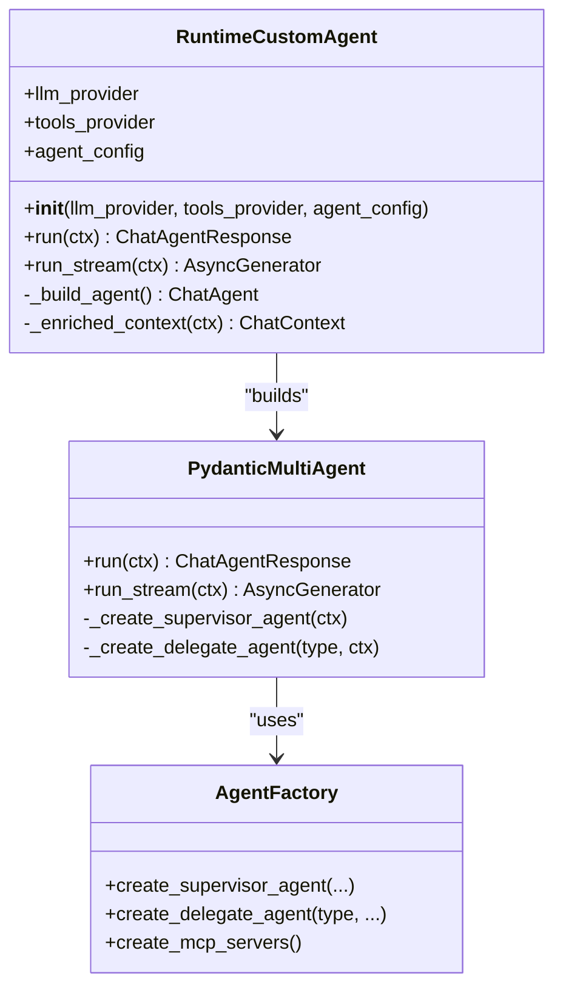
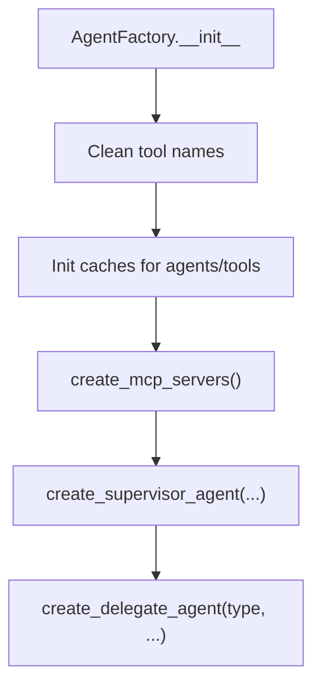
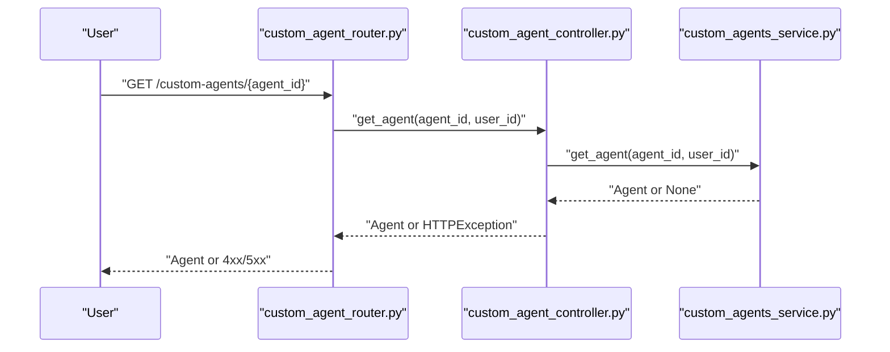
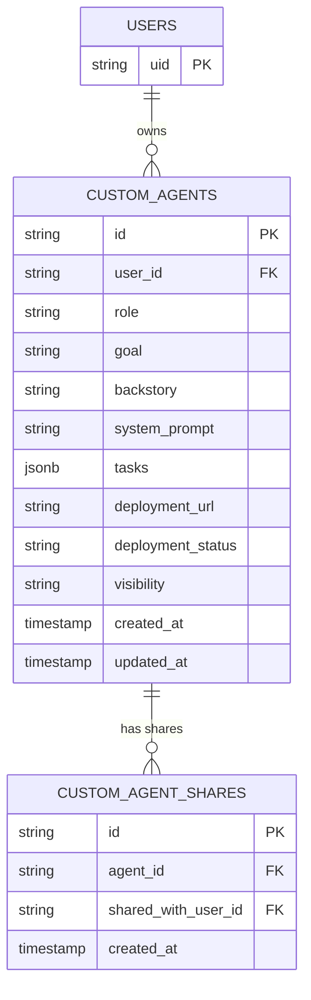
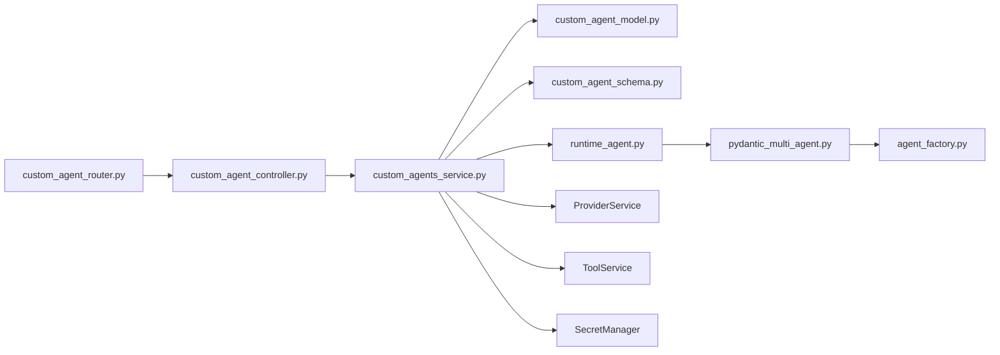
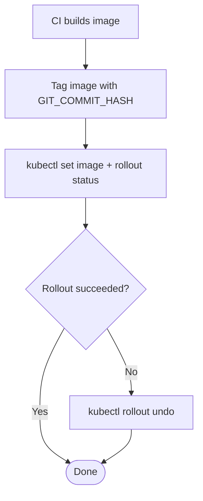

# Deployment & Runtime Management

<cite>
**Referenced Files in This Document**
- [custom_agents_service.py](file://app/modules/intelligence/agents/custom_agents/custom_agents_service.py)
- [runtime_agent.py](file://app/modules/intelligence/agents/custom_agents/runtime_agent.py)
- [custom_agent_controller.py](file://app/modules/intelligence/agents/custom_agents/custom_agent_controller.py)
- [custom_agent_router.py](file://app/modules/intelligence/agents/custom_agents/custom_agent_router.py)
- [custom_agent_model.py](file://app/modules/intelligence/agents/custom_agents/custom_agent_model.py)
- [custom_agent_schema.py](file://app/modules/intelligence/agents/custom_agents/custom_agent_schema.py)
- [pydantic_multi_agent.py](file://app/modules/intelligence/agents/chat_agents/pydantic_multi_agent.py)
- [agent_factory.py](file://app/modules/intelligence/agents/chat_agents/multi_agent/agent_factory.py)
- [multi_agent_config.py](file://app/modules/intelligence/agents/multi_agent_config.py)
- [agents_service.py](file://app/modules/intelligence/agents/agents_service.py)
- [chat_agent.py](file://app/modules/intelligence/agents/chat_agent.py)
- [20241020111943_262d870e9686_custom_agents.py](file://app/alembic/versions/20241020111943_262d870e9686_custom_agents.py)
- [20250303164854_414f9ab20475_custom_agent_sharing.py](file://app/alembic/versions/20250303164854_414f9ab20475_custom_agent_sharing.py)
- [Jenkinsfile_API_Prod](file://deployment/prod/mom-api/Jenkinsfile_API_Prod)
- [Jenkinsfile_API](file://deployment/stage/mom-api/Jenkinsfile_API)
</cite>

## Table of Contents
1. [Introduction](#introduction)
2. [Project Structure](#project-structure)
3. [Core Components](#core-components)
4. [Architecture Overview](#architecture-overview)
5. [Detailed Component Analysis](#detailed-component-analysis)
6. [Dependency Analysis](#dependency-analysis)
7. [Performance Considerations](#performance-considerations)
8. [Troubleshooting Guide](#troubleshooting-guide)
9. [Conclusion](#conclusion)
10. [Appendices](#appendices)

## Introduction
This document explains the custom agent deployment and runtime management system. It covers how custom agents are defined, validated, stored, and executed at runtime, including the runtime agent implementation, lifecycle management, and the relationship between the deployment service, runtime agents, and the agent factory system. It also documents validation, resource allocation, scaling considerations, health monitoring, restart procedures, graceful shutdown, and troubleshooting for deployment and runtime anomalies.

## Project Structure
The custom agent subsystem is organized around a service-layer API, a controller for request handling, a router for FastAPI endpoints, persistent models, schemas, and runtime execution components. The runtime agent integrates with a multi-agent factory and execution flows.

**Diagram sources**
- [custom_agent_router.py](file://app/modules/intelligence/agents/custom_agents/custom_agent_router.py#L1-L227)
- [custom_agent_controller.py](file://app/modules/intelligence/agents/custom_agents/custom_agent_controller.py#L1-L338)
- [custom_agents_service.py](file://app/modules/intelligence/agents/custom_agents/custom_agents_service.py#L1-L1157)
- [runtime_agent.py](file://app/modules/intelligence/agents/custom_agents/runtime_agent.py#L1-L172)
- [pydantic_multi_agent.py](file://app/modules/intelligence/agents/chat_agents/pydantic_multi_agent.py#L1-L237)
- [agent_factory.py](file://app/modules/intelligence/agents/chat_agents/multi_agent/agent_factory.py#L1-L705)
- [multi_agent_config.py](file://app/modules/intelligence/agents/multi_agent_config.py#L1-L119)
- [agents_service.py](file://app/modules/intelligence/agents/agents_service.py#L1-L203)
- [custom_agent_model.py](file://app/modules/intelligence/agents/custom_agents/custom_agent_model.py#L1-L61)
- [custom_agent_schema.py](file://app/modules/intelligence/agents/custom_agents/custom_agent_schema.py#L1-L159)
- [20241020111943_262d870e9686_custom_agents.py](file://app/alembic/versions/20241020111943_262d870e9686_custom_agents.py#L37-L56)
- [20250303164854_414f9ab20475_custom_agent_sharing.py](file://app/alembic/versions/20250303164854_414f9ab20475_custom_agent_sharing.py#L22-L47)
- [chat_agent.py](file://app/modules/intelligence/agents/chat_agent.py#L1-L121)

**Section sources**
- [custom_agent_router.py](file://app/modules/intelligence/agents/custom_agents/custom_agent_router.py#L1-L227)
- [custom_agent_controller.py](file://app/modules/intelligence/agents/custom_agents/custom_agent_controller.py#L1-L338)
- [custom_agents_service.py](file://app/modules/intelligence/agents/custom_agents/custom_agents_service.py#L1-L1157)
- [runtime_agent.py](file://app/modules/intelligence/agents/custom_agents/runtime_agent.py#L1-L172)
- [pydantic_multi_agent.py](file://app/modules/intelligence/agents/chat_agents/pydantic_multi_agent.py#L1-L237)
- [agent_factory.py](file://app/modules/intelligence/agents/chat_agents/multi_agent/agent_factory.py#L1-L705)
- [multi_agent_config.py](file://app/modules/intelligence/agents/multi_agent_config.py#L1-L119)
- [agents_service.py](file://app/modules/intelligence/agents/agents_service.py#L1-L203)
- [custom_agent_model.py](file://app/modules/intelligence/agents/custom_agents/custom_agent_model.py#L1-L61)
- [custom_agent_schema.py](file://app/modules/intelligence/agents/custom_agents/custom_agent_schema.py#L1-L159)
- [20241020111943_262d870e9686_custom_agents.py](file://app/alembic/versions/20241020111943_262d870e9686_custom_agents.py#L37-L56)
- [20250303164854_414f9ab20475_custom_agent_sharing.py](file://app/alembic/versions/20250303164854_414f9ab20475_custom_agent_sharing.py#L22-L47)
- [chat_agent.py](file://app/modules/intelligence/agents/chat_agent.py#L1-L121)

## Core Components
- CustomAgentService: Orchestrates agent lifecycle operations (create, update, delete, list, get), manages visibility and sharing, validates tools, and executes agents at runtime.
- RuntimeCustomAgent: Builds and runs a runtime agent using a multi-agent or Pydantic RAG agent depending on provider capabilities and configuration.
- PydanticMultiAgent: Multi-agent coordinator with supervisor/delegate agents, delegation, streaming, and multimodal support.
- AgentFactory: Creates supervisor and delegate agents, manages MCP servers, and resolves tools per agent type.
- MultiAgentConfig: Controls whether multi-agent mode is enabled globally and per agent type.
- CustomAgentController and Router: Expose CRUD and sharing endpoints backed by CustomAgentService.
- Persistence: SQLAlchemy models and Alembic migrations define agent storage and visibility.
- Shared Types: ChatAgent, ChatContext, ChatAgentResponse define the runtime contract.

**Section sources**
- [custom_agents_service.py](file://app/modules/intelligence/agents/custom_agents/custom_agents_service.py#L37-L1157)
- [runtime_agent.py](file://app/modules/intelligence/agents/custom_agents/runtime_agent.py#L44-L172)
- [pydantic_multi_agent.py](file://app/modules/intelligence/agents/chat_agents/pydantic_multi_agent.py#L38-L237)
- [agent_factory.py](file://app/modules/intelligence/agents/chat_agents/multi_agent/agent_factory.py#L29-L705)
- [multi_agent_config.py](file://app/modules/intelligence/agents/multi_agent_config.py#L12-L119)
- [custom_agent_controller.py](file://app/modules/intelligence/agents/custom_agents/custom_agent_controller.py#L24-L338)
- [custom_agent_router.py](file://app/modules/intelligence/agents/custom_agents/custom_agent_router.py#L1-L227)
- [custom_agent_model.py](file://app/modules/intelligence/agents/custom_agents/custom_agent_model.py#L9-L61)
- [custom_agent_schema.py](file://app/modules/intelligence/agents/custom_agents/custom_agent_schema.py#L1-L159)
- [chat_agent.py](file://app/modules/intelligence/agents/chat_agent.py#L101-L121)

## Architecture Overview
The system separates concerns across API, service, runtime, and persistence layers. The router/controller translate HTTP requests into service operations. The service validates and persists agent definitions, and when needed, constructs a runtime agent via RuntimeCustomAgent. RuntimeCustomAgent selects a multi-agent or Pydantic RAG agent based on provider capabilities and configuration. The multi-agent system uses AgentFactory to assemble supervisors and delegates, with execution flows and streaming managed by PydanticMultiAgent.

**Diagram sources**
- [custom_agent_router.py](file://app/modules/intelligence/agents/custom_agents/custom_agent_router.py#L26-L227)
- [custom_agent_controller.py](file://app/modules/intelligence/agents/custom_agents/custom_agent_controller.py#L32-L338)
- [custom_agents_service.py](file://app/modules/intelligence/agents/custom_agents/custom_agents_service.py#L598-L694)
- [runtime_agent.py](file://app/modules/intelligence/agents/custom_agents/runtime_agent.py#L44-L154)
- [pydantic_multi_agent.py](file://app/modules/intelligence/agents/chat_agents/pydantic_multi_agent.py#L38-L237)
- [agent_factory.py](file://app/modules/intelligence/agents/chat_agents/multi_agent/agent_factory.py#L29-L705)

## Detailed Component Analysis

### CustomAgentService: Lifecycle and Execution
- Creation and Validation: Validates tool IDs against user’s available tools, enhances task descriptions using LLM, persists agent with tasks and metadata.
- Visibility and Sharing: Manages visibility (private/public/shared), creates and revokes shares, updates agent visibility accordingly.
- Listing and Access Control: Lists agents for a user, including public and shared agents, enforcing permission checks.
- Runtime Execution: Builds a runtime agent from stored agent definition and streams responses.

Key methods and responsibilities:
- create_agent(user_id, AgentCreate) -> Agent
- update_agent(agent_id, user_id, AgentUpdate) -> Agent
- delete_agent(agent_id, user_id) -> Dict
- list_agents(user_id, include_public, include_shared) -> List[Agent]
- get_agent(agent_id, user_id) -> Agent
- execute_agent_runtime(user_id, ChatContext) -> AsyncGenerator[ChatAgentResponse]
- create_share(agent_id, shared_with_user_id) -> Share
- revoke_share(agent_id, shared_with_user_id) -> bool
- list_agent_shares(agent_id) -> List[str]
- make_agent_private(agent_id, user_id) -> Agent

**Diagram sources**
- [custom_agents_service.py](file://app/modules/intelligence/agents/custom_agents/custom_agents_service.py#L367-L432)

**Section sources**
- [custom_agents_service.py](file://app/modules/intelligence/agents/custom_agents/custom_agents_service.py#L37-L1157)

### RuntimeCustomAgent: Runtime Agent Implementation
- Construction: Combines static “how-to” instructions with dynamic backstory, builds AgentConfig, extracts tools, handles MCP servers, and decides between multi-agent and Pydantic RAG based on provider capabilities and configuration.
- Execution: Enriches context with code references when node IDs are present, then runs either run() or run_stream().

**Diagram sources**
- [runtime_agent.py](file://app/modules/intelligence/agents/custom_agents/runtime_agent.py#L44-L154)
- [pydantic_multi_agent.py](file://app/modules/intelligence/agents/chat_agents/pydantic_multi_agent.py#L38-L237)
- [agent_factory.py](file://app/modules/intelligence/agents/chat_agents/multi_agent/agent_factory.py#L29-L705)

**Section sources**
- [runtime_agent.py](file://app/modules/intelligence/agents/custom_agents/runtime_agent.py#L44-L172)
- [pydantic_multi_agent.py](file://app/modules/intelligence/agents/chat_agents/pydantic_multi_agent.py#L38-L237)
- [agent_factory.py](file://app/modules/intelligence/agents/chat_agents/multi_agent/agent_factory.py#L29-L705)

### Agent Factory and Multi-Agent Configuration
- AgentFactory: Creates MCP servers, filters tools by names, wraps tools, and builds integration-specific tools. Maintains caches keyed by conversation_id to avoid stale context.
- MultiAgentConfig: Reads environment flags to enable/disable multi-agent globally and per agent type. Defaults to enabled for custom agents.

**Diagram sources**
- [agent_factory.py](file://app/modules/intelligence/agents/chat_agents/multi_agent/agent_factory.py#L29-L200)
- [multi_agent_config.py](file://app/modules/intelligence/agents/multi_agent_config.py#L12-L64)

**Section sources**
- [agent_factory.py](file://app/modules/intelligence/agents/chat_agents/multi_agent/agent_factory.py#L29-L705)
- [multi_agent_config.py](file://app/modules/intelligence/agents/multi_agent_config.py#L12-L119)

### API, Controller, and Router
- Router: Defines endpoints for creating agents, sharing/revoke access, listing, updating, deleting, retrieving, and listing shares.
- Controller: Wraps service calls, performs permission checks, and translates exceptions to HTTP responses.
- Service: Implements business logic, including tool validation, task enhancement, runtime execution, and visibility/sharing management.

**Diagram sources**
- [custom_agent_router.py](file://app/modules/intelligence/agents/custom_agents/custom_agent_router.py#L161-L179)
- [custom_agent_controller.py](file://app/modules/intelligence/agents/custom_agents/custom_agent_controller.py#L302-L319)
- [custom_agents_service.py](file://app/modules/intelligence/agents/custom_agents/custom_agents_service.py#L524-L596)

**Section sources**
- [custom_agent_router.py](file://app/modules/intelligence/agents/custom_agents/custom_agent_router.py#L1-L227)
- [custom_agent_controller.py](file://app/modules/intelligence/agents/custom_agents/custom_agent_controller.py#L24-L338)
- [custom_agents_service.py](file://app/modules/intelligence/agents/custom_agents/custom_agents_service.py#L37-L1157)

### Persistence and Schema
- Models: CustomAgent stores role, goal, backstory, system_prompt, tasks (JSONB), deployment_url/status, visibility, timestamps, and relationships to users and shares.
- Schema: Pydantic models define Agent, AgentCreate, AgentUpdate, Task, MCPServer, and visibility enum.
- Migrations: Initial custom_agents table and later visibility column addition.

**Diagram sources**
- [custom_agent_model.py](file://app/modules/intelligence/agents/custom_agents/custom_agent_model.py#L9-L61)
- [custom_agent_schema.py](file://app/modules/intelligence/agents/custom_agents/custom_agent_schema.py#L43-L78)
- [20241020111943_262d870e9686_custom_agents.py](file://app/alembic/versions/20241020111943_262d870e9686_custom_agents.py#L37-L56)
- [20250303164854_414f9ab20475_custom_agent_sharing.py](file://app/alembic/versions/20250303164854_414f9ab20475_custom_agent_sharing.py#L22-L47)

**Section sources**
- [custom_agent_model.py](file://app/modules/intelligence/agents/custom_agents/custom_agent_model.py#L9-L61)
- [custom_agent_schema.py](file://app/modules/intelligence/agents/custom_agents/custom_agent_schema.py#L1-L159)
- [20241020111943_262d870e9686_custom_agents.py](file://app/alembic/versions/20241020111943_262d870e9686_custom_agents.py#L37-L56)
- [20250303164854_414f9ab20475_custom_agent_sharing.py](file://app/alembic/versions/20250303164854_414f9ab20475_custom_agent_sharing.py#L22-L47)

## Dependency Analysis
- Service depends on ProviderService, ToolService, SecretManager, and SQLAlchemy models.
- RuntimeCustomAgent depends on PydanticMultiAgent and AgentFactory.
- Router/Controller depend on Service and Pydantic schemas.
- Persistence migrations define schema evolution for visibility and sharing.

**Diagram sources**
- [custom_agent_router.py](file://app/modules/intelligence/agents/custom_agents/custom_agent_router.py#L1-L227)
- [custom_agent_controller.py](file://app/modules/intelligence/agents/custom_agents/custom_agent_controller.py#L1-L338)
- [custom_agents_service.py](file://app/modules/intelligence/agents/custom_agents/custom_agents_service.py#L1-L1157)
- [runtime_agent.py](file://app/modules/intelligence/agents/custom_agents/runtime_agent.py#L1-L172)
- [pydantic_multi_agent.py](file://app/modules/intelligence/agents/chat_agents/pydantic_multi_agent.py#L1-L237)
- [agent_factory.py](file://app/modules/intelligence/agents/chat_agents/multi_agent/agent_factory.py#L1-L705)
- [custom_agent_model.py](file://app/modules/intelligence/agents/custom_agents/custom_agent_model.py#L1-L61)
- [custom_agent_schema.py](file://app/modules/intelligence/agents/custom_agents/custom_agent_schema.py#L1-L159)

**Section sources**
- [custom_agent_router.py](file://app/modules/intelligence/agents/custom_agents/custom_agent_router.py#L1-L227)
- [custom_agent_controller.py](file://app/modules/intelligence/agents/custom_agents/custom_agent_controller.py#L1-L338)
- [custom_agents_service.py](file://app/modules/intelligence/agents/custom_agents/custom_agents_service.py#L1-L1157)
- [runtime_agent.py](file://app/modules/intelligence/agents/custom_agents/runtime_agent.py#L1-L172)
- [pydantic_multi_agent.py](file://app/modules/intelligence/agents/chat_agents/pydantic_multi_agent.py#L1-L237)
- [agent_factory.py](file://app/modules/intelligence/agents/chat_agents/multi_agent/agent_factory.py#L1-L705)
- [custom_agent_model.py](file://app/modules/intelligence/agents/custom_agents/custom_agent_model.py#L1-L61)
- [custom_agent_schema.py](file://app/modules/intelligence/agents/custom_agents/custom_agent_schema.py#L1-L159)

## Performance Considerations
- Multi-agent mode defaults enabled: Configure environment flags to disable multi-agent for specific agent types or globally if needed.
- Tool filtering and caching: AgentFactory caches agents per conversation_id to avoid rebuilding supervisors/delegates and stale contexts.
- Streaming execution: Use run_stream to reduce latency and memory footprint for long-running tasks.
- Provider capability checks: RuntimeCustomAgent verifies Pydantic support before constructing agents to prevent costly failures.
- Resource allocation: Ensure sufficient concurrency for streaming and multi-agent orchestration; tune provider rate limits and timeouts.

[No sources needed since this section provides general guidance]

## Troubleshooting Guide
Common issues and resolutions:
- Invalid tool IDs during creation: Service raises HTTP 400 with a list of invalid tool IDs; verify user’s available tools and task tool references.
- Permission denied accessing shared agents: Access checks enforce ownership or shared visibility; ensure the user has appropriate access or visibility is public.
- Model unsupported for Pydantic: RuntimeCustomAgent raises an error when the selected provider does not support Pydantic-based agents; switch providers or disable multi-agent mode.
- Database errors: Service catches SQLAlchemyError and logs exceptions; rollback and return HTTP 500.
- Runtime execution errors: Service wraps downstream exceptions and returns HTTP 500 with details.

Operational checks:
- Health monitoring: Expose readiness/liveness endpoints and monitor pod status in Kubernetes.
- Graceful shutdown: Implement signal handlers to drain connections and cancel ongoing tasks.
- Restart procedures: Use rolling updates with preStop hooks to ensure safe termination.

**Section sources**
- [custom_agents_service.py](file://app/modules/intelligence/agents/custom_agents/custom_agents_service.py#L380-L412)
- [custom_agents_service.py](file://app/modules/intelligence/agents/custom_agents/custom_agents_service.py#L654-L662)
- [runtime_agent.py](file://app/modules/intelligence/agents/custom_agents/runtime_agent.py#L128-L134)
- [agents_service.py](file://app/modules/intelligence/agents/agents_service.py#L196-L203)

## Conclusion
The custom agent system provides a robust framework for defining, storing, validating, and executing agents at runtime. CustomAgentService centralizes lifecycle and execution logic, while RuntimeCustomAgent and the multi-agent factory deliver scalable, configurable runtime behavior. Persistence is handled via SQLAlchemy with clear visibility and sharing semantics. Deployment pipelines integrate with Kubernetes rollouts for production and staging environments.

[No sources needed since this section summarizes without analyzing specific files]

## Appendices

### Deployment Pipelines
- Production and staging Jenkinsfiles orchestrate image tagging, deployment, and rollback on failure.

**Diagram sources**
- [Jenkinsfile_API_Prod](file://deployment/prod/mom-api/Jenkinsfile_API_Prod#L105-L130)
- [Jenkinsfile_API](file://deployment/stage/mom-api/Jenkinsfile_API#L107-L136)

**Section sources**
- [Jenkinsfile_API_Prod](file://deployment/prod/mom-api/Jenkinsfile_API_Prod#L95-L134)
- [Jenkinsfile_API](file://deployment/stage/mom-api/Jenkinsfile_API#L102-L154)