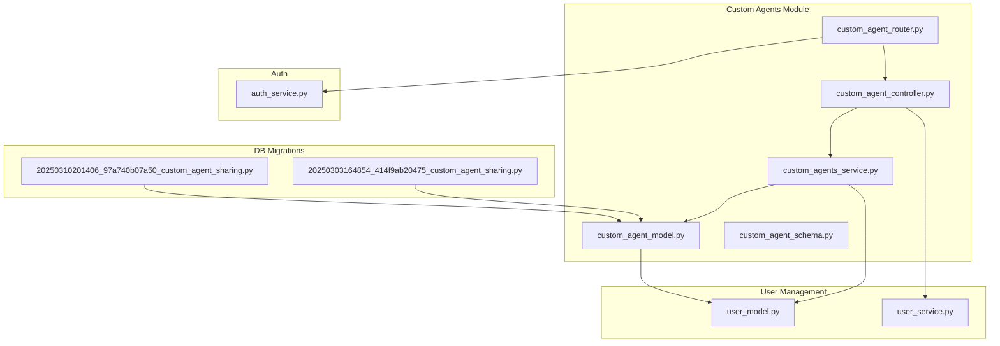
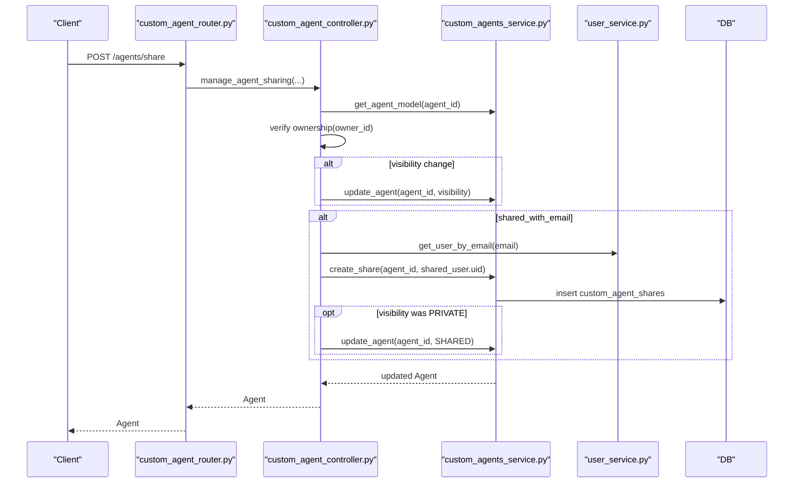
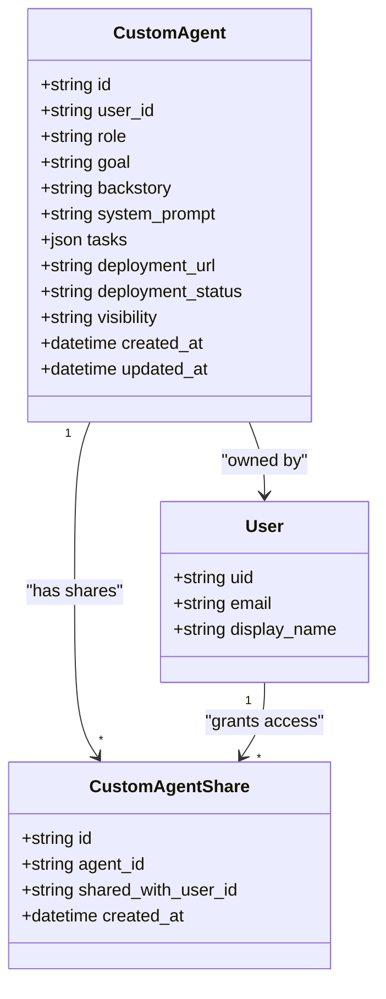
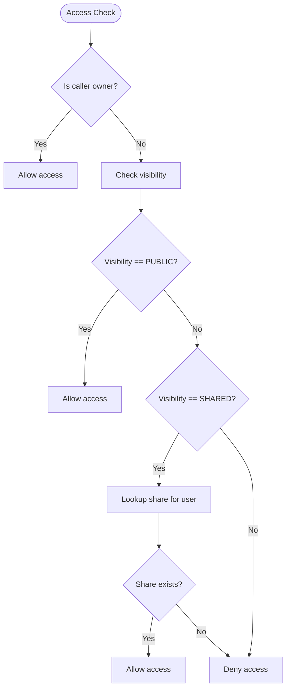
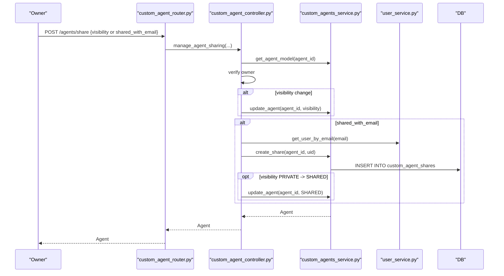
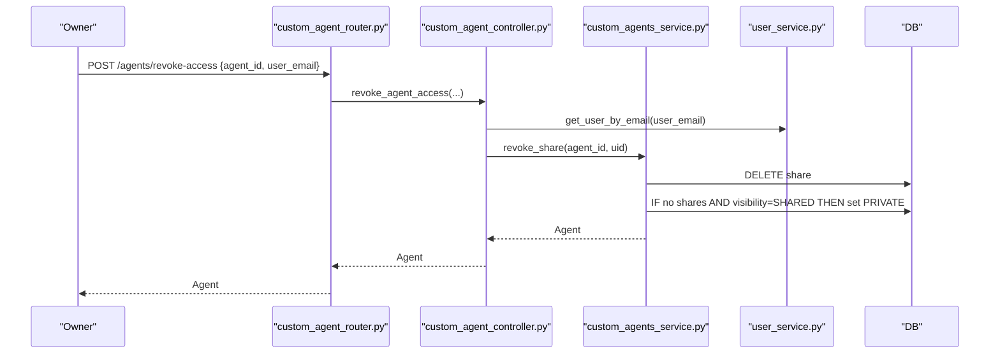
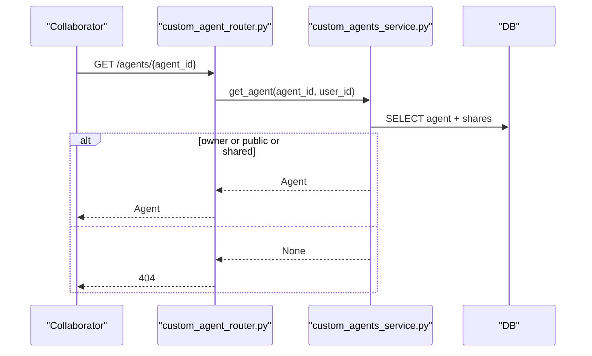
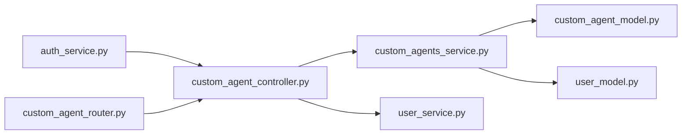
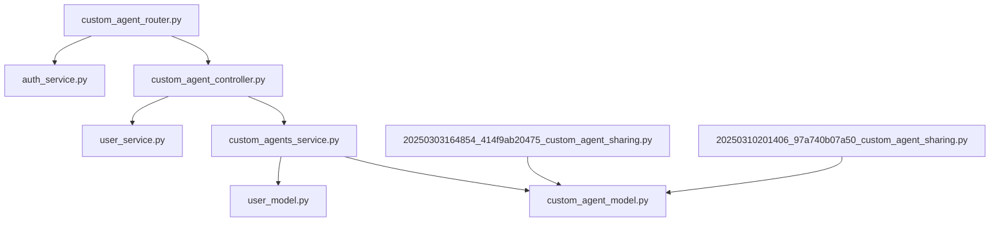

# Sharing & Collaboration

<cite>
**Referenced Files in This Document**
- [custom_agent_model.py](file://app/modules/intelligence/agents/custom_agents/custom_agent_model.py)
- [custom_agent_schema.py](file://app/modules/intelligence/agents/custom_agents/custom_agent_schema.py)
- [custom_agents_service.py](file://app/modules/intelligence/agents/custom_agents/custom_agents_service.py)
- [custom_agent_controller.py](file://app/modules/intelligence/agents/custom_agents/custom_agent_controller.py)
- [custom_agent_router.py](file://app/modules/intelligence/agents/custom_agents/custom_agent_router.py)
- [user_model.py](file://app/modules/users/user_model.py)
- [user_service.py](file://app/modules/users/user_service.py)
- [auth_service.py](file://app/modules/auth/auth_service.py)
- [APIRouter.py](file://app/modules/utils/APIRouter.py)
- [20250303164854_414f9ab20475_custom_agent_sharing.py](file://app/alembic/versions/20250303164854_414f9ab20475_custom_agent_sharing.py)
- [20250310201406_97a740b07a50_custom_agent_sharing.py](file://app/alembic/versions/20250310201406_97a740b07a50_custom_agent_sharing.py)
- [access_service.py](file://app/modules/conversations/access/access_service.py)
- [access_schema.py](file://app/modules/conversations/access/access_schema.py)
</cite>

## Table of Contents
1. [Introduction](#introduction)
2. [Project Structure](#project-structure)
3. [Core Components](#core-components)
4. [Architecture Overview](#architecture-overview)
5. [Detailed Component Analysis](#detailed-component-analysis)
6. [Dependency Analysis](#dependency-analysis)
7. [Performance Considerations](#performance-considerations)
8. [Troubleshooting Guide](#troubleshooting-guide)
9. [Conclusion](#conclusion)
10. [Appendices](#appendices)

## Introduction
This document explains the custom agent sharing and collaboration features. It covers how agents are shared, how permissions are enforced, and how teams collaborate around agents. It documents the access control model, sharing permissions, and collaborative workflows, including invitation processes, permission levels, and revocation procedures. It also outlines security considerations, permission inheritance, and best practices for managing shared agents in collaborative environments.

## Project Structure
The sharing and collaboration features for custom agents are implemented in the intelligence agents module, with supporting services for user management and authentication. The routing layer exposes endpoints for sharing, access revocation, and listing shares. Database migrations introduce visibility and share records.

**Diagram sources**
- [custom_agent_router.py](file://app/modules/intelligence/agents/custom_agents/custom_agent_router.py#L1-L227)
- [custom_agent_controller.py](file://app/modules/intelligence/agents/custom_agents/custom_agent_controller.py#L1-L338)
- [custom_agents_service.py](file://app/modules/intelligence/agents/custom_agents/custom_agents_service.py#L1-L1157)
- [custom_agent_model.py](file://app/modules/intelligence/agents/custom_agents/custom_agent_model.py#L1-L61)
- [user_model.py](file://app/modules/users/user_model.py#L1-L59)
- [user_service.py](file://app/modules/users/user_service.py#L1-L177)
- [auth_service.py](file://app/modules/auth/auth_service.py#L1-L108)
- [20250303164854_414f9ab20475_custom_agent_sharing.py](file://app/alembic/versions/20250303164854_414f9ab20475_custom_agent_sharing.py#L1-L86)
- [20250310201406_97a740b07a50_custom_agent_sharing.py](file://app/alembic/versions/20250310201406_97a740b07a50_custom_agent_sharing.py#L1-L42)

**Section sources**
- [custom_agent_router.py](file://app/modules/intelligence/agents/custom_agents/custom_agent_router.py#L1-L227)
- [custom_agent_controller.py](file://app/modules/intelligence/agents/custom_agents/custom_agent_controller.py#L1-L338)
- [custom_agents_service.py](file://app/modules/intelligence/agents/custom_agents/custom_agents_service.py#L1-L1157)
- [custom_agent_model.py](file://app/modules/intelligence/agents/custom_agents/custom_agent_model.py#L1-L61)
- [user_model.py](file://app/modules/users/user_model.py#L1-L59)
- [user_service.py](file://app/modules/users/user_service.py#L1-L177)
- [auth_service.py](file://app/modules/auth/auth_service.py#L1-L108)
- [20250303164854_414f9ab20475_custom_agent_sharing.py](file://app/alembic/versions/20250303164854_414f9ab20475_custom_agent_sharing.py#L1-L86)
- [20250310201406_97a740b07a50_custom_agent_sharing.py](file://app/alembic/versions/20250310201406_97a740b07a50_custom_agent_sharing.py#L1-L42)

## Core Components
- CustomAgent model and CustomAgentShare model define agent visibility and per-user sharing records.
- CustomAgentService implements permission checks, sharing, revocation, and visibility transitions.
- CustomAgentController orchestrates endpoint-level logic, validates ownership, and coordinates with UserService for user lookup.
- CustomAgentRouter exposes endpoints for sharing, revocation, listing shares, and agent discovery.
- User model and UserService provide user identity and email-to-ID resolution.
- Auth service enforces bearer token authentication and injects user context.
- DB migrations add visibility to agents and introduce the custom_agent_shares table.

Key permission levels:
- Private: only the owner can access.
- Shared: accessible to users granted explicit shares; visibility is set to shared automatically when shares exist.
- Public: accessible to anyone who can discover it (subject to listing filters).

**Section sources**
- [custom_agent_model.py](file://app/modules/intelligence/agents/custom_agents/custom_agent_model.py#L9-L61)
- [custom_agent_schema.py](file://app/modules/intelligence/agents/custom_agents/custom_agent_schema.py#L43-L46)
- [custom_agents_service.py](file://app/modules/intelligence/agents/custom_agents/custom_agents_service.py#L266-L296)
- [custom_agent_controller.py](file://app/modules/intelligence/agents/custom_agents/custom_agent_controller.py#L43-L150)
- [custom_agent_router.py](file://app/modules/intelligence/agents/custom_agents/custom_agent_router.py#L47-L93)
- [user_model.py](file://app/modules/users/user_model.py#L17-L41)
- [user_service.py](file://app/modules/users/user_service.py#L138-L152)
- [auth_service.py](file://app/modules/auth/auth_service.py#L48-L104)
- [20250303164854_414f9ab20475_custom_agent_sharing.py](file://app/alembic/versions/20250303164854_414f9ab20475_custom_agent_sharing.py#L22-L54)
- [20250310201406_97a740b07a50_custom_agent_sharing.py](file://app/alembic/versions/20250310201406_97a740b07a50_custom_agent_sharing.py#L21-L35)

## Architecture Overview
The sharing architecture separates concerns across router, controller, service, and persistence layers. Authentication ensures callers are authenticated. Ownership checks gate sharing operations. Visibility and share records enforce access control at retrieval and runtime execution.

**Diagram sources**
- [custom_agent_router.py](file://app/modules/intelligence/agents/custom_agents/custom_agent_router.py#L47-L69)
- [custom_agent_controller.py](file://app/modules/intelligence/agents/custom_agents/custom_agent_controller.py#L43-L150)
- [custom_agents_service.py](file://app/modules/intelligence/agents/custom_agents/custom_agents_service.py#L94-L146)
- [user_service.py](file://app/modules/users/user_service.py#L138-L152)

## Detailed Component Analysis

### Data Model and Schema
- CustomAgent tracks ownership, metadata, tasks, deployment info, and visibility.
- CustomAgentShare links an agent to a user via shared_with_user_id.
- Visibility is an enum with PRIVATE, SHARED, and PUBLIC.
- Pydantic models define sharing requests, revocation requests, and share listings.

**Diagram sources**
- [custom_agent_model.py](file://app/modules/intelligence/agents/custom_agents/custom_agent_model.py#L9-L61)
- [user_model.py](file://app/modules/users/user_model.py#L17-L41)

**Section sources**
- [custom_agent_model.py](file://app/modules/intelligence/agents/custom_agents/custom_agent_model.py#L9-L61)
- [custom_agent_schema.py](file://app/modules/intelligence/agents/custom_agents/custom_agent_schema.py#L43-L46)
- [user_model.py](file://app/modules/users/user_model.py#L17-L41)

### Access Control and Permission Model
- Ownership: only the agent’s owner can change visibility or manage shares.
- Visibility rules:
  - PRIVATE: only owner can access.
  - SHARED: accessible to users with a share; visibility is set to SHARED when shares exist.
  - PUBLIC: accessible to anyone who can discover it (listing filters apply).
- Runtime enforcement: during execution, the service checks ownership or visibility/share membership.

**Diagram sources**
- [custom_agents_service.py](file://app/modules/intelligence/agents/custom_agents/custom_agents_service.py#L524-L665)

**Section sources**
- [custom_agents_service.py](file://app/modules/intelligence/agents/custom_agents/custom_agents_service.py#L524-L665)
- [custom_agent_schema.py](file://app/modules/intelligence/agents/custom_agents/custom_agent_schema.py#L43-L46)

### Sharing Workflows
- Change visibility: owner sets PRIVATE or PUBLIC; setting SHARED is automatic when shares exist.
- Invite collaborator: owner shares with a user by email; the system resolves the user ID and creates a share record.
- List collaborators: owner retrieves emails of users with whom the agent is shared.
- Revoke access: owner removes a specific user’s share; if no shares remain and visibility was SHARED, it reverts to PRIVATE.

**Diagram sources**
- [custom_agent_router.py](file://app/modules/intelligence/agents/custom_agents/custom_agent_router.py#L47-L69)
- [custom_agent_controller.py](file://app/modules/intelligence/agents/custom_agents/custom_agent_controller.py#L43-L150)
- [custom_agents_service.py](file://app/modules/intelligence/agents/custom_agents/custom_agents_service.py#L94-L146)
- [user_service.py](file://app/modules/users/user_service.py#L138-L152)

**Section sources**
- [custom_agent_router.py](file://app/modules/intelligence/agents/custom_agents/custom_agent_router.py#L47-L69)
- [custom_agent_controller.py](file://app/modules/intelligence/agents/custom_agents/custom_agent_controller.py#L43-L150)
- [custom_agents_service.py](file://app/modules/intelligence/agents/custom_agents/custom_agents_service.py#L94-L146)

### Invitation and Collaborator Management
- Invitation process:
  - Owner calls share endpoint with shared_with_email.
  - Controller resolves the user ID via UserService.
  - Service inserts a share record; if visibility was PRIVATE, it is set to SHARED.
- Collaborator listing:
  - Owner calls shares endpoint to list emails of shared users.
- Revocation:
  - Owner calls revoke-access endpoint; service deletes the share and may revert visibility to PRIVATE if none remain.

**Diagram sources**
- [custom_agent_router.py](file://app/modules/intelligence/agents/custom_agents/custom_agent_router.py#L72-L93)
- [custom_agent_controller.py](file://app/modules/intelligence/agents/custom_agents/custom_agent_controller.py#L161-L211)
- [custom_agents_service.py](file://app/modules/intelligence/agents/custom_agents/custom_agents_service.py#L147-L201)

**Section sources**
- [custom_agent_router.py](file://app/modules/intelligence/agents/custom_agents/custom_agent_router.py#L72-L93)
- [custom_agent_controller.py](file://app/modules/intelligence/agents/custom_agents/custom_agent_controller.py#L161-L211)
- [custom_agents_service.py](file://app/modules/intelligence/agents/custom_agents/custom_agents_service.py#L147-L201)

### Collaborative Editing and Execution
- Collaborators can view agents they have access to via listing and retrieval endpoints.
- Runtime execution requires either ownership or access via visibility or share.
- The service builds a runtime agent configuration from stored agent metadata and tasks.

**Diagram sources**
- [custom_agent_router.py](file://app/modules/intelligence/agents/custom_agents/custom_agent_router.py#L161-L179)
- [custom_agents_service.py](file://app/modules/intelligence/agents/custom_agents/custom_agents_service.py#L524-L596)

**Section sources**
- [custom_agent_router.py](file://app/modules/intelligence/agents/custom_agents/custom_agent_router.py#L161-L179)
- [custom_agents_service.py](file://app/modules/intelligence/agents/custom_agents/custom_agents_service.py#L524-L596)

### Relationship Between Sharing Service, Access Control, and User Management
- Sharing service depends on:
  - Ownership verification (controller).
  - User lookup by email (UserService).
  - Persistence of share records (CustomAgentShare).
- Access control relies on:
  - Agent visibility and share membership.
  - Runtime checks mirroring listing logic.
- User management provides:
  - Identity resolution by email.
  - Profile and provider information.

**Diagram sources**
- [auth_service.py](file://app/modules/auth/auth_service.py#L48-L104)
- [custom_agent_controller.py](file://app/modules/intelligence/agents/custom_agents/custom_agent_controller.py#L24-L31)
- [custom_agents_service.py](file://app/modules/intelligence/agents/custom_agents/custom_agents_service.py#L11-L32)
- [custom_agent_model.py](file://app/modules/intelligence/agents/custom_agents/custom_agent_model.py#L9-L61)
- [user_model.py](file://app/modules/users/user_model.py#L17-L41)
- [user_service.py](file://app/modules/users/user_service.py#L138-L152)
- [custom_agent_router.py](file://app/modules/intelligence/agents/custom_agents/custom_agent_router.py#L1-L23)

**Section sources**
- [auth_service.py](file://app/modules/auth/auth_service.py#L48-L104)
- [custom_agent_controller.py](file://app/modules/intelligence/agents/custom_agents/custom_agent_controller.py#L24-L31)
- [custom_agents_service.py](file://app/modules/intelligence/agents/custom_agents/custom_agents_service.py#L11-L32)
- [custom_agent_model.py](file://app/modules/intelligence/agents/custom_agents/custom_agent_model.py#L9-L61)
- [user_model.py](file://app/modules/users/user_model.py#L17-L41)
- [user_service.py](file://app/modules/users/user_service.py#L138-L152)
- [custom_agent_router.py](file://app/modules/intelligence/agents/custom_agents/custom_agent_router.py#L1-L23)

## Dependency Analysis
- Router depends on controller and auth handler.
- Controller depends on service and user service.
- Service depends on models, providers, and database session.
- Models depend on SQLAlchemy ORM and relationships.
- Migrations define schema evolution for visibility and shares.

**Diagram sources**
- [custom_agent_router.py](file://app/modules/intelligence/agents/custom_agents/custom_agent_router.py#L1-L23)
- [custom_agent_controller.py](file://app/modules/intelligence/agents/custom_agents/custom_agent_controller.py#L24-L31)
- [custom_agents_service.py](file://app/modules/intelligence/agents/custom_agents/custom_agents_service.py#L11-L32)
- [custom_agent_model.py](file://app/modules/intelligence/agents/custom_agents/custom_agent_model.py#L9-L61)
- [user_model.py](file://app/modules/users/user_model.py#L17-L41)
- [user_service.py](file://app/modules/users/user_service.py#L138-L152)
- [auth_service.py](file://app/modules/auth/auth_service.py#L48-L104)
- [20250303164854_414f9ab20475_custom_agent_sharing.py](file://app/alembic/versions/20250303164854_414f9ab20475_custom_agent_sharing.py#L22-L54)
- [20250310201406_97a740b07a50_custom_agent_sharing.py](file://app/alembic/versions/20250310201406_97a740b07a50_custom_agent_sharing.py#L21-L35)

**Section sources**
- [custom_agent_router.py](file://app/modules/intelligence/agents/custom_agents/custom_agent_router.py#L1-L23)
- [custom_agent_controller.py](file://app/modules/intelligence/agents/custom_agents/custom_agent_controller.py#L24-L31)
- [custom_agents_service.py](file://app/modules/intelligence/agents/custom_agents/custom_agents_service.py#L11-L32)
- [custom_agent_model.py](file://app/modules/intelligence/agents/custom_agents/custom_agent_model.py#L9-L61)
- [user_model.py](file://app/modules/users/user_model.py#L17-L41)
- [user_service.py](file://app/modules/users/user_service.py#L138-L152)
- [auth_service.py](file://app/modules/auth/auth_service.py#L48-L104)
- [20250303164854_414f9ab20475_custom_agent_sharing.py](file://app/alembic/versions/20250303164854_414f9ab20475_custom_agent_sharing.py#L22-L54)
- [20250310201406_97a740b07a50_custom_agent_sharing.py](file://app/alembic/versions/20250310201406_97a740b07a50_custom_agent_sharing.py#L21-L35)

## Performance Considerations
- Visibility and share checks use efficient SQL queries with subqueries and joins.
- Listing agents combines filters using OR conditions; ensure appropriate indexing on user_id, visibility, and share foreign keys.
- Email-to-ID resolution is performed once per operation; batch operations can reuse resolved IDs.
- Consider caching frequently accessed agent metadata for high-throughput scenarios.

[No sources needed since this section provides general guidance]

## Troubleshooting Guide
Common issues and resolutions:
- Unauthorized access attempts:
  - Ensure the caller is authenticated and the token maps to a valid user.
  - Verify ownership for operations that require it.
- Invalid sharing requests:
  - Confirm that either visibility or shared_with_email is provided.
  - Avoid setting visibility to PUBLIC while specifying a specific user email.
- User not found:
  - Validate the email address exists and is correctly formatted.
- Share not found on revocation:
  - Confirm the user had a share; otherwise, no action is taken.
- Database errors:
  - Inspect logs for SQLAlchemy exceptions and rollback behavior.

**Section sources**
- [custom_agent_schema.py](file://app/modules/intelligence/agents/custom_agents/custom_agent_schema.py#L96-L114)
- [custom_agent_controller.py](file://app/modules/intelligence/agents/custom_agents/custom_agent_controller.py#L52-L63)
- [custom_agents_service.py](file://app/modules/intelligence/agents/custom_agents/custom_agents_service.py#L138-L201)
- [auth_service.py](file://app/modules/auth/auth_service.py#L68-L104)

## Conclusion
The custom agent sharing system provides robust access control through ownership, visibility, and explicit share records. It supports inviting collaborators, listing shared users, and revoking access with automatic visibility transitions. The architecture cleanly separates concerns across router, controller, service, and persistence layers, integrating tightly with authentication and user management. Teams can collaborate effectively while maintaining strong security boundaries.

[No sources needed since this section summarizes without analyzing specific files]

## Appendices

### Endpoint Reference
- POST /agents/share: Change visibility or invite a collaborator by email.
- POST /agents/revoke-access: Revoke a specific user’s access.
- GET /agents/{agent_id}/shares: List emails of users with whom the agent is shared.
- GET /agents: List agents accessible to the user (supports including public and shared).

**Section sources**
- [custom_agent_router.py](file://app/modules/intelligence/agents/custom_agents/custom_agent_router.py#L47-L93)
- [custom_agent_router.py](file://app/modules/intelligence/agents/custom_agents/custom_agent_router.py#L182-L205)
- [custom_agent_router.py](file://app/modules/intelligence/agents/custom_agents/custom_agent_router.py#L96-L115)

### Permission Levels and Behavior
- PRIVATE: owner-only access.
- SHARED: accessible to users with a share; visibility set automatically when shares exist.
- PUBLIC: accessible to anyone who can discover it (listing filters apply).

**Section sources**
- [custom_agent_schema.py](file://app/modules/intelligence/agents/custom_agents/custom_agent_schema.py#L43-L46)
- [custom_agent_controller.py](file://app/modules/intelligence/agents/custom_agents/custom_agent_controller.py#L120-L136)
- [custom_agents_service.py](file://app/modules/intelligence/agents/custom_agents/custom_agents_service.py#L276-L287)

### Security Considerations
- Enforce bearer token authentication for all sharing endpoints.
- Validate that the caller owns the agent before allowing visibility changes or share management.
- Prevent conflicts between PUBLIC visibility and targeted sharing.
- Ensure share deletion cascades appropriately and visibility reverts to PRIVATE when no shares remain.

**Section sources**
- [auth_service.py](file://app/modules/auth/auth_service.py#L48-L104)
- [custom_agent_controller.py](file://app/modules/intelligence/agents/custom_agents/custom_agent_controller.py#L52-L63)
- [custom_agent_schema.py](file://app/modules/intelligence/agents/custom_agents/custom_agent_schema.py#L104-L108)
- [custom_agents_service.py](file://app/modules/intelligence/agents/custom_agents/custom_agents_service.py#L185-L191)

### Best Practices for Team Collaboration
- Keep visibility PRIVATE by default; explicitly grant access to collaborators.
- Use SHARED visibility to indicate intentional collaboration; rely on share records for granular control.
- Regularly review and prune unnecessary shares to minimize exposure.
- Encourage owners to document agent goals and tasks to improve team understanding.
- Use the listing endpoints to discover public and shared agents within organizational policies.

**Section sources**
- [custom_agent_controller.py](file://app/modules/intelligence/agents/custom_agents/custom_agent_controller.py#L245-L261)
- [custom_agents_service.py](file://app/modules/intelligence/agents/custom_agents/custom_agents_service.py#L266-L296)