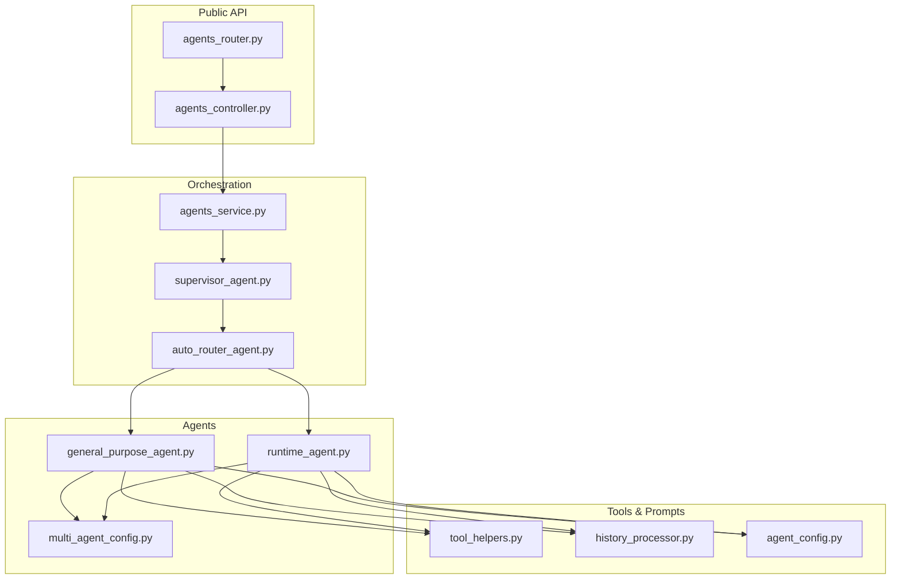
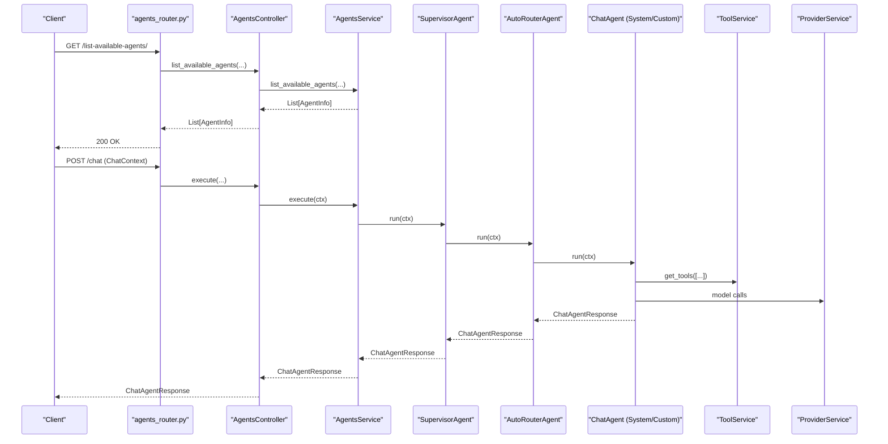
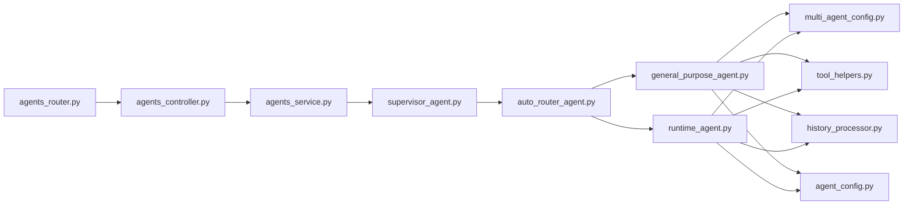

# Intelligence Engine

<cite>
**Referenced Files in This Document**
- [agents_controller.py](file://app/modules/intelligence/agents/agents_controller.py)
- [agents_service.py](file://app/modules/intelligence/agents/agents_service.py)
- [agents_router.py](file://app/modules/intelligence/agents/agents_router.py)
- [chat_agent.py](file://app/modules/intelligence/agents/chat_agent.py)
- [multi_agent_config.py](file://app/modules/intelligence/agents/multi_agent_config.py)
- [supervisor_agent.py](file://app/modules/intelligence/agents/chat_agents/supervisor_agent.py)
- [auto_router_agent.py](file://app/modules/intelligence/agents/chat_agents/auto_router_agent.py)
- [history_processor.py](file://app/modules/intelligence/agents/chat_agents/history_processor.py)
- [tool_helpers.py](file://app/modules/intelligence/agents/chat_agents/tool_helpers.py)
- [general_purpose_agent.py](file://app/modules/intelligence/agents/chat_agents/system_agents/general_purpose_agent.py)
- [custom_agent_model.py](file://app/modules/intelligence/agents/custom_agents/custom_agent_model.py)
- [runtime_agent.py](file://app/modules/intelligence/agents/custom_agents/runtime_agent.py)
- [agent_config.py](file://app/modules/intelligence/agents/chat_agents/agent_config.py)
- [pydantic_multi_agent.py](file://app/modules/intelligence/agents/chat_agents/pydantic_multi_agent.py)
</cite>

## Table of Contents
1. [Introduction](#introduction)
2. [Project Structure](#project-structure)
3. [Core Components](#core-components)
4. [Architecture Overview](#architecture-overview)
5. [Detailed Component Analysis](#detailed-component-analysis)
6. [Dependency Analysis](#dependency-analysis)
7. [Performance Considerations](#performance-considerations)
8. [Troubleshooting Guide](#troubleshooting-guide)
9. [Conclusion](#conclusion)

## Introduction
The Potpie Intelligence Engine is the core AI/LLM processing layer responsible for orchestrating agent interactions and tool execution within the system. It powers a multi-agent architecture that routes user queries to appropriate agents, manages delegation between specialists, and streams responses with tool-call transparency. The engine integrates system agents (specialized for codebase tasks), general-purpose agents, and custom agents defined by users, while providing robust configuration, prompt management, and tool orchestration.

## Project Structure
The Intelligence Engine is organized around:
- Public API surface for listing agents and integrating with the rest of the platform
- Agent orchestration layer (supervisor and router)
- Agent implementations (system, general-purpose, custom)
- Tool integration and helper utilities
- Prompt and provider services
- Multi-agent configuration and execution flows

**Diagram sources**
- [agents_router.py](file://app/modules/intelligence/agents/agents_router.py#L1-L46)
- [agents_controller.py](file://app/modules/intelligence/agents/agents_controller.py#L1-L35)
- [agents_service.py](file://app/modules/intelligence/agents/agents_service.py#L1-L203)
- [supervisor_agent.py](file://app/modules/intelligence/agents/chat_agents/supervisor_agent.py#L1-L25)
- [auto_router_agent.py](file://app/modules/intelligence/agents/chat_agents/auto_router_agent.py#L1-L38)
- [general_purpose_agent.py](file://app/modules/intelligence/agents/chat_agents/system_agents/general_purpose_agent.py#L1-L150)
- [runtime_agent.py](file://app/modules/intelligence/agents/custom_agents/runtime_agent.py#L1-L172)
- [multi_agent_config.py](file://app/modules/intelligence/agents/multi_agent_config.py#L1-L119)
- [tool_helpers.py](file://app/modules/intelligence/agents/chat_agents/tool_helpers.py#L1-L800)
- [history_processor.py](file://app/modules/intelligence/agents/chat_agents/history_processor.py#L1-L800)
- [agent_config.py](file://app/modules/intelligence/agents/chat_agents/agent_config.py#L1-L21)

**Section sources**
- [agents_router.py](file://app/modules/intelligence/agents/agents_router.py#L1-L46)
- [agents_controller.py](file://app/modules/intelligence/agents/agents_controller.py#L1-L35)
- [agents_service.py](file://app/modules/intelligence/agents/agents_service.py#L1-L203)

## Core Components
- Public API and Controllers
  - Router exposes endpoint to list available agents, delegating to a controller that composes services for providers and tools.
- Agent Orchestration
  - SupervisorAgent wraps AutoRouterAgent to select the current agent based on ChatContext and route execution accordingly.
- Agent Implementations
  - System agents (e.g., general purpose) build Pydantic-based agents with configurable multi-agent mode.
  - Custom agents load runtime configuration and build PydanticMultiAgent instances.
- Tooling and Helpers
  - Tool helpers provide friendly messages and context for tool calls.
  - History processor manages token budgets and tool-result deduplication for long conversations.
- Configuration
  - MultiAgentConfig controls global and per-agent multi-agent behavior via environment variables.

Key public interfaces:
- Endpoint: GET /list-available-agents/
- Methods: AgentsController.list_available_agents, AgentsService.list_available_agents, AgentsService.validate_agent_id
- Agent interface: ChatAgent.run, ChatAgent.run_stream
- Response models: ChatAgentResponse, ToolCallResponse, AgentInfo

Return value specifications:
- AgentInfo: id, name, description, status, visibility
- ChatAgentResponse: response, tool_calls, citations
- ToolCallResponse: call_id, event_type, tool_name, tool_response, tool_call_details, stream_part, is_complete

**Section sources**
- [agents_router.py](file://app/modules/intelligence/agents/agents_router.py#L25-L46)
- [agents_controller.py](file://app/modules/intelligence/agents/agents_controller.py#L13-L35)
- [agents_service.py](file://app/modules/intelligence/agents/agents_service.py#L39-L203)
- [chat_agent.py](file://app/modules/intelligence/agents/chat_agent.py#L14-L121)
- [multi_agent_config.py](file://app/modules/intelligence/agents/multi_agent_config.py#L12-L119)

## Architecture Overview
The Intelligence Engine follows a layered architecture:
- API Layer: FastAPI router and controller
- Service Layer: AgentsService orchestrates supervisors and agent registries
- Agent Layer: System and custom agents implement ChatAgent
- Tooling Layer: ToolService supplies tools; ToolHelpers provide UX messages
- Provider Layer: ProviderService supplies LLM capabilities and model configuration
- Execution Layer: PydanticMultiAgent coordinates delegation, streaming, and multimodal flows

**Diagram sources**
- [agents_router.py](file://app/modules/intelligence/agents/agents_router.py#L25-L46)
- [agents_controller.py](file://app/modules/intelligence/agents/agents_controller.py#L13-L35)
- [agents_service.py](file://app/modules/intelligence/agents/agents_service.py#L151-L156)
- [supervisor_agent.py](file://app/modules/intelligence/agents/chat_agents/supervisor_agent.py#L17-L24)
- [auto_router_agent.py](file://app/modules/intelligence/agents/chat_agents/auto_router_agent.py#L28-L37)
- [general_purpose_agent.py](file://app/modules/intelligence/agents/chat_agents/system_agents/general_purpose_agent.py#L112-L119)
- [runtime_agent.py](file://app/modules/intelligence/agents/custom_agents/runtime_agent.py#L146-L154)

## Detailed Component Analysis

### Multi-Agent Configuration
Controls whether multi-agent mode is enabled globally and per agent type, with defaults set via environment variables. Provides a simple API to query configuration for a given agent type.

- Global toggle: ENABLE_MULTI_AGENT
- Per-agent toggles: GENERAL_PURPOSE_MULTI_AGENT, CODE_GEN_MULTI_AGENT, QNA_MULTI_AGENT, DEBUG_MULTI_AGENT, UNIT_TEST_MULTI_AGENT, INTEGRATION_TEST_MULTI_AGENT, LLD_MULTI_AGENT, CODE_CHANGES_MULTI_AGENT, SWEB_DEBUG_MULTI_AGENT
- Custom agent toggle: CUSTOM_AGENT_MULTI_AGENT

Behavior:
- If global disabled, multi-agent is disabled for all agents
- Otherwise, defaults to enabled for all agents unless overridden

**Section sources**
- [multi_agent_config.py](file://app/modules/intelligence/agents/multi_agent_config.py#L12-L119)

### Supervisor and Routing
SupervisorAgent delegates to AutoRouterAgent, which selects the current agent from ChatContext and executes it synchronously or streams results.

- SupervisorAgent.run/run_stream forward to AutoRouterAgent
- AutoRouterAgent._get_current_agent resolves the agent by id from the agent registry

**Section sources**
- [supervisor_agent.py](file://app/modules/intelligence/agents/chat_agents/supervisor_agent.py#L9-L25)
- [auto_router_agent.py](file://app/modules/intelligence/agents/chat_agents/auto_router_agent.py#L13-L38)

### System Agents: General Purpose Agent
GeneralPurposeAgent builds either:
- PydanticMultiAgent with integrated delegate agents (when multi-agent enabled and model supports Pydantic)
- PydanticRagAgent fallback (when multi-agent disabled or model lacks Pydantic support)

It configures tasks, tools (web search and extractor), and logs capability checks.

- Tool selection: web_search_tool, webpage_extractor
- Delegate agents include Think-Execute and integration agents when multi-agent is enabled

**Section sources**
- [general_purpose_agent.py](file://app/modules/intelligence/agents/chat_agents/system_agents/general_purpose_agent.py#L26-L120)

### Custom Agents: Runtime Agent
RuntimeCustomAgent loads a custom agent configuration from JSON, merges a static how-to guide with the user’s backstory, and constructs a PydanticMultiAgent or PydanticRagAgent depending on model capabilities and configuration.

- Configuration model includes user_id, role, goal, backstory, system_prompt, tasks, project_id, use_multi_agent
- Tasks define tools, description, expected output, and optional MCP servers
- Enrichment: when node_ids are present, additional code context is appended to ChatContext

**Section sources**
- [runtime_agent.py](file://app/modules/intelligence/agents/custom_agents/runtime_agent.py#L22-L154)
- [custom_agent_model.py](file://app/modules/intelligence/agents/custom_agents/custom_agent_model.py#L9-L61)

### Agent Interface and Responses
ChatAgent defines the contract for synchronous and asynchronous execution. ChatAgentResponse carries the final response, tool call events, and citations. ToolCallResponse captures tool invocation details and streaming updates.

- ChatAgentResponse: response, tool_calls, citations
- ToolCallResponse: call_id, event_type, tool_name, tool_response, tool_call_details, stream_part, is_complete

**Section sources**
- [chat_agent.py](file://app/modules/intelligence/agents/chat_agent.py#L14-L121)

### Tool Helpers and UX Messages
Tool helpers provide human-friendly messages for tool start, completion, and call info, improving transparency for streaming and delegation scenarios.

- get_tool_run_message: user-facing start message
- get_tool_response_message: user-facing completion message
- get_tool_call_info_content: compact call context for logs and UI

**Section sources**
- [tool_helpers.py](file://app/modules/intelligence/agents/chat_agents/tool_helpers.py#L19-L800)

### History Processing and Token Management
TokenAwareHistoryProcessor maintains conversation context within token limits by:
- Tracking tokens across system prompt, tool schemas, and messages
- Keeping recent tool results and LLM responses
- Trimming or compressing large tool results
- Ensuring valid tool_use/tool_result pairing for providers

This enables long-running conversations without exceeding model context windows.

**Section sources**
- [history_processor.py](file://app/modules/intelligence/agents/chat_agents/history_processor.py#L44-L800)

### Pydantic Multi-Agent Orchestration
PydanticMultiAgent coordinates:
- Supervisor and delegate agents
- Execution flows (standard, multimodal, streaming, multimodal streaming)
- Stream processing and error handling
- History processing integration

It initializes managers and flows, then routes to the appropriate flow based on multimodal support and context.

**Section sources**
- [pydantic_multi_agent.py](file://app/modules/intelligence/agents/chat_agents/pydantic_multi_agent.py#L38-L237)

### Conceptual Overview
Beginner-friendly explanation:
- The Intelligence Engine is like a conductor that decides which “agent” (AI role) should handle a user’s query.
- Some agents are built-in (system agents) for specific tasks like debugging or generating code.
- Others are created by users (custom agents) with their own roles, goals, and tools.
- The engine can split complex tasks among multiple agents (multi-agent mode) and stream results in real time.
- Tools are like external capabilities (web search, file access, issue trackers) that agents can use to gather information or act.

Technical overview:
- The engine uses a provider abstraction to choose the right model and capabilities.
- It builds agents from configuration and tools, then runs them with context-aware history management.
- Delegation ensures that when a task is outside an agent’s specialty, another agent takes over.
- Streaming responses allow the UI to render partial results as they become available.

[No sources needed since this section doesn't analyze specific files]

## Dependency Analysis
High-level dependencies:
- Router depends on Controller
- Controller depends on Service and Provider/Tool/Prompt services
- Service composes SupervisorAgent and system/custom agent registries
- Agents depend on ToolService and ProviderService
- PydanticMultiAgent composes delegation managers, stream processors, and execution flows

**Diagram sources**
- [agents_router.py](file://app/modules/intelligence/agents/agents_router.py#L1-L46)
- [agents_controller.py](file://app/modules/intelligence/agents/agents_controller.py#L1-L35)
- [agents_service.py](file://app/modules/intelligence/agents/agents_service.py#L1-L203)
- [supervisor_agent.py](file://app/modules/intelligence/agents/chat_agents/supervisor_agent.py#L1-L25)
- [auto_router_agent.py](file://app/modules/intelligence/agents/chat_agents/auto_router_agent.py#L1-L38)
- [general_purpose_agent.py](file://app/modules/intelligence/agents/chat_agents/system_agents/general_purpose_agent.py#L1-L150)
- [runtime_agent.py](file://app/modules/intelligence/agents/custom_agents/runtime_agent.py#L1-L172)
- [multi_agent_config.py](file://app/modules/intelligence/agents/multi_agent_config.py#L1-L119)
- [tool_helpers.py](file://app/modules/intelligence/agents/chat_agents/tool_helpers.py#L1-L800)
- [history_processor.py](file://app/modules/intelligence/agents/chat_agents/history_processor.py#L1-L800)
- [agent_config.py](file://app/modules/intelligence/agents/chat_agents/agent_config.py#L1-L21)

**Section sources**
- [agents_router.py](file://app/modules/intelligence/agents/agents_router.py#L1-L46)
- [agents_controller.py](file://app/modules/intelligence/agents/agents_controller.py#L1-L35)
- [agents_service.py](file://app/modules/intelligence/agents/agents_service.py#L1-L203)

## Performance Considerations
- Multi-agent mode adds orchestration overhead; enable selectively via configuration to balance accuracy and latency.
- Token-aware history processing reduces context size to fit model limits; tune thresholds for long conversations.
- Streaming improves perceived latency; ensure client-side buffering aligns with stream_part semantics.
- Tool calls can be expensive; batch and reuse results where possible, and leverage caching strategies at the tool layer.

[No sources needed since this section provides general guidance]

## Troubleshooting Guide
Common issues and resolutions:
- Multi-agent disabled unexpectedly
  - Verify environment variables for global and per-agent toggles.
  - Confirm model capabilities support Pydantic-based agents.
- Tool call pairing errors
  - Ensure tool_use and tool_result parts are paired correctly; the history processor enforces this.
- Streaming interruptions
  - Check stream error handling and retry logic in the stream processor.
- Custom agent failures
  - Validate agent configuration JSON and tool availability; ensure MCP server configuration is correct if used.

**Section sources**
- [multi_agent_config.py](file://app/modules/intelligence/agents/multi_agent_config.py#L46-L119)
- [history_processor.py](file://app/modules/intelligence/agents/chat_agents/history_processor.py#L432-L553)
- [pydantic_multi_agent.py](file://app/modules/intelligence/agents/chat_agents/pydantic_multi_agent.py#L176-L181)
- [runtime_agent.py](file://app/modules/intelligence/agents/custom_agents/runtime_agent.py#L77-L93)

## Conclusion
The Intelligence Engine provides a robust, extensible foundation for multi-agent AI/LLM orchestration. It cleanly separates concerns across API, orchestration, agent implementations, tools, and providers, while offering flexible configuration and streaming-first execution. System agents cover common development tasks, while custom agents empower users to tailor AI behavior to their workflows. The engine’s design supports scalability, maintainability, and a smooth developer and user experience.