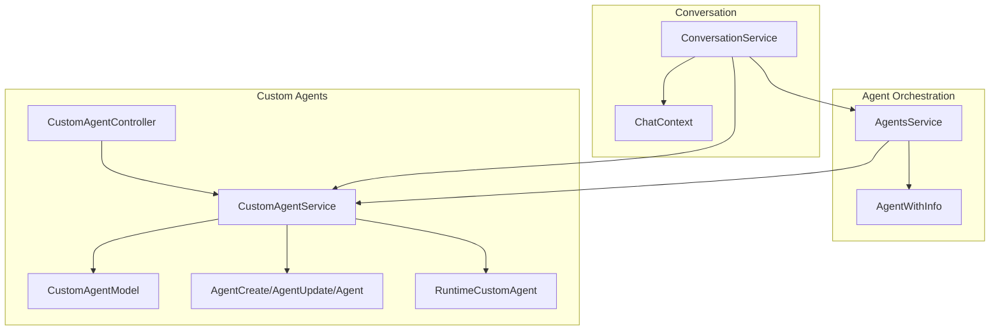
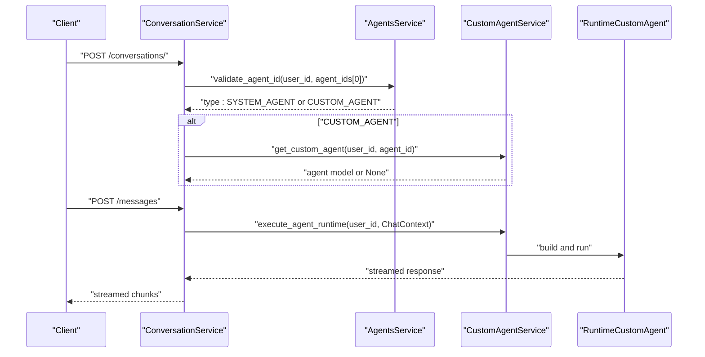
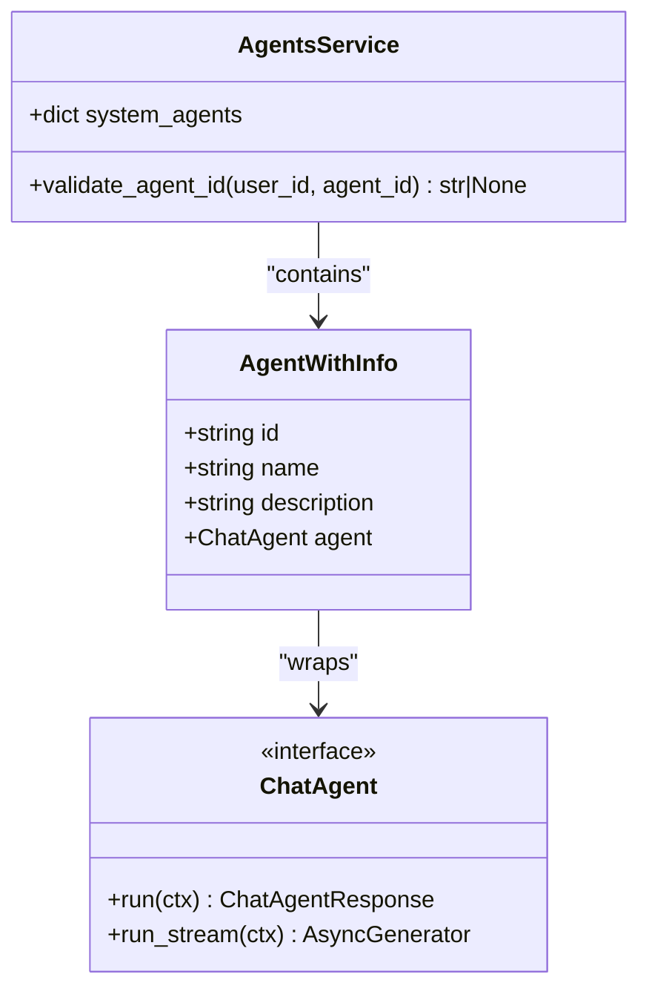
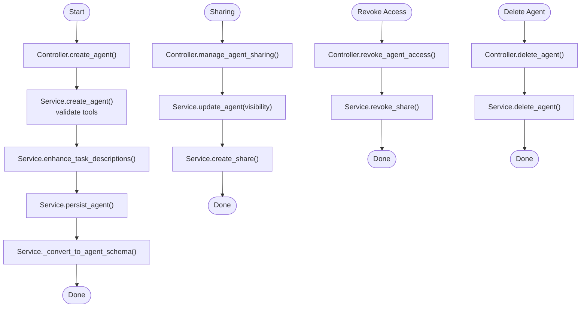
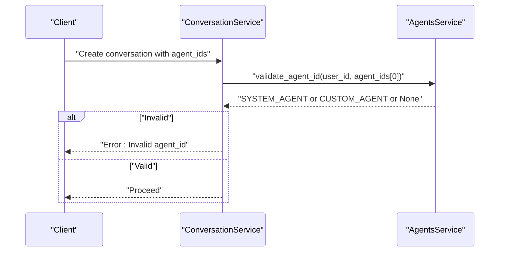
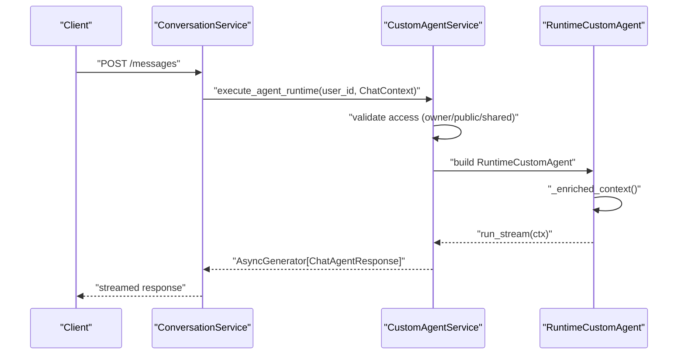
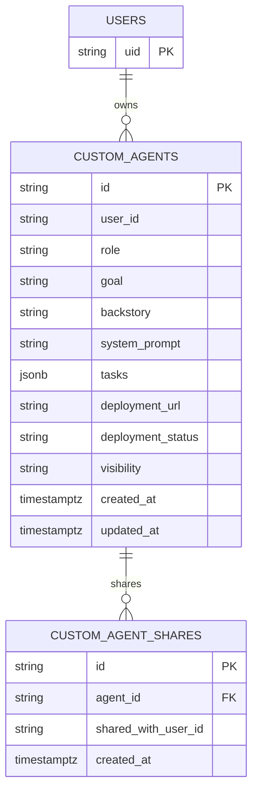
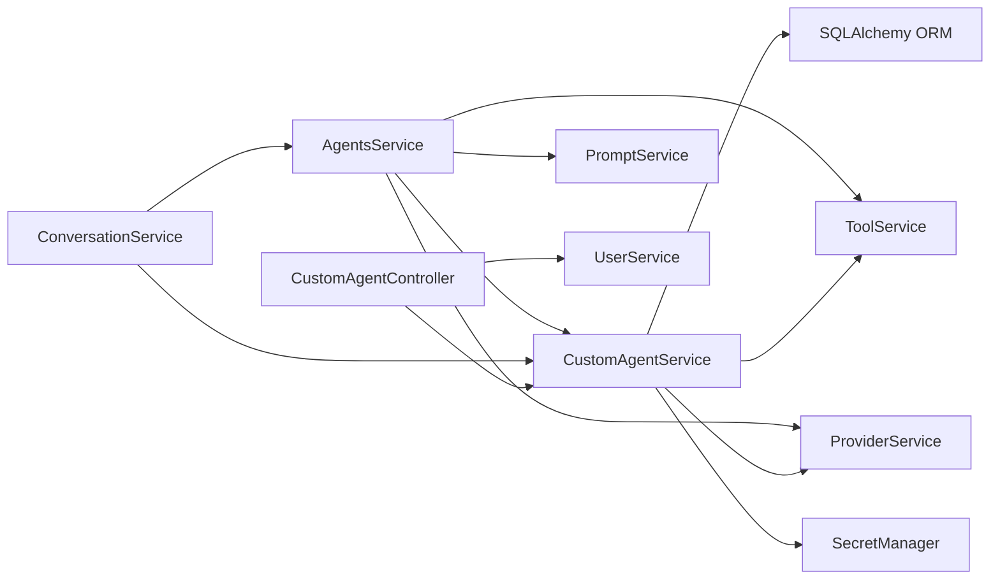

# Agent Lifecycle Management

<cite>
**Referenced Files in This Document**
- [chat_agent.py](file://app/modules/intelligence/agents/chat_agent.py)
- [agents_service.py](file://app/modules/intelligence/agents/agents_service.py)
- [custom_agents_service.py](file://app/modules/intelligence/agents/custom_agents/custom_agents_service.py)
- [custom_agent_model.py](file://app/modules/intelligence/agents/custom_agents/custom_agent_model.py)
- [custom_agent_schema.py](file://app/modules/intelligence/agents/custom_agents/custom_agent_schema.py)
- [runtime_agent.py](file://app/modules/intelligence/agents/custom_agents/runtime_agent.py)
- [custom_agent_controller.py](file://app/modules/intelligence/agents/custom_agents/custom_agent_controller.py)
- [conversation_service.py](file://app/modules/conversations/conversation/conversation_service.py)
- [20240828094302_48240c0ce09e_add_agent_id_support_in_conversation_.py](file://app/alembic/versions/20240828094302_48240c0ce09e_add_agent_id_support_in_conversation_.py)
- [test_conversations_router.py](file://tests/integration-tests/conversations/test_conversations_router.py)
</cite>

## Table of Contents
1. [Introduction](#introduction)
2. [Project Structure](#project-structure)
3. [Core Components](#core-components)
4. [Architecture Overview](#architecture-overview)
5. [Detailed Component Analysis](#detailed-component-analysis)
6. [Dependency Analysis](#dependency-analysis)
7. [Performance Considerations](#performance-considerations)
8. [Troubleshooting Guide](#troubleshooting-guide)
9. [Conclusion](#conclusion)

## Introduction
This document explains agent lifecycle management in the system with a focus on the AgentWithInfo pattern, custom agent lifecycle, validation, availability, and status tracking. It covers:
- Agent creation, registration, and cleanup
- Visibility and sharing controls
- Runtime execution via a custom agent runtime
- Integration with the system agent registry and conversation context
- Persistence, state synchronization, and error handling
- Practical examples mapped to actual code paths

## Project Structure
The agent lifecycle spans several modules:
- Agent orchestration and registry: AgentsService and AgentWithInfo
- Custom agent domain: CustomAgentService, models, schemas, controller, and runtime
- Conversation integration: ConversationService validates agent IDs and routes requests to agents
- Persistence: SQLAlchemy models for custom agents and shares

**Diagram sources**
- [agents_service.py](file://app/modules/intelligence/agents/agents_service.py#L47-L150)
- [chat_agent.py](file://app/modules/intelligence/agents/chat_agent.py#L115-L121)
- [custom_agents_service.py](file://app/modules/intelligence/agents/custom_agents/custom_agents_service.py#L37-L66)
- [custom_agent_model.py](file://app/modules/intelligence/agents/custom_agents/custom_agent_model.py#L9-L36)
- [custom_agent_schema.py](file://app/modules/intelligence/agents/custom_agents/custom_agent_schema.py#L36-L81)
- [runtime_agent.py](file://app/modules/intelligence/agents/custom_agents/runtime_agent.py#L44-L154)
- [custom_agent_controller.py](file://app/modules/intelligence/agents/custom_agents/custom_agent_controller.py#L24-L31)
- [conversation_service.py](file://app/modules/conversations/conversation/conversation_service.py#L73-L109)

**Section sources**
- [agents_service.py](file://app/modules/intelligence/agents/agents_service.py#L47-L150)
- [custom_agents_service.py](file://app/modules/intelligence/agents/custom_agents/custom_agents_service.py#L37-L66)
- [custom_agent_model.py](file://app/modules/intelligence/agents/custom_agents/custom_agent_model.py#L9-L36)
- [custom_agent_schema.py](file://app/modules/intelligence/agents/custom_agents/custom_agent_schema.py#L36-L81)
- [runtime_agent.py](file://app/modules/intelligence/agents/custom_agents/runtime_agent.py#L44-L154)
- [custom_agent_controller.py](file://app/modules/intelligence/agents/custom_agents/custom_agent_controller.py#L24-L31)
- [conversation_service.py](file://app/modules/conversations/conversation/conversation_service.py#L73-L109)

## Core Components
- AgentWithInfo: Lightweight wrapper around a ChatAgent with metadata for system agent registry.
- CustomAgentService: Full CRUD and runtime execution for custom agents, including visibility and sharing.
- CustomAgentModel/Schema: Persistence and validation for custom agent metadata, tasks, visibility, and deployment status.
- RuntimeCustomAgent: Builds and runs a custom agent at runtime using tools and provider services.
- ConversationService: Validates agent IDs and orchestrates conversation-to-agent routing.
- CustomAgentController: API-facing controller for managing custom agents and sharing.

**Section sources**
- [chat_agent.py](file://app/modules/intelligence/agents/chat_agent.py#L115-L121)
- [agents_service.py](file://app/modules/intelligence/agents/agents_service.py#L47-L150)
- [custom_agents_service.py](file://app/modules/intelligence/agents/custom_agents/custom_agents_service.py#L37-L66)
- [custom_agent_model.py](file://app/modules/intelligence/agents/custom_agents/custom_agent_model.py#L9-L36)
- [custom_agent_schema.py](file://app/modules/intelligence/agents/custom_agents/custom_agent_schema.py#L36-L81)
- [runtime_agent.py](file://app/modules/intelligence/agents/custom_agents/runtime_agent.py#L44-L154)
- [conversation_service.py](file://app/modules/conversations/conversation/conversation_service.py#L216-L228)
- [custom_agent_controller.py](file://app/modules/intelligence/agents/custom_agents/custom_agent_controller.py#L24-L31)

## Architecture Overview
The system separates system agents (registry) from custom agents (domain). ConversationService validates agent IDs against the registry and custom agent store. Custom agents can be executed at runtime without deployment, leveraging tooling and provider services.

**Diagram sources**
- [conversation_service.py](file://app/modules/conversations/conversation/conversation_service.py#L216-L228)
- [agents_service.py](file://app/modules/intelligence/agents/agents_service.py#L196-L202)
- [custom_agents_service.py](file://app/modules/intelligence/agents/custom_agents/custom_agents_service.py#L598-L694)
- [runtime_agent.py](file://app/modules/intelligence/agents/custom_agents/runtime_agent.py#L146-L154)

## Detailed Component Analysis

### AgentWithInfo Pattern
AgentWithInfo pairs a ChatAgent with metadata (id, name, description). AgentsService constructs a registry of system agents using this pattern, enabling discovery and selection.

**Diagram sources**
- [chat_agent.py](file://app/modules/intelligence/agents/chat_agent.py#L115-L121)
- [agents_service.py](file://app/modules/intelligence/agents/agents_service.py#L47-L150)

**Section sources**
- [chat_agent.py](file://app/modules/intelligence/agents/chat_agent.py#L115-L121)
- [agents_service.py](file://app/modules/intelligence/agents/agents_service.py#L47-L150)

### Custom Agent Lifecycle: Creation, Registration, Sharing, Cleanup
- Creation: Controller delegates to CustomAgentService, which validates tools, enhances tasks, persists the agent, and converts to schema.
- Registration: AgentsService exposes list and validation for custom agents.
- Sharing: Controller manages visibility changes and share grants; CustomAgentService enforces visibility rules and share cleanup.
- Cleanup: Deletion removes the agent and associated shares.

**Diagram sources**
- [custom_agent_controller.py](file://app/modules/intelligence/agents/custom_agents/custom_agent_controller.py#L32-L338)
- [custom_agents_service.py](file://app/modules/intelligence/agents/custom_agents/custom_agents_service.py#L367-L523)
- [custom_agent_schema.py](file://app/modules/intelligence/agents/custom_agents/custom_agent_schema.py#L49-L81)

**Section sources**
- [custom_agent_controller.py](file://app/modules/intelligence/agents/custom_agents/custom_agent_controller.py#L32-L338)
- [custom_agents_service.py](file://app/modules/intelligence/agents/custom_agents/custom_agents_service.py#L367-L523)
- [custom_agent_schema.py](file://app/modules/intelligence/agents/custom_agents/custom_agent_schema.py#L49-L81)

### Agent Validation, Availability Checking, and Status Tracking
- Validation: ConversationService calls AgentsService.validate_agent_id to ensure the agent exists and is accessible.
- Availability: AgentsService.list_available_agents aggregates system and custom agent info, including deployment status and visibility.
- Status: CustomAgentModel tracks deployment_status and visibility; CustomAgentService normalizes visibility to enum and defaults missing statuses.

**Diagram sources**
- [conversation_service.py](file://app/modules/conversations/conversation/conversation_service.py#L216-L228)
- [agents_service.py](file://app/modules/intelligence/agents/agents_service.py#L196-L202)

**Section sources**
- [conversation_service.py](file://app/modules/conversations/conversation/conversation_service.py#L216-L228)
- [agents_service.py](file://app/modules/intelligence/agents/agents_service.py#L158-L194)
- [custom_agent_model.py](file://app/modules/intelligence/agents/custom_agents/custom_agent_model.py#L19-L26)
- [custom_agent_schema.py](file://app/modules/intelligence/agents/custom_agents/custom_agent_schema.py#L43-L47)

### Runtime Execution and Conversation Context
- RuntimeCustomAgent builds a ChatAgent (PydanticMultiAgent or PydanticRagAgent) based on provider capabilities and configuration.
- It enriches ChatContext with code-related context when node_ids are present.
- CustomAgentService.execute_agent_runtime validates access and streams results.

**Diagram sources**
- [custom_agents_service.py](file://app/modules/intelligence/agents/custom_agents/custom_agents_service.py#L598-L694)
- [runtime_agent.py](file://app/modules/intelligence/agents/custom_agents/runtime_agent.py#L136-L154)
- [chat_agent.py](file://app/modules/intelligence/agents/chat_agent.py#L54-L100)

**Section sources**
- [custom_agents_service.py](file://app/modules/intelligence/agents/custom_agents/custom_agents_service.py#L598-L694)
- [runtime_agent.py](file://app/modules/intelligence/agents/custom_agents/runtime_agent.py#L44-L154)
- [chat_agent.py](file://app/modules/intelligence/agents/chat_agent.py#L54-L100)

### Persistence, State Synchronization, and Schema Mapping
- CustomAgentModel defines fields for role, goal, backstory, system_prompt, tasks, deployment_url/status, visibility, timestamps, and relationships.
- CustomAgentService persists agents, converts to schema, and normalizes visibility and deployment status.
- Alembic migration adds agent_ids to conversations for context binding.

**Diagram sources**
- [custom_agent_model.py](file://app/modules/intelligence/agents/custom_agents/custom_agent_model.py#L9-L61)
- [20240828094302_48240c0ce09e_add_agent_id_support_in_conversation_.py](file://app/alembic/versions/20240828094302_48240c0ce09e_add_agent_id_support_in_conversation_.py#L23-L25)

**Section sources**
- [custom_agent_model.py](file://app/modules/intelligence/agents/custom_agents/custom_agent_model.py#L9-L61)
- [custom_agent_schema.py](file://app/modules/intelligence/agents/custom_agents/custom_agent_schema.py#L70-L81)
- [custom_agents_service.py](file://app/modules/intelligence/agents/custom_agents/custom_agents_service.py#L414-L432)
- [20240828094302_48240c0ce09e_add_agent_id_support_in_conversation_.py](file://app/alembic/versions/20240828094302_48240c0ce09e_add_agent_id_support_in_conversation_.py#L23-L25)

### Examples from the Codebase
- Creating a custom agent: Controller delegates to CustomAgentService.create_agent, which validates tools, enhances tasks, and persists the agent.
- Managing sharing: Controller.manage_agent_sharing updates visibility and creates shares; CustomAgentService handles visibility normalization and share cleanup.
- Executing a custom agent: ConversationService.validate_agent_id ensures validity; CustomAgentService.execute_agent_runtime streams results.
- Conversation agent association: Alembic migration adds agent_ids column to conversations; tests demonstrate conversation creation with agent_ids.

**Section sources**
- [custom_agent_controller.py](file://app/modules/intelligence/agents/custom_agents/custom_agent_controller.py#L32-L41)
- [custom_agents_service.py](file://app/modules/intelligence/agents/custom_agents/custom_agents_service.py#L367-L412)
- [custom_agent_controller.py](file://app/modules/intelligence/agents/custom_agents/custom_agent_controller.py#L43-L159)
- [custom_agents_service.py](file://app/modules/intelligence/agents/custom_agents/custom_agents_service.py#L598-L694)
- [conversation_service.py](file://app/modules/conversations/conversation/conversation_service.py#L216-L228)
- [20240828094302_48240c0ce09e_add_agent_id_support_in_conversation_.py](file://app/alembic/versions/20240828094302_48240c0ce09e_add_agent_id_support_in_conversation_.py#L23-L25)
- [test_conversations_router.py](file://tests/integration-tests/conversations/test_conversations_router.py#L66-L103)

## Dependency Analysis
- AgentsService depends on ProviderService, PromptService, ToolService, and CustomAgentService to build the system agent registry and coordinate execution.
- CustomAgentService depends on SQLAlchemy ORM, ToolService, ProviderService, and SecretManager for persistence and runtime execution.
- ConversationService depends on AgentsService and CustomAgentService to validate and route to agents.
- CustomAgentController depends on CustomAgentService and UserService for sharing and access control.

**Diagram sources**
- [agents_service.py](file://app/modules/intelligence/agents/agents_service.py#L47-L66)
- [custom_agents_service.py](file://app/modules/intelligence/agents/custom_agents/custom_agents_service.py#L37-L44)
- [conversation_service.py](file://app/modules/conversations/conversation/conversation_service.py#L73-L109)
- [custom_agent_controller.py](file://app/modules/intelligence/agents/custom_agents/custom_agent_controller.py#L24-L31)

**Section sources**
- [agents_service.py](file://app/modules/intelligence/agents/agents_service.py#L47-L66)
- [custom_agents_service.py](file://app/modules/intelligence/agents/custom_agents/custom_agents_service.py#L37-L44)
- [conversation_service.py](file://app/modules/conversations/conversation/conversation_service.py#L73-L109)
- [custom_agent_controller.py](file://app/modules/intelligence/agents/custom_agents/custom_agent_controller.py#L24-L31)

## Performance Considerations
- Streaming: RuntimeCustomAgent.run_stream yields incremental ChatAgentResponse chunks, reducing latency for long-running tasks.
- Caching: Static instructions are separated to enable caching across executions; provider capability detection avoids unnecessary work.
- Fire-and-forget background tasks: ConversationService defers non-critical operations to avoid blocking conversation creation.
- Batch operations: CustomAgentService uses bulk tool validation and task enhancement to minimize repeated LLM calls.

[No sources needed since this section provides general guidance]

## Troubleshooting Guide
Common issues and resolutions:
- Invalid agent_id during conversation creation: ConversationService raises an error when validate_agent_id returns None. Ensure the agent exists and is accessible to the user.
- Access denied for shared agents: CustomAgentService.execute_agent_runtime raises 404 if visibility is SHARED but the user is not in shares.
- Tool validation failures: CustomAgentService.create_agent validates tool IDs; ensure tools belong to the user and are available.
- Visibility conflicts: When revoking last share, CustomAgentService automatically reverts visibility to PRIVATE.
- Unexpected errors: CustomAgentService wraps exceptions and logs detailed context; inspect logs for SQL exceptions or provider errors.

**Section sources**
- [conversation_service.py](file://app/modules/conversations/conversation/conversation_service.py#L223-L228)
- [custom_agents_service.py](file://app/modules/intelligence/agents/custom_agents/custom_agents_service.py#L618-L665)
- [custom_agent_controller.py](file://app/modules/intelligence/agents/custom_agents/custom_agent_controller.py#L161-L211)
- [custom_agents_service.py](file://app/modules/intelligence/agents/custom_agents/custom_agents_service.py#L147-L201)

## Conclusion
The agent lifecycle is centered on a clean separation between system and custom agents. AgentWithInfo enables registry-style discovery, CustomAgentService provides robust lifecycle management with visibility and sharing, and ConversationService integrates agent validation and execution into conversational workflows. RuntimeCustomAgent offers flexible, streaming execution with strong error handling and performance-conscious design.