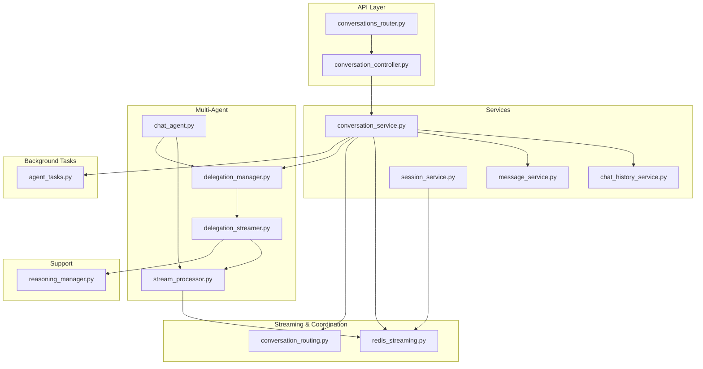
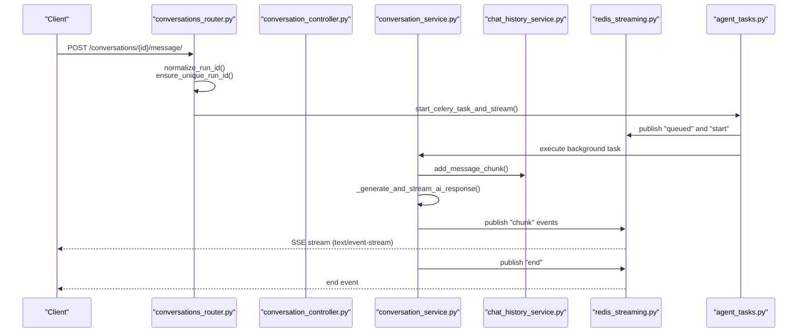
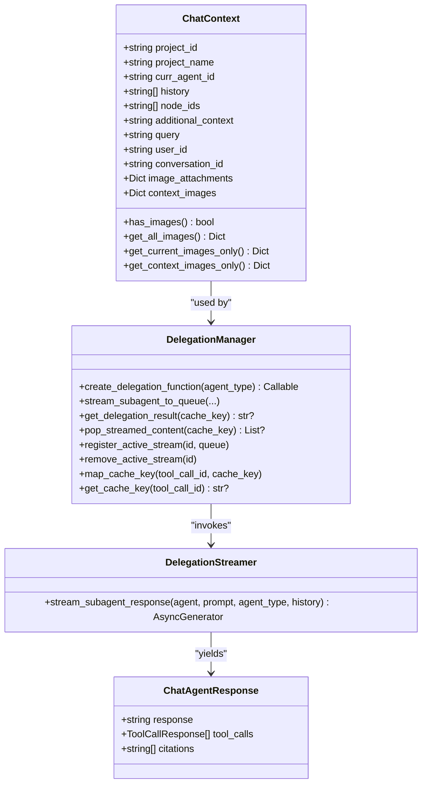
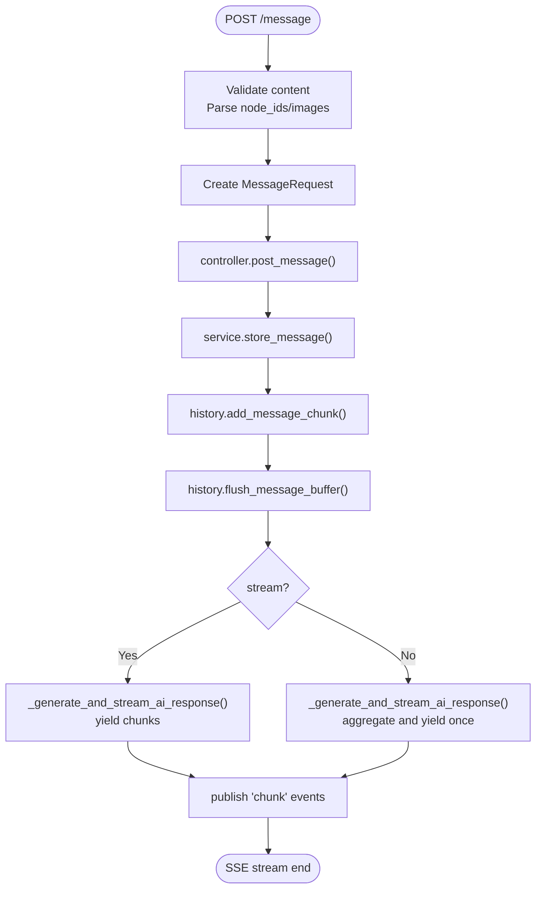
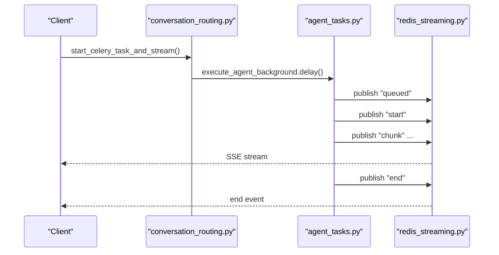
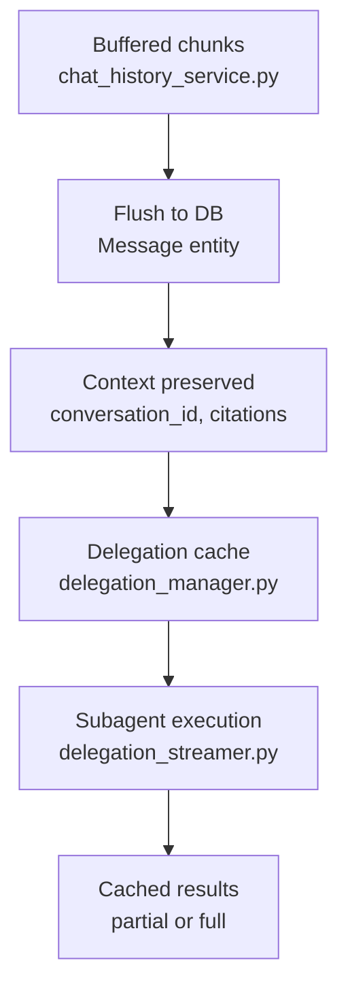
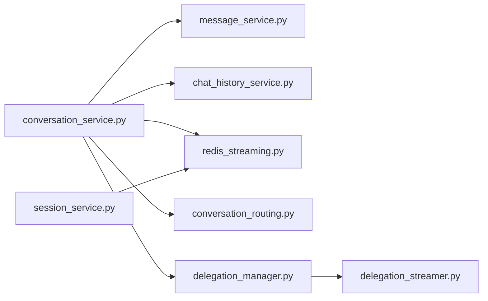
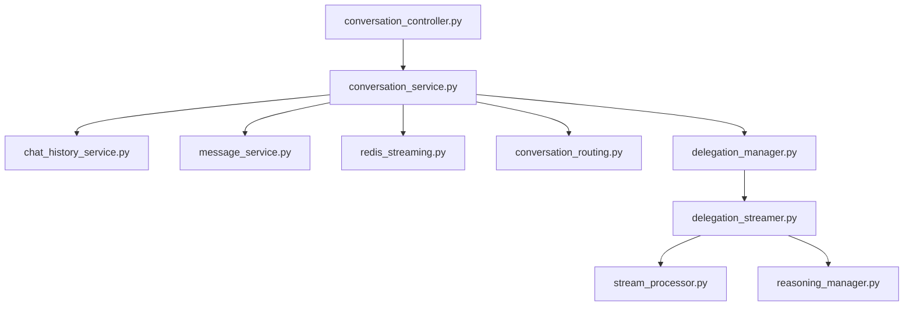

# Conversation Orchestration

<cite>
**Referenced Files in This Document**
- [conversations_router.py](file://app/modules/conversations/conversations_router.py)
- [conversation_controller.py](file://app/modules/conversations/conversation/conversation_controller.py)
- [conversation_service.py](file://app/modules/conversations/conversation/conversation_service.py)
- [message_service.py](file://app/modules/conversations/message/message_service.py)
- [chat_history_service.py](file://app/modules/intelligence/memory/chat_history_service.py)
- [redis_streaming.py](file://app/modules/conversations/utils/redis_streaming.py)
- [conversation_routing.py](file://app/modules/conversations/utils/conversation_routing.py)
- [session_service.py](file://app/modules/conversations/session/session_service.py)
- [chat_agent.py](file://app/modules/intelligence/agents/chat_agent.py)
- [stream_processor.py](file://app/modules/intelligence/agents/chat_agents/multi_agent/stream_processor.py)
- [delegation_manager.py](file://app/modules/intelligence/agents/chat_agents/multi_agent/delegation_manager.py)
- [delegation_streamer.py](file://app/modules/intelligence/agents/chat_agents/multi_agent/delegation_streamer.py)
- [agent_tasks.py](file://app/celery/tasks/agent_tasks.py)
- [reasoning_manager.py](file://app/modules/intelligence/tools/reasoning_manager.py)
</cite>

## Table of Contents
1. [Introduction](#introduction)
2. [Project Structure](#project-structure)
3. [Core Components](#core-components)
4. [Architecture Overview](#architecture-overview)
5. [Detailed Component Analysis](#detailed-component-analysis)
6. [Dependency Analysis](#dependency-analysis)
7. [Performance Considerations](#performance-considerations)
8. [Troubleshooting Guide](#troubleshooting-guide)
9. [Conclusion](#conclusion)
10. [Appendices](#appendices)

## Introduction
This document explains conversation orchestration in the multi-agent system, focusing on how ChatContext is managed, how conversation flow is controlled, and how messages are routed across agents. It covers streaming response patterns, conversation state management, and context preservation across agent interactions. It also documents configuration options for conversation parameters, streaming behavior, and context limits, and explains relationships with the conversation service, message service, and streaming utilities. Practical examples are drawn from the actual codebase to illustrate conversation initialization, context updates, and response aggregation.

## Project Structure
The conversation orchestration spans several modules:
- API layer: FastAPI routers and controllers for conversation lifecycle and message posting
- Services: ConversationService orchestrates message storage, AI generation, and streaming
- Memory/history: ChatHistoryService buffers and persists message chunks
- Streaming: Redis-backed streaming utilities for SSE and background task coordination
- Multi-agent: StreamProcessor, DelegationManager, and DelegationStreamer manage agent runs, delegation, and subagent streaming
- Celery: Background tasks execute conversation steps and publish Redis events

**Diagram sources**
- [conversations_router.py](file://app/modules/conversations/conversations_router.py#L160-L286)
- [conversation_controller.py](file://app/modules/conversations/conversation/conversation_controller.py#L33-L120)
- [conversation_service.py](file://app/modules/conversations/conversation/conversation_service.py#L73-L164)
- [chat_history_service.py](file://app/modules/intelligence/memory/chat_history_service.py#L23-L135)
- [redis_streaming.py](file://app/modules/conversations/utils/redis_streaming.py#L11-L62)
- [conversation_routing.py](file://app/modules/conversations/utils/conversation_routing.py#L107-L170)
- [session_service.py](file://app/modules/conversations/session/session_service.py#L15-L98)
- [chat_agent.py](file://app/modules/intelligence/agents/chat_agent.py#L54-L121)
- [stream_processor.py](file://app/modules/intelligence/agents/chat_agents/multi_agent/stream_processor.py#L39-L86)
- [delegation_manager.py](file://app/modules/intelligence/agents/chat_agents/multi_agent/delegation_manager.py#L25-L56)
- [delegation_streamer.py](file://app/modules/intelligence/agents/chat_agents/multi_agent/delegation_streamer.py#L179-L225)
- [agent_tasks.py](file://app/celery/tasks/agent_tasks.py#L88-L120)
- [reasoning_manager.py](file://app/modules/intelligence/tools/reasoning_manager.py#L74-L95)

**Section sources**
- [conversations_router.py](file://app/modules/conversations/conversations_router.py#L160-L286)
- [conversation_controller.py](file://app/modules/conversations/conversation/conversation_controller.py#L33-L120)
- [conversation_service.py](file://app/modules/conversations/conversation/conversation_service.py#L73-L164)

## Core Components
- ConversationController: Thin controller that delegates to ConversationService and exposes FastAPI endpoints for creating, messaging, regenerating, and stopping conversations.
- ConversationService: Orchestrates conversation lifecycle, access checks, message storage, AI generation, and streaming. It integrates providers, tools, prompts, agents, and media services.
- ChatHistoryService: Buffers incoming message chunks and flushes them to the database as complete messages, preserving citations and ordering.
- RedisStreamManager: Publishes and consumes Redis streams for SSE, manages task status, cancellation, and TTL.
- ConversationRouting utilities: Normalize/ensure unique run IDs, start Celery tasks, and stream Redis events to clients.
- SessionService: Queries active sessions and task statuses using Redis keys.
- Multi-agent stack: StreamProcessor, DelegationManager, and DelegationStreamer coordinate agent runs, delegation, tool calls, and subagent streaming with timeouts and error handling.
- Agent models: ChatContext defines conversation state, multimodal images, and context preservation; ChatAgentResponse carries streaming chunks, tool calls, and citations.

**Section sources**
- [conversation_controller.py](file://app/modules/conversations/conversation/conversation_controller.py#L33-L120)
- [conversation_service.py](file://app/modules/conversations/conversation/conversation_service.py#L73-L164)
- [chat_history_service.py](file://app/modules/intelligence/memory/chat_history_service.py#L23-L135)
- [redis_streaming.py](file://app/modules/conversations/utils/redis_streaming.py#L11-L62)
- [conversation_routing.py](file://app/modules/conversations/utils/conversation_routing.py#L23-L58)
- [session_service.py](file://app/modules/conversations/session/session_service.py#L15-L98)
- [chat_agent.py](file://app/modules/intelligence/agents/chat_agent.py#L54-L121)
- [stream_processor.py](file://app/modules/intelligence/agents/chat_agents/multi_agent/stream_processor.py#L39-L86)
- [delegation_manager.py](file://app/modules/intelligence/agents/chat_agents/multi_agent/delegation_manager.py#L25-L56)
- [delegation_streamer.py](file://app/modules/intelligence/agents/chat_agents/multi_agent/delegation_streamer.py#L179-L225)

## Architecture Overview
The system supports two primary flows:
- Real-time streaming: Client posts a message; server starts a Celery task, publishes “queued” and “start” events, streams incremental chunks via Redis to the client, and ends with an “end” event.
- Non-streaming: Client posts a message; server collects all Redis chunks and returns a single aggregated response.

**Diagram sources**
- [conversations_router.py](file://app/modules/conversations/conversations_router.py#L160-L286)
- [conversation_routing.py](file://app/modules/conversations/utils/conversation_routing.py#L107-L170)
- [conversation_service.py](file://app/modules/conversations/conversation/conversation_service.py#L544-L652)
- [chat_history_service.py](file://app/modules/intelligence/memory/chat_history_service.py#L68-L117)
- [redis_streaming.py](file://app/modules/conversations/utils/redis_streaming.py#L21-L62)
- [agent_tasks.py](file://app/celery/tasks/agent_tasks.py#L88-L120)

## Detailed Component Analysis

### ChatContext Handling and Conversation State
- ChatContext encapsulates conversation state: project context, current agent, history, node selections, query, user/conversation IDs, and multimodal images. It supports combining current and historical images for downstream agents.
- ConversationService stores human messages via ChatHistoryService, flushes buffered chunks, and triggers AI generation with optional streaming. It preserves conversation_id for cross-message state continuity.
- DelegationManager and DelegationStreamer isolate subagent execution while coordinating caching and streaming; they maintain task-specific caches keyed by task/context to avoid duplicate execution.

**Diagram sources**
- [chat_agent.py](file://app/modules/intelligence/agents/chat_agent.py#L54-L121)
- [delegation_manager.py](file://app/modules/intelligence/agents/chat_agents/multi_agent/delegation_manager.py#L25-L56)
- [delegation_streamer.py](file://app/modules/intelligence/agents/chat_agents/multi_agent/delegation_streamer.py#L179-L225)

**Section sources**
- [chat_agent.py](file://app/modules/intelligence/agents/chat_agent.py#L54-L121)
- [conversation_service.py](file://app/modules/conversations/conversation/conversation_service.py#L544-L652)
- [delegation_manager.py](file://app/modules/intelligence/agents/chat_agents/multi_agent/delegation_manager.py#L227-L350)

### Conversation Flow Control and Message Routing
- Router validates inputs, normalizes session IDs, ensures uniqueness, and starts Celery tasks for streaming or non-streaming modes.
- Controller delegates to ConversationService, which stores human messages, optionally links attachments, and triggers AI generation.
- For streaming, ConversationService yields ChatMessageResponse chunks; for non-streaming, it aggregates content and citations before returning a single response.
- DelegationManager coordinates subagent execution, caching results and streaming partial content to Redis for real-time updates.

**Diagram sources**
- [conversations_router.py](file://app/modules/conversations/conversations_router.py#L160-L286)
- [conversation_controller.py](file://app/modules/conversations/conversation/conversation_controller.py#L106-L120)
- [conversation_service.py](file://app/modules/conversations/conversation/conversation_service.py#L544-L652)
- [chat_history_service.py](file://app/modules/intelligence/memory/chat_history_service.py#L68-L117)
- [redis_streaming.py](file://app/modules/conversations/utils/redis_streaming.py#L21-L62)

**Section sources**
- [conversations_router.py](file://app/modules/conversations/conversations_router.py#L160-L286)
- [conversation_controller.py](file://app/modules/conversations/conversation/conversation_controller.py#L106-L120)
- [conversation_service.py](file://app/modules/conversations/conversation/conversation_service.py#L544-L652)

### Streaming Response Patterns and Redis Coordination
- RedisStreamManager publishes structured events (“chunk”, “queued”, “start”, “end”) with TTL and max length. Consumers read with xread and support cursor-based replay.
- ConversationRouting utilities start Celery tasks, publish “queued” events, and return StreamingResponse to clients. They also support non-streaming collection of Redis events.
- DelegationStreamer emits keepalive chunks and structured error messages to prevent upstream timeouts and to inform supervisors about subagent failures.

**Diagram sources**
- [conversation_routing.py](file://app/modules/conversations/utils/conversation_routing.py#L107-L170)
- [agent_tasks.py](file://app/celery/tasks/agent_tasks.py#L88-L120)
- [redis_streaming.py](file://app/modules/conversations/utils/redis_streaming.py#L21-L62)

**Section sources**
- [redis_streaming.py](file://app/modules/conversations/utils/redis_streaming.py#L64-L150)
- [conversation_routing.py](file://app/modules/conversations/utils/conversation_routing.py#L107-L170)
- [delegation_streamer.py](file://app/modules/intelligence/agents/chat_agents/multi_agent/delegation_streamer.py#L553-L756)

### Conversation State Management and Context Preservation
- ChatHistoryService buffers message chunks and flushes them to the database, preserving citations and ordering. This ensures context continuity across streaming.
- ConversationService tracks conversation metadata (title, agent IDs, project associations) and enforces access controls. It also generates conversation titles from the first human message.
- DelegationManager maintains delegation caches keyed by task/context to avoid duplicate subagent execution and to preserve partial results on timeouts.

**Diagram sources**
- [chat_history_service.py](file://app/modules/intelligence/memory/chat_history_service.py#L68-L135)
- [conversation_service.py](file://app/modules/conversations/conversation/conversation_service.py#L216-L282)
- [delegation_manager.py](file://app/modules/intelligence/agents/chat_agents/multi_agent/delegation_manager.py#L227-L350)
- [delegation_streamer.py](file://app/modules/intelligence/agents/chat_agents/multi_agent/delegation_streamer.py#L192-L333)

**Section sources**
- [chat_history_service.py](file://app/modules/intelligence/memory/chat_history_service.py#L68-L135)
- [conversation_service.py](file://app/modules/conversations/conversation/conversation_service.py#L216-L282)
- [delegation_manager.py](file://app/modules/intelligence/agents/chat_agents/multi_agent/delegation_manager.py#L227-L350)

### Relationship with Conversation Service, Message Service, and Streaming Utilities
- ConversationService depends on MessageService for creating message records and on ChatHistoryService for buffering. It integrates providers, tools, prompts, and agents to generate AI responses.
- RedisStreamManager and ConversationRouting utilities coordinate background Celery tasks and SSE delivery.
- SessionService inspects Redis keys to expose active sessions and task statuses to clients.

**Diagram sources**
- [conversation_service.py](file://app/modules/conversations/conversation/conversation_service.py#L73-L164)
- [message_service.py](file://app/modules/conversations/message/message_service.py#L31-L89)
- [chat_history_service.py](file://app/modules/intelligence/memory/chat_history_service.py#L23-L135)
- [redis_streaming.py](file://app/modules/conversations/utils/redis_streaming.py#L11-L62)
- [conversation_routing.py](file://app/modules/conversations/utils/conversation_routing.py#L107-L170)
- [session_service.py](file://app/modules/conversations/session/session_service.py#L15-L98)
- [delegation_manager.py](file://app/modules/intelligence/agents/chat_agents/multi_agent/delegation_manager.py#L25-L56)
- [delegation_streamer.py](file://app/modules/intelligence/agents/chat_agents/multi_agent/delegation_streamer.py#L179-L225)

**Section sources**
- [conversation_service.py](file://app/modules/conversations/conversation/conversation_service.py#L73-L164)
- [message_service.py](file://app/modules/conversations/message/message_service.py#L31-L89)
- [chat_history_service.py](file://app/modules/intelligence/memory/chat_history_service.py#L23-L135)
- [redis_streaming.py](file://app/modules/conversations/utils/redis_streaming.py#L11-L62)
- [conversation_routing.py](file://app/modules/conversations/utils/conversation_routing.py#L107-L170)
- [session_service.py](file://app/modules/conversations/session/session_service.py#L15-L98)
- [delegation_manager.py](file://app/modules/intelligence/agents/chat_agents/multi_agent/delegation_manager.py#L25-L56)
- [delegation_streamer.py](file://app/modules/intelligence/agents/chat_agents/multi_agent/delegation_streamer.py#L179-L225)

## Dependency Analysis
- Coupling: ConversationController depends on ConversationService; ConversationService depends on multiple services and managers. Multi-agent components depend on each other to coordinate streaming and delegation.
- Cohesion: Each module focuses on a single responsibility—routing, orchestration, history, streaming, or delegation—promoting maintainability.
- External dependencies: Redis for streaming and task coordination; Celery for background execution; SQLAlchemy for persistence.

**Diagram sources**
- [conversation_controller.py](file://app/modules/conversations/conversation/conversation_controller.py#L33-L120)
- [conversation_service.py](file://app/modules/conversations/conversation/conversation_service.py#L73-L164)
- [chat_history_service.py](file://app/modules/intelligence/memory/chat_history_service.py#L23-L135)
- [message_service.py](file://app/modules/conversations/message/message_service.py#L31-L89)
- [redis_streaming.py](file://app/modules/conversations/utils/redis_streaming.py#L11-L62)
- [conversation_routing.py](file://app/modules/conversations/utils/conversation_routing.py#L107-L170)
- [delegation_manager.py](file://app/modules/intelligence/agents/chat_agents/multi_agent/delegation_manager.py#L25-L56)
- [delegation_streamer.py](file://app/modules/intelligence/agents/chat_agents/multi_agent/delegation_streamer.py#L179-L225)
- [stream_processor.py](file://app/modules/intelligence/agents/chat_agents/multi_agent/stream_processor.py#L39-L86)
- [reasoning_manager.py](file://app/modules/intelligence/tools/reasoning_manager.py#L74-L95)

**Section sources**
- [conversation_controller.py](file://app/modules/conversations/conversation/conversation_controller.py#L33-L120)
- [conversation_service.py](file://app/modules/conversations/conversation/conversation_service.py#L73-L164)
- [delegation_manager.py](file://app/modules/intelligence/agents/chat_agents/multi_agent/delegation_manager.py#L25-L56)

## Performance Considerations
- Streaming timeouts: DelegationStreamer enforces strict timeouts (agent iteration, node, event, tool execution) to prevent stalls and ensure timely responses.
- Keepalive and progress logging: Regular keepalive chunks and progress logs prevent upstream timeouts and aid observability.
- Redis stream limits: TTL and max length prevent unbounded growth; consumers should use cursors for replay to avoid redundant processing.
- Buffered history writes: ChatHistoryService reduces DB round-trips by buffering and flushing chunks.
- Subagent caching: DelegationManager caches subagent results keyed by task/context to avoid duplicate execution and improve throughput.

[No sources needed since this section provides general guidance]

## Troubleshooting Guide
Common issues and mitigations:
- Context overflow: Ensure ChatContext node_ids and additional_context remain within reasonable bounds; consider truncation strategies in upstream components.
- Conversation state corruption: Verify that ChatHistoryService flushes only when content exists and that message_type matches sender_id constraints in MessageService.
- Streaming stalls: Confirm Redis connectivity and stream TTL; inspect task status via SessionService endpoints; ensure keepalive mechanisms are functioning.
- Background task failures: Use ConversationService.stop_generation to revoke tasks and clear sessions; check Redis “error” or “cancelled” end events.
- Parsing errors: StreamProcessor handles JSON parsing errors and continues; review logs for malformed tool calls in message history.

**Section sources**
- [chat_history_service.py](file://app/modules/intelligence/memory/chat_history_service.py#L68-L135)
- [message_service.py](file://app/modules/conversations/message/message_service.py#L31-L89)
- [redis_streaming.py](file://app/modules/conversations/utils/redis_streaming.py#L64-L150)
- [conversation_service.py](file://app/modules/conversations/conversation/conversation_service.py#L1419-L1436)
- [stream_processor.py](file://app/modules/intelligence/agents/chat_agents/multi_agent/stream_processor.py#L87-L127)
- [delegation_streamer.py](file://app/modules/intelligence/agents/chat_agents/multi_agent/delegation_streamer.py#L553-L756)

## Conclusion
The conversation orchestration system combines a robust streaming pipeline with multi-agent delegation and context preservation. ChatContext drives stateful interactions, while Redis-based streaming ensures responsive, observable communication. The design balances reliability (timeouts, keepalives, caching) with flexibility (background tasks, session resumption, and replay). Proper configuration of streaming parameters and context limits, along with careful handling of attachments and multimodal inputs, enables scalable and maintainable multi-agent conversations.

[No sources needed since this section summarizes without analyzing specific files]

## Appendices

### Configuration Options and Parameters
- Streaming behavior
  - stream: bool (default True) toggles streaming vs. non-streaming responses.
  - cursor: str enables replay from a specific Redis stream position.
  - session_id: str provides deterministic session IDs; prev_human_message_id seeds run IDs.
- Redis streaming
  - Stream TTL and max length are configurable via RedisStreamManager and ConfigProvider.
  - Task status keys and cancellation signals are stored with expirable TTLs.
- Context limits
  - DelegationManager caps project context length for subagents.
  - DelegationStreamer enforces generous but finite timeouts for agent runs, nodes, events, and tool execution.

**Section sources**
- [conversations_router.py](file://app/modules/conversations/conversations_router.py#L160-L286)
- [conversation_routing.py](file://app/modules/conversations/utils/conversation_routing.py#L23-L58)
- [redis_streaming.py](file://app/modules/conversations/utils/redis_streaming.py#L11-L62)
- [delegation_manager.py](file://app/modules/intelligence/agents/chat_agents/multi_agent/delegation_manager.py#L262-L275)
- [delegation_streamer.py](file://app/modules/intelligence/agents/chat_agents/multi_agent/delegation_streamer.py#L32-L42)

### Persistence, Replay, and Debugging Tools
- Persistence: Messages are persisted via ChatHistoryService and MessageService; conversation metadata is stored in ConversationService.
- Replay: Clients can resume streaming from a cursor; Redis stream consumption supports xrangexrevrange for replay scenarios.
- Debugging: SessionService endpoints expose active sessions and task statuses; reasoning content is tracked and saved via ReasoningManager.

**Section sources**
- [chat_history_service.py](file://app/modules/intelligence/memory/chat_history_service.py#L68-L135)
- [message_service.py](file://app/modules/conversations/message/message_service.py#L31-L89)
- [redis_streaming.py](file://app/modules/conversations/utils/redis_streaming.py#L64-L150)
- [session_service.py](file://app/modules/conversations/session/session_service.py#L15-L98)
- [reasoning_manager.py](file://app/modules/intelligence/tools/reasoning_manager.py#L74-L95)