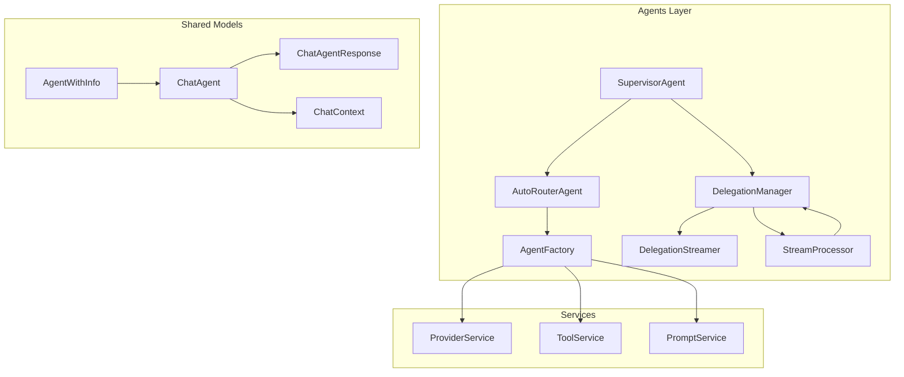
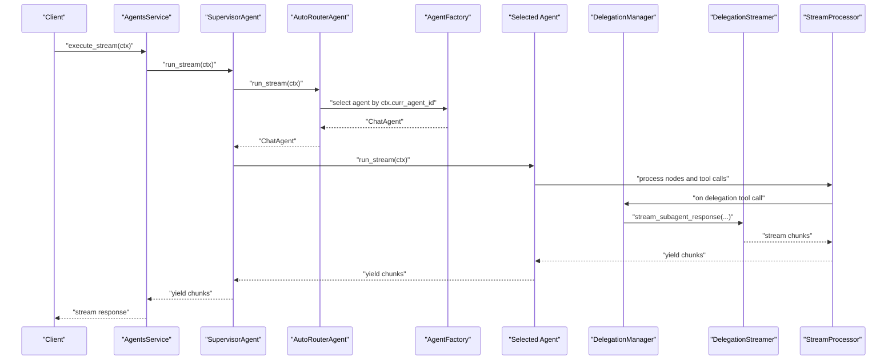
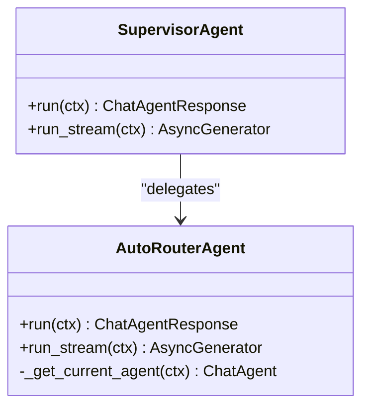
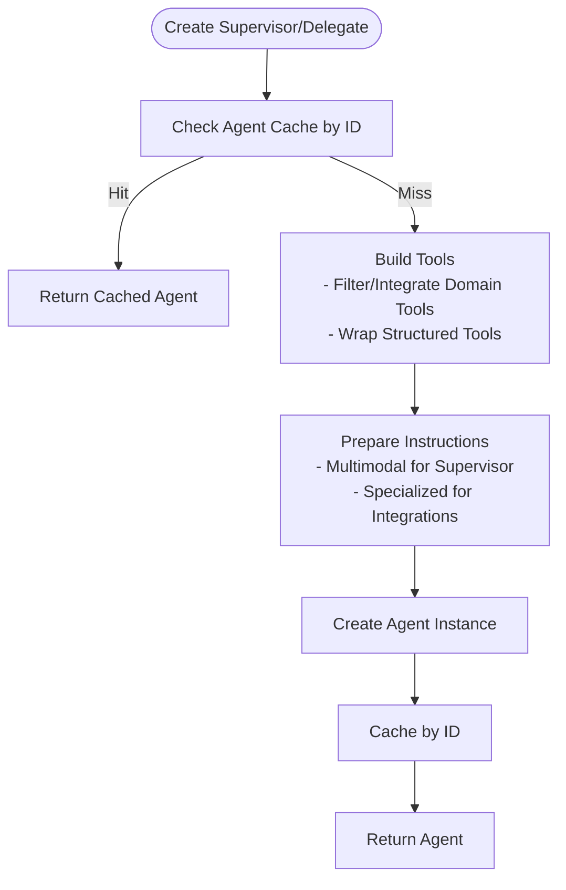
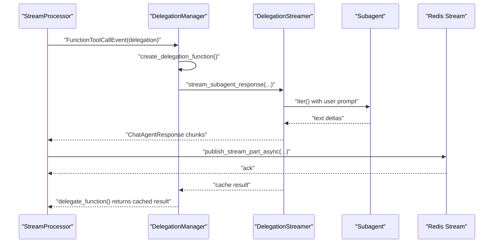
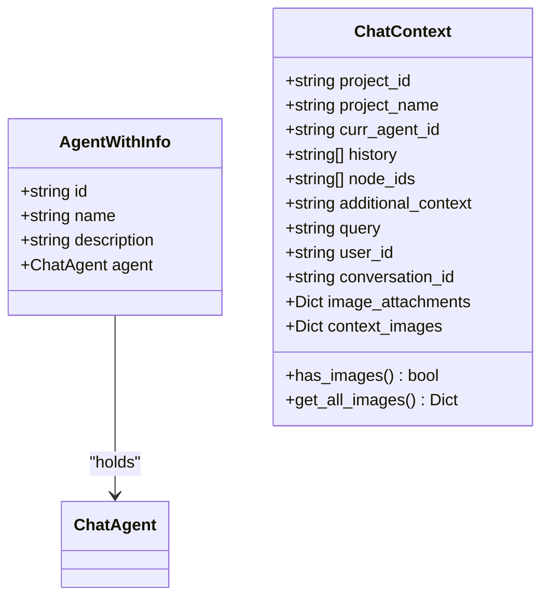
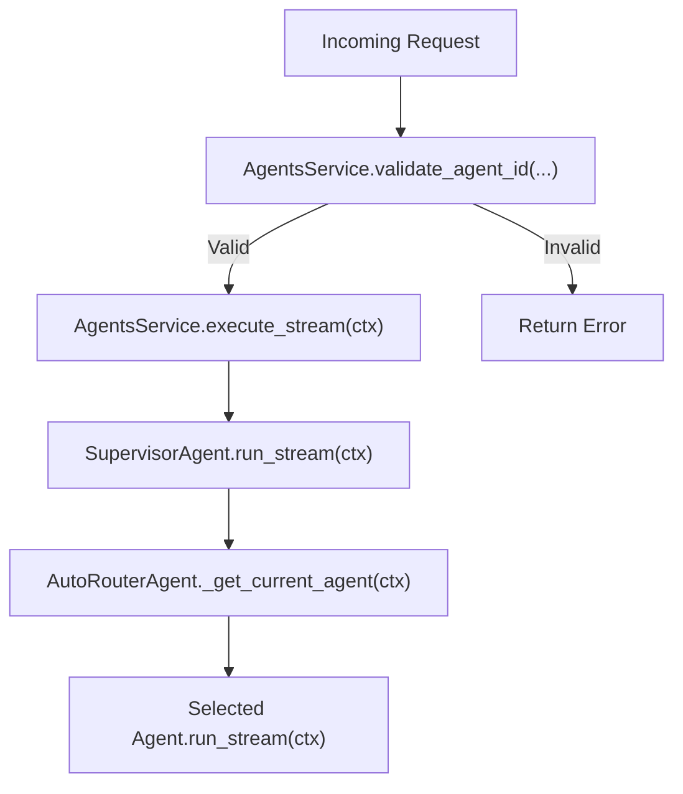
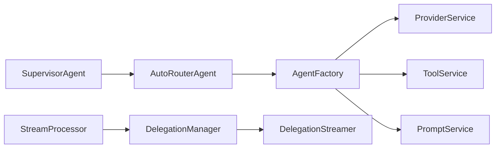
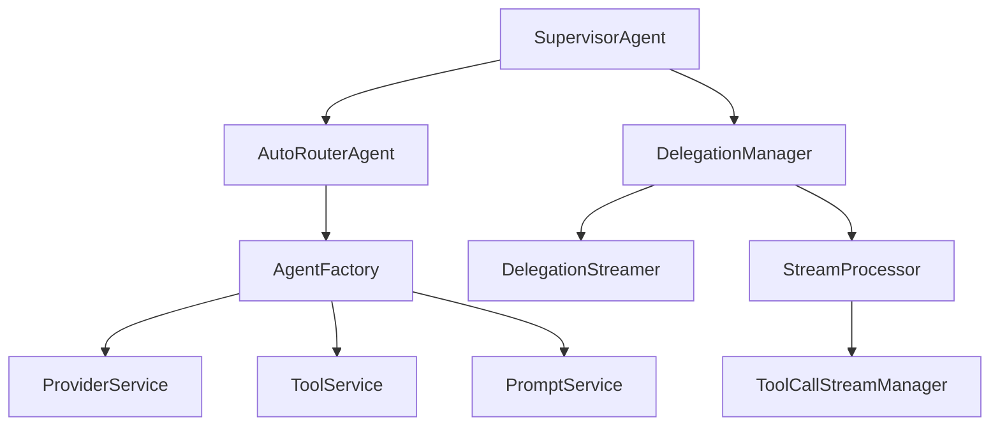

# Multi-Agent Architecture

<cite>
**Referenced Files in This Document**
- [supervisor_agent.py](file://app/modules/intelligence/agents/chat_agents/supervisor_agent.py)
- [auto_router_agent.py](file://app/modules/intelligence/agents/chat_agents/auto_router_agent.py)
- [agent_factory.py](file://app/modules/intelligence/agents/chat_agents/multi_agent/agent_factory.py)
- [delegation_manager.py](file://app/modules/intelligence/agents/chat_agents/multi_agent/delegation_manager.py)
- [delegation_streamer.py](file://app/modules/intelligence/agents/chat_agents/multi_agent/delegation_streamer.py)
- [stream_processor.py](file://app/modules/intelligence/agents/chat_agents/multi_agent/stream_processor.py)
- [context_utils.py](file://app/modules/intelligence/agents/chat_agents/multi_agent/utils/context_utils.py)
- [delegation_utils.py](file://app/modules/intelligence/agents/chat_agents/multi_agent/utils/delegation_utils.py)
- [tool_call_stream_manager.py](file://app/modules/intelligence/agents/chat_agents/multi_agent/utils/tool_call_stream_manager.py)
- [chat_agent.py](file://app/modules/intelligence/agents/chat_agent.py)
- [agents_service.py](file://app/modules/intelligence/agents/agents_service.py)
- [provider_service.py](file://app/modules/intelligence/provider/provider_service.py)
- [tool_service.py](file://app/modules/intelligence/tools/tool_service.py)
- [prompt_service.py](file://app/modules/intelligence/prompts/prompt_service.py)
</cite>

## Table of Contents
1. [Introduction](#introduction)
2. [Project Structure](#project-structure)
3. [Core Components](#core-components)
4. [Architecture Overview](#architecture-overview)
5. [Detailed Component Analysis](#detailed-component-analysis)
6. [Dependency Analysis](#dependency-analysis)
7. [Performance Considerations](#performance-considerations)
8. [Troubleshooting Guide](#troubleshooting-guide)
9. [Conclusion](#conclusion)

## Introduction
This document explains the multi-agent architecture used to orchestrate supervisors and specialized subagents. It covers how the supervisor agent routes conversations, how agents are created and cached, how conversations are streamed, and how subagents are delegated for isolated execution. It also documents the AgentWithInfo pattern, ChatContext handling, validation mechanisms, and the relationships with provider, tool, and prompt services. Practical examples are provided via file references and diagrams mapped to actual code.

## Project Structure
The multi-agent system lives under the intelligence agents package and integrates with provider, tool, and prompt services. Key modules include:
- Supervisor and router agents
- Factory for creating supervisor and delegate agents
- Delegation manager coordinating subagent execution and streaming
- Stream processor handling node iteration and tool call events
- Delegation streamer ensuring robust subagent runs with timeouts
- Utility modules for context, delegation, and tool call streaming
- Shared models for ChatContext, ChatAgentResponse, and AgentWithInfo

**Diagram sources**
- [supervisor_agent.py](file://app/modules/intelligence/agents/chat_agents/supervisor_agent.py#L9-L25)
- [auto_router_agent.py](file://app/modules/intelligence/agents/chat_agents/auto_router_agent.py#L13-L38)
- [agent_factory.py](file://app/modules/intelligence/agents/chat_agents/multi_agent/agent_factory.py#L29-L631)
- [delegation_manager.py](file://app/modules/intelligence/agents/chat_agents/multi_agent/delegation_manager.py#L25-L722)
- [delegation_streamer.py](file://app/modules/intelligence/agents/chat_agents/multi_agent/delegation_streamer.py#L179-L1050)
- [stream_processor.py](file://app/modules/intelligence/agents/chat_agents/multi_agent/stream_processor.py#L39-L800)
- [chat_agent.py](file://app/modules/intelligence/agents/chat_agent.py#L101-L121)
- [provider_service.py](file://app/modules/intelligence/provider/provider_service.py#L472-L800)
- [tool_service.py](file://app/modules/intelligence/tools/tool_service.py#L99-L263)
- [prompt_service.py](file://app/modules/intelligence/prompts/prompt_service.py#L59-L503)

**Section sources**
- [supervisor_agent.py](file://app/modules/intelligence/agents/chat_agents/supervisor_agent.py#L1-L25)
- [auto_router_agent.py](file://app/modules/intelligence/agents/chat_agents/auto_router_agent.py#L1-L38)
- [agent_factory.py](file://app/modules/intelligence/agents/chat_agents/multi_agent/agent_factory.py#L1-L705)
- [delegation_manager.py](file://app/modules/intelligence/agents/chat_agents/multi_agent/delegation_manager.py#L1-L722)
- [delegation_streamer.py](file://app/modules/intelligence/agents/chat_agents/multi_agent/delegation_streamer.py#L1-L1050)
- [stream_processor.py](file://app/modules/intelligence/agents/chat_agents/multi_agent/stream_processor.py#L1-L800)
- [chat_agent.py](file://app/modules/intelligence/agents/chat_agent.py#L1-L121)
- [provider_service.py](file://app/modules/intelligence/provider/provider_service.py#L1-L800)
- [tool_service.py](file://app/modules/intelligence/tools/tool_service.py#L1-L263)
- [prompt_service.py](file://app/modules/intelligence/prompts/prompt_service.py#L1-L503)

## Core Components
- SupervisorAgent: Thin wrapper around AutoRouterAgent that delegates to the current agent selected by ChatContext.
- AutoRouterAgent: Selects the current agent from a registry based on ChatContext and forwards run/run_stream calls.
- AgentFactory: Builds supervisor and delegate agents with tools, instructions, and caching; creates integration-specific subagents.
- DelegationManager: Manages delegation functions, subagent execution, result caching, and streaming queues.
- DelegationStreamer: Robust subagent runner with timeouts, keepalives, and structured error reporting.
- StreamProcessor: Iterates agent nodes, streams text deltas, handles tool call events, and coordinates delegation streams.
- ChatContext: Central conversation state container with project, history, multimodal attachments, and routing info.
- AgentWithInfo: Wrapper for agent instances with metadata (id, name, description).
- ProviderService, ToolService, PromptService: Integrations for model selection, tool availability, and prompt management.

**Section sources**
- [supervisor_agent.py](file://app/modules/intelligence/agents/chat_agents/supervisor_agent.py#L9-L25)
- [auto_router_agent.py](file://app/modules/intelligence/agents/chat_agents/auto_router_agent.py#L13-L38)
- [agent_factory.py](file://app/modules/intelligence/agents/chat_agents/multi_agent/agent_factory.py#L29-L631)
- [delegation_manager.py](file://app/modules/intelligence/agents/chat_agents/multi_agent/delegation_manager.py#L25-L722)
- [delegation_streamer.py](file://app/modules/intelligence/agents/chat_agents/multi_agent/delegation_streamer.py#L179-L1050)
- [stream_processor.py](file://app/modules/intelligence/agents/chat_agents/multi_agent/stream_processor.py#L39-L800)
- [chat_agent.py](file://app/modules/intelligence/agents/chat_agent.py#L54-L121)
- [provider_service.py](file://app/modules/intelligence/provider/provider_service.py#L472-L800)
- [tool_service.py](file://app/modules/intelligence/tools/tool_service.py#L99-L263)
- [prompt_service.py](file://app/modules/intelligence/prompts/prompt_service.py#L59-L503)

## Architecture Overview
The system orchestrates a supervisor agent that selects a specific agent based on ChatContext. The supervisor can delegate tasks to specialized subagents that execute in isolated contexts. Streaming is coordinated across the supervisor and subagents with timeouts, keepalives, and Redis-backed tool call streams.

**Diagram sources**
- [agents_service.py](file://app/modules/intelligence/agents/agents_service.py#L151-L156)
- [supervisor_agent.py](file://app/modules/intelligence/agents/chat_agents/supervisor_agent.py#L17-L25)
- [auto_router_agent.py](file://app/modules/intelligence/agents/chat_agents/auto_router_agent.py#L24-L38)
- [agent_factory.py](file://app/modules/intelligence/agents/chat_agents/multi_agent/agent_factory.py#L595-L631)
- [delegation_manager.py](file://app/modules/intelligence/agents/chat_agents/multi_agent/delegation_manager.py#L227-L679)
- [delegation_streamer.py](file://app/modules/intelligence/agents/chat_agents/multi_agent/delegation_streamer.py#L192-L333)
- [stream_processor.py](file://app/modules/intelligence/agents/chat_agents/multi_agent/stream_processor.py#L193-L800)

## Detailed Component Analysis

### Supervisor and Router
- SupervisorAgent wraps AutoRouterAgent and exposes run/run_stream, forwarding to the selected agent.
- AutoRouterAgent selects the agent from a registry keyed by ChatContext.curr_agent_id.

**Diagram sources**
- [supervisor_agent.py](file://app/modules/intelligence/agents/chat_agents/supervisor_agent.py#L9-L25)
- [auto_router_agent.py](file://app/modules/intelligence/agents/chat_agents/auto_router_agent.py#L13-L38)

**Section sources**
- [supervisor_agent.py](file://app/modules/intelligence/agents/chat_agents/supervisor_agent.py#L9-L25)
- [auto_router_agent.py](file://app/modules/intelligence/agents/chat_agents/auto_router_agent.py#L13-L38)

### Agent Factory and Agent Lifecycle
- AgentFactory builds:
  - Supervisor agent with delegation, todo, code changes, and requirement tools.
  - Delegate agents (generic THINK_EXECUTE and integration-specific: JIRA, GitHub, Confluence, Linear).
- Tools are filtered and wrapped; integration agents get domain-specific tools from ToolService or filtered from the shared tool list.
- Caching avoids stale contexts:
  - Delegate agents cached by (agent_type, conversation_id).
  - Supervisor agents cached by conversation_id.
- Multimodal instructions prepared from ChatContext images.

**Diagram sources**
- [agent_factory.py](file://app/modules/intelligence/agents/chat_agents/multi_agent/agent_factory.py#L595-L631)
- [agent_factory.py](file://app/modules/intelligence/agents/chat_agents/multi_agent/agent_factory.py#L553-L594)
- [agent_factory.py](file://app/modules/intelligence/agents/chat_agents/multi_agent/agent_factory.py#L119-L205)
- [context_utils.py](file://app/modules/intelligence/agents/chat_agents/multi_agent/utils/context_utils.py#L53-L56)

**Section sources**
- [agent_factory.py](file://app/modules/intelligence/agents/chat_agents/multi_agent/agent_factory.py#L29-L705)
- [context_utils.py](file://app/modules/intelligence/agents/chat_agents/multi_agent/utils/context_utils.py#L6-L56)

### Delegation Manager and Subagent Streaming
- DelegationManager:
  - Creates delegation functions that return cached results after subagent execution.
  - Streams subagent responses to queues and Redis streams.
  - Tracks active streams, caches results, and maps tool_call_id to cache_key.
- DelegationStreamer:
  - Runs subagents with strict timeouts and keepalives.
  - Emits structured error messages and partial results on timeouts.
- StreamProcessor:
  - Iterates agent nodes, streams text deltas, and handles tool call events.
  - On delegation tool calls, starts subagent execution and streams results back to the supervisor.

**Diagram sources**
- [stream_processor.py](file://app/modules/intelligence/agents/chat_agents/multi_agent/stream_processor.py#L428-L746)
- [delegation_manager.py](file://app/modules/intelligence/agents/chat_agents/multi_agent/delegation_manager.py#L227-L679)
- [delegation_streamer.py](file://app/modules/intelligence/agents/chat_agents/multi_agent/delegation_streamer.py#L192-L333)
- [tool_call_stream_manager.py](file://app/modules/intelligence/agents/chat_agents/multi_agent/utils/tool_call_stream_manager.py#L92-L221)

**Section sources**
- [delegation_manager.py](file://app/modules/intelligence/agents/chat_agents/multi_agent/delegation_manager.py#L25-L722)
- [delegation_streamer.py](file://app/modules/intelligence/agents/chat_agents/multi_agent/delegation_streamer.py#L179-L1050)
- [stream_processor.py](file://app/modules/intelligence/agents/chat_agents/multi_agent/stream_processor.py#L193-L800)
- [tool_call_stream_manager.py](file://app/modules/intelligence/agents/chat_agents/multi_agent/utils/tool_call_stream_manager.py#L15-L377)

### AgentWithInfo Pattern and ChatContext
- AgentWithInfo encapsulates a ChatAgent with id, name, and description for registry use.
- ChatContext carries:
  - Project and conversation identifiers
  - Message history and node_ids
  - Additional context and multimodal attachments
  - Methods to combine current and historical images

**Diagram sources**
- [chat_agent.py](file://app/modules/intelligence/agents/chat_agent.py#L115-L121)
- [chat_agent.py](file://app/modules/intelligence/agents/chat_agent.py#L54-L100)

**Section sources**
- [chat_agent.py](file://app/modules/intelligence/agents/chat_agent.py#L54-L121)

### Agent Validation and Routing
- AgentsService validates agent IDs and routes to the supervisor:
  - Validates system and custom agent IDs
  - Exposes execute and execute_stream entry points
- AutoRouterAgent selects the agent from the registry using ChatContext.curr_agent_id

**Diagram sources**
- [agents_service.py](file://app/modules/intelligence/agents/agents_service.py#L196-L203)
- [agents_service.py](file://app/modules/intelligence/agents/agents_service.py#L154-L156)
- [auto_router_agent.py](file://app/modules/intelligence/agents/chat_agents/auto_router_agent.py#L24-L26)

**Section sources**
- [agents_service.py](file://app/modules/intelligence/agents/agents_service.py#L47-L203)
- [auto_router_agent.py](file://app/modules/intelligence/agents/chat_agents/auto_router_agent.py#L13-L38)

### Relationship with Provider, Tool, and Prompt Services
- ProviderService supplies the LLM model for agents and includes robust retry/backoff logic.
- ToolService aggregates tools (code queries, integrations, todo, code changes, requirements) and exposes them by name.
- PromptService manages prompt lifecycles and can enhance prompts for better routing.

**Diagram sources**
- [agent_factory.py](file://app/modules/intelligence/agents/chat_agents/multi_agent/agent_factory.py#L29-L631)
- [provider_service.py](file://app/modules/intelligence/provider/provider_service.py#L472-L800)
- [tool_service.py](file://app/modules/intelligence/tools/tool_service.py#L99-L263)
- [prompt_service.py](file://app/modules/intelligence/prompts/prompt_service.py#L59-L503)
- [delegation_manager.py](file://app/modules/intelligence/agents/chat_agents/multi_agent/delegation_manager.py#L25-L722)
- [delegation_streamer.py](file://app/modules/intelligence/agents/chat_agents/multi_agent/delegation_streamer.py#L179-L1050)
- [stream_processor.py](file://app/modules/intelligence/agents/chat_agents/multi_agent/stream_processor.py#L39-L800)
- [supervisor_agent.py](file://app/modules/intelligence/agents/chat_agents/supervisor_agent.py#L9-L25)
- [auto_router_agent.py](file://app/modules/intelligence/agents/chat_agents/auto_router_agent.py#L13-L38)

**Section sources**
- [agent_factory.py](file://app/modules/intelligence/agents/chat_agents/multi_agent/agent_factory.py#L29-L631)
- [provider_service.py](file://app/modules/intelligence/provider/provider_service.py#L472-L800)
- [tool_service.py](file://app/modules/intelligence/tools/tool_service.py#L99-L263)
- [prompt_service.py](file://app/modules/intelligence/prompts/prompt_service.py#L59-L503)

## Dependency Analysis
- Coupling:
  - SupervisorAgent depends on AutoRouterAgent.
  - AutoRouterAgent depends on AgentFactory and ChatContext.
  - AgentFactory depends on ProviderService, ToolService, PromptService, and delegation utilities.
  - DelegationManager depends on DelegationStreamer, StreamProcessor, and ToolCallStreamManager.
  - StreamProcessor depends on DelegationManager and delegation utilities.
- Cohesion:
  - Each component has a focused responsibility: routing, factory, delegation, streaming, and context.
- External dependencies:
  - Redis for tool call streaming.
  - LLM providers via ProviderService.
  - Tools via ToolService.
  - Prompts via PromptService.

**Diagram sources**
- [supervisor_agent.py](file://app/modules/intelligence/agents/chat_agents/supervisor_agent.py#L9-L25)
- [auto_router_agent.py](file://app/modules/intelligence/agents/chat_agents/auto_router_agent.py#L13-L38)
- [agent_factory.py](file://app/modules/intelligence/agents/chat_agents/multi_agent/agent_factory.py#L29-L631)
- [delegation_manager.py](file://app/modules/intelligence/agents/chat_agents/multi_agent/delegation_manager.py#L25-L722)
- [delegation_streamer.py](file://app/modules/intelligence/agents/chat_agents/multi_agent/delegation_streamer.py#L179-L1050)
- [stream_processor.py](file://app/modules/intelligence/agents/chat_agents/multi_agent/stream_processor.py#L39-L800)
- [tool_call_stream_manager.py](file://app/modules/intelligence/agents/chat_agents/multi_agent/utils/tool_call_stream_manager.py#L15-L377)
- [provider_service.py](file://app/modules/intelligence/provider/provider_service.py#L472-L800)
- [tool_service.py](file://app/modules/intelligence/tools/tool_service.py#L99-L263)
- [prompt_service.py](file://app/modules/intelligence/prompts/prompt_service.py#L59-L503)

**Section sources**
- [supervisor_agent.py](file://app/modules/intelligence/agents/chat_agents/supervisor_agent.py#L9-L25)
- [auto_router_agent.py](file://app/modules/intelligence/agents/chat_agents/auto_router_agent.py#L13-L38)
- [agent_factory.py](file://app/modules/intelligence/agents/chat_agents/multi_agent/agent_factory.py#L29-L631)
- [delegation_manager.py](file://app/modules/intelligence/agents/chat_agents/multi_agent/delegation_manager.py#L25-L722)
- [delegation_streamer.py](file://app/modules/intelligence/agents/chat_agents/multi_agent/delegation_streamer.py#L179-L1050)
- [stream_processor.py](file://app/modules/intelligence/agents/chat_agents/multi_agent/stream_processor.py#L39-L800)
- [tool_call_stream_manager.py](file://app/modules/intelligence/agents/chat_agents/multi_agent/utils/tool_call_stream_manager.py#L15-L377)
- [provider_service.py](file://app/modules/intelligence/provider/provider_service.py#L472-L800)
- [tool_service.py](file://app/modules/intelligence/tools/tool_service.py#L99-L263)
- [prompt_service.py](file://app/modules/intelligence/prompts/prompt_service.py#L59-L503)

## Performance Considerations
- Streaming timeouts and keepalives prevent deadlocks:
  - Subagent overall timeout, node timeout, event timeout, and tool execution timeout.
  - Keepalive messages maintain liveness during long operations.
- Caching:
  - Supervisor and delegate agents cached by conversation_id and (agent_type, conversation_id) respectively.
  - Delegation results cached by deterministic cache key to avoid duplicate execution.
- Resource management:
  - Async Redis publishing avoids blocking the event loop.
  - Queues and tasks are tracked and cleaned up to prevent leaks.
- Backoff and retries:
  - ProviderService includes robust retry/backoff for rate limits and overloads.

[No sources needed since this section provides general guidance]

## Troubleshooting Guide
Common issues and mitigations:
- Agent conflicts:
  - Ensure ChatContext.curr_agent_id matches a registered agent id.
  - Validate agent ids via AgentsService.validate_agent_id.
- Stuck subagent execution:
  - DelegationStreamer enforces timeouts and emits keepalives; partial results are returned on timeouts.
- Streaming gaps:
  - ToolCallStreamManager publishes stream parts and end events; consumers can reconnect using cursors.
- Tool call mismatches:
  - StreamProcessor maps tool_call_id to cache_key and drains remaining chunks when delegation results arrive.
- Error propagation:
  - DelegationStreamer formats structured error messages for supervisors; StreamProcessor converts parsing errors into user-friendly messages.

**Section sources**
- [agents_service.py](file://app/modules/intelligence/agents/agents_service.py#L196-L203)
- [delegation_streamer.py](file://app/modules/intelligence/agents/chat_agents/multi_agent/delegation_streamer.py#L242-L333)
- [tool_call_stream_manager.py](file://app/modules/intelligence/agents/chat_agents/multi_agent/utils/tool_call_stream_manager.py#L222-L377)
- [stream_processor.py](file://app/modules/intelligence/agents/chat_agents/multi_agent/stream_processor.py#L87-L128)
- [delegation_manager.py](file://app/modules/intelligence/agents/chat_agents/multi_agent/delegation_manager.py#L574-L679)

## Conclusion
The multi-agent architecture centers on a supervisor that routes to specialized agents, with a robust delegation pipeline that executes subagents in isolated contexts, streams results in real time, and handles errors gracefully. The AgentWithInfo pattern and ChatContext provide a clean contract for agent selection and conversation state. Integration with ProviderService, ToolService, and PromptService enables flexible, extensible agent behavior across domains.