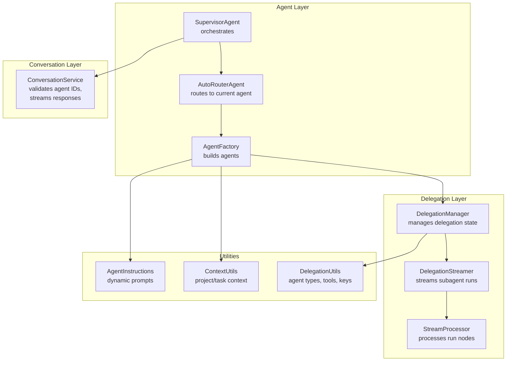
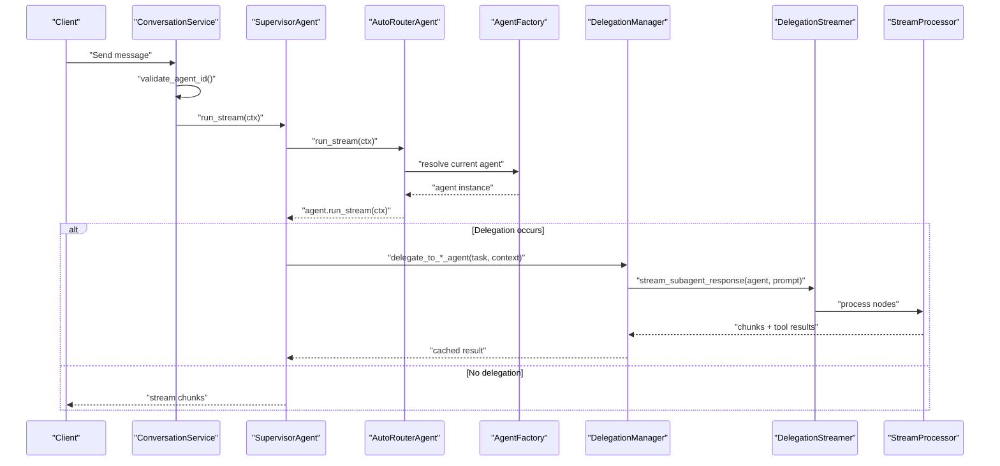
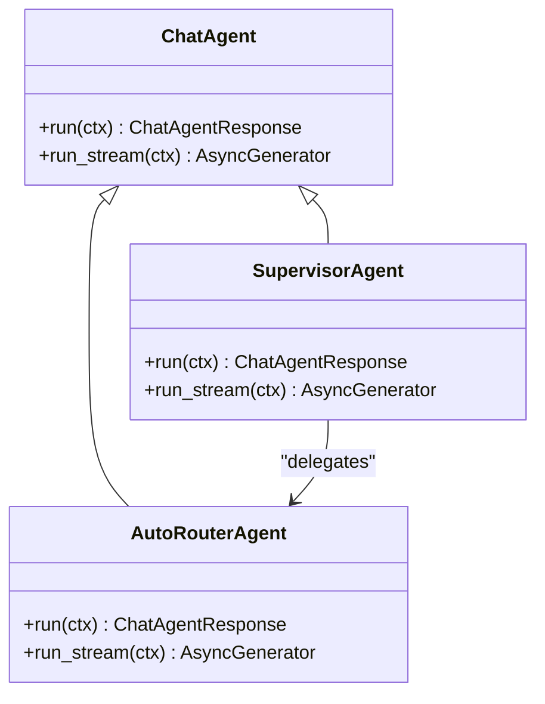
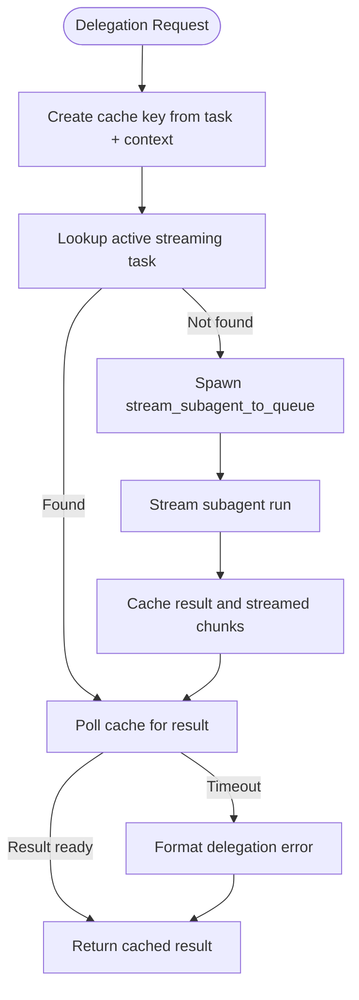
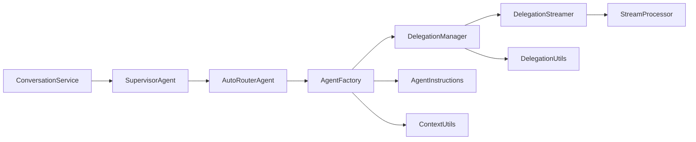

# Supervisor Agent

<cite>
**Referenced Files in This Document**
- [supervisor_agent.py](file://app/modules/intelligence/agents/chat_agents/supervisor_agent.py)
- [auto_router_agent.py](file://app/modules/intelligence/agents/chat_agents/auto_router_agent.py)
- [chat_agent.py](file://app/modules/intelligence/agents/chat_agent.py)
- [agent_factory.py](file://app/modules/intelligence/agents/chat_agents/multi_agent/agent_factory.py)
- [delegation_manager.py](file://app/modules/intelligence/agents/chat_agents/multi_agent/delegation_manager.py)
- [delegation_streamer.py](file://app/modules/intelligence/agents/chat_agents/multi_agent/delegation_streamer.py)
- [stream_processor.py](file://app/modules/intelligence/agents/chat_agents/multi_agent/stream_processor.py)
- [delegation_utils.py](file://app/modules/intelligence/agents/chat_agents/multi_agent/utils/delegation_utils.py)
- [context_utils.py](file://app/modules/intelligence/agents/chat_agents/multi_agent/utils/context_utils.py)
- [agent_instructions.py](file://app/modules/intelligence/agents/chat_agents/multi_agent/agent_instructions.py)
- [conversation_service.py](file://app/modules/conversations/conversation/conversation_service.py)
</cite>

## Table of Contents
1. [Introduction](#introduction)
2. [Project Structure](#project-structure)
3. [Core Components](#core-components)
4. [Architecture Overview](#architecture-overview)
5. [Detailed Component Analysis](#detailed-component-analysis)
6. [Dependency Analysis](#dependency-analysis)
7. [Performance Considerations](#performance-considerations)
8. [Troubleshooting Guide](#troubleshooting-guide)
9. [Conclusion](#conclusion)

## Introduction
The supervisor agent is the central coordinator in the multi-agent system. It orchestrates conversation flow, selects and delegates tasks to specialized subagents, and synthesizes results into coherent responses. This document explains how the supervisor agent validates agent IDs, manages agent lifecycles, controls conversation routing, and coordinates streaming responses. It also covers configuration options, error handling, and performance optimization strategies.

## Project Structure
The supervisor agent integrates with several modules:
- Routing and lifecycle: AutoRouterAgent and AgentFactory
- Delegation and streaming: DelegationManager, DelegationStreamer, StreamProcessor
- Utilities: DelegationUtils, ContextUtils, AgentInstructions
- Conversation orchestration: ConversationService

**Diagram sources**
- [supervisor_agent.py](file://app/modules/intelligence/agents/chat_agents/supervisor_agent.py#L1-L25)
- [auto_router_agent.py](file://app/modules/intelligence/agents/chat_agents/auto_router_agent.py#L1-L38)
- [agent_factory.py](file://app/modules/intelligence/agents/chat_agents/multi_agent/agent_factory.py#L1-L705)
- [delegation_manager.py](file://app/modules/intelligence/agents/chat_agents/multi_agent/delegation_manager.py#L1-L722)
- [delegation_streamer.py](file://app/modules/intelligence/agents/chat_agents/multi_agent/delegation_streamer.py#L1-L1050)
- [stream_processor.py](file://app/modules/intelligence/agents/chat_agents/multi_agent/stream_processor.py#L1-L800)
- [delegation_utils.py](file://app/modules/intelligence/agents/chat_agents/multi_agent/utils/delegation_utils.py#L1-L244)
- [context_utils.py](file://app/modules/intelligence/agents/chat_agents/multi_agent/utils/context_utils.py#L1-L56)
- [agent_instructions.py](file://app/modules/intelligence/agents/chat_agents/multi_agent/agent_instructions.py#L1-L460)
- [conversation_service.py](file://app/modules/conversations/conversation/conversation_service.py#L1-L800)

**Section sources**
- [supervisor_agent.py](file://app/modules/intelligence/agents/chat_agents/supervisor_agent.py#L1-L25)
- [auto_router_agent.py](file://app/modules/intelligence/agents/chat_agents/auto_router_agent.py#L1-L38)
- [agent_factory.py](file://app/modules/intelligence/agents/chat_agents/multi_agent/agent_factory.py#L1-L705)
- [delegation_manager.py](file://app/modules/intelligence/agents/chat_agents/multi_agent/delegation_manager.py#L1-L722)
- [delegation_streamer.py](file://app/modules/intelligence/agents/chat_agents/multi_agent/delegation_streamer.py#L1-L1050)
- [stream_processor.py](file://app/modules/intelligence/agents/chat_agents/multi_agent/stream_processor.py#L1-L800)
- [delegation_utils.py](file://app/modules/intelligence/agents/chat_agents/multi_agent/utils/delegation_utils.py#L1-L244)
- [context_utils.py](file://app/modules/intelligence/agents/chat_agents/multi_agent/utils/context_utils.py#L1-L56)
- [agent_instructions.py](file://app/modules/intelligence/agents/chat_agents/multi_agent/agent_instructions.py#L1-L460)
- [conversation_service.py](file://app/modules/conversations/conversation/conversation_service.py#L1-L800)

## Core Components
- SupervisorAgent: Thin wrapper around AutoRouterAgent, exposing run() and run_stream().
- AutoRouterAgent: Selects the current agent from the context and delegates execution.
- AgentFactory: Builds supervisor and subagents with tools, instructions, and caching.
- DelegationManager: Creates delegation functions, streams subagent responses, and caches results.
- DelegationStreamer: Robust streaming of subagent runs with timeouts and structured error reporting.
- StreamProcessor: Processes agent run nodes, handles tool calls/results, and streams real-time updates.
- Utilities: DelegationUtils (agent types, tool detection, caching), ContextUtils (project/task context), AgentInstructions (dynamic prompts).
- ConversationService: Validates agent IDs, orchestrates conversation lifecycle, and streams responses.

**Section sources**
- [supervisor_agent.py](file://app/modules/intelligence/agents/chat_agents/supervisor_agent.py#L1-L25)
- [auto_router_agent.py](file://app/modules/intelligence/agents/chat_agents/auto_router_agent.py#L1-L38)
- [agent_factory.py](file://app/modules/intelligence/agents/chat_agents/multi_agent/agent_factory.py#L1-L705)
- [delegation_manager.py](file://app/modules/intelligence/agents/chat_agents/multi_agent/delegation_manager.py#L1-L722)
- [delegation_streamer.py](file://app/modules/intelligence/agents/chat_agents/multi_agent/delegation_streamer.py#L1-L1050)
- [stream_processor.py](file://app/modules/intelligence/agents/chat_agents/multi_agent/stream_processor.py#L1-L800)
- [delegation_utils.py](file://app/modules/intelligence/agents/chat_agents/multi_agent/utils/delegation_utils.py#L1-L244)
- [context_utils.py](file://app/modules/intelligence/agents/chat_agents/multi_agent/utils/context_utils.py#L1-L56)
- [agent_instructions.py](file://app/modules/intelligence/agents/chat_agents/multi_agent/agent_instructions.py#L1-L460)
- [conversation_service.py](file://app/modules/conversations/conversation/conversation_service.py#L1-L800)

## Architecture Overview
The supervisor agent’s runtime flow:
1. ConversationService validates agent IDs and prepares ChatContext.
2. SupervisorAgent delegates to AutoRouterAgent, which resolves the current agent from context.
3. AgentFactory constructs or retrieves agents with tools and instructions.
4. DelegationManager creates delegation functions and streams subagent responses.
5. DelegationStreamer runs subagents with timeouts and structured error handling.
6. StreamProcessor iterates run nodes, yields text deltas, tool calls, and results.
7. ConversationService streams responses back to clients.

**Diagram sources**
- [conversation_service.py](file://app/modules/conversations/conversation/conversation_service.py#L223-L228)
- [supervisor_agent.py](file://app/modules/intelligence/agents/chat_agents/supervisor_agent.py#L17-L24)
- [auto_router_agent.py](file://app/modules/intelligence/agents/chat_agents/auto_router_agent.py#L24-L37)
- [agent_factory.py](file://app/modules/intelligence/agents/chat_agents/multi_agent/agent_factory.py#L595-L630)
- [delegation_manager.py](file://app/modules/intelligence/agents/chat_agents/multi_agent/delegation_manager.py#L57-L225)
- [delegation_streamer.py](file://app/modules/intelligence/agents/chat_agents/multi_agent/delegation_streamer.py#L192-L332)
- [stream_processor.py](file://app/modules/intelligence/agents/chat_agents/multi_agent/stream_processor.py#L193-L303)

## Detailed Component Analysis

### SupervisorAgent and AutoRouterAgent
- SupervisorAgent wraps AutoRouterAgent and exposes run() and run_stream().
- AutoRouterAgent selects the current agent from ChatContext and delegates execution.

**Diagram sources**
- [supervisor_agent.py](file://app/modules/intelligence/agents/chat_agents/supervisor_agent.py#L9-L25)
- [auto_router_agent.py](file://app/modules/intelligence/agents/chat_agents/auto_router_agent.py#L13-L38)
- [chat_agent.py](file://app/modules/intelligence/agents/chat_agent.py#L101-L121)

**Section sources**
- [supervisor_agent.py](file://app/modules/intelligence/agents/chat_agents/supervisor_agent.py#L1-L25)
- [auto_router_agent.py](file://app/modules/intelligence/agents/chat_agents/auto_router_agent.py#L1-L38)
- [chat_agent.py](file://app/modules/intelligence/agents/chat_agent.py#L1-L121)

### AgentFactory: Agent Selection and Lifecycle
- Creates supervisor and subagents with tools, instructions, and MCP servers.
- Caches agents by conversation_id to avoid stale context.
- Builds tools for supervisors (delegation, todo, code changes, requirements) and subagents (generic or integration-specific).
- Prepares multimodal and task-specific instructions.

Key behaviors:
- Supervisor caching by conversation_id.
- Subagent caching by (agent_type, conversation_id).
- Integration agents receive domain-specific tools and instructions.
- Delegation tools are dynamically generated with rich descriptions.

**Section sources**
- [agent_factory.py](file://app/modules/intelligence/agents/chat_agents/multi_agent/agent_factory.py#L29-L705)
- [agent_instructions.py](file://app/modules/intelligence/agents/chat_agents/multi_agent/agent_instructions.py#L194-L428)
- [context_utils.py](file://app/modules/intelligence/agents/chat_agents/multi_agent/utils/context_utils.py#L53-L56)

### DelegationManager: Delegation Functions and Streaming
- Creates delegation functions that return cached subagent results after streaming completes.
- Streams subagent responses to queues and Redis, with timeouts and error handling.
- Manages active streams, result caching, and cache key mapping.
- Provides structured error responses for delegation failures.

**Diagram sources**
- [delegation_manager.py](file://app/modules/intelligence/agents/chat_agents/multi_agent/delegation_manager.py#L57-L225)
- [delegation_manager.py](file://app/modules/intelligence/agents/chat_agents/multi_agent/delegation_manager.py#L227-L678)
- [delegation_utils.py](file://app/modules/intelligence/agents/chat_agents/multi_agent/utils/delegation_utils.py#L240-L244)

**Section sources**
- [delegation_manager.py](file://app/modules/intelligence/agents/chat_agents/multi_agent/delegation_manager.py#L1-L722)
- [delegation_utils.py](file://app/modules/intelligence/agents/chat_agents/multi_agent/utils/delegation_utils.py#L1-L244)

### DelegationStreamer: Robust Subagent Streaming
- Iterates agent runs with strict timeouts (agent, node, event, tool).
- Emits keepalive messages to prevent upstream timeouts.
- Converts structured errors into supervisor-friendly messages.
- Handles cleanup with timeouts to avoid deadlocks.

**Section sources**
- [delegation_streamer.py](file://app/modules/intelligence/agents/chat_agents/multi_agent/delegation_streamer.py#L179-L519)

### StreamProcessor: Run Node Processing and Real-Time Streaming
- Iterates agent run nodes, yields text deltas, tool calls, and tool results.
- Handles delegation tool calls by starting subagent streams and forwarding chunks.
- Normalizes delegation results to ensure completeness.
- Manages queue consumers and Redis stream updates for tool call streaming.

**Section sources**
- [stream_processor.py](file://app/modules/intelligence/agents/chat_agents/multi_agent/stream_processor.py#L193-L800)

### ConversationService: Validation, Routing, and Streaming
- Validates agent IDs before creating conversations.
- Streams responses from agents and handles multimodal attachments.
- Orchestrates conversation lifecycle and integrates with media services.

**Section sources**
- [conversation_service.py](file://app/modules/conversations/conversation/conversation_service.py#L223-L228)
- [conversation_service.py](file://app/modules/conversations/conversation/conversation_service.py#L544-L652)

## Dependency Analysis
- SupervisorAgent depends on AutoRouterAgent for agent resolution.
- AutoRouterAgent depends on AgentFactory for agent construction.
- DelegationManager depends on DelegationStreamer and StreamProcessor for subagent orchestration.
- StreamProcessor depends on DelegationManager for delegation state and Redis stream updates.
- AgentFactory depends on AgentInstructions, ContextUtils, and DelegationUtils for prompts and tool building.
- ConversationService validates agent IDs and streams responses.

**Diagram sources**
- [conversation_service.py](file://app/modules/conversations/conversation/conversation_service.py#L223-L228)
- [supervisor_agent.py](file://app/modules/intelligence/agents/chat_agents/supervisor_agent.py#L1-L25)
- [auto_router_agent.py](file://app/modules/intelligence/agents/chat_agents/auto_router_agent.py#L1-L38)
- [agent_factory.py](file://app/modules/intelligence/agents/chat_agents/multi_agent/agent_factory.py#L1-L705)
- [delegation_manager.py](file://app/modules/intelligence/agents/chat_agents/multi_agent/delegation_manager.py#L1-L722)
- [delegation_streamer.py](file://app/modules/intelligence/agents/chat_agents/multi_agent/delegation_streamer.py#L1-L1050)
- [stream_processor.py](file://app/modules/intelligence/agents/chat_agents/multi_agent/stream_processor.py#L1-L800)
- [agent_instructions.py](file://app/modules/intelligence/agents/chat_agents/multi_agent/agent_instructions.py#L1-L460)
- [context_utils.py](file://app/modules/intelligence/agents/chat_agents/multi_agent/utils/context_utils.py#L1-L56)
- [delegation_utils.py](file://app/modules/intelligence/agents/chat_agents/multi_agent/utils/delegation_utils.py#L1-L244)

**Section sources**
- [conversation_service.py](file://app/modules/conversations/conversation/conversation_service.py#L1-L800)
- [supervisor_agent.py](file://app/modules/intelligence/agents/chat_agents/supervisor_agent.py#L1-L25)
- [auto_router_agent.py](file://app/modules/intelligence/agents/chat_agents/auto_router_agent.py#L1-L38)
- [agent_factory.py](file://app/modules/intelligence/agents/chat_agents/multi_agent/agent_factory.py#L1-L705)
- [delegation_manager.py](file://app/modules/intelligence/agents/chat_agents/multi_agent/delegation_manager.py#L1-L722)
- [delegation_streamer.py](file://app/modules/intelligence/agents/chat_agents/multi_agent/delegation_streamer.py#L1-L1050)
- [stream_processor.py](file://app/modules/intelligence/agents/chat_agents/multi_agent/stream_processor.py#L1-L800)
- [agent_instructions.py](file://app/modules/intelligence/agents/chat_agents/multi_agent/agent_instructions.py#L1-L460)
- [context_utils.py](file://app/modules/intelligence/agents/chat_agents/multi_agent/utils/context_utils.py#L1-L56)
- [delegation_utils.py](file://app/modules/intelligence/agents/chat_agents/multi_agent/utils/delegation_utils.py#L1-L244)

## Performance Considerations
- Caching: AgentFactory caches supervisor and subagents by conversation_id and (agent_type, conversation_id) to avoid repeated construction and stale context.
- Streaming timeouts: DelegationStreamer enforces strict timeouts to prevent stalls; StreamProcessor drains queues and cleans up tasks promptly.
- Keepalive and heartbeats: DelegationStreamer emits keepalive messages to maintain liveness during long operations.
- Queue management: StreamProcessor consumes delegation queues in the background to ensure real-time streaming without blocking the main loop.
- Token efficiency: Supervisor emphasizes concise text summaries to minimize conversation history growth; subagents handle heavy tool usage in isolated contexts.

[No sources needed since this section provides general guidance]

## Troubleshooting Guide
Common issues and resolutions:
- Agent conflicts and stale context
  - Symptom: Unexpected behavior or incorrect agent selection.
  - Cause: Reuse of cached agents across conversations.
  - Resolution: Ensure caching keys include conversation_id; verify AgentFactory cache keys.

- Delegation not starting or hanging
  - Symptom: Supervisor waits indefinitely for delegation result.
  - Cause: Missing or mismatched cache key; subagent stream not started.
  - Resolution: Confirm delegation tool call triggers stream_subagent_to_queue; verify cache key mapping and active task tracking.

- Streaming errors and JSON parse issues
  - Symptom: Parsing errors or malformed tool calls.
  - Cause: Truncated or incomplete tool call history.
  - Resolution: StreamProcessor handles these errors and continues; inspect logs for detailed context.

- Subagent timeouts and partial results
  - Symptom: Partial output or timeout messages.
  - Cause: Long-running tool calls or node iteration timeouts.
  - Resolution: DelegationStreamer returns structured timeout messages; supervisor can retry with refined instructions.

- Conversation state management
  - Symptom: Incorrect agent routing or invalid agent ID.
  - Cause: Misconfigured ChatContext or invalid agent IDs.
  - Resolution: ConversationService validates agent IDs; ensure ChatContext.curr_agent_id is correct.

**Section sources**
- [delegation_manager.py](file://app/modules/intelligence/agents/chat_agents/multi_agent/delegation_manager.py#L114-L225)
- [delegation_streamer.py](file://app/modules/intelligence/agents/chat_agents/multi_agent/delegation_streamer.py#L242-L332)
- [stream_processor.py](file://app/modules/intelligence/agents/chat_agents/multi_agent/stream_processor.py#L87-L128)
- [conversation_service.py](file://app/modules/conversations/conversation/conversation_service.py#L223-L228)

## Conclusion
The supervisor agent coordinates a sophisticated multi-agent system by validating agent IDs, selecting and caching agents, delegating tasks to specialized subagents, and streaming results in real time. Robust timeout handling, structured error reporting, and careful context management ensure reliability and performance. By leveraging AgentFactory, DelegationManager, DelegationStreamer, and StreamProcessor, the supervisor maintains clean conversation history, efficient token usage, and scalable delegation patterns.