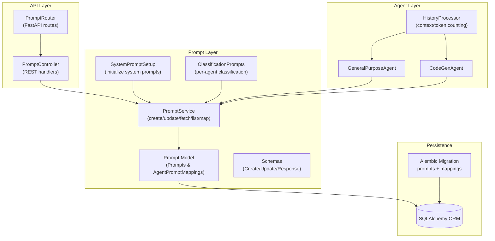
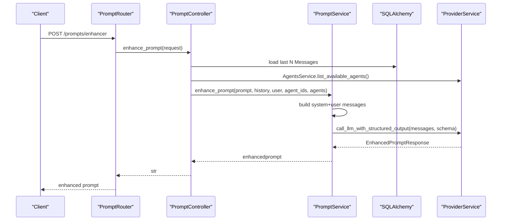
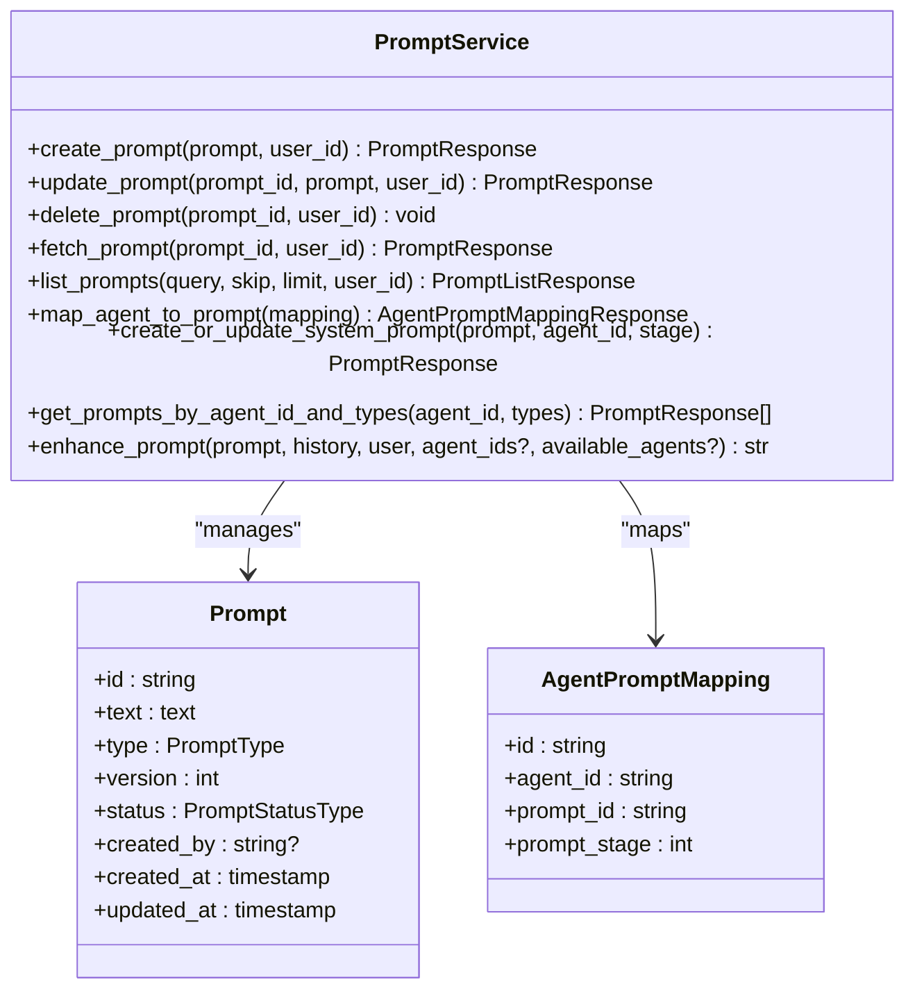
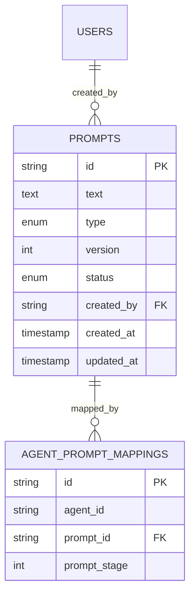
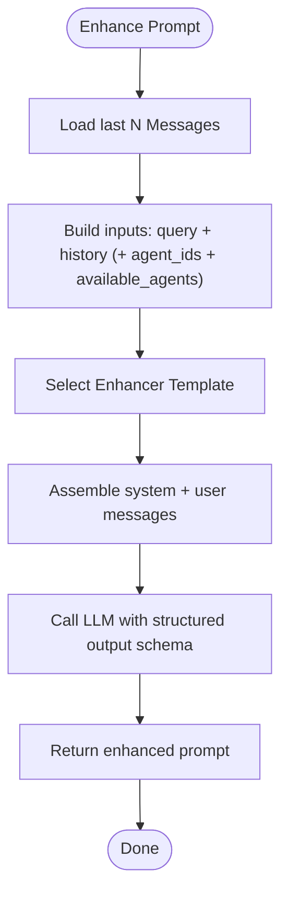
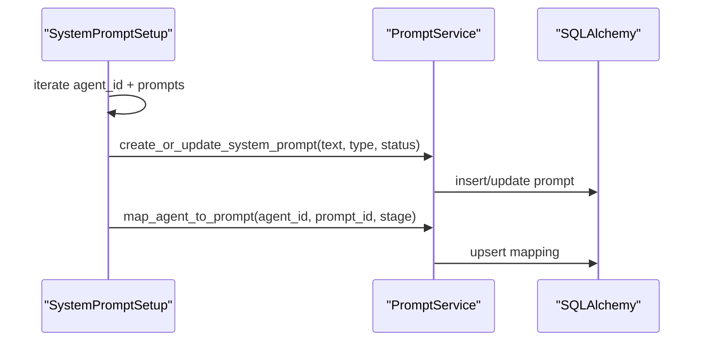
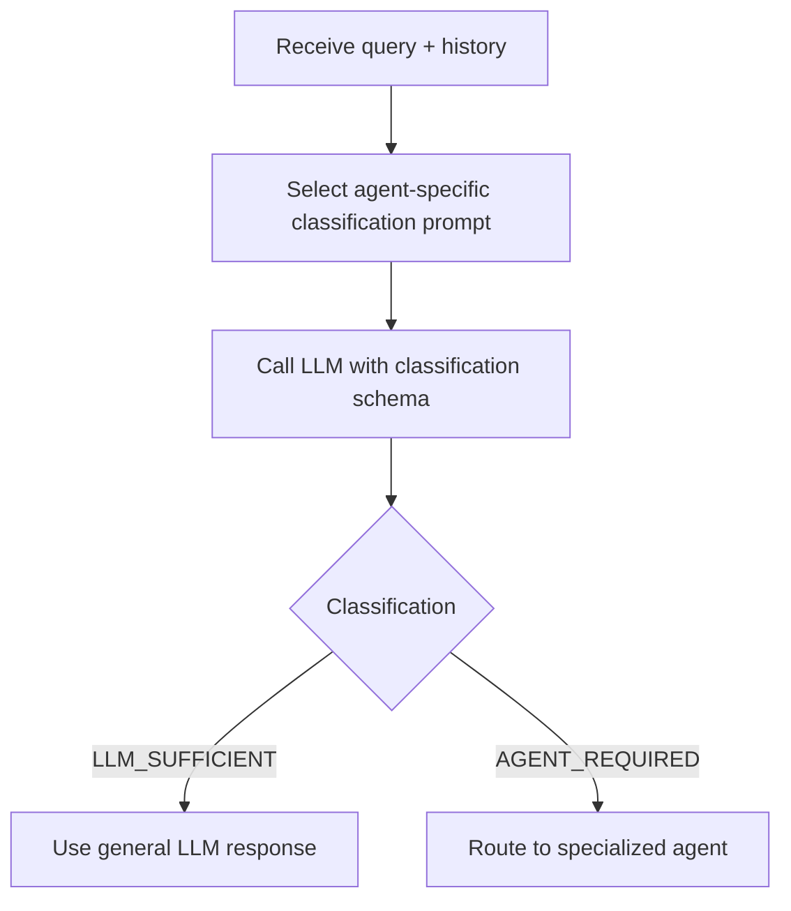
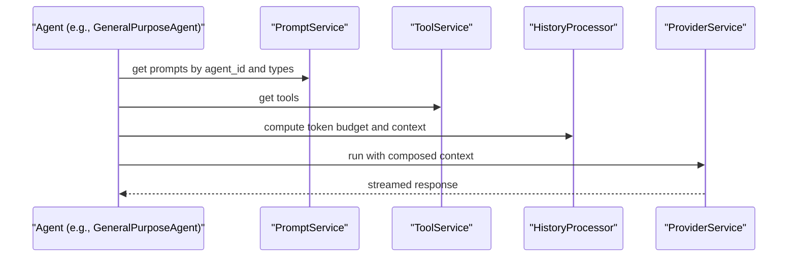
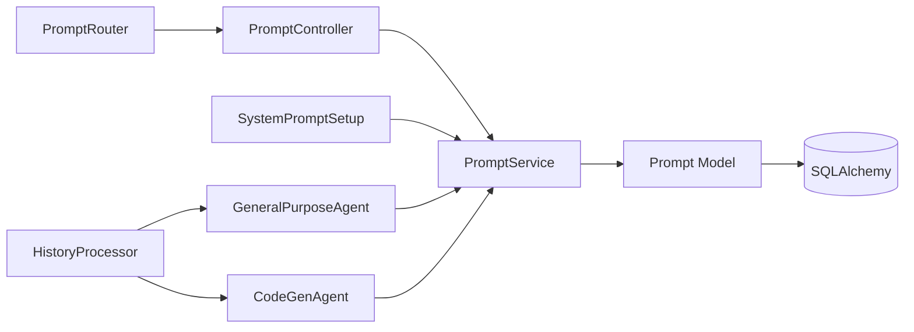

# Prompt Management

<cite>
**Referenced Files in This Document**
- [prompt_service.py](file://app/modules/intelligence/prompts/prompt_service.py)
- [prompt_model.py](file://app/modules/intelligence/prompts/prompt_model.py)
- [prompt_schema.py](file://app/modules/intelligence/prompts/prompt_schema.py)
- [prompt_controller.py](file://app/modules/intelligence/prompts/prompt_controller.py)
- [prompt_router.py](file://app/modules/intelligence/prompts/prompt_router.py)
- [system_prompt_setup.py](file://app/modules/intelligence/prompts/system_prompt_setup.py)
- [classification_prompts.py](file://app/modules/intelligence/prompts/classification_prompts.py)
- [20240902105155_6b44dc81d95d_prompt_tables.py](file://app/alembic/versions/20240902105155_6b44dc81d95d_prompt_tables.py)
- [general_purpose_agent.py](file://app/modules/intelligence/agents/chat_agents/system_agents/general_purpose_agent.py)
- [history_processor.py](file://app/modules/intelligence/agents/chat_agents/history_processor.py)
- [code_gen_agent.py](file://app/modules/intelligence/agents/chat_agents/system_agents/code_gen_agent.py)
</cite>

## Table of Contents
1. [Introduction](#introduction)
2. [Project Structure](#project-structure)
3. [Core Components](#core-components)
4. [Architecture Overview](#architecture-overview)
5. [Detailed Component Analysis](#detailed-component-analysis)
6. [Dependency Analysis](#dependency-analysis)
7. [Performance Considerations](#performance-considerations)
8. [Troubleshooting Guide](#troubleshooting-guide)
9. [Conclusion](#conclusion)
10. [Appendices](#appendices)

## Introduction
This document explains the prompt management system for structured AI prompt engineering and template management. It covers the prompt lifecycle from creation to deployment, including versioning, template management, and system prompt configuration. It documents the PromptService implementation, prompt persistence, and dynamic prompt injection. It also provides concrete examples from the codebase showing prompt creation workflows, template variables, and optimization techniques. Configuration options for prompt parameters, context injection, and result formatting are explained, along with relationships to agent execution, tool usage, and conversation context. Common issues such as prompt optimization, context length management, and performance tuning are addressed for both beginners and experienced developers.

## Project Structure
The prompt management subsystem is organized around a service-layer abstraction that persists prompts and maps them to agents, with supporting models, schemas, controllers, routers, and initialization utilities. The system integrates with agent execution and tool usage to dynamically inject context and produce optimized prompts.

**Diagram sources**
- [prompt_service.py](file://app/modules/intelligence/prompts/prompt_service.py#L59-L503)
- [prompt_model.py](file://app/modules/intelligence/prompts/prompt_model.py#L22-L69)
- [prompt_schema.py](file://app/modules/intelligence/prompts/prompt_schema.py#L19-L98)
- [prompt_controller.py](file://app/modules/intelligence/prompts/prompt_controller.py#L30-L155)
- [prompt_router.py](file://app/modules/intelligence/prompts/prompt_router.py#L23-L95)
- [system_prompt_setup.py](file://app/modules/intelligence/prompts/system_prompt_setup.py#L11-L433)
- [classification_prompts.py](file://app/modules/intelligence/prompts/classification_prompts.py#L26-L538)
- [general_purpose_agent.py](file://app/modules/intelligence/agents/chat_agents/system_agents/general_purpose_agent.py#L26-L150)
- [code_gen_agent.py](file://app/modules/intelligence/agents/chat_agents/system_agents/code_gen_agent.py#L26-L173)
- [history_processor.py](file://app/modules/intelligence/agents/chat_agents/history_processor.py#L1788-L1827)
- [20240902105155_6b44dc81d95d_prompt_tables.py](file://app/alembic/versions/20240902105155_6b44dc81d95d_prompt_tables.py#L21-L82)

**Section sources**
- [prompt_service.py](file://app/modules/intelligence/prompts/prompt_service.py#L59-L503)
- [prompt_model.py](file://app/modules/intelligence/prompts/prompt_model.py#L22-L69)
- [prompt_schema.py](file://app/modules/intelligence/prompts/prompt_schema.py#L19-L98)
- [prompt_controller.py](file://app/modules/intelligence/prompts/prompt_controller.py#L30-L155)
- [prompt_router.py](file://app/modules/intelligence/prompts/prompt_router.py#L23-L95)
- [system_prompt_setup.py](file://app/modules/intelligence/prompts/system_prompt_setup.py#L11-L433)
- [classification_prompts.py](file://app/modules/intelligence/prompts/classification_prompts.py#L26-L538)
- [20240902105155_6b44dc81d95d_prompt_tables.py](file://app/alembic/versions/20240902105155_6b44dc81d95d_prompt_tables.py#L21-L82)

## Core Components
- PromptService: Central orchestrator for prompt CRUD, versioning, mapping to agents, and dynamic prompt enhancement.
- Prompt Model: Defines persisted prompt entities and agent-to-prompt mappings with constraints and relationships.
- Schemas: Strongly typed request/response models for prompt operations and classification responses.
- PromptController/PromptRouter: REST endpoints exposing prompt management and enhancement APIs.
- SystemPromptSetup: Initializes system prompts per agent and stage, ensuring consistent baseline behavior.
- ClassificationPrompts: Per-agent classification templates guiding when to route to specialized agents versus general LLM responses.
- Persistence: Alembic migration defines prompt tables and constraints; SQLAlchemy models enforce data integrity.

Key capabilities:
- Prompt creation with automatic versioning and timestamps.
- Prompt updates increment version and preserve audit trail.
- Agent-to-prompt mapping by stage for multi-stage agent workflows.
- System prompt creation/update with deduplication and status/version handling.
- Prompt enhancement via LLM with structured output and optional agent classification.
- Classification-driven routing to specialized agents for debugging, testing, code changes, etc.

**Section sources**
- [prompt_service.py](file://app/modules/intelligence/prompts/prompt_service.py#L59-L503)
- [prompt_model.py](file://app/modules/intelligence/prompts/prompt_model.py#L22-L69)
- [prompt_schema.py](file://app/modules/intelligence/prompts/prompt_schema.py#L19-L98)
- [prompt_controller.py](file://app/modules/intelligence/prompts/prompt_controller.py#L30-L155)
- [prompt_router.py](file://app/modules/intelligence/prompts/prompt_router.py#L23-L95)
- [system_prompt_setup.py](file://app/modules/intelligence/prompts/system_prompt_setup.py#L11-L433)
- [classification_prompts.py](file://app/modules/intelligence/prompts/classification_prompts.py#L26-L538)
- [20240902105155_6b44dc81d95d_prompt_tables.py](file://app/alembic/versions/20240902105155_6b44dc81d95d_prompt_tables.py#L21-L82)

## Architecture Overview
The prompt management architecture separates concerns across service, persistence, API, and agent layers. The PromptService encapsulates business logic, while models and schemas define data contracts. Controllers and routers expose REST endpoints. SystemPromptSetup initializes baseline prompts. ClassificationPrompts inform routing decisions. Agents consume prompts and tools to execute tasks, with context and token counting managed centrally.

**Diagram sources**
- [prompt_router.py](file://app/modules/intelligence/prompts/prompt_router.py#L87-L95)
- [prompt_controller.py](file://app/modules/intelligence/prompts/prompt_controller.py#L91-L155)
- [prompt_service.py](file://app/modules/intelligence/prompts/prompt_service.py#L372-L426)

**Section sources**
- [prompt_router.py](file://app/modules/intelligence/prompts/prompt_router.py#L23-L95)
- [prompt_controller.py](file://app/modules/intelligence/prompts/prompt_controller.py#L30-L155)
- [prompt_service.py](file://app/modules/intelligence/prompts/prompt_service.py#L372-L426)

## Detailed Component Analysis

### PromptService: Lifecycle, Versioning, and Enhancement
PromptService implements:
- Creation: Generates UUID, sets status and timestamps, initializes version 1.
- Updates: Increments version and updated_at; enforces ownership checks.
- Deletion: Enforces ownership and raises not-found when no rows affected.
- Fetch/List: Standard CRUD with filtering and pagination.
- Mapping: Upserts agent-to-prompt mapping by agent_id and stage.
- System prompt creation/update: Creates or updates system prompts owned by the system (no user_id) and increments version on changes.
- Retrieval by agent and types: Joins prompts with mappings for agent-scoped retrieval.
- Enhancement: Builds structured messages using internal templates and calls the LLM provider with a structured schema to return an enhanced prompt.

**Diagram sources**
- [prompt_service.py](file://app/modules/intelligence/prompts/prompt_service.py#L59-L503)
- [prompt_model.py](file://app/modules/intelligence/prompts/prompt_model.py#L22-L69)

**Section sources**
- [prompt_service.py](file://app/modules/intelligence/prompts/prompt_service.py#L63-L177)
- [prompt_service.py](file://app/modules/intelligence/prompts/prompt_service.py#L234-L371)
- [prompt_service.py](file://app/modules/intelligence/prompts/prompt_service.py#L372-L426)

### Prompt Persistence and Constraints
The migration and models define:
- Prompts table with unique composite constraint on text, version, and created_by.
- Check constraints for positive version and monotonic timestamps.
- AgentPromptMappings table with cascade delete and uniqueness on agent_id and stage.
- Foreign keys linking prompts to users and mappings to prompts.

**Diagram sources**
- [20240902105155_6b44dc81d95d_prompt_tables.py](file://app/alembic/versions/20240902105155_6b44dc81d95d_prompt_tables.py#L21-L82)
- [prompt_model.py](file://app/modules/intelligence/prompts/prompt_model.py#L22-L69)

**Section sources**
- [20240902105155_6b44dc81d95d_prompt_tables.py](file://app/alembic/versions/20240902105155_6b44dc81d95d_prompt_tables.py#L21-L82)
- [prompt_model.py](file://app/modules/intelligence/prompts/prompt_model.py#L22-L69)

### Prompt Enhancement Workflow
The enhancement pipeline:
- Collects recent conversation messages and constructs a small history window.
- Optionally includes agent metadata and available agents when not using custom agents.
- Builds a system message referencing internal templates and a user message with structured inputs.
- Calls the LLM provider with a structured schema to return an enhanced prompt.

**Diagram sources**
- [prompt_controller.py](file://app/modules/intelligence/prompts/prompt_controller.py#L91-L155)
- [prompt_service.py](file://app/modules/intelligence/prompts/prompt_service.py#L372-L426)

**Section sources**
- [prompt_controller.py](file://app/modules/intelligence/prompts/prompt_controller.py#L91-L155)
- [prompt_service.py](file://app/modules/intelligence/prompts/prompt_service.py#L372-L426)

### System Prompt Initialization
SystemPromptSetup initializes baseline system prompts for multiple agents (QNA, DEBUGGING, UNIT_TEST, INTEGRATION_TEST, CODE_CHANGES, GENERAL) with distinct SYSTEM and HUMAN stages. It creates or updates prompts and maps them to agents by stage.

**Diagram sources**
- [system_prompt_setup.py](file://app/modules/intelligence/prompts/system_prompt_setup.py#L16-L433)
- [prompt_service.py](file://app/modules/intelligence/prompts/prompt_service.py#L282-L351)
- [prompt_service.py](file://app/modules/intelligence/prompts/prompt_service.py#L234-L281)

**Section sources**
- [system_prompt_setup.py](file://app/modules/intelligence/prompts/system_prompt_setup.py#L16-L433)
- [prompt_service.py](file://app/modules/intelligence/prompts/prompt_service.py#L282-L351)
- [prompt_service.py](file://app/modules/intelligence/prompts/prompt_service.py#L234-L281)

### Classification-Based Routing
ClassificationPrompts provides per-agent classification templates that guide whether a query can be handled by general knowledge or requires specialized agents. These templates are used to classify queries and route accordingly.

**Diagram sources**
- [classification_prompts.py](file://app/modules/intelligence/prompts/classification_prompts.py#L26-L538)

**Section sources**
- [classification_prompts.py](file://app/modules/intelligence/prompts/classification_prompts.py#L26-L538)

### Agent Integration and Context Injection
Agents consume prompts and tools to execute tasks. Context injection and token accounting are handled centrally to manage context length and performance.

- GeneralPurposeAgent and CodeGenAgent depend on PromptService for prompt orchestration and on ToolService for codebase exploration.
- HistoryProcessor computes token counts across system prompts, tool schemas, and message history to manage context length.

**Diagram sources**
- [general_purpose_agent.py](file://app/modules/intelligence/agents/chat_agents/system_agents/general_purpose_agent.py#L26-L150)
- [code_gen_agent.py](file://app/modules/intelligence/agents/chat_agents/system_agents/code_gen_agent.py#L26-L173)
- [history_processor.py](file://app/modules/intelligence/agents/chat_agents/history_processor.py#L1788-L1827)

**Section sources**
- [general_purpose_agent.py](file://app/modules/intelligence/agents/chat_agents/system_agents/general_purpose_agent.py#L26-L150)
- [code_gen_agent.py](file://app/modules/intelligence/agents/chat_agents/system_agents/code_gen_agent.py#L26-L173)
- [history_processor.py](file://app/modules/intelligence/agents/chat_agents/history_processor.py#L1788-L1827)

## Dependency Analysis
- PromptService depends on SQLAlchemy for persistence and ProviderService for LLM calls.
- PromptController depends on PromptService and integrates with AgentsService and ToolService for enhancement.
- SystemPromptSetup depends on PromptService to create/update system prompts and map them to agents.
- Agents depend on PromptService and ToolService; HistoryProcessor coordinates context sizing.

**Diagram sources**
- [prompt_controller.py](file://app/modules/intelligence/prompts/prompt_controller.py#L30-L155)
- [prompt_router.py](file://app/modules/intelligence/prompts/prompt_router.py#L23-L95)
- [system_prompt_setup.py](file://app/modules/intelligence/prompts/system_prompt_setup.py#L11-L433)
- [general_purpose_agent.py](file://app/modules/intelligence/agents/chat_agents/system_agents/general_purpose_agent.py#L26-L150)
- [code_gen_agent.py](file://app/modules/intelligence/agents/chat_agents/system_agents/code_gen_agent.py#L26-L173)
- [history_processor.py](file://app/modules/intelligence/agents/chat_agents/history_processor.py#L1788-L1827)
- [prompt_service.py](file://app/modules/intelligence/prompts/prompt_service.py#L59-L503)
- [prompt_model.py](file://app/modules/intelligence/prompts/prompt_model.py#L22-L69)

**Section sources**
- [prompt_controller.py](file://app/modules/intelligence/prompts/prompt_controller.py#L30-L155)
- [prompt_router.py](file://app/modules/intelligence/prompts/prompt_router.py#L23-L95)
- [system_prompt_setup.py](file://app/modules/intelligence/prompts/system_prompt_setup.py#L11-L433)
- [general_purpose_agent.py](file://app/modules/intelligence/agents/chat_agents/system_agents/general_purpose_agent.py#L26-L150)
- [code_gen_agent.py](file://app/modules/intelligence/agents/chat_agents/system_agents/code_gen_agent.py#L26-L173)
- [history_processor.py](file://app/modules/intelligence/agents/chat_agents/history_processor.py#L1788-L1827)
- [prompt_service.py](file://app/modules/intelligence/prompts/prompt_service.py#L59-L503)
- [prompt_model.py](file://app/modules/intelligence/prompts/prompt_model.py#L22-L69)

## Performance Considerations
- Token budgeting: Use HistoryProcessor to estimate total tokens across system prompts, tool schemas, and message history to prevent context overflow.
- Prompt size control: Limit history window and compress repeated context in PromptController when constructing enhancement inputs.
- Structured outputs: Leverage ProviderService’s structured output mode to reduce retries and improve throughput.
- Versioning overhead: Incremental version updates are lightweight; keep prompt texts concise to minimize storage and retrieval costs.
- Classification routing: Use ClassificationPrompts to avoid unnecessary agent invocations when general knowledge suffices.

[No sources needed since this section provides general guidance]

## Troubleshooting Guide
Common issues and resolutions:
- Integrity errors during creation: Ensure unique combinations of text, version, and created_by are respected; handle rollback and reattempt with adjusted version.
- Ownership errors: Update/delete operations enforce user ownership; verify user_id matches prompt creator.
- Enhancement failures: Validate LLM provider availability and schema compliance; inspect structured output configuration.
- Mapping conflicts: Agent-to-stage uniqueness prevents duplicates; verify agent_id and stage values.
- Context overflow: Monitor token counts via HistoryProcessor and trim history or system prompt length.

**Section sources**
- [prompt_service.py](file://app/modules/intelligence/prompts/prompt_service.py#L87-L98)
- [prompt_service.py](file://app/modules/intelligence/prompts/prompt_service.py#L123-L143)
- [prompt_service.py](file://app/modules/intelligence/prompts/prompt_service.py#L156-L176)
- [prompt_service.py](file://app/modules/intelligence/prompts/prompt_service.py#L247-L252)
- [history_processor.py](file://app/modules/intelligence/agents/chat_agents/history_processor.py#L1788-L1827)

## Conclusion
The prompt management system provides a robust, versioned, and extensible foundation for AI prompt engineering. It supports structured CRUD operations, agent-centric mapping, dynamic prompt enhancement, and integration with agent execution and tool usage. By leveraging classification-based routing, token-aware context management, and system prompt initialization, teams can reliably scale prompt engineering across diverse agent workflows while maintaining performance and clarity.

[No sources needed since this section summarizes without analyzing specific files]

## Appendices

### API Definitions
- Create prompt: POST /prompts/
- Update prompt: PUT /prompts/{prompt_id}
- Delete prompt: DELETE /prompts/{prompt_id}
- Fetch prompt: GET /prompts/{prompt_id}
- List prompts: GET /prompts/?query=&skip=&limit=
- Enhance prompt: POST /prompts/enhancer

Response types:
- PromptResponse, PromptListResponse, AgentPromptMappingResponse, EnhancedPromptResponse

**Section sources**
- [prompt_router.py](file://app/modules/intelligence/prompts/prompt_router.py#L23-L95)
- [prompt_schema.py](file://app/modules/intelligence/prompts/prompt_schema.py#L46-L98)