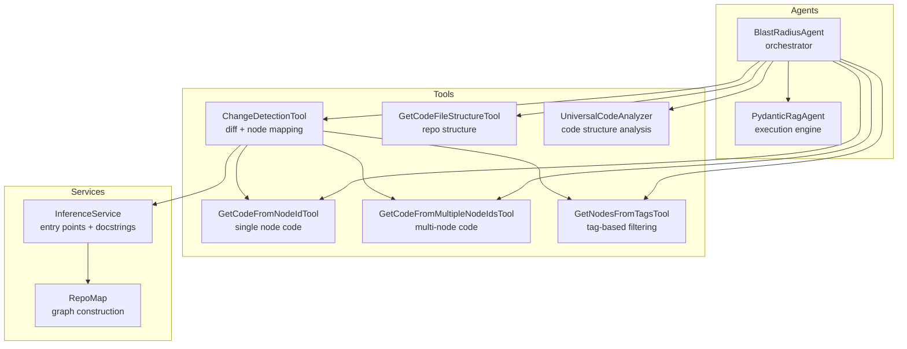
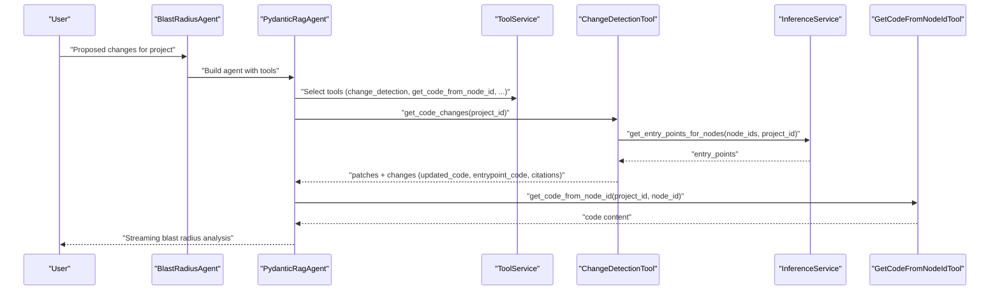
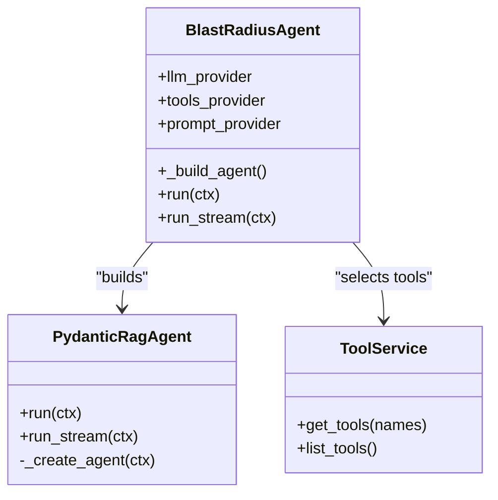
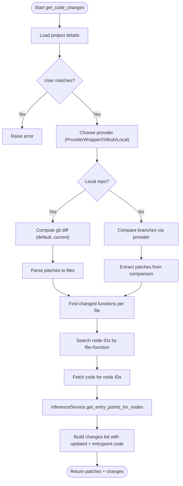
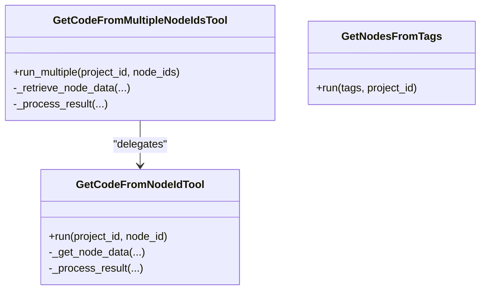
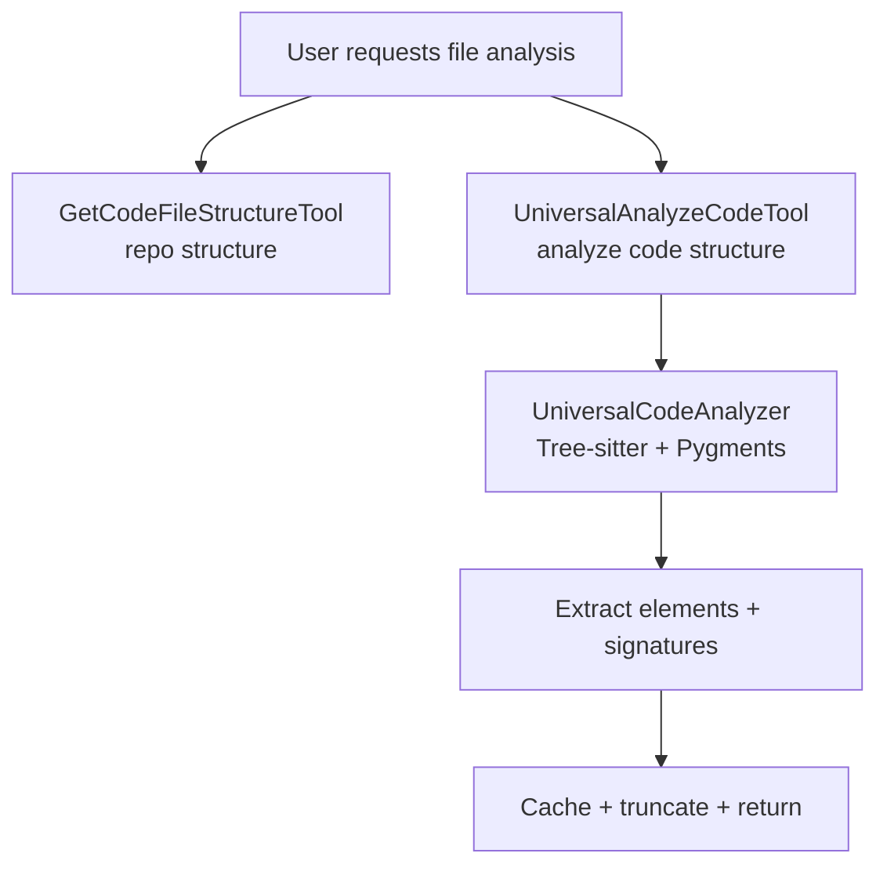
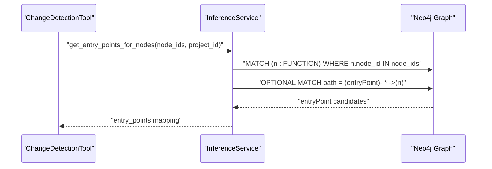
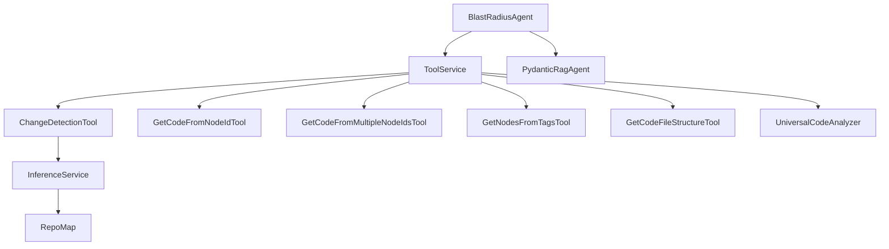

# Blast Radius Agent

<cite>
**Referenced Files in This Document**
- [blast_radius_agent.py](file://app/modules/intelligence/agents/chat_agents/system_agents/blast_radius_agent.py)
- [pydantic_agent.py](file://app/modules/intelligence/agents/chat_agents/pydantic_agent.py)
- [tool_service.py](file://app/modules/intelligence/tools/tool_service.py)
- [change_detection_tool.py](file://app/modules/intelligence/tools/change_detection/change_detection_tool.py)
- [get_code_from_node_id_tool.py](file://app/modules/intelligence/tools/kg_based_tools/get_code_from_node_id_tool.py)
- [get_code_from_multiple_node_ids_tool.py](file://app/modules/intelligence/tools/kg_based_tools/get_code_from_multiple_node_ids_tool.py)
- [get_nodes_from_tags_tool.py](file://app/modules/intelligence/tools/kg_based_tools/get_nodes_from_tags_tool.py)
- [get_code_file_structure.py](file://app/modules/intelligence/tools/code_query_tools/get_code_file_structure.py)
- [code_analysis.py](file://app/modules/intelligence/tools/code_query_tools/code_analysis.py)
- [inference_service.py](file://app/modules/parsing/knowledge_graph/inference_service.py)
- [parsing_repomap.py](file://app/modules/parsing/graph_construction/parsing_repomap.py)
- [system_prompt_setup.py](file://app/modules/intelligence/prompts/system_prompt_setup.py)
</cite>

## Table of Contents
1. [Introduction](#introduction)
2. [Project Structure](#project-structure)
3. [Core Components](#core-components)
4. [Architecture Overview](#architecture-overview)
5. [Detailed Component Analysis](#detailed-component-analysis)
6. [Dependency Analysis](#dependency-analysis)
7. [Performance Considerations](#performance-considerations)
8. [Troubleshooting Guide](#troubleshooting-guide)
9. [Conclusion](#conclusion)
10. [Appendices](#appendices)

## Introduction
The Blast Radius Agent is a specialized system agent designed to perform change impact analysis across a codebase. It evaluates proposed code modifications, traces dependencies, assesses side effects, and provides structured insights into the scope and risk of changes. By combining a curated set of tools—covering change detection, knowledge graph traversal, code structure analysis, and version-control integration—the agent delivers comprehensive, actionable recommendations to support safe and informed development decisions.

## Project Structure
The Blast Radius Agent is implemented as a system agent that composes multiple tools and services:
- Agent orchestration and tool composition live under the agents module.
- Tools are organized by domain: change detection, knowledge graph queries, code structure analysis, and file retrieval.
- Knowledge graph services provide dependency mapping and entry-point discovery.
- Parsing utilities construct and traverse the code graph.

**Diagram sources**
- [blast_radius_agent.py](file://app/modules/intelligence/agents/chat_agents/system_agents/blast_radius_agent.py#L14-L63)
- [pydantic_agent.py](file://app/modules/intelligence/agents/chat_agents/pydantic_agent.py#L66-L199)
- [tool_service.py](file://app/modules/intelligence/tools/tool_service.py#L99-L242)
- [change_detection_tool.py](file://app/modules/intelligence/tools/change_detection/change_detection_tool.py#L50-L800)
- [get_code_from_node_id_tool.py](file://app/modules/intelligence/tools/kg_based_tools/get_code_from_node_id_tool.py#L23-L186)
- [get_code_from_multiple_node_ids_tool.py](file://app/modules/intelligence/tools/kg_based_tools/get_code_from_multiple_node_ids_tool.py#L23-L186)
- [get_nodes_from_tags_tool.py](file://app/modules/intelligence/tools/kg_based_tools/get_nodes_from_tags_tool.py#L20-L130)
- [get_code_file_structure.py](file://app/modules/intelligence/tools/code_query_tools/get_code_file_structure.py#L23-L95)
- [code_analysis.py](file://app/modules/intelligence/tools/code_query_tools/code_analysis.py#L417-L593)
- [inference_service.py](file://app/modules/parsing/knowledge_graph/inference_service.py#L45-L221)
- [parsing_repomap.py](file://app/modules/parsing/graph_construction/parsing_repomap.py#L611-L632)

**Section sources**
- [blast_radius_agent.py](file://app/modules/intelligence/agents/chat_agents/system_agents/blast_radius_agent.py#L14-L63)
- [tool_service.py](file://app/modules/intelligence/tools/tool_service.py#L99-L242)

## Core Components
- BlastRadiusAgent: Orchestrates the blast radius analysis by assembling a toolset and delegating execution to a PydanticRagAgent.
- PydanticRagAgent: Executes the agent with multimodal support, tool orchestration, and streaming responses.
- ToolService: Central registry and initializer for all available tools, enabling dynamic selection for the agent.
- ChangeDetectionTool: Computes diffs, identifies changed functions, maps them to graph nodes, and discovers entry points.
- Knowledge Graph Tools: Retrieve code by node IDs, fetch nodes by tags, and support targeted exploration.
- InferenceService: Provides entry points, neighbor traversal, and docstring generation for function flows.
- Parsing Utilities: Construct and traverse the code graph to support dependency mapping.

**Section sources**
- [blast_radius_agent.py](file://app/modules/intelligence/agents/chat_agents/system_agents/blast_radius_agent.py#L14-L63)
- [pydantic_agent.py](file://app/modules/intelligence/agents/chat_agents/pydantic_agent.py#L66-L199)
- [tool_service.py](file://app/modules/intelligence/tools/tool_service.py#L99-L242)
- [change_detection_tool.py](file://app/modules/intelligence/tools/change_detection/change_detection_tool.py#L50-L800)
- [inference_service.py](file://app/modules/parsing/knowledge_graph/inference_service.py#L45-L221)

## Architecture Overview
The Blast Radius Agent follows a layered architecture:
- Orchestration Layer: BlastRadiusAgent configures the agent and selects tools.
- Execution Layer: PydanticRagAgent manages tool calls, context, and streaming output.
- Tool Layer: Specialized tools implement specific capabilities (change detection, code retrieval, structure analysis).
- Service Layer: InferenceService and parsing utilities provide graph traversal and dependency mapping.
- Data Layer: Neo4j-backed knowledge graph stores nodes and relationships; code providers supply file content.

**Diagram sources**
- [blast_radius_agent.py](file://app/modules/intelligence/agents/chat_agents/system_agents/blast_radius_agent.py#L25-L54)
- [pydantic_agent.py](file://app/modules/intelligence/agents/chat_agents/pydantic_agent.py#L478-L546)
- [tool_service.py](file://app/modules/intelligence/tools/tool_service.py#L126-L133)
- [change_detection_tool.py](file://app/modules/intelligence/tools/change_detection/change_detection_tool.py#L358-L800)
- [inference_service.py](file://app/modules/parsing/knowledge_graph/inference_service.py#L196-L221)
- [get_code_from_node_id_tool.py](file://app/modules/intelligence/tools/kg_based_tools/get_code_from_node_id_tool.py#L55-L90)

## Detailed Component Analysis

### BlastRadiusAgent
- Purpose: Compose a blast radius analysis agent with a curated toolset and enforce Pydantic compatibility.
- Toolset: Includes change detection, code retrieval by node IDs, tag-based filtering, file structure, code analysis, web search, and shell commands.
- Execution: Delegates to PydanticRagAgent for orchestration and streaming.

**Diagram sources**
- [blast_radius_agent.py](file://app/modules/intelligence/agents/chat_agents/system_agents/blast_radius_agent.py#L14-L63)
- [pydantic_agent.py](file://app/modules/intelligence/agents/chat_agents/pydantic_agent.py#L66-L199)
- [tool_service.py](file://app/modules/intelligence/tools/tool_service.py#L126-L133)

**Section sources**
- [blast_radius_agent.py](file://app/modules/intelligence/agents/chat_agents/system_agents/blast_radius_agent.py#L14-L63)

### Change Detection Tool
- Diff computation: Supports local repos (git diff) and remote providers (GitHub/GitBucket).
- Function identification: Parses diffs to locate changed functions and maps them to graph nodes.
- Node mapping: Uses multiple strategies to resolve file-path + function-name to node IDs.
- Entry point discovery: Traverses inbound neighbors to identify upstream entry points.

**Diagram sources**
- [change_detection_tool.py](file://app/modules/intelligence/tools/change_detection/change_detection_tool.py#L358-L800)
- [inference_service.py](file://app/modules/parsing/knowledge_graph/inference_service.py#L196-L221)

**Section sources**
- [change_detection_tool.py](file://app/modules/intelligence/tools/change_detection/change_detection_tool.py#L50-L800)
- [inference_service.py](file://app/modules/parsing/knowledge_graph/inference_service.py#L196-L221)

### Knowledge Graph Tools
- GetCodeFromNodeIdTool: Retrieves code and docstring for a single node by ID.
- GetCodeFromMultipleNodeIdsTool: Parallel retrieval for multiple nodes with truncation safeguards.
- GetNodesFromTagsTool: Filters nodes by tags (e.g., API, DATABASE, AUTH) for broad exploration.

**Diagram sources**
- [get_code_from_node_id_tool.py](file://app/modules/intelligence/tools/kg_based_tools/get_code_from_node_id_tool.py#L23-L186)
- [get_code_from_multiple_node_ids_tool.py](file://app/modules/intelligence/tools/kg_based_tools/get_code_from_multiple_node_ids_tool.py#L23-L186)
- [get_nodes_from_tags_tool.py](file://app/modules/intelligence/tools/kg_based_tools/get_nodes_from_tags_tool.py#L20-L130)

**Section sources**
- [get_code_from_node_id_tool.py](file://app/modules/intelligence/tools/kg_based_tools/get_code_from_node_id_tool.py#L23-L186)
- [get_code_from_multiple_node_ids_tool.py](file://app/modules/intelligence/tools/kg_based_tools/get_code_from_multiple_node_ids_tool.py#L23-L186)
- [get_nodes_from_tags_tool.py](file://app/modules/intelligence/tools/kg_based_tools/get_nodes_from_tags_tool.py#L20-L130)

### Code Structure and File Retrieval
- GetCodeFileStructureTool: Returns hierarchical repository structure with truncation.
- UniversalCodeAnalyzer and UniversalAnalyzeCodeTool: Language-agnostic analysis of code elements (classes, functions, methods) with caching and truncation.

**Diagram sources**
- [get_code_file_structure.py](file://app/modules/intelligence/tools/code_query_tools/get_code_file_structure.py#L23-L95)
- [code_analysis.py](file://app/modules/intelligence/tools/code_query_tools/code_analysis.py#L417-L593)

**Section sources**
- [get_code_file_structure.py](file://app/modules/intelligence/tools/code_query_tools/get_code_file_structure.py#L23-L95)
- [code_analysis.py](file://app/modules/intelligence/tools/code_query_tools/code_analysis.py#L417-L593)

### Dependency Traversal and Entry Point Discovery
- InferenceService provides:
  - get_entry_points: Identifies function nodes with outbound callers and no inbound callers.
  - get_neighbours: Traverses CALLS relationships to discover direct and indirect neighbors.
  - get_entry_points_for_nodes: Maps changed nodes to their upstream entry points.
- Parsing utilities build the graph and support directional edges for caller/callee relationships.

**Diagram sources**
- [inference_service.py](file://app/modules/parsing/knowledge_graph/inference_service.py#L196-L221)
- [parsing_repomap.py](file://app/modules/parsing/graph_construction/parsing_repomap.py#L611-L632)

**Section sources**
- [inference_service.py](file://app/modules/parsing/knowledge_graph/inference_service.py#L135-L221)
- [parsing_repomap.py](file://app/modules/parsing/graph_construction/parsing_repomap.py#L611-L632)

### Practical Examples and Workflows
- Scenario 1: API endpoint change
  - Use ChangeDetectionTool to compute diffs and map changed functions to node IDs.
  - Use GetCodeFromMultipleNodeIdsTool to fetch updated code and docstrings.
  - Use InferenceService.get_entry_points_for_nodes to discover upstream entry points (e.g., routes, consumers).
  - Use UniversalAnalyzeCodeTool to understand the structure of modified files.
  - Present a structured blast radius: direct changes, indirect effects, critical areas, and mitigation suggestions.

- Scenario 2: Cross-cutting change (authentication)
  - Use GetNodesFromTags with tags like AUTH to discover all auth-related components.
  - Traverse neighbors to understand downstream consumers.
  - Evaluate risk by summarizing entry points and suggesting refactoring to minimize ripple effects.

- Scenario 3: Database schema change
  - Use ChangeDetectionTool to identify modified functions touching the schema.
  - Use GetCodeFromNodeIdTool to retrieve relevant code snippets.
  - Use UniversalCodeAnalyzer to highlight ORM models and migrations.
  - Recommend testing coverage for dependent services and consumers.

[No sources needed since this section synthesizes workflows without quoting specific code]

## Dependency Analysis
The agent’s dependencies span orchestration, tooling, graph services, and parsing:
- Coupling: BlastRadiusAgent depends on ToolService for tool availability and PydanticRagAgent for execution.
- Graph Services: ChangeDetectionTool integrates with InferenceService for entry point discovery and Neo4j for node retrieval.
- Parsing: RepoMap constructs the graph; InferenceService traverses it to identify dependencies and entry points.
- External Integrations: Version control providers (GitHub/GitBucket/Local) feed diff data; code providers supply file content.

**Diagram sources**
- [blast_radius_agent.py](file://app/modules/intelligence/agents/chat_agents/system_agents/blast_radius_agent.py#L14-L63)
- [tool_service.py](file://app/modules/intelligence/tools/tool_service.py#L99-L242)
- [change_detection_tool.py](file://app/modules/intelligence/tools/change_detection/change_detection_tool.py#L50-L800)
- [inference_service.py](file://app/modules/parsing/knowledge_graph/inference_service.py#L45-L221)
- [parsing_repomap.py](file://app/modules/parsing/graph_construction/parsing_repomap.py#L611-L632)

**Section sources**
- [tool_service.py](file://app/modules/intelligence/tools/tool_service.py#L99-L242)
- [inference_service.py](file://app/modules/parsing/knowledge_graph/inference_service.py#L45-L221)

## Performance Considerations
- Truncation and Limits: Tools implement response truncation to manage large outputs and avoid exceeding LLM token budgets.
- Caching: UniversalCodeAnalyzer caches analysis results; InferenceService leverages cache-aware processing for docstrings.
- Batching: InferenceService batches nodes and entry points to optimize throughput and reduce latency.
- Parallelism: ToolService conditionally enables parallel tool calls based on provider capabilities.
- Streaming: PydanticRagAgent streams responses to improve interactivity and reduce perceived latency.

[No sources needed since this section provides general guidance]

## Troubleshooting Guide
- Unsupported Provider: If the LLM provider does not support Pydantic-based agents, the agent raises an explicit error during initialization.
- Missing Node IDs: ChangeDetectionTool falls back to multiple strategies to resolve node IDs; failures are logged and skipped.
- Large Outputs: Tools truncate responses; monitor logs for truncation notices and adjust queries to focus scope.
- Provider Errors: Remote provider comparisons and local git operations are wrapped with error handling and logging for diagnostics.

**Section sources**
- [blast_radius_agent.py](file://app/modules/intelligence/agents/chat_agents/system_agents/blast_radius_agent.py#L50-L53)
- [change_detection_tool.py](file://app/modules/intelligence/tools/change_detection/change_detection_tool.py#L175-L180)
- [get_code_from_node_id_tool.py](file://app/modules/intelligence/tools/kg_based_tools/get_code_from_node_id_tool.py#L82-L89)

## Conclusion
The Blast Radius Agent provides a robust framework for analyzing the impact of code changes across a codebase. By integrating change detection, knowledge graph traversal, and code structure analysis, it offers a comprehensive view of direct and indirect effects, highlights critical areas, and suggests actionable mitigations. Its modular design and streaming execution enable efficient, safe, and informed decision-making in development workflows.

[No sources needed since this section summarizes without analyzing specific files]

## Appendices

### Configuration Options
- Tool Selection: The agent dynamically selects tools via ToolService, enabling flexible composition for different analysis needs.
- Provider Compatibility: The agent enforces Pydantic support for the LLM provider to ensure structured output compatibility.
- Prompting: System prompts guide the agent to structure blast radius analyses, including summaries, indirect effects, critical areas, and recommendations.

**Section sources**
- [tool_service.py](file://app/modules/intelligence/tools/tool_service.py#L126-L133)
- [blast_radius_agent.py](file://app/modules/intelligence/agents/chat_agents/system_agents/blast_radius_agent.py#L50-L54)
- [system_prompt_setup.py](file://app/modules/intelligence/prompts/system_prompt_setup.py#L373-L380)