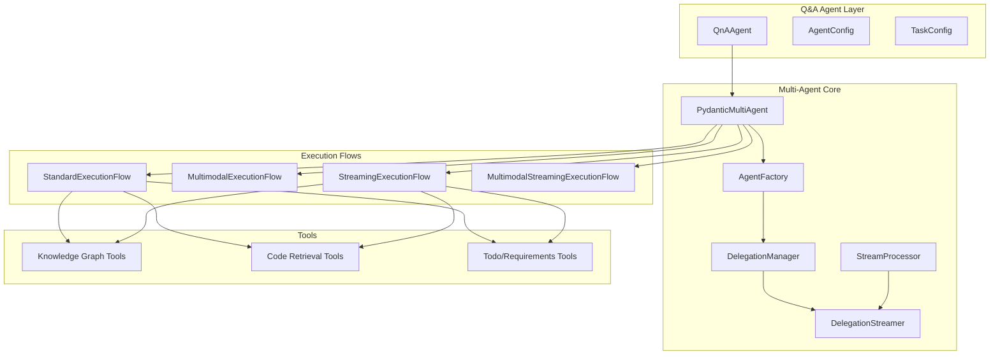
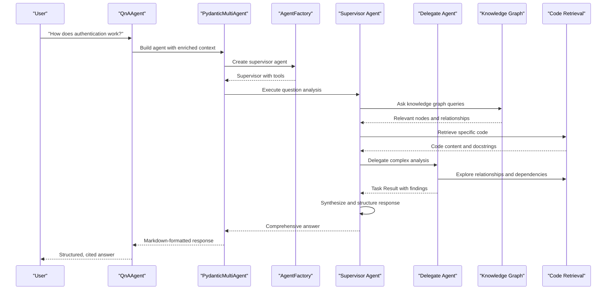
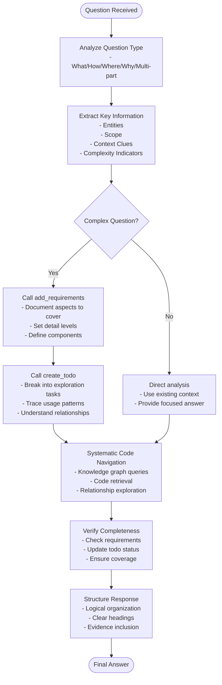
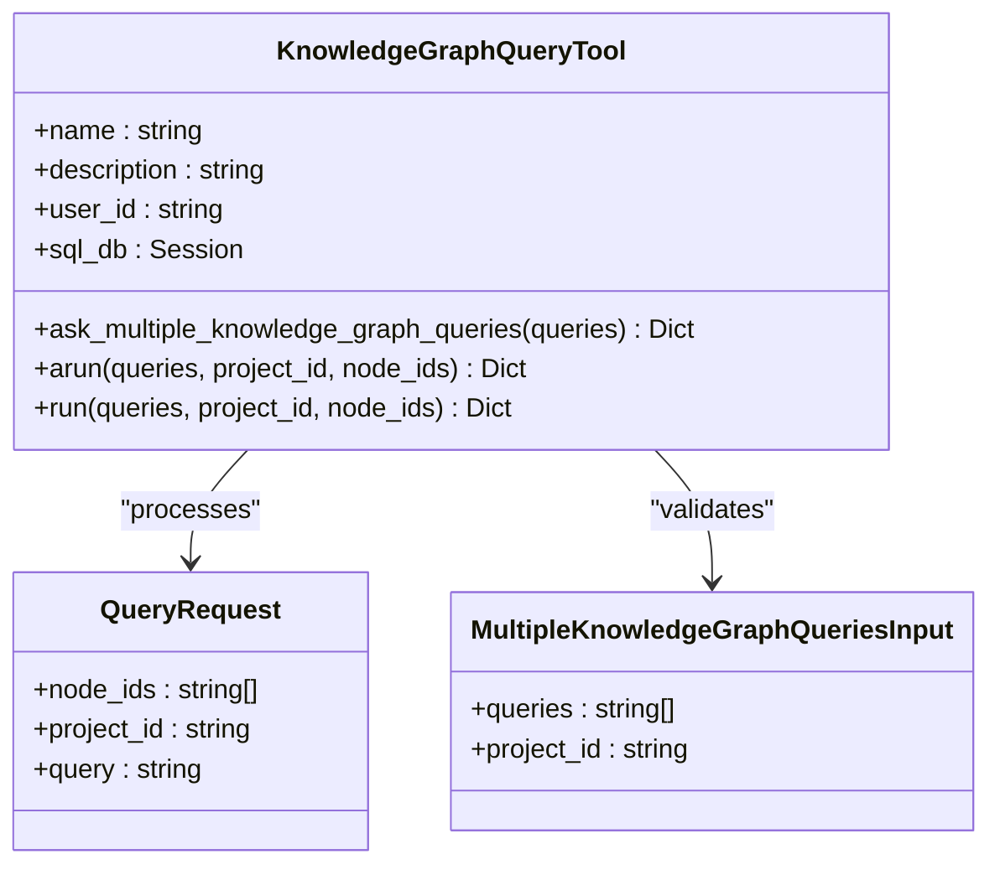
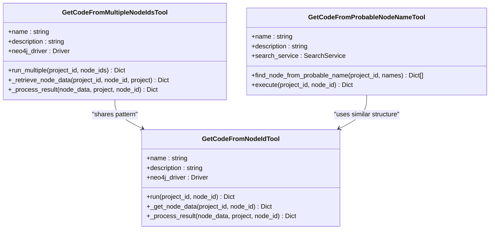
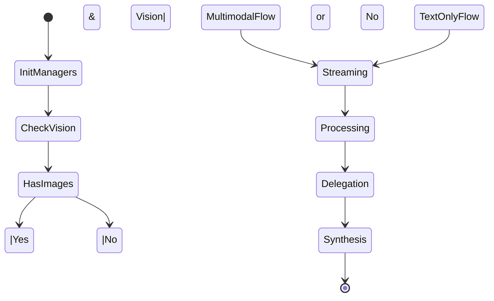
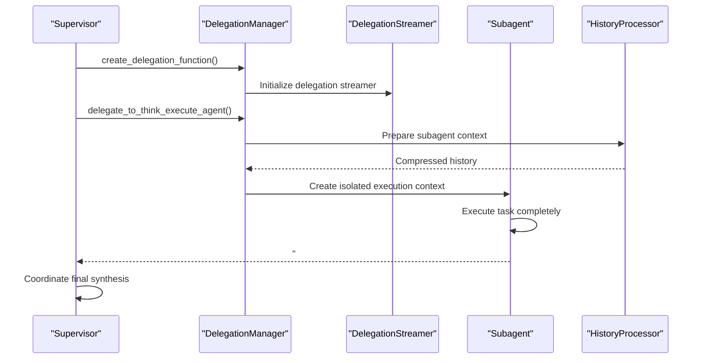
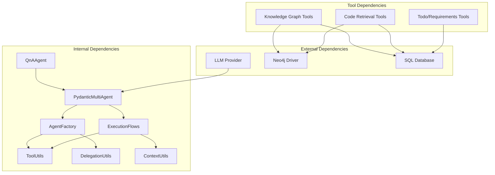

# Codebase Q&A Agent

<cite>
**Referenced Files in This Document**
- [qna_agent.py](file://app/modules/intelligence/agents/chat_agents/system_agents/qna_agent.py)
- [pydantic_multi_agent.py](file://app/modules/intelligence/agents/chat_agents/pydantic_multi_agent.py)
- [agent_factory.py](file://app/modules/intelligence/agents/chat_agents/multi_agent/agent_factory.py)
- [execution_flows.py](file://app/modules/intelligence/agents/chat_agents/multi_agent/execution_flows.py)
- [context_utils.py](file://app/modules/intelligence/agents/chat_agents/multi_agent/utils/context_utils.py)
- [tool_utils.py](file://app/modules/intelligence/agents/chat_agents/multi_agent/utils/tool_utils.py)
- [delegation_utils.py](file://app/modules/intelligence/agents/chat_agents/multi_agent/utils/delegation_utils.py)
- [get_code_from_multiple_node_ids_tool.py](file://app/modules/intelligence/tools/kg_based_tools/get_code_from_multiple_node_ids_tool.py)
- [ask_knowledge_graph_queries_tool.py](file://app/modules/intelligence/tools/kg_based_tools/ask_knowledge_graph_queries_tool.py)
- [get_code_from_node_id_tool.py](file://app/modules/intelligence/tools/kg_based_tools/get_code_from_node_id_tool.py)
- [get_code_from_probable_node_name_tool.py](file://app/modules/intelligence/tools/kg_based_tools/get_code_from_probable_node_name_tool.py)
</cite>

## Table of Contents
1. [Introduction](#introduction)
2. [Project Structure](#project-structure)
3. [Core Components](#core-components)
4. [Architecture Overview](#architecture-overview)
5. [Detailed Component Analysis](#detailed-component-analysis)
6. [Dependency Analysis](#dependency-analysis)
7. [Performance Considerations](#performance-considerations)
8. [Troubleshooting Guide](#troubleshooting-guide)
9. [Conclusion](#conclusion)

## Introduction
The Codebase Q&A Agent is a comprehensive codebase analysis and question-answering specialist designed to systematically explore repositories and deliver well-structured, evidence-backed answers. It implements a multi-step methodology:
- Question analysis: categorizing question types (what, how, where, why) and extracting key entities and scope
- Systematic code navigation: leveraging knowledge graph queries, code retrieval, and contextual analysis
- Context building: assembling comprehensive understanding from multiple code locations and relationships
- Structured response formatting: producing markdown-formatted answers with citations and code examples

The agent integrates seamlessly with the broader intelligence system through the PydanticMultiAgent architecture, enabling delegation to specialized subagents for complex tasks while maintaining a clean supervisor role for coordination and synthesis.

## Project Structure
The Codebase Q&A Agent spans several modules within the intelligence subsystem:

**Diagram sources**
- [qna_agent.py](file://app/modules/intelligence/agents/chat_agents/system_agents/qna_agent.py#L24-L125)
- [pydantic_multi_agent.py](file://app/modules/intelligence/agents/chat_agents/pydantic_multi_agent.py#L38-L167)
- [agent_factory.py](file://app/modules/intelligence/agents/chat_agents/multi_agent/agent_factory.py#L29-L630)

**Section sources**
- [qna_agent.py](file://app/modules/intelligence/agents/chat_agents/system_agents/qna_agent.py#L1-L153)
- [pydantic_multi_agent.py](file://app/modules/intelligence/agents/chat_agents/pydantic_multi_agent.py#L1-L237)

## Core Components
The Codebase Q&A Agent comprises three primary layers:

### QnAAgent (Supervisor)
The QnAAgent serves as the entry point and orchestrator, implementing the structured question-answering methodology. It dynamically selects between PydanticMultiAgent (multi-agent system) and PydanticRagAgent (single-agent) based on model capabilities and configuration.

Key responsibilities:
- Question analysis and task decomposition using TODO requirements
- Enriched context pipeline incorporating node IDs and file structures
- Structured response generation with markdown formatting and citations
- Integration with knowledge graph tools for systematic code navigation

### PydanticMultiAgent (Coordinator)
The PydanticMultiAgent implements the multi-agent architecture with supervisor-subagent delegation patterns. It manages:
- Agent lifecycle and context passing between supervisor and subagents
- Execution flows for both text-only and multimodal scenarios
- Streaming support for real-time collaboration and progress indication
- Error handling and recovery mechanisms

### AgentFactory (Agent Creation)
The AgentFactory constructs specialized agents with appropriate tools and instructions:
- Supervisor agents with delegation, todo, and requirements management tools
- Integration agents (Jira, GitHub, Confluence, Linear) with domain-specific tools
- Delegate agents (THINK_EXECUTE) for focused execution tasks
- Context-aware instruction generation and tool wrapping

**Section sources**
- [qna_agent.py](file://app/modules/intelligence/agents/chat_agents/system_agents/qna_agent.py#L24-L125)
- [pydantic_multi_agent.py](file://app/modules/intelligence/agents/chat_agents/pydantic_multi_agent.py#L38-L167)
- [agent_factory.py](file://app/modules/intelligence/agents/chat_agents/multi_agent/agent_factory.py#L29-L630)

## Architecture Overview
The Codebase Q&A Agent employs a sophisticated multi-agent architecture that balances autonomy with coordination:

**Diagram sources**
- [qna_agent.py](file://app/modules/intelligence/agents/chat_agents/system_agents/qna_agent.py#L144-L152)
- [pydantic_multi_agent.py](file://app/modules/intelligence/agents/chat_agents/pydantic_multi_agent.py#L182-L236)
- [agent_factory.py](file://app/modules/intelligence/agents/chat_agents/multi_agent/agent_factory.py#L595-L630)

The architecture enables:
- **Scalable delegation**: Complex questions are broken into manageable subtasks
- **Evidence-based answers**: Responses are grounded in actual code and relationships
- **Real-time collaboration**: Streaming execution provides immediate feedback
- **Context preservation**: Proper context passing ensures coherent analysis

## Detailed Component Analysis

### Question Analysis and Task Decomposition
The QnAAgent implements a comprehensive methodology for understanding and decomposing questions:

**Diagram sources**
- [qna_agent.py](file://app/modules/intelligence/agents/chat_agents/system_agents/qna_agent.py#L155-L480)

**Section sources**
- [qna_agent.py](file://app/modules/intelligence/agents/chat_agents/system_agents/qna_agent.py#L155-L480)

### Knowledge Graph Integration Pattern
The agent leverages multiple knowledge graph tools for systematic code exploration:

#### Knowledge Graph Query Tool
The ask_knowledge_graph_queries_tool enables natural language queries against the codebase knowledge graph:

**Diagram sources**
- [ask_knowledge_graph_queries_tool.py](file://app/modules/intelligence/tools/kg_based_tools/ask_knowledge_graph_queries_tool.py#L31-L142)

#### Code Retrieval Tools
Multiple specialized tools retrieve code content from the knowledge graph:

**Diagram sources**
- [get_code_from_multiple_node_ids_tool.py](file://app/modules/intelligence/tools/kg_based_tools/get_code_from_multiple_node_ids_tool.py#L23-L185)
- [get_code_from_node_id_tool.py](file://app/modules/intelligence/tools/kg_based_tools/get_code_from_node_id_tool.py#L23-L185)
- [get_code_from_probable_node_name_tool.py](file://app/modules/intelligence/tools/kg_based_tools/get_code_from_probable_node_name_tool.py#L27-L253)

**Section sources**
- [ask_knowledge_graph_queries_tool.py](file://app/modules/intelligence/tools/kg_based_tools/ask_knowledge_graph_queries_tool.py#L1-L143)
- [get_code_from_multiple_node_ids_tool.py](file://app/modules/intelligence/tools/kg_based_tools/get_code_from_multiple_node_ids_tool.py#L1-L186)
- [get_code_from_node_id_tool.py](file://app/modules/intelligence/tools/kg_based_tools/get_code_from_node_id_tool.py#L1-L186)
- [get_code_from_probable_node_name_tool.py](file://app/modules/intelligence/tools/kg_based_tools/get_code_from_probable_node_name_tool.py#L1-L254)

### Multi-Agent Execution Flows
The PydanticMultiAgent implements four distinct execution flows for different interaction patterns:

**Diagram sources**
- [pydantic_multi_agent.py](file://app/modules/intelligence/agents/chat_agents/pydantic_multi_agent.py#L182-L236)
- [execution_flows.py](file://app/modules/intelligence/agents/chat_agents/multi_agent/execution_flows.py#L20-L46)

**Section sources**
- [pydantic_multi_agent.py](file://app/modules/intelligence/agents/chat_agents/pydantic_multi_agent.py#L182-L236)
- [execution_flows.py](file://app/modules/intelligence/agents/chat_agents/multi_agent/execution_flows.py#L52-L425)

### Context Management and Delegation
The delegation system ensures proper context passing between supervisor and subagents:

**Diagram sources**
- [delegation_utils.py](file://app/modules/intelligence/agents/chat_agents/multi_agent/utils/delegation_utils.py#L127-L187)
- [context_utils.py](file://app/modules/intelligence/agents/chat_agents/multi_agent/utils/context_utils.py#L53-L56)

**Section sources**
- [delegation_utils.py](file://app/modules/intelligence/agents/chat_agents/multi_agent/utils/delegation_utils.py#L127-L187)
- [context_utils.py](file://app/modules/intelligence/agents/chat_agents/multi_agent/utils/context_utils.py#L1-L56)

## Dependency Analysis
The Codebase Q&A Agent exhibits well-structured dependencies that promote modularity and maintainability:

**Diagram sources**
- [qna_agent.py](file://app/modules/intelligence/agents/chat_agents/system_agents/qna_agent.py#L1-L34)
- [pydantic_multi_agent.py](file://app/modules/intelligence/agents/chat_agents/pydantic_multi_agent.py#L1-L35)
- [agent_factory.py](file://app/modules/intelligence/agents/chat_agents/multi_agent/agent_factory.py#L1-L26)

**Section sources**
- [qna_agent.py](file://app/modules/intelligence/agents/chat_agents/system_agents/qna_agent.py#L1-L34)
- [pydantic_multi_agent.py](file://app/modules/intelligence/agents/chat_agents/pydantic_multi_agent.py#L1-L35)
- [agent_factory.py](file://app/modules/intelligence/agents/chat_agents/multi_agent/agent_factory.py#L1-L26)

## Performance Considerations
The Codebase Q&A Agent incorporates several performance optimizations:

### Asynchronous Operations
- Concurrent node retrieval using asyncio.gather for multiple code queries
- Non-blocking Neo4j operations with thread pooling
- Parallel execution of knowledge graph queries

### Memory Management
- Response truncation for large code outputs (80,000 character limit)
- Context compression for message history
- Efficient tool result processing and deduplication

### Caching Strategies
- Delegation result caching using MD5 hash keys
- Agent instance caching by conversation ID
- Tool name deduplication to prevent redundant calls

### Streaming Benefits
- Real-time progress indication for long-running operations
- Incremental context building and synthesis
- Early termination of unnecessary tool calls

## Troubleshooting Guide
Common issues and their resolutions:

### Knowledge Graph Access Issues
**Problem**: Nodes not found or incomplete data
**Solution**: Verify project ownership and node existence before retrieval
- Check project_user_id association
- Validate node_id format and existence
- Implement fallback strategies for missing nodes

### Tool Execution Failures
**Problem**: JSON parsing errors or malformed tool arguments
**Solution**: Implement robust error handling and argument sanitization
- Handle truncated JSON gracefully
- Sanitize malformed tool call arguments
- Provide meaningful error messages

### Delegation Coordination Problems
**Problem**: Subagent context not properly isolated
**Solution**: Ensure proper context passing and history compression
- Verify delegation prompt construction
- Check supervisor context extraction
- Monitor delegation result formatting

### Performance Degradation
**Problem**: Slow response times or memory issues
**Solution**: Optimize query patterns and implement caching
- Use concurrent operations for multiple retrievals
- Implement response truncation for large outputs
- Leverage delegation for heavy computations

**Section sources**
- [get_code_from_multiple_node_ids_tool.py](file://app/modules/intelligence/tools/kg_based_tools/get_code_from_multiple_node_ids_tool.py#L62-L98)
- [tool_utils.py](file://app/modules/intelligence/agents/chat_agents/multi_agent/utils/tool_utils.py#L34-L80)
- [delegation_utils.py](file://app/modules/intelligence/agents/chat_agents/multi_agent/utils/delegation_utils.py#L41-L124)

## Conclusion
The Codebase Q&A Agent represents a sophisticated solution for systematic codebase analysis and question answering. Through its multi-agent architecture, structured methodology, and comprehensive tool integration, it delivers evidence-based answers that are both technically accurate and accessible. The system's design emphasizes scalability, maintainability, and user experience through streaming execution, proper context management, and robust error handling. By combining the strengths of knowledge graph queries, targeted code retrieval, and collaborative delegation, the agent provides a comprehensive foundation for codebase exploration and understanding.