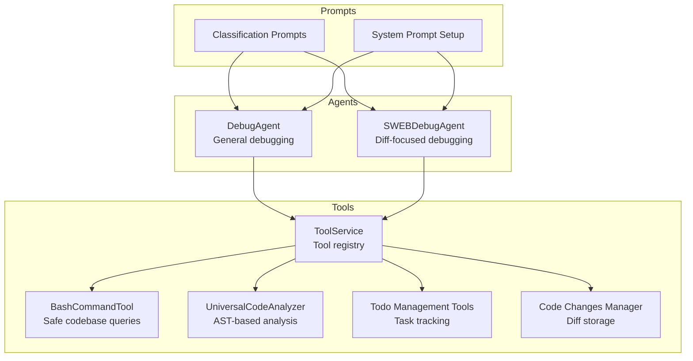
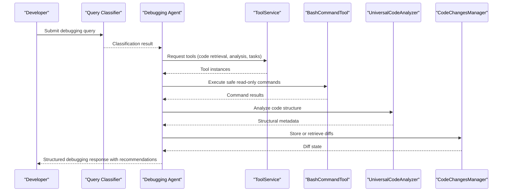
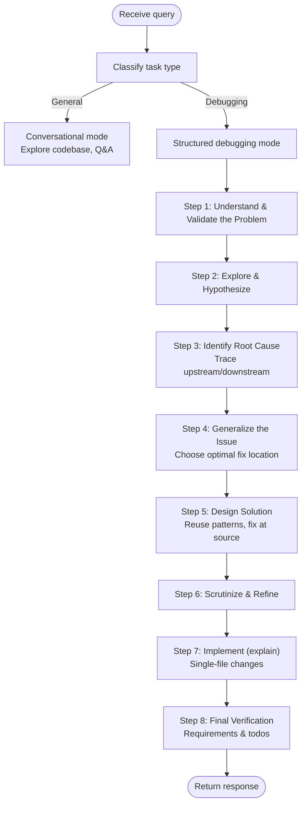
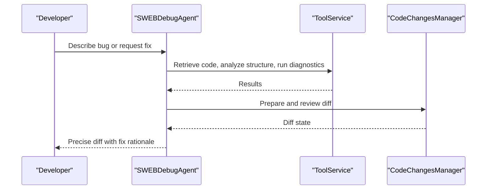
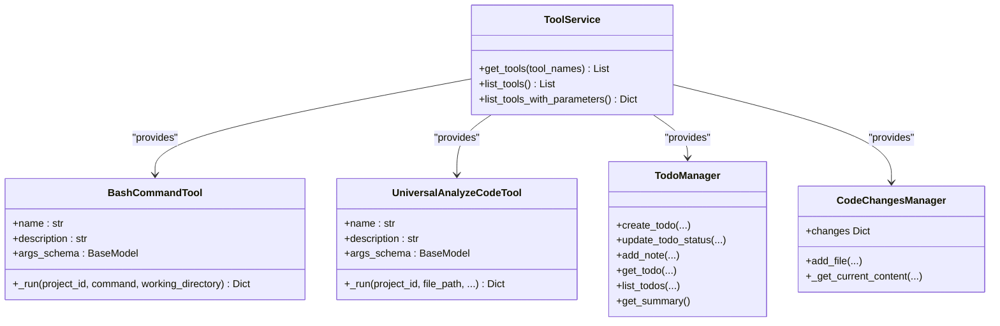
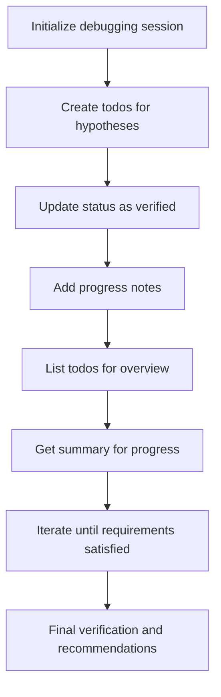
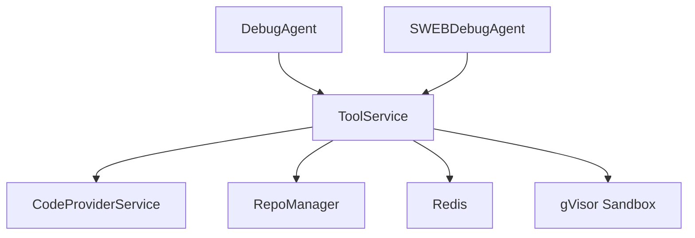

# Debugging Agent

<cite>
**Referenced Files in This Document**
- [debug_agent.py](file://app/modules/intelligence/agents/chat_agents/system_agents/debug_agent.py)
- [sweb_debug_agent.py](file://app/modules/intelligence/agents/chat_agents/system_agents/sweb_debug_agent.py)
- [tool_service.py](file://app/modules/intelligence/tools/tool_service.py)
- [bash_command_tool.py](file://app/modules/intelligence/tools/code_query_tools/bash_command_tool.py)
- [code_analysis.py](file://app/modules/intelligence/tools/code_query_tools/code_analysis.py)
- [todo_management_tool.py](file://app/modules/intelligence/tools/todo_management_tool.py)
- [code_changes_manager.py](file://app/modules/intelligence/tools/code_changes_manager.py)
- [chat_agent.py](file://app/modules/intelligence/agents/chat_agent.py)
- [classification_prompts.py](file://app/modules/intelligence/prompts/classification_prompts.py)
- [system_prompt_setup.py](file://app/modules/intelligence/prompts/system_prompt_setup.py)
</cite>

## Table of Contents
1. [Introduction](#introduction)
2. [Project Structure](#project-structure)
3. [Core Components](#core-components)
4. [Architecture Overview](#architecture-overview)
5. [Detailed Component Analysis](#detailed-component-analysis)
6. [Dependency Analysis](#dependency-analysis)
7. [Performance Considerations](#performance-considerations)
8. [Troubleshooting Guide](#troubleshooting-guide)
9. [Conclusion](#conclusion)

## Introduction
This document describes the Debugging Agent system, a specialized AI assistant designed to help developers systematically identify, analyze, and resolve code issues. The system provides two complementary debugging agents:
- DebugAgent: A general-purpose debugging agent that follows a structured methodology for root cause analysis and solution synthesis.
- SWEBDebugAgent: A specialized agent that focuses on generating precise, single-file diffs for fixes.

Both agents integrate with a rich tool ecosystem to reproduce errors, analyze logs, interpret stack traces, and propose actionable solutions. They support collaborative debugging by tracking tasks, requirements, and code changes across a conversation.

## Project Structure
The Debugging Agent system is organized around:
- Agents: Specialized debugging agents with distinct roles and prompts.
- Tools: A service that exposes a curated set of tools for code exploration, execution, and change management.
- Prompts: Classification and system prompts that guide agent behavior and ensure adherence to debugging best practices.
- Core abstractions: Shared agent interfaces and context models for consistent orchestration.

**Diagram sources**
- [debug_agent.py](file://app/modules/intelligence/agents/chat_agents/system_agents/debug_agent.py#L24-L144)
- [sweb_debug_agent.py](file://app/modules/intelligence/agents/chat_agents/system_agents/sweb_debug_agent.py#L24-L134)
- [tool_service.py](file://app/modules/intelligence/tools/tool_service.py#L99-L263)
- [bash_command_tool.py](file://app/modules/intelligence/tools/code_query_tools/bash_command_tool.py#L445-L800)
- [code_analysis.py](file://app/modules/intelligence/tools/code_query_tools/code_analysis.py#L417-L593)
- [todo_management_tool.py](file://app/modules/intelligence/tools/todo_management_tool.py#L469-L522)
- [code_changes_manager.py](file://app/modules/intelligence/tools/code_changes_manager.py#L218-L343)
- [classification_prompts.py](file://app/modules/intelligence/prompts/classification_prompts.py#L69-L144)
- [system_prompt_setup.py](file://app/modules/intelligence/prompts/system_prompt_setup.py#L102-L195)

**Section sources**
- [debug_agent.py](file://app/modules/intelligence/agents/chat_agents/system_agents/debug_agent.py#L24-L144)
- [sweb_debug_agent.py](file://app/modules/intelligence/agents/chat_agents/system_agents/sweb_debug_agent.py#L24-L134)
- [tool_service.py](file://app/modules/intelligence/tools/tool_service.py#L99-L263)
- [classification_prompts.py](file://app/modules/intelligence/prompts/classification_prompts.py#L69-L144)
- [system_prompt_setup.py](file://app/modules/intelligence/prompts/system_prompt_setup.py#L102-L195)

## Core Components
- DebugAgent: Provides a versatile debugging workflow that switches between conversational exploration and structured root cause analysis. It enriches context with referenced code and delegates to either a PydanticRagAgent or a PydanticMultiAgent depending on configuration and model capabilities.
- SWEBDebugAgent: Specializes in diagnosing bugs and generating precise diffs for fixes, focusing on single-file changes and ensuring no test modifications are made.
- ToolService: Centralized tool registry exposing code exploration, execution, and change management tools. It dynamically constructs tools based on availability and configuration.
- BashCommandTool: Executes read-only bash commands in a sandboxed environment to search code, analyze logs, and gather diagnostics safely.
- UniversalCodeAnalyzer: Performs AST-based analysis across multiple languages to extract classes, functions, methods, and structural metadata.
- Todo Management Tools: Enables task tracking, progress notes, and status updates to maintain structured debugging workflows.
- Code Changes Manager: Manages code modifications in Redis, enabling diff generation and persistence across conversation messages.
- ChatAgent and ChatContext: Shared abstractions for agent orchestration, streaming responses, and context passing.

**Section sources**
- [debug_agent.py](file://app/modules/intelligence/agents/chat_agents/system_agents/debug_agent.py#L24-L144)
- [sweb_debug_agent.py](file://app/modules/intelligence/agents/chat_agents/system_agents/sweb_debug_agent.py#L24-L134)
- [tool_service.py](file://app/modules/intelligence/tools/tool_service.py#L99-L263)
- [bash_command_tool.py](file://app/modules/intelligence/tools/code_query_tools/bash_command_tool.py#L445-L800)
- [code_analysis.py](file://app/modules/intelligence/tools/code_query_tools/code_analysis.py#L417-L593)
- [todo_management_tool.py](file://app/modules/intelligence/tools/todo_management_tool.py#L469-L522)
- [code_changes_manager.py](file://app/modules/intelligence/tools/code_changes_manager.py#L218-L343)
- [chat_agent.py](file://app/modules/intelligence/agents/chat_agent.py#L101-L121)

## Architecture Overview
The Debugging Agent system orchestrates agents and tools to deliver a comprehensive debugging experience. The flow begins with a user query, optionally classified to determine whether general knowledge suffices or a specialized agent is required. Agents then leverage tools to explore code, execute safe diagnostics, and manage tasks and changes.

**Diagram sources**
- [classification_prompts.py](file://app/modules/intelligence/prompts/classification_prompts.py#L69-L144)
- [debug_agent.py](file://app/modules/intelligence/agents/chat_agents/system_agents/debug_agent.py#L134-L144)
- [tool_service.py](file://app/modules/intelligence/tools/tool_service.py#L126-L263)
- [bash_command_tool.py](file://app/modules/intelligence/tools/code_query_tools/bash_command_tool.py#L585-L800)
- [code_analysis.py](file://app/modules/intelligence/tools/code_query_tools/code_analysis.py#L417-L593)
- [code_changes_manager.py](file://app/modules/intelligence/tools/code_changes_manager.py#L218-L343)

## Detailed Component Analysis

### DebugAgent: General Debugging Workflow
DebugAgent adapts its behavior based on the task:
- General queries: Conversational exploration using code navigation and contextual Q&A.
- Debugging tasks: Structured methodology emphasizing root cause identification, upstream/downstream tracing, and strategic fix location decisions.

Key capabilities:
- Context enrichment: Adds referenced code to the agent’s context for grounded responses.
- Multi-agent orchestration: Uses PydanticRagAgent or PydanticMultiAgent depending on model support and configuration.
- Tool integration: Leverages code retrieval, structure analysis, bash commands, and task tracking.

**Diagram sources**
- [debug_agent.py](file://app/modules/intelligence/agents/chat_agents/system_agents/debug_agent.py#L146-L633)

**Section sources**
- [debug_agent.py](file://app/modules/intelligence/agents/chat_agents/system_agents/debug_agent.py#L24-L144)
- [debug_agent.py](file://app/modules/intelligence/agents/chat_agents/system_agents/debug_agent.py#L146-L633)

### SWEBDebugAgent: Diff-Focused Debugging
SWEBDebugAgent emphasizes generating precise diffs for fixes:
- Core principles: Fix at source, preserve patterns, trace before fixing, avoid test modifications, exhaustive verification.
- Workflow: Identical steps to DebugAgent but with a focus on producing a single-file diff and validating it.

**Diagram sources**
- [sweb_debug_agent.py](file://app/modules/intelligence/agents/chat_agents/system_agents/sweb_debug_agent.py#L24-L134)
- [code_changes_manager.py](file://app/modules/intelligence/tools/code_changes_manager.py#L218-L343)

**Section sources**
- [sweb_debug_agent.py](file://app/modules/intelligence/agents/chat_agents/system_agents/sweb_debug_agent.py#L24-L134)
- [sweb_debug_agent.py](file://app/modules/intelligence/agents/chat_agents/system_agents/sweb_debug_agent.py#L136-L534)

### Tool Integration Patterns
ToolService centralizes tool instantiation and selection:
- Code exploration: get_code_from_multiple_node_ids, get_code_file_structure, analyze_code_structure, get_node_neighbours_from_node_id.
- Execution: bash_command for safe, read-only operations.
- Task tracking: create_todo, update_todo_status, add_todo_note, get_todo, list_todos, get_todo_summary.
- Change management: add_file_to_changes, update_file_lines, replace_in_file, insert_lines, delete_lines, get_file_diff, show_diff, clear_file_from_changes, list_files_in_changes, update_file_in_changes, clear_all_changes, get_session_metadata, show_updated_file.

**Diagram sources**
- [tool_service.py](file://app/modules/intelligence/tools/tool_service.py#L99-L263)
- [bash_command_tool.py](file://app/modules/intelligence/tools/code_query_tools/bash_command_tool.py#L445-L800)
- [code_analysis.py](file://app/modules/intelligence/tools/code_query_tools/code_analysis.py#L417-L593)
- [todo_management_tool.py](file://app/modules/intelligence/tools/todo_management_tool.py#L51-L156)
- [code_changes_manager.py](file://app/modules/intelligence/tools/code_changes_manager.py#L218-L343)

**Section sources**
- [tool_service.py](file://app/modules/intelligence/tools/tool_service.py#L126-L263)
- [bash_command_tool.py](file://app/modules/intelligence/tools/code_query_tools/bash_command_tool.py#L445-L800)
- [code_analysis.py](file://app/modules/intelligence/tools/code_query_tools/code_analysis.py#L417-L593)
- [todo_management_tool.py](file://app/modules/intelligence/tools/todo_management_tool.py#L469-L522)
- [code_changes_manager.py](file://app/modules/intelligence/tools/code_changes_manager.py#L218-L343)

### Collaborative Debugging and Task Tracking
The agents use a shared task-tracking mechanism:
- Todos: Create, update status, add notes, list, and summarize tasks to maintain structured debugging progress.
- Requirements: Document generalized issues, affected components, and design fixes to ensure comprehensive coverage.

**Diagram sources**
- [todo_management_tool.py](file://app/modules/intelligence/tools/todo_management_tool.py#L51-L156)
- [debug_agent.py](file://app/modules/intelligence/agents/chat_agents/system_agents/debug_agent.py#L146-L633)
- [sweb_debug_agent.py](file://app/modules/intelligence/agents/chat_agents/system_agents/sweb_debug_agent.py#L136-L534)

**Section sources**
- [todo_management_tool.py](file://app/modules/intelligence/tools/todo_management_tool.py#L51-L156)
- [debug_agent.py](file://app/modules/intelligence/agents/chat_agents/system_agents/debug_agent.py#L146-L633)
- [sweb_debug_agent.py](file://app/modules/intelligence/agents/chat_agents/system_agents/sweb_debug_agent.py#L136-L534)

### Error Handling and Safety
- BashCommandTool enforces a strict whitelist of read-only commands, blocks dangerous patterns, and executes commands in a sandboxed environment to prevent filesystem modifications.
- CodeChangesManager includes timeouts, memory pressure checks, and safe fallbacks to prevent worker hangs and OOM conditions.
- UniversalCodeAnalyzer performs language detection and AST-based analysis with safeguards against malformed inputs.

**Section sources**
- [bash_command_tool.py](file://app/modules/intelligence/tools/code_query_tools/bash_command_tool.py#L326-L428)
- [code_changes_manager.py](file://app/modules/intelligence/tools/code_changes_manager.py#L52-L143)
- [code_analysis.py](file://app/modules/intelligence/tools/code_query_tools/code_analysis.py#L329-L415)

## Dependency Analysis
The agents depend on ToolService for tool availability and on shared abstractions for context and streaming. The tool ecosystem integrates with:
- Code providers for file retrieval and repository operations.
- Sandbox execution for safe diagnostics.
- Redis-backed state for task and change management.

**Diagram sources**
- [debug_agent.py](file://app/modules/intelligence/agents/chat_agents/system_agents/debug_agent.py#L24-L144)
- [sweb_debug_agent.py](file://app/modules/intelligence/agents/chat_agents/system_agents/sweb_debug_agent.py#L24-L134)
- [tool_service.py](file://app/modules/intelligence/tools/tool_service.py#L99-L263)

**Section sources**
- [debug_agent.py](file://app/modules/intelligence/agents/chat_agents/system_agents/debug_agent.py#L24-L144)
- [sweb_debug_agent.py](file://app/modules/intelligence/agents/chat_agents/system_agents/sweb_debug_agent.py#L24-L134)
- [tool_service.py](file://app/modules/intelligence/tools/tool_service.py#L99-L263)

## Performance Considerations
- Tool invocation and streaming: Agents stream partial responses to improve responsiveness. Ensure tool calls are scoped to minimize latency.
- Sandbox execution: BashCommandTool applies timeouts and truncates output to prevent excessive memory usage.
- Code analysis caching: UniversalCodeAnalyzer caches results to reduce repeated computations.
- Memory pressure handling: CodeChangesManager detects high memory usage and skips non-critical operations to avoid worker crashes.

[No sources needed since this section provides general guidance]

## Troubleshooting Guide
Common issues and resolutions:
- Agent not using multi-agent mode: Verify model support for Pydantic and configuration flags. The agent falls back to PydanticRagAgent if multi-agent is disabled or unsupported.
- Bash command failures: Confirm the repository is parsed and available in the repo manager. Ensure commands are whitelisted and read-only.
- Tool output truncation: Some tools truncate large outputs to protect token limits. Review truncated notices and refine queries.
- Memory pressure: If memory usage exceeds thresholds, certain operations are skipped. Reduce concurrent operations or increase worker memory limits.
- Task tracking inconsistencies: Use get_todo_summary to verify overall progress and ensure todos are updated consistently.

**Section sources**
- [debug_agent.py](file://app/modules/intelligence/agents/chat_agents/system_agents/debug_agent.py#L80-L122)
- [bash_command_tool.py](file://app/modules/intelligence/tools/code_query_tools/bash_command_tool.py#L585-L800)
- [code_changes_manager.py](file://app/modules/intelligence/tools/code_changes_manager.py#L104-L143)
- [code_analysis.py](file://app/modules/intelligence/tools/code_query_tools/code_analysis.py#L552-L561)
- [todo_management_tool.py](file://app/modules/intelligence/tools/todo_management_tool.py#L428-L466)

## Conclusion
The Debugging Agent system provides a robust, structured approach to debugging that combines conversational exploration with rigorous root cause analysis. By leveraging a curated toolset, sandboxed diagnostics, and collaborative task tracking, it enables developers to reproduce issues, interpret logs and stack traces, and generate actionable, precise recommendations. The dual-agent design accommodates both general debugging scenarios and focused diff-based fixes, ensuring flexibility across diverse debugging needs.