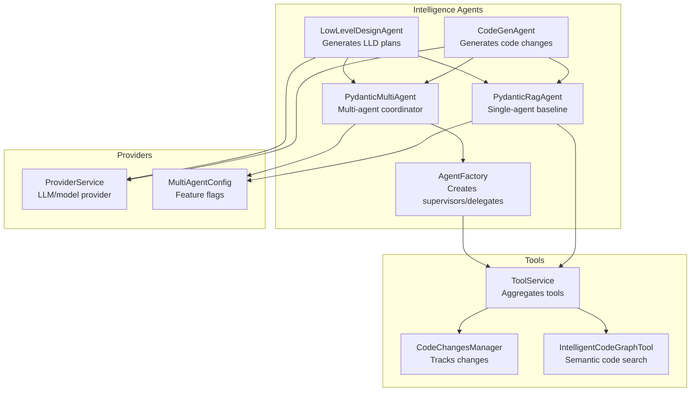
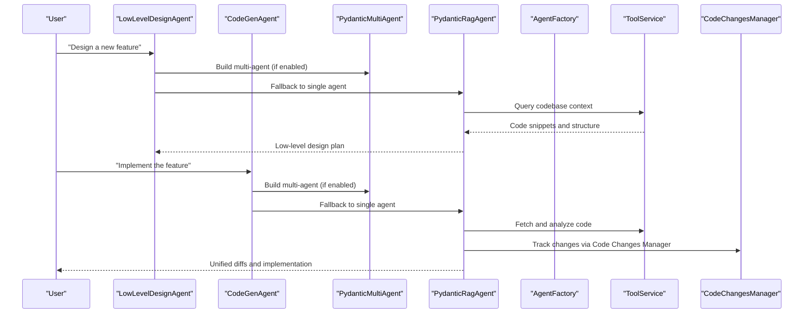
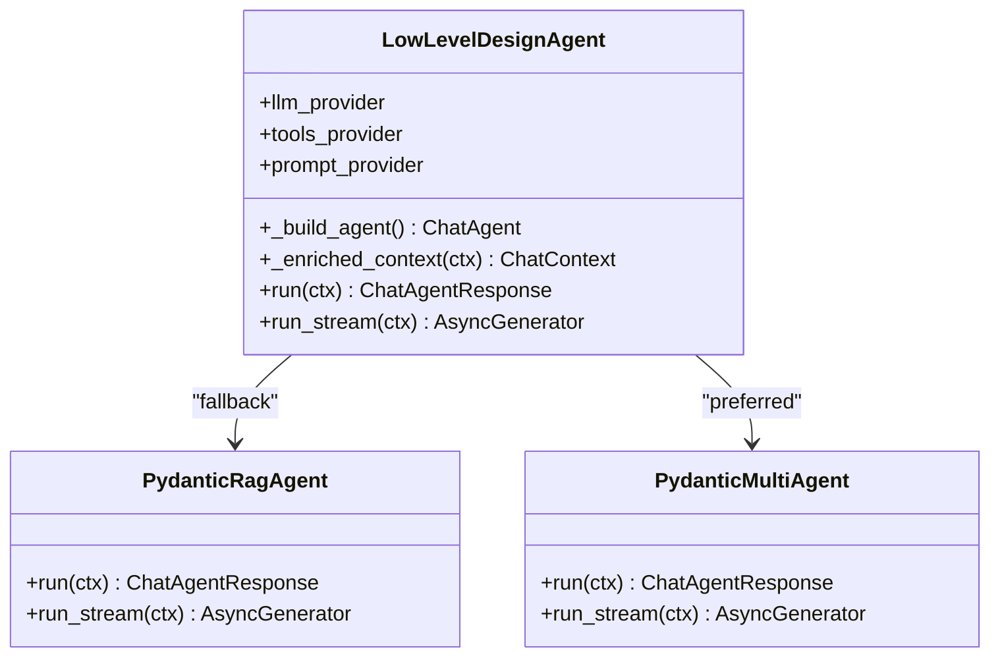
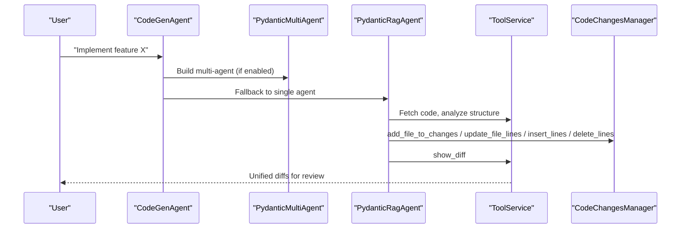
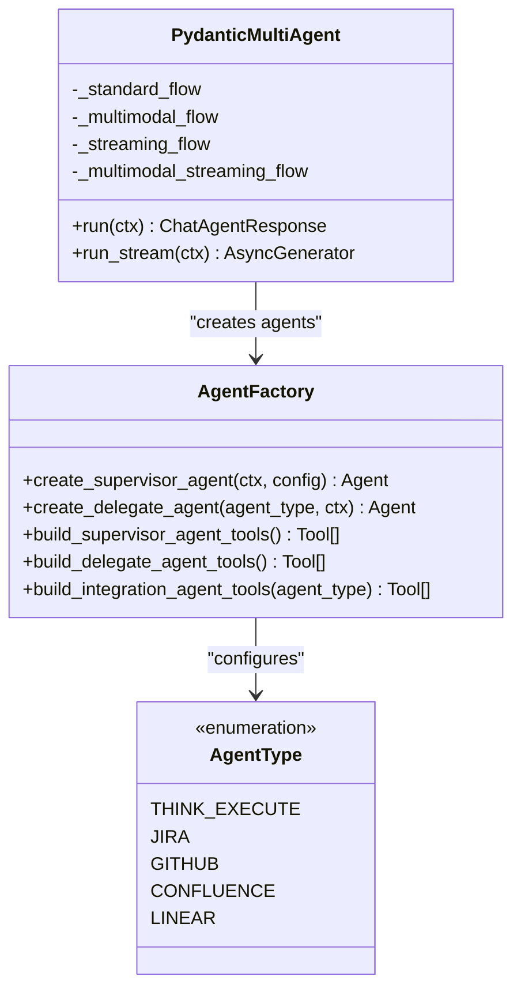
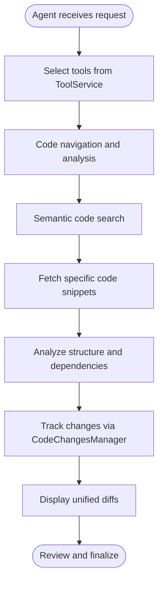
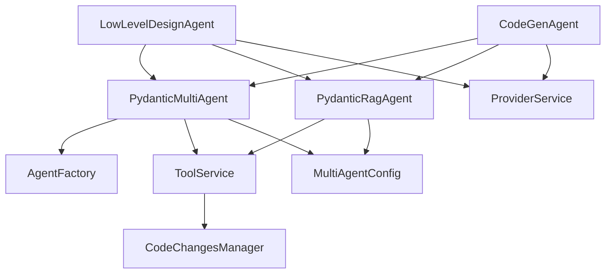

# Design Agents

<cite>
**Referenced Files in This Document**
- [low_level_design_agent.py](file://app/modules/intelligence/agents/chat_agents/system_agents/low_level_design_agent.py)
- [code_gen_agent.py](file://app/modules/intelligence/agents/chat_agents/system_agents/code_gen_agent.py)
- [pydantic_agent.py](file://app/modules/intelligence/agents/chat_agents/pydantic_agent.py)
- [pydantic_multi_agent.py](file://app/modules/intelligence/agents/chat_agents/pydantic_multi_agent.py)
- [agent_factory.py](file://app/modules/intelligence/agents/chat_agents/multi_agent/agent_factory.py)
- [multi_agent_config.py](file://app/modules/intelligence/agents/multi_agent_config.py)
- [agent_config.py](file://app/modules/intelligence/agents/chat_agents/agent_config.py)
- [tool_service.py](file://app/modules/intelligence/tools/tool_service.py)
- [code_changes_manager.py](file://app/modules/intelligence/tools/code_changes_manager.py)
- [classification_prompts.py](file://app/modules/intelligence/prompts/classification_prompts.py)
- [system_prompt_setup.py](file://app/modules/intelligence/prompts/system_prompt_setup.py)
- [provider_service.py](file://app/modules/intelligence/provider/provider_service.py)
- [chat_agent.py](file://app/modules/intelligence/agents/chat_agent.py)
- [intelligent_code_graph_tool.py](file://app/modules/intelligence/tools/code_query_tools/intelligent_code_graph_tool.py)
- [parsing_repomap.py](file://app/modules/parsing/graph_construction/parsing_repomap.py)
</cite>

## Table of Contents
1. [Introduction](#introduction)
2. [Project Structure](#project-structure)
3. [Core Components](#core-components)
4. [Architecture Overview](#architecture-overview)
5. [Detailed Component Analysis](#detailed-component-analysis)
6. [Dependency Analysis](#dependency-analysis)
7. [Performance Considerations](#performance-considerations)
8. [Troubleshooting Guide](#troubleshooting-guide)
9. [Conclusion](#conclusion)
10. [Appendices](#appendices)

## Introduction
This document describes the Design Agents subsystem responsible for two primary capabilities:
- Low-Level Design Agent: Generates detailed, actionable low-level design plans for implementing new features or modifying existing ones.
- Code Generation Agent: Produces precise, copy-paste ready code modifications that maintain project consistency and handle all dependencies.

These agents operate within a broader intelligence framework that leverages LLMs, a rich tool ecosystem, and a multi-agent orchestration system. They assist in both the architecture and implementation phases by:
- Systematically navigating the codebase to understand context
- Recognizing architectural patterns and dependencies
- Generating design specifications and implementing code solutions
- Integrating with development workflows and code review processes

## Project Structure
The Design Agents are implemented as specialized chat agents within the intelligence module. They share common infrastructure:
- Agent configuration and orchestration
- Tool integration and management
- Multi-agent delegation patterns
- Code changes management for implementation tracking and review

**Diagram sources**
- [low_level_design_agent.py](file://app/modules/intelligence/agents/chat_agents/system_agents/low_level_design_agent.py#L24-L132)
- [code_gen_agent.py](file://app/modules/intelligence/agents/chat_agents/system_agents/code_gen_agent.py#L26-L172)
- [pydantic_agent.py](file://app/modules/intelligence/agents/chat_agents/pydantic_agent.py#L66-L199)
- [pydantic_multi_agent.py](file://app/modules/intelligence/agents/chat_agents/pydantic_multi_agent.py#L38-L166)
- [agent_factory.py](file://app/modules/intelligence/agents/chat_agents/multi_agent/agent_factory.py#L29-L630)
- [tool_service.py](file://app/modules/intelligence/tools/tool_service.py#L99-L236)
- [code_changes_manager.py](file://app/modules/intelligence/tools/code_changes_manager.py#L218-L343)
- [provider_service.py](file://app/modules/intelligence/provider/provider_service.py)
- [multi_agent_config.py](file://app/modules/intelligence/agents/multi_agent_config.py#L12-L64)

**Section sources**
- [low_level_design_agent.py](file://app/modules/intelligence/agents/chat_agents/system_agents/low_level_design_agent.py#L24-L132)
- [code_gen_agent.py](file://app/modules/intelligence/agents/chat_agents/system_agents/code_gen_agent.py#L26-L172)
- [pydantic_agent.py](file://app/modules/intelligence/agents/chat_agents/pydantic_agent.py#L66-L199)
- [pydantic_multi_agent.py](file://app/modules/intelligence/agents/chat_agents/pydantic_multi_agent.py#L38-L166)
- [agent_factory.py](file://app/modules/intelligence/agents/chat_agents/multi_agent/agent_factory.py#L29-L630)
- [tool_service.py](file://app/modules/intelligence/tools/tool_service.py#L99-L236)
- [code_changes_manager.py](file://app/modules/intelligence/tools/code_changes_manager.py#L218-L343)
- [multi_agent_config.py](file://app/modules/intelligence/agents/multi_agent_config.py#L12-L64)

## Core Components
- LowLevelDesignAgent: Builds a design plan using codebase context and tool-assisted discovery. It can run as a single PydanticRagAgent or coordinate a multi-agent team via PydanticMultiAgent.
- CodeGenAgent: Implements code changes using a comprehensive toolset and the Code Changes Manager to track and review modifications.
- PydanticRagAgent: A single-agent baseline that uses LLMs with tools for code analysis and generation.
- PydanticMultiAgent: A multi-agent system that coordinates a supervisor and specialized delegate agents (including integration agents).
- AgentFactory: Creates supervisor and delegate agents with tailored tools and instructions.
- ToolService: Aggregates and exposes tools for code navigation, execution, and integration.
- CodeChangesManager: Manages code modifications in Redis, enabling persistent change tracking across conversation messages.
- MultiAgentConfig: Controls whether multi-agent mode is enabled and per-agent overrides via environment variables.
- ProviderService: Supplies LLM capabilities and model configuration to agents.

**Section sources**
- [low_level_design_agent.py](file://app/modules/intelligence/agents/chat_agents/system_agents/low_level_design_agent.py#L24-L132)
- [code_gen_agent.py](file://app/modules/intelligence/agents/chat_agents/system_agents/code_gen_agent.py#L26-L172)
- [pydantic_agent.py](file://app/modules/intelligence/agents/chat_agents/pydantic_agent.py#L66-L199)
- [pydantic_multi_agent.py](file://app/modules/intelligence/agents/chat_agents/pydantic_multi_agent.py#L38-L166)
- [agent_factory.py](file://app/modules/intelligence/agents/chat_agents/multi_agent/agent_factory.py#L29-L630)
- [tool_service.py](file://app/modules/intelligence/tools/tool_service.py#L99-L236)
- [code_changes_manager.py](file://app/modules/intelligence/tools/code_changes_manager.py#L218-L343)
- [multi_agent_config.py](file://app/modules/intelligence/agents/multi_agent_config.py#L12-L64)
- [provider_service.py](file://app/modules/intelligence/provider/provider_service.py)

## Architecture Overview
The Design Agents subsystem integrates LLMs, tools, and orchestration to support design and implementation workflows.

**Diagram sources**
- [low_level_design_agent.py](file://app/modules/intelligence/agents/chat_agents/system_agents/low_level_design_agent.py#L35-L111)
- [code_gen_agent.py](file://app/modules/intelligence/agents/chat_agents/system_agents/code_gen_agent.py#L37-L152)
- [pydantic_agent.py](file://app/modules/intelligence/agents/chat_agents/pydantic_agent.py#L478-L538)
- [pydantic_multi_agent.py](file://app/modules/intelligence/agents/chat_agents/pydantic_multi_agent.py#L182-L206)
- [agent_factory.py](file://app/modules/intelligence/agents/chat_agents/multi_agent/agent_factory.py#L595-L630)
- [tool_service.py](file://app/modules/intelligence/tools/tool_service.py#L99-L236)
- [code_changes_manager.py](file://app/modules/intelligence/tools/code_changes_manager.py#L218-L343)

## Detailed Component Analysis

### Low-Level Design Agent
The LowLevelDesignAgent creates actionable design plans by combining:
- Role and goal configuration
- Tool-assisted codebase exploration
- Optional multi-agent delegation for complex tasks

Key behaviors:
- Detects LLM model capability for Pydantic-based agents
- Chooses between PydanticMultiAgent and PydanticRagAgent based on configuration
- Enriches context with code snippets and repository structure
- Uses a structured prompt to guide design plan creation

**Diagram sources**
- [low_level_design_agent.py](file://app/modules/intelligence/agents/chat_agents/system_agents/low_level_design_agent.py#L24-L132)
- [pydantic_agent.py](file://app/modules/intelligence/agents/chat_agents/pydantic_agent.py#L478-L538)
- [pydantic_multi_agent.py](file://app/modules/intelligence/agents/chat_agents/pydantic_multi_agent.py#L182-L206)

Implementation specifics:
- Context enrichment pulls code snippets for node IDs and repository structure to inform design decisions.
- The agent selects multi-agent mode based on model capabilities and environment configuration.
- The design plan includes high-level approach, detailed implementation steps, potential challenges, and consistency guidance.

Practical example scenarios:
- Designing a new authentication module: The agent explores existing auth patterns, identifies required files and dependencies, and proposes a step-by-step implementation plan.
- Extending an existing feature: The agent traces related code, analyzes control flow, and outlines incremental changes with compatibility considerations.

**Section sources**
- [low_level_design_agent.py](file://app/modules/intelligence/agents/chat_agents/system_agents/low_level_design_agent.py#L24-L132)
- [agent_config.py](file://app/modules/intelligence/agents/chat_agents/agent_config.py#L6-L21)
- [multi_agent_config.py](file://app/modules/intelligence/agents/multi_agent_config.py#L46-L64)

### Code Generation Agent
The CodeGenAgent generates precise code modifications and maintains consistency with the existing codebase. It uses:
- A comprehensive toolset for code navigation and execution
- The Code Changes Manager to track and review modifications
- A structured prompt guiding implementation planning and quality assurance

Key behaviors:
- Detects LLM model capability for Pydantic-based agents
- Chooses between PydanticMultiAgent and PydanticRagAgent based on configuration
- Enriches context with referenced code snippets
- Implements changes using Code Changes Manager tools and displays unified diffs

**Diagram sources**
- [code_gen_agent.py](file://app/modules/intelligence/agents/chat_agents/system_agents/code_gen_agent.py#L26-L172)
- [pydantic_agent.py](file://app/modules/intelligence/agents/chat_agents/pydantic_agent.py#L478-L538)
- [pydantic_multi_agent.py](file://app/modules/intelligence/agents/chat_agents/pydantic_multi_agent.py#L182-L206)
- [tool_service.py](file://app/modules/intelligence/tools/tool_service.py#L99-L236)
- [code_changes_manager.py](file://app/modules/intelligence/tools/code_changes_manager.py#L218-L343)

Implementation specifics:
- The agent performs dependency analysis, recognizes code patterns, and plans changes systematically.
- It uses Code Changes Manager tools to add, update, insert, and delete code with verifiable line numbers and change summaries.
- Quality assurance includes completeness checks, formatting preservation, import coverage, and database/API change documentation.

Practical example scenarios:
- Adding user authentication: The agent identifies user model patterns, API structure, and database schema conventions, then implements changes across multiple files with proper imports and migration steps.
- Refactoring a function: The agent traces control flow, identifies dependencies, and proposes targeted changes while preserving existing patterns.

**Section sources**
- [code_gen_agent.py](file://app/modules/intelligence/agents/chat_agents/system_agents/code_gen_agent.py#L26-L172)
- [code_changes_manager.py](file://app/modules/intelligence/tools/code_changes_manager.py#L218-L343)

### Multi-Agent Orchestration
The multi-agent system coordinates a supervisor and specialized delegate agents:
- Supervisor agent manages delegation, todo management, requirement verification, and code changes tracking.
- Delegate agents include THINK_EXECUTE for focused task execution and integration agents for Jira, GitHub, Confluence, and Linear.
- AgentFactory constructs agents with tailored tools and instructions, enabling parallelized and isolated execution.

**Diagram sources**
- [pydantic_multi_agent.py](file://app/modules/intelligence/agents/chat_agents/pydantic_multi_agent.py#L38-L166)
- [agent_factory.py](file://app/modules/intelligence/agents/chat_agents/multi_agent/agent_factory.py#L29-L630)

Configuration and environment controls:
- MultiAgentConfig toggles global and per-agent multi-agent modes via environment variables.
- AgentType enumerates supported delegate agent categories.

**Section sources**
- [pydantic_multi_agent.py](file://app/modules/intelligence/agents/chat_agents/pydantic_multi_agent.py#L38-L166)
- [agent_factory.py](file://app/modules/intelligence/agents/chat_agents/multi_agent/agent_factory.py#L29-L630)
- [multi_agent_config.py](file://app/modules/intelligence/agents/multi_agent_config.py#L12-L64)

### Tool Integration Patterns
The agents rely on a rich tool ecosystem:
- ToolService aggregates tools for code navigation, execution, integration, and management.
- IntelligentCodeGraphTool and related parsing utilities enable semantic code search and tag-based discovery.
- CodeChangesManager persists changes across conversation messages and provides diff visualization.

**Diagram sources**
- [tool_service.py](file://app/modules/intelligence/tools/tool_service.py#L99-L236)
- [intelligent_code_graph_tool.py](file://app/modules/intelligence/tools/code_query_tools/intelligent_code_graph_tool.py#L297-L332)
- [parsing_repomap.py](file://app/modules/parsing/graph_construction/parsing_repomap.py#L203-L251)
- [code_changes_manager.py](file://app/modules/intelligence/tools/code_changes_manager.py#L218-L343)

**Section sources**
- [tool_service.py](file://app/modules/intelligence/tools/tool_service.py#L99-L236)
- [intelligent_code_graph_tool.py](file://app/modules/intelligence/tools/code_query_tools/intelligent_code_graph_tool.py#L297-L332)
- [parsing_repomap.py](file://app/modules/parsing/graph_construction/parsing_repomap.py#L203-L251)
- [code_changes_manager.py](file://app/modules/intelligence/tools/code_changes_manager.py#L218-L343)

### Design Methodologies and Workflows
- Low-level design documentation: The LowLevelDesignAgent produces structured plans with implementation steps, file modifications, and consistency guidance.
- Architectural pattern recognition: Tools assist in discovering backend/frontend patterns and integration points to align new designs with existing architecture.
- Code generation from specifications: The CodeGenAgent translates design plans into precise code changes using the Code Changes Manager and displays unified diffs for review.
- Implementation planning: Both agents perform dependency analysis, recognize code patterns, and plan changes systematically with verifiable line numbers and summaries.

Classification and routing:
- ClassificationPrompts determine whether a design query requires general knowledge or codebase-specific analysis.
- SystemPromptSetup defines response strategies for different query types and stages.

**Section sources**
- [low_level_design_agent.py](file://app/modules/intelligence/agents/chat_agents/system_agents/low_level_design_agent.py#L142-L170)
- [code_gen_agent.py](file://app/modules/intelligence/agents/chat_agents/system_agents/code_gen_agent.py#L175-L662)
- [classification_prompts.py](file://app/modules/intelligence/prompts/classification_prompts.py#L429-L489)
- [system_prompt_setup.py](file://app/modules/intelligence/prompts/system_prompt_setup.py#L216-L322)

## Dependency Analysis
The Design Agents subsystem exhibits layered dependencies:
- Agents depend on ProviderService for LLM capabilities and model configuration.
- Multi-agent orchestration depends on AgentFactory and MultiAgentConfig.
- Tool integration depends on ToolService and specific tool implementations.
- Code changes depend on CodeChangesManager and underlying storage.

**Diagram sources**
- [low_level_design_agent.py](file://app/modules/intelligence/agents/chat_agents/system_agents/low_level_design_agent.py#L24-L132)
- [code_gen_agent.py](file://app/modules/intelligence/agents/chat_agents/system_agents/code_gen_agent.py#L26-L172)
- [pydantic_multi_agent.py](file://app/modules/intelligence/agents/chat_agents/pydantic_multi_agent.py#L38-L166)
- [agent_factory.py](file://app/modules/intelligence/agents/chat_agents/multi_agent/agent_factory.py#L29-L630)
- [tool_service.py](file://app/modules/intelligence/tools/tool_service.py#L99-L236)
- [code_changes_manager.py](file://app/modules/intelligence/tools/code_changes_manager.py#L218-L343)
- [provider_service.py](file://app/modules/intelligence/provider/provider_service.py)
- [multi_agent_config.py](file://app/modules/intelligence/agents/multi_agent_config.py#L12-L64)

**Section sources**
- [low_level_design_agent.py](file://app/modules/intelligence/agents/chat_agents/system_agents/low_level_design_agent.py#L24-L132)
- [code_gen_agent.py](file://app/modules/intelligence/agents/chat_agents/system_agents/code_gen_agent.py#L26-L172)
- [pydantic_multi_agent.py](file://app/modules/intelligence/agents/chat_agents/pydantic_multi_agent.py#L38-L166)
- [agent_factory.py](file://app/modules/intelligence/agents/chat_agents/multi_agent/agent_factory.py#L29-L630)
- [tool_service.py](file://app/modules/intelligence/tools/tool_service.py#L99-L236)
- [code_changes_manager.py](file://app/modules/intelligence/tools/code_changes_manager.py#L218-L343)
- [multi_agent_config.py](file://app/modules/intelligence/agents/multi_agent_config.py#L12-L64)

## Performance Considerations
- Multi-agent mode adds orchestration overhead but improves scalability and modularity for complex tasks.
- Tool usage should be minimized when unnecessary to reduce latency and token consumption.
- CodeChangesManager persists changes in Redis with TTL to balance persistence and memory usage.
- Memory pressure checks and timeouts protect against long-running operations and worker crashes.
- Parallel tool calls are disabled when the model lacks support to avoid errors.

[No sources needed since this section provides general guidance]

## Troubleshooting Guide
Common issues and resolutions:
- Multi-agent disabled: If environment variables disable multi-agent mode, agents fall back to PydanticRagAgent. Verify configuration and model capabilities.
- Tool failures: Tools wrap exceptions and return graceful error messages. Retry operations or switch to alternative tools.
- Memory pressure: CodeChangesManager detects memory pressure and skips non-critical operations to prevent OOM kills.
- Long-running operations: Timeouts are enforced for database queries and git operations to prevent deadlocks and worker hangs.
- Vision model mismatch: If images are provided but the model doesn't support vision, the agent proceeds with text-only execution.

**Section sources**
- [multi_agent_config.py](file://app/modules/intelligence/agents/multi_agent_config.py#L46-L64)
- [pydantic_agent.py](file://app/modules/intelligence/agents/chat_agents/pydantic_agent.py#L54-L63)
- [code_changes_manager.py](file://app/modules/intelligence/tools/code_changes_manager.py#L104-L142)
- [code_changes_manager.py](file://app/modules/intelligence/tools/code_changes_manager.py#L52-L101)

## Conclusion
The Design Agents subsystem provides robust capabilities for both design and implementation phases:
- LowLevelDesignAgent delivers structured, actionable design plans by leveraging codebase context and tool-assisted discovery.
- CodeGenAgent produces precise, consistent code modifications using a comprehensive toolset and the Code Changes Manager for review.
- Multi-agent orchestration enhances scalability and modularity, while configuration controls enable flexible deployment strategies.
- Integration with development workflows and code review processes is streamlined through unified diffs and persistent change tracking.

[No sources needed since this section summarizes without analyzing specific files]

## Appendices

### Configuration Options
- Multi-agent mode controls:
  - Global toggle: ENABLE_MULTI_AGENT
  - Per-agent toggles: GENERAL_PURPOSE_MULTI_AGENT, CODE_GEN_MULTI_AGENT, QNA_MULTI_AGENT, DEBUG_MULTI_AGENT, UNIT_TEST_MULTI_AGENT, INTEGRATION_TEST_MULTI_AGENT, LLD_MULTI_AGENT, CODE_CHANGES_MULTI_AGENT, CUSTOM_AGENT_MULTI_AGENT
- Environment variables:
  - ENABLE_MULTI_AGENT=true
  - LLD_MULTI_AGENT=true
  - CODE_GEN_MULTI_AGENT=true
  - CUSTOM_AGENT_MULTI_AGENT=true

**Section sources**
- [multi_agent_config.py](file://app/modules/intelligence/agents/multi_agent_config.py#L96-L118)

### Design Pattern Libraries and Architectural Frameworks
- IntelligentCodeGraphTool and parsing utilities support semantic code search and tag-based discovery to recognize backend/frontend patterns and integration points.
- CodeChangesManager provides a framework for tracking and reviewing changes consistently across the codebase.

**Section sources**
- [intelligent_code_graph_tool.py](file://app/modules/intelligence/tools/code_query_tools/intelligent_code_graph_tool.py#L297-L332)
- [parsing_repomap.py](file://app/modules/parsing/graph_construction/parsing_repomap.py#L203-L251)
- [code_changes_manager.py](file://app/modules/intelligence/tools/code_changes_manager.py#L218-L343)

### Integration with Development Workflows and Code Review Processes
- Unified diffs are generated and streamed directly to users via show_diff, enabling easy review and approval.
- Code Changes Manager persists changes across conversation messages, supporting iterative development and review cycles.
- Integration agents (Jira, GitHub, Confluence, Linear) streamline workflow automation and documentation updates.

**Section sources**
- [code_gen_agent.py](file://app/modules/intelligence/agents/chat_agents/system_agents/code_gen_agent.py#L495-L521)
- [code_changes_manager.py](file://app/modules/intelligence/tools/code_changes_manager.py#L218-L343)
- [agent_factory.py](file://app/modules/intelligence/agents/chat_agents/multi_agent/agent_factory.py#L135-L205)