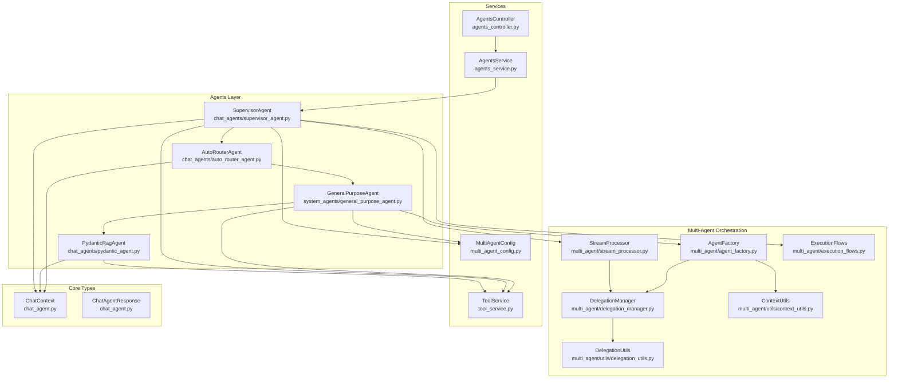
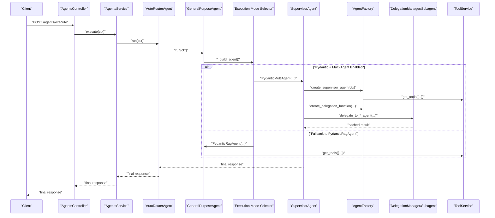
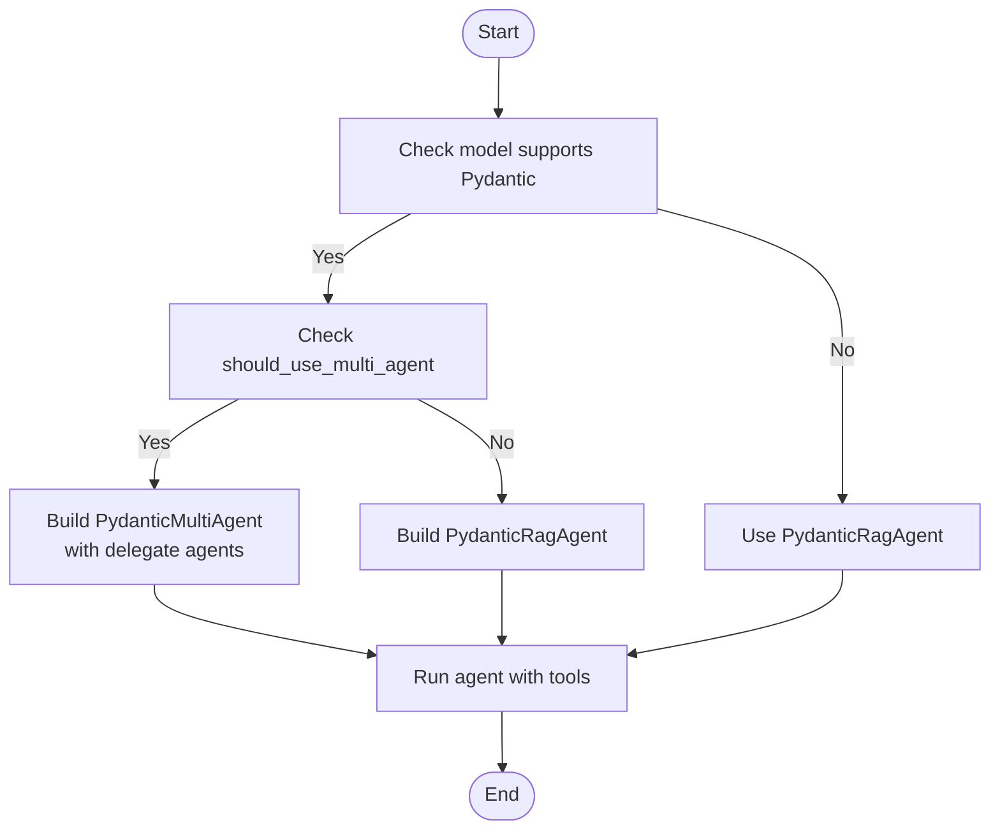
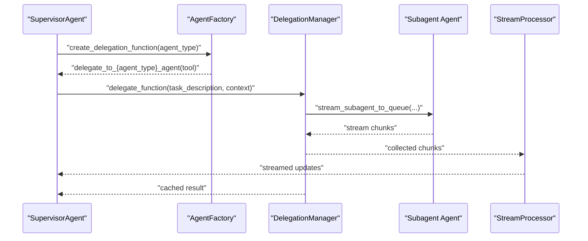
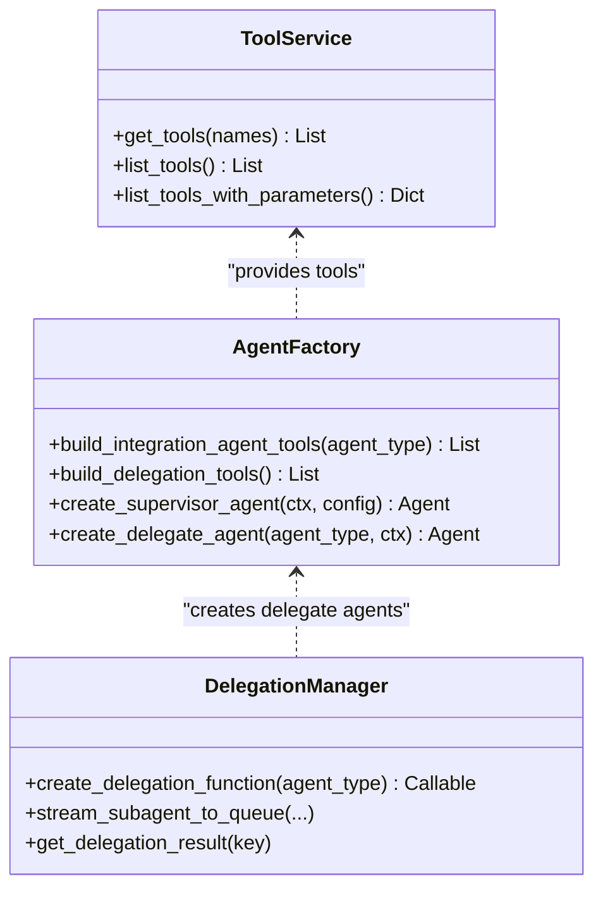
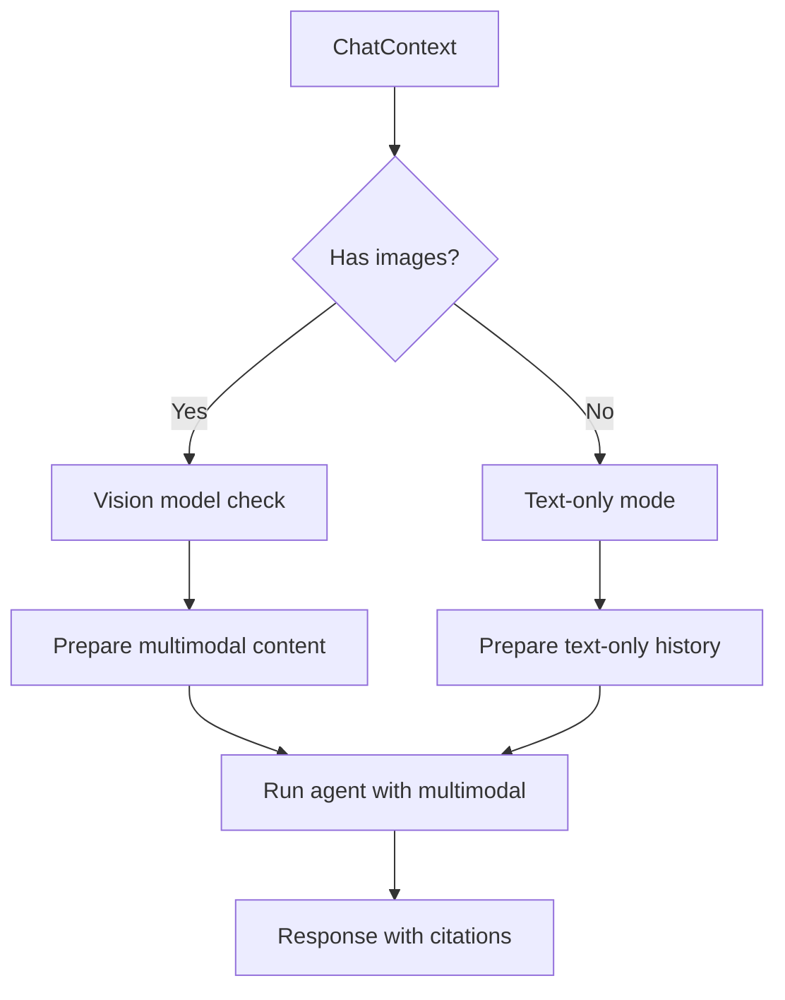
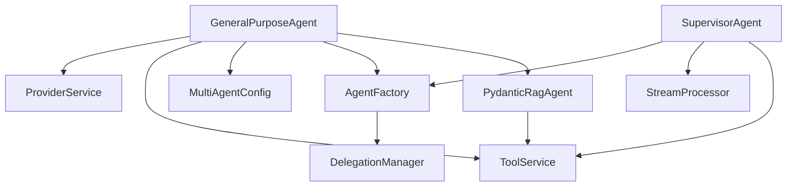

# General Purpose Agent

<cite>
**Referenced Files in This Document**
- [general_purpose_agent.py](file://app/modules/intelligence/agents/chat_agents/system_agents/general_purpose_agent.py)
- [chat_agent.py](file://app/modules/intelligence/agents/chat_agent.py)
- [agents_service.py](file://app/modules/intelligence/agents/agents_service.py)
- [agents_controller.py](file://app/modules/intelligence/agents/agents_controller.py)
- [multi_agent_config.py](file://app/modules/intelligence/agents/multi_agent_config.py)
- [agent_factory.py](file://app/modules/intelligence/agents/chat_agents/multi_agent/agent_factory.py)
- [delegation_manager.py](file://app/modules/intelligence/agents/chat_agents/multi_agent/delegation_manager.py)
- [supervisor_agent.py](file://app/modules/intelligence/agents/chat_agents/supervisor_agent.py)
- [auto_router_agent.py](file://app/modules/intelligence/agents/chat_agents/auto_router_agent.py)
- [pydantic_agent.py](file://app/modules/intelligence/agents/chat_agents/pydantic_agent.py)
- [tool_service.py](file://app/modules/intelligence/tools/tool_service.py)
- [execution_flows.py](file://app/modules/intelligence/agents/chat_agents/multi_agent/execution_flows.py)
- [stream_processor.py](file://app/modules/intelligence/agents/chat_agents/multi_agent/stream_processor.py)
- [context_utils.py](file://app/modules/intelligence/agents/chat_agents/multi_agent/utils/context_utils.py)
- [delegation_utils.py](file://app/modules/intelligence/agents/chat_agents/multi_agent/utils/delegation_utils.py)
</cite>

## Table of Contents
1. [Introduction](#introduction)
2. [Project Structure](#project-structure)
3. [Core Components](#core-components)
4. [Architecture Overview](#architecture-overview)
5. [Detailed Component Analysis](#detailed-component-analysis)
6. [Dependency Analysis](#dependency-analysis)
7. [Performance Considerations](#performance-considerations)
8. [Troubleshooting Guide](#troubleshooting-guide)
9. [Conclusion](#conclusion)

## Introduction
The General Purpose Agent is a versatile AI assistant designed to handle diverse development tasks, answer varied questions, and provide flexible, context-aware support across multiple domains. It adapts dynamically to user needs by selecting between single-agent and multi-agent execution modes, integrating specialized tools, coordinating subagents, and maintaining high-quality responses through robust context management and streaming.

Key capabilities:
- Adaptive execution: Chooses between Pydantic RAG agent and multi-agent system depending on model capabilities and configuration.
- Dynamic tool selection: Loads tools based on task requirements and integrates web search and extraction alongside codebase tools.
- Multi-domain knowledge application: Supports general queries and leverages external tools for web-based research.
- Flexible response generation: Provides markdown-formatted, citation-backed answers tailored to question type and conversation context.
- Context switching: Manages multimodal inputs (images) and conversation history to maintain relevance across turns.

## Project Structure
The General Purpose Agent resides within the intelligence agents subsystem and integrates with tool services, provider services, and multi-agent orchestration components.

**Diagram sources**
- [general_purpose_agent.py](file://app/modules/intelligence/agents/chat_agents/system_agents/general_purpose_agent.py#L26-L120)
- [supervisor_agent.py](file://app/modules/intelligence/agents/chat_agents/supervisor_agent.py#L9-L25)
- [auto_router_agent.py](file://app/modules/intelligence/agents/chat_agents/auto_router_agent.py#L13-L38)
- [pydantic_agent.py](file://app/modules/intelligence/agents/chat_agents/pydantic_agent.py#L66-L200)
- [agent_factory.py](file://app/modules/intelligence/agents/chat_agents/multi_agent/agent_factory.py#L29-L120)
- [delegation_manager.py](file://app/modules/intelligence/agents/chat_agents/multi_agent/delegation_manager.py#L25-L75)
- [stream_processor.py](file://app/modules/intelligence/agents/chat_agents/multi_agent/stream_processor.py#L39-L86)
- [execution_flows.py](file://app/modules/intelligence/agents/chat_agents/multi_agent/execution_flows.py#L52-L127)
- [context_utils.py](file://app/modules/intelligence/agents/chat_agents/multi_agent/utils/context_utils.py#L6-L56)
- [delegation_utils.py](file://app/modules/intelligence/agents/chat_agents/multi_agent/utils/delegation_utils.py#L12-L40)
- [agents_service.py](file://app/modules/intelligence/agents/agents_service.py#L47-L150)
- [agents_controller.py](file://app/modules/intelligence/agents/agents_controller.py#L13-L35)
- [tool_service.py](file://app/modules/intelligence/tools/tool_service.py#L99-L242)
- [multi_agent_config.py](file://app/modules/intelligence/agents/multi_agent_config.py#L12-L80)
- [chat_agent.py](file://app/modules/intelligence/agents/chat_agent.py#L54-L121)

**Section sources**
- [general_purpose_agent.py](file://app/modules/intelligence/agents/chat_agents/system_agents/general_purpose_agent.py#L26-L120)
- [agents_service.py](file://app/modules/intelligence/agents/agents_service.py#L47-L150)
- [agents_controller.py](file://app/modules/intelligence/agents/agents_controller.py#L13-L35)
- [multi_agent_config.py](file://app/modules/intelligence/agents/multi_agent_config.py#L12-L80)
- [chat_agent.py](file://app/modules/intelligence/agents/chat_agent.py#L54-L121)

## Core Components
- GeneralPurposeAgent: Orchestrates agent instantiation and execution, selecting between Pydantic RAG and multi-agent modes based on model capabilities and configuration. It builds a Pydantic RAG agent or a Pydantic Multi-Agent system with integrated subagents and tools.
- AgentsService: Registers system agents (including the General Purpose Agent) and exposes execution and listing APIs via the controller.
- SupervisorAgent and AutoRouterAgent: Route to the current agent based on context and delegate to subagents when needed.
- AgentFactory: Creates supervisor and delegate agents, builds tool sets (including delegation tools), and manages integration-specific tools.
- DelegationManager: Coordinates subagent execution, streaming, caching, and result synthesis for delegation tools.
- StreamProcessor: Processes agent run nodes, handles tool call/result events, and streams real-time updates to clients.
- ToolService: Centralized provider of tools (web search, extraction, code queries, integrations) used by agents.
- MultiAgentConfig: Controls global and per-agent multi-agent enablement via environment variables.
- PydanticRagAgent: Executes single-agent RAG-style tasks with multimodal support and streaming.
- ChatContext and ChatAgentResponse: Core data structures for context and response handling, including tool call events and citations.

**Section sources**
- [general_purpose_agent.py](file://app/modules/intelligence/agents/chat_agents/system_agents/general_purpose_agent.py#L26-L120)
- [agents_service.py](file://app/modules/intelligence/agents/agents_service.py#L47-L150)
- [supervisor_agent.py](file://app/modules/intelligence/agents/chat_agents/supervisor_agent.py#L9-L25)
- [auto_router_agent.py](file://app/modules/intelligence/agents/chat_agents/auto_router_agent.py#L13-L38)
- [agent_factory.py](file://app/modules/intelligence/agents/chat_agents/multi_agent/agent_factory.py#L29-L120)
- [delegation_manager.py](file://app/modules/intelligence/agents/chat_agents/multi_agent/delegation_manager.py#L25-L75)
- [stream_processor.py](file://app/modules/intelligence/agents/chat_agents/multi_agent/stream_processor.py#L39-L86)
- [tool_service.py](file://app/modules/intelligence/tools/tool_service.py#L99-L242)
- [multi_agent_config.py](file://app/modules/intelligence/agents/multi_agent_config.py#L12-L80)
- [pydantic_agent.py](file://app/modules/intelligence/agents/chat_agents/pydantic_agent.py#L66-L200)
- [chat_agent.py](file://app/modules/intelligence/agents/chat_agent.py#L54-L121)

## Architecture Overview
The General Purpose Agent operates within a layered architecture:
- Controller and Service: Expose endpoints and manage agent lifecycle.
- Routing: AutoRouter selects the current agent from context.
- Execution Modes:
  - Single-agent: Pydantic RAG agent for general tasks with tool access.
  - Multi-agent: Supervisor orchestrates delegation to specialized subagents (Jira, GitHub, Confluence, Linear, THINK_EXECUTE) with real-time streaming and result synthesis.
- Tools: Unified tool catalog via ToolService, filtered and wrapped for agent use.
- Context and Streaming: Rich context handling (project, node IDs, images) and streaming via StreamProcessor and DelegationManager.

**Diagram sources**
- [agents_controller.py](file://app/modules/intelligence/agents/agents_controller.py#L13-L35)
- [agents_service.py](file://app/modules/intelligence/agents/agents_service.py#L151-L156)
- [auto_router_agent.py](file://app/modules/intelligence/agents/chat_agents/auto_router_agent.py#L24-L37)
- [general_purpose_agent.py](file://app/modules/intelligence/agents/chat_agents/system_agents/general_purpose_agent.py#L37-L120)
- [agent_factory.py](file://app/modules/intelligence/agents/chat_agents/multi_agent/agent_factory.py#L595-L630)
- [delegation_manager.py](file://app/modules/intelligence/agents/chat_agents/multi_agent/delegation_manager.py#L57-L225)
- [tool_service.py](file://app/modules/intelligence/tools/tool_service.py#L126-L132)

## Detailed Component Analysis

### GeneralPurposeAgent
Responsibilities:
- Builds the appropriate agent based on model capabilities and configuration.
- Selects between Pydantic RAG agent and Pydantic Multi-Agent system.
- Integrates tools (web search, webpage extractor) for general-purpose tasks.
- Adapts response formatting and guidance based on question type and conversation context.

Key behaviors:
- Capability detection: Checks model support for Pydantic to decide execution mode.
- Multi-agent toggle: Respects global and per-agent configuration flags.
- Tool provisioning: Retrieves tools from ToolService and passes them to the selected agent.
- Prompt engineering: Uses a structured prompt to guide response composition, citations, and adaptivity.

**Diagram sources**
- [general_purpose_agent.py](file://app/modules/intelligence/agents/chat_agents/system_agents/general_purpose_agent.py#L37-L110)
- [multi_agent_config.py](file://app/modules/intelligence/agents/multi_agent_config.py#L46-L64)

**Section sources**
- [general_purpose_agent.py](file://app/modules/intelligence/agents/chat_agents/system_agents/general_purpose_agent.py#L26-L120)
- [multi_agent_config.py](file://app/modules/intelligence/agents/multi_agent_config.py#L12-L80)

### Multi-Agent Orchestration and Delegation
The multi-agent system coordinates:
- SupervisorAgent: Routes to the current agent and delegates tasks to subagents.
- AgentFactory: Creates supervisor and delegate agents, constructs delegation tools, and builds integration-specific tool sets.
- DelegationManager: Manages subagent execution, streaming, caching, and result synthesis; ensures real-time updates and proper completion signaling.
- StreamProcessor: Processes run nodes, yields text chunks, handles tool call/result events, and streams delegation updates to clients.
- ExecutionFlows: Provides standard, multimodal, streaming, and multimodal streaming execution paths with MCP server support and fallbacks.

**Diagram sources**
- [supervisor_agent.py](file://app/modules/intelligence/agents/chat_agents/supervisor_agent.py#L17-L24)
- [agent_factory.py](file://app/modules/intelligence/agents/chat_agents/multi_agent/agent_factory.py#L502-L551)
- [delegation_manager.py](file://app/modules/intelligence/agents/chat_agents/multi_agent/delegation_manager.py#L227-L317)
- [stream_processor.py](file://app/modules/intelligence/agents/chat_agents/multi_agent/stream_processor.py#L193-L304)

**Section sources**
- [supervisor_agent.py](file://app/modules/intelligence/agents/chat_agents/supervisor_agent.py#L9-L25)
- [agent_factory.py](file://app/modules/intelligence/agents/chat_agents/multi_agent/agent_factory.py#L29-L120)
- [delegation_manager.py](file://app/modules/intelligence/agents/chat_agents/multi_agent/delegation_manager.py#L25-L120)
- [stream_processor.py](file://app/modules/intelligence/agents/chat_agents/multi_agent/stream_processor.py#L193-L304)
- [execution_flows.py](file://app/modules/intelligence/agents/chat_agents/multi_agent/execution_flows.py#L183-L351)

### Tool Integration Patterns
- ToolService centralizes tool registration and retrieval, exposing web search, extraction, code queries, and integration tools.
- AgentFactory filters tools for integration agents and wraps them for use with Pydantic agents.
- DelegationManager coordinates subagent tool execution and streams results back to the supervisor and client.

**Diagram sources**
- [tool_service.py](file://app/modules/intelligence/tools/tool_service.py#L99-L242)
- [agent_factory.py](file://app/modules/intelligence/agents/chat_agents/multi_agent/agent_factory.py#L119-L205)
- [delegation_manager.py](file://app/modules/intelligence/agents/chat_agents/multi_agent/delegation_manager.py#L57-L120)

**Section sources**
- [tool_service.py](file://app/modules/intelligence/tools/tool_service.py#L99-L242)
- [agent_factory.py](file://app/modules/intelligence/agents/chat_agents/multi_agent/agent_factory.py#L119-L205)
- [delegation_manager.py](file://app/modules/intelligence/agents/chat_agents/multi_agent/delegation_manager.py#L227-L317)

### Context Management and Multimodal Support
- ChatContext encapsulates project, conversation, node IDs, and optional images for both current and historical context.
- PydanticRagAgent and execution flows support multimodal inputs when the model is vision-capable, preparing multimodal content and message histories.
- ContextUtils prepares project context for supervisors and subagents, ensuring isolated subagent prompts include only necessary context.

**Diagram sources**
- [chat_agent.py](file://app/modules/intelligence/agents/chat_agent.py#L54-L100)
- [pydantic_agent.py](file://app/modules/intelligence/agents/chat_agents/pydantic_agent.py#L201-L290)
- [execution_flows.py](file://app/modules/intelligence/agents/chat_agents/multi_agent/execution_flows.py#L129-L181)
- [context_utils.py](file://app/modules/intelligence/agents/chat_agents/multi_agent/utils/context_utils.py#L6-L56)

**Section sources**
- [chat_agent.py](file://app/modules/intelligence/agents/chat_agent.py#L54-L100)
- [pydantic_agent.py](file://app/modules/intelligence/agents/chat_agents/pydantic_agent.py#L201-L290)
- [execution_flows.py](file://app/modules/intelligence/agents/chat_agents/multi_agent/execution_flows.py#L129-L181)
- [context_utils.py](file://app/modules/intelligence/agents/chat_agents/multi_agent/utils/context_utils.py#L6-L56)

### Dynamic Tool Selection and Response Adaptation
- Tool selection: ToolService exposes a unified catalog; AgentFactory filters tools for integration agents and wraps them for Pydantic compatibility.
- Response adaptation: GeneralPurposeAgent’s prompt emphasizes adapting to question type (new, follow-ups, clarifications, feedback) and tailoring explanations to user expertise level.
- Citation and grounding: Responses are expected to include relevant citations and references, aligning with the agent’s goal to provide grounded answers.

**Section sources**
- [tool_service.py](file://app/modules/intelligence/tools/tool_service.py#L126-L132)
- [agent_factory.py](file://app/modules/intelligence/agents/chat_agents/multi_agent/agent_factory.py#L90-L118)
- [general_purpose_agent.py](file://app/modules/intelligence/agents/chat_agents/system_agents/general_purpose_agent.py#L122-L150)

### Practical Examples
- Web-based Q&A: GeneralPurposeAgent selects PydanticRagAgent, retrieves web search and extraction tools, composes a markdown-formatted answer with citations.
- Multi-domain delegation: SupervisorAgent delegates to a GitHub subagent for repository operations or a Jira subagent for issue management, streaming progress and returning a synthesized result.
- Multimodal debugging: When images are attached, the agent leverages vision-capable models to analyze UI screenshots or error logs, incorporating findings into the response.

[No sources needed since this section provides conceptual examples derived from analyzed components]

## Dependency Analysis
The General Purpose Agent depends on:
- ProviderService for model configuration and capabilities.
- ToolService for tool availability and filtering.
- MultiAgentConfig for execution mode decisions.
- AgentFactory and DelegationManager for multi-agent orchestration.
- StreamProcessor for streaming and event handling.

**Diagram sources**
- [general_purpose_agent.py](file://app/modules/intelligence/agents/chat_agents/system_agents/general_purpose_agent.py#L27-L36)
- [multi_agent_config.py](file://app/modules/intelligence/agents/multi_agent_config.py#L12-L80)
- [agent_factory.py](file://app/modules/intelligence/agents/chat_agents/multi_agent/agent_factory.py#L29-L73)
- [delegation_manager.py](file://app/modules/intelligence/agents/chat_agents/multi_agent/delegation_manager.py#L25-L56)
- [stream_processor.py](file://app/modules/intelligence/agents/chat_agents/multi_agent/stream_processor.py#L39-L56)
- [tool_service.py](file://app/modules/intelligence/tools/tool_service.py#L99-L124)
- [pydantic_agent.py](file://app/modules/intelligence/agents/chat_agents/pydantic_agent.py#L66-L91)

**Section sources**
- [general_purpose_agent.py](file://app/modules/intelligence/agents/chat_agents/system_agents/general_purpose_agent.py#L27-L36)
- [multi_agent_config.py](file://app/modules/intelligence/agents/multi_agent_config.py#L12-L80)
- [agent_factory.py](file://app/modules/intelligence/agents/chat_agents/multi_agent/agent_factory.py#L29-L73)
- [delegation_manager.py](file://app/modules/intelligence/agents/chat_agents/multi_agent/delegation_manager.py#L25-L56)
- [stream_processor.py](file://app/modules/intelligence/agents/chat_agents/multi_agent/stream_processor.py#L39-L56)
- [tool_service.py](file://app/modules/intelligence/tools/tool_service.py#L99-L124)
- [pydantic_agent.py](file://app/modules/intelligence/agents/chat_agents/pydantic_agent.py#L66-L91)

## Performance Considerations
- Token efficiency: History processors compress message histories to reduce token usage in multi-agent flows.
- Parallel tool calls: Disabled when model lacks parallel tool call support; otherwise enabled to improve throughput.
- Streaming timeouts: Subagent streaming enforces chunk and overall timeouts to prevent indefinite waits; partial results are cached and surfaced.
- MCP server resilience: Attempts graceful fallback when MCP servers fail to initialize, ensuring continuity of execution.
- Caching and deduplication: Tool names are normalized and deduplicated; delegation results are cached to avoid redundant execution.

[No sources needed since this section provides general guidance]

## Troubleshooting Guide
Common issues and resolutions:
- Multi-agent disabled unexpectedly: Verify environment flags for global and per-agent multi-agent settings.
- Subagent execution timeouts: Inspect delegation logs and ensure delegation cache keys are correctly mapped; check Redis stream publishing for tool call updates.
- Tool result duplication errors: Review message history validation and ensure duplicate tool results are handled; consider clearing or compressing history.
- JSON parsing errors from MCP servers: Investigate malformed responses and adjust server configuration or fallback behavior.
- Vision model mismatches: Confirm model supports vision when images are attached; otherwise, expect text-only processing.

**Section sources**
- [multi_agent_config.py](file://app/modules/intelligence/agents/multi_agent_config.py#L46-L80)
- [delegation_manager.py](file://app/modules/intelligence/agents/chat_agents/multi_agent/delegation_manager.py#L352-L421)
- [execution_flows.py](file://app/modules/intelligence/agents/chat_agents/multi_agent/execution_flows.py#L243-L351)
- [stream_processor.py](file://app/modules/intelligence/agents/chat_agents/multi_agent/stream_processor.py#L87-L128)

## Conclusion
The General Purpose Agent delivers a flexible, adaptive AI assistant capable of handling diverse tasks across domains. By intelligently selecting execution modes, integrating specialized tools, coordinating subagents, and managing context and streaming, it maintains high-quality, grounded responses tailored to user needs. Configuration controls enable fine-grained tuning for different environments and requirements.