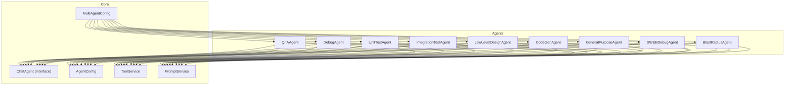
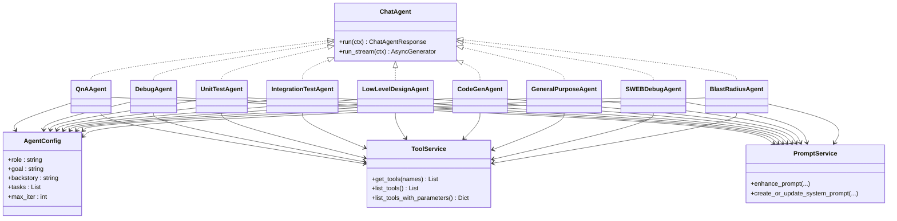
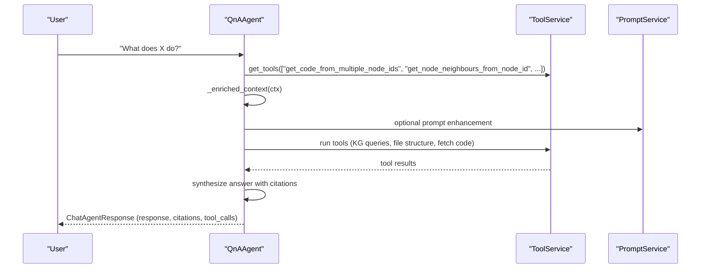
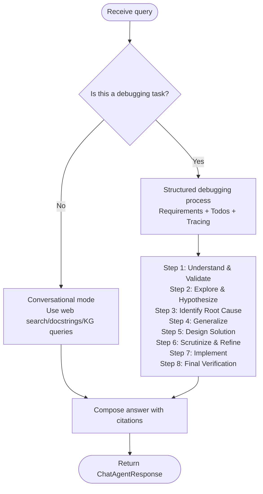
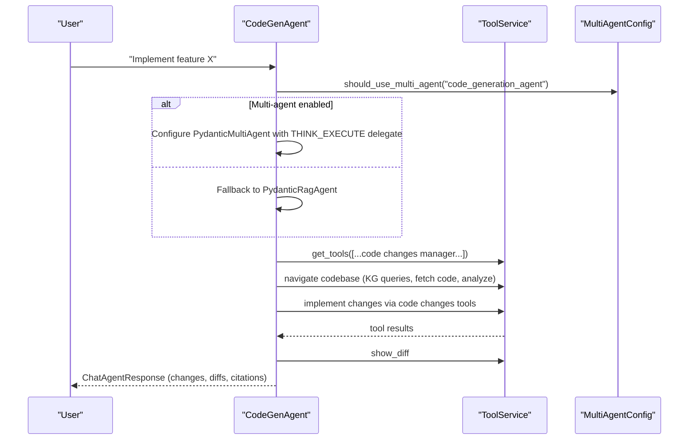
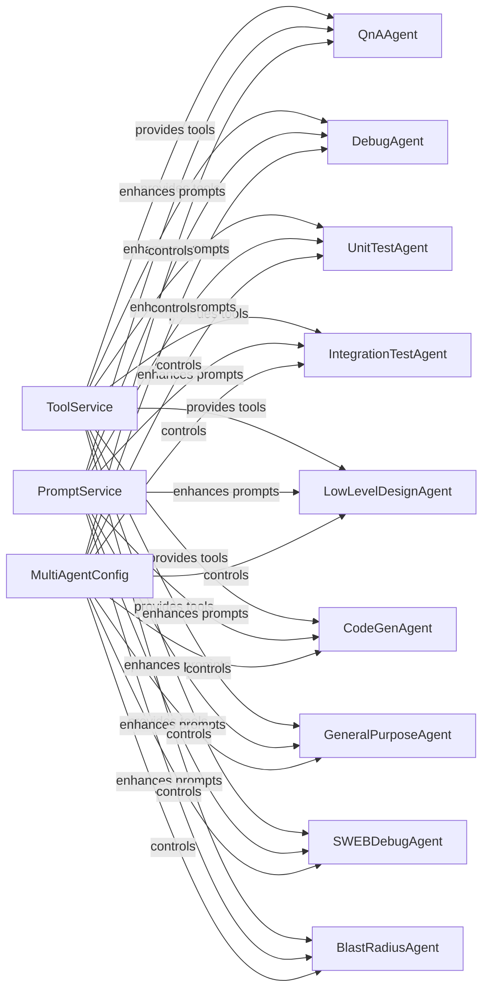

# System Agents

<cite>
**Referenced Files in This Document**
- [chat_agent.py](file://app/modules/intelligence/agents/chat_agent.py)
- [agent_config.py](file://app/modules/intelligence/agents/chat_agents/agent_config.py)
- [multi_agent_config.py](file://app/modules/intelligence/agents/multi_agent_config.py)
- [tool_service.py](file://app/modules/intelligence/tools/tool_service.py)
- [prompt_service.py](file://app/modules/intelligence/prompts/prompt_service.py)
- [qna_agent.py](file://app/modules/intelligence/agents/chat_agents/system_agents/qna_agent.py)
- [debug_agent.py](file://app/modules/intelligence/agents/chat_agents/system_agents/debug_agent.py)
- [unit_test_agent.py](file://app/modules/intelligence/agents/chat_agents/system_agents/unit_test_agent.py)
- [integration_test_agent.py](file://app/modules/intelligence/agents/chat_agents/system_agents/integration_test_agent.py)
- [low_level_design_agent.py](file://app/modules/intelligence/agents/chat_agents/system_agents/low_level_design_agent.py)
- [code_gen_agent.py](file://app/modules/intelligence/agents/chat_agents/system_agents/code_gen_agent.py)
- [general_purpose_agent.py](file://app/modules/intelligence/agents/chat_agents/system_agents/general_purpose_agent.py)
- [sweb_debug_agent.py](file://app/modules/intelligence/agents/chat_agents/system_agents/sweb_debug_agent.py)
- [blast_radius_agent.py](file://app/modules/intelligence/agents/chat_agents/system_agents/blast_radius_agent.py)
</cite>

## Table of Contents
1. [Introduction](#introduction)
2. [Project Structure](#project-structure)
3. [Core Components](#core-components)
4. [Architecture Overview](#architecture-overview)
5. [Detailed Component Analysis](#detailed-component-analysis)
6. [Dependency Analysis](#dependency-analysis)
7. [Performance Considerations](#performance-considerations)
8. [Troubleshooting Guide](#troubleshooting-guide)
9. [Conclusion](#conclusion)

## Introduction
This document explains the system agents subsystem responsible for predefined AI agents that automate development tasks. It covers the purpose, capabilities, and internal mechanics of each agent, including Codebase Q&A Agent, Debugging Agent, Unit Test Agent, Integration Test Agent, Low-Level Design Agent, Code Changes Agent, Code Generation Agent, and General Purpose Agent. It also documents agent-specific workflows, tool integration patterns, prompt engineering, configuration, execution parameters, and performance characteristics. Practical usage patterns and result interpretation are included for both beginners and experienced developers.

## Project Structure
The system agents live under the intelligence agents package and leverage:
- A shared ChatAgent interface and response models
- Agent configuration via pydantic models
- Multi-agent orchestration controlled by environment flags
- A comprehensive ToolService that exposes hundreds of tools for code navigation, knowledge graph queries, external integrations, and code changes
- A PromptService for managing and enhancing prompts

**Diagram sources**
- [chat_agent.py](file://app/modules/intelligence/agents/chat_agent.py#L101-L121)
- [agent_config.py](file://app/modules/intelligence/agents/chat_agents/agent_config.py#L6-L21)
- [multi_agent_config.py](file://app/modules/intelligence/agents/multi_agent_config.py#L12-L94)
- [tool_service.py](file://app/modules/intelligence/tools/tool_service.py#L99-L242)
- [prompt_service.py](file://app/modules/intelligence/prompts/prompt_service.py#L59-L280)
- [qna_agent.py](file://app/modules/intelligence/agents/chat_agents/system_agents/qna_agent.py#L24-L152)
- [debug_agent.py](file://app/modules/intelligence/agents/chat_agents/system_agents/debug_agent.py#L24-L143)
- [unit_test_agent.py](file://app/modules/intelligence/agents/chat_agents/system_agents/unit_test_agent.py#L14-L73)
- [integration_test_agent.py](file://app/modules/intelligence/agents/chat_agents/system_agents/integration_test_agent.py#L21-L134)
- [low_level_design_agent.py](file://app/modules/intelligence/agents/chat_agents/system_agents/low_level_design_agent.py#L24-L139)
- [code_gen_agent.py](file://app/modules/intelligence/agents/chat_agents/system_agents/code_gen_agent.py#L26-L172)
- [general_purpose_agent.py](file://app/modules/intelligence/agents/chat_agents/system_agents/general_purpose_agent.py#L26-L119)
- [sweb_debug_agent.py](file://app/modules/intelligence/agents/chat_agents/system_agents/sweb_debug_agent.py#L24-L133)
- [blast_radius_agent.py](file://app/modules/intelligence/agents/chat_agents/system_agents/blast_radius_agent.py#L14-L63)

**Section sources**
- [chat_agent.py](file://app/modules/intelligence/agents/chat_agent.py#L101-L121)
- [agent_config.py](file://app/modules/intelligence/agents/chat_agents/agent_config.py#L6-L21)
- [multi_agent_config.py](file://app/modules/intelligence/agents/multi_agent_config.py#L12-L94)
- [tool_service.py](file://app/modules/intelligence/tools/tool_service.py#L99-L242)
- [prompt_service.py](file://app/modules/intelligence/prompts/prompt_service.py#L59-L280)

## Core Components
- ChatAgent interface defines synchronous and asynchronous execution and standardized response structures.
- AgentConfig and TaskConfig define role, goal, backstory, and task specifications for pydantic-based agents.
- MultiAgentConfig controls whether multi-agent mode is enabled globally and per agent type via environment variables.
- ToolService aggregates and exposes a wide range of tools for code navigation, knowledge graph queries, external integrations, and code changes.
- PromptService manages prompt lifecycle and enhancement.

Key execution parameters and return value specifications:
- run(ctx: ChatContext) -> ChatAgentResponse: returns a full response, citations, and tool call metadata.
- run_stream(ctx: ChatContext) -> AsyncGenerator[ChatAgentResponse, None]: yields streaming chunks with tool-call events.

**Section sources**
- [chat_agent.py](file://app/modules/intelligence/agents/chat_agent.py#L42-L100)
- [agent_config.py](file://app/modules/intelligence/agents/chat_agents/agent_config.py#L6-L21)
- [multi_agent_config.py](file://app/modules/intelligence/agents/multi_agent_config.py#L46-L64)
- [tool_service.py](file://app/modules/intelligence/tools/tool_service.py#L126-L132)
- [prompt_service.py](file://app/modules/intelligence/prompts/prompt_service.py#L372-L426)

## Architecture Overview
Each system agent composes:
- An AgentConfig with role/goal/backstory and one or more tasks
- A ToolService-initialized tool set
- Optional multi-agent orchestration via PydanticMultiAgent
- A fallback to PydanticRagAgent when multi-agent is disabled or unsupported

**Diagram sources**
- [chat_agent.py](file://app/modules/intelligence/agents/chat_agent.py#L101-L121)
- [qna_agent.py](file://app/modules/intelligence/agents/chat_agents/system_agents/qna_agent.py#L24-L124)
- [debug_agent.py](file://app/modules/intelligence/agents/chat_agents/system_agents/debug_agent.py#L24-L122)
- [unit_test_agent.py](file://app/modules/intelligence/agents/chat_agents/system_agents/unit_test_agent.py#L14-L53)
- [integration_test_agent.py](file://app/modules/intelligence/agents/chat_agents/system_agents/integration_test_agent.py#L21-L62)
- [low_level_design_agent.py](file://app/modules/intelligence/agents/chat_agents/system_agents/low_level_design_agent.py#L24-L111)
- [code_gen_agent.py](file://app/modules/intelligence/agents/chat_agents/system_agents/code_gen_agent.py#L26-L152)
- [general_purpose_agent.py](file://app/modules/intelligence/agents/chat_agents/system_agents/general_purpose_agent.py#L26-L110)
- [sweb_debug_agent.py](file://app/modules/intelligence/agents/chat_agents/system_agents/sweb_debug_agent.py#L24-L124)
- [blast_radius_agent.py](file://app/modules/intelligence/agents/chat_agents/system_agents/blast_radius_agent.py#L14-L54)
- [agent_config.py](file://app/modules/intelligence/agents/chat_agents/agent_config.py#L13-L21)
- [tool_service.py](file://app/modules/intelligence/tools/tool_service.py#L99-L242)
- [prompt_service.py](file://app/modules/intelligence/prompts/prompt_service.py#L59-L280)

## Detailed Component Analysis

### Codebase Q&A Agent
- Purpose: Provide comprehensive, well-structured answers to questions about the codebase by systematically exploring code, understanding context, and delivering thorough explanations grounded in actual code.
- Capabilities:
  - Structured question analysis and systematic code navigation
  - Context building from multiple code locations and relationships
  - Todo and requirements tracking for complex multi-step questions
  - Markdown-formatted, cited responses with code examples
- Agent-specific workflow:
  - Enrich context with node code and file structure
  - Use knowledge graph queries, file structure, and code retrieval tools
  - Plan exploration with todos and requirements
  - Synthesize findings into a structured, cited answer
- Agent-specific parameters:
  - node_ids: optional list of node IDs to seed context
  - additional_context: appended with code and structure
- Return value specification:
  - ChatAgentResponse with response, citations, and tool_calls
- Integration with knowledge graph:
  - Uses ask_knowledge_graph_queries, get_code_from_multiple_node_ids, get_node_neighbours_from_node_id, get_code_file_structure, analyze_code_structure, fetch_file, web_search_tool, webpage_extractor, bash_command, and todo/requirements tools.

**Diagram sources**
- [qna_agent.py](file://app/modules/intelligence/agents/chat_agents/system_agents/qna_agent.py#L126-L152)
- [tool_service.py](file://app/modules/intelligence/tools/tool_service.py#L126-L132)
- [prompt_service.py](file://app/modules/intelligence/prompts/prompt_service.py#L372-L426)

**Section sources**
- [qna_agent.py](file://app/modules/intelligence/agents/chat_agents/system_agents/qna_agent.py#L24-L152)
- [tool_service.py](file://app/modules/intelligence/tools/tool_service.py#L134-L242)
- [prompt_service.py](file://app/modules/intelligence/prompts/prompt_service.py#L372-L426)

### Debugging Agent
- Purpose: Provide comprehensive debugging solutions and code analysis by identifying root causes, tracing code flows, and delivering precise fixes. Adapts to general queries with conversational approach or rigorous debugging methodology.
- Capabilities:
  - Conversational mode for general questions
  - Structured debugging methodology with step tracking, requirements, and todos
  - Code navigation and relationship tracing
  - Multi-agent orchestration with THINK_EXECUTE delegate
- Agent-specific workflow:
  - Detect debugging task vs general query
  - Enrich context with node code
  - Use KG queries, file structure, and code analysis tools
  - Follow debugging process: understand, explore, identify root cause, generalize, design, implement, verify
- Agent-specific parameters:
  - node_ids: optional list to seed context
- Return value specification:
  - ChatAgentResponse with markdown-formatted answer, citations, and tool_calls
- Integration with knowledge graph:
  - Same tool set as QnA plus todo/requirements tools.

**Diagram sources**
- [debug_agent.py](file://app/modules/intelligence/agents/chat_agents/system_agents/debug_agent.py#L134-L143)
- [debug_agent.py](file://app/modules/intelligence/agents/chat_agents/system_agents/debug_agent.py#L146-L632)

**Section sources**
- [debug_agent.py](file://app/modules/intelligence/agents/chat_agents/system_agents/debug_agent.py#L24-L143)
- [tool_service.py](file://app/modules/intelligence/tools/tool_service.py#L134-L242)

### Unit Test Agent
- Purpose: Create test plans and write unit tests based on user requirements for specific nodes.
- Capabilities:
  - Analyze code and docstrings to understand functionality
  - Generate test plans with happy path and edge cases
  - Write unit tests using appropriate frameworks
- Agent-specific workflow:
  - Enrich context with node code
  - Analyze code and generate test plan
  - Write unit tests and iterate/refine
- Agent-specific parameters:
  - node_ids: list of nodes to test
- Return value specification:
  - ChatAgentResponse with test plan and unit tests
- Integration with knowledge graph:
  - Uses KG queries, file structure, and code analysis tools.

**Section sources**
- [unit_test_agent.py](file://app/modules/intelligence/agents/chat_agents/system_agents/unit_test_agent.py#L14-L73)
- [tool_service.py](file://app/modules/intelligence/tools/tool_service.py#L134-L242)

### Integration Test Agent
- Purpose: Create a comprehensive integration test suite for the provided codebase, analyzing components and writing tests that cover integration points.
- Capabilities:
  - Analyze code structure and relationships via code graphs
  - Generate test plans and write integration tests
  - Handle multiple nodes and their relationships
- Agent-specific workflow:
  - Build code graphs for each node
  - Extract unique node contexts and format for prompts
  - Generate test plans and write integration tests
- Agent-specific parameters:
  - node_ids: list of component nodes
- Return value specification:
  - ChatAgentResponse with integration tests
- Integration with knowledge graph:
  - Uses code graph tools and code retrieval tools.

**Section sources**
- [integration_test_agent.py](file://app/modules/intelligence/agents/chat_agents/system_agents/integration_test_agent.py#L21-L134)
- [tool_service.py](file://app/modules/intelligence/tools/tool_service.py#L118-L122)

### Low-Level Design Agent
- Purpose: Create a detailed low-level design plan for implementing new features, including files to modify, proposed changes, and consistency guidance.
- Capabilities:
  - Traverse codebase systematically
  - Build design plans with implementation steps
  - Maintain codebase consistency
- Agent-specific workflow:
  - Enrich context with node code and file structure
  - Use KG queries and code analysis tools
  - Produce detailed design plan
- Agent-specific parameters:
  - node_ids: optional list to seed context
- Return value specification:
  - ChatAgentResponse with design plan
- Integration with knowledge graph:
  - Uses KG queries, file structure, and analysis tools.

**Section sources**
- [low_level_design_agent.py](file://app/modules/intelligence/agents/chat_agents/system_agents/low_level_design_agent.py#L24-L139)
- [tool_service.py](file://app/modules/intelligence/tools/tool_service.py#L134-L242)

### Code Changes Agent
- Purpose: Manage code changes across files using a dedicated code changes manager, enabling precise, copy-paste ready modifications with comprehensive dependency analysis.
- Capabilities:
  - Use Code Changes Manager tools to add/update/delete/replace code
  - Track changes, show diffs, and export changes
  - Maintain formatting and project patterns
- Agent-specific workflow:
  - Enrich context with node code
  - Plan changes systematically
  - Use code changes tools to implement and verify
  - Show unified diffs for review
- Agent-specific parameters:
  - node_ids: optional list to seed context
- Return value specification:
  - ChatAgentResponse with changes and diffs
- Integration with knowledge graph:
  - Uses KG queries, file structure, and analysis tools plus code changes manager tools.

**Section sources**
- [code_gen_agent.py](file://app/modules/intelligence/agents/chat_agents/system_agents/code_gen_agent.py#L26-L172)
- [tool_service.py](file://app/modules/intelligence/tools/tool_service.py#L134-L242)

### Code Generation Agent
- Purpose: Generate precise, copy-paste ready code modifications that maintain project consistency and handle all dependencies.
- Capabilities:
  - Multi-agent orchestration with THINK_EXECUTE delegate
  - Systematic codebase navigation and pattern recognition
  - Use Code Changes Manager for all modifications
  - Comprehensive dependency analysis and verification
- Agent-specific workflow:
  - Detect multi-agent capability and configure delegates
  - Enrich context with node code
  - Navigate codebase, analyze patterns, plan changes
  - Implement using Code Changes Manager tools
  - Show diffs and verify changes
- Agent-specific parameters:
  - node_ids: optional list to seed context
- Return value specification:
  - ChatAgentResponse with structured changes and diffs
- Integration with knowledge graph:
  - Extensive tool set including KG queries, file structure, analysis, and code changes manager.

**Diagram sources**
- [code_gen_agent.py](file://app/modules/intelligence/agents/chat_agents/system_agents/code_gen_agent.py#L37-L152)
- [multi_agent_config.py](file://app/modules/intelligence/agents/multi_agent_config.py#L46-L64)
- [tool_service.py](file://app/modules/intelligence/tools/tool_service.py#L134-L242)

**Section sources**
- [code_gen_agent.py](file://app/modules/intelligence/agents/chat_agents/system_agents/code_gen_agent.py#L26-L172)
- [multi_agent_config.py](file://app/modules/intelligence/agents/multi_agent_config.py#L46-L64)
- [tool_service.py](file://app/modules/intelligence/tools/tool_service.py#L134-L242)

### General Purpose Agent
- Purpose: Answer user queries efficiently and intelligently, maintaining traceability with citations and references.
- Capabilities:
  - Analyze query and formulate strategy
  - Use tools and history to gather information
  - Provide precise, comprehensive responses
- Agent-specific workflow:
  - Optionally enable multi-agent orchestration
  - Use web search and extractor tools
- Agent-specific parameters:
  - None specific beyond standard ChatContext
- Return value specification:
  - ChatAgentResponse with response and citations
- Integration with knowledge graph:
  - Web search and extractor tools.

**Section sources**
- [general_purpose_agent.py](file://app/modules/intelligence/agents/chat_agents/system_agents/general_purpose_agent.py#L26-L119)
- [tool_service.py](file://app/modules/intelligence/tools/tool_service.py#L103-L104)

### SWEB Debug Agent
- Purpose: Analyze, diagnose, and provide diff fixes for bugs by identifying root causes and generating precise diffs.
- Capabilities:
  - Structured debugging methodology
  - Single-file fixes only
  - Use code changes manager to implement and verify
- Agent-specific workflow:
  - Follow debugging process with requirements and todos
  - Implement precise, surgical changes
  - Show unified diffs for verification
- Agent-specific parameters:
  - None specific beyond standard ChatContext
- Return value specification:
  - ChatAgentResponse with fix and diffs
- Integration with knowledge graph:
  - KG queries, file structure, analysis, and code changes manager tools.

**Section sources**
- [sweb_debug_agent.py](file://app/modules/intelligence/agents/chat_agents/system_agents/sweb_debug_agent.py#L24-L133)
- [tool_service.py](file://app/modules/intelligence/tools/tool_service.py#L134-L242)

### Blast Radius Agent
- Purpose: Analyze the impact of code changes on the codebase and answer user queries about them.
- Capabilities:
  - Use change detection and KG queries to understand impact
  - Traverse codebase systematically to identify side effects and dependencies
- Agent-specific workflow:
  - Enrich context with change information
  - Query KG and fetch related code
  - Provide structured inference of blast radius
- Agent-specific parameters:
  - node_ids: optional list to seed context
- Return value specification:
  - ChatAgentResponse with impact analysis
- Integration with knowledge graph:
  - KG queries, code retrieval, change detection, and analysis tools.

**Section sources**
- [blast_radius_agent.py](file://app/modules/intelligence/agents/chat_agents/system_agents/blast_radius_agent.py#L14-L63)
- [tool_service.py](file://app/modules/intelligence/tools/tool_service.py#L134-L242)

## Dependency Analysis
- Coupling:
  - All agents depend on ToolService for tool availability and execution.
  - Agents depend on PromptService for prompt enhancement and system prompt creation.
  - Multi-agent orchestration depends on MultiAgentConfig environment flags.
- Cohesion:
  - Each agent encapsulates a cohesive workflow aligned with its domain (Q&A, debugging, testing, design, generation).
- External dependencies:
  - ProviderService for LLM capabilities and structured output.
  - Database-backed prompt and mapping persistence via PromptService.
- Potential circular dependencies:
  - None observed; agents are consumers of services, not providers.

**Diagram sources**
- [tool_service.py](file://app/modules/intelligence/tools/tool_service.py#L126-L242)
- [prompt_service.py](file://app/modules/intelligence/prompts/prompt_service.py#L372-L426)
- [multi_agent_config.py](file://app/modules/intelligence/agents/multi_agent_config.py#L46-L64)
- [qna_agent.py](file://app/modules/intelligence/agents/chat_agents/system_agents/qna_agent.py#L24-L124)
- [debug_agent.py](file://app/modules/intelligence/agents/chat_agents/system_agents/debug_agent.py#L24-L122)
- [unit_test_agent.py](file://app/modules/intelligence/agents/chat_agents/system_agents/unit_test_agent.py#L14-L53)
- [integration_test_agent.py](file://app/modules/intelligence/agents/chat_agents/system_agents/integration_test_agent.py#L21-L62)
- [low_level_design_agent.py](file://app/modules/intelligence/agents/chat_agents/system_agents/low_level_design_agent.py#L24-L111)
- [code_gen_agent.py](file://app/modules/intelligence/agents/chat_agents/system_agents/code_gen_agent.py#L26-L152)
- [general_purpose_agent.py](file://app/modules/intelligence/agents/chat_agents/system_agents/general_purpose_agent.py#L26-L110)
- [sweb_debug_agent.py](file://app/modules/intelligence/agents/chat_agents/system_agents/sweb_debug_agent.py#L24-L124)
- [blast_radius_agent.py](file://app/modules/intelligence/agents/chat_agents/system_agents/blast_radius_agent.py#L14-L54)

**Section sources**
- [tool_service.py](file://app/modules/intelligence/tools/tool_service.py#L126-L242)
- [prompt_service.py](file://app/modules/intelligence/prompts/prompt_service.py#L372-L426)
- [multi_agent_config.py](file://app/modules/intelligence/agents/multi_agent_config.py#L46-L64)

## Performance Considerations
- Multi-agent mode:
  - Controlled by environment variables; disabling can reduce overhead and latency.
  - Some agents benefit from multi-agent orchestration for complex tasks.
- Tool usage:
  - Excessive tool calls increase latency; batch and reuse results where possible.
  - Use web_search_tool judiciously; leverage KG queries for targeted results.
- Streaming:
  - Prefer run_stream for long-running tasks to provide incremental feedback.
- Code changes:
  - Use Code Changes Manager to minimize token usage and improve diff visualization.
- Caching and provider capabilities:
  - Ensure provider supports pydantic-based agents to avoid fallback costs.

[No sources needed since this section provides general guidance]

## Troubleshooting Guide
- Unsupported provider for pydantic-based agents:
  - Some agents require pydantic support; otherwise they fall back to PydanticRagAgent.
  - Check provider capabilities and model configuration.
- Multi-agent disabled:
  - If ENABLE_MULTI_AGENT or agent-specific flags are false, agents fall back to single-agent mode.
  - Verify environment variables for desired behavior.
- Tool availability:
  - Ensure ToolService initializes required tools; some tools depend on repo manager or integrations.
- Prompt enhancement failures:
  - PromptService may fail to enhance prompts; fallback to raw query is handled internally.

**Section sources**
- [code_gen_agent.py](file://app/modules/intelligence/agents/chat_agents/system_agents/code_gen_agent.py#L148-L151)
- [debug_agent.py](file://app/modules/intelligence/agents/chat_agents/system_agents/debug_agent.py#L118-L121)
- [general_purpose_agent.py](file://app/modules/intelligence/agents/chat_agents/system_agents/general_purpose_agent.py#L106-L109)
- [multi_agent_config.py](file://app/modules/intelligence/agents/multi_agent_config.py#L56-L64)
- [prompt_service.py](file://app/modules/intelligence/prompts/prompt_service.py#L413-L425)

## Conclusion
The system agents subsystem provides a robust, extensible framework for automating development tasks. Each agent encapsulates a specific workflow, integrates deeply with the knowledge graph and tool ecosystem, and can be configured for multi-agent orchestration. By leveraging standardized execution interfaces, tool sets, and prompt management, the agents deliver precise, contextual, and actionable results across Q&A, debugging, testing, design, and code generation domains.