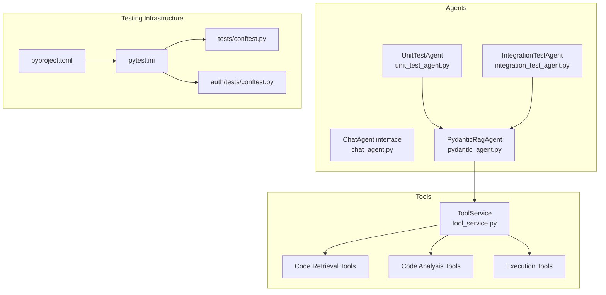
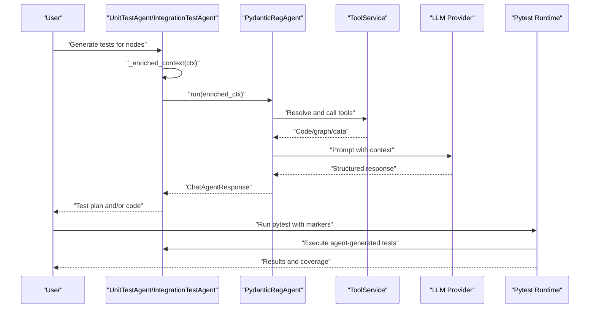
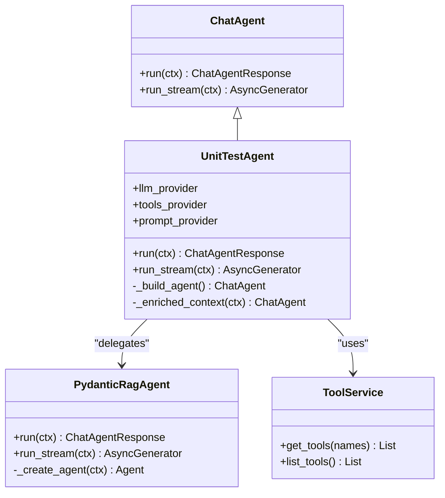
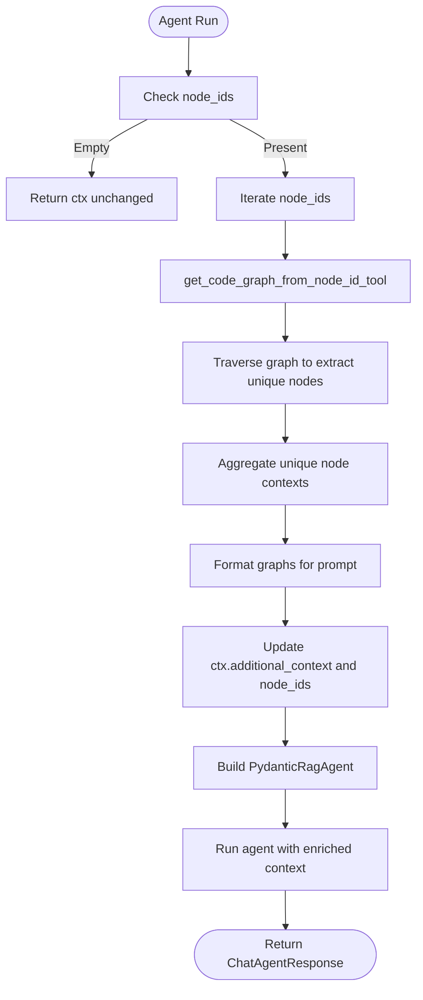
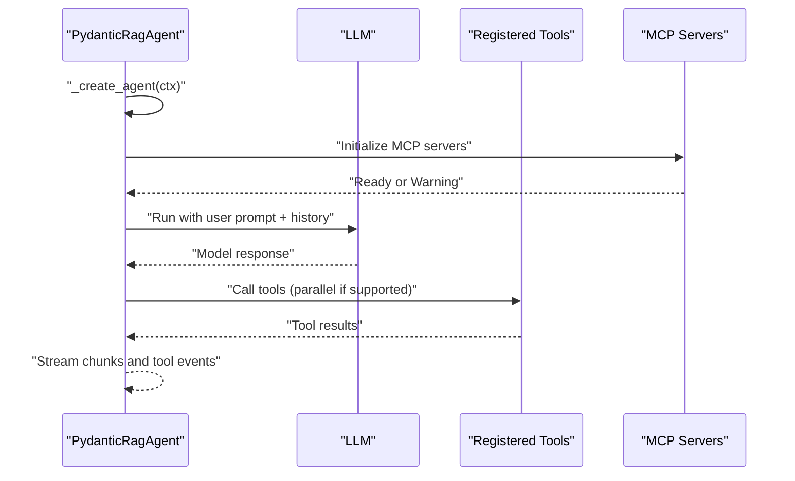
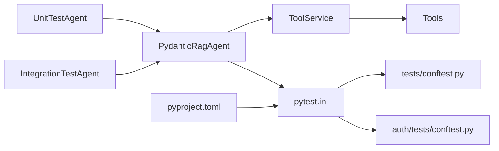

# Testing Agents

<cite>
**Referenced Files in This Document**
- [unit_test_agent.py](file://app/modules/intelligence/agents/chat_agents/system_agents/unit_test_agent.py)
- [integration_test_agent.py](file://app/modules/intelligence/agents/chat_agents/system_agents/integration_test_agent.py)
- [chat_agent.py](file://app/modules/intelligence/agents/chat_agent.py)
- [pydantic_agent.py](file://app/modules/intelligence/agents/chat_agents/pydantic_agent.py)
- [tool_service.py](file://app/modules/intelligence/tools/tool_service.py)
- [pytest.ini](file://pytest.ini)
- [conftest.py](file://tests/conftest.py)
- [auth_conftest.py](file://app/modules/auth/tests/conftest.py)
- [pyproject.toml](file://pyproject.toml)
</cite>

## Table of Contents
1. [Introduction](#introduction)
2. [Project Structure](#project-structure)
3. [Core Components](#core-components)
4. [Architecture Overview](#architecture-overview)
5. [Detailed Component Analysis](#detailed-component-analysis)
6. [Dependency Analysis](#dependency-analysis)
7. [Performance Considerations](#performance-considerations)
8. [Troubleshooting Guide](#troubleshooting-guide)
9. [Conclusion](#conclusion)
10. [Appendices](#appendices)

## Introduction
This document describes the Testing Agents subsystem responsible for automating testing processes across unit and integration domains. It covers how the Unit Test Agent and Integration Test Agent generate, orchestrate, and analyze test cases for codebases using LLM-driven workflows and a rich toolset. The agents operate within a structured architecture that integrates with testing frameworks, execution environments, and observability tools to deliver actionable insights and improve code quality at scale.

## Project Structure
The Testing Agents are part of the Intelligence Agents module and integrate with:
- Agent interfaces and base classes
- Tool service providing code analysis, retrieval, and execution tools
- Pydantic-based RAG agent runtime for LLM orchestration
- Pytest configuration and fixtures for test execution and environment setup

**Diagram sources**
- [unit_test_agent.py](file://app/modules/intelligence/agents/chat_agents/system_agents/unit_test_agent.py#L14-L74)
- [integration_test_agent.py](file://app/modules/intelligence/agents/chat_agents/system_agents/integration_test_agent.py#L21-L135)
- [chat_agent.py](file://app/modules/intelligence/agents/chat_agent.py#L101-L121)
- [pydantic_agent.py](file://app/modules/intelligence/agents/chat_agents/pydantic_agent.py#L66-L200)
- [tool_service.py](file://app/modules/intelligence/tools/tool_service.py#L99-L242)
- [pytest.ini](file://pytest.ini#L1-L31)
- [conftest.py](file://tests/conftest.py#L1-L328)
- [auth_conftest.py](file://app/modules/auth/tests/conftest.py#L1-L132)
- [pyproject.toml](file://pyproject.toml#L67-L68)

**Section sources**
- [unit_test_agent.py](file://app/modules/intelligence/agents/chat_agents/system_agents/unit_test_agent.py#L1-L127)
- [integration_test_agent.py](file://app/modules/intelligence/agents/chat_agents/system_agents/integration_test_agent.py#L1-L195)
- [chat_agent.py](file://app/modules/intelligence/agents/chat_agent.py#L1-L121)
- [pydantic_agent.py](file://app/modules/intelligence/agents/chat_agents/pydantic_agent.py#L1-L1099)
- [tool_service.py](file://app/modules/intelligence/tools/tool_service.py#L1-L263)
- [pytest.ini](file://pytest.ini#L1-L31)
- [conftest.py](file://tests/conftest.py#L1-L328)
- [auth_conftest.py](file://app/modules/auth/tests/conftest.py#L1-L132)
- [pyproject.toml](file://pyproject.toml#L1-L112)

## Core Components
- UnitTestAgent: Generates test plans and writes unit tests for selected code nodes. It enriches context with code graphs and uses a Pydantic-based RAG agent to produce structured outputs aligned with best practices.
- IntegrationTestAgent: Builds comprehensive integration test suites by analyzing component graphs, determining integration points, and generating complete integration tests with setup/teardown and mocking strategies.
- PydanticRagAgent: Orchestrates LLM interactions, manages tool calls, and streams responses. It supports multimodal inputs and MCP server integration for extended tool capabilities.
- ToolService: Provides a curated set of tools for code retrieval, structure analysis, graph traversal, web search, and execution commands.
- Testing Infrastructure: Pytest configuration and fixtures define test discovery, markers, async support, and environment setup for unit and integration tests.

**Section sources**
- [unit_test_agent.py](file://app/modules/intelligence/agents/chat_agents/system_agents/unit_test_agent.py#L14-L127)
- [integration_test_agent.py](file://app/modules/intelligence/agents/chat_agents/system_agents/integration_test_agent.py#L21-L195)
- [pydantic_agent.py](file://app/modules/intelligence/agents/chat_agents/pydantic_agent.py#L66-L200)
- [tool_service.py](file://app/modules/intelligence/tools/tool_service.py#L99-L242)
- [pytest.ini](file://pytest.ini#L1-L31)
- [conftest.py](file://tests/conftest.py#L1-L328)

## Architecture Overview
The agents follow a layered architecture:
- Agent Layer: UnitTestAgent and IntegrationTestAgent implement ChatAgent and delegate execution to PydanticRagAgent.
- Orchestration Layer: PydanticRagAgent configures the LLM, registers tools, and manages streaming responses.
- Tool Layer: ToolService exposes tools for code analysis, retrieval, and execution.
- Execution Layer: Pytest and fixtures manage test execution environments and lifecycle.

**Diagram sources**
- [unit_test_agent.py](file://app/modules/intelligence/agents/chat_agents/system_agents/unit_test_agent.py#L55-L74)
- [integration_test_agent.py](file://app/modules/intelligence/agents/chat_agents/system_agents/integration_test_agent.py#L64-L135)
- [pydantic_agent.py](file://app/modules/intelligence/agents/chat_agents/pydantic_agent.py#L478-L580)
- [tool_service.py](file://app/modules/intelligence/tools/tool_service.py#L126-L242)
- [pytest.ini](file://pytest.ini#L10-L25)

## Detailed Component Analysis

### Unit Test Agent
Responsibilities:
- Build agent configuration with role, goal, and task prompt.
- Enrich context with code snippets from node IDs.
- Delegate execution to PydanticRagAgent and return structured responses.

Key behaviors:
- Validates LLM provider compatibility for Pydantic-based agents.
- Uses tools for code retrieval, structure analysis, and execution commands.
- Produces test plans and unit tests aligned with best practices.

**Diagram sources**
- [unit_test_agent.py](file://app/modules/intelligence/agents/chat_agents/system_agents/unit_test_agent.py#L14-L74)
- [chat_agent.py](file://app/modules/intelligence/agents/chat_agent.py#L101-L121)
- [pydantic_agent.py](file://app/modules/intelligence/agents/chat_agents/pydantic_agent.py#L66-L200)
- [tool_service.py](file://app/modules/intelligence/tools/tool_service.py#L99-L133)

**Section sources**
- [unit_test_agent.py](file://app/modules/intelligence/agents/chat_agents/system_agents/unit_test_agent.py#L14-L127)

### Integration Test Agent
Responsibilities:
- Analyze component graphs for each node ID.
- Extract unique node contexts and format graphs for prompts.
- Generate integration test plans and complete integration tests.

Key behaviors:
- Builds enriched context with component relationships and graph structures.
- Uses specialized tools for code graph retrieval and analysis.
- Emphasizes setup/teardown, mocking, and accurate imports.

**Diagram sources**
- [integration_test_agent.py](file://app/modules/intelligence/agents/chat_agents/system_agents/integration_test_agent.py#L64-L125)

**Section sources**
- [integration_test_agent.py](file://app/modules/intelligence/agents/chat_agents/system_agents/integration_test_agent.py#L21-L195)

### PydanticRagAgent Orchestration
Responsibilities:
- Configure LLM model, tools, and MCP servers.
- Manage multimodal inputs and streaming responses.
- Handle tool parallelism and error recovery.

Key behaviors:
- Supports parallel tool calls based on provider capabilities.
- Streams model tokens and tool events for real-time feedback.
- Provides fallbacks when MCP servers are unavailable.

**Diagram sources**
- [pydantic_agent.py](file://app/modules/intelligence/agents/chat_agents/pydantic_agent.py#L92-L199)
- [pydantic_agent.py](file://app/modules/intelligence/agents/chat_agents/pydantic_agent.py#L508-L580)
- [pydantic_agent.py](file://app/modules/intelligence/agents/chat_agents/pydantic_agent.py#L580-L1099)

**Section sources**
- [pydantic_agent.py](file://app/modules/intelligence/agents/chat_agents/pydantic_agent.py#L66-L1099)

### Tool Integration Patterns
Capabilities:
- Code retrieval: fetch files, get code by node IDs, analyze structure.
- Graph traversal: get code graphs, node neighbors, intelligent code graph.
- Web and search: web search, webpage extractor, knowledge graph queries.
- Execution: bash commands for environment operations.
- Issue trackers and providers: Jira, Linear, Confluence, GitHub tools.

Implementation specifics:
- ToolService centralizes tool registration and exposes them via names.
- Tools are wrapped with structured schemas and validated arguments.
- Agents select tools per task and enrich prompts with retrieved context.

**Section sources**
- [tool_service.py](file://app/modules/intelligence/tools/tool_service.py#L99-L242)

### Testing Methodologies
- Unit test generation:
  - Analyze code and docstrings to understand functionality.
  - Create test plans covering happy paths, edge cases, error handling, and performance/security considerations.
  - Write complete unit tests with descriptive names and explanatory comments.
- Integration test creation:
  - Identify integration points between components.
  - Develop test suites with setup/teardown, mocking, accurate imports, and assertions.
  - Ensure comprehensive coverage of component interactions.
- Test execution orchestration:
  - Use pytest configuration and fixtures for environment setup and lifecycle.
  - Support async tests and markers for categorization.
- Result analysis:
  - Stream responses for real-time feedback.
  - Capture tool calls and citations for traceability.

**Section sources**
- [unit_test_agent.py](file://app/modules/intelligence/agents/chat_agents/system_agents/unit_test_agent.py#L76-L126)
- [integration_test_agent.py](file://app/modules/intelligence/agents/chat_agents/system_agents/integration_test_agent.py#L137-L194)
- [pytest.ini](file://pytest.ini#L10-L25)
- [conftest.py](file://tests/conftest.py#L1-L328)

### Implementation Specifics
- Test generation algorithms:
  - Unit tests: LLM-driven plan-first, then code generation with iterative refinement.
  - Integration tests: Graph-based analysis to identify integration points, followed by test code generation.
- Execution environment setup:
  - Pytest configuration defines test discovery, markers, async mode, and output options.
  - Global and module-level fixtures manage database setup, session overrides, and service instances.
- Parallel test execution:
  - PydanticRagAgent supports parallel tool calls when provider capabilities allow.
  - Streaming enables concurrent processing of model tokens and tool events.
- Failure investigation workflows:
  - Tool exceptions are handled with structured error messages.
  - Streaming captures tool call events and results for debugging.

**Section sources**
- [pydantic_agent.py](file://app/modules/intelligence/agents/chat_agents/pydantic_agent.py#L120-L198)
- [pydantic_agent.py](file://app/modules/intelligence/agents/chat_agents/pydantic_agent.py#L580-L1099)
- [tool_service.py](file://app/modules/intelligence/tools/tool_service.py#L53-L63)

### Practical Examples
- Unit test generation:
  - Provide node IDs for functions/classes; agent retrieves code, builds a plan, and writes unit tests.
  - Use web search and docstrings to understand usage context before generating tests.
- Integration test creation:
  - Supply multiple node IDs; agent extracts component graphs, identifies integration points, and produces integration tests with mocks and setup procedures.
- Automated test case generation:
  - Agents iterate based on max iterations and refine outputs until coverage and correctness are satisfied.
- Actionable insights:
  - Agents highlight missing imports, suggest accurate assertions, and propose improvements for error handling and performance.

**Section sources**
- [unit_test_agent.py](file://app/modules/intelligence/agents/chat_agents/system_agents/unit_test_agent.py#L55-L74)
- [integration_test_agent.py](file://app/modules/intelligence/agents/chat_agents/system_agents/integration_test_agent.py#L64-L125)

### Configuration Options and Integrations
- Agent configuration:
  - Role, goal, backstory, and task prompts define agent behavior.
  - Tool selection is dynamic and based on task requirements.
- Provider integrations:
  - LLM provider must support Pydantic-based agents; otherwise, an error is raised.
  - Vision-capable models enable multimodal input processing.
- Pytest configuration:
  - Test discovery paths, markers (unit, integration, asyncio), async mode, and output options.
  - Coverage reporting can be enabled via options in the configuration file.
- Environment setup:
  - Database fixtures create isolated test databases and sessions.
  - Dependency overrides ensure deterministic behavior during tests.

**Section sources**
- [unit_test_agent.py](file://app/modules/intelligence/agents/chat_agents/system_agents/unit_test_agent.py#L25-L53)
- [integration_test_agent.py](file://app/modules/intelligence/agents/chat_agents/system_agents/integration_test_agent.py#L32-L62)
- [pytest.ini](file://pytest.ini#L1-L31)
- [conftest.py](file://tests/conftest.py#L78-L130)
- [auth_conftest.py](file://app/modules/auth/tests/conftest.py#L21-L43)

## Dependency Analysis
The agents depend on:
- Agent interfaces and base classes for consistent behavior.
- ToolService for code analysis and retrieval.
- PydanticRagAgent for LLM orchestration and streaming.
- Pytest and fixtures for execution and environment management.

**Diagram sources**
- [unit_test_agent.py](file://app/modules/intelligence/agents/chat_agents/system_agents/unit_test_agent.py#L14-L74)
- [integration_test_agent.py](file://app/modules/intelligence/agents/chat_agents/system_agents/integration_test_agent.py#L21-L135)
- [pydantic_agent.py](file://app/modules/intelligence/agents/chat_agents/pydantic_agent.py#L66-L200)
- [tool_service.py](file://app/modules/intelligence/tools/tool_service.py#L99-L242)
- [pytest.ini](file://pytest.ini#L1-L31)
- [conftest.py](file://tests/conftest.py#L1-L328)
- [auth_conftest.py](file://app/modules/auth/tests/conftest.py#L1-L132)
- [pyproject.toml](file://pyproject.toml#L67-L68)

**Section sources**
- [unit_test_agent.py](file://app/modules/intelligence/agents/chat_agents/system_agents/unit_test_agent.py#L14-L127)
- [integration_test_agent.py](file://app/modules/intelligence/agents/chat_agents/system_agents/integration_test_agent.py#L21-L195)
- [pydantic_agent.py](file://app/modules/intelligence/agents/chat_agents/pydantic_agent.py#L66-L200)
- [tool_service.py](file://app/modules/intelligence/tools/tool_service.py#L99-L242)
- [pytest.ini](file://pytest.ini#L1-L31)
- [conftest.py](file://tests/conftest.py#L1-L328)
- [auth_conftest.py](file://app/modules/auth/tests/conftest.py#L1-L132)
- [pyproject.toml](file://pyproject.toml#L1-L112)

## Performance Considerations
- Parallel tool execution: Enable when provider supports it to reduce latency.
- Streaming responses: Improve user experience and enable early feedback.
- Multimodal inputs: Use only when the model supports vision to avoid unnecessary overhead.
- Test environment isolation: Use fixtures to minimize cross-test interference and speed up runs.
- Coverage reporting: Enable selectively to balance accuracy with performance.

[No sources needed since this section provides general guidance]

## Troubleshooting Guide
Common issues and resolutions:
- Provider compatibility:
  - Ensure the LLM provider supports Pydantic-based agents; otherwise, an error is raised during agent build.
- Tool failures:
  - Exceptions in tools are caught and surfaced as structured error messages; review tool call events for details.
- Streaming interruptions:
  - Agent handles retries and falls back to standard execution when streaming encounters errors.
- Environment setup:
  - Verify database fixtures and dependency overrides are applied correctly; check test database creation and teardown logs.

**Section sources**
- [unit_test_agent.py](file://app/modules/intelligence/agents/chat_agents/system_agents/unit_test_agent.py#L49-L52)
- [pydantic_agent.py](file://app/modules/intelligence/agents/chat_agents/pydantic_agent.py#L540-L547)
- [pydantic_agent.py](file://app/modules/intelligence/agents/chat_agents/pydantic_agent.py#L716-L721)
- [conftest.py](file://tests/conftest.py#L78-L104)

## Conclusion
The Testing Agents subsystem leverages LLM-driven orchestration and a robust toolset to automate unit and integration testing. By structuring tasks around test plans and code generation, integrating with Pytest and fixtures, and supporting streaming and parallel execution, the agents deliver scalable and actionable testing insights. The modular architecture ensures extensibility and maintainability as testing needs evolve.

[No sources needed since this section summarizes without analyzing specific files]

## Appendices

### Appendix A: Example Workflows
- Unit test generation:
  - Provide node IDs for functions/classes.
  - Agent retrieves code, builds a plan, and writes unit tests.
- Integration test creation:
  - Supply multiple node IDs.
  - Agent analyzes component graphs, identifies integration points, and generates integration tests.

**Section sources**
- [unit_test_agent.py](file://app/modules/intelligence/agents/chat_agents/system_agents/unit_test_agent.py#L55-L74)
- [integration_test_agent.py](file://app/modules/intelligence/agents/chat_agents/system_agents/integration_test_agent.py#L64-L125)