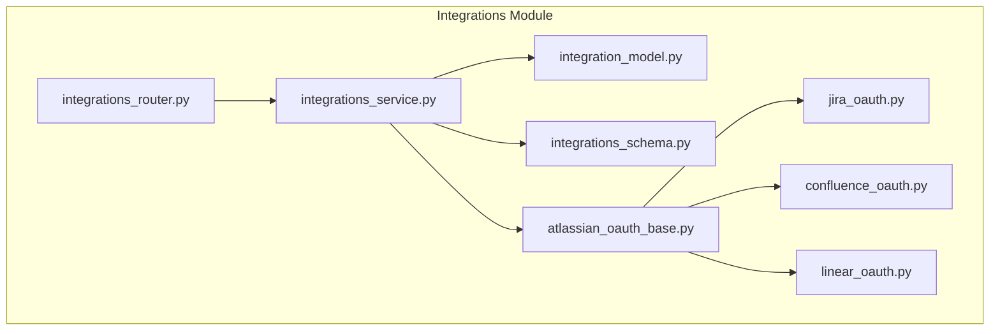
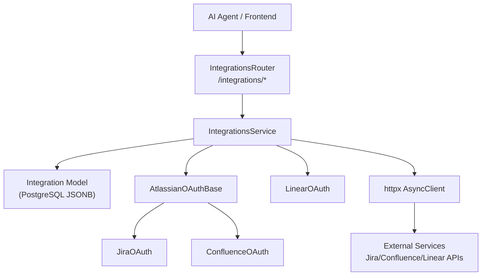
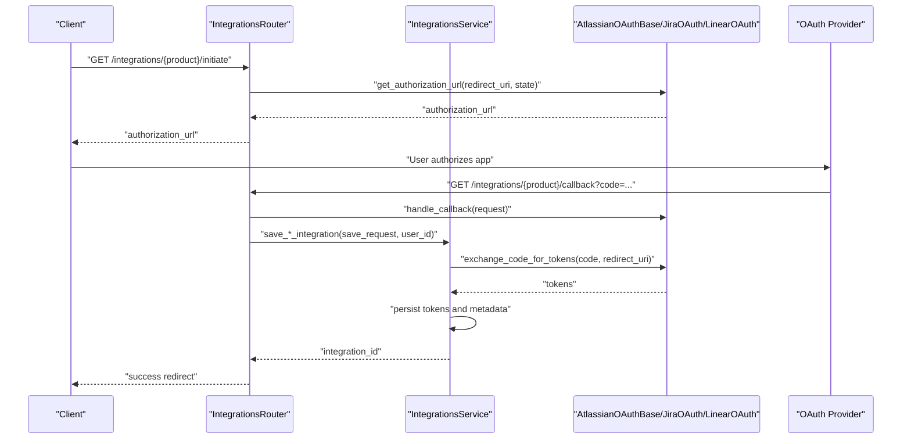
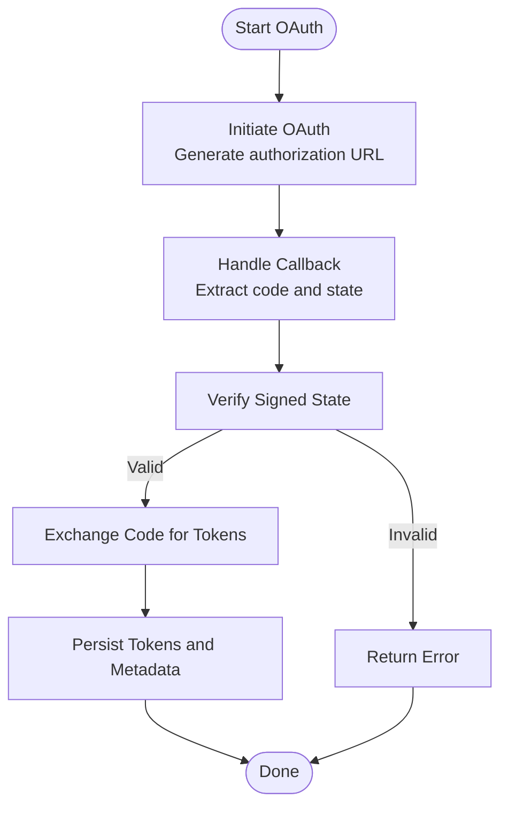
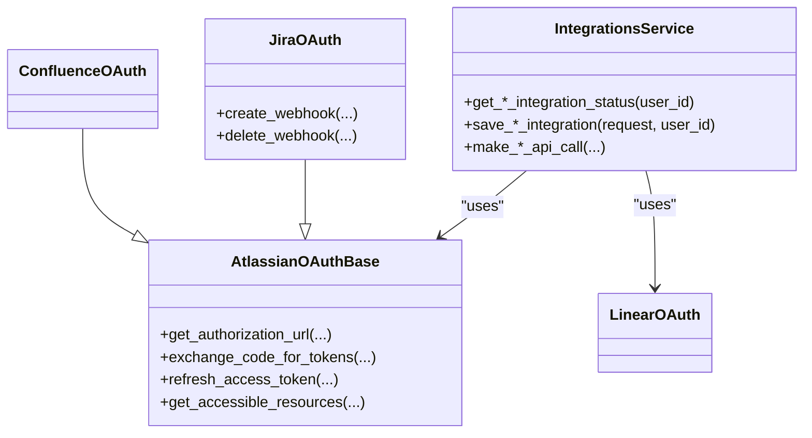
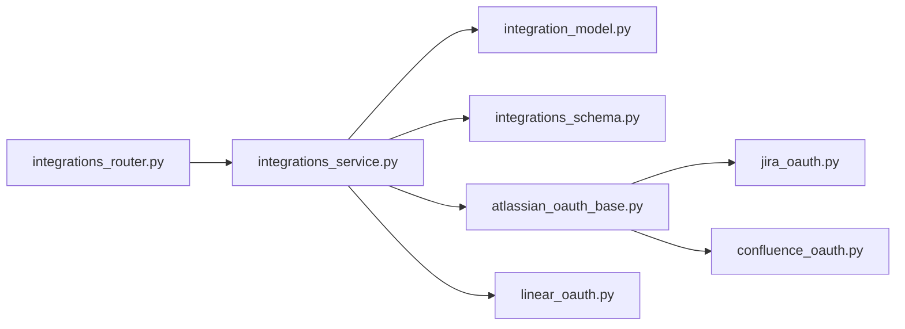
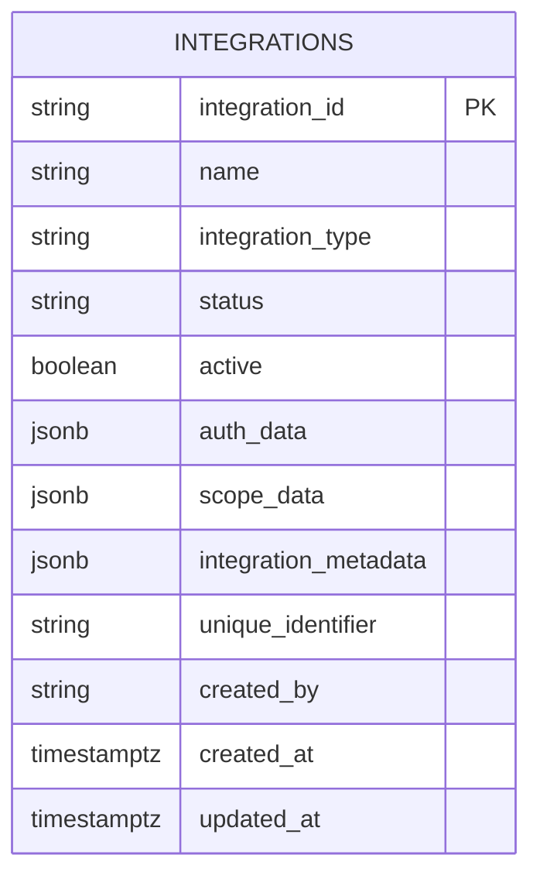

# Atlassian Integration Tools

<cite>
**Referenced Files in This Document**
- [integration_model.py](file://app/modules/integrations/integration_model.py)
- [integrations_service.py](file://app/modules/integrations/integrations_service.py)
- [integrations_router.py](file://app/modules/integrations/integrations_router.py)
- [integrations_schema.py](file://app/modules/integrations/integrations_schema.py)
- [atlassian_oauth_base.py](file://app/modules/integrations/atlassian_oauth_base.py)
- [jira_oauth.py](file://app/modules/integrations/jira_oauth.py)
- [confluence_oauth.py](file://app/modules/integrations/confluence_oauth.py)
- [linear_oauth.py](file://app/modules/integrations/linear_oauth.py)
</cite>

## Table of Contents
1. [Introduction](#introduction)
2. [Project Structure](#project-structure)
3. [Core Components](#core-components)
4. [Architecture Overview](#architecture-overview)
5. [Detailed Component Analysis](#detailed-component-analysis)
6. [Dependency Analysis](#dependency-analysis)
7. [Performance Considerations](#performance-considerations)
8. [Troubleshooting Guide](#troubleshooting-guide)
9. [Conclusion](#conclusion)
10. [Appendices](#appendices)

## Introduction
This document explains the Atlassian integration tools that enable AI agents to interact with Jira, Confluence, and Linear services. It covers how these tools automate issue tracking, documentation management, and project collaboration workflows. The focus is on the OAuth-based authentication flows, the service layer that manages integrations, and the patterns used to call external APIs securely and reliably. You will learn how to implement custom Atlassian integrations, how to handle rate limiting and errors, and how to apply the tools in practical scenarios such as automated issue creation, documentation updates, and project tracking.

## Project Structure
The Atlassian integration capabilities are implemented under the integrations module. The key pieces are:
- OAuth base and product-specific OAuth handlers for Jira, Confluence, and Linear
- A service layer that orchestrates saving integrations, validating tokens, and making authenticated API calls
- A router that exposes endpoints for initiating OAuth flows, handling callbacks, and retrieving statuses
- A shared database model for storing integration metadata, tokens, and scope data
- Pydantic schemas that define request/response contracts for integrations

**Diagram sources**
- [integrations_router.py](file://app/modules/integrations/integrations_router.py#L1-L800)
- [integrations_service.py](file://app/modules/integrations/integrations_service.py#L1-L800)
- [integration_model.py](file://app/modules/integrations/integration_model.py#L1-L44)
- [integrations_schema.py](file://app/modules/integrations/integrations_schema.py#L1-L428)
- [atlassian_oauth_base.py](file://app/modules/integrations/atlassian_oauth_base.py#L1-L383)
- [jira_oauth.py](file://app/modules/integrations/jira_oauth.py#L1-L149)
- [confluence_oauth.py](file://app/modules/integrations/confluence_oauth.py#L1-L82)
- [linear_oauth.py](file://app/modules/integrations/linear_oauth.py#L1-L264)

**Section sources**
- [integrations_router.py](file://app/modules/integrations/integrations_router.py#L1-L800)
- [integrations_service.py](file://app/modules/integrations/integrations_service.py#L1-L800)
- [integration_model.py](file://app/modules/integrations/integration_model.py#L1-L44)
- [integrations_schema.py](file://app/modules/integrations/integrations_schema.py#L1-L428)
- [atlassian_oauth_base.py](file://app/modules/integrations/atlassian_oauth_base.py#L1-L383)
- [jira_oauth.py](file://app/modules/integrations/jira_oauth.py#L1-L149)
- [confluence_oauth.py](file://app/modules/integrations/confluence_oauth.py#L1-L82)
- [linear_oauth.py](file://app/modules/integrations/linear_oauth.py#L1-L264)

## Core Components
- OAuth base and product-specific handlers:
  - AtlassianOAuthBase defines the shared OAuth 2.0 (3LO) flow, authorization URL generation, token exchange, refresh, and resource discovery.
  - JiraOAuth extends the base with Jira-specific scopes and adds webhook management helpers.
  - ConfluenceOAuth extends the base with Confluence-specific scopes; it intentionally omits webhook creation since OAuth 2.0 apps cannot register webhooks programmatically in Confluence.
  - LinearOAuth implements Linear’s distinct OAuth flow and GraphQL-based user info retrieval.
- IntegrationsService:
  - Manages integration lifecycle: saving integrations, validating tokens, refreshing tokens, and making authenticated API calls.
  - Provides product-specific methods for Jira and Linear, and generic helpers for Atlassian products.
- IntegrationsRouter:
  - Exposes endpoints to initiate OAuth, handle callbacks, revoke access, and check status for Jira, Confluence, and Linear.
- Integration model and schemas:
  - Integration database model stores tokens, scopes, and metadata.
  - Pydantic schemas define request/response contracts for integrations and OAuth flows.

**Section sources**
- [atlassian_oauth_base.py](file://app/modules/integrations/atlassian_oauth_base.py#L56-L383)
- [jira_oauth.py](file://app/modules/integrations/jira_oauth.py#L12-L149)
- [confluence_oauth.py](file://app/modules/integrations/confluence_oauth.py#L16-L82)
- [linear_oauth.py](file://app/modules/integrations/linear_oauth.py#L51-L264)
- [integrations_service.py](file://app/modules/integrations/integrations_service.py#L40-L800)
- [integrations_router.py](file://app/modules/integrations/integrations_router.py#L1-L800)
- [integration_model.py](file://app/modules/integrations/integration_model.py#L7-L44)
- [integrations_schema.py](file://app/modules/integrations/integrations_schema.py#L65-L428)

## Architecture Overview
The integration architecture follows a layered design:
- Router layer exposes HTTP endpoints for OAuth initiation, callbacks, and status checks.
- Service layer encapsulates business logic, token management, and external API calls.
- OAuth handlers encapsulate provider-specific flows and token storage.
- Database layer persists integration records with encrypted tokens and metadata.

**Diagram sources**
- [integrations_router.py](file://app/modules/integrations/integrations_router.py#L1-L800)
- [integrations_service.py](file://app/modules/integrations/integrations_service.py#L1-L800)
- [atlassian_oauth_base.py](file://app/modules/integrations/atlassian_oauth_base.py#L1-L383)
- [jira_oauth.py](file://app/modules/integrations/jira_oauth.py#L1-L149)
- [confluence_oauth.py](file://app/modules/integrations/confluence_oauth.py#L1-L82)
- [linear_oauth.py](file://app/modules/integrations/linear_oauth.py#L1-L264)

## Detailed Component Analysis

### OAuth Flows and Token Management
- AtlassianOAuthBase:
  - Generates authorization URLs with configurable scopes and state protection.
  - Exchanges authorization codes for tokens and refreshes expired access tokens.
  - Retrieves accessible resources to discover cloud IDs and scopes.
  - Stores tokens in an in-memory store with expiration checks.
- JiraOAuth:
  - Extends base with Jira-specific scopes and provides helpers to create and delete webhooks.
- ConfluenceOAuth:
  - Extends base with Confluence-specific scopes; no webhook creation in this class because OAuth 2.0 apps cannot register webhooks programmatically in Confluence.
- LinearOAuth:
  - Implements Linear’s OAuth flow, token exchange, and GraphQL-based user info retrieval.
  - Maintains its own in-memory token store separate from Atlassian.

**Diagram sources**
- [integrations_router.py](file://app/modules/integrations/integrations_router.py#L617-L800)
- [integrations_service.py](file://app/modules/integrations/integrations_service.py#L1-L800)
- [atlassian_oauth_base.py](file://app/modules/integrations/atlassian_oauth_base.py#L114-L383)
- [jira_oauth.py](file://app/modules/integrations/jira_oauth.py#L12-L149)
- [linear_oauth.py](file://app/modules/integrations/linear_oauth.py#L51-L264)

**Section sources**
- [atlassian_oauth_base.py](file://app/modules/integrations/atlassian_oauth_base.py#L56-L383)
- [jira_oauth.py](file://app/modules/integrations/jira_oauth.py#L12-L149)
- [confluence_oauth.py](file://app/modules/integrations/confluence_oauth.py#L16-L82)
- [linear_oauth.py](file://app/modules/integrations/linear_oauth.py#L51-L264)
- [integrations_router.py](file://app/modules/integrations/integrations_router.py#L385-L542)
- [integrations_service.py](file://app/modules/integrations/integrations_service.py#L1-L800)

### Jira Operations
- Issue management:
  - The service layer coordinates saving Jira integrations and can be extended to call Jira REST endpoints using stored tokens.
- Search:
  - The service layer can be extended to call Jira’s search endpoints using stored tokens.
- Comments:
  - The service layer can be extended to add comments to issues using stored tokens.
- Transitions:
  - The service layer can be extended to transition issues using stored tokens.

Implementation pattern:
- Retrieve a valid access token (refreshing if needed).
- Call Jira REST API endpoints with Authorization headers.
- Handle responses and propagate errors.

Note: The current codebase includes Jira OAuth and webhook helpers but does not include dedicated tool modules for issue management, search, comments, and transitions. These can be implemented by adding tool functions that follow the established patterns in the service layer.

**Section sources**
- [integrations_service.py](file://app/modules/integrations/integrations_service.py#L1-L800)
- [jira_oauth.py](file://app/modules/integrations/jira_oauth.py#L12-L149)

### Confluence Operations
- Space management:
  - The service layer can be extended to call Confluence REST endpoints for space operations using stored tokens.
- Page operations:
  - The service layer can be extended to create, update, and delete pages using stored tokens.
- Search:
  - The service layer can be extended to search content using stored tokens.

Implementation pattern:
- Retrieve a valid access token (refreshing if needed).
- Call Confluence REST API endpoints with Authorization headers.
- Handle responses and propagate errors.

Note: The current codebase includes Confluence OAuth with product-specific scopes but does not include dedicated tool modules for space/page operations or search. These can be implemented by adding tool functions that follow the established patterns in the service layer.

**Section sources**
- [integrations_service.py](file://app/modules/integrations/integrations_service.py#L1-L800)
- [confluence_oauth.py](file://app/modules/integrations/confluence_oauth.py#L16-L82)

### Linear Operations
- Issue retrieval:
  - The service layer can be extended to call Linear’s GraphQL API for issue retrieval using stored tokens.
- Updates:
  - The service layer can be extended to update issues using Linear’s GraphQL mutations.

Implementation pattern:
- Retrieve a valid access token (refreshing if needed).
- Call Linear GraphQL endpoints with Authorization headers.
- Handle responses and propagate errors.

Note: The current codebase includes Linear OAuth and GraphQL user info retrieval but does not include dedicated tool modules for issue retrieval or updates. These can be implemented by adding tool functions that follow the established patterns in the service layer.

**Section sources**
- [integrations_service.py](file://app/modules/integrations/integrations_service.py#L1-L800)
- [linear_oauth.py](file://app/modules/integrations/linear_oauth.py#L51-L264)

### Authentication Flows
- State protection:
  - The router signs and verifies OAuth state using HMAC to prevent tampering.
- Token exchange:
  - The service layer exchanges authorization codes for tokens and persists them in the database.
- Token refresh:
  - The service layer refreshes expired access tokens using refresh tokens and updates the database.
- Access revocation:
  - The service layer removes cached tokens for a user.

**Diagram sources**
- [integrations_router.py](file://app/modules/integrations/integrations_router.py#L119-L178)
- [integrations_service.py](file://app/modules/integrations/integrations_service.py#L595-L788)

**Section sources**
- [integrations_router.py](file://app/modules/integrations/integrations_router.py#L119-L178)
- [integrations_service.py](file://app/modules/integrations/integrations_service.py#L595-L788)

### API Rate Limiting and Error Handling Strategies
- Rate limiting:
  - The codebase does not implement explicit rate limiting. When calling external APIs, consider:
    - Backoff and retry with exponential delay on 429 responses.
    - Respect provider-specific limits and implement client-side throttling.
- Error handling:
  - OAuth flows log sanitized error details and raise exceptions with minimal messages to avoid leaking sensitive data.
  - API calls use HTTP status checks and structured logging for failures.
  - Token refresh logs sanitized errors and full responses at debug level for troubleshooting.

Recommendations:
- Add retry policies with jitter for transient failures.
- Implement circuit breakers for external API calls.
- Centralize error mapping to user-friendly messages.

**Section sources**
- [integrations_service.py](file://app/modules/integrations/integrations_service.py#L214-L254)
- [integrations_service.py](file://app/modules/integrations/integrations_service.py#L424-L455)
- [integrations_service.py](file://app/modules/integrations/integrations_service.py#L569-L571)

### Relationships with Integrations Service and OAuth Providers
- IntegrationsService composes OAuth providers and manages integration persistence.
- OAuth providers encapsulate provider-specific flows and token storage.
- Router depends on IntegrationsService to save integrations and retrieve status.

**Diagram sources**
- [integrations_service.py](file://app/modules/integrations/integrations_service.py#L40-L800)
- [atlassian_oauth_base.py](file://app/modules/integrations/atlassian_oauth_base.py#L56-L383)
- [jira_oauth.py](file://app/modules/integrations/jira_oauth.py#L12-L149)
- [confluence_oauth.py](file://app/modules/integrations/confluence_oauth.py#L16-L82)
- [linear_oauth.py](file://app/modules/integrations/linear_oauth.py#L51-L264)

**Section sources**
- [integrations_service.py](file://app/modules/integrations/integrations_service.py#L40-L800)
- [atlassian_oauth_base.py](file://app/modules/integrations/atlassian_oauth_base.py#L56-L383)
- [jira_oauth.py](file://app/modules/integrations/jira_oauth.py#L12-L149)
- [confluence_oauth.py](file://app/modules/integrations/confluence_oauth.py#L16-L82)
- [linear_oauth.py](file://app/modules/integrations/linear_oauth.py#L51-L264)

### Common Use Cases
- Automated issue creation:
  - Use Jira OAuth to create issues via REST endpoints with stored tokens.
- Documentation updates:
  - Use Confluence OAuth to create/update pages and upload attachments.
- Project tracking:
  - Use Linear OAuth to retrieve and update issues via GraphQL.

Implementation approach:
- Implement tool functions that retrieve valid tokens from the service layer.
- Call provider APIs with Authorization headers.
- Handle responses and update integration metadata as needed.

[No sources needed since this section provides general guidance]

## Dependency Analysis
The integrations module exhibits clear separation of concerns:
- Router depends on service layer and OAuth providers.
- Service layer depends on OAuth providers and database model.
- OAuth providers depend on configuration and HTTP clients.
- Database model is used by service layer for persistence.

**Diagram sources**
- [integrations_router.py](file://app/modules/integrations/integrations_router.py#L1-L800)
- [integrations_service.py](file://app/modules/integrations/integrations_service.py#L1-L800)
- [integration_model.py](file://app/modules/integrations/integration_model.py#L1-L44)
- [integrations_schema.py](file://app/modules/integrations/integrations_schema.py#L1-L428)
- [atlassian_oauth_base.py](file://app/modules/integrations/atlassian_oauth_base.py#L1-L383)
- [jira_oauth.py](file://app/modules/integrations/jira_oauth.py#L1-L149)
- [confluence_oauth.py](file://app/modules/integrations/confluence_oauth.py#L1-L82)
- [linear_oauth.py](file://app/modules/integrations/linear_oauth.py#L1-L264)

**Section sources**
- [integrations_router.py](file://app/modules/integrations/integrations_router.py#L1-L800)
- [integrations_service.py](file://app/modules/integrations/integrations_service.py#L1-L800)
- [integration_model.py](file://app/modules/integrations/integration_model.py#L1-L44)
- [integrations_schema.py](file://app/modules/integrations/integrations_schema.py#L1-L428)
- [atlassian_oauth_base.py](file://app/modules/integrations/atlassian_oauth_base.py#L1-L383)
- [jira_oauth.py](file://app/modules/integrations/jira_oauth.py#L1-L149)
- [confluence_oauth.py](file://app/modules/integrations/confluence_oauth.py#L1-L82)
- [linear_oauth.py](file://app/modules/integrations/linear_oauth.py#L1-L264)

## Performance Considerations
- Token caching:
  - Use in-memory stores for tokens to reduce repeated token exchanges.
- Asynchronous HTTP:
  - Use async HTTP clients to minimize latency when calling external APIs.
- Retry and backoff:
  - Implement retry policies with exponential backoff for transient failures.
- Circuit breaker:
  - Protect downstream APIs with circuit breakers to prevent cascading failures.
- Logging overhead:
  - Avoid logging sensitive token data; log only sanitized summaries.

[No sources needed since this section provides general guidance]

## Troubleshooting Guide
- OAuth initiation fails:
  - Verify OAuth credentials and state signing configuration.
  - Check that redirect URIs match exactly what was registered.
- Token exchange fails:
  - Inspect sanitized error logs and full response bodies at debug level.
  - Ensure authorization code is fresh and not reused.
- Token refresh fails:
  - Confirm refresh token presence and validity.
  - Review provider-specific error messages and adjust scopes if needed.
- API calls fail:
  - Validate access token expiration and refresh as needed.
  - Check provider rate limits and implement retries with backoff.

**Section sources**
- [integrations_service.py](file://app/modules/integrations/integrations_service.py#L214-L254)
- [integrations_service.py](file://app/modules/integrations/integrations_service.py#L424-L455)
- [integrations_service.py](file://app/modules/integrations/integrations_service.py#L569-L571)
- [integrations_router.py](file://app/modules/integrations/integrations_router.py#L119-L178)

## Conclusion
The Atlassian integration tools provide a robust foundation for AI agents to interact with Jira, Confluence, and Linear. By leveraging OAuth 2.0 flows, token management, and provider-specific helpers, you can implement automation for issue tracking, documentation management, and project collaboration. Extend the service layer with dedicated tool functions to cover Jira, Confluence, and Linear operations, and apply the established patterns for authentication, error handling, and performance.

[No sources needed since this section summarizes without analyzing specific files]

## Appendices

### Data Model Overview

**Diagram sources**
- [integration_model.py](file://app/modules/integrations/integration_model.py#L7-L44)

**Section sources**
- [integration_model.py](file://app/modules/integrations/integration_model.py#L7-L44)