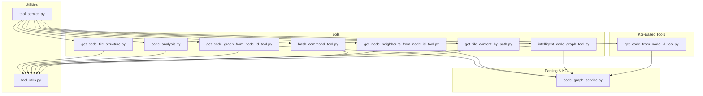
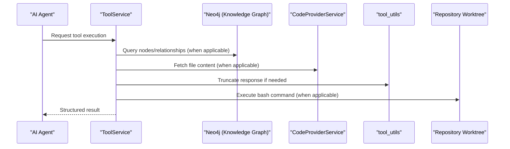
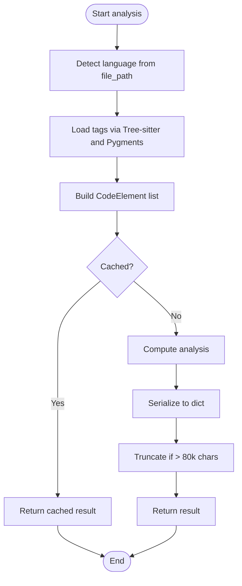
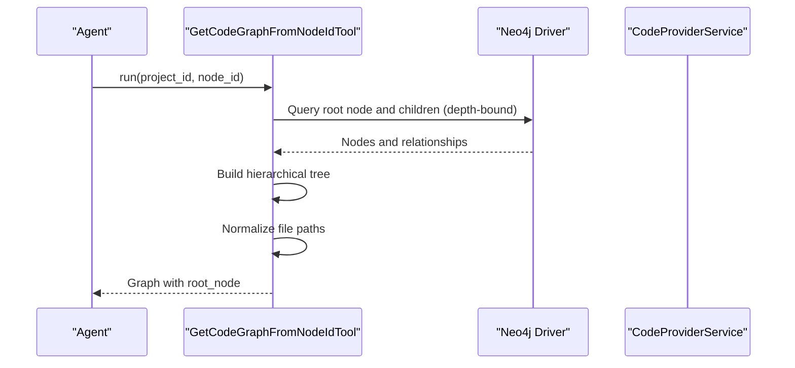
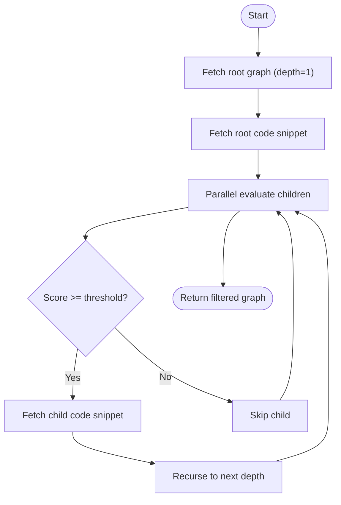
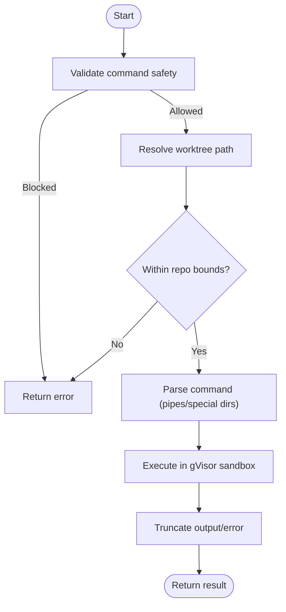
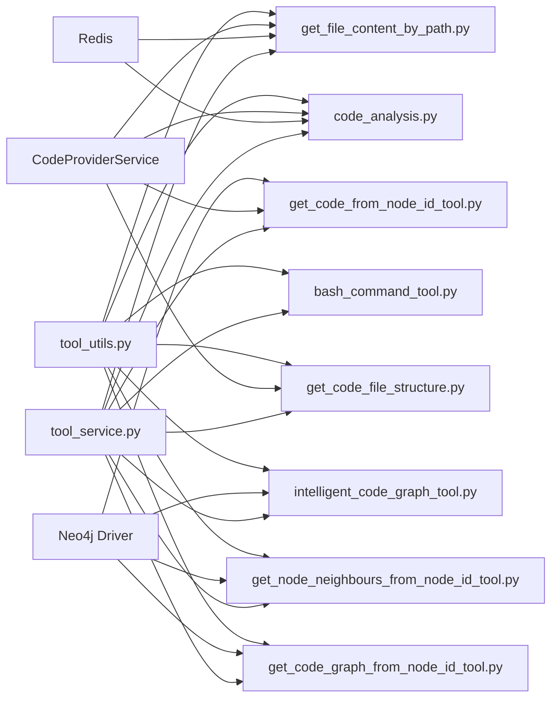

# Code Query Tools

<cite>
**Referenced Files in This Document**
- [get_code_file_structure.py](file://app/modules/intelligence/tools/code_query_tools/get_code_file_structure.py)
- [code_analysis.py](file://app/modules/intelligence/tools/code_query_tools/code_analysis.py)
- [get_code_graph_from_node_id_tool.py](file://app/modules/intelligence/tools/code_query_tools/get_code_graph_from_node_id_tool.py)
- [get_node_neighbours_from_node_id_tool.py](file://app/modules/intelligence/tools/code_query_tools/get_node_neighbours_from_node_id_tool.py)
- [intelligent_code_graph_tool.py](file://app/modules/intelligence/tools/code_query_tools/intelligent_code_graph_tool.py)
- [bash_command_tool.py](file://app/modules/intelligence/tools/code_query_tools/bash_command_tool.py)
- [get_file_content_by_path.py](file://app/modules/intelligence/tools/code_query_tools/get_file_content_by_path.py)
- [tool_utils.py](file://app/modules/intelligence/tools/tool_utils.py)
- [tool_service.py](file://app/modules/intelligence/tools/tool_service.py)
- [get_code_from_node_id_tool.py](file://app/modules/intelligence/tools/kg_based_tools/get_code_from_node_id_tool.py)
- [code_graph_service.py](file://app/modules/parsing/graph_construction/code_graph_service.py)
</cite>

## Table of Contents
1. [Introduction](#introduction)
2. [Project Structure](#project-structure)
3. [Core Components](#core-components)
4. [Architecture Overview](#architecture-overview)
5. [Detailed Component Analysis](#detailed-component-analysis)
6. [Dependency Analysis](#dependency-analysis)
7. [Performance Considerations](#performance-considerations)
8. [Troubleshooting Guide](#troubleshooting-guide)
9. [Conclusion](#conclusion)

## Introduction
This document explains the code query tools that enable AI agents to explore, analyze, and navigate code repositories. These tools provide capabilities to:
- Explore repository structure
- Analyze code structure and extract metadata
- Query the knowledge graph for nodes and relationships
- Fetch specific file content with safeguards
- Execute read-only bash commands in a sandboxed environment

They integrate tightly with the parsing pipeline and knowledge graph to deliver accurate, contextual insights for tasks like code exploration, dependency analysis, and automated code review.

## Project Structure
The code query tools live under the intelligence module’s tools package, organized by functional domains:
- Code query tools: focused on repository exploration and analysis
- KG-based tools: focused on retrieving code and metadata from the knowledge graph
- Utilities: shared helpers for response truncation and tool orchestration

**Diagram sources**
- [get_code_file_structure.py](file://app/modules/intelligence/tools/code_query_tools/get_code_file_structure.py#L1-L95)
- [code_analysis.py](file://app/modules/intelligence/tools/code_query_tools/code_analysis.py#L1-L593)
- [get_code_graph_from_node_id_tool.py](file://app/modules/intelligence/tools/code_query_tools/get_code_graph_from_node_id_tool.py#L1-L238)
- [get_node_neighbours_from_node_id_tool.py](file://app/modules/intelligence/tools/code_query_tools/get_node_neighbours_from_node_id_tool.py#L1-L131)
- [intelligent_code_graph_tool.py](file://app/modules/intelligence/tools/code_query_tools/intelligent_code_graph_tool.py#L1-L466)
- [bash_command_tool.py](file://app/modules/intelligence/tools/code_query_tools/bash_command_tool.py#L1-L877)
- [get_file_content_by_path.py](file://app/modules/intelligence/tools/code_query_tools/get_file_content_by_path.py#L1-L250)
- [tool_utils.py](file://app/modules/intelligence/tools/tool_utils.py#L1-L75)
- [tool_service.py](file://app/modules/intelligence/tools/tool_service.py#L1-L263)
- [get_code_from_node_id_tool.py](file://app/modules/intelligence/tools/kg_based_tools/get_code_from_node_id_tool.py#L1-L186)
- [code_graph_service.py](file://app/modules/parsing/graph_construction/code_graph_service.py#L1-L240)

**Section sources**
- [tool_service.py](file://app/modules/intelligence/tools/tool_service.py#L134-L242)

## Core Components
This section summarizes each tool’s purpose, parameters, return values, and performance characteristics.

- get_code_file_structure
  - Purpose: Retrieve hierarchical file structure for a repository or subdirectory.
  - Parameters: project_id (UUID), path (optional).
  - Returns: String with directory tree; truncated if exceeding 80k characters.
  - Notes: Uses CodeProviderService; response truncated via tool_utils.truncate_response.

- code_analysis (universal_analyze_code_tool)
  - Purpose: Analyze a single file and extract code elements (functions, classes, methods, etc.) with metadata.
  - Parameters: project_id (UUID), file_path, include_methods (bool), include_private (bool), language (optional).
  - Returns: Structured analysis with element details and counts; truncated if exceeding 80k characters.
  - Notes: Uses Tree-sitter and Pygments; caches results in Redis; truncates via truncate_dict_response.

- get_code_graph_from_node_id
  - Purpose: Retrieve a code graph around a specific node (including children) from the knowledge graph.
  - Parameters: project_id (UUID), node_id (UUID).
  - Returns: Dictionary with graph metadata and root_node tree; includes file_path normalization.
  - Notes: Queries Neo4j; builds hierarchical tree; truncates large outputs.

- get_node_neighbours_from_node_id
  - Purpose: Retrieve immediate neighbors (inbound/outbound) of one or more nodes within 1 hop.
  - Parameters: project_id (UUID), node_ids (list of UUIDs).
  - Returns: List of neighbor nodes with node_id, name, and docstring.
  - Notes: Uses Neo4j; supports multiple node_ids; truncates large outputs.

- intelligent_code_graph
  - Purpose: Intelligently filter a code graph around a node by relevance heuristics for integration testing.
  - Parameters: project_id (UUID), node_id (UUID), relevance_threshold (float, default 0.6), max_depth (int, default 5).
  - Returns: Filtered graph with relevance scores and reasons; includes node counts.
  - Notes: Combines knowledge graph retrieval with rule-based filtering; parallelizes child evaluation.

- bash_command
  - Purpose: Execute read-only bash commands on the repository worktree with strong sandboxing.
  - Parameters: project_id (UUID), command (string), working_directory (optional).
  - Returns: Dictionary with success, output, error, exit_code; truncated if exceeding limits.
  - Notes: Whitelist-based security; gVisor sandbox; validates command safety; truncates outputs.

- fetch_file
  - Purpose: Fetch file content with optional line ranges and optional line numbering.
  - Parameters: project_id (UUID), file_path, start_line (optional), end_line (optional).
  - Returns: Dictionary with success and content; enforces 1200-line limit and 80k-character truncation.
  - Notes: Uses CodeProviderService; caches via Redis; strict line-range enforcement.

**Section sources**
- [get_code_file_structure.py](file://app/modules/intelligence/tools/code_query_tools/get_code_file_structure.py#L18-L94)
- [code_analysis.py](file://app/modules/intelligence/tools/code_query_tools/code_analysis.py#L29-L592)
- [get_code_graph_from_node_id_tool.py](file://app/modules/intelligence/tools/code_query_tools/get_code_graph_from_node_id_tool.py#L15-L237)
- [get_node_neighbours_from_node_id_tool.py](file://app/modules/intelligence/tools/code_query_tools/get_node_neighbours_from_node_id_tool.py#L15-L130)
- [intelligent_code_graph_tool.py](file://app/modules/intelligence/tools/code_query_tools/intelligent_code_graph_tool.py#L49-L465)
- [bash_command_tool.py](file://app/modules/intelligence/tools/code_query_tools/bash_command_tool.py#L445-L877)
- [get_file_content_by_path.py](file://app/modules/intelligence/tools/code_query_tools/get_file_content_by_path.py#L15-L249)

## Architecture Overview
The tools integrate with the parsing pipeline and knowledge graph as follows:
- Parsing pipeline constructs the knowledge graph (nodes and relationships) and stores them in Neo4j.
- Code query tools read from Neo4j (graph queries) and from the repository via CodeProviderService.
- Utility functions enforce response size limits and provide consistent truncation behavior.
- ToolService orchestrates tool registration and exposes tool metadata.

**Diagram sources**
- [tool_service.py](file://app/modules/intelligence/tools/tool_service.py#L134-L242)
- [get_code_from_node_id_tool.py](file://app/modules/intelligence/tools/kg_based_tools/get_code_from_node_id_tool.py#L58-L155)
- [code_graph_service.py](file://app/modules/parsing/graph_construction/code_graph_service.py#L15-L240)
- [tool_utils.py](file://app/modules/intelligence/tools/tool_utils.py#L13-L74)
- [bash_command_tool.py](file://app/modules/intelligence/tools/code_query_tools/bash_command_tool.py#L585-L800)

## Detailed Component Analysis

### get_code_file_structure
Purpose:
- Provide a human-readable directory tree for a repository or subdirectory.

Key behaviors:
- Uses CodeProviderService to fetch project structure asynchronously.
- Applies truncation to keep responses manageable.
- Logs truncation events for observability.

Parameters:
- project_id: UUID of the repository.
- path: Optional subdirectory path.

Return value:
- String representing the directory tree; truncated if exceeding 80k characters.

Performance considerations:
- Asynchronous fetch reduces latency.
- Truncation prevents oversized responses.

Security and safety:
- No external commands; relies on repository APIs.

Common use cases:
- Initial repository exploration.
- Navigating large monorepos.

**Section sources**
- [get_code_file_structure.py](file://app/modules/intelligence/tools/code_query_tools/get_code_file_structure.py#L23-L94)
- [tool_utils.py](file://app/modules/intelligence/tools/tool_utils.py#L13-L28)

### code_analysis (universal_analyze_code_tool)
Purpose:
- Analyze a single file and extract code elements with rich metadata.

Key behaviors:
- Detects language automatically from file extension.
- Uses Tree-sitter queries and Pygments as fallback to extract definitions and references.
- Builds a structured list of CodeElement entries with signatures, visibility, async/static flags, and docstrings.
- Caches results in Redis keyed by parameters to reduce repeated computation.
- Truncates large outputs to 80k characters.

Parameters:
- project_id: UUID of the repository.
- file_path: Path within the repository.
- include_methods: Whether to include methods.
- include_private: Whether to include private functions/methods.
- language: Optional language override.

Return value:
- Dictionary with success flag, file_path, language, totals, and elements list; truncated if needed.

Performance considerations:
- Redis caching improves repeated queries.
- Parallel processing of tags and elements.
- Truncation prevents LLM overload.

Security and safety:
- Reads only; no writes.

Common use cases:
- Automated code review summaries.
- Dependency analysis by element type.
- Onboarding new team members to codebases.

**Diagram sources**
- [code_analysis.py](file://app/modules/intelligence/tools/code_query_tools/code_analysis.py#L329-L414)
- [code_analysis.py](file://app/modules/intelligence/tools/code_query_tools/code_analysis.py#L461-L566)
- [tool_utils.py](file://app/modules/intelligence/tools/tool_utils.py#L31-L74)

**Section sources**
- [code_analysis.py](file://app/modules/intelligence/tools/code_query_tools/code_analysis.py#L417-L592)
- [tool_utils.py](file://app/modules/intelligence/tools/tool_utils.py#L31-L74)

### get_code_graph_from_node_id
Purpose:
- Retrieve a code graph centered on a specific node, including children up to a configurable depth.

Key behaviors:
- Queries Neo4j for the root node and expands to children within a bounded depth.
- Normalizes absolute file paths to relative paths for readability.
- Builds a hierarchical tree and returns graph metadata.

Parameters:
- project_id: UUID of the repository.
- node_id: UUID of the starting node.

Return value:
- Dictionary with graph name, repo_name, branch_name, and root_node tree.

Performance considerations:
- Uses APOC procedures to efficiently expand subgraphs.
- Builds tree iteratively to avoid cycles.

Security and safety:
- Reads only; no writes.

Common use cases:
- Exploring call graphs and dependencies.
- Understanding the impact of a specific function or class.

**Diagram sources**
- [get_code_graph_from_node_id_tool.py](file://app/modules/intelligence/tools/code_query_tools/get_code_graph_from_node_id_tool.py#L59-L193)
- [code_graph_service.py](file://app/modules/parsing/graph_construction/code_graph_service.py#L180-L196)

**Section sources**
- [get_code_graph_from_node_id_tool.py](file://app/modules/intelligence/tools/code_query_tools/get_code_graph_from_node_id_tool.py#L15-L237)

### get_node_neighbours_from_node_id
Purpose:
- Retrieve immediate neighbors (inbound and outbound) of one or more nodes within 1 hop.

Key behaviors:
- Executes a single-hop traversal query to collect neighbor nodes.
- Returns node_id, name, and docstring for each neighbor.

Parameters:
- project_id: UUID of the repository.
- node_ids: List of node IDs.

Return value:
- Dictionary with a neighbors list.

Performance considerations:
- Single-hop traversal minimizes query cost.
- Suitable for quick dependency checks.

Security and safety:
- Reads only; no writes.

Common use cases:
- Finding callers and callees of a function.
- Quick cross-reference discovery.

**Section sources**
- [get_node_neighbours_from_node_id_tool.py](file://app/modules/intelligence/tools/code_query_tools/get_node_neighbours_from_node_id_tool.py#L22-L130)

### intelligent_code_graph
Purpose:
- Intelligently filter a code graph around a node by relevance heuristics tailored for integration testing.

Key behaviors:
- Starts with a shallow graph around the root node.
- Evaluates children in parallel using rule-based scoring (names/types).
- Retrieves code snippets for relevant nodes to refine decisions.
- Builds a filtered graph with relevance_score and reason.

Parameters:
- project_id: UUID of the repository.
- node_id: UUID of the starting node.
- relevance_threshold: Minimum relevance score (default 0.6).
- max_depth: Maximum depth to traverse (default 5).

Return value:
- Dictionary with graph metadata, filtered root_node, and statistics.

Performance considerations:
- Parallel evaluation of children improves responsiveness.
- Simplified fallback when evaluation fails.
- Counts nodes included for transparency.

Security and safety:
- Reads only; no writes.

Common use cases:
- Generating focused integration test contexts.
- Reducing noise in code exploration for large systems.

**Diagram sources**
- [intelligent_code_graph_tool.py](file://app/modules/intelligence/tools/code_query_tools/intelligent_code_graph_tool.py#L103-L259)

**Section sources**
- [intelligent_code_graph_tool.py](file://app/modules/intelligence/tools/code_query_tools/intelligent_code_graph_tool.py#L49-L465)

### bash_command
Purpose:
- Execute read-only bash commands on the repository worktree with strong sandboxing.

Key behaviors:
- Validates commands against a whitelist and blocks write operations.
- Uses gVisor sandbox to isolate execution and prevent filesystem modifications.
- Supports pipes for filtering and working_directory for subdirectory execution.
- Enforces output truncation and logs truncation notices.

Parameters:
- project_id: UUID of the repository.
- command: Read-only command string.
- working_directory: Optional subdirectory within the repo.

Return value:
- Dictionary with success, output, error, and exit_code; truncated if needed.

Performance considerations:
- Uses shlex to parse commands safely.
- Limits output lengths to prevent LLM overload.

Security and safety:
- Whitelist-based validation.
- gVisor sandbox with read-only mounts.
- Blocks dangerous patterns and flags.

Common use cases:
- Searching for patterns across files.
- Counting lines or finding files.
- Filtering logs or configs.

**Diagram sources**
- [bash_command_tool.py](file://app/modules/intelligence/tools/code_query_tools/bash_command_tool.py#L585-L800)

**Section sources**
- [bash_command_tool.py](file://app/modules/intelligence/tools/code_query_tools/bash_command_tool.py#L445-L877)

### fetch_file
Purpose:
- Fetch file content with optional line ranges and optional line numbering.

Key behaviors:
- Enforces a 1200-line limit unless internal_call is true.
- Caches content in Redis keyed by path and line range.
- Adds line numbers when requested.
- Truncates content to 80k characters.

Parameters:
- project_id: UUID of the repository.
- file_path: Path within the repository.
- start_line: Optional start line (1-based, inclusive).
- end_line: Optional end line (inclusive).

Return value:
- Dictionary with success and content; enforces limits and truncation.

Performance considerations:
- Redis caching reduces repeated reads.
- Strict line-range enforcement prevents large requests.

Security and safety:
- Reads only; no writes.

Common use cases:
- Retrieving specific sections of large files.
- Providing line-numbered context for code review.

**Section sources**
- [get_file_content_by_path.py](file://app/modules/intelligence/tools/code_query_tools/get_file_content_by_path.py#L26-L249)

## Dependency Analysis
The tools share common dependencies and patterns:
- Shared truncation utilities for consistent response sizes.
- Neo4j driver initialization and configuration.
- CodeProviderService for repository content access.
- Redis for caching and performance.

**Diagram sources**
- [tool_utils.py](file://app/modules/intelligence/tools/tool_utils.py#L1-L75)
- [get_code_file_structure.py](file://app/modules/intelligence/tools/code_query_tools/get_code_file_structure.py#L9-L40)
- [code_analysis.py](file://app/modules/intelligence/tools/code_query_tools/code_analysis.py#L19-L448)
- [get_code_graph_from_node_id_tool.py](file://app/modules/intelligence/tools/code_query_tools/get_code_graph_from_node_id_tool.py#L38-L46)
- [get_node_neighbours_from_node_id_tool.py](file://app/modules/intelligence/tools/code_query_tools/get_node_neighbours_from_node_id_tool.py#L39-L55)
- [intelligent_code_graph_tool.py](file://app/modules/intelligence/tools/code_query_tools/intelligent_code_graph_tool.py#L69-L76)
- [get_file_content_by_path.py](file://app/modules/intelligence/tools/code_query_tools/get_file_content_by_path.py#L75-L81)
- [get_code_from_node_id_tool.py](file://app/modules/intelligence/tools/kg_based_tools/get_code_from_node_id_tool.py#L38-L41)
- [tool_service.py](file://app/modules/intelligence/tools/tool_service.py#L134-L242)

**Section sources**
- [tool_service.py](file://app/modules/intelligence/tools/tool_service.py#L134-L242)

## Performance Considerations
- Response size limits: All tools apply truncation to keep outputs under 80k characters, with notices when truncation occurs.
- Caching: Code analysis and file content use Redis caching to reduce repeated reads.
- Parallelization: Intelligent code graph evaluates children concurrently to improve responsiveness.
- Neo4j indexing: Graph queries leverage indices and APOC procedures for efficient traversal.
- Sandboxing: Bash commands run in a gVisor sandbox with timeouts and restricted environments.

[No sources needed since this section provides general guidance]

## Troubleshooting Guide
Common issues and resolutions:
- Truncated outputs: Many tools truncate responses; check logs for truncation notices and adjust queries to be more specific.
- Missing worktree for bash commands: Ensure the repository is parsed and available in the repo manager; otherwise, the tool returns an error.
- Command safety violations: Only whitelisted read-only commands are allowed; blocked commands include write operations and interpreters.
- Line limits exceeded: fetch_file enforces a 1200-line cap unless internal_call is true; narrow your start_line/end_line range.
- Node not found: Graph queries return errors when node_id or project_id are invalid; verify IDs and ensure the repository is parsed.
- Large graphs: Use intelligent_code_graph to filter by relevance and reduce depth to manage response size.

**Section sources**
- [tool_utils.py](file://app/modules/intelligence/tools/tool_utils.py#L13-L74)
- [bash_command_tool.py](file://app/modules/intelligence/tools/code_query_tools/bash_command_tool.py#L585-L800)
- [get_file_content_by_path.py](file://app/modules/intelligence/tools/code_query_tools/get_file_content_by_path.py#L104-L135)
- [get_code_from_node_id_tool.py](file://app/modules/intelligence/tools/kg_based_tools/get_code_from_node_id_tool.py#L58-L89)

## Conclusion
The code query tools provide a robust foundation for AI agents to explore, analyze, and navigate codebases. By combining repository APIs, knowledge graph queries, and controlled sandboxed execution, they enable practical workflows for code exploration, dependency analysis, and automated code review. Their design emphasizes safety, performance, and consistency through shared utilities and careful parameterization.