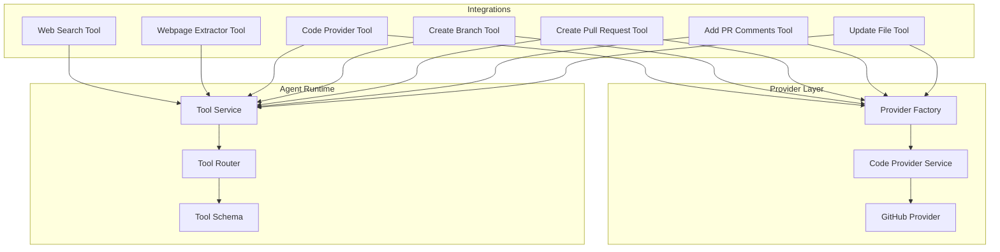
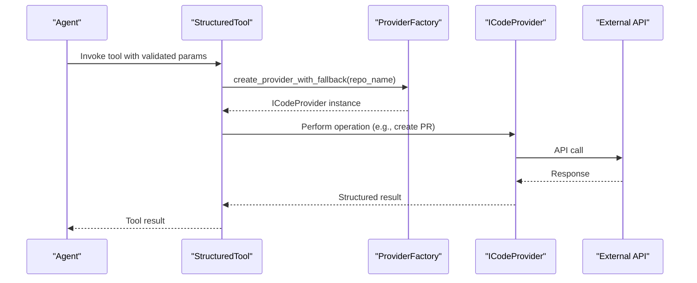
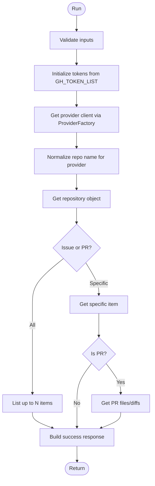
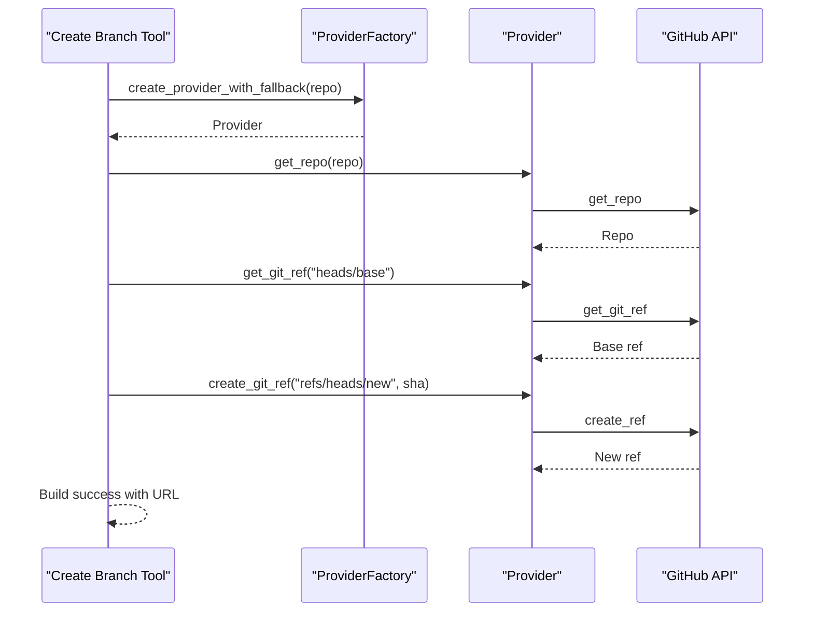
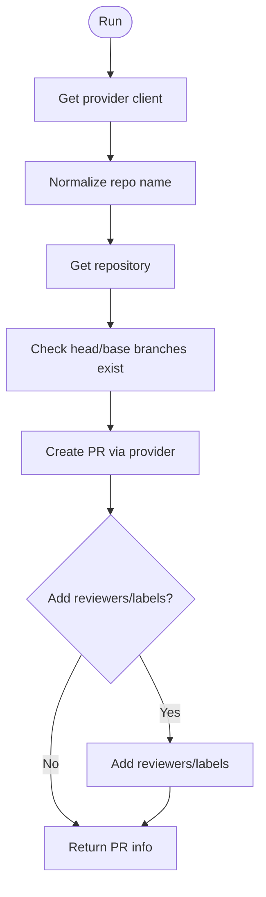
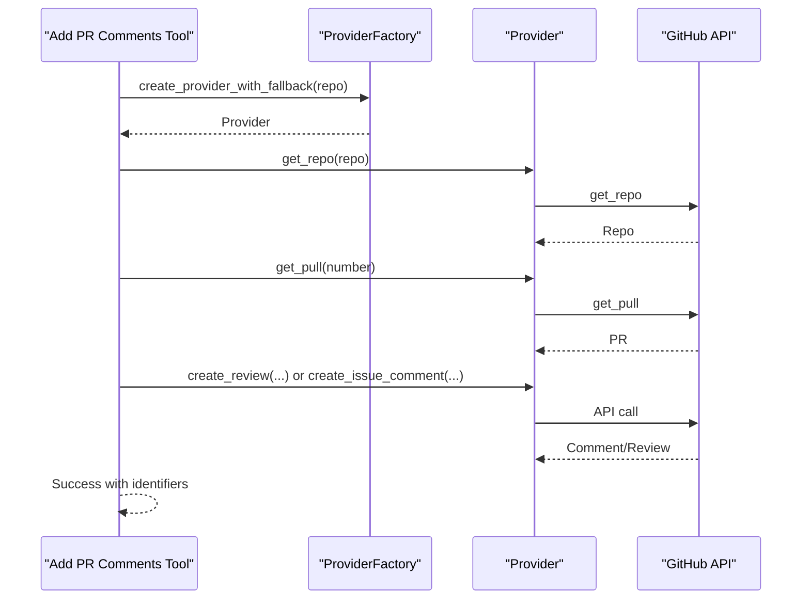
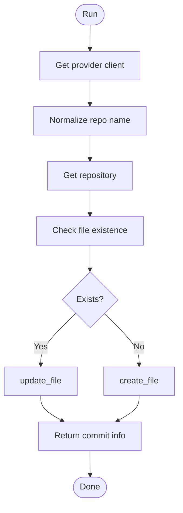
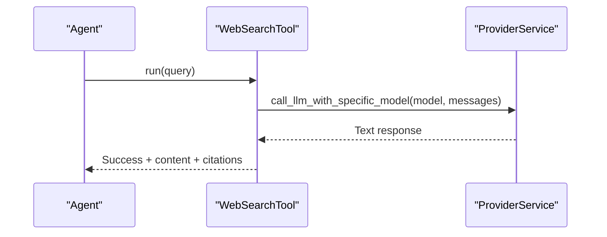
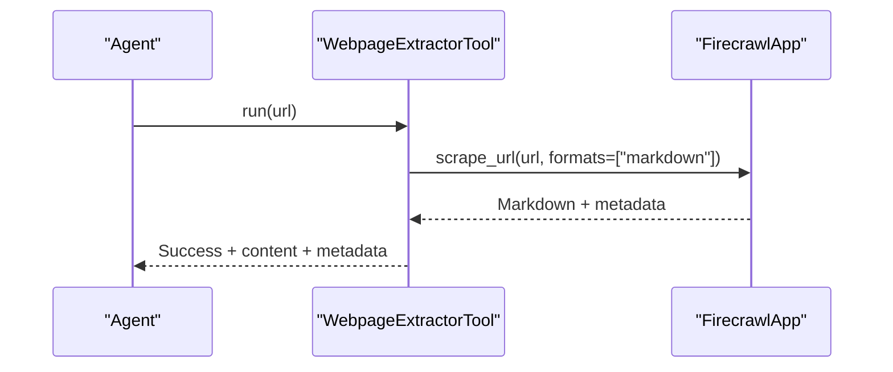
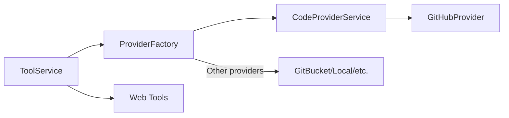

# External Integration Tools

<cite>
**Referenced Files in This Document**
- [code_provider_tool.py](file://app/modules/intelligence/tools/web_tools/code_provider_tool.py)
- [code_provider_create_branch.py](file://app/modules/intelligence/tools/web_tools/code_provider_create_branch.py)
- [code_provider_create_pr.py](file://app/modules/intelligence/tools/web_tools/code_provider_create_pr.py)
- [code_provider_add_pr_comment.py](file://app/modules/intelligence/tools/web_tools/code_provider_add_pr_comment.py)
- [code_provider_update_file.py](file://app/modules/intelligence/tools/web_tools/code_provider_update_file.py)
- [web_search_tool.py](file://app/modules/intelligence/tools/web_tools/web_search_tool.py)
- [webpage_extractor_tool.py](file://app/modules/intelligence/tools/web_tools/webpage_extractor_tool.py)
- [provider_factory.py](file://app/modules/code_provider/provider_factory.py)
- [code_provider_service.py](file://app/modules/code_provider/code_provider_service.py)
- [github_provider.py](file://app/modules/code_provider/github/github_provider.py)
- [tool_service.py](file://app/modules/intelligence/tools/tool_service.py)
- [tool_router.py](file://app/modules/intelligence/tools/tool_router.py)
- [tool_schema.py](file://app/modules/intelligence/tools/tool_schema.py)
</cite>

## Table of Contents
1. [Introduction](#introduction)
2. [Project Structure](#project-structure)
3. [Core Components](#core-components)
4. [Architecture Overview](#architecture-overview)
5. [Detailed Component Analysis](#detailed-component-analysis)
6. [Dependency Analysis](#dependency-analysis)
7. [Performance Considerations](#performance-considerations)
8. [Troubleshooting Guide](#troubleshooting-guide)
9. [Conclusion](#conclusion)

## Introduction
This document explains the external integration tools that connect AI agents to external systems and services. These tools enable:
- Automating repository operations (branch creation, pull request creation, adding comments, updating files)
- Searching external sources for current information
- Extracting content from web pages

They integrate with GitHub and other code providers, as well as external web APIs. The document covers implementation details, authentication, rate limits, error handling, and practical use cases for both beginners and experienced developers building custom integrations.

## Project Structure
The external integration tools live under the intelligence tools module and leverage a provider factory to abstract code provider differences (GitHub, GitBucket, etc.). Tools are registered and exposed via a tool service and FastAPI router.

**Diagram sources**
- [tool_service.py](file://app/modules/intelligence/tools/tool_service.py#L99-L242)
- [tool_router.py](file://app/modules/intelligence/tools/tool_router.py#L14-L21)
- [provider_factory.py](file://app/modules/code_provider/provider_factory.py#L29-L176)
- [code_provider_service.py](file://app/modules/code_provider/code_provider_service.py#L431-L467)
- [github_provider.py](file://app/modules/code_provider/github/github_provider.py#L16-L733)

**Section sources**
- [tool_service.py](file://app/modules/intelligence/tools/tool_service.py#L99-L242)
- [tool_router.py](file://app/modules/intelligence/tools/tool_router.py#L14-L21)

## Core Components
- Code Provider Tools: Fetch issues/PRs, create branches, create PRs, add PR comments, update files
- Web Search Tool: Queries external sources via an LLM provider
- Webpage Extractor Tool: Scrapes and extracts page content via Firecrawl

Each tool is a StructuredTool that validates inputs, authenticates via the provider factory, and interacts with external APIs.

**Section sources**
- [code_provider_tool.py](file://app/modules/intelligence/tools/web_tools/code_provider_tool.py#L31-L259)
- [code_provider_create_branch.py](file://app/modules/intelligence/tools/web_tools/code_provider_create_branch.py#L30-L279)
- [code_provider_create_pr.py](file://app/modules/intelligence/tools/web_tools/code_provider_create_pr.py#L39-L357)
- [code_provider_add_pr_comment.py](file://app/modules/intelligence/tools/web_tools/code_provider_add_pr_comment.py#L60-L513)
- [code_provider_update_file.py](file://app/modules/intelligence/tools/web_tools/code_provider_update_file.py#L30-L293)
- [web_search_tool.py](file://app/modules/intelligence/tools/web_tools/web_search_tool.py#L32-L148)
- [webpage_extractor_tool.py](file://app/modules/intelligence/tools/web_tools/webpage_extractor_tool.py#L20-L125)

## Architecture Overview
The tools follow a consistent pattern:
- Input validation via Pydantic models
- Authentication via ProviderFactory (supports GitHub App, PAT pools, basic auth, and unauthenticated fallback)
- Provider abstraction via ICodeProvider implementations (e.g., GitHubProvider)
- External API calls (PyGithub for GitHub, Firecrawl for web extraction)
- StructuredTool wrapping for agent consumption

**Diagram sources**
- [provider_factory.py](file://app/modules/code_provider/provider_factory.py#L247-L382)
- [code_provider_create_pr.py](file://app/modules/intelligence/tools/web_tools/code_provider_create_pr.py#L77-L94)
- [github_provider.py](file://app/modules/code_provider/github/github_provider.py#L412-L471)

## Detailed Component Analysis

### Code Provider Tool (Fetch Issues/PRs)
Purpose: Retrieve GitHub issues and pull requests, optionally with diffs.

Key behaviors:
- Validates inputs via a Pydantic model
- Initializes GitHub tokens from environment
- Uses ProviderFactory to resolve provider and authenticate
- Normalizes repository names for provider-specific formats
- Fetches either all issues/PRs or a specific item

**Diagram sources**
- [code_provider_tool.py](file://app/modules/intelligence/tools/web_tools/code_provider_tool.py#L78-L226)

**Section sources**
- [code_provider_tool.py](file://app/modules/intelligence/tools/web_tools/code_provider_tool.py#L31-L259)

### Create Branch Tool
Purpose: Create a new branch from a base branch.

Key behaviors:
- Validates inputs (repo, base branch, new branch)
- Resolves provider with fallback authentication
- Normalizes repository name
- Creates git reference via provider client
- Constructs provider-specific branch URL

**Diagram sources**
- [code_provider_create_branch.py](file://app/modules/intelligence/tools/web_tools/code_provider_create_branch.py#L86-L240)
- [provider_factory.py](file://app/modules/code_provider/provider_factory.py#L247-L382)

**Section sources**
- [code_provider_create_branch.py](file://app/modules/intelligence/tools/web_tools/code_provider_create_branch.py#L30-L279)

### Create Pull Request Tool
Purpose: Create a PR from head to base branch, optionally adding reviewers and labels.

Key behaviors:
- Validates branches exist
- Supports GitBucket via raw API calls
- Adds reviewers and labels when supported
- Returns PR number and URL

**Diagram sources**
- [code_provider_create_pr.py](file://app/modules/intelligence/tools/web_tools/code_provider_create_pr.py#L96-L307)
- [github_provider.py](file://app/modules/code_provider/github/github_provider.py#L412-L471)

**Section sources**
- [code_provider_create_pr.py](file://app/modules/intelligence/tools/web_tools/code_provider_create_pr.py#L39-L357)

### Add PR Comments Tool
Purpose: Add inline comments, general comments, and full code reviews to PRs.

Key behaviors:
- Validates review action
- Formats comment bodies with code snippets and suggestions
- Supports GitBucket via raw API fallback
- Returns review/comment identifiers and URLs

**Diagram sources**
- [code_provider_add_pr_comment.py](file://app/modules/intelligence/tools/web_tools/code_provider_add_pr_comment.py#L130-L467)
- [github_provider.py](file://app/modules/code_provider/github/github_provider.py#L473-L546)

**Section sources**
- [code_provider_add_pr_comment.py](file://app/modules/intelligence/tools/web_tools/code_provider_add_pr_comment.py#L60-L513)

### Update File Tool
Purpose: Create or update a file in a branch and commit changes.

Key behaviors:
- Resolves provider client
- Normalizes repository name
- Checks file existence to decide create vs update
- Commits with optional author info

**Diagram sources**
- [code_provider_update_file.py](file://app/modules/intelligence/tools/web_tools/code_provider_update_file.py#L107-L245)
- [github_provider.py](file://app/modules/code_provider/github/github_provider.py#L614-L670)

**Section sources**
- [code_provider_update_file.py](file://app/modules/intelligence/tools/web_tools/code_provider_update_file.py#L30-L293)

### Web Search Tool
Purpose: Search the web for current information and return answers with citations.

Key behaviors:
- Requires OPENROUTER_API_KEY
- Calls a specific LLM model via ProviderService
- Wraps text responses and truncates large outputs
- Returns structured success/content/citations

**Diagram sources**
- [web_search_tool.py](file://app/modules/intelligence/tools/web_tools/web_search_tool.py#L78-L111)

**Section sources**
- [web_search_tool.py](file://app/modules/intelligence/tools/web_tools/web_search_tool.py#L32-L148)

### Webpage Extractor Tool
Purpose: Extract readable content from a webpage using Firecrawl.

Key behaviors:
- Requires FIRECRAWL_API_KEY
- Scrapes URL with markdown format
- Returns content and metadata with truncation safeguards

**Diagram sources**
- [webpage_extractor_tool.py](file://app/modules/intelligence/tools/web_tools/webpage_extractor_tool.py#L65-L99)

**Section sources**
- [webpage_extractor_tool.py](file://app/modules/intelligence/tools/web_tools/webpage_extractor_tool.py#L20-L125)

## Dependency Analysis
- ProviderFactory orchestrates authentication and provider selection, including fallbacks for GitHub App, PAT pools, and unauthenticated access.
- CodeProviderService wraps providers to unify access and handle RepoManager integration.
- GitHubProvider implements the ICodeProvider interface for GitHub-specific operations and exposes rate limit info.

**Diagram sources**
- [provider_factory.py](file://app/modules/code_provider/provider_factory.py#L29-L176)
- [code_provider_service.py](file://app/modules/code_provider/code_provider_service.py#L431-L467)
- [github_provider.py](file://app/modules/code_provider/github/github_provider.py#L16-L733)
- [tool_service.py](file://app/modules/intelligence/tools/tool_service.py#L99-L242)

**Section sources**
- [provider_factory.py](file://app/modules/code_provider/provider_factory.py#L29-L176)
- [code_provider_service.py](file://app/modules/code_provider/code_provider_service.py#L431-L467)
- [github_provider.py](file://app/modules/code_provider/github/github_provider.py#L16-L733)

## Performance Considerations
- Token rotation and rate limiting:
  - GitHubProvider exposes rate limit info; consider monitoring remaining quota and resetting cycles.
  - ProviderFactory supports PAT pools for load distribution and resilience.
- Async patterns:
  - Tools provide async wrappers around synchronous operations; for heavy external calls, consider native async clients.
- Output truncation:
  - Web tools truncate large outputs to prevent oversized responses.

[No sources needed since this section provides general guidance]

## Troubleshooting Guide
Common issues and resolutions:
- Missing credentials:
  - Tools check for credentials and return None when missing. Configure CODE_PROVIDER_TOKEN, GH_TOKEN_LIST, or GitHub App credentials.
- Authentication failures:
  - ProviderFactory implements a comprehensive fallback chain. 401 errors on GitHub trigger unauthenticated fallback for public repos.
- Rate limits:
  - Monitor rate limit info from GitHubProvider and implement backoff or token rotation.
- Environment variables:
  - OPENROUTER_API_KEY and FIRECRAWL_API_KEY are required for web tools.

**Section sources**
- [provider_factory.py](file://app/modules/code_provider/provider_factory.py#L414-L454)
- [code_provider_service.py](file://app/modules/code_provider/code_provider_service.py#L200-L238)
- [github_provider.py](file://app/modules/code_provider/github/github_provider.py#L722-L732)
- [web_search_tool.py](file://app/modules/intelligence/tools/web_tools/web_search_tool.py#L42-L47)
- [webpage_extractor_tool.py](file://app/modules/intelligence/tools/web_tools/webpage_extractor_tool.py#L39-L43)

## Conclusion
These external integration tools provide a robust foundation for AI agents to automate repository operations, search external sources, and extract web content. By leveraging a unified provider factory and consistent tool patterns, teams can implement reliable integrations with minimal boilerplate. For advanced scenarios, extend the provider interface and tool schemas to support additional external systems.