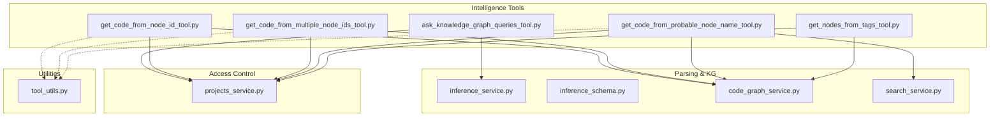
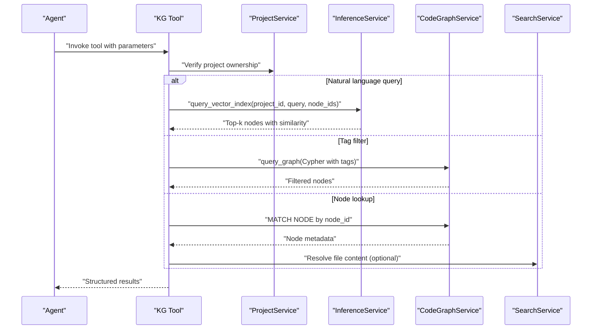
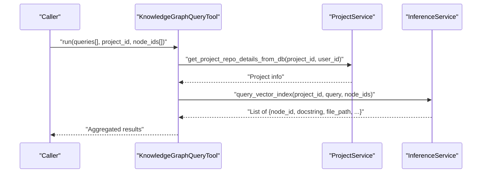
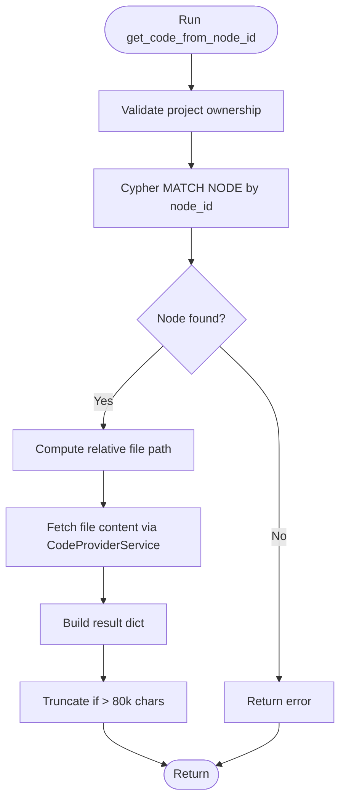
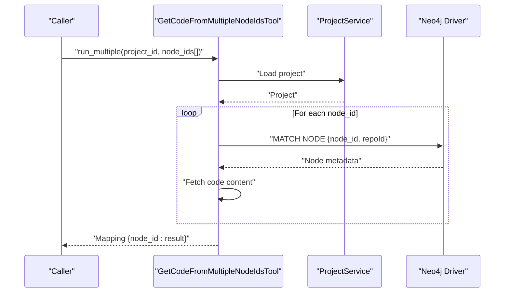
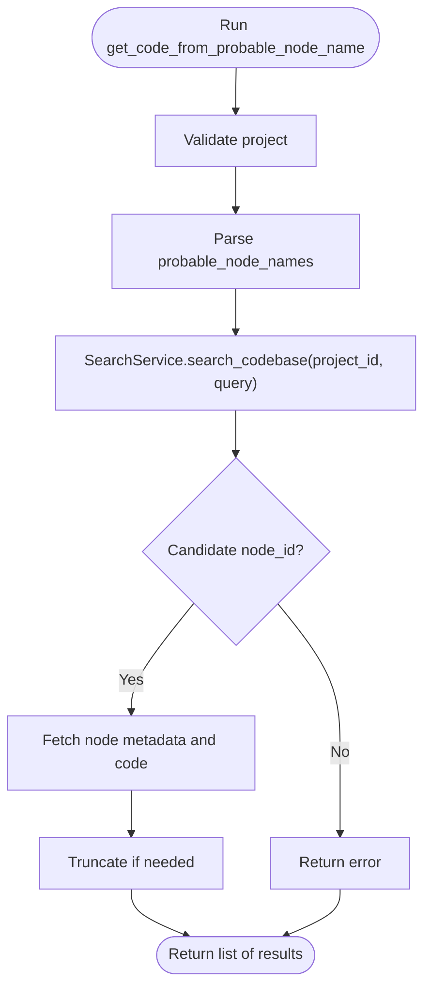
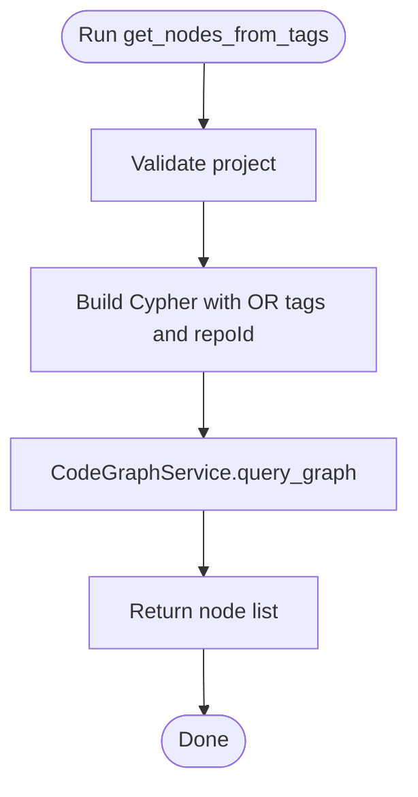
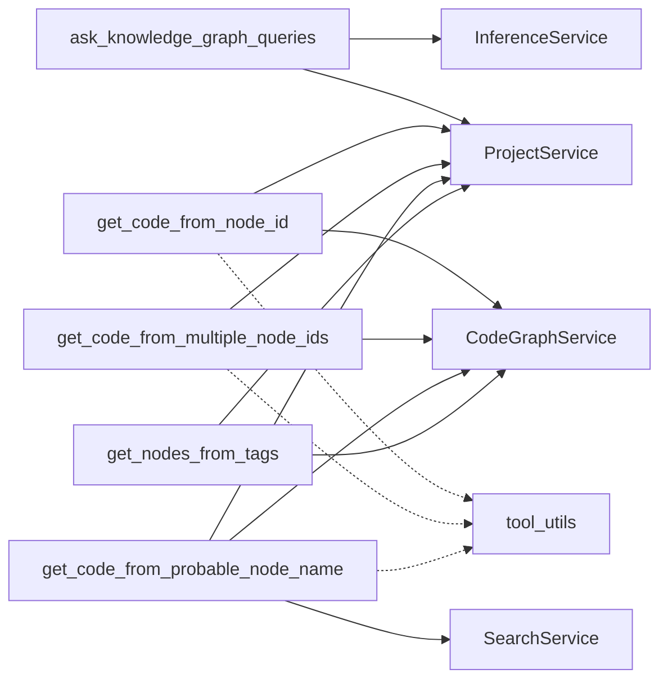

# Knowledge Graph Tools

<cite>
**Referenced Files in This Document**
- [ask_knowledge_graph_queries_tool.py](file://app/modules/intelligence/tools/kg_based_tools/ask_knowledge_graph_queries_tool.py)
- [get_code_from_node_id_tool.py](file://app/modules/intelligence/tools/kg_based_tools/get_code_from_node_id_tool.py)
- [get_code_from_multiple_node_ids_tool.py](file://app/modules/intelligence/tools/kg_based_tools/get_code_from_multiple_node_ids_tool.py)
- [get_code_from_probable_node_name_tool.py](file://app/modules/intelligence/tools/kg_based_tools/get_code_from_probable_node_name_tool.py)
- [get_nodes_from_tags_tool.py](file://app/modules/intelligence/tools/kg_based_tools/get_nodes_from_tags_tool.py)
- [inference_service.py](file://app/modules/parsing/knowledge_graph/inference_service.py)
- [inference_schema.py](file://app/modules/parsing/knowledge_graph/inference_schema.py)
- [code_graph_service.py](file://app/modules/parsing/graph_construction/code_graph_service.py)
- [search_service.py](file://app/modules/search/search_service.py)
- [tool_service.py](file://app/modules/intelligence/tools/tool_service.py)
- [tool_utils.py](file://app/modules/intelligence/tools/tool_utils.py)
- [projects_service.py](file://app/modules/projects/projects_service.py)
</cite>

## Table of Contents
1. [Introduction](#introduction)
2. [Project Structure](#project-structure)
3. [Core Components](#core-components)
4. [Architecture Overview](#architecture-overview)
5. [Detailed Component Analysis](#detailed-component-analysis)
6. [Dependency Analysis](#dependency-analysis)
7. [Performance Considerations](#performance-considerations)
8. [Troubleshooting Guide](#troubleshooting-guide)
9. [Conclusion](#conclusion)

## Introduction
This document explains the knowledge graph tools that enable intelligent querying and extraction from a constructed code knowledge graph. These tools allow users and agents to:
- Ask natural language questions about the codebase and retrieve semantically relevant nodes with surrounding context
- Retrieve code and docstrings for specific nodes or sets of nodes
- Resolve likely node identifiers from human-readable names and fetch their code
- Filter nodes by tags to discover components by functional categories

They integrate with the graph construction pipeline and the parsing service to provide semantic search, vector indexing, and retrieval of precise code segments.

## Project Structure
The knowledge graph tools live under the intelligence tools module and rely on:
- Graph construction and querying services
- Inference service for vector search and embeddings
- Search service for auxiliary indexing and ranking
- Project service for access control and project metadata
- Utility helpers for response truncation

**Diagram sources**
- [ask_knowledge_graph_queries_tool.py](file://app/modules/intelligence/tools/kg_based_tools/ask_knowledge_graph_queries_tool.py#L1-L143)
- [get_code_from_node_id_tool.py](file://app/modules/intelligence/tools/kg_based_tools/get_code_from_node_id_tool.py#L1-L186)
- [get_code_from_multiple_node_ids_tool.py](file://app/modules/intelligence/tools/kg_based_tools/get_code_from_multiple_node_ids_tool.py#L1-L186)
- [get_code_from_probable_node_name_tool.py](file://app/modules/intelligence/tools/kg_based_tools/get_code_from_probable_node_name_tool.py#L1-L254)
- [get_nodes_from_tags_tool.py](file://app/modules/intelligence/tools/kg_based_tools/get_nodes_from_tags_tool.py#L1-L130)
- [inference_service.py](file://app/modules/parsing/knowledge_graph/inference_service.py#L1102-L1171)
- [inference_schema.py](file://app/modules/parsing/knowledge_graph/inference_schema.py#L22-L35)
- [code_graph_service.py](file://app/modules/parsing/graph_construction/code_graph_service.py#L193-L196)
- [search_service.py](file://app/modules/search/search_service.py#L19-L71)
- [projects_service.py](file://app/modules/projects/projects_service.py#L1-L200)
- [tool_utils.py](file://app/modules/intelligence/tools/tool_utils.py#L1-L75)

**Section sources**
- [tool_service.py](file://app/modules/intelligence/tools/tool_service.py#L134-L242)

## Core Components
- ask_knowledge_graph_queries: Natural language queries against the knowledge graph with optional node scoping and vector search.
- get_code_from_node_id: Fetch code and docstring for a single node by node_id.
- get_code_from_multiple_node_ids: Parallel fetch for multiple node_ids.
- get_code_from_probable_node_name: Resolve human-readable names to node_ids and fetch code.
- get_nodes_from_tags: Filter nodes by tags for broad functional discovery.

Each tool validates project ownership, constructs appropriate queries, and returns structured results. They also enforce response size limits to keep downstream consumption manageable.

**Section sources**
- [ask_knowledge_graph_queries_tool.py](file://app/modules/intelligence/tools/kg_based_tools/ask_knowledge_graph_queries_tool.py#L31-L142)
- [get_code_from_node_id_tool.py](file://app/modules/intelligence/tools/kg_based_tools/get_code_from_node_id_tool.py#L23-L186)
- [get_code_from_multiple_node_ids_tool.py](file://app/modules/intelligence/tools/kg_based_tools/get_code_from_multiple_node_ids_tool.py#L23-L186)
- [get_code_from_probable_node_name_tool.py](file://app/modules/intelligence/tools/kg_based_tools/get_code_from_probable_node_name_tool.py#L27-L254)
- [get_nodes_from_tags_tool.py](file://app/modules/intelligence/tools/kg_based_tools/get_nodes_from_tags_tool.py#L20-L130)

## Architecture Overview
The tools operate in a layered pipeline:
- Input validation and project checks via ProjectService
- Graph retrieval via Neo4j (via CodeGraphService or direct driver)
- Vector search and semantic matching via InferenceService
- Auxiliary search ranking via SearchService
- Safe response formatting via tool_utils

**Diagram sources**
- [ask_knowledge_graph_queries_tool.py](file://app/modules/intelligence/tools/kg_based_tools/ask_knowledge_graph_queries_tool.py#L57-L120)
- [get_nodes_from_tags_tool.py](file://app/modules/intelligence/tools/kg_based_tools/get_nodes_from_tags_tool.py#L52-L102)
- [get_code_from_node_id_tool.py](file://app/modules/intelligence/tools/kg_based_tools/get_code_from_node_id_tool.py#L58-L81)
- [inference_service.py](file://app/modules/parsing/knowledge_graph/inference_service.py#L1102-L1171)
- [code_graph_service.py](file://app/modules/parsing/graph_construction/code_graph_service.py#L193-L196)
- [search_service.py](file://app/modules/search/search_service.py#L19-L71)
- [projects_service.py](file://app/modules/projects/projects_service.py#L1-L200)

## Detailed Component Analysis

### ask_knowledge_graph_queries
Purpose:
- Accept multiple natural language questions and return semantically similar nodes with docstring, file path, and similarity.

Key behaviors:
- Validates project ownership
- Builds a list of QueryRequest objects
- Calls InferenceService.query_vector_index for each request
- Returns aggregated results

Parameters:
- queries: array of strings
- project_id: UUID
- node_ids: optional array of node IDs to constrain search context

Result format:
- Array of QueryResponse entries with node_id, docstring, file_path, start_line, end_line, similarity

Implementation highlights:
- Uses vector index and optional neighborhood expansion around provided node_ids
- Returns top-k matches filtered by project

Common use cases:
- Multi-question semantic search across the codebase
- Targeted search around known node IDs

**Section sources**
- [ask_knowledge_graph_queries_tool.py](file://app/modules/intelligence/tools/kg_based_tools/ask_knowledge_graph_queries_tool.py#L31-L142)
- [inference_service.py](file://app/modules/parsing/knowledge_graph/inference_service.py#L1102-L1171)
- [inference_schema.py](file://app/modules/parsing/knowledge_graph/inference_schema.py#L22-L35)
- [projects_service.py](file://app/modules/projects/projects_service.py#L1-L200)

**Diagram sources**
- [ask_knowledge_graph_queries_tool.py](file://app/modules/intelligence/tools/kg_based_tools/ask_knowledge_graph_queries_tool.py#L89-L120)
- [inference_service.py](file://app/modules/parsing/knowledge_graph/inference_service.py#L1102-L1171)
- [projects_service.py](file://app/modules/projects/projects_service.py#L1-L200)

### get_code_from_node_id
Purpose:
- Retrieve code and docstring for a single node by node_id.

Key behaviors:
- Validates project ownership
- Queries Neo4j for node metadata (file_path, start_line, end_line, text, docstring)
- Resolves relative file path and fetches content via CodeProviderService
- Applies truncation if response exceeds threshold

Parameters:
- project_id: UUID
- node_id: UUID

Result format:
- Dictionary with node_id, file_path, start_line, end_line, code_content, docstring

Common use cases:
- Inspecting a specific function/class/file
- Providing context for a node in downstream analysis

**Section sources**
- [get_code_from_node_id_tool.py](file://app/modules/intelligence/tools/kg_based_tools/get_code_from_node_id_tool.py#L23-L186)
- [tool_utils.py](file://app/modules/intelligence/tools/tool_utils.py#L31-L75)
- [projects_service.py](file://app/modules/projects/projects_service.py#L1-L200)

**Diagram sources**
- [get_code_from_node_id_tool.py](file://app/modules/intelligence/tools/kg_based_tools/get_code_from_node_id_tool.py#L58-L155)

### get_code_from_multiple_node_ids
Purpose:
- Parallel retrieval of code and docstrings for multiple node_ids.

Key behaviors:
- Validates project ownership
- Spawns concurrent retrievals for each node_id
- Aggregates results into a mapping from node_id to result
- Applies truncation to the entire payload

Parameters:
- project_id: UUID
- node_ids: array of UUIDs

Result format:
- Dictionary mapping node_id to per-node result (same fields as single-node variant)

Common use cases:
- Batch inspection of related functions/classes
- Building contextual summaries across several nodes

**Section sources**
- [get_code_from_multiple_node_ids_tool.py](file://app/modules/intelligence/tools/kg_based_tools/get_code_from_multiple_node_ids_tool.py#L23-L186)
- [tool_utils.py](file://app/modules/intelligence/tools/tool_utils.py#L31-L75)
- [projects_service.py](file://app/modules/projects/projects_service.py#L1-L200)

**Diagram sources**
- [get_code_from_multiple_node_ids_tool.py](file://app/modules/intelligence/tools/kg_based_tools/get_code_from_multiple_node_ids_tool.py#L56-L98)

### get_code_from_probable_node_name
Purpose:
- Convert human-readable names (e.g., file_path:function_name) into node_ids and fetch code.

Key behaviors:
- Validates project ownership
- Parses probable_node_names into a query
- Uses SearchService to find candidate node_ids
- Retrieves code for the matched node(s)
- Applies truncation

Parameters:
- project_id: UUID
- probable_node_names: array of strings in the form file_path[:function_or_class]

Result format:
- Array of results with node_id, relative_file_path, start_line, end_line, code_content, docstring

Common use cases:
- Finding a function/class by approximate name
- Discovering code when only partial path/name is known

**Section sources**
- [get_code_from_probable_node_name_tool.py](file://app/modules/intelligence/tools/kg_based_tools/get_code_from_probable_node_name_tool.py#L27-L254)
- [search_service.py](file://app/modules/search/search_service.py#L19-L71)
- [tool_utils.py](file://app/modules/intelligence/tools/tool_utils.py#L31-L75)
- [projects_service.py](file://app/modules/projects/projects_service.py#L1-L200)

**Diagram sources**
- [get_code_from_probable_node_name_tool.py](file://app/modules/intelligence/tools/kg_based_tools/get_code_from_probable_node_name_tool.py#L110-L124)
- [search_service.py](file://app/modules/search/search_service.py#L19-L71)

### get_nodes_from_tags
Purpose:
- Retrieve nodes filtered by tags for broad functional discovery.

Key behaviors:
- Validates project ownership
- Constructs a Cypher query filtering nodes by tags and repoId
- Executes via CodeGraphService.query_graph
- Returns standardized fields (file_path, docstring, text, node_id, name)

Parameters:
- tags: array of tag strings (e.g., API, DATABASE, UI_COMPONENT)
- project_id: UUID

Result format:
- Array of records with file_path, docstring, text, node_id, name

Common use cases:
- Finding all API endpoints
- Locating database-related code
- Discovering UI components

**Section sources**
- [get_nodes_from_tags_tool.py](file://app/modules/intelligence/tools/kg_based_tools/get_nodes_from_tags_tool.py#L20-L130)
- [code_graph_service.py](file://app/modules/parsing/graph_construction/code_graph_service.py#L193-L196)
- [projects_service.py](file://app/modules/projects/projects_service.py#L1-L200)

**Diagram sources**
- [get_nodes_from_tags_tool.py](file://app/modules/intelligence/tools/kg_based_tools/get_nodes_from_tags_tool.py#L90-L102)

## Dependency Analysis
- Tools depend on ProjectService for access control and project metadata
- ask_knowledge_graph_queries depends on InferenceService for vector search and embeddings
- get_code_* tools depend on Neo4j via CodeGraphService and on SearchService for auxiliary ranking
- All tools rely on tool_utils for safe response truncation
- Results are shaped by inference_schema.QueryResponse

**Diagram sources**
- [ask_knowledge_graph_queries_tool.py](file://app/modules/intelligence/tools/kg_based_tools/ask_knowledge_graph_queries_tool.py#L1-L143)
- [get_code_from_node_id_tool.py](file://app/modules/intelligence/tools/kg_based_tools/get_code_from_node_id_tool.py#L1-L186)
- [get_code_from_multiple_node_ids_tool.py](file://app/modules/intelligence/tools/kg_based_tools/get_code_from_multiple_node_ids_tool.py#L1-L186)
- [get_code_from_probable_node_name_tool.py](file://app/modules/intelligence/tools/kg_based_tools/get_code_from_probable_node_name_tool.py#L1-L254)
- [get_nodes_from_tags_tool.py](file://app/modules/intelligence/tools/kg_based_tools/get_nodes_from_tags_tool.py#L1-L130)
- [inference_service.py](file://app/modules/parsing/knowledge_graph/inference_service.py#L1102-L1171)
- [code_graph_service.py](file://app/modules/parsing/graph_construction/code_graph_service.py#L193-L196)
- [search_service.py](file://app/modules/search/search_service.py#L19-L71)
- [projects_service.py](file://app/modules/projects/projects_service.py#L1-L200)
- [tool_utils.py](file://app/modules/intelligence/tools/tool_utils.py#L1-L75)

**Section sources**
- [tool_service.py](file://app/modules/intelligence/tools/tool_service.py#L134-L242)

## Performance Considerations
- Vector search uses a vector index and optional neighborhood expansion; limiting node_ids narrows scope and improves latency.
- Parallel retrieval in get_code_from_multiple_node_ids reduces total latency by issuing concurrent requests.
- Response truncation prevents oversized payloads; monitor logs for truncation notices.
- Batched search indices are created during inference to accelerate semantic queries.

[No sources needed since this section provides general guidance]

## Troubleshooting Guide
Common issues and resolutions:
- Project not found or unauthorized: Ensure the project_id belongs to the current user; ProjectService enforces ownership.
- Node not found: Verify node_id and project_id combination; Neo4j queries return null if missing.
- Excessive response size: Results are truncated automatically; consider narrowing queries or filtering by node_ids/tags.
- Unexpected errors: Tools log exceptions with context; check logs for detailed traces.

**Section sources**
- [get_code_from_node_id_tool.py](file://app/modules/intelligence/tools/kg_based_tools/get_code_from_node_id_tool.py#L82-L89)
- [get_code_from_multiple_node_ids_tool.py](file://app/modules/intelligence/tools/kg_based_tools/get_code_from_multiple_node_ids_tool.py#L91-L98)
- [get_code_from_probable_node_name_tool.py](file://app/modules/intelligence/tools/kg_based_tools/get_code_from_probable_node_name_tool.py#L148-L155)
- [tool_utils.py](file://app/modules/intelligence/tools/tool_utils.py#L31-L75)

## Conclusion
These knowledge graph tools provide a cohesive toolkit for semantic discovery and targeted retrieval from the constructed code graph. By combining vector search, tag-based filtering, and precise node lookups, they support code recommendation, dependency mapping, and intelligent search across large codebases. Their integration with project access control, Neo4j, and search services ensures secure, scalable, and efficient operations.