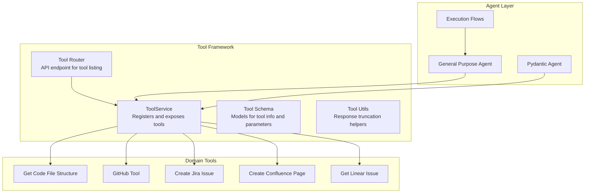
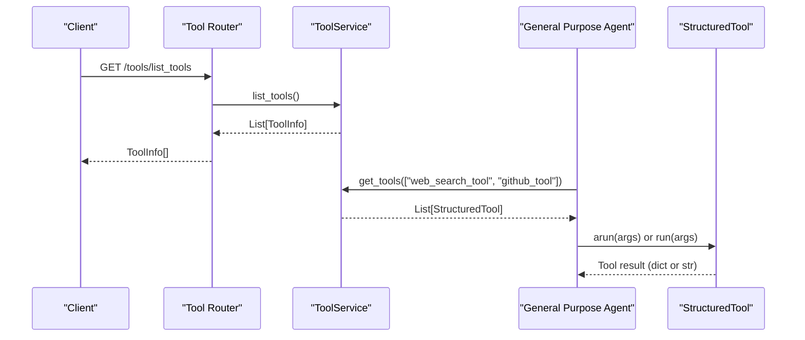
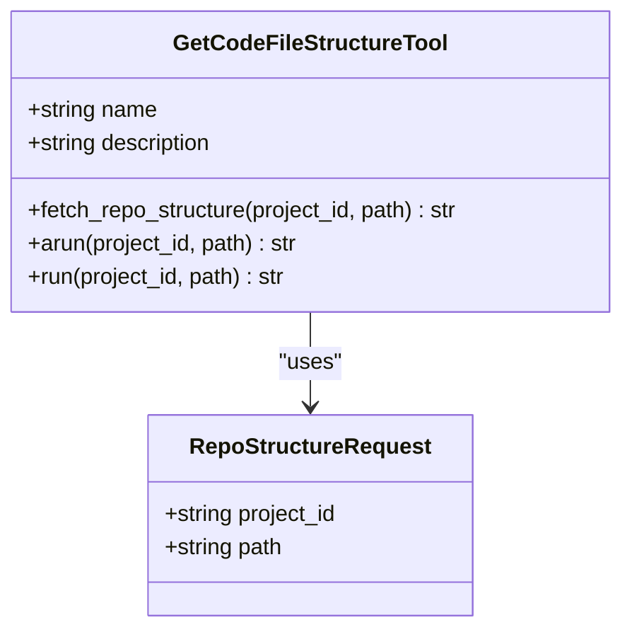
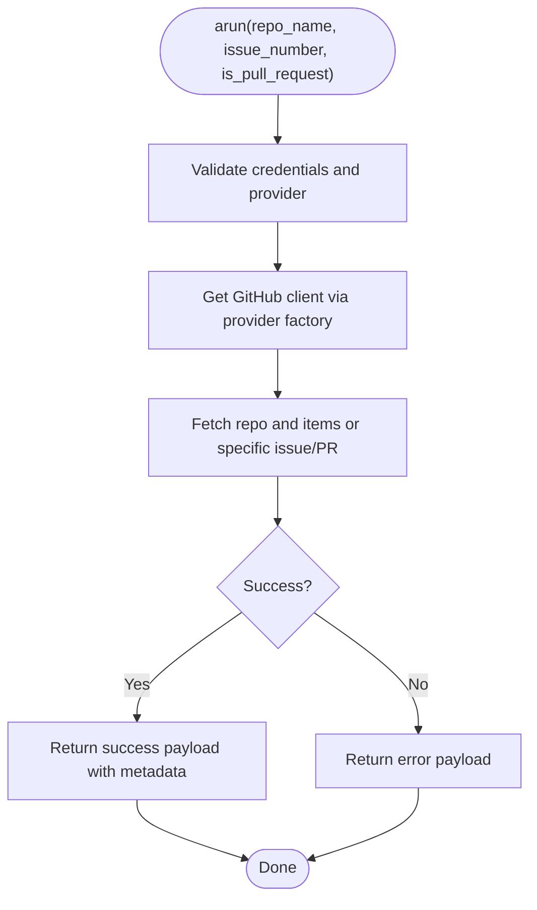
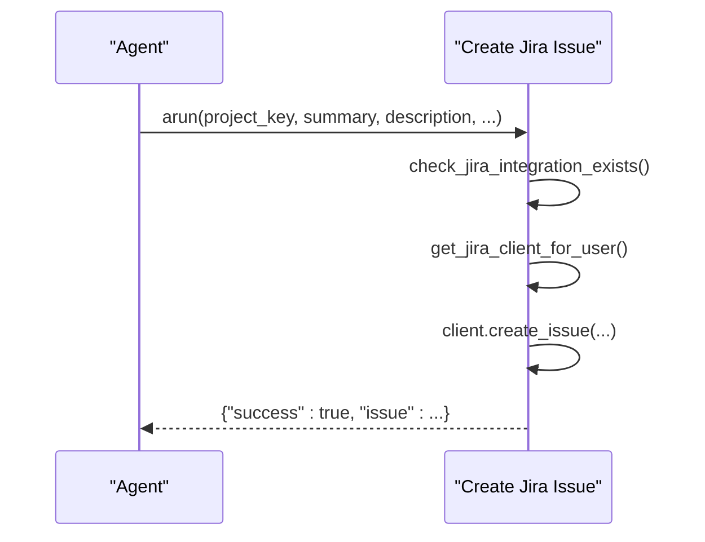
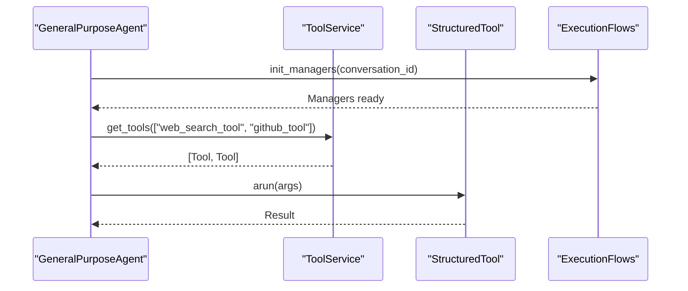
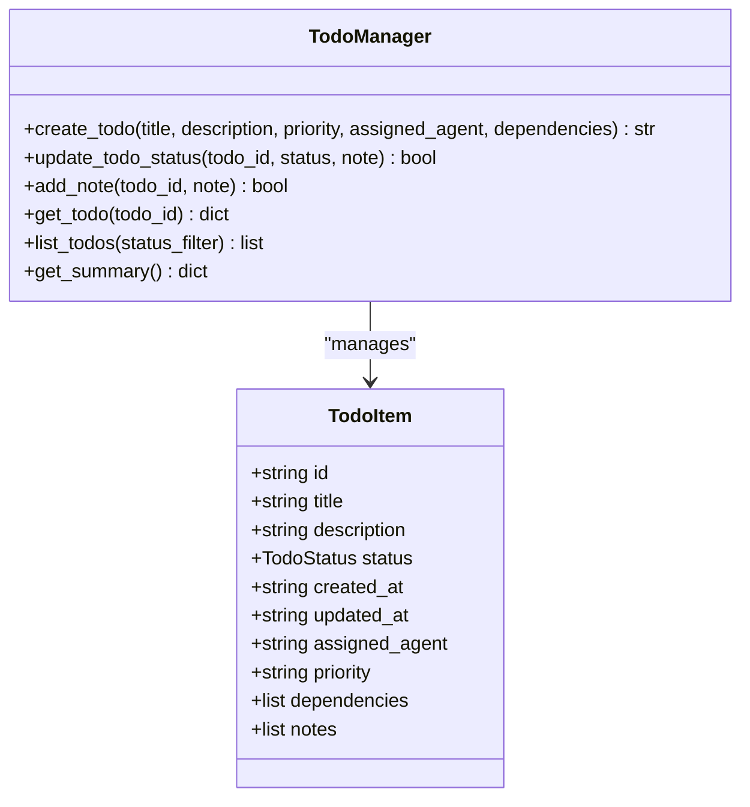
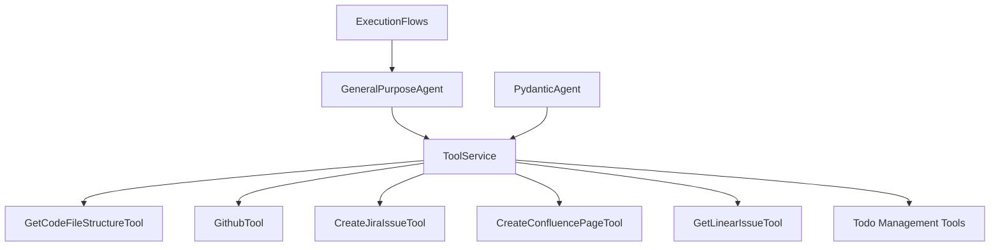

# Tool Execution Framework

<cite>
**Referenced Files in This Document**
- [tool_service.py](file://app/modules/intelligence/tools/tool_service.py)
- [tool_schema.py](file://app/modules/intelligence/tools/tool_schema.py)
- [tool_router.py](file://app/modules/intelligence/tools/tool_router.py)
- [tool_utils.py](file://app/modules/intelligence/tools/tool_utils.py)
- [get_code_file_structure.py](file://app/modules/intelligence/tools/code_query_tools/get_code_file_structure.py)
- [github_tool.py](file://app/modules/intelligence/tools/web_tools/github_tool.py)
- [create_confluence_page_tool.py](file://app/modules/intelligence/tools/confluence_tools/create_confluence_page_tool.py)
- [create_jira_issue_tool.py](file://app/modules/intelligence/tools/jira_tools/create_jira_issue_tool.py)
- [get_linear_issue_tool.py](file://app/modules/intelligence/tools/linear_tools/get_linear_issue_tool.py)
- [general_purpose_agent.py](file://app/modules/intelligence/agents/chat_agents/system_agents/general_purpose_agent.py)
- [pydantic_agent.py](file://app/modules/intelligence/agents/chat_agents/pydantic_agent.py)
- [execution_flows.py](file://app/modules/intelligence/agents/chat_agents/multi_agent/execution_flows.py)
- [todo_management_tool.py](file://app/modules/intelligence/tools/todo_management_tool.py)
</cite>

## Table of Contents
1. [Introduction](#introduction)
2. [Project Structure](#project-structure)
3. [Core Components](#core-components)
4. [Architecture Overview](#architecture-overview)
5. [Detailed Component Analysis](#detailed-component-analysis)
6. [Dependency Analysis](#dependency-analysis)
7. [Performance Considerations](#performance-considerations)
8. [Troubleshooting Guide](#troubleshooting-guide)
9. [Conclusion](#conclusion)
10. [Appendices](#appendices)

## Introduction
This document explains the Tool Execution Framework that powers the agent tool system. The framework enables AI agents to interact with external systems and perform specific tasks by registering and invoking specialized tools. Tools are encapsulated as LangChain StructuredTools with strict input schemas and standardized return values. The framework provides:
- Centralized tool registration and discovery
- Unified tool execution orchestration
- Result processing and safety controls (e.g., response truncation)
- Integration with agent execution flows and streaming

The goal is to help both beginners understand how tools work and experienced developers implement, integrate, and optimize tools effectively.

## Project Structure
The tool framework is organized around a service layer that aggregates tools, a schema layer for tool metadata and parameters, and routers for API exposure. Tools are grouped by domain (code queries, web, Jira, Confluence, Linear, etc.). Agents consume tools via the ToolService and integrate them into execution flows.

**Diagram sources**
- [tool_service.py](file://app/modules/intelligence/tools/tool_service.py#L99-L263)
- [tool_router.py](file://app/modules/intelligence/tools/tool_router.py#L14-L22)
- [tool_schema.py](file://app/modules/intelligence/tools/tool_schema.py#L6-L32)
- [tool_utils.py](file://app/modules/intelligence/tools/tool_utils.py#L13-L75)
- [get_code_file_structure.py](file://app/modules/intelligence/tools/code_query_tools/get_code_file_structure.py#L76-L95)
- [github_tool.py](file://app/modules/intelligence/tools/web_tools/github_tool.py#L271-L299)
- [create_jira_issue_tool.py](file://app/modules/intelligence/tools/jira_tools/create_jira_issue_tool.py#L161-L200)
- [create_confluence_page_tool.py](file://app/modules/intelligence/tools/confluence_tools/create_confluence_page_tool.py#L178-L224)
- [get_linear_issue_tool.py](file://app/modules/intelligence/tools/linear_tools/get_linear_issue_tool.py#L73-L94)
- [general_purpose_agent.py](file://app/modules/intelligence/agents/chat_agents/system_agents/general_purpose_agent.py#L57-L110)
- [pydantic_agent.py](file://app/modules/intelligence/agents/chat_agents/pydantic_agent.py#L974-L991)
- [execution_flows.py](file://app/modules/intelligence/agents/chat_agents/multi_agent/execution_flows.py#L20-L46)

**Section sources**
- [tool_service.py](file://app/modules/intelligence/tools/tool_service.py#L99-L263)
- [tool_router.py](file://app/modules/intelligence/tools/tool_router.py#L14-L22)
- [tool_schema.py](file://app/modules/intelligence/tools/tool_schema.py#L6-L32)
- [tool_utils.py](file://app/modules/intelligence/tools/tool_utils.py#L13-L75)

## Core Components
- ToolService: Central registry that constructs and exposes tools. It builds a dictionary keyed by tool identifiers and provides lookup and listing APIs.
- Tool Schema: Defines ToolRequest, ToolResponse, ToolParameter, ToolInfo, and ToolInfoWithParameters for consistent metadata and parameter introspection.
- Tool Router: FastAPI endpoint to list available tools for a user.
- Tool Utilities: Response truncation helpers to cap tool outputs and prevent oversized payloads.

Key responsibilities:
- Registration: ToolService initializes tools and conditionally adds domain-specific tools (e.g., bash, web search, code provider).
- Discovery: ToolInfo and ToolInfoWithParameters enable clients to discover tool names, descriptions, and argument schemas.
- Safety: truncate_response/truncate_dict_response ensure outputs remain within acceptable sizes.

**Section sources**
- [tool_service.py](file://app/modules/intelligence/tools/tool_service.py#L99-L263)
- [tool_schema.py](file://app/modules/intelligence/tools/tool_schema.py#L6-L32)
- [tool_router.py](file://app/modules/intelligence/tools/tool_router.py#L14-L22)
- [tool_utils.py](file://app/modules/intelligence/tools/tool_utils.py#L13-L75)

## Architecture Overview
The framework integrates tools into agent execution. Agents request tools from ToolService, which returns LangChain StructuredTools. During execution, agents stream tool calls and process results.

**Diagram sources**
- [tool_router.py](file://app/modules/intelligence/tools/tool_router.py#L14-L22)
- [tool_service.py](file://app/modules/intelligence/tools/tool_service.py#L126-L132)
- [general_purpose_agent.py](file://app/modules/intelligence/agents/chat_agents/system_agents/general_purpose_agent.py#L57-L62)

## Detailed Component Analysis

### ToolService: Registration and Discovery
- Construction: ToolService initializes tools and stores them in a dictionary keyed by tool_id. It also conditionally registers domain tools (e.g., bash_command, code provider tools, web search).
- Lookup: get_tools filters requested tool names against registered tools and returns matching StructuredTools.
- Listing: list_tools returns ToolInfo entries; list_tools_with_parameters returns ToolInfoWithParameters with args_schema derived from each tool’s args_schema.schema().

Implementation highlights:
- Centralized registration avoids scattered tool instantiation.
- Conditional tool addition supports environment-dependent availability (e.g., bash tool).
- args_schema exposure enables dynamic UIs and validation.

**Section sources**
- [tool_service.py](file://app/modules/intelligence/tools/tool_service.py#L99-L263)

### Tool Schema: Contracts and Metadata
- ToolRequest: Encapsulates tool_id and params for invocation.
- ToolResponse: Wraps results for standardized output.
- ToolParameter: Describes a single parameter (name, type, description, required).
- ToolInfo: Lightweight metadata for tool listing.
- ToolInfoWithParameters: Includes args_schema for parameter introspection.

Usage:
- Tools declare args_schema to define inputs.
- Clients can render forms or validate inputs using args_schema.

**Section sources**
- [tool_schema.py](file://app/modules/intelligence/tools/tool_schema.py#L6-L32)

### Tool Router: API Exposure
- Endpoint: GET /tools/list_tools returns List[ToolInfo].
- Authentication: Requires authenticated user via AuthService.check_auth.
- Instantiation: Creates ToolService with db and user_id, then lists tools.

**Section sources**
- [tool_router.py](file://app/modules/intelligence/tools/tool_router.py#L14-L22)

### Tool Utilities: Result Processing
- truncate_response: Limits string output length and appends a truncation notice.
- truncate_dict_response: Recursively truncates string values in dicts/lists, preserving structure.

Use cases:
- Prevents oversized tool outputs from overwhelming LLMs.
- Provides warnings when truncation occurs.

**Section sources**
- [tool_utils.py](file://app/modules/intelligence/tools/tool_utils.py#L13-L75)

### Example Tools: Patterns and Schemas

#### Code Query Tool: Get Code File Structure
- Purpose: Retrieve hierarchical file structure for a repository.
- Pattern:
  - Define Pydantic input model (RepoStructureRequest).
  - Implement async arun and sync run methods.
  - Use CodeProviderService to fetch data.
  - Apply truncate_response to cap output.
- Schema:
  - name: get_code_file_structure
  - description: Human-readable description with examples.
  - args_schema: RepoStructureRequest.

**Diagram sources**
- [get_code_file_structure.py](file://app/modules/intelligence/tools/code_query_tools/get_code_file_structure.py#L23-L95)

**Section sources**
- [get_code_file_structure.py](file://app/modules/intelligence/tools/code_query_tools/get_code_file_structure.py#L23-L95)

#### Web Tool: GitHub Tool
- Purpose: Fetch GitHub issues/PRs with diffs.
- Pattern:
  - Validate credentials and provider availability.
  - Use CodeProviderFactory to obtain a client.
  - Handle UnknownObjectException and other errors.
  - Return structured result with success flag and metadata.
- Schema:
  - name: GitHub Content Fetcher
  - args_schema: GithubToolInput with repo_name, issue_number, is_pull_request.

**Diagram sources**
- [github_tool.py](file://app/modules/intelligence/tools/web_tools/github_tool.py#L59-L106)

**Section sources**
- [github_tool.py](file://app/modules/intelligence/tools/web_tools/github_tool.py#L25-L106)

#### Issue Tracking Tools: Jira and Confluence
- Create Jira Issue:
  - Validates user integration, prepares kwargs, creates issue, returns success payload.
  - args_schema: CreateJiraIssueInput with project_key, summary, description, issue_type, priority, assignee_id, labels.
- Create Confluence Page:
  - Checks integration, obtains client, creates page, returns success payload with page data.
  - args_schema: CreateConfluencePageInput with space_id, title, body, parent_id, status.

**Diagram sources**
- [create_jira_issue_tool.py](file://app/modules/intelligence/tools/jira_tools/create_jira_issue_tool.py#L95-L135)

**Section sources**
- [create_jira_issue_tool.py](file://app/modules/intelligence/tools/jira_tools/create_jira_issue_tool.py#L18-L135)
- [create_confluence_page_tool.py](file://app/modules/intelligence/tools/confluence_tools/create_confluence_page_tool.py#L112-L164)

#### Integration Tool: Linear Issue Fetch
- Purpose: Fetch Linear issue details by ID.
- Pattern:
  - Check secret existence via SecretStorageHandler.
  - Obtain user-specific client and fetch issue.
  - Return structured fields or error payload.

**Section sources**
- [get_linear_issue_tool.py](file://app/modules/intelligence/tools/linear_tools/get_linear_issue_tool.py#L13-L66)

### Agent Integration and Execution
- Agent Tool Selection: GeneralPurposeAgent selects tools (e.g., web_search_tool, github_tool) via ToolService.get_tools.
- Tool Call Streaming: PydanticAgent detects tool call events and streams tool execution results back to the user.
- Manager Initialization: ExecutionFlows.init_managers resets stateful managers (e.g., TodoManager) per agent run to ensure isolation.

**Diagram sources**
- [general_purpose_agent.py](file://app/modules/intelligence/agents/chat_agents/system_agents/general_purpose_agent.py#L57-L110)
- [pydantic_agent.py](file://app/modules/intelligence/agents/chat_agents/pydantic_agent.py#L974-L991)
- [execution_flows.py](file://app/modules/intelligence/agents/chat_agents/multi_agent/execution_flows.py#L20-L46)

**Section sources**
- [general_purpose_agent.py](file://app/modules/intelligence/agents/chat_agents/system_agents/general_purpose_agent.py#L57-L110)
- [pydantic_agent.py](file://app/modules/intelligence/agents/chat_agents/pydantic_agent.py#L974-L991)
- [execution_flows.py](file://app/modules/intelligence/agents/chat_agents/multi_agent/execution_flows.py#L20-L46)

### Stateful Tools: Todo Management
- Purpose: Provide supervisor agent state management for long-running tasks.
- Pattern:
  - Uses ContextVar to isolate state per execution context.
  - Provides tools to create, update, add notes, get, list, and summarize todos.
  - Returns human-friendly formatted strings summarizing state.

**Diagram sources**
- [todo_management_tool.py](file://app/modules/intelligence/tools/todo_management_tool.py#L51-L156)

**Section sources**
- [todo_management_tool.py](file://app/modules/intelligence/tools/todo_management_tool.py#L480-L522)

## Dependency Analysis
- ToolService depends on:
  - Domain tool factories and classes (e.g., code query tools, web tools, issue tracking tools).
  - ProviderService for model capabilities.
  - SQLAlchemy Session for persistence contexts.
- Tools depend on:
  - CodeProviderService for repository operations.
  - External SDKs (e.g., GitHub client).
  - SecretStorageHandler for secure keys.
- Agents depend on:
  - ToolService for tool availability.
  - ExecutionFlows for manager initialization and run lifecycle.

**Diagram sources**
- [tool_service.py](file://app/modules/intelligence/tools/tool_service.py#L134-L242)
- [general_purpose_agent.py](file://app/modules/intelligence/agents/chat_agents/system_agents/general_purpose_agent.py#L57-L110)
- [pydantic_agent.py](file://app/modules/intelligence/agents/chat_agents/pydantic_agent.py#L974-L991)
- [execution_flows.py](file://app/modules/intelligence/agents/chat_agents/multi_agent/execution_flows.py#L20-L46)

**Section sources**
- [tool_service.py](file://app/modules/intelligence/tools/tool_service.py#L134-L242)
- [general_purpose_agent.py](file://app/modules/intelligence/agents/chat_agents/system_agents/general_purpose_agent.py#L57-L110)
- [pydantic_agent.py](file://app/modules/intelligence/agents/chat_agents/pydantic_agent.py#L974-L991)
- [execution_flows.py](file://app/modules/intelligence/agents/chat_agents/multi_agent/execution_flows.py#L20-L46)

## Performance Considerations
- Output size control:
  - Use truncate_response/truncate_dict_response to cap tool outputs and reduce token usage.
- Asynchronous execution:
  - Tools implement arun for async execution to avoid blocking the main thread.
- Conditional tool registration:
  - Bash and other environment-dependent tools are only registered when available, reducing overhead.
- Streaming:
  - Tool call streaming reduces latency and improves responsiveness for long-running tools.

[No sources needed since this section provides general guidance]

## Troubleshooting Guide
Common issues and resolutions:
- Tool not found:
  - Verify tool_id matches registered keys and that ToolService.get_tools was called with the correct names.
- Missing credentials:
  - GitHub tool requires PAT or App credentials; ensure environment variables are set.
  - Jira/Linear tools require user integrations; confirm integration exists and is accessible.
- Oversized outputs:
  - Results may be truncated; check logs for truncation notices and adjust tool usage or chunking.
- Tool timeouts:
  - Streaming execution includes timeout protections; inspect logs for tool initialization errors.

**Section sources**
- [github_tool.py](file://app/modules/intelligence/tools/web_tools/github_tool.py#L271-L299)
- [create_jira_issue_tool.py](file://app/modules/intelligence/tools/jira_tools/create_jira_issue_tool.py#L95-L135)
- [get_linear_issue_tool.py](file://app/modules/intelligence/tools/linear_tools/get_linear_issue_tool.py#L32-L43)
- [tool_utils.py](file://app/modules/intelligence/tools/tool_utils.py#L13-L75)
- [execution_flows.py](file://app/modules/intelligence/agents/chat_agents/multi_agent/execution_flows.py#L764-L797)

## Conclusion
The Tool Execution Framework provides a robust, extensible foundation for agent-driven tooling. It standardizes tool registration, invocation, and result processing while integrating seamlessly with agent execution flows. By adhering to the schema contracts and leveraging the provided utilities, teams can build reliable tools that scale across domains and environments.

[No sources needed since this section summarizes without analyzing specific files]

## Appendices

### Practical Examples

- Listing tools:
  - Endpoint: GET /tools/list_tools
  - Response: List of ToolInfo with id, name, description.

- Invoking a tool:
  - Select tools via ToolService.get_tools([...])
  - Call arun or run with validated args_schema parameters
  - Process ToolResponse results

- Creating a custom tool:
  - Define a Pydantic input model for args_schema
  - Implement async arun and sync run methods
  - Wrap with StructuredTool and register in ToolService

- Chaining tools:
  - Use agent orchestration to call multiple tools sequentially or in parallel
  - Manage state with stateful tools (e.g., Todo Management)

[No sources needed since this section provides general guidance]