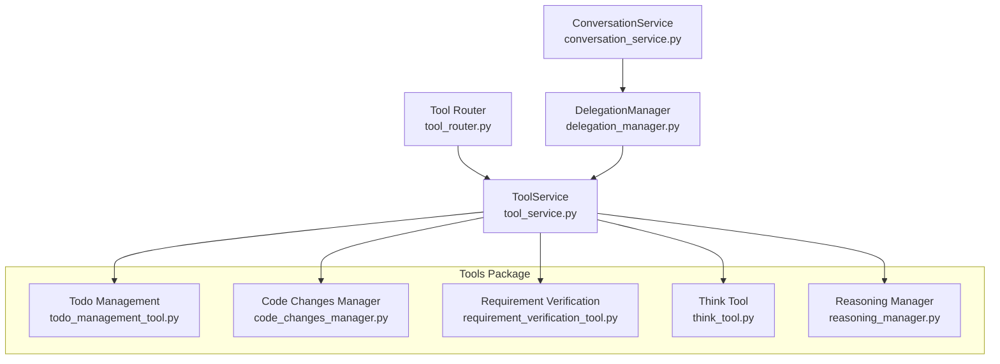
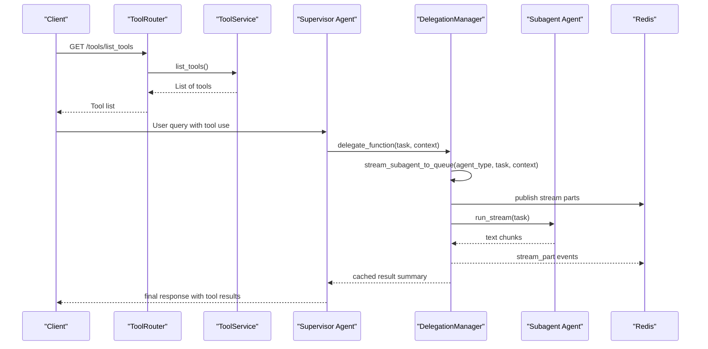
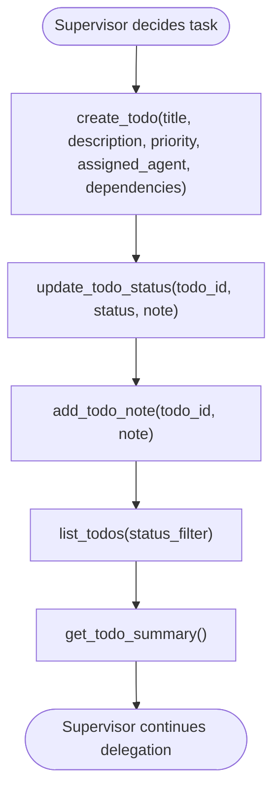
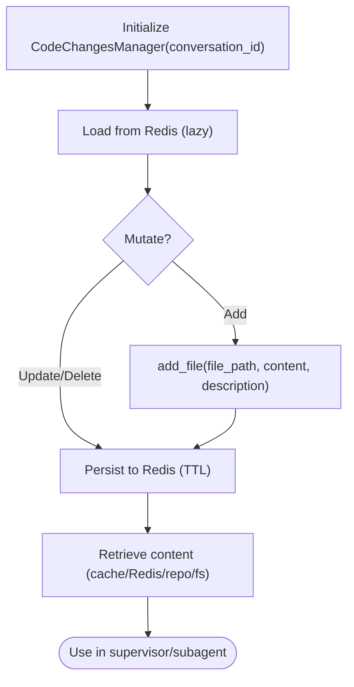
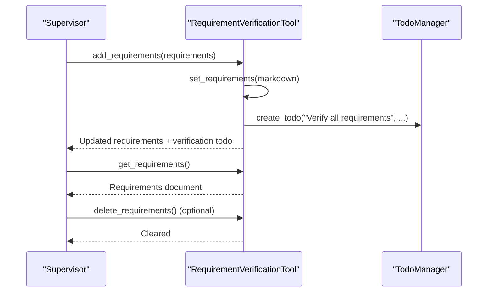
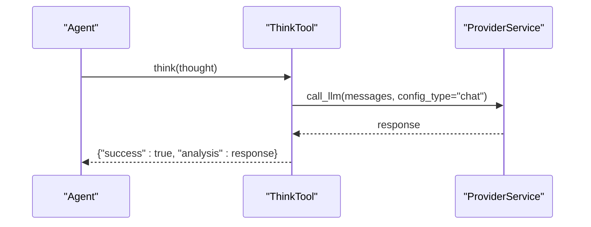
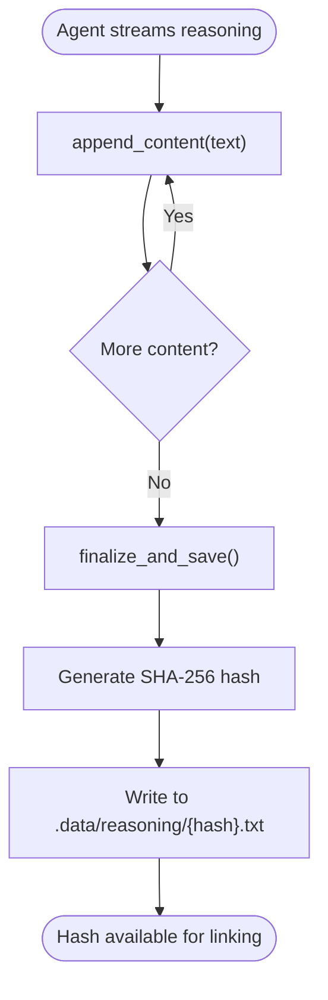
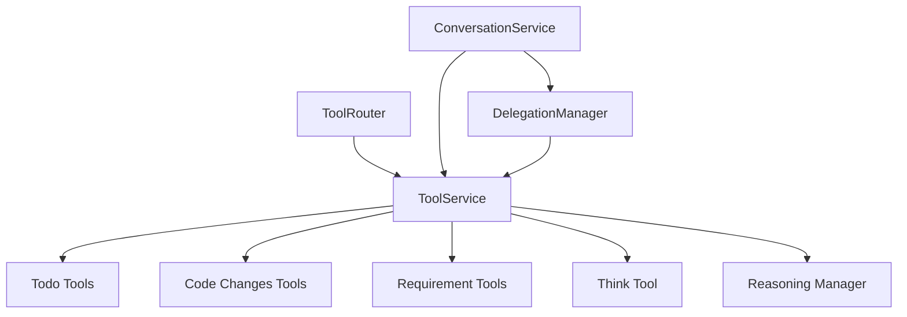

# Utility and Management Tools

<cite>
**Referenced Files in This Document**
- [todo_management_tool.py](file://app/modules/intelligence/tools/todo_management_tool.py)
- [code_changes_manager.py](file://app/modules/intelligence/tools/code_changes_manager.py)
- [requirement_verification_tool.py](file://app/modules/intelligence/tools/requirement_verification_tool.py)
- [think_tool.py](file://app/modules/intelligence/tools/think_tool.py)
- [reasoning_manager.py](file://app/modules/intelligence/tools/reasoning_manager.py)
- [tool_service.py](file://app/modules/intelligence/tools/tool_service.py)
- [tool_router.py](file://app/modules/intelligence/tools/tool_router.py)
- [tool_utils.py](file://app/modules/intelligence/tools/tool_utils.py)
- [tool_schema.py](file://app/modules/intelligence/tools/tool_schema.py)
- [delegation_manager.py](file://app/modules/intelligence/agents/chat_agents/multi_agent/delegation_manager.py)
- [conversation_service.py](file://app/modules/conversations/conversation/conversation_service.py)
- [subagent_streaming_api.md](file://docs/subagent_streaming_api.md)
</cite>

## Table of Contents
1. [Introduction](#introduction)
2. [Project Structure](#project-structure)
3. [Core Components](#core-components)
4. [Architecture Overview](#architecture-overview)
5. [Detailed Component Analysis](#detailed-component-analysis)
6. [Dependency Analysis](#dependency-analysis)
7. [Performance Considerations](#performance-considerations)
8. [Troubleshooting Guide](#troubleshooting-guide)
9. [Conclusion](#conclusion)

## Introduction
This document explains the utility and management tools that enable sophisticated agent reasoning, task management, and workflow coordination in the multi-agent system. It focuses on five key tools:
- Todo Management: persistent task tracking across delegations and agent runs
- Code Changes Manager: centralized, Redis-backed storage for code edits to reduce token usage
- Requirement Verification: structured documentation and verification of output requirements
- Think Tool: reflective reasoning to plan and validate next steps
- Reasoning Manager: capturing and persisting model reasoning content for auditability

These tools integrate with the multi-agent orchestration and conversation management systems to support automated task assignment, requirement validation, and strategic planning.

## Project Structure
The tools live under the intelligence tools package and are wired into the broader system via the ToolService and routed through a FastAPI endpoint. The multi-agent delegation manager coordinates subagent execution and integrates tool results into supervisor workflows.

**Diagram sources**
- [tool_service.py](file://app/modules/intelligence/tools/tool_service.py#L99-L242)
- [tool_router.py](file://app/modules/intelligence/tools/tool_router.py#L14-L21)
- [delegation_manager.py](file://app/modules/intelligence/agents/chat_agents/multi_agent/delegation_manager.py#L25-L56)
- [conversation_service.py](file://app/modules/conversations/conversation/conversation_service.py#L73-L108)

**Section sources**
- [tool_service.py](file://app/modules/intelligence/tools/tool_service.py#L99-L242)
- [tool_router.py](file://app/modules/intelligence/tools/tool_router.py#L14-L21)

## Core Components
- Todo Management Tool: Creates, updates, and tracks todo items with status, priority, dependencies, and notes. Provides a summary and formatted lists for supervisors to coordinate long-running tasks across delegations.
- Code Changes Manager: Stores file changes per conversation in Redis with TTL, enabling reuse across messages and reducing token usage. Includes robust timeout and memory-pressure safeguards.
- Requirement Verification Tool: Maintains a markdown-formatted requirements document and can automatically create a verification todo to ensure finalization checks.
- Think Tool: Allows agents to pause and reflect, synthesizing context and suggesting actionable next steps using the same LLM configuration as the parent agent.
- Reasoning Manager: Captures streamed reasoning content, hashes it, and persists to disk for traceability and auditing.

**Section sources**
- [todo_management_tool.py](file://app/modules/intelligence/tools/todo_management_tool.py#L51-L155)
- [code_changes_manager.py](file://app/modules/intelligence/tools/code_changes_manager.py#L218-L343)
- [requirement_verification_tool.py](file://app/modules/intelligence/tools/requirement_verification_tool.py#L13-L32)
- [think_tool.py](file://app/modules/intelligence/tools/think_tool.py#L13-L102)
- [reasoning_manager.py](file://app/modules/intelligence/tools/reasoning_manager.py#L22-L96)

## Architecture Overview
The tools are instantiated by ToolService and exposed via ToolRouter. Multi-agent delegation uses DelegationManager to execute subagents in parallel, stream results, and cache outcomes. ConversationService orchestrates the end-to-end flow, integrating tools and agents into a cohesive workflow.

**Diagram sources**
- [tool_router.py](file://app/modules/intelligence/tools/tool_router.py#L14-L21)
- [tool_service.py](file://app/modules/intelligence/tools/tool_service.py#L126-L242)
- [delegation_manager.py](file://app/modules/intelligence/agents/chat_agents/multi_agent/delegation_manager.py#L227-L679)
- [subagent_streaming_api.md](file://docs/subagent_streaming_api.md#L43-L348)

## Detailed Component Analysis

### Todo Management Tool
Purpose:
- Enable supervisors to create, update, and track long-running tasks across delegations.
- Provide visibility into task status, priority, dependencies, and progress notes.

Key capabilities:
- Create todo items with title, description, priority, assigned agent, and dependencies.
- Update status with optional notes; list todos with optional status filter.
- Summarize current state by status counts and active tasks.
- Context-isolated managers per execution context using ContextVar.

Execution pattern:
- Tools are created via create_todo_management_tools() and registered in ToolService.
- Each agent run initializes a fresh TodoManager instance via _get_todo_manager() to avoid cross-run interference.

Integration with multi-agent:
- Supervisors use “create_todo” and “update_todo_status” to plan and track subagent tasks.
- “list_todos” and “get_todo_summary” provide oversight for complex workflows.

Common use cases:
- Automated task assignment: create a todo with assigned_agent and dependencies, then update status as subagents report progress.
- Strategic planning: maintain a prioritized backlog and update priorities as context evolves.

**Diagram sources**
- [todo_management_tool.py](file://app/modules/intelligence/tools/todo_management_tool.py#L58-L155)

**Section sources**
- [todo_management_tool.py](file://app/modules/intelligence/tools/todo_management_tool.py#L51-L155)
- [tool_service.py](file://app/modules/intelligence/tools/tool_service.py#L199-L212)

### Code Changes Manager
Purpose:
- Centralize code changes per conversation in Redis with TTL to reduce token usage and enable reuse across messages.
- Safely handle large files, memory pressure, and database session issues in forked workers.

Key capabilities:
- Add/update/delete files with content and descriptions.
- Retrieve current content from in-memory cache, Redis, repository, or filesystem fallback.
- Persist changes with TTL and load on demand.
- Robust timeout and memory-pressure guards to prevent worker hangs and OOM.

Execution pattern:
- Constructed with a conversation_id; uses Redis key prefix and TTL constants.
- Loads from Redis on first access; persists after mutations.
- Uses safe git operations and timeouts to avoid deadlocks.

Integration with multi-agent:
- Subagents can record changes; supervisors can review diffs and summaries.
- Reduces token usage by keeping large diffs in Redis rather than embedding in responses.

Common use cases:
- Automated code generation and updates: add_file(file_path, content) during subagent execution.
- Diff inspection: combine with other tools to compare before/after states.

**Diagram sources**
- [code_changes_manager.py](file://app/modules/intelligence/tools/code_changes_manager.py#L218-L343)

**Section sources**
- [code_changes_manager.py](file://app/modules/intelligence/tools/code_changes_manager.py#L218-L343)
- [tool_service.py](file://app/modules/intelligence/tools/tool_service.py#L204-L212)

### Requirement Verification Tool
Purpose:
- Maintain a markdown-formatted requirements document for complex tasks.
- Automatically create a verification todo to ensure finalization checks.

Key capabilities:
- Add or replace requirements document.
- Clear requirements.
- Retrieve and display current requirements with reminders to verify before finalizing.

Execution pattern:
- Uses a ContextVar-managed RequirementManager per execution context.
- On adding requirements, attempts to create a “Verify all requirements” todo via TodoManager.

Integration with multi-agent:
- Supervisors call “add_requirements” early, then “get_requirements” before finalizing.
- Ensures quality gates and reduces risk of incomplete outputs.

Common use cases:
- Output validation: define success criteria upfront and verify against final results.
- Multi-step planning: enumerate deliverables and update as scope evolves.

**Diagram sources**
- [requirement_verification_tool.py](file://app/modules/intelligence/tools/requirement_verification_tool.py#L70-L137)
- [todo_management_tool.py](file://app/modules/intelligence/tools/todo_management_tool.py#L58-L83)

**Section sources**
- [requirement_verification_tool.py](file://app/modules/intelligence/tools/requirement_verification_tool.py#L13-L137)
- [tool_service.py](file://app/modules/intelligence/tools/tool_service.py#L209-L212)

### Think Tool
Purpose:
- Allow agents to pause, reflect, and plan next steps using the same LLM configuration as the parent agent.
- Provide structured guidance: current understanding, key questions, recommended next steps.

Key capabilities:
- Asynchronous and synchronous execution paths.
- Uses ProviderService to call the configured LLM.
- Returns structured analysis with success flag and content.

Execution pattern:
- ToolService constructs ThinkTool with SQL DB session and user ID.
- Exposed as a StructuredTool named “think”.

Integration with multi-agent:
- Supervisors can call “think” to validate plans or clarify missing information before delegating.

Common use cases:
- Problem synthesis: summarize context and identify gaps.
- Action planning: suggest specific, actionable next steps.

**Diagram sources**
- [think_tool.py](file://app/modules/intelligence/tools/think_tool.py#L39-L102)

**Section sources**
- [think_tool.py](file://app/modules/intelligence/tools/think_tool.py#L13-L102)
- [tool_service.py](file://app/modules/intelligence/tools/tool_service.py#L123-L124)

### Reasoning Manager
Purpose:
- Capture streamed reasoning content from model responses and persist it for traceability.
- Generate a stable hash to reference reasoning content externally.

Key capabilities:
- Append streamed text to an internal buffer.
- Finalize and save to .data/reasoning/{hash}.txt.
- Provide current reasoning hash for linking.

Execution pattern:
- Managed per execution context via ContextVar.
- Reset between runs to ensure isolation.

Integration with multi-agent:
- Used by streaming agents to persist reasoning for later inspection or diffing.

Common use cases:
- Auditability: retain reasoning for compliance or debugging.
- Linking: reference reasoning via hash in diffs or reports.

**Diagram sources**
- [reasoning_manager.py](file://app/modules/intelligence/tools/reasoning_manager.py#L30-L71)

**Section sources**
- [reasoning_manager.py](file://app/modules/intelligence/tools/reasoning_manager.py#L22-L96)
- [tool_service.py](file://app/modules/intelligence/tools/tool_service.py#L94-L96)

## Dependency Analysis
- ToolService aggregates tools from multiple modules and registers them under unified names.
- ToolRouter exposes a list of tools with descriptions and parameter schemas.
- DelegationManager coordinates subagent execution, streams text-only content, and caches results for supervisors.
- ConversationService composes ToolService, AgentsService, and other subsystems to orchestrate end-to-end conversations.

**Diagram sources**
- [tool_service.py](file://app/modules/intelligence/tools/tool_service.py#L134-L242)
- [tool_router.py](file://app/modules/intelligence/tools/tool_router.py#L14-L21)
- [delegation_manager.py](file://app/modules/intelligence/agents/chat_agents/multi_agent/delegation_manager.py#L25-L56)
- [conversation_service.py](file://app/modules/conversations/conversation/conversation_service.py#L73-L108)

**Section sources**
- [tool_service.py](file://app/modules/intelligence/tools/tool_service.py#L99-L242)
- [tool_router.py](file://app/modules/intelligence/tools/tool_router.py#L14-L21)
- [delegation_manager.py](file://app/modules/intelligence/agents/chat_agents/multi_agent/delegation_manager.py#L25-L56)
- [conversation_service.py](file://app/modules/conversations/conversation/conversation_service.py#L73-L108)

## Performance Considerations
- Response truncation: tool_utils provides truncation helpers to cap response sizes and avoid overwhelming downstream consumers.
- Memory pressure handling: CodeChangesManager checks memory usage and skips non-critical operations under pressure.
- Timeouts: CodeChangesManager wraps operations with timeouts to prevent deadlocks in forked workers.
- Redis persistence: CodeChangesManager uses TTL to expire stale data and reduce memory footprint.
- Streaming limits: DelegationManager enforces chunk and stream timeouts to prevent indefinite hangs.

Best practices:
- Prefer streaming APIs for long-running tasks to keep latency low.
- Use requirement verification early to minimize rework.
- Leverage todo management to decompose complex tasks into manageable units.

**Section sources**
- [tool_utils.py](file://app/modules/intelligence/tools/tool_utils.py#L13-L75)
- [code_changes_manager.py](file://app/modules/intelligence/tools/code_changes_manager.py#L104-L143)
- [delegation_manager.py](file://app/modules/intelligence/agents/chat_agents/multi_agent/delegation_manager.py#L351-L421)

## Troubleshooting Guide
Common issues and resolutions:
- Tool not found: Ensure ToolService includes the tool and ToolRouter is reachable. Verify tool names match registration.
- Redis connectivity: CodeChangesManager logs warnings when loading/saving fails; check Redis URL and credentials.
- Memory pressure: When memory usage exceeds threshold, CodeChangesManager skips repository fetches and falls back to filesystem.
- Deadlocks in forked workers: Timeouts protect database queries and git operations; consider reducing timeouts or increasing worker memory limits.
- Subagent hangs: DelegationManager applies chunk and stream timeouts; check for long-running tool calls or network issues.
- Requirements verification not created: RequirementVerificationTool attempts to create a verification todo via TodoManager; ensure Todo tools are available.

Operational tips:
- Use “get_requirements” before finalizing responses to catch missed items.
- Monitor “get_todo_summary” to ensure tasks are progressing as expected.
- Inspect reasoning hash via ReasoningManager to locate persisted reasoning content.

**Section sources**
- [code_changes_manager.py](file://app/modules/intelligence/tools/code_changes_manager.py#L299-L339)
- [delegation_manager.py](file://app/modules/intelligence/agents/chat_agents/multi_agent/delegation_manager.py#L351-L421)
- [requirement_verification_tool.py](file://app/modules/intelligence/tools/requirement_verification_tool.py#L83-L106)
- [reasoning_manager.py](file://app/modules/intelligence/tools/reasoning_manager.py#L56-L66)

## Conclusion
These utility and management tools form the backbone of agent reasoning, task management, and workflow coordination. Together, they enable supervisors to plan, track, and verify outcomes while subagents execute specialized tasks in isolation. By leveraging Redis-backed state, structured reflection, and robust streaming, the system supports scalable, auditable, and reliable multi-agent workflows.