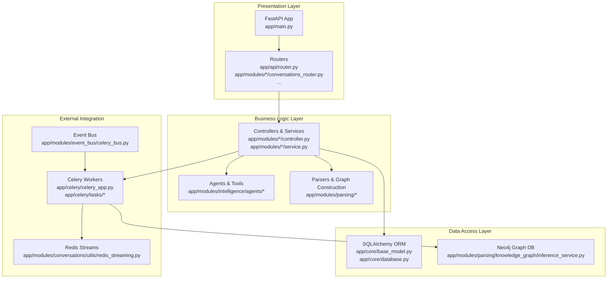
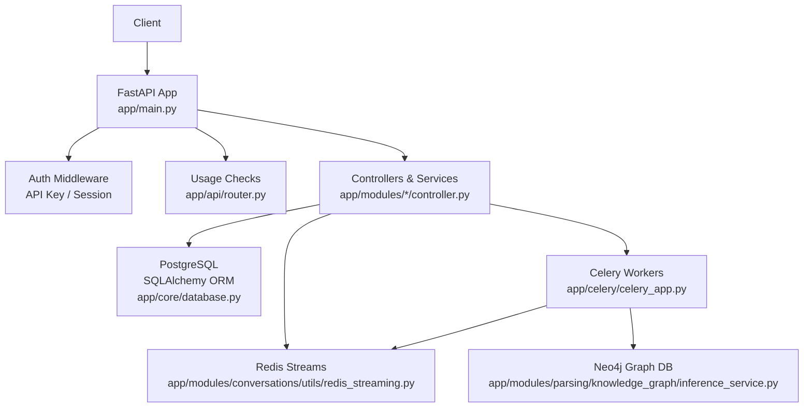
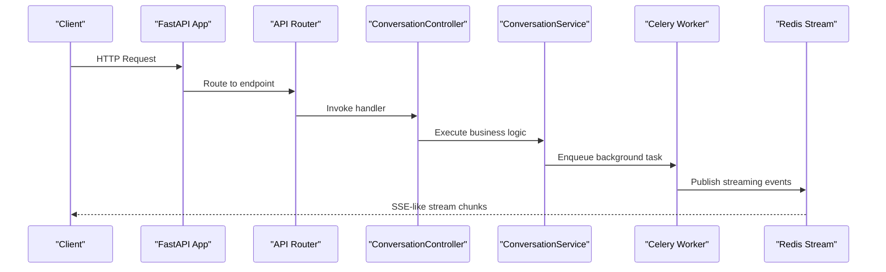
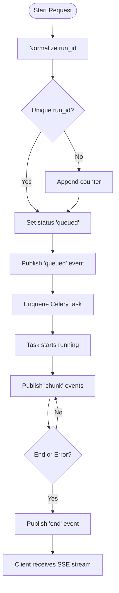
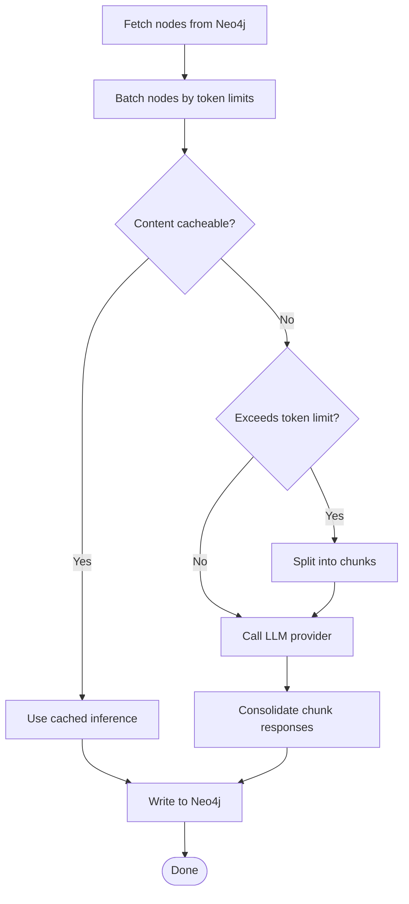
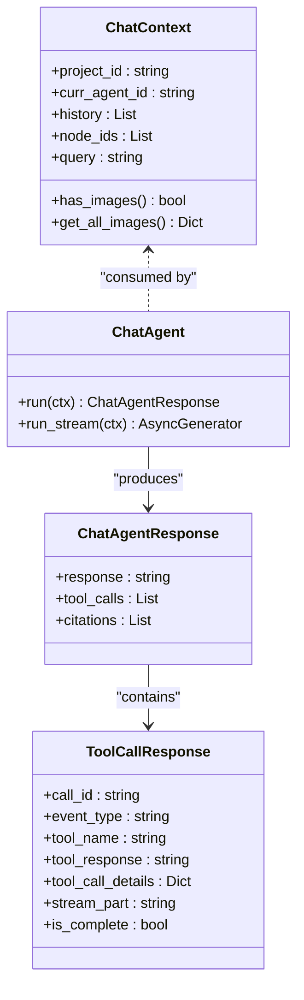
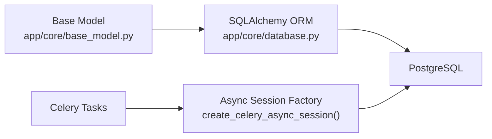
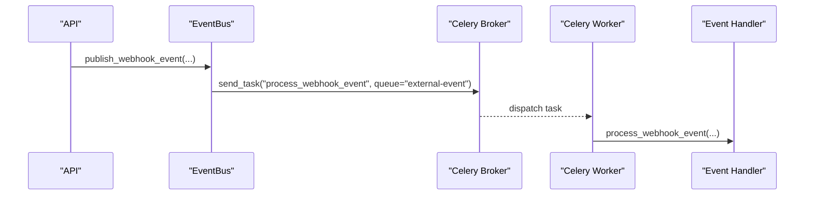
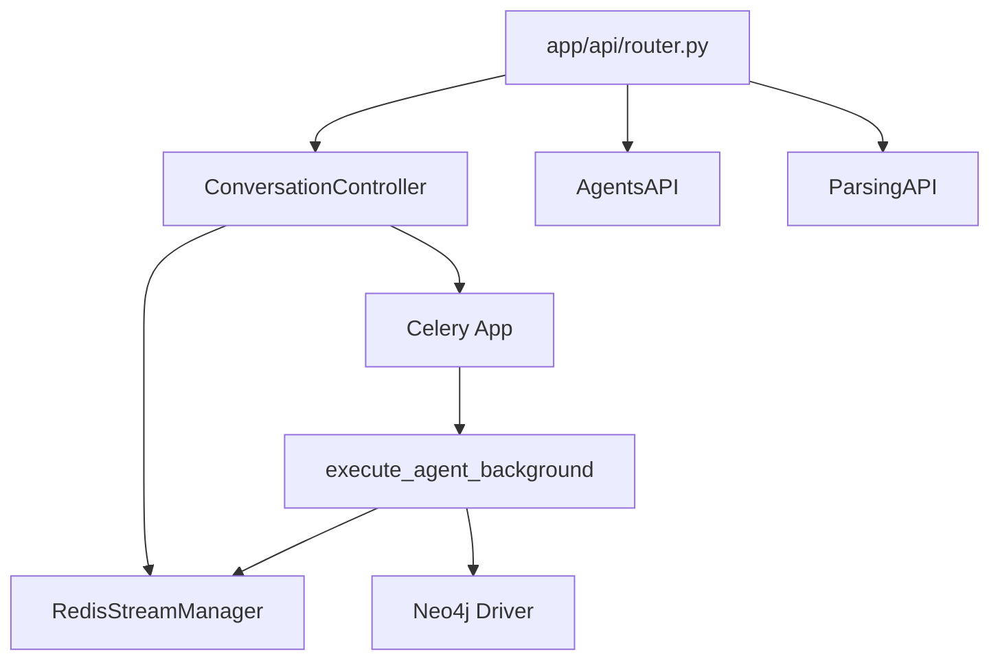

# Architecture Overview

<cite>
**Referenced Files in This Document**
- [app/main.py](file://app/main.py)
- [app/api/router.py](file://app/api/router.py)
- [app/modules/conversations/conversations_router.py](file://app/modules/conversations/conversations_router.py)
- [app/modules/conversations/utils/conversation_routing.py](file://app/modules/conversations/utils/conversation_routing.py)
- [app/modules/conversations/utils/redis_streaming.py](file://app/modules/conversations/utils/redis_streaming.py)
- [app/celery/celery_app.py](file://app/celery/celery_app.py)
- [app/celery/tasks/agent_tasks.py](file://app/celery/tasks/agent_tasks.py)
- [app/modules/intelligence/agents/agents_router.py](file://app/modules/intelligence/agents/agents_router.py)
- [app/modules/parsing/graph_construction/parsing_router.py](file://app/modules/parsing/graph_construction/parsing_router.py)
- [app/modules/parsing/knowledge_graph/inference_service.py](file://app/modules/parsing/knowledge_graph/inference_service.py)
- [app/modules/event_bus/celery_bus.py](file://app/modules/event_bus/celery_bus.py)
- [app/core/database.py](file://app/core/database.py)
- [app/core/base_model.py](file://app/core/base_model.py)
</cite>

## Table of Contents
1. [Introduction](#introduction)
2. [Project Structure](#project-structure)
3. [Core Components](#core-components)
4. [Architecture Overview](#architecture-overview)
5. [Detailed Component Analysis](#detailed-component-analysis)
6. [Dependency Analysis](#dependency-analysis)
7. [Performance Considerations](#performance-considerations)
8. [Troubleshooting Guide](#troubleshooting-guide)
9. [Conclusion](#conclusion)

## Introduction
This document presents the Potpie architecture overview, focusing on the microservices-style design built around a FastAPI application, Celery-backed background processing, and modular service layers. It explains how requests flow from the presentation layer (APIs) through authentication and usage checks, into business logic services, and finally to data access and external integrations. It also covers the streaming architecture for real-time conversations, the knowledge graph construction pipeline, and the multi-agent system design. The goal is to provide both conceptual overviews for system architects and technical details for developers regarding service boundaries and communication patterns.

## Project Structure
Potpie follows a layered, feature-based organization:
- Presentation Layer: FastAPI routers and endpoints under app/api and app/modules/*_router.py
- Business Logic Layer: Controllers, Services, and Factories under app/modules/*
- Data Access Layer: SQLAlchemy ORM models and repositories under app/core and app/modules/*/models
- External Integration Layer: Celery workers, Redis streams, Neo4j, and third-party providers
- Cross-cutting Concerns: Authentication, usage checks, logging, and configuration

**Diagram sources**
- [app/main.py](file://app/main.py#L147-L171)
- [app/api/router.py](file://app/api/router.py#L48-L318)
- [app/modules/conversations/conversations_router.py](file://app/modules/conversations/conversations_router.py#L41-L622)
- [app/celery/celery_app.py](file://app/celery/celery_app.py#L67-L129)
- [app/modules/conversations/utils/redis_streaming.py](file://app/modules/conversations/utils/redis_streaming.py#L11-L248)
- [app/modules/parsing/knowledge_graph/inference_service.py](file://app/modules/parsing/knowledge_graph/inference_service.py#L45-L61)

**Section sources**
- [app/main.py](file://app/main.py#L147-L171)
- [app/api/router.py](file://app/api/router.py#L48-L318)
- [app/modules/conversations/conversations_router.py](file://app/modules/conversations/conversations_router.py#L41-L622)
- [app/celery/celery_app.py](file://app/celery/celery_app.py#L67-L129)
- [app/modules/conversations/utils/redis_streaming.py](file://app/modules/conversations/utils/redis_streaming.py#L11-L248)
- [app/modules/parsing/knowledge_graph/inference_service.py](file://app/modules/parsing/knowledge_graph/inference_service.py#L45-L61)

## Core Components
- FastAPI Application: Initializes middleware, routers, database, and application data; exposes health checks and version metadata.
- Routers: Feature-specific routers for authentication, conversations, agents, parsing, integrations, and more.
- Controllers and Services: Orchestrate business logic, enforce usage limits, and coordinate stores and external systems.
- Celery Application: Centralized task routing and worker configuration with Redis backend; specialized task modules for agent and parsing workloads.
- Redis Streaming: Real-time SSE-like streaming of agent-generated chunks and lifecycle events.
- Knowledge Graph Inference: Neo4j-backed graph traversal and docstring inference pipeline with batching and caching.
- Event Bus: Publishes webhook and custom events to Celery queues for asynchronous processing.

**Section sources**
- [app/main.py](file://app/main.py#L46-L211)
- [app/api/router.py](file://app/api/router.py#L56-L318)
- [app/modules/conversations/conversations_router.py](file://app/modules/conversations/conversations_router.py#L58-L622)
- [app/celery/celery_app.py](file://app/celery/celery_app.py#L67-L129)
- [app/modules/conversations/utils/redis_streaming.py](file://app/modules/conversations/utils/redis_streaming.py#L11-L248)
- [app/modules/parsing/knowledge_graph/inference_service.py](file://app/modules/parsing/knowledge_graph/inference_service.py#L45-L61)
- [app/modules/event_bus/celery_bus.py](file://app/modules/event_bus/celery_bus.py#L18-L127)

## Architecture Overview
Potpie employs a microservices-style FastAPI application with modular routers and a robust background processing subsystem powered by Celery and Redis. The system is layered:
- Presentation: FastAPI endpoints route requests to controllers/services.
- Business Logic: Controllers validate inputs, enforce usage limits, and delegate to services.
- Data Access: SQLAlchemy ORM for relational data; Neo4j for knowledge graph operations.
- External Integration: Celery workers process long-running tasks; Redis streams deliver real-time updates; event bus publishes external events.

**Diagram sources**
- [app/main.py](file://app/main.py#L101-L171)
- [app/api/router.py](file://app/api/router.py#L56-L318)
- [app/modules/conversations/utils/redis_streaming.py](file://app/modules/conversations/utils/redis_streaming.py#L11-L248)
- [app/celery/celery_app.py](file://app/celery/celery_app.py#L67-L129)
- [app/core/database.py](file://app/core/database.py#L13-L117)
- [app/modules/parsing/knowledge_graph/inference_service.py](file://app/modules/parsing/knowledge_graph/inference_service.py#L45-L61)

## Detailed Component Analysis

### FastAPI Application and Routers
- The main application initializes CORS, logging, Sentry, Phoenix tracing, registers routers, and performs startup initialization (database, Firebase/dummy user setup, system prompts).
- Routers expose endpoints for authentication, conversations, agents, parsing, integrations, and more. They depend on database sessions and authentication helpers.

**Diagram sources**
- [app/main.py](file://app/main.py#L147-L171)
- [app/api/router.py](file://app/api/router.py#L97-L218)
- [app/modules/conversations/conversations_router.py](file://app/modules/conversations/conversations_router.py#L160-L286)
- [app/modules/conversations/utils/conversation_routing.py](file://app/modules/conversations/utils/conversation_routing.py#L107-L171)
- [app/celery/tasks/agent_tasks.py](file://app/celery/tasks/agent_tasks.py#L11-L25)

**Section sources**
- [app/main.py](file://app/main.py#L46-L211)
- [app/api/router.py](file://app/api/router.py#L97-L218)
- [app/modules/conversations/conversations_router.py](file://app/modules/conversations/conversations_router.py#L160-L286)
- [app/modules/conversations/utils/conversation_routing.py](file://app/modules/conversations/utils/conversation_routing.py#L107-L171)
- [app/celery/tasks/agent_tasks.py](file://app/celery/tasks/agent_tasks.py#L11-L25)

### Streaming Architecture for Real-Time Conversations
- Deterministic run/session IDs are normalized and ensured unique to manage reconnection and replay semantics.
- Redis streams carry “chunk”, “queued”, and “end” events; clients consume via Server-Sent Events.
- Background tasks publish progress and completion; cancellation keys allow interruption.

**Diagram sources**
- [app/modules/conversations/utils/conversation_routing.py](file://app/modules/conversations/utils/conversation_routing.py#L23-L171)
- [app/modules/conversations/utils/redis_streaming.py](file://app/modules/conversations/utils/redis_streaming.py#L21-L151)
- [app/celery/tasks/agent_tasks.py](file://app/celery/tasks/agent_tasks.py#L16-L247)

**Section sources**
- [app/modules/conversations/utils/conversation_routing.py](file://app/modules/conversations/utils/conversation_routing.py#L23-L171)
- [app/modules/conversations/utils/redis_streaming.py](file://app/modules/conversations/utils/redis_streaming.py#L21-L151)
- [app/celery/tasks/agent_tasks.py](file://app/celery/tasks/agent_tasks.py#L16-L247)

### Knowledge Graph Construction Pipeline
- The inference service fetches nodes from Neo4j, batches them considering token limits and caching, and generates docstrings using an LLM provider.
- Large nodes are split into chunks; responses are consolidated by parent node; cached inferences are reused when possible.

**Diagram sources**
- [app/modules/parsing/knowledge_graph/inference_service.py](file://app/modules/parsing/knowledge_graph/inference_service.py#L112-L800)

**Section sources**
- [app/modules/parsing/knowledge_graph/inference_service.py](file://app/modules/parsing/knowledge_graph/inference_service.py#L112-L800)

### Multi-Agent System Design
- Agents implement a common interface and produce streaming responses with tool calls and citations.
- The system supports supervisors and delegations; execution flows and streaming processors orchestrate agent runs and stream events.

**Diagram sources**
- [app/modules/intelligence/agents/chat_agent.py](file://app/modules/intelligence/agents/chat_agent.py#L101-L121)

**Section sources**
- [app/modules/intelligence/agents/chat_agent.py](file://app/modules/intelligence/agents/chat_agent.py#L101-L121)

### Data Access Layer and ORM
- SQLAlchemy declarative base and engines are configured with connection pooling and async support.
- Synchronous and asynchronous session factories are provided; Celery tasks use a dedicated async session factory to avoid cross-task Future binding issues.

**Diagram sources**
- [app/core/base_model.py](file://app/core/base_model.py#L8-L17)
- [app/core/database.py](file://app/core/database.py#L13-L117)
- [app/celery/celery_app.py](file://app/celery/celery_app.py#L55-L93)

**Section sources**
- [app/core/base_model.py](file://app/core/base_model.py#L8-L17)
- [app/core/database.py](file://app/core/database.py#L13-L117)
- [app/celery/celery_app.py](file://app/celery/celery_app.py#L55-L93)

### External Integration Layer
- Celery routes tasks to queues for agent and parsing workloads; Redis is used for task coordination and streaming.
- The event bus publishes webhook and custom events to a shared external-event queue for asynchronous processing.

**Diagram sources**
- [app/modules/event_bus/celery_bus.py](file://app/modules/event_bus/celery_bus.py#L31-L80)
- [app/celery/celery_app.py](file://app/celery/celery_app.py#L89-L106)

**Section sources**
- [app/modules/event_bus/celery_bus.py](file://app/modules/event_bus/celery_bus.py#L31-L80)
- [app/celery/celery_app.py](file://app/celery/celery_app.py#L89-L106)

## Dependency Analysis
- Coupling: Routers depend on controllers/services; controllers depend on stores and external systems; Celery tasks depend on Redis and Neo4j.
- Cohesion: Feature routers encapsulate related endpoints; services encapsulate business logic; tasks encapsulate background work.
- External Dependencies: PostgreSQL (SQLAlchemy), Neo4j, Redis, Celery broker/backend, Sentry, Phoenix tracing.

**Diagram sources**
- [app/api/router.py](file://app/api/router.py#L97-L218)
- [app/modules/conversations/conversations_router.py](file://app/modules/conversations/conversations_router.py#L160-L286)
- [app/modules/conversations/utils/conversation_routing.py](file://app/modules/conversations/utils/conversation_routing.py#L107-L171)
- [app/celery/tasks/agent_tasks.py](file://app/celery/tasks/agent_tasks.py#L16-L247)
- [app/modules/parsing/knowledge_graph/inference_service.py](file://app/modules/parsing/knowledge_graph/inference_service.py#L45-L61)

**Section sources**
- [app/api/router.py](file://app/api/router.py#L97-L218)
- [app/modules/conversations/conversations_router.py](file://app/modules/conversations/conversations_router.py#L160-L286)
- [app/modules/conversations/utils/conversation_routing.py](file://app/modules/conversations/utils/conversation_routing.py#L107-L171)
- [app/celery/tasks/agent_tasks.py](file://app/celery/tasks/agent_tasks.py#L16-L247)
- [app/modules/parsing/knowledge_graph/inference_service.py](file://app/modules/parsing/knowledge_graph/inference_service.py#L45-L61)

## Performance Considerations
- Asynchronous Sessions: Dedicated async session factory for Celery tasks avoids cross-task Future binding issues and improves reliability.
- Redis TTL and MaxLen: Streams are bounded and expire after configured TTL to prevent memory growth.
- Worker Configuration: Prefetch multiplier, late acks, and memory limits reduce worker churn and memory leaks.
- Token Batching and Caching: Knowledge graph inference batches nodes by token limits and leverages caching to reduce LLM calls.
- Parallelism: Semaphore-based parallelism controls concurrency for entry point inference.

[No sources needed since this section provides general guidance]

## Troubleshooting Guide
- Health Checks: The application exposes a health endpoint reporting status and version.
- Logging Context: Middleware injects request-level context (request_id, path, user_id) for traceability.
- Redis Stream Errors: Consumers handle timeouts, expiration, and error events; clients should reconnect and resume from cursors.
- Celery Worker Issues: Async handler cleanup and signal-safe shutdown mitigate pending task warnings; LiteLLM async handlers are patched to avoid unawaited coroutines.

**Section sources**
- [app/main.py](file://app/main.py#L173-L183)
- [app/main.py](file://app/main.py#L116-L129)
- [app/modules/conversations/utils/redis_streaming.py](file://app/modules/conversations/utils/redis_streaming.py#L64-L151)
- [app/celery/celery_app.py](file://app/celery/celery_app.py#L405-L453)

## Conclusion
Potpie’s architecture combines a modular FastAPI application with robust background processing via Celery and Redis, enabling scalable real-time conversations and knowledge graph operations. The layered design—presentation, business logic, data access, and external integration—supports clear service boundaries and maintainable communication patterns. The streaming architecture and multi-agent system provide responsive, extensible capabilities for interactive AI-driven code exploration and documentation.