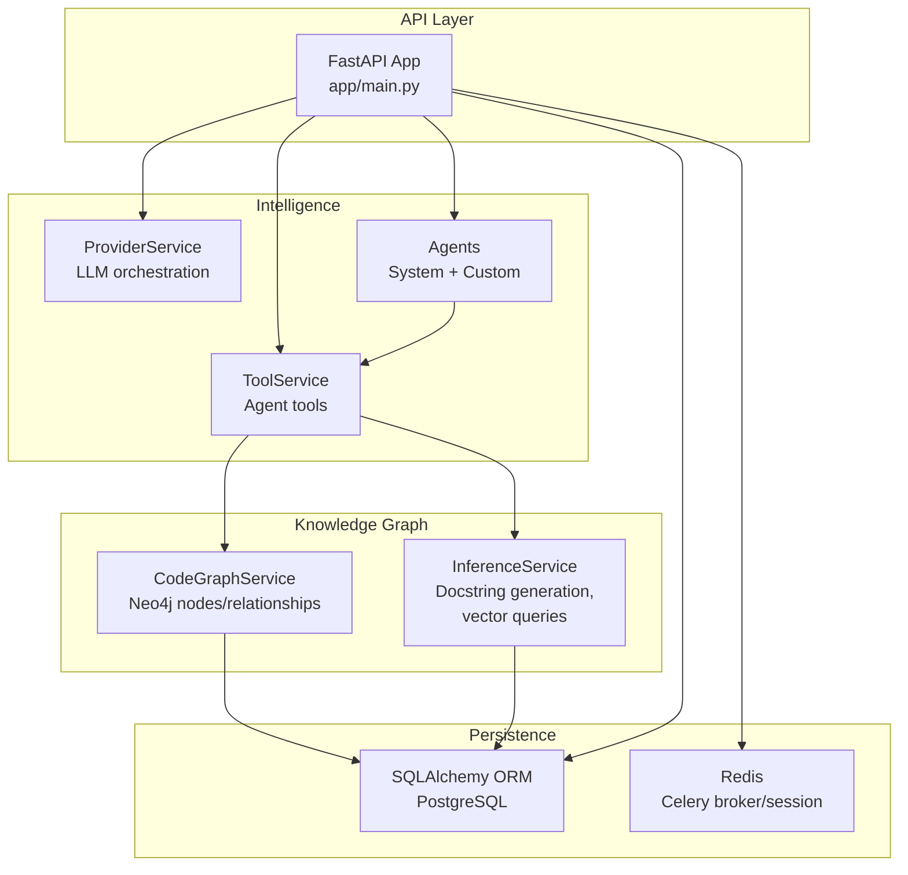
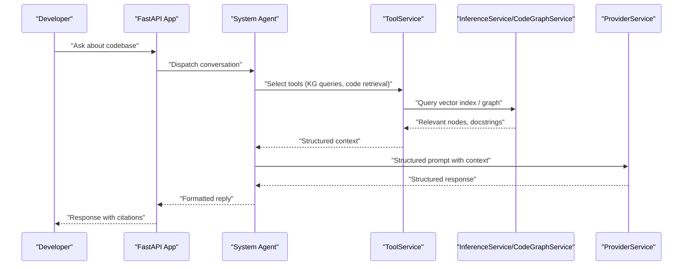
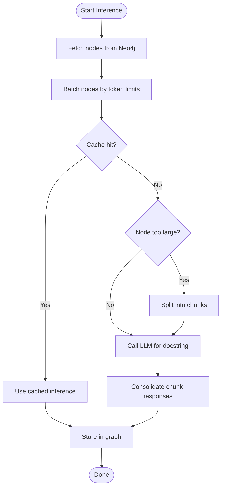
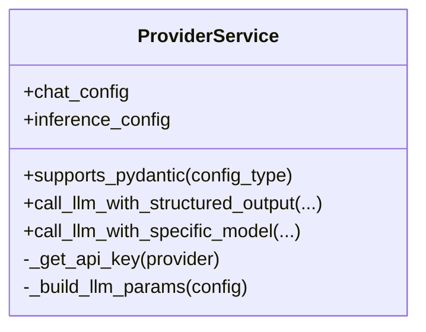
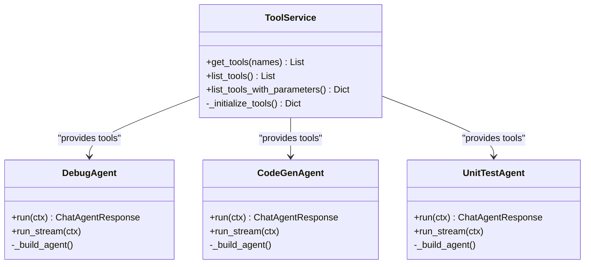
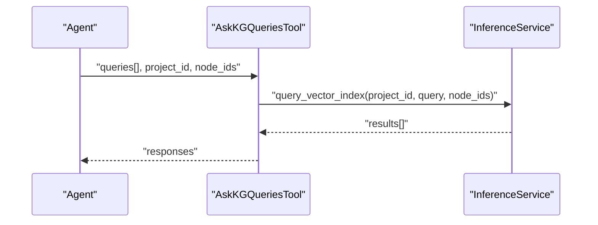
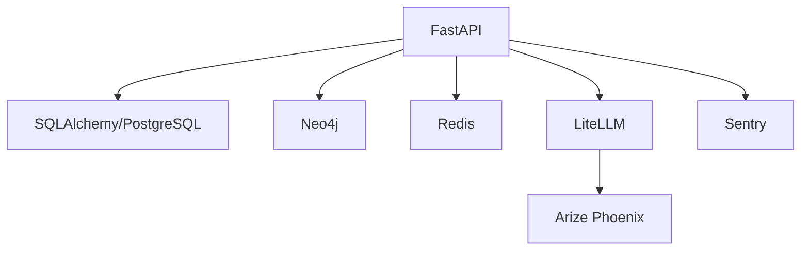

# Introduction and Purpose

<cite>
**Referenced Files in This Document**
- [README.md](file://README.md)
- [GETTING_STARTED.md](file://GETTING_STARTED.md)
- [app/main.py](file://app/main.py)
- [app/modules/parsing/graph_construction/code_graph_service.py](file://app/modules/parsing/graph_construction/code_graph_service.py)
- [app/modules/parsing/knowledge_graph/inference_service.py](file://app/modules/parsing/knowledge_graph/inference_service.py)
- [app/modules/parsing/knowledge_graph/inference_schema.py](file://app/modules/parsing/knowledge_graph/inference_schema.py)
- [app/modules/intelligence/provider/provider_service.py](file://app/modules/intelligence/provider/provider_service.py)
- [app/modules/intelligence/tools/tool_service.py](file://app/modules/intelligence/tools/tool_service.py)
- [app/modules/intelligence/tools/kg_based_tools/ask_knowledge_graph_queries_tool.py](file://app/modules/intelligence/tools/kg_based_tools/ask_knowledge_graph_queries_tool.py)
- [app/modules/intelligence/agents/chat_agents/system_agents/debug_agent.py](file://app/modules/intelligence/agents/chat_agents/system_agents/debug_agent.py)
- [app/modules/intelligence/agents/chat_agents/system_agents/code_gen_agent.py](file://app/modules/intelligence/agents/chat_agents/system_agents/code_gen_agent.py)
- [app/modules/intelligence/agents/chat_agents/system_agents/unit_test_agent.py](file://app/modules/intelligence/agents/chat_agents/system_agents/unit_test_agent.py)
- [pyproject.toml](file://pyproject.toml)
</cite>

## Table of Contents
1. [Introduction](#introduction)
2. [Project Structure](#project-structure)
3. [Core Components](#core-components)
4. [Architecture Overview](#architecture-overview)
5. [Detailed Component Analysis](#detailed-component-analysis)
6. [Dependency Analysis](#dependency-analysis)
7. [Performance Considerations](#performance-considerations)
8. [Troubleshooting Guide](#troubleshooting-guide)
9. [Conclusion](#conclusion)

## Introduction
Potpie is an open-source AI-powered code intelligence platform that builds specialized AI agents for your codebase. Its mission is to transform how developers interact with code by turning complex codebases into navigable, explorable knowledge graphs and pairing them with powerful reasoning agents. Potpie helps teams understand unfamiliar code, debug issues systematically, generate tests, and implement features faster—by combining a comprehensive knowledge graph with LLM-driven agents that understand relationships, context, and intent.

Why Potpie exists:
- Developers spend too much time just understanding codebases, let alone changing or extending them.
- Traditional debugging and testing workflows are reactive and inefficient.
- Teams struggle to scale onboarding, code reviews, and feature delivery across large, distributed systems.
- Existing tools lack a unified, code-centric knowledge graph that connects functions, classes, files, and their relationships.

What Potpie delivers:
- A comprehensive knowledge graph of your codebase, capturing structure, relationships, and semantics.
- Specialized agents that operate over this graph to answer questions, generate tests, debug issues, and implement features.
- A flexible tooling system that lets agents fetch code, trace relationships, and orchestrate changes.
- Support for multiple LLM providers and models, with structured outputs and robust retry logic.

Value proposition:
- Deep code understanding through graph-based reasoning.
- Automated, repeatable workflows for onboarding, debugging, testing, and feature development.
- Seamless integration with development workflows and collaboration platforms.
- Extensibility for custom agents and tools tailored to your domain.

Practical scenarios:
- Onboarding: Ask a Q&A agent to explain architecture, setup, and key flows.
- Understanding: Use natural language queries to locate relevant functions, classes, or modules.
- Debugging: Feed stacktraces and symptoms to a dedicated debugging agent that traces upstream/downstream flows and proposes root cause analysis.
- Testing: Generate unit and integration test plans and code that fit your codebase’s patterns.
- Feature development: Plan low-level designs and implement changes with confidence, guided by the knowledge graph and code changes manager.

## Project Structure
At a high level, Potpie is a FastAPI application that orchestrates:
- Code parsing and graph construction (Neo4j-backed knowledge graph).
- LLM provider abstraction and structured output orchestration.
- Agent orchestration and tooling for codebase interaction.
- Conversations and sessions for human-in-the-loop workflows.
- Integrations with GitHub, Jira, Linear, and Confluence.

**Diagram sources**
- [app/main.py](file://app/main.py#L147-L171)
- [app/modules/intelligence/provider/provider_service.py](file://app/modules/intelligence/provider/provider_service.py#L472-L580)
- [app/modules/intelligence/tools/tool_service.py](file://app/modules/intelligence/tools/tool_service.py#L99-L133)
- [app/modules/parsing/graph_construction/code_graph_service.py](file://app/modules/parsing/graph_construction/code_graph_service.py#L15-L36)
- [app/modules/parsing/knowledge_graph/inference_service.py](file://app/modules/parsing/knowledge_graph/inference_service.py#L45-L61)

**Section sources**
- [app/main.py](file://app/main.py#L147-L171)
- [pyproject.toml](file://pyproject.toml#L1-L112)

## Core Components
- Knowledge Graph and Inference
  - CodeGraphService constructs a Neo4j-backed graph of files, classes, functions, and relationships.
  - InferenceService generates docstrings, performs vector similarity queries, and batches large nodes for LLM consumption.
- LLM Provider Orchestration
  - ProviderService abstracts multiple LLM providers, manages credentials, retries, and structured outputs.
- Agent System
  - System agents (debug, code generation, unit tests, Q&A, etc.) leverage tools to navigate the knowledge graph and execute tasks.
- Tooling
  - ToolService exposes a curated set of tools: KG queries, code retrieval, structure analysis, change detection, and integrations.

Key capabilities:
- Natural language to code navigation via Ask Knowledge Graph Queries.
- Batched, cache-aware docstring generation for scalable knowledge graph enrichment.
- Structured tool calls with robust retry and sanitization for reliable agent workflows.

**Section sources**
- [app/modules/parsing/graph_construction/code_graph_service.py](file://app/modules/parsing/graph_construction/code_graph_service.py#L15-L36)
- [app/modules/parsing/knowledge_graph/inference_service.py](file://app/modules/parsing/knowledge_graph/inference_service.py#L45-L61)
- [app/modules/intelligence/provider/provider_service.py](file://app/modules/intelligence/provider/provider_service.py#L472-L580)
- [app/modules/intelligence/tools/tool_service.py](file://app/modules/intelligence/tools/tool_service.py#L99-L133)
- [app/modules/intelligence/tools/kg_based_tools/ask_knowledge_graph_queries_tool.py](file://app/modules/intelligence/tools/kg_based_tools/ask_knowledge_graph_queries_tool.py#L31-L50)

## Architecture Overview
Potpie’s architecture centers on a knowledge graph and LLM-driven agents:
- Data ingestion builds a Neo4j graph enriched with textual embeddings and semantic relationships.
- Agents use tools to query the graph, retrieve code, and orchestrate changes.
- ProviderService ensures consistent, resilient LLM interactions with structured outputs.

**Diagram sources**
- [app/main.py](file://app/main.py#L147-L171)
- [app/modules/intelligence/tools/tool_service.py](file://app/modules/intelligence/tools/tool_service.py#L99-L133)
- [app/modules/intelligence/tools/kg_based_tools/ask_knowledge_graph_queries_tool.py](file://app/modules/intelligence/tools/kg_based_tools/ask_knowledge_graph_queries_tool.py#L57-L82)
- [app/modules/parsing/knowledge_graph/inference_service.py](file://app/modules/parsing/knowledge_graph/inference_service.py#L741-L800)
- [app/modules/intelligence/provider/provider_service.py](file://app/modules/intelligence/provider/provider_service.py#L795-L800)

## Detailed Component Analysis

### Knowledge Graph and Inference
- CodeGraphService
  - Builds a Neo4j graph from parsed code, labeling nodes by type (FILE, CLASS, FUNCTION, INTERFACE) and creating typed relationships.
  - Implements batching and indexing for efficient insertion and querying.
- InferenceService
  - Generates docstrings for nodes and entry points, with batching, token counting, and cache-aware processing.
  - Performs vector similarity searches and maintains graph statistics for observability.
  - Supports splitting large nodes into chunks and consolidating chunk responses.

**Diagram sources**
- [app/modules/parsing/knowledge_graph/inference_service.py](file://app/modules/parsing/knowledge_graph/inference_service.py#L352-L587)
- [app/modules/parsing/knowledge_graph/inference_schema.py](file://app/modules/parsing/knowledge_graph/inference_schema.py#L6-L20)

**Section sources**
- [app/modules/parsing/graph_construction/code_graph_service.py](file://app/modules/parsing/graph_construction/code_graph_service.py#L37-L179)
- [app/modules/parsing/knowledge_graph/inference_service.py](file://app/modules/parsing/knowledge_graph/inference_service.py#L45-L111)
- [app/modules/parsing/knowledge_graph/inference_schema.py](file://app/modules/parsing/knowledge_graph/inference_schema.py#L6-L35)

### LLM Provider Orchestration
- ProviderService
  - Manages provider configuration, credentials, and model selection.
  - Provides robust LLM calls with exponential backoff, error categorization, and sanitization for telemetry.
  - Exposes structured output capabilities and supports multiple providers (OpenAI, Anthropic, Gemini, etc.).

**Diagram sources**
- [app/modules/intelligence/provider/provider_service.py](file://app/modules/intelligence/provider/provider_service.py#L472-L580)

**Section sources**
- [app/modules/intelligence/provider/provider_service.py](file://app/modules/intelligence/provider/provider_service.py#L116-L259)

### Agent System and Tools
- ToolService
  - Central registry of tools: KG queries, code retrieval, structure analysis, change detection, and integrations.
  - Dynamically initializes tools and exposes them to agents.
- System Agents
  - DebugAgent: Structured debugging methodology with traceability and fix location decisions.
  - CodeGenAgent: Systematic code generation with change management and diff visualization.
  - UnitTestAgent: Test plan and unit test generation with iterative refinement.

**Diagram sources**
- [app/modules/intelligence/tools/tool_service.py](file://app/modules/intelligence/tools/tool_service.py#L99-L133)
- [app/modules/intelligence/agents/chat_agents/system_agents/debug_agent.py](file://app/modules/intelligence/agents/chat_agents/system_agents/debug_agent.py#L24-L123)
- [app/modules/intelligence/agents/chat_agents/system_agents/code_gen_agent.py](file://app/modules/intelligence/agents/chat_agents/system_agents/code_gen_agent.py#L26-L152)
- [app/modules/intelligence/agents/chat_agents/system_agents/unit_test_agent.py](file://app/modules/intelligence/agents/chat_agents/system_agents/unit_test_agent.py#L14-L53)

**Section sources**
- [app/modules/intelligence/tools/tool_service.py](file://app/modules/intelligence/tools/tool_service.py#L99-L263)
- [app/modules/intelligence/agents/chat_agents/system_agents/debug_agent.py](file://app/modules/intelligence/agents/chat_agents/system_agents/debug_agent.py#L146-L632)
- [app/modules/intelligence/agents/chat_agents/system_agents/code_gen_agent.py](file://app/modules/intelligence/agents/chat_agents/system_agents/code_gen_agent.py#L175-L661)
- [app/modules/intelligence/agents/chat_agents/system_agents/unit_test_agent.py](file://app/modules/intelligence/agents/chat_agents/system_agents/unit_test_agent.py#L76-L127)

### KG Query Tool
- Ask Knowledge Graph Queries Tool
  - Accepts multiple natural language queries and returns relevant code information with node IDs, file paths, and similarity scores.
  - Uses InferenceService to query vector indices and enrich responses.

**Diagram sources**
- [app/modules/intelligence/tools/kg_based_tools/ask_knowledge_graph_queries_tool.py](file://app/modules/intelligence/tools/kg_based_tools/ask_knowledge_graph_queries_tool.py#L57-L82)
- [app/modules/parsing/knowledge_graph/inference_service.py](file://app/modules/parsing/knowledge_graph/inference_service.py#L741-L800)

**Section sources**
- [app/modules/intelligence/tools/kg_based_tools/ask_knowledge_graph_queries_tool.py](file://app/modules/intelligence/tools/kg_based_tools/ask_knowledge_graph_queries_tool.py#L31-L143)

### Practical Scenarios
- Onboarding
  - Use the Q&A agent to understand project structure, setup, and key flows.
- Codebase Understanding
  - Ask natural language questions to locate functions, classes, or modules; use file structure and code retrieval tools.
- Debugging
  - Provide stacktraces or symptoms; the debugging agent traces upstream/downstream flows and proposes root cause analysis and fixes.
- Testing
  - Generate unit and integration test plans and code that align with the codebase’s patterns.
- Feature Development
  - Plan low-level designs and implement changes with the code generation agent, guided by the knowledge graph and change management tools.

**Section sources**
- [README.md](file://README.md#L380-L397)
- [GETTING_STARTED.md](file://GETTING_STARTED.md#L1-L172)

## Dependency Analysis
Potpie leverages a modern stack for reliability and scalability:
- FastAPI for the API layer.
- SQLAlchemy and PostgreSQL for persistence.
- Neo4j for the knowledge graph.
- Redis for Celery and session management.
- LLM orchestration via LiteLLM and pydantic-ai.
- LangChain/LangGraph for agent workflows.
- Instrumentation via Arize Phoenix and Sentry.

**Diagram sources**
- [pyproject.toml](file://pyproject.toml#L25-L87)
- [app/main.py](file://app/main.py#L89-L99)

**Section sources**
- [pyproject.toml](file://pyproject.toml#L1-L112)
- [app/main.py](file://app/main.py#L89-L99)

## Performance Considerations
- Graph construction and indexing are batched and indexed for efficient retrieval.
- InferenceService batches nodes by token limits, caches reusable results, and splits oversized nodes into chunks.
- ProviderService implements robust retry with exponential backoff and sanitization for telemetry stability.
- Vector similarity queries and search indices reduce latency for natural language queries.

[No sources needed since this section provides general guidance]

## Troubleshooting Guide
Common issues and resolutions:
- LLM provider errors: ProviderService includes error categorization and retry logic; check logs for recoverable vs non-recoverable errors.
- Rate limiting or overloads: Retries are configured with jitter and backoff; verify provider quotas and adjust model selection.
- Knowledge graph indexing delays: Large codebases may take time to index; monitor graph statistics and ensure Neo4j connectivity.
- Tool failures: Ensure tools are initialized and available; verify project ownership and permissions.

**Section sources**
- [app/modules/intelligence/provider/provider_service.py](file://app/modules/intelligence/provider/provider_service.py#L116-L259)
- [app/modules/parsing/knowledge_graph/inference_service.py](file://app/modules/parsing/knowledge_graph/inference_service.py#L62-L93)

## Conclusion
Potpie bridges the gap between raw code and actionable intelligence. By constructing a comprehensive knowledge graph and pairing it with specialized, LLM-powered agents, it accelerates understanding, debugging, testing, and development. Whether you're onboarding a new teammate, investigating a bug, or implementing a feature, Potpie’s agents and tools provide a consistent, scalable way to work with codebases at scale.

[No sources needed since this section summarizes without analyzing specific files]