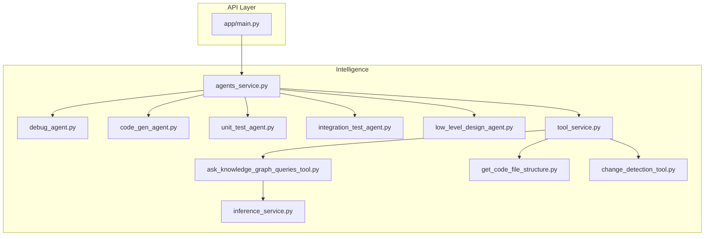
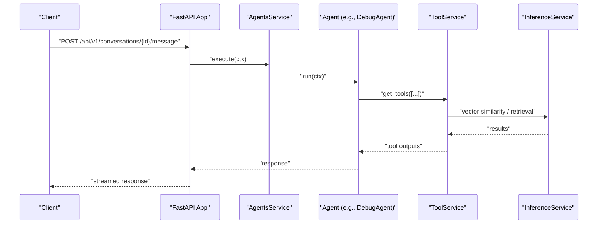
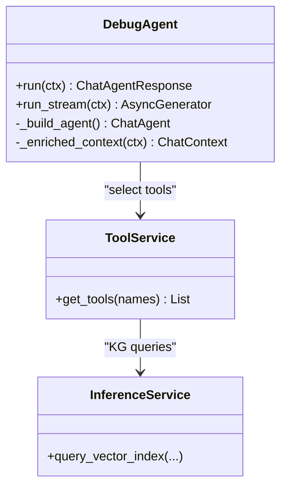
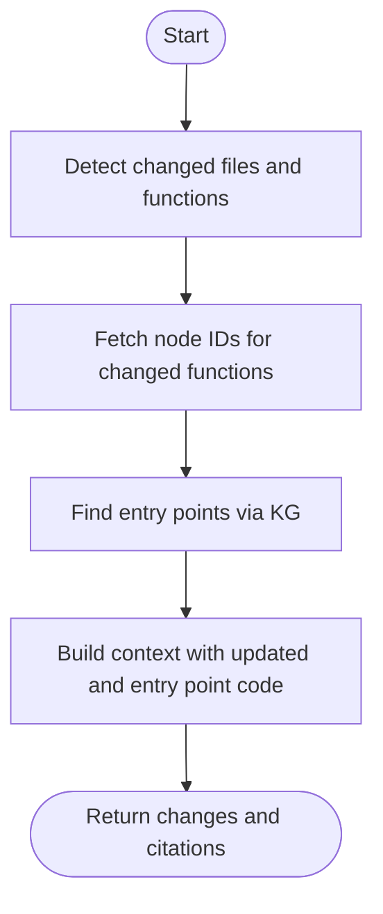
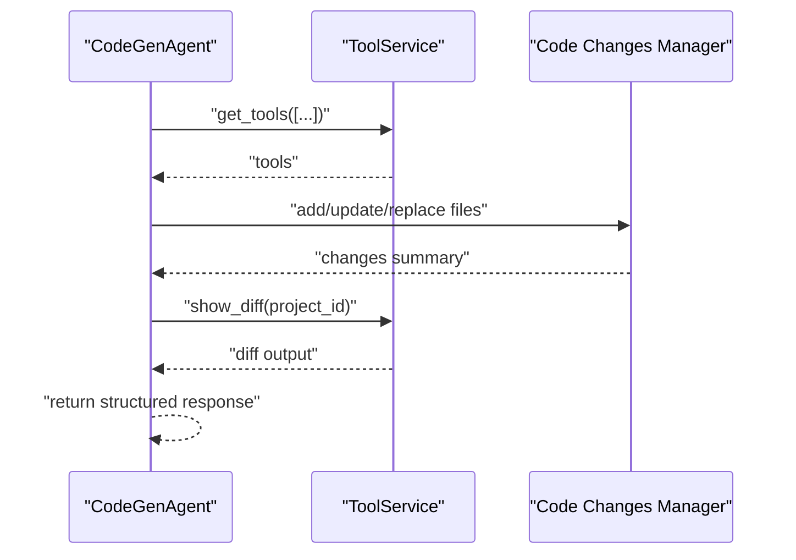
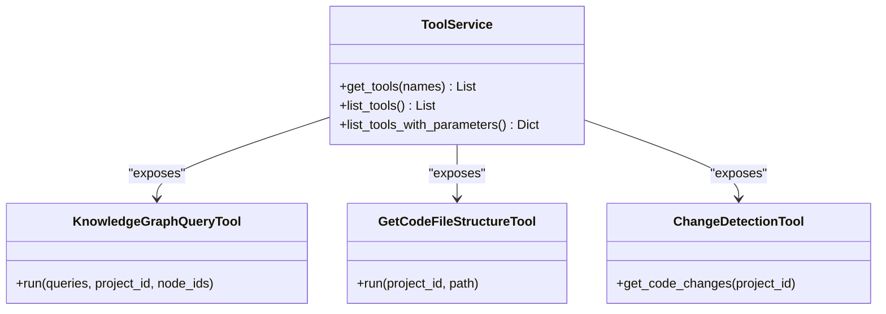
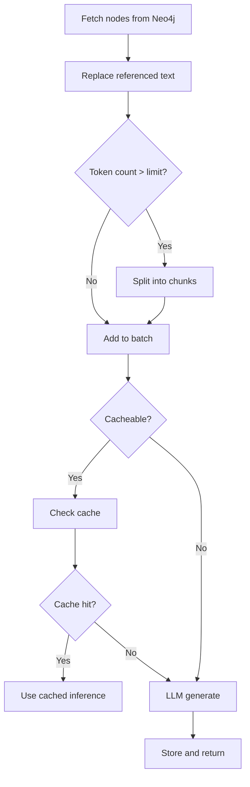
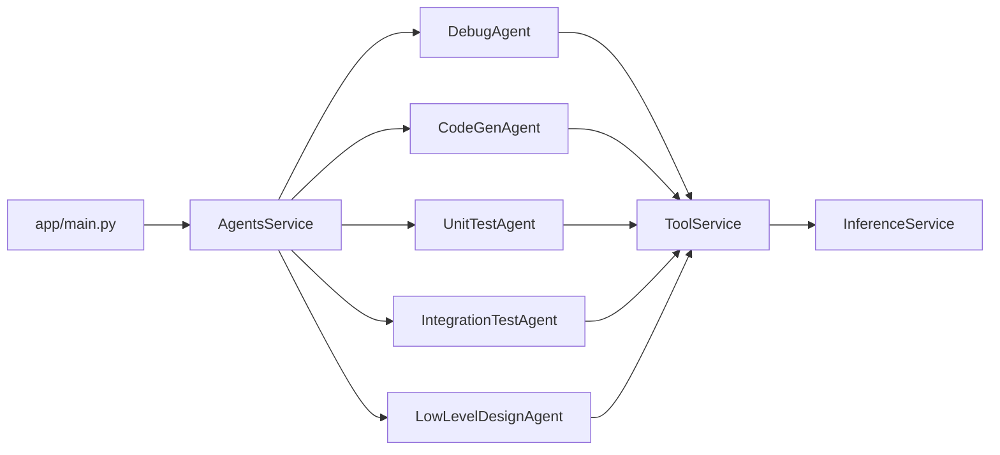

# Key Features and Capabilities

<cite>
**Referenced Files in This Document**
- [README.md](file://README.md)
- [GETTING_STARTED.md](file://GETTING_STARTED.md)
- [app/main.py](file://app/main.py)
- [app/modules/intelligence/agents/agents_service.py](file://app/modules/intelligence/agents/agents_service.py)
- [app/modules/intelligence/agents/chat_agents/system_agents/debug_agent.py](file://app/modules/intelligence/agents/chat_agents/system_agents/debug_agent.py)
- [app/modules/intelligence/agents/chat_agents/system_agents/code_gen_agent.py](file://app/modules/intelligence/agents/chat_agents/system_agents/code_gen_agent.py)
- [app/modules/intelligence/agents/chat_agents/system_agents/unit_test_agent.py](file://app/modules/intelligence/agents/chat_agents/system_agents/unit_test_agent.py)
- [app/modules/intelligence/agents/chat_agents/system_agents/integration_test_agent.py](file://app/modules/intelligence/agents/chat_agents/system_agents/integration_test_agent.py)
- [app/modules/intelligence/agents/chat_agents/system_agents/low_level_design_agent.py](file://app/modules/intelligence/agents/chat_agents/system_agents/low_level_design_agent.py)
- [app/modules/intelligence/tools/tool_service.py](file://app/modules/intelligence/tools/tool_service.py)
- [app/modules/intelligence/tools/kg_based_tools/ask_knowledge_graph_queries_tool.py](file://app/modules/intelligence/tools/kg_based_tools/ask_knowledge_graph_queries_tool.py)
- [app/modules/intelligence/tools/code_query_tools/get_code_file_structure.py](file://app/modules/intelligence/tools/code_query_tools/get_code_file_structure.py)
- [app/modules/intelligence/tools/change_detection/change_detection_tool.py](file://app/modules/intelligence/tools/change_detection/change_detection_tool.py)
- [app/modules/parsing/knowledge_graph/inference_service.py](file://app/modules/parsing/knowledge_graph/inference_service.py)
</cite>

## Table of Contents
1. [Introduction](#introduction)
2. [Project Structure](#project-structure)
3. [Core Components](#core-components)
4. [Architecture Overview](#architecture-overview)
5. [Detailed Component Analysis](#detailed-component-analysis)
6. [Dependency Analysis](#dependency-analysis)
7. [Performance Considerations](#performance-considerations)
8. [Troubleshooting Guide](#troubleshooting-guide)
9. [Conclusion](#conclusion)

## Introduction
This document presents Potpie’s key features and capabilities as implemented in the codebase. It focuses on:
- The pre-built agent system for debugging, codebase Q&A, code changes analysis, integration testing, unit testing, low-level design, and code generation.
- The tooling system for knowledge graph queries, code retrieval, change detection, and file structure analysis.
- Custom agent creation, integrations with VSCode and Slack, and the knowledge graph construction process.
- Practical examples, use cases, and integration patterns, with concrete references to actual implementation files.

## Project Structure
Potpie is a FastAPI-based backend with modular intelligence subsystems:
- API entrypoint initializes routers for authentication, conversations, agents, tools, providers, and integrations.
- Intelligence modules include agents, tools, prompts, providers, and knowledge graph services.
- Parsing and knowledge graph construction feed the agent tools with structured code context.

**Diagram sources**
- [app/main.py](file://app/main.py#L147-L171)
- [app/modules/intelligence/agents/agents_service.py](file://app/modules/intelligence/agents/agents_service.py#L47-L149)
- [app/modules/intelligence/tools/tool_service.py](file://app/modules/intelligence/tools/tool_service.py#L99-L242)
- [app/modules/intelligence/tools/kg_based_tools/ask_knowledge_graph_queries_tool.py](file://app/modules/intelligence/tools/kg_based_tools/ask_knowledge_graph_queries_tool.py#L31-L142)
- [app/modules/intelligence/tools/code_query_tools/get_code_file_structure.py](file://app/modules/intelligence/tools/code_query_tools/get_code_file_structure.py#L23-L94)
- [app/modules/intelligence/tools/change_detection/change_detection_tool.py](file://app/modules/intelligence/tools/change_detection/change_detection_tool.py#L50-L800)
- [app/modules/parsing/knowledge_graph/inference_service.py](file://app/modules/parsing/knowledge_graph/inference_service.py#L45-L800)

**Section sources**
- [app/main.py](file://app/main.py#L147-L171)

## Core Components
- Pre-built agents: Q&A, Debugging, Unit Test, Integration Test, Low-Level Design, Code Changes, Code Generation, General Purpose, SWEB Debug.
- Tooling system: Knowledge graph queries, node retrieval, graph traversal, change detection, file structure, and more.
- Knowledge graph: Inference service builds and serves vectorized code semantics for semantic search and retrieval.

**Section sources**
- [README.md](file://README.md#L94-L118)
- [app/modules/intelligence/agents/agents_service.py](file://app/modules/intelligence/agents/agents_service.py#L74-L149)
- [app/modules/intelligence/tools/tool_service.py](file://app/modules/intelligence/tools/tool_service.py#L134-L242)

## Architecture Overview
The system orchestrates agents that use tools backed by a knowledge graph. Agents are registered centrally and executed through a supervisor. Tools are dynamically assembled per agent and include retrieval, change detection, and project integration helpers.

**Diagram sources**
- [app/main.py](file://app/main.py#L147-L171)
- [app/modules/intelligence/agents/agents_service.py](file://app/modules/intelligence/agents/agents_service.py#L151-L156)
- [app/modules/intelligence/tools/tool_service.py](file://app/modules/intelligence/tools/tool_service.py#L126-L132)
- [app/modules/parsing/knowledge_graph/inference_service.py](file://app/modules/parsing/knowledge_graph/inference_service.py#L741-L800)

## Detailed Component Analysis

### Pre-built Agent System

#### Debugging Agent
- Purpose: Systematic debugging with conversational and methodical modes; uses a multi-agent delegation strategy when supported.
- Tools: Knowledge graph queries, code retrieval, file structure, change detection, and todo/requirements tracking.
- Execution: Builds a Pydantic-based agent or multi-agent system depending on provider capabilities.

**Diagram sources**
- [app/modules/intelligence/agents/chat_agents/system_agents/debug_agent.py](file://app/modules/intelligence/agents/chat_agents/system_agents/debug_agent.py#L24-L143)
- [app/modules/intelligence/tools/tool_service.py](file://app/modules/intelligence/tools/tool_service.py#L126-L132)
- [app/modules/parsing/knowledge_graph/inference_service.py](file://app/modules/parsing/knowledge_graph/inference_service.py#L741-L800)

**Section sources**
- [README.md](file://README.md#L98-L98)
- [app/modules/intelligence/agents/chat_agents/system_agents/debug_agent.py](file://app/modules/intelligence/agents/chat_agents/system_agents/debug_agent.py#L35-L122)

#### Codebase Q&A Agent
- Purpose: Answer questions about the codebase using knowledge graph and code analysis tools.
- Tools: Probable node retrieval, graph traversal, file structure, web search, and code analysis.

**Section sources**
- [README.md](file://README.md#L99-L99)
- [app/modules/intelligence/agents/agents_service.py](file://app/modules/intelligence/agents/agents_service.py#L74-L80)

#### Code Changes Agent (Blast Radius)
- Purpose: Analyze current branch changes and compute blast radius; identify entry points and affected code.
- Tools: Change detection, node retrieval, graph traversal, and file structure.

**Diagram sources**
- [app/modules/intelligence/tools/change_detection/change_detection_tool.py](file://app/modules/intelligence/tools/change_detection/change_detection_tool.py#L358-L800)
- [app/modules/intelligence/tools/tool_service.py](file://app/modules/intelligence/tools/tool_service.py#L148-L152)

**Section sources**
- [README.md](file://README.md#L100-L100)
- [app/modules/intelligence/agents/chat_agents/system_agents/blast_radius_agent.py](file://app/modules/intelligence/agents/chat_agents/system_agents/blast_radius_agent.py#L78-L91)

#### Integration Test Agent
- Purpose: Generate integration test plans and code for entry points and related components.
- Tools: Node graph retrieval, code analysis, and file fetching.

**Section sources**
- [README.md](file://README.md#L101-L101)
- [app/modules/intelligence/agents/chat_agents/system_agents/integration_test_agent.py](file://app/modules/intelligence/agents/chat_agents/system_agents/integration_test_agent.py#L21-L62)

#### Unit Test Agent
- Purpose: Create test plans and unit tests for specified functions or node IDs.
- Tools: Node retrieval, code analysis, and file fetching.

**Section sources**
- [README.md](file://README.md#L102-L102)
- [app/modules/intelligence/agents/chat_agents/system_agents/unit_test_agent.py](file://app/modules/intelligence/agents/chat_agents/system_agents/unit_test_agent.py#L14-L53)

#### Low-Level Design Agent
- Purpose: Create detailed low-level designs for new features using codebase context and web search.
- Tools: Knowledge graph queries, file structure, web search, and code analysis.

**Section sources**
- [README.md](file://README.md#L103-L103)
- [app/modules/intelligence/agents/chat_agents/system_agents/low_level_design_agent.py](file://app/modules/intelligence/agents/chat_agents/system_agents/low_level_design_agent.py#L34-L87)

#### Code Generation Agent
- Purpose: Generate production-ready code changes with comprehensive dependency analysis and diff display.
- Tools: Node retrieval, graph traversal, file structure, code analysis, and code changes manager.

**Diagram sources**
- [app/modules/intelligence/agents/chat_agents/system_agents/code_gen_agent.py](file://app/modules/intelligence/agents/chat_agents/system_agents/code_gen_agent.py#L26-L172)
- [app/modules/intelligence/tools/tool_service.py](file://app/modules/intelligence/tools/tool_service.py#L204-L212)

**Section sources**
- [README.md](file://README.md#L104-L104)
- [app/modules/intelligence/agents/chat_agents/system_agents/code_gen_agent.py](file://app/modules/intelligence/agents/chat_agents/system_agents/code_gen_agent.py#L26-L172)

### Tooling System
- Knowledge graph queries: Natural language questions with optional node scoping.
- Code retrieval: Probable node name, node ID, multiple node IDs, and graph extraction.
- Change detection: Git diff-based change analysis with entry point discovery.
- File structure: Hierarchical repository structure retrieval with truncation safeguards.
- Additional tools: Web search, webpage extractor, project integration helpers, todo and requirement verification, and code changes management.

**Diagram sources**
- [app/modules/intelligence/tools/tool_service.py](file://app/modules/intelligence/tools/tool_service.py#L99-L242)
- [app/modules/intelligence/tools/kg_based_tools/ask_knowledge_graph_queries_tool.py](file://app/modules/intelligence/tools/kg_based_tools/ask_knowledge_graph_queries_tool.py#L31-L142)
- [app/modules/intelligence/tools/code_query_tools/get_code_file_structure.py](file://app/modules/intelligence/tools/code_query_tools/get_code_file_structure.py#L23-L94)
- [app/modules/intelligence/tools/change_detection/change_detection_tool.py](file://app/modules/intelligence/tools/change_detection/change_detection_tool.py#L50-L800)

**Section sources**
- [README.md](file://README.md#L106-L118)
- [app/modules/intelligence/tools/tool_service.py](file://app/modules/intelligence/tools/tool_service.py#L134-L242)

### Knowledge Graph Construction and Inference
- InferenceService loads a sentence transformer model once, batches nodes, caches reusable inferences, splits large nodes into chunks, and consolidates chunk responses.
- It exposes vector index queries and entry point analysis to support agent reasoning and retrieval.

**Diagram sources**
- [app/modules/parsing/knowledge_graph/inference_service.py](file://app/modules/parsing/knowledge_graph/inference_service.py#L35-L800)

**Section sources**
- [app/modules/parsing/knowledge_graph/inference_service.py](file://app/modules/parsing/knowledge_graph/inference_service.py#L45-L800)

### Custom Agent Creation
- System instructions, agent metadata, tasks, and tools define custom agents.
- Tools are initialized in the tool service and attached to agents as needed.

**Section sources**
- [README.md](file://README.md#L398-L431)
- [app/modules/intelligence/tools/tool_service.py](file://app/modules/intelligence/tools/tool_service.py#L134-L242)

### Integrations: VSCode and Slack
- VSCode extension: Direct access to agents within the editor.
- Slack integration: Team collaboration via Potpie app in Slack.

**Section sources**
- [README.md](file://README.md#L76-L93)

## Dependency Analysis
- Agents depend on ToolService to assemble tools per task.
- Tools depend on InferenceService for knowledge graph queries and on project services for repository access.
- API entrypoint wires routers for agents, tools, providers, and integrations.

**Diagram sources**
- [app/main.py](file://app/main.py#L147-L171)
- [app/modules/intelligence/agents/agents_service.py](file://app/modules/intelligence/agents/agents_service.py#L47-L149)
- [app/modules/intelligence/tools/tool_service.py](file://app/modules/intelligence/tools/tool_service.py#L99-L242)
- [app/modules/parsing/knowledge_graph/inference_service.py](file://app/modules/parsing/knowledge_graph/inference_service.py#L45-L800)

**Section sources**
- [app/main.py](file://app/main.py#L147-L171)
- [app/modules/intelligence/agents/agents_service.py](file://app/modules/intelligence/agents/agents_service.py#L47-L149)

## Performance Considerations
- Token-aware batching and chunking of large nodes to fit model limits.
- Caching of reusable inferences to reduce LLM calls.
- Parallel request throttling for concurrent processing.
- Response truncation for large file structures to avoid overwhelming LLM context.

[No sources needed since this section provides general guidance]

## Troubleshooting Guide
- Health check endpoint for service readiness.
- Logging middleware and structured logging for request context.
- Sentry integration for production error tracking.
- Phoenix tracing for local LLM and agent operation monitoring.

**Section sources**
- [app/main.py](file://app/main.py#L173-L183)
- [app/main.py](file://app/main.py#L116-L129)
- [app/main.py](file://app/main.py#L64-L87)
- [GETTING_STARTED.md](file://GETTING_STARTED.md#L278-L284)

## Conclusion
Potpie’s pre-built agents and tooling system provide a cohesive platform for codebase understanding, debugging, testing, and generation. The knowledge graph underpins semantic search and retrieval, while the tooling system supplies reliable, composable primitives. Custom agents and integrations further extend the platform to diverse workflows and environments.