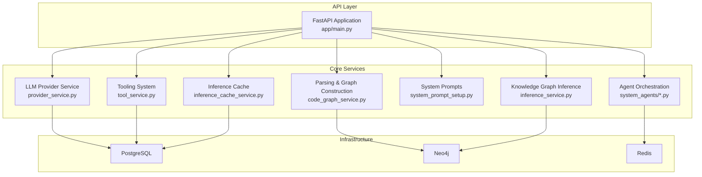
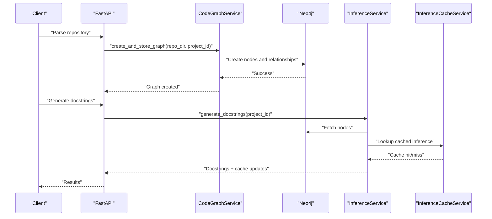
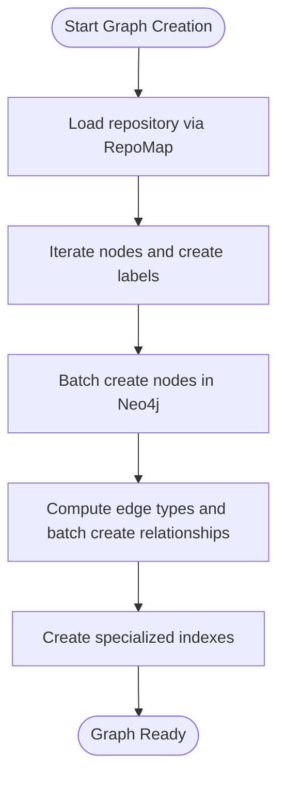
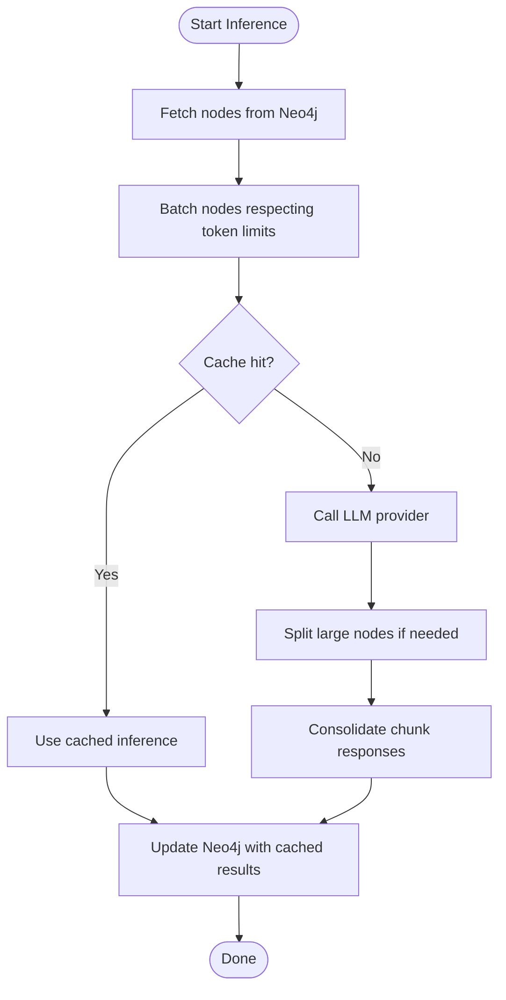
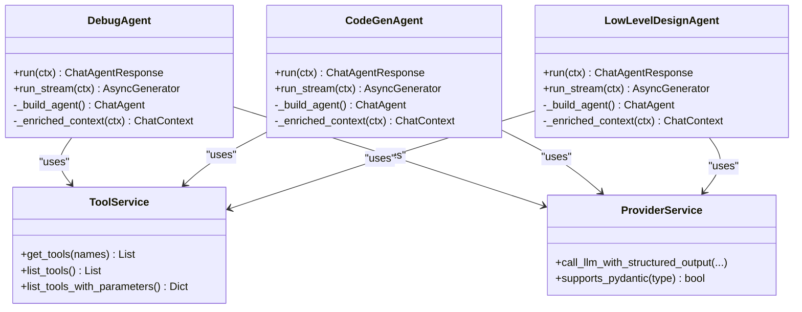
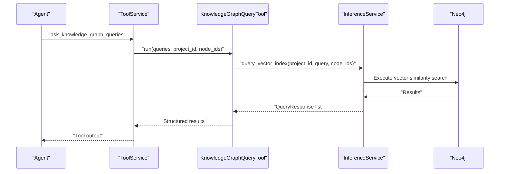
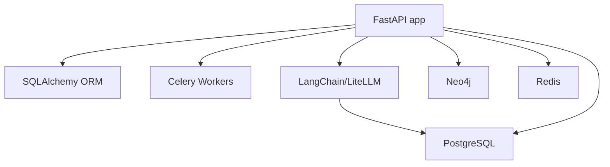

# Project Overview

<cite>
**Referenced Files in This Document**
- [README.md](file://README.md)
- [GETTING_STARTED.md](file://GETTING_STARTED.md)
- [app/main.py](file://app/main.py)
- [requirements.txt](file://requirements.txt)
- [docker-compose.yaml](file://docker-compose.yaml)
- [app/modules/parsing/graph_construction/code_graph_service.py](file://app/modules/parsing/graph_construction/code_graph_service.py)
- [app/modules/parsing/knowledge_graph/inference_service.py](file://app/modules/parsing/knowledge_graph/inference_service.py)
- [app/modules/intelligence/tools/kg_based_tools/ask_knowledge_graph_queries_tool.py](file://app/modules/intelligence/tools/kg_based_tools/ask_knowledge_graph_queries_tool.py)
- [app/modules/intelligence/agents/chat_agents/system_agents/debug_agent.py](file://app/modules/intelligence/agents/chat_agents/system_agents/debug_agent.py)
- [app/modules/intelligence/agents/chat_agents/system_agents/code_gen_agent.py](file://app/modules/intelligence/agents/chat_agents/system_agents/code_gen_agent.py)
- [app/modules/intelligence/agents/chat_agents/system_agents/low_level_design_agent.py](file://app/modules/intelligence/agents/chat_agents/system_agents/low_level_design_agent.py)
- [app/modules/intelligence/provider/provider_service.py](file://app/modules/intelligence/provider/provider_service.py)
- [app/modules/intelligence/tools/tool_service.py](file://app/modules/intelligence/tools/tool_service.py)
- [app/modules/intelligence/prompts/system_prompt_setup.py](file://app/modules/intelligence/prompts/system_prompt_setup.py)
- [app/modules/parsing/services/inference_cache_service.py](file://app/modules/parsing/services/inference_cache_service.py)
</cite>

## Table of Contents
1. [Introduction](#introduction)
2. [Project Structure](#project-structure)
3. [Core Components](#core-components)
4. [Architecture Overview](#architecture-overview)
5. [Detailed Component Analysis](#detailed-component-analysis)
6. [Dependency Analysis](#dependency-analysis)
7. [Performance Considerations](#performance-considerations)
8. [Troubleshooting Guide](#troubleshooting-guide)
9. [Conclusion](#conclusion)

## Introduction
Potpie is an open-source AI-powered code intelligence platform that builds specialized AI agents trained on your codebase. By constructing a comprehensive knowledge graph of your code, Potpie enables automated code analysis, testing, debugging, and development assistance. Its agents understand complex relationships within your codebase to help with onboarding, feature development, low-level design, debugging, and more.

Key value propositions:
- Deep code understanding through a built-in knowledge graph
- Pre-built and custom agents for common and specialized tasks
- Seamless integration with development workflows and platforms
- Flexible support for codebases of any size or language

## Project Structure
Potpie is organized as a FastAPI application with modular components for parsing, knowledge graph construction, agent orchestration, tooling, and integrations. The backend leverages Neo4j for graph storage, Redis for messaging and caching, PostgreSQL for relational data, and LangChain-compatible LLM providers for reasoning.

**Diagram sources**
- [app/main.py](file://app/main.py#L147-L172)
- [app/modules/parsing/graph_construction/code_graph_service.py](file://app/modules/parsing/graph_construction/code_graph_service.py#L15-L36)
- [app/modules/parsing/knowledge_graph/inference_service.py](file://app/modules/parsing/knowledge_graph/inference_service.py#L45-L61)
- [app/modules/intelligence/agents/chat_agents/system_agents/debug_agent.py](file://app/modules/intelligence/agents/chat_agents/system_agents/debug_agent.py#L24-L56)
- [app/modules/intelligence/tools/tool_service.py](file://app/modules/intelligence/tools/tool_service.py#L99-L125)
- [app/modules/intelligence/prompts/system_prompt_setup.py](file://app/modules/intelligence/prompts/system_prompt_setup.py#L11-L15)
- [app/modules/intelligence/provider/provider_service.py](file://app/modules/intelligence/provider/provider_service.py#L472-L497)
- [app/modules/parsing/services/inference_cache_service.py](file://app/modules/parsing/services/inference_cache_service.py#L10-L13)
- [docker-compose.yaml](file://docker-compose.yaml#L1-L57)

**Section sources**
- [app/main.py](file://app/main.py#L147-L172)
- [docker-compose.yaml](file://docker-compose.yaml#L1-L57)

## Core Components
- FastAPI application with modular routers for authentication, conversations, agents, tools, providers, and integrations
- Knowledge graph construction pipeline that parses repositories and stores nodes/relationships in Neo4j
- Inference service that generates docstrings, manages batching, and caches results
- Agent ecosystem with pre-built system agents for debugging, code generation, low-level design, and more
- Tooling system exposing structured tools for code queries, knowledge graph interactions, and external integrations
- LLM provider abstraction supporting multiple providers via LiteLLM and Pydantic-ai
- Persistent caching for inference results and project-specific search indices

**Section sources**
- [app/main.py](file://app/main.py#L147-L172)
- [app/modules/parsing/graph_construction/code_graph_service.py](file://app/modules/parsing/graph_construction/code_graph_service.py#L15-L36)
- [app/modules/parsing/knowledge_graph/inference_service.py](file://app/modules/parsing/knowledge_graph/inference_service.py#L45-L61)
- [app/modules/intelligence/agents/chat_agents/system_agents/debug_agent.py](file://app/modules/intelligence/agents/chat_agents/system_agents/debug_agent.py#L24-L56)
- [app/modules/intelligence/tools/tool_service.py](file://app/modules/intelligence/tools/tool_service.py#L99-L125)
- [app/modules/intelligence/provider/provider_service.py](file://app/modules/intelligence/provider/provider_service.py#L472-L497)
- [app/modules/parsing/services/inference_cache_service.py](file://app/modules/parsing/services/inference_cache_service.py#L10-L13)

## Architecture Overview
Potpie’s architecture centers around a FastAPI backend that orchestrates parsing, graph construction, and agent interactions. The knowledge graph is persisted in Neo4j, while relational data and caches live in PostgreSQL and Redis. Agents leverage LangChain-compatible LLM providers for reasoning and can call tools to query the knowledge graph or interact with external systems.

**Diagram sources**
- [app/modules/parsing/graph_construction/code_graph_service.py](file://app/modules/parsing/graph_construction/code_graph_service.py#L37-L165)
- [app/modules/parsing/knowledge_graph/inference_service.py](file://app/modules/parsing/knowledge_graph/inference_service.py#L741-L800)
- [app/modules/parsing/services/inference_cache_service.py](file://app/modules/parsing/services/inference_cache_service.py#L14-L50)

## Detailed Component Analysis

### Knowledge Graph Construction
The graph construction service parses repositories and creates nodes representing files, classes, functions, and interfaces, along with relationships indicating references and calls. It writes to Neo4j and indexes nodes for efficient querying.

**Diagram sources**
- [app/modules/parsing/graph_construction/code_graph_service.py](file://app/modules/parsing/graph_construction/code_graph_service.py#L37-L165)

**Section sources**
- [app/modules/parsing/graph_construction/code_graph_service.py](file://app/modules/parsing/graph_construction/code_graph_service.py#L15-L36)
- [app/modules/parsing/graph_construction/code_graph_service.py](file://app/modules/parsing/graph_construction/code_graph_service.py#L37-L165)

### Knowledge Graph Inference
The inference service queries the knowledge graph, batches nodes for LLM processing, resolves references, and consolidates chunked responses. It integrates with the LLM provider service and maintains an inference cache.

**Diagram sources**
- [app/modules/parsing/knowledge_graph/inference_service.py](file://app/modules/parsing/knowledge_graph/inference_service.py#L741-L800)
- [app/modules/parsing/services/inference_cache_service.py](file://app/modules/parsing/services/inference_cache_service.py#L14-L50)

**Section sources**
- [app/modules/parsing/knowledge_graph/inference_service.py](file://app/modules/parsing/knowledge_graph/inference_service.py#L45-L61)
- [app/modules/parsing/knowledge_graph/inference_service.py](file://app/modules/parsing/knowledge_graph/inference_service.py#L352-L587)
- [app/modules/parsing/services/inference_cache_service.py](file://app/modules/parsing/services/inference_cache_service.py#L10-L13)

### Agent Ecosystem
Potpie ships with system agents for debugging, code generation, low-level design, unit/integration testing, and more. Agents use structured prompts and tools to navigate the knowledge graph and perform tasks.

**Diagram sources**
- [app/modules/intelligence/agents/chat_agents/system_agents/debug_agent.py](file://app/modules/intelligence/agents/chat_agents/system_agents/debug_agent.py#L24-L123)
- [app/modules/intelligence/agents/chat_agents/system_agents/code_gen_agent.py](file://app/modules/intelligence/agents/chat_agents/system_agents/code_gen_agent.py#L26-L153)
- [app/modules/intelligence/agents/chat_agents/system_agents/low_level_design_agent.py](file://app/modules/intelligence/agents/chat_agents/system_agents/low_level_design_agent.py#L24-L112)
- [app/modules/intelligence/tools/tool_service.py](file://app/modules/intelligence/tools/tool_service.py#L99-L125)
- [app/modules/intelligence/provider/provider_service.py](file://app/modules/intelligence/provider/provider_service.py#L790-L794)

**Section sources**
- [app/modules/intelligence/agents/chat_agents/system_agents/debug_agent.py](file://app/modules/intelligence/agents/chat_agents/system_agents/debug_agent.py#L24-L123)
- [app/modules/intelligence/agents/chat_agents/system_agents/code_gen_agent.py](file://app/modules/intelligence/agents/chat_agents/system_agents/code_gen_agent.py#L26-L153)
- [app/modules/intelligence/agents/chat_agents/system_agents/low_level_design_agent.py](file://app/modules/intelligence/agents/chat_agents/system_agents/low_level_design_agent.py#L24-L112)
- [app/modules/intelligence/tools/tool_service.py](file://app/modules/intelligence/tools/tool_service.py#L126-L133)
- [app/modules/intelligence/provider/provider_service.py](file://app/modules/intelligence/provider/provider_service.py#L790-L794)

### Tooling System
The tooling system exposes structured tools for querying the knowledge graph, fetching code, analyzing structure, managing code changes, and integrating with external systems like Jira, Linear, and Confluence.

**Diagram sources**
- [app/modules/intelligence/tools/tool_service.py](file://app/modules/intelligence/tools/tool_service.py#L134-L194)
- [app/modules/intelligence/tools/kg_based_tools/ask_knowledge_graph_queries_tool.py](file://app/modules/intelligence/tools/kg_based_tools/ask_knowledge_graph_queries_tool.py#L57-L82)
- [app/modules/parsing/knowledge_graph/inference_service.py](file://app/modules/parsing/knowledge_graph/inference_service.py#L741-L800)

**Section sources**
- [app/modules/intelligence/tools/tool_service.py](file://app/modules/intelligence/tools/tool_service.py#L99-L125)
- [app/modules/intelligence/tools/kg_based_tools/ask_knowledge_graph_queries_tool.py](file://app/modules/intelligence/tools/kg_based_tools/ask_knowledge_graph_queries_tool.py#L31-L51)

### System Prompts and Configuration
System prompts define agent behavior and conversation context. The system initializes default prompts for agents and manages prompt stages and mappings.

**Section sources**
- [app/modules/intelligence/prompts/system_prompt_setup.py](file://app/modules/intelligence/prompts/system_prompt_setup.py#L11-L15)
- [app/modules/intelligence/prompts/system_prompt_setup.py](file://app/modules/intelligence/prompts/system_prompt_setup.py#L16-L433)

## Dependency Analysis
Potpie integrates multiple technologies for a cohesive AI code intelligence platform. The FastAPI application depends on SQLAlchemy for ORM, Celery for async tasks, and LangChain-compatible providers for LLM interactions. Infrastructure dependencies include Neo4j for graph storage, Redis for messaging, and PostgreSQL for persistence.

**Diagram sources**
- [requirements.txt](file://requirements.txt#L55-L217)
- [docker-compose.yaml](file://docker-compose.yaml#L1-L57)
- [app/main.py](file://app/main.py#L147-L172)

**Section sources**
- [requirements.txt](file://requirements.txt#L1-L279)
- [docker-compose.yaml](file://docker-compose.yaml#L1-L57)

## Performance Considerations
- Knowledge graph batching and chunking reduce LLM token usage and improve throughput
- Inference caching minimizes redundant LLM calls and accelerates responses
- Vector similarity search and Neo4j indexing optimize query performance
- Parallel request handling and semaphores control concurrency for agent operations

[No sources needed since this section provides general guidance]

## Troubleshooting Guide
Common setup and operational issues:
- Health checks and startup events ensure database initialization and system prompt setup
- LLM provider service includes robust retry logic and error handling for rate limits and overloads
- Phoenix tracing can be enabled for local development to observe LLM traces
- Docker Compose services for PostgreSQL, Neo4j, and Redis must be healthy and reachable

**Section sources**
- [app/main.py](file://app/main.py#L173-L211)
- [app/modules/intelligence/provider/provider_service.py](file://app/modules/intelligence/provider/provider_service.py#L116-L203)
- [README.md](file://README.md#L278-L284)
- [docker-compose.yaml](file://docker-compose.yaml#L15-L19)

## Conclusion
Potpie delivers a powerful, extensible platform for AI-driven code intelligence. By combining a knowledge graph with flexible agents and tools, it accelerates development workflows, improves code understanding, and automates routine tasks. The modular architecture, robust infrastructure, and comprehensive tooling make it suitable for teams seeking to integrate AI-assisted development at scale.