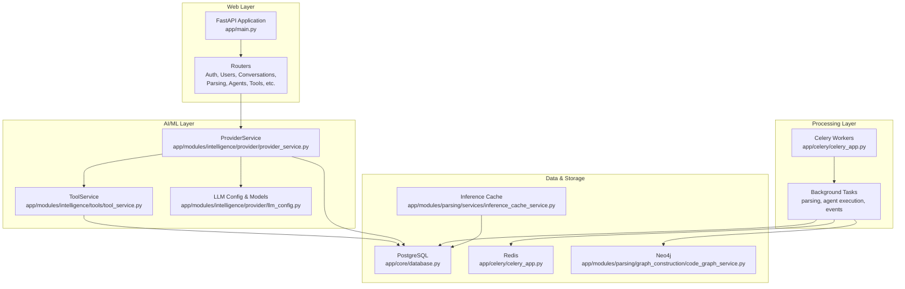
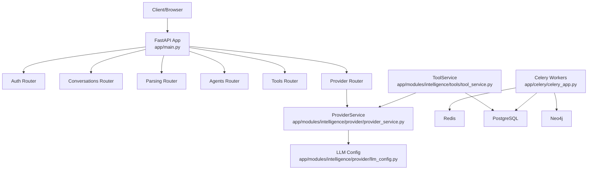
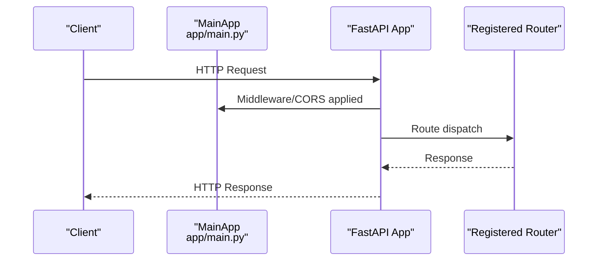
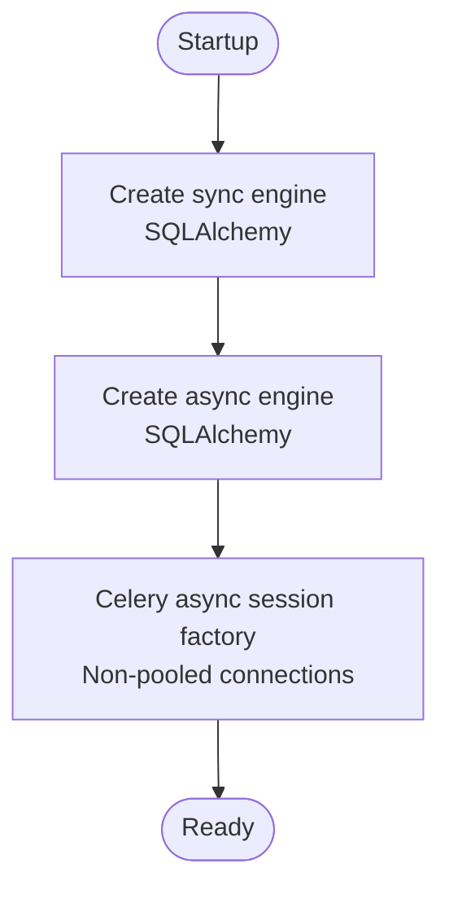
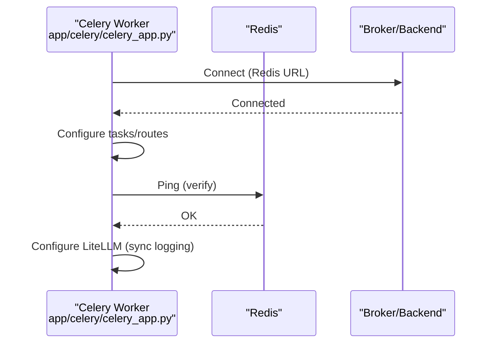
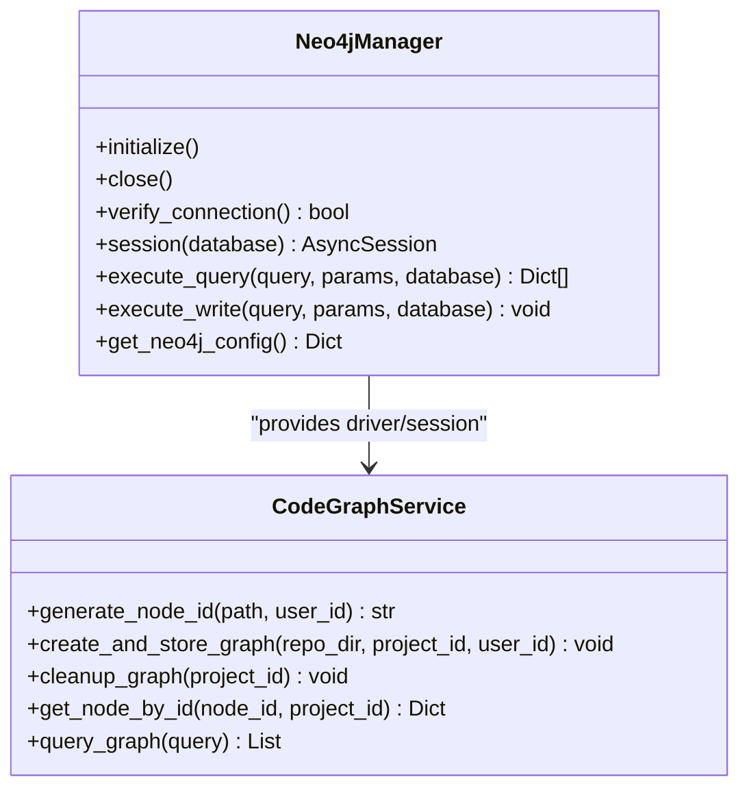
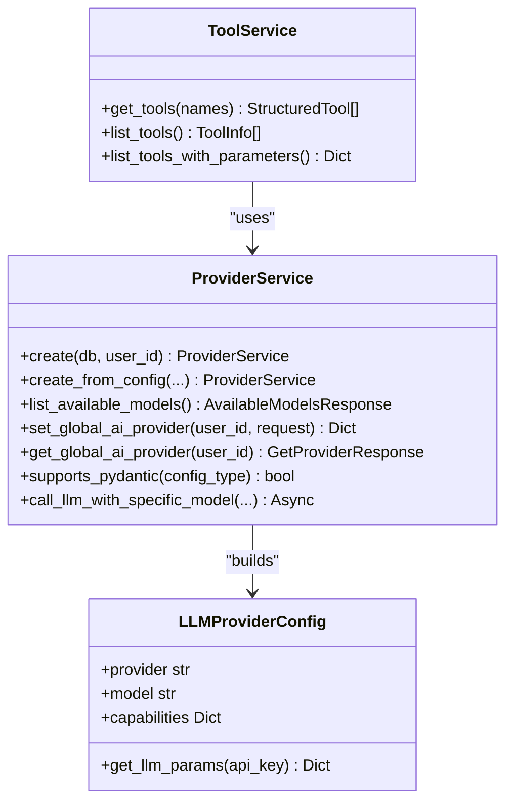
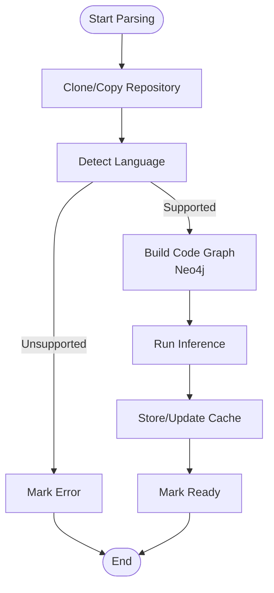
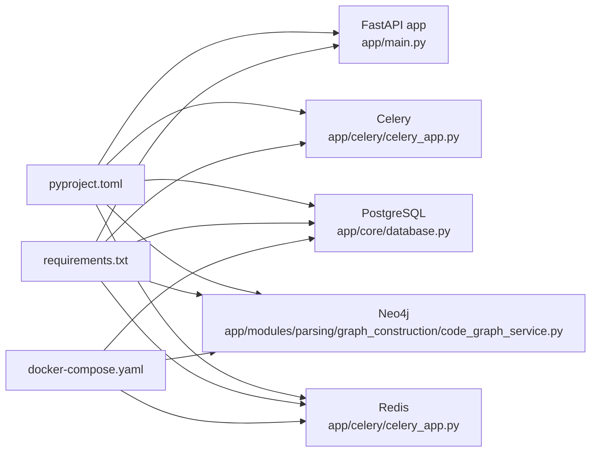

# Technology Stack Overview

<cite>
**Referenced Files in This Document**
- [pyproject.toml](file://pyproject.toml)
- [requirements.txt](file://requirements.txt)
- [docker-compose.yaml](file://docker-compose.yaml)
- [app/main.py](file://app/main.py)
- [app/celery/celery_app.py](file://app/celery/celery_app.py)
- [app/core/database.py](file://app/core/database.py)
- [app/modules/parsing/graph_construction/code_graph_service.py](file://app/modules/parsing/graph_construction/code_graph_service.py)
- [app/modules/intelligence/provider/provider_service.py](file://app/modules/intelligence/provider/provider_service.py)
- [app/modules/intelligence/provider/llm_config.py](file://app/modules/intelligence/provider/llm_config.py)
- [app/modules/intelligence/tools/tool_service.py](file://app/modules/intelligence/tools/tool_service.py)
- [app/modules/parsing/services/inference_cache_service.py](file://app/modules/parsing/services/inference_cache_service.py)
- [app/modules/parsing/graph_construction/parsing_service.py](file://app/modules/parsing/graph_construction/parsing_service.py)
- [potpie/core/redis.py](file://potpie/core/redis.py)
- [potpie/core/neo4j.py](file://potpie/core/neo4j.py)
</cite>

## Table of Contents
1. [Introduction](#introduction)
2. [Project Structure](#project-structure)
3. [Core Components](#core-components)
4. [Architecture Overview](#architecture-overview)
5. [Detailed Component Analysis](#detailed-component-analysis)
6. [Dependency Analysis](#dependency-analysis)
7. [Performance Considerations](#performance-considerations)
8. [Troubleshooting Guide](#troubleshooting-guide)
9. [Conclusion](#conclusion)

## Introduction
This document presents the Potpie technology stack overview, detailing the core technologies, frameworks, and libraries powering the platform. It explains the web framework (FastAPI), AI/LLM orchestration (LangChain/LangGraph), graph database (Neo4j), caching/streaming (Redis), relational data (PostgreSQL), and background processing (Celery). It also covers the AI/ML stack including multiple LLM providers (OpenAI, Anthropic, LiteLLM), Tree-Sitter for language parsing, and related dependencies. The document provides version requirements, integration patterns, and architectural rationale for technology choices, with examples of how technologies collaborate across the system.

## Project Structure
The repository organizes functionality by feature domains and core infrastructure:
- Web API and routing: FastAPI application entry and modular routers
- Intelligence and agents: LLM orchestration, tools, prompts, and tracing
- Parsing and knowledge graph: Repository parsing, graph construction, and inference caching
- Infrastructure: Databases, caching, and background workers
- Core services: Redis and Neo4j managers for optional runtime features

**Diagram sources**
- [app/main.py](file://app/main.py#L147-L171)
- [app/modules/intelligence/provider/provider_service.py](file://app/modules/intelligence/provider/provider_service.py#L472-L580)
- [app/modules/intelligence/tools/tool_service.py](file://app/modules/intelligence/tools/tool_service.py#L99-L124)
- [app/modules/intelligence/provider/llm_config.py](file://app/modules/intelligence/provider/llm_config.py#L1-L359)
- [app/celery/celery_app.py](file://app/celery/celery_app.py#L67-L129)
- [app/core/database.py](file://app/core/database.py#L13-L52)
- [app/modules/parsing/graph_construction/code_graph_service.py](file://app/modules/parsing/graph_construction/code_graph_service.py#L15-L36)
- [app/modules/parsing/services/inference_cache_service.py](file://app/modules/parsing/services/inference_cache_service.py#L10-L149)

**Section sources**
- [app/main.py](file://app/main.py#L147-L171)
- [docker-compose.yaml](file://docker-compose.yaml#L1-L57)

## Core Components
This section outlines the primary technologies and their roles in the system.

- FastAPI: Asynchronous web framework serving modular routers for authentication, users, conversations, parsing, agents, tools, and integrations. It initializes logging, CORS, Sentry, and Phoenix tracing, and registers routers with standardized prefixes and tags.
- PostgreSQL: Relational database with synchronous and asynchronous SQLAlchemy engines, connection pooling, and special handling for Celery workers to avoid cross-task Future binding issues.
- Redis: Caching and streaming backbone used by Celery workers and optional runtime features. It supports async operations and graceful degradation when unavailable.
- Neo4j: Graph database for knowledge graph construction and retrieval, integrated via the Neo4j driver and APOC procedures.
- Celery: Distributed task queue for background processing, including parsing, agent execution, and event handling. It integrates with Redis as broker/backend and applies worker hardening for LiteLLM and async safety.
- LangChain/LangGraph: AI/LLM orchestration and agent workflows, enabling structured tool usage and multi-agent collaboration.
- LLM Providers: OpenAI, Anthropic, and others via LiteLLM abstraction, with configurable models, capabilities, and retry logic.
- Tree-Sitter: Language parsing for code graph construction, integrated with repository parsing and graph building.

**Section sources**
- [app/main.py](file://app/main.py#L46-L114)
- [app/core/database.py](file://app/core/database.py#L13-L52)
- [app/celery/celery_app.py](file://app/celery/celery_app.py#L23-L78)
- [app/modules/parsing/graph_construction/code_graph_service.py](file://app/modules/parsing/graph_construction/code_graph_service.py#L15-L36)
- [app/modules/intelligence/provider/provider_service.py](file://app/modules/intelligence/provider/provider_service.py#L472-L580)
- [app/modules/intelligence/provider/llm_config.py](file://app/modules/intelligence/provider/llm_config.py#L1-L359)
- [pyproject.toml](file://pyproject.toml#L7-L89)

## Architecture Overview
The system follows a layered architecture:
- Web/API layer: FastAPI exposes REST endpoints and integrates middleware for logging, CORS, and tracing.
- Intelligence layer: ProviderService and ToolService coordinate LLM interactions and tool execution, backed by LangChain/LangGraph.
- Processing layer: Celery workers execute long-running tasks asynchronously, interacting with Redis, PostgreSQL, and Neo4j.
- Data layer: PostgreSQL stores relational data, Redis caches and streams, and Neo4j maintains the knowledge graph.

**Diagram sources**
- [app/main.py](file://app/main.py#L147-L171)
- [app/modules/intelligence/provider/provider_service.py](file://app/modules/intelligence/provider/provider_service.py#L472-L580)
- [app/modules/intelligence/tools/tool_service.py](file://app/modules/intelligence/tools/tool_service.py#L99-L124)
- [app/modules/intelligence/provider/llm_config.py](file://app/modules/intelligence/provider/llm_config.py#L1-L359)
- [app/celery/celery_app.py](file://app/celery/celery_app.py#L67-L129)

## Detailed Component Analysis

### FastAPI Application and Routers
- Initializes environment, Sentry, Phoenix tracing, CORS, logging middleware, and registers modular routers for authentication, users, parsing, conversations, agents, tools, usage, secret management, media, and integrations.
- Adds a health endpoint reporting version from Git.

**Diagram sources**
- [app/main.py](file://app/main.py#L101-L130)
- [app/main.py](file://app/main.py#L147-L171)

**Section sources**
- [app/main.py](file://app/main.py#L46-L114)
- [app/main.py](file://app/main.py#L173-L183)

### PostgreSQL and Async Sessions
- Synchronous engine with connection pooling and pre-ping for reliability.
- Asynchronous engine for modern async routes, with special handling for Celery workers to avoid Future binding issues.
- Dedicated factory for Celery tasks to create sessions with non-pooled connections.

**Diagram sources**
- [app/core/database.py](file://app/core/database.py#L13-L52)
- [app/core/database.py](file://app/core/database.py#L55-L92)

**Section sources**
- [app/core/database.py](file://app/core/database.py#L13-L52)
- [app/core/database.py](file://app/core/database.py#L55-L92)

### Redis Manager and Celery Integration
- Celery uses Redis as both broker and backend, with sanitized logging and connection verification.
- Worker configuration includes task routing, prefetch multiplier, time limits, and memory management.
- LiteLLM is configured synchronously in workers to avoid async handler issues.

**Diagram sources**
- [app/celery/celery_app.py](file://app/celery/celery_app.py#L23-L78)
- [app/celery/celery_app.py](file://app/celery/celery_app.py#L80-L129)
- [app/celery/celery_app.py](file://app/celery/celery_app.py#L150-L360)

**Section sources**
- [app/celery/celery_app.py](file://app/celery/celery_app.py#L23-L78)
- [app/celery/celery_app.py](file://app/celery/celery_app.py#L80-L129)
- [app/celery/celery_app.py](file://app/celery/celery_app.py#L150-L360)

### Neo4j Manager and Knowledge Graph
- Neo4jManager provides async driver/session management, connection verification, and query execution helpers.
- CodeGraphService constructs and indexes nodes/relationships for repositories, leveraging APOC procedures and batching.

**Diagram sources**
- [potpie/core/neo4j.py](file://potpie/core/neo4j.py#L19-L81)
- [app/modules/parsing/graph_construction/code_graph_service.py](file://app/modules/parsing/graph_construction/code_graph_service.py#L15-L36)

**Section sources**
- [potpie/core/neo4j.py](file://potpie/core/neo4j.py#L19-L81)
- [app/modules/parsing/graph_construction/code_graph_service.py](file://app/modules/parsing/graph_construction/code_graph_service.py#L15-L36)

### AI/ML Stack: Providers, Tools, and LLM Configuration
- ProviderService encapsulates LLM provider selection, API key resolution, retry/backoff logic, and tracing sanitation.
- ToolService aggregates tools for code queries, knowledge graph access, external systems (Jira, Linear, Confluence), and web search.
- LLMConfig defines model capabilities, provider mappings, and environment overrides.

**Diagram sources**
- [app/modules/intelligence/provider/provider_service.py](file://app/modules/intelligence/provider/provider_service.py#L472-L580)
- [app/modules/intelligence/tools/tool_service.py](file://app/modules/intelligence/tools/tool_service.py#L99-L124)
- [app/modules/intelligence/provider/llm_config.py](file://app/modules/intelligence/provider/llm_config.py#L217-L264)

**Section sources**
- [app/modules/intelligence/provider/provider_service.py](file://app/modules/intelligence/provider/provider_service.py#L472-L580)
- [app/modules/intelligence/tools/tool_service.py](file://app/modules/intelligence/tools/tool_service.py#L99-L124)
- [app/modules/intelligence/provider/llm_config.py](file://app/modules/intelligence/provider/llm_config.py#L1-L359)

### Parsing Pipeline and Inference Caching
- ParsingService orchestrates repository cloning, directory analysis, graph construction, and inference execution.
- InferenceCacheService provides global caching for inference results with content-hash lookups and metadata tracking.

**Diagram sources**
- [app/modules/parsing/graph_construction/parsing_service.py](file://app/modules/parsing/graph_construction/parsing_service.py#L102-L212)
- [app/modules/parsing/graph_construction/parsing_service.py](file://app/modules/parsing/graph_construction/parsing_service.py#L299-L385)
- [app/modules/parsing/services/inference_cache_service.py](file://app/modules/parsing/services/inference_cache_service.py#L10-L149)

**Section sources**
- [app/modules/parsing/graph_construction/parsing_service.py](file://app/modules/parsing/graph_construction/parsing_service.py#L102-L212)
- [app/modules/parsing/graph_construction/parsing_service.py](file://app/modules/parsing/graph_construction/parsing_service.py#L299-L385)
- [app/modules/parsing/services/inference_cache_service.py](file://app/modules/parsing/services/inference_cache_service.py#L10-L149)

## Dependency Analysis
The technology stack is defined primarily in project configuration files and orchestrated at runtime.

- Version requirements and dependencies are declared in project configuration files, covering FastAPI, LangChain/LangGraph, Neo4j, Redis, PostgreSQL, Celery, and AI/ML libraries.
- Docker Compose provisions PostgreSQL, Neo4j, and Redis containers with health checks and persistent volumes.
- Runtime integration patterns:
  - FastAPI registers routers and middleware, initializes tracing and error reporting.
  - Celery connects to Redis and configures task routing and worker hardening.
  - Neo4j and Redis managers provide optional runtime features with graceful failure handling.
  - PostgreSQL engines serve both sync and async routes with worker-specific factories.

**Diagram sources**
- [pyproject.toml](file://pyproject.toml#L7-L89)
- [requirements.txt](file://requirements.txt#L1-L279)
- [docker-compose.yaml](file://docker-compose.yaml#L1-L57)
- [app/main.py](file://app/main.py#L46-L114)
- [app/celery/celery_app.py](file://app/celery/celery_app.py#L23-L78)
- [app/core/database.py](file://app/core/database.py#L13-L52)
- [app/modules/parsing/graph_construction/code_graph_service.py](file://app/modules/parsing/graph_construction/code_graph_service.py#L15-L36)

**Section sources**
- [pyproject.toml](file://pyproject.toml#L7-L89)
- [requirements.txt](file://requirements.txt#L1-L279)
- [docker-compose.yaml](file://docker-compose.yaml#L1-L57)

## Performance Considerations
- PostgreSQL connection pooling and pre-ping improve reliability; Celery workers bypass pools to avoid Future binding issues.
- Celery worker memory limits and task restart policies mitigate memory leaks; prefetch multiplier and time limits balance throughput and latency.
- Neo4j batching and composite indexes optimize graph creation and query performance.
- LiteLLM synchronous logging in workers avoids async handler pitfalls and reduces overhead.
- Inference cache reduces repeated LLM calls for identical content.

[No sources needed since this section provides general guidance]

## Troubleshooting Guide
- Sentry and Phoenix tracing initialization failures are logged but non-fatal; verify environment variables and integrations.
- Redis connectivity verification logs and graceful degradation when unavailable; confirm URL and credentials.
- Celery worker memory configuration and shutdown cleanup help diagnose SIGKILL and async task warnings.
- Neo4j connection verification and session context management aid in diagnosing graph operations.
- PostgreSQL async engine configuration disables pre-ping in Celery to avoid event loop issues.

**Section sources**
- [app/main.py](file://app/main.py#L64-L88)
- [app/main.py](file://app/main.py#L89-L99)
- [potpie/core/redis.py](file://potpie/core/redis.py#L94-L113)
- [app/celery/celery_app.py](file://app/celery/celery_app.py#L362-L402)
- [app/celery/celery_app.py](file://app/celery/celery_app.py#L405-L452)
- [potpie/core/neo4j.py](file://potpie/core/neo4j.py#L82-L100)
- [app/core/database.py](file://app/core/database.py#L42-L44)

## Conclusion
Potpie’s technology stack combines a modern asynchronous web framework (FastAPI), robust AI/ML orchestration (LangChain/LangGraph), scalable graph and relational storage (Neo4j, PostgreSQL), and resilient background processing (Celery) with Redis for caching and streaming. The AI/ML stack leverages multiple providers via LiteLLM, integrates Tree-Sitter for parsing, and employs caching and retry strategies for reliability. The architecture emphasizes modularity, observability, and operational safety, with clear integration patterns across components.