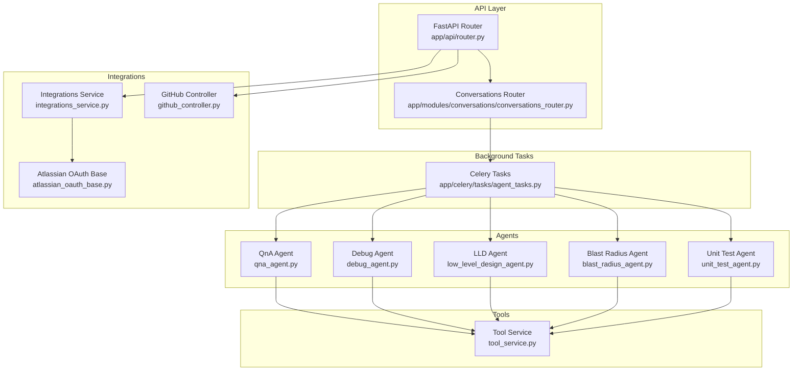
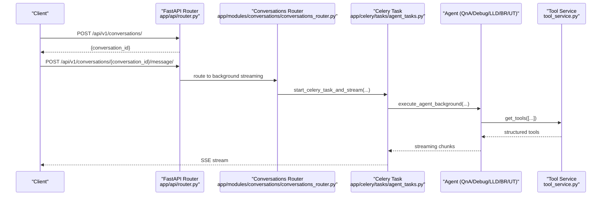
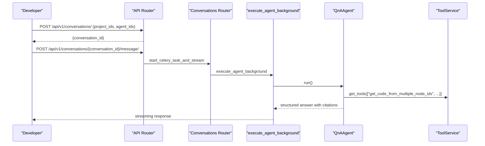
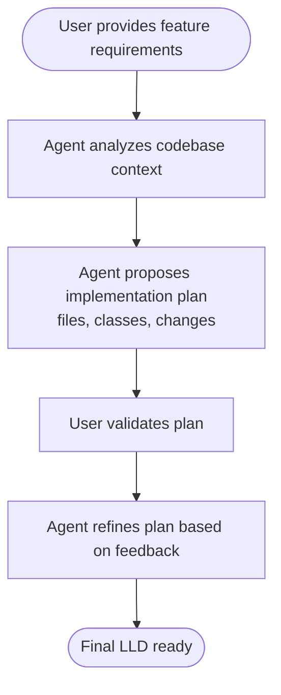
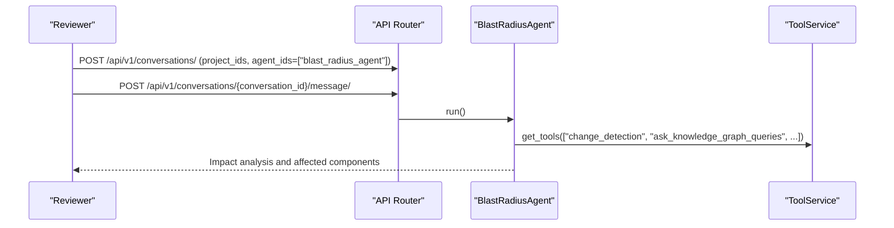
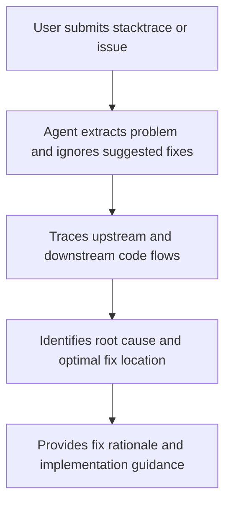
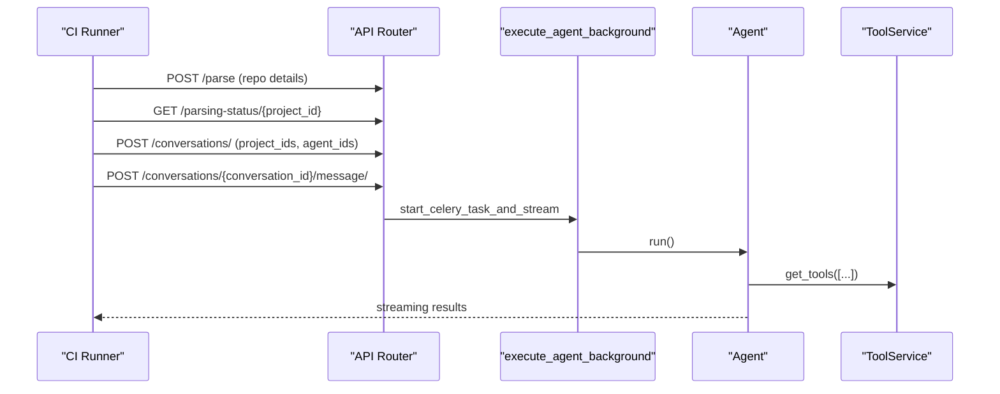
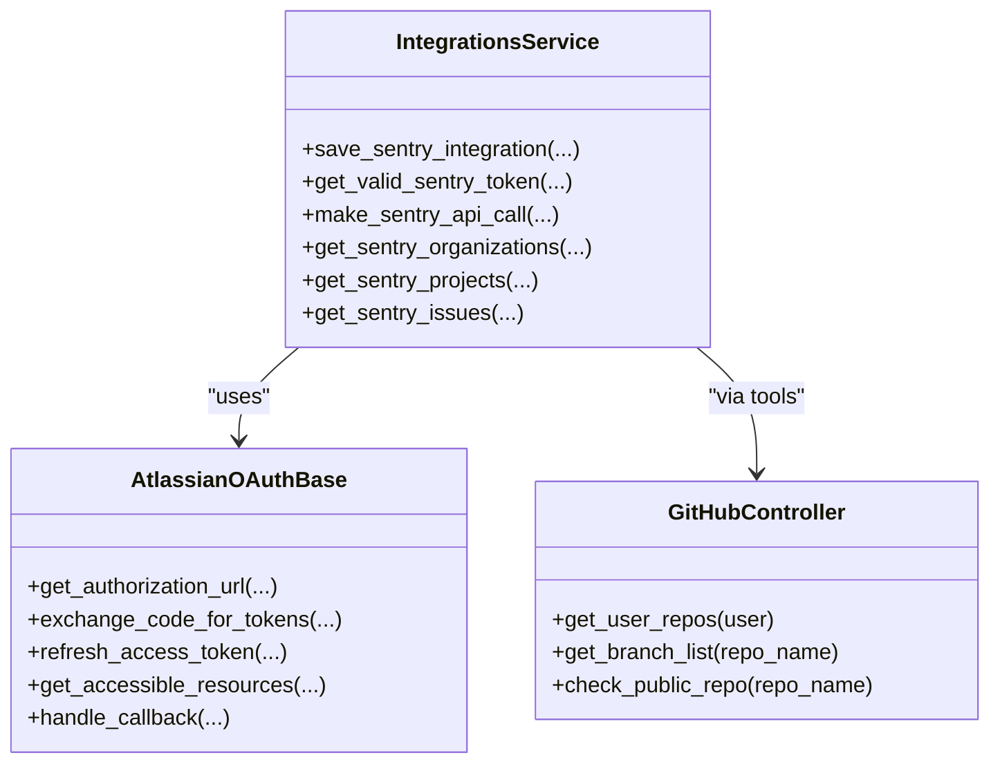
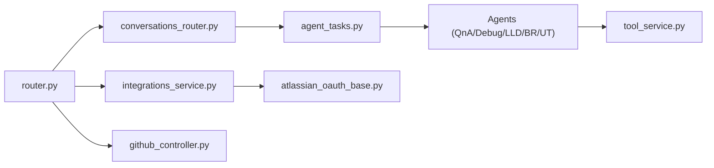

# Use Cases and Scenarios

<cite>
**Referenced Files in This Document**
- [README.md](file://README.md)
- [GETTING_STARTED.md](file://GETTING_STARTED.md)
- [router.py](file://app/api/router.py)
- [conversations_router.py](file://app/modules/conversations/conversations_router.py)
- [agent_tasks.py](file://app/celery/tasks/agent_tasks.py)
- [tool_service.py](file://app/modules/intelligence/tools/tool_service.py)
- [qna_agent.py](file://app/modules/intelligence/agents/chat_agents/system_agents/qna_agent.py)
- [debug_agent.py](file://app/modules/intelligence/agents/chat_agents/system_agents/debug_agent.py)
- [low_level_design_agent.py](file://app/modules/intelligence/agents/chat_agents/system_agents/low_level_design_agent.py)
- [blast_radius_agent.py](file://app/modules/intelligence/agents/chat_agents/system_agents/blast_radius_agent.py)
- [unit_test_agent.py](file://app/modules/intelligence/agents/chat_agents/system_agents/unit_test_agent.py)
- [integrations_service.py](file://app/modules/integrations/integrations_service.py)
- [atlassian_oauth_base.py](file://app/modules/integrations/atlassian_oauth_base.py)
- [github_controller.py](file://app/modules/code_provider/github/github_controller.py)
</cite>

## Table of Contents
1. [Introduction](#introduction)
2. [Project Structure](#project-structure)
3. [Core Components](#core-components)
4. [Architecture Overview](#architecture-overview)
5. [Detailed Component Analysis](#detailed-component-analysis)
6. [Dependency Analysis](#dependency-analysis)
7. [Performance Considerations](#performance-considerations)
8. [Troubleshooting Guide](#troubleshooting-guide)
9. [Conclusion](#conclusion)
10. [Appendices](#appendices)

## Introduction
This document presents real-world use cases and scenarios for Potpie, focusing on how teams and individuals can integrate AI agents into their daily workflows. It covers developer onboarding, understanding complex libraries and APIs, low-level design generation, code change review and blast-radius analysis, debugging with stacktrace analysis, automated testing plan generation, and CI/CD pipeline integration via API access. It also documents team collaboration through Slack integration and shows how different agents and tools work together in practice.

## Project Structure
Potpie exposes a FastAPI backend with streaming conversations, Celery-backed background tasks, and a rich tooling system for codebase exploration and external integrations. The key modules include:
- Conversations and messaging with streaming responses
- Agent orchestration and tooling
- Integrations with external systems (Atlassian, Sentry, GitHub)
- API access for CI/CD automation

**Diagram sources**
- [router.py](file://app/api/router.py#L1-L318)
- [conversations_router.py](file://app/modules/conversations/conversations_router.py#L1-L622)
- [agent_tasks.py](file://app/celery/tasks/agent_tasks.py#L1-L460)
- [tool_service.py](file://app/modules/intelligence/tools/tool_service.py#L1-L263)
- [qna_agent.py](file://app/modules/intelligence/agents/chat_agents/system_agents/qna_agent.py#L1-L480)
- [debug_agent.py](file://app/modules/intelligence/agents/chat_agents/system_agents/debug_agent.py#L1-L633)
- [low_level_design_agent.py](file://app/modules/intelligence/agents/chat_agents/system_agents/low_level_design_agent.py#L1-L170)
- [blast_radius_agent.py](file://app/modules/intelligence/agents/chat_agents/system_agents/blast_radius_agent.py#L1-L119)
- [unit_test_agent.py](file://app/modules/intelligence/agents/chat_agents/system_agents/unit_test_agent.py#L1-L127)
- [integrations_service.py](file://app/modules/integrations/integrations_service.py#L1-L800)
- [atlassian_oauth_base.py](file://app/modules/integrations/atlassian_oauth_base.py#L1-L383)
- [github_controller.py](file://app/modules/code_provider/github/github_controller.py#L1-L23)

**Section sources**
- [README.md](file://README.md#L380-L415)
- [router.py](file://app/api/router.py#L1-L318)
- [conversations_router.py](file://app/modules/conversations/conversations_router.py#L1-L622)
- [agent_tasks.py](file://app/celery/tasks/agent_tasks.py#L1-L460)
- [tool_service.py](file://app/modules/intelligence/tools/tool_service.py#L1-L263)
- [integrations_service.py](file://app/modules/integrations/integrations_service.py#L1-L800)
- [atlassian_oauth_base.py](file://app/modules/integrations/atlassian_oauth_base.py#L1-L383)
- [github_controller.py](file://app/modules/code_provider/github/github_controller.py#L1-L23)

## Core Components
- Conversations and streaming: The API supports creating conversations, posting messages, and streaming responses via Redis-backed Celery tasks.
- Agents: Specialized agents for Q&A, debugging, low-level design, blast radius analysis, and unit test generation.
- Tools: A comprehensive toolset for codebase exploration, change detection, and integration with external systems.
- Integrations: OAuth flows and APIs for Sentry, Jira, Confluence, Linear, and GitHub.

**Section sources**
- [README.md](file://README.md#L94-L105)
- [README.md](file://README.md#L106-L118)
- [README.md](file://README.md#L84-L93)
- [router.py](file://app/api/router.py#L97-L121)
- [conversations_router.py](file://app/modules/conversations/conversations_router.py#L160-L286)
- [agent_tasks.py](file://app/celery/tasks/agent_tasks.py#L11-L25)

## Architecture Overview
Potpie’s runtime architecture centers on a streaming conversation flow:
- Clients call the API to create a conversation and send messages.
- The API routes to Celery tasks that execute agents asynchronously.
- Agents use tools to query the codebase and external systems.
- Results are streamed back via Redis and surfaced to clients.

**Diagram sources**
- [router.py](file://app/api/router.py#L150-L217)
- [conversations_router.py](file://app/modules/conversations/conversations_router.py#L160-L286)
- [agent_tasks.py](file://app/celery/tasks/agent_tasks.py#L11-L25)
- [tool_service.py](file://app/modules/intelligence/tools/tool_service.py#L126-L133)

**Section sources**
- [router.py](file://app/api/router.py#L150-L217)
- [conversations_router.py](file://app/modules/conversations/conversations_router.py#L160-L286)
- [agent_tasks.py](file://app/celery/tasks/agent_tasks.py#L11-L25)
- [tool_service.py](file://app/modules/intelligence/tools/tool_service.py#L126-L133)

## Detailed Component Analysis

### Use Case 1: Developer Onboarding with Codebase Q&A Agent
- Goal: Help new developers quickly understand a codebase.
- Workflow:
  - Create a conversation with the QnA agent.
  - Ask questions like “How do I set up the project?” or “Where is the authentication flow?”
  - The agent explores the codebase, retrieves relevant code snippets, and explains architecture.
- Tools used: code retrieval, file structure, web search, and contextual synthesis.

**Diagram sources**
- [router.py](file://app/api/router.py#L97-L121)
- [conversations_router.py](file://app/modules/conversations/conversations_router.py#L160-L286)
- [agent_tasks.py](file://app/celery/tasks/agent_tasks.py#L11-L25)
- [qna_agent.py](file://app/modules/intelligence/agents/chat_agents/system_agents/qna_agent.py#L24-L145)
- [tool_service.py](file://app/modules/intelligence/tools/tool_service.py#L134-L242)

**Section sources**
- [README.md](file://README.md#L382-L384)
- [qna_agent.py](file://app/modules/intelligence/agents/chat_agents/system_agents/qna_agent.py#L24-L145)
- [tool_service.py](file://app/modules/intelligence/tools/tool_service.py#L134-L242)

### Use Case 2: Understanding Complex Libraries and APIs
- Goal: Gain insight into third-party libraries or internal APIs.
- Workflow:
  - Use the QnA agent to search for relevant code and explain functionality.
  - Leverage web search and code graph tools to connect concepts.
- Tools used: knowledge graph queries, code retrieval, and file structure.

**Section sources**
- [README.md](file://README.md#L386-L387)
- [qna_agent.py](file://app/modules/intelligence/agents/chat_agents/system_agents/qna_agent.py#L155-L479)
- [tool_service.py](file://app/modules/intelligence/tools/tool_service.py#L134-L242)

### Use Case 3: Low-Level Design Generation for New Features
- Goal: Produce detailed implementation plans before writing code.
- Workflow:
  - Provide functional requirements to the LLD agent.
  - The agent analyzes the codebase and proposes files, classes, and changes.
- Tools used: code graph traversal, file structure, and reasoning.

**Diagram sources**
- [low_level_design_agent.py](file://app/modules/intelligence/agents/chat_agents/system_agents/low_level_design_agent.py#L24-L139)
- [tool_service.py](file://app/modules/intelligence/tools/tool_service.py#L134-L242)

**Section sources**
- [README.md](file://README.md#L389-L390)
- [low_level_design_agent.py](file://app/modules/intelligence/agents/chat_agents/system_agents/low_level_design_agent.py#L24-L139)

### Use Case 4: Code Change Review and Blast Radius Analysis
- Goal: Understand the impact of proposed changes and identify affected APIs.
- Workflow:
  - Use the blast radius agent to analyze diffs and related code.
  - The agent leverages change detection and code graph queries to infer side effects.
- Tools used: change detection, knowledge graph queries, and code retrieval.

**Diagram sources**
- [blast_radius_agent.py](file://app/modules/intelligence/agents/chat_agents/system_agents/blast_radius_agent.py#L14-L63)
- [tool_service.py](file://app/modules/intelligence/tools/tool_service.py#L134-L242)

**Section sources**
- [README.md](file://README.md#L392-L394)
- [blast_radius_agent.py](file://app/modules/intelligence/agents/chat_agents/system_agents/blast_radius_agent.py#L14-L63)

### Use Case 5: Debugging with Stacktrace Analysis
- Goal: Quickly identify root causes and propose fixes using codebase context.
- Workflow:
  - Paste stacktrace or describe the issue to the debug agent.
  - The agent traces upstream/downstream flows, identifies root cause, and suggests fixes.
- Tools used: code retrieval, neighbors, and file structure.

**Diagram sources**
- [debug_agent.py](file://app/modules/intelligence/agents/chat_agents/system_agents/debug_agent.py#L24-L143)
- [tool_service.py](file://app/modules/intelligence/tools/tool_service.py#L134-L242)

**Section sources**
- [README.md](file://README.md#L394-L394)
- [debug_agent.py](file://app/modules/intelligence/agents/chat_agents/system_agents/debug_agent.py#L24-L143)

### Use Case 6: Automated Testing Plan Generation
- Goal: Generate unit test plans and code for new or changed functions.
- Workflow:
  - Provide function or module context to the unit test agent.
  - The agent produces happy-path and edge-case plans, then writes tests.
- Tools used: code retrieval and structure analysis.

**Section sources**
- [README.md](file://README.md#L396-L396)
- [unit_test_agent.py](file://app/modules/intelligence/agents/chat_agents/system_agents/unit_test_agent.py#L14-L73)

### Use Case 7: Integrating with Existing Development Workflows
- Goal: Seamlessly integrate Potpie into daily development routines.
- Practical steps:
  - Use the API to parse repositories and create conversations programmatically.
  - Stream responses to IDE extensions or internal chat platforms.
- API endpoints:
  - Parse repository: POST /api/v1/parse
  - List agents: GET /api/v1/list-available-agents
  - Create conversation: POST /api/v1/conversations/
  - Send message: POST /api/v1/conversations/{conversation_id}/message/

**Section sources**
- [README.md](file://README.md#L406-L415)
- [router.py](file://app/api/router.py#L123-L147)
- [router.py](file://app/api/router.py#L272-L282)
- [router.py](file://app/api/router.py#L97-L121)
- [router.py](file://app/api/router.py#L150-L217)

### Use Case 8: Team Collaboration Through Slack Integration
- Goal: Bring Potpie agents into team communication channels.
- Capabilities:
  - Install the Slack app and collaborate directly in Slack threads.
  - Access agents and receive contextual assistance without leaving Slack.
- Notes:
  - Slack integration is available and documented in the project materials.

**Section sources**
- [README.md](file://README.md#L84-L93)

### Use Case 9: CI/CD Pipeline Integration via API Access
- Goal: Automate code analysis, testing, and PR workflows in CI.
- Workflow:
  - Use API key authentication to call:
    - Parse repository: POST /api/v1/parse
    - Monitor parsing status: GET /api/v1/parsing-status/{project_id}
    - Create conversation: POST /api/v1/conversations/
    - Send message: POST /api/v1/conversations/{conversation_id}/message/
  - Stream results to CI logs or artifacts.
- Background execution:
  - The API uses Celery tasks for background processing and streaming.

**Diagram sources**
- [router.py](file://app/api/router.py#L123-L147)
- [router.py](file://app/api/router.py#L132-L147)
- [router.py](file://app/api/router.py#L97-L121)
- [router.py](file://app/api/router.py#L150-L217)
- [agent_tasks.py](file://app/celery/tasks/agent_tasks.py#L11-L25)
- [tool_service.py](file://app/modules/intelligence/tools/tool_service.py#L134-L242)

**Section sources**
- [README.md](file://README.md#L406-L415)
- [router.py](file://app/api/router.py#L123-L147)
- [router.py](file://app/api/router.py#L132-L147)
- [router.py](file://app/api/router.py#L97-L121)
- [router.py](file://app/api/router.py#L150-L217)
- [agent_tasks.py](file://app/celery/tasks/agent_tasks.py#L11-L25)

### Use Case 10: External System Integrations (Atlassian, Sentry, GitHub)
- Atlassian (Jira, Confluence):
  - OAuth base class supports authorization, token exchange, and resource access.
  - Integrations service manages saved integrations and API calls.
- Sentry:
  - OAuth flow for access tokens, refresh tokens, and API calls.
- GitHub:
  - Controller provides repository and branch listing, plus public repo checks.

**Diagram sources**
- [atlassian_oauth_base.py](file://app/modules/integrations/atlassian_oauth_base.py#L56-L383)
- [integrations_service.py](file://app/modules/integrations/integrations_service.py#L1-L800)
- [github_controller.py](file://app/modules/code_provider/github/github_controller.py#L7-L23)

**Section sources**
- [integrations_service.py](file://app/modules/integrations/integrations_service.py#L1-L800)
- [atlassian_oauth_base.py](file://app/modules/integrations/atlassian_oauth_base.py#L56-L383)
- [github_controller.py](file://app/modules/code_provider/github/github_controller.py#L7-L23)

## Dependency Analysis
- Agents depend on ToolService to access codebase knowledge and external systems.
- Conversations routing depends on Celery tasks for background execution and streaming.
- Integrations rely on OAuth flows and token management.

**Diagram sources**
- [conversations_router.py](file://app/modules/conversations/conversations_router.py#L1-L622)
- [agent_tasks.py](file://app/celery/tasks/agent_tasks.py#L1-L460)
- [tool_service.py](file://app/modules/intelligence/tools/tool_service.py#L1-L263)
- [router.py](file://app/api/router.py#L1-L318)
- [integrations_service.py](file://app/modules/integrations/integrations_service.py#L1-L800)
- [atlassian_oauth_base.py](file://app/modules/integrations/atlassian_oauth_base.py#L1-L383)
- [github_controller.py](file://app/modules/code_provider/github/github_controller.py#L1-L23)

**Section sources**
- [conversations_router.py](file://app/modules/conversations/conversations_router.py#L1-L622)
- [agent_tasks.py](file://app/celery/tasks/agent_tasks.py#L1-L460)
- [tool_service.py](file://app/modules/intelligence/tools/tool_service.py#L1-L263)
- [router.py](file://app/api/router.py#L1-L318)
- [integrations_service.py](file://app/modules/integrations/integrations_service.py#L1-L800)
- [atlassian_oauth_base.py](file://app/modules/integrations/atlassian_oauth_base.py#L1-L383)
- [github_controller.py](file://app/modules/code_provider/github/github_controller.py#L1-L23)

## Performance Considerations
- Streaming via Redis ensures responsive user experiences for long-running agent executions.
- Celery tasks isolate heavy computation and avoid blocking the API.
- Tool selection impacts latency; prefer targeted tools for specific tasks.
- Use background execution for regeneration and long-running tasks to maintain responsiveness.

[No sources needed since this section provides general guidance]

## Troubleshooting Guide
- API key authentication failures:
  - Ensure the header X-API-Key is provided and valid.
- Conversation creation limits:
  - UsageService enforces subscription limits; handle 402 responses.
- Streaming issues:
  - Verify Redis connectivity and task status via task-status endpoints.
- Integration errors:
  - Sentry token refresh and OAuth flows include detailed logging and sanitized error messages.

**Section sources**
- [router.py](file://app/api/router.py#L56-L87)
- [conversations_router.py](file://app/modules/conversations/conversations_router.py#L94-L99)
- [conversations_router.py](file://app/modules/conversations/conversations_router.py#L491-L518)
- [integrations_service.py](file://app/modules/integrations/integrations_service.py#L164-L302)

## Conclusion
Potpie enables powerful, real-world engineering workflows by combining specialized agents, a robust tooling system, and seamless integrations. Teams can accelerate onboarding, improve code quality, and automate CI/CD tasks while collaborating through familiar channels like Slack and GitHub.

[No sources needed since this section summarizes without analyzing specific files]

## Appendices
- Beginner-friendly tips:
  - Start with the QnA agent for orientation; switch to Debug or LLD as needed.
  - Use blast radius analysis before merging PRs.
  - Integrate API access into CI for automated reviews and testing.
- Advanced tips:
  - Customize agents and tools for domain-specific needs.
  - Leverage streaming and background tasks for scalability.

[No sources needed since this section provides general guidance]