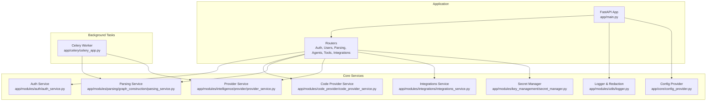
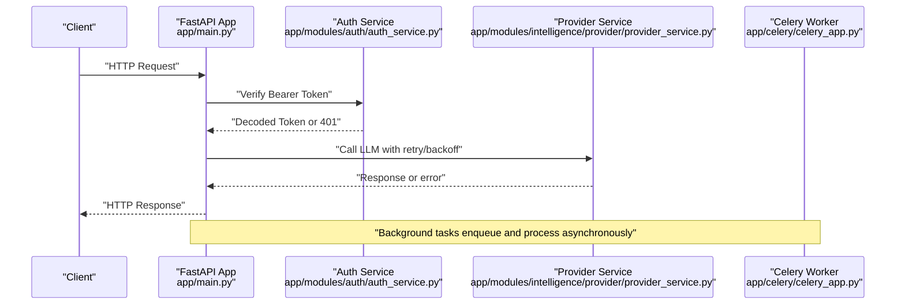
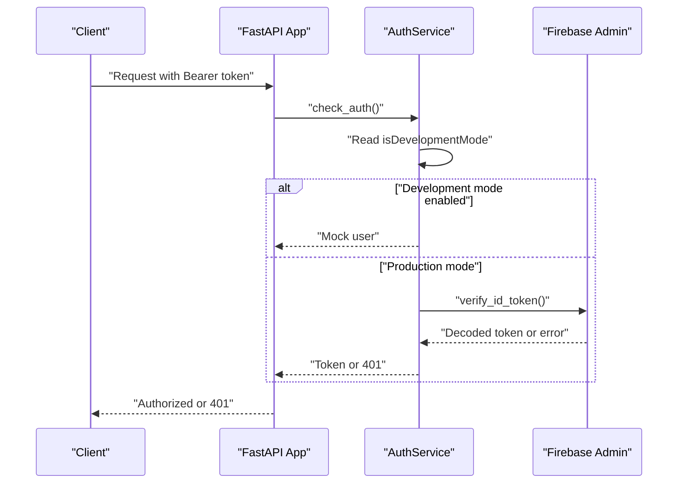
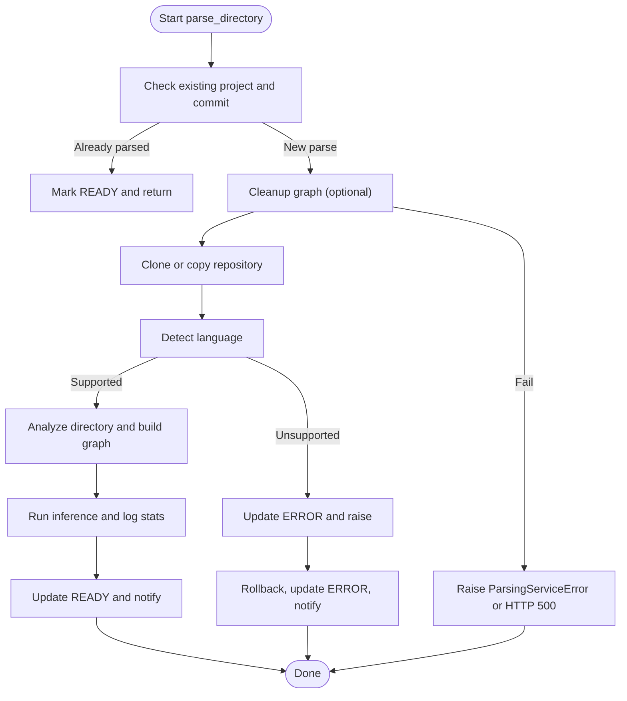
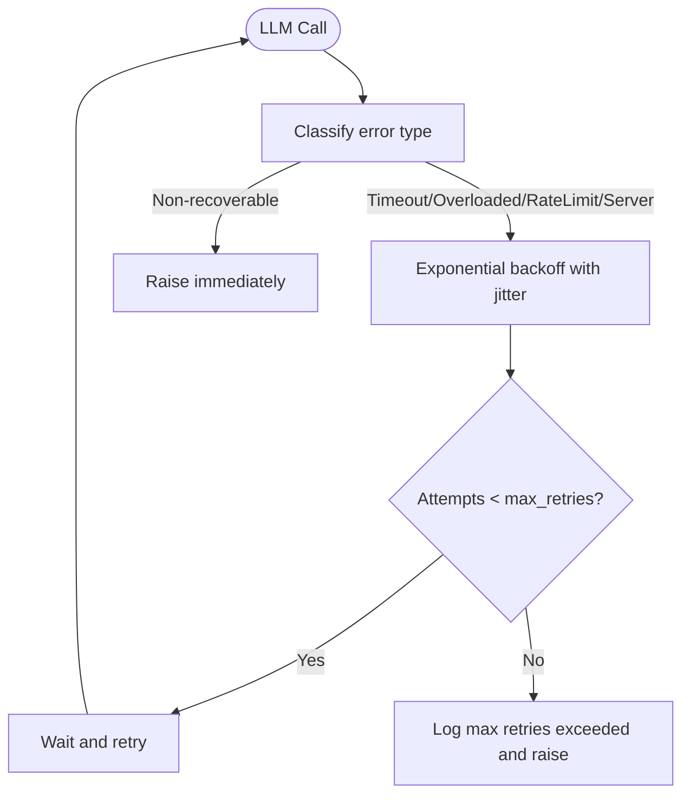
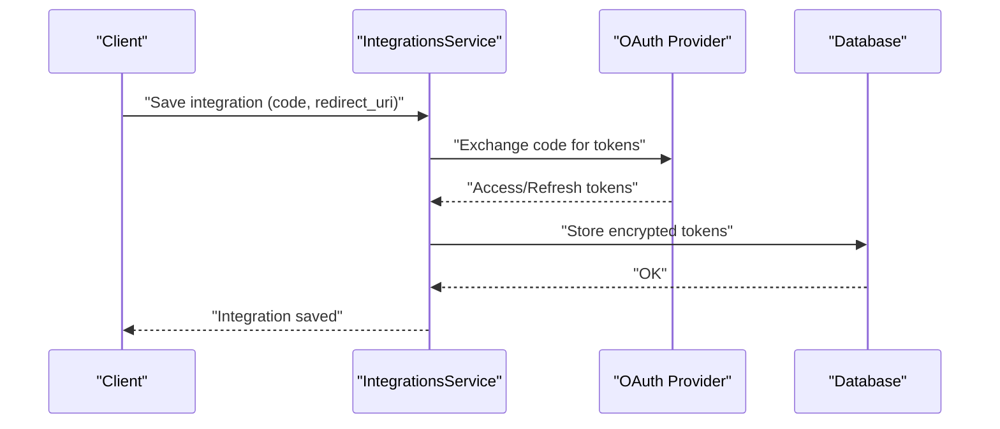
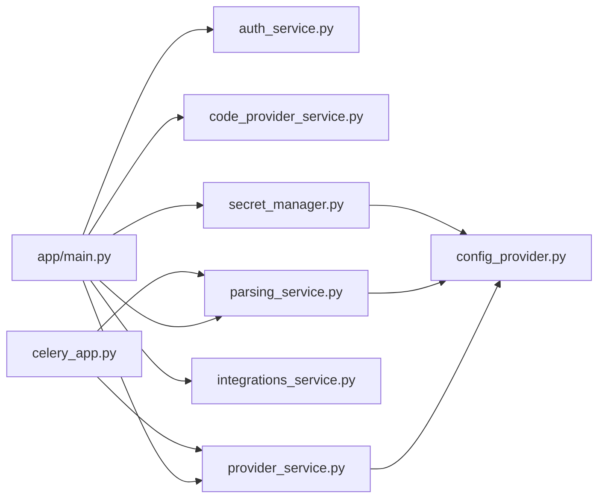

# Troubleshooting & FAQ

<cite>
**Referenced Files in This Document**
- [README.md](file://README.md)
- [GETTING_STARTED.md](file://GETTING_STARTED.md)
- [app/main.py](file://app/main.py)
- [app/core/config_provider.py](file://app/core/config_provider.py)
- [app/modules/utils/logger.py](file://app/modules/utils/logger.py)
- [app/modules/auth/auth_service.py](file://app/modules/auth/auth_service.py)
- [app/modules/parsing/graph_construction/parsing_service.py](file://app/modules/parsing/graph_construction/parsing_service.py)
- [app/modules/code_provider/code_provider_service.py](file://app/modules/code_provider/code_provider_service.py)
- [app/modules/integrations/integrations_service.py](file://app/modules/integrations/integrations_service.py)
- [app/modules/key_management/secret_manager.py](file://app/modules/key_management/secret_manager.py)
- [app/modules/intelligence/provider/provider_service.py](file://app/modules/intelligence/provider/provider_service.py)
- [app/celery/celery_app.py](file://app/celery/celery_app.py)
- [docs/logging_best_practices.md](file://docs/logging_best_practices.md)
- [docs/docker_desktop_gvisor_config.md](file://docs/docker_desktop_gvisor_config.md)
- [docs/gvisor_setup.md](file://docs/gvisor_setup.md)
- [docs/gvisor_usage.md](file://docs/gvisor_usage.md)
- [scripts/install_gvisor.py](file://scripts/install_gvisor.py)
- [scripts/setup_gvisor_docker.sh](file://scripts/setup_gvisor_docker.sh)
- [scripts/verify_gvisor_docker.sh](file://scripts/verify_gvisor_docker.sh)
</cite>

## Table of Contents
1. [Introduction](#introduction)
2. [Project Structure](#project-structure)
3. [Core Components](#core-components)
4. [Architecture Overview](#architecture-overview)
5. [Detailed Component Analysis](#detailed-component-analysis)
6. [Dependency Analysis](#dependency-analysis)
7. [Performance Considerations](#performance-considerations)
8. [Troubleshooting Guide](#troubleshooting-guide)
9. [Conclusion](#conclusion)
10. [Appendices](#appendices)

## Introduction
This document provides comprehensive troubleshooting and FAQ guidance for Potpie. It focuses on resolving common setup issues, configuration problems, and runtime errors. It includes debugging guides for authentication failures, parsing errors, agent execution problems, and integration issues. It also covers performance optimization, memory usage guidance, scaling considerations, GVisor integration issues, Docker configuration problems, database connectivity issues, frequently asked questions about model configuration, rate limiting, and API usage, plus error codes, log analysis techniques, and diagnostic procedures for development and production environments.

## Project Structure
Potpie is a FastAPI application with modular subsystems:
- Core application lifecycle and routing
- Authentication and user management
- Code provider abstraction and repository access
- Parsing pipeline for knowledge graph construction
- Provider orchestration for LLMs and agents
- Integrations with external systems (e.g., Sentry, Linear, Jira, Confluence)
- Secret management with GCP Secret Manager and local fallback
- Celery task queues for background processing
- Logging and diagnostics with structured logs and sensitive data redaction

**Diagram sources**
- [app/main.py](file://app/main.py#L147-L172)
- [app/modules/auth/auth_service.py](file://app/modules/auth/auth_service.py#L14-L108)
- [app/modules/code_provider/code_provider_service.py](file://app/modules/code_provider/code_provider_service.py#L431-L467)
- [app/modules/parsing/graph_construction/parsing_service.py](file://app/modules/parsing/graph_construction/parsing_service.py#L33-L110)
- [app/modules/intelligence/provider/provider_service.py](file://app/modules/intelligence/provider/provider_service.py#L472-L580)
- [app/modules/integrations/integrations_service.py](file://app/modules/integrations/integrations_service.py#L40-L104)
- [app/modules/key_management/secret_manager.py](file://app/modules/key_management/secret_manager.py#L550-L800)
- [app/celery/celery_app.py](file://app/celery/celery_app.py#L66-L147)
- [app/core/config_provider.py](file://app/core/config_provider.py#L19-L80)
- [app/modules/utils/logger.py](file://app/modules/utils/logger.py#L187-L313)

**Section sources**
- [app/main.py](file://app/main.py#L147-L172)
- [app/core/config_provider.py](file://app/core/config_provider.py#L19-L80)
- [app/modules/utils/logger.py](file://app/modules/utils/logger.py#L187-L313)

## Core Components
- Application bootstrap and middleware: CORS, logging context, Sentry, Phoenix tracing, health endpoint, startup database initialization, and router registration.
- Configuration provider: centralizes environment-driven settings for Neo4j, Redis, GitHub, storage backends, and streaming parameters.
- Logger: unified, structured logging with sensitive data redaction and environment-based sinks.
- Authentication: Firebase-based auth with development-mode bypass and bearer token verification.
- Code provider service: abstracts GitHub, GitBucket, local repos, and fallbacks; integrates RepoManager for local copies.
- Parsing service: orchestrates repository cloning, language detection, graph construction, inference, and status updates.
- Provider service: robust LLM orchestration with retry/backoff, error classification, and tracing sanitation.
- Integrations service: manages OAuth integrations (Sentry, Linear, Jira, Confluence) with token refresh and API calls.
- Secret manager: stores and retrieves API keys via GCP Secret Manager with local fallback and encryption.
- Celery worker: task routing, memory limits, worker restart policies, and LiteLLM configuration for async-safe logging.

**Section sources**
- [app/main.py](file://app/main.py#L46-L211)
- [app/core/config_provider.py](file://app/core/config_provider.py#L19-L246)
- [app/modules/utils/logger.py](file://app/modules/utils/logger.py#L187-L372)
- [app/modules/auth/auth_service.py](file://app/modules/auth/auth_service.py#L14-L108)
- [app/modules/code_provider/code_provider_service.py](file://app/modules/code_provider/code_provider_service.py#L431-L467)
- [app/modules/parsing/graph_construction/parsing_service.py](file://app/modules/parsing/graph_construction/parsing_service.py#L33-L110)
- [app/modules/intelligence/provider/provider_service.py](file://app/modules/intelligence/provider/provider_service.py#L472-L800)
- [app/modules/integrations/integrations_service.py](file://app/modules/integrations/integrations_service.py#L40-L200)
- [app/modules/key_management/secret_manager.py](file://app/modules/key_management/secret_manager.py#L550-L800)
- [app/celery/celery_app.py](file://app/celery/celery_app.py#L66-L147)

## Architecture Overview
The system comprises:
- FastAPI application with modular routers
- Background processing via Celery with Redis transport
- LLM orchestration with retry/backoff and tracing
- Secure secret storage with GCP Secret Manager and local fallback
- Multi-provider code access with RepoManager support
- Structured logging with sensitive data redaction

**Diagram sources**
- [app/main.py](file://app/main.py#L147-L172)
- [app/modules/auth/auth_service.py](file://app/modules/auth/auth_service.py#L48-L104)
- [app/modules/intelligence/provider/provider_service.py](file://app/modules/intelligence/provider/provider_service.py#L795-L800)
- [app/celery/celery_app.py](file://app/celery/celery_app.py#L66-L147)

## Detailed Component Analysis

### Authentication Failures
Common symptoms:
- 401 Unauthorized responses
- Development-mode bypass unexpectedly failing
- Firebase token verification errors

Resolution steps:
- Verify bearer token presence and format in Authorization header.
- Confirm Firebase configuration and token issuer.
- In development mode, ensure default username and development flag are set.
- Check Sentry initialization and environment variables for production.

**Diagram sources**
- [app/modules/auth/auth_service.py](file://app/modules/auth/auth_service.py#L48-L104)
- [app/main.py](file://app/main.py#L64-L88)

**Section sources**
- [app/modules/auth/auth_service.py](file://app/modules/auth/auth_service.py#L14-L108)
- [app/main.py](file://app/main.py#L64-L88)

### Parsing Errors
Symptoms:
- Parsing stuck at READY for a commit
- Graph cleanup failures
- Repository language unsupported
- Full traceback logged with correlation ID

Resolution steps:
- Check project status transitions and commit ID matching.
- Validate Neo4j connectivity and credentials.
- Ensure language detection succeeds; otherwise, update repository or model.
- Inspect full traceback and project ID for operator correlation.

**Diagram sources**
- [app/modules/parsing/graph_construction/parsing_service.py](file://app/modules/parsing/graph_construction/parsing_service.py#L102-L273)

**Section sources**
- [app/modules/parsing/graph_construction/parsing_service.py](file://app/modules/parsing/graph_construction/parsing_service.py#L102-L273)

### Agent Execution Problems
Symptoms:
- Timeouts or overloaded responses from providers
- Rate limit exceeded errors
- Internal server errors after retries

Resolution steps:
- Enable LiteLLM debug logging to inspect provider responses.
- Tune retry/backoff settings and provider-specific patterns.
- Sanitize tracing messages to avoid OpenTelemetry encoding errors.
- Monitor Celery worker memory and restart thresholds.

**Diagram sources**
- [app/modules/intelligence/provider/provider_service.py](file://app/modules/intelligence/provider/provider_service.py#L116-L259)

**Section sources**
- [app/modules/intelligence/provider/provider_service.py](file://app/modules/intelligence/provider/provider_service.py#L48-L56)
- [app/modules/intelligence/provider/provider_service.py](file://app/modules/intelligence/provider/provider_service.py#L116-L259)
- [app/modules/intelligence/provider/provider_service.py](file://app/modules/intelligence/provider/provider_service.py#L262-L327)
- [app/celery/celery_app.py](file://app/celery/celery_app.py#L362-L403)

### Integration Issues (Sentry, Linear, Jira, Confluence)
Symptoms:
- OAuth code invalid/expired
- Token refresh failures
- Missing client credentials
- API call errors

Resolution steps:
- Validate OAuth code freshness and redirect URI.
- Check client credentials and scopes.
- Refresh tokens when expired; decrypt and re-encrypt as needed.
- Inspect sanitized error responses and debug logs.

**Diagram sources**
- [app/modules/integrations/integrations_service.py](file://app/modules/integrations/integrations_service.py#L595-L788)

**Section sources**
- [app/modules/integrations/integrations_service.py](file://app/modules/integrations/integrations_service.py#L132-L200)
- [app/modules/integrations/integrations_service.py](file://app/modules/integrations/integrations_service.py#L595-L788)

### Secret Management and Provider Keys
Symptoms:
- 404 when retrieving secrets
- Invalid encryption key
- GCP Secret Manager unavailable

Resolution steps:
- Ensure SECRET_ENCRYPTION_KEY is set and valid.
- Verify GCP_PROJECT and ADC configuration.
- Use fallback to UserPreferences for local storage.
- Check secret existence before retrieval.

**Section sources**
- [app/modules/key_management/secret_manager.py](file://app/modules/key_management/secret_manager.py#L84-L98)
- [app/modules/key_management/secret_manager.py](file://app/modules/key_management/secret_manager.py#L140-L224)
- [app/modules/key_management/secret_manager.py](file://app/modules/key_management/secret_manager.py#L226-L287)

### GVisor and Docker Configuration
Symptoms:
- Container runtime issues
- Sandbox setup failures
- Docker Desktop configuration problems

Resolution steps:
- Follow GVisor setup and usage guides.
- Use provided scripts to install and verify GVisor inside Docker VM.
- Adjust Docker Desktop settings for sandbox support.

**Section sources**
- [docs/gvisor_setup.md](file://docs/gvisor_setup.md)
- [docs/gvisor_usage.md](file://docs/gvisor_usage.md)
- [docs/docker_desktop_gvisor_config.md](file://docs/docker_desktop_gvisor_config.md)
- [scripts/install_gvisor.py](file://scripts/install_gvisor.py)
- [scripts/setup_gvisor_docker.sh](file://scripts/setup_gvisor_docker.sh)
- [scripts/verify_gvisor_docker.sh](file://scripts/verify_gvisor_docker.sh)

## Dependency Analysis
Key dependencies and relationships:
- FastAPI app depends on routers, middleware, and startup events.
- Providers depend on configuration and secret manager.
- Parsing depends on code provider, Neo4j, and inference service.
- Celery worker depends on Redis and LiteLLM configuration.
- Integrations depend on OAuth providers and encrypted tokens.

**Diagram sources**
- [app/main.py](file://app/main.py#L147-L172)
- [app/modules/intelligence/provider/provider_service.py](file://app/modules/intelligence/provider/provider_service.py#L472-L580)
- [app/modules/parsing/graph_construction/parsing_service.py](file://app/modules/parsing/graph_construction/parsing_service.py#L33-L110)
- [app/modules/code_provider/code_provider_service.py](file://app/modules/code_provider/code_provider_service.py#L431-L467)
- [app/modules/integrations/integrations_service.py](file://app/modules/integrations/integrations_service.py#L40-L104)
- [app/modules/key_management/secret_manager.py](file://app/modules/key_management/secret_manager.py#L550-L800)
- [app/celery/celery_app.py](file://app/celery/celery_app.py#L66-L147)
- [app/core/config_provider.py](file://app/core/config_provider.py#L19-L80)

**Section sources**
- [app/main.py](file://app/main.py#L147-L172)
- [app/core/config_provider.py](file://app/core/config_provider.py#L19-L80)

## Performance Considerations
- Logging: Use production JSON sink and sensitive data redaction; adjust LOG_LEVEL and LOG_STACK_TRACES.
- Celery: Worker memory limits, restart thresholds, prefetch multiplier, and task routes optimize throughput and stability.
- LLM calls: Configure retry/backoff and sanitize tracing messages to avoid overhead.
- Redis: Validate connectivity and ping; mask credentials in logs.
- Neo4j: Ensure indices exist and monitor graph statistics after inference.

[No sources needed since this section provides general guidance]

## Troubleshooting Guide

### Setup and Configuration
- Environment variables: Ensure .env is loaded and required variables are set (database URIs, Redis, Neo4j, provider keys).
- Development vs production: Validate isDevelopmentMode and ENV consistency.
- CORS: Confirm allowed origins for frontend integration.
- Health endpoint: Use /health to verify application readiness.

**Section sources**
- [app/main.py](file://app/main.py#L46-L114)
- [app/main.py](file://app/main.py#L173-L184)

### Authentication Failures
- 401 errors: Verify Authorization header and Bearer token validity.
- Firebase verification: Check token issuer and audience expectations.
- Development mode: Confirm defaultUsername and development flag.

**Section sources**
- [app/modules/auth/auth_service.py](file://app/modules/auth/auth_service.py#L48-L104)

### Parsing Pipeline Issues
- Stuck READY: Confirm commit ID and project status transitions.
- Graph cleanup: Validate Neo4j credentials and connectivity.
- Unsupported language: Update repository or model configuration.

**Section sources**
- [app/modules/parsing/graph_construction/parsing_service.py](file://app/modules/parsing/graph_construction/parsing_service.py#L102-L273)

### LLM and Provider Errors
- Overloaded/capacity errors: Enable LITELLM_DEBUG and tune retry/backoff.
- Timeout/internal errors: Increase delays and jitter; classify errors accurately.
- Tracing sanitation: Convert None content to empty strings for OpenTelemetry.

**Section sources**
- [app/modules/intelligence/provider/provider_service.py](file://app/modules/intelligence/provider/provider_service.py#L48-L56)
- [app/modules/intelligence/provider/provider_service.py](file://app/modules/intelligence/provider/provider_service.py#L116-L259)
- [app/modules/intelligence/provider/provider_service.py](file://app/modules/intelligence/provider/provider_service.py#L262-L327)

### Integration OAuth Problems
- Invalid/expired code: Ensure fresh authorization code and correct redirect URI.
- Missing credentials: Verify client ID/secret and scopes.
- Token refresh: Decrypt/encrypt tokens and update database.

**Section sources**
- [app/modules/integrations/integrations_service.py](file://app/modules/integrations/integrations_service.py#L354-L488)
- [app/modules/integrations/integrations_service.py](file://app/modules/integrations/integrations_service.py#L595-L788)

### Secret Retrieval Failures
- 404 Not Found: Check secret existence and storage backend availability.
- Encryption key issues: Validate SECRET_ENCRYPTION_KEY format.
- GCP unavailability: Confirm ADC and project configuration.

**Section sources**
- [app/modules/key_management/secret_manager.py](file://app/modules/key_management/secret_manager.py#L84-L98)
- [app/modules/key_management/secret_manager.py](file://app/modules/key_management/secret_manager.py#L226-L287)

### GVisor and Docker Issues
- Sandbox failures: Re-run install and verification scripts.
- Docker Desktop: Adjust sandbox settings per platform-specific guidance.

**Section sources**
- [docs/gvisor_setup.md](file://docs/gvisor_setup.md)
- [docs/gvisor_usage.md](file://docs/gvisor_usage.md)
- [docs/docker_desktop_gvisor_config.md](file://docs/docker_desktop_gvisor_config.md)
- [scripts/install_gvisor.py](file://scripts/install_gvisor.py)
- [scripts/setup_gvisor_docker.sh](file://scripts/setup_gvisor_docker.sh)
- [scripts/verify_gvisor_docker.sh](file://scripts/verify_gvisor_docker.sh)

### Logging and Diagnostics
- Enable structured logs and sensitive data redaction.
- Use log_context to attach correlation IDs (user_id, project_id).
- Adjust LOG_LEVEL and LOG_STACK_TRACES for debugging.
- Review production JSON logs for exception blocks and extra fields.

**Section sources**
- [app/modules/utils/logger.py](file://app/modules/utils/logger.py#L187-L372)
- [docs/logging_best_practices.md](file://docs/logging_best_practices.md)

### Frequently Asked Questions

- How do I configure model providers?
  - Set provider/model identifiers and API keys via environment variables or secret manager. See provider configuration and secret management.

- How do I handle rate limiting?
  - Enable LITELLM_DEBUG, configure retry/backoff, and rely on provider-specific error patterns.

- How do I scale background processing?
  - Tune Celery worker prefetch, memory limits, and task routes; monitor worker shutdown cleanup.

- How do I integrate external tools?
  - Use integrations service endpoints to save OAuth credentials and refresh tokens.

- How do I troubleshoot database connectivity?
  - Validate connection strings and ensure migrations are applied at startup.

**Section sources**
- [app/modules/intelligence/provider/provider_service.py](file://app/modules/intelligence/provider/provider_service.py#L48-L56)
- [app/celery/celery_app.py](file://app/celery/celery_app.py#L108-L126)
- [app/modules/integrations/integrations_service.py](file://app/modules/integrations/integrations_service.py#L595-L788)
- [app/main.py](file://app/main.py#L185-L207)

## Conclusion
This guide consolidates practical troubleshooting procedures for Potpie across setup, configuration, runtime, integrations, and performance. Use the provided sequences and flows to isolate issues, leverage structured logging for diagnostics, and apply the recommended fixes for authentication, parsing, provider calls, integrations, secrets, and infrastructure.

[No sources needed since this section summarizes without analyzing specific files]

## Appendices

### Error Codes and Responses
- HTTP 401 Unauthorized: Missing or invalid Bearer token.
- HTTP 500 Internal Server Error: Generic server error with project ID for correlation.
- OAuth errors: Invalid grant, expired code, redirect URI mismatch, or credential issues.

**Section sources**
- [app/modules/auth/auth_service.py](file://app/modules/auth/auth_service.py#L68-L102)
- [app/modules/parsing/graph_construction/parsing_service.py](file://app/modules/parsing/graph_construction/parsing_service.py#L258-L261)
- [app/modules/integrations/integrations_service.py](file://app/modules/integrations/integrations_service.py#L424-L454)

### Log Analysis Techniques
- Use production JSON sink for machine-readable logs.
- Redact sensitive fields (passwords, tokens, API keys).
- Attach context (request_id, user_id, conversation_id, project_id) via log_context.
- Enable LOG_STACK_TRACES for detailed stack traces in development.

**Section sources**
- [app/modules/utils/logger.py](file://app/modules/utils/logger.py#L105-L166)
- [app/modules/utils/logger.py](file://app/modules/utils/logger.py#L208-L253)
- [app/modules/utils/logger.py](file://app/modules/utils/logger.py#L315-L328)

### Development and Production Checklist
- Development: isDevelopmentMode enabled, defaultUsername set, local models configured.
- Production: Sentry and Phoenix tracing, CORS origins, Firebase setup, secret storage via GCP or fallback.

**Section sources**
- [GETTING_STARTED.md](file://GETTING_STARTED.md#L63-L172)
- [README.md](file://README.md#L172-L304)
- [app/main.py](file://app/main.py#L64-L99)