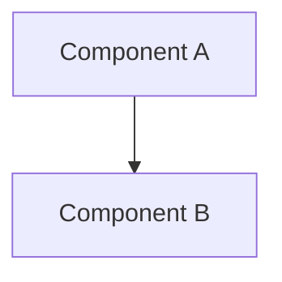

# DeepWiki Open Integration

This document describes the integration of deepwiki-open methodology into Potpie for generating comprehensive wiki documentation.

## Overview

The DeepWikiOpenAgent implements the deepwiki-open workflow for generating structured, comprehensive wiki documentation from codebases using Potpie's knowledge graph.

## Implementation

### 1. Agent Implementation

**File**: `app/modules/intelligence/agents/chat_agents/system_agents/deepwiki_open_agent.py`

The agent follows a 3-phase workflow:

#### Phase 1: Analyze Project Structure
- Uses `get_code_file_structure` to get directory tree
- Queries knowledge graph with `ask_knowledge_graph_queries` to understand:
  - Main modules and their purposes
  - Key entry points and APIs
  - Data models and architecture patterns
- Creates a plan using todo management tools

#### Phase 2: Plan Wiki Structure
Plans 8-12 wiki pages covering:
- Project Overview
- Core Architecture
- Key Features
- API Reference
- Data Management
- Frontend/Backend Components
- Deployment & Operations
- Development Guide

#### Phase 3: Generate Wiki Pages
For each planned page:
1. Query knowledge graph to find relevant files
2. Read 5-10 source files using `fetch_files_batch`
3. Generate comprehensive markdown (300+ lines) with:
   - Source file references
   - Architecture diagrams (Mermaid)
   - Code examples with citations
   - Tables for parameters/configs
   - Related pages links
4. Write page using `write_wiki_page` tool
5. Track progress with todos

### 2. Tools Used

The agent leverages existing Potpie tools:

- **`get_code_file_structure`**: Get project directory tree
- **`fetch_file`**: Read individual source files
- **`fetch_files_batch`**: Read multiple files efficiently (2-20 at once)
- **`ask_knowledge_graph_queries`**: Query Potpie knowledge graph for code insights
- **`write_wiki_page`**: Write generated markdown to `.repowiki/en/content/`
- **Todo management tools**: Track generation progress

### 3. Agent Registration

**File**: `app/modules/intelligence/agents/agents_service.py`

The agent is registered as a system agent:

```python
"deepwiki_open_agent": AgentWithInfo(
    id="deepwiki_open_agent",
    name="DeepWiki Open Agent",
    description="Generate comprehensive wiki documentation using deepwiki-open methodology...",
    agent=deepwiki_open_agent.DeepWikiOpenAgent(
        llm_provider, tools_provider, prompt_provider
    ),
)
```

### 4. CLI Command

**File**: `potpie_cli.py`

New command: `potpie-cli deepwiki-open-wiki`

```bash
# Generate wiki for a repository
potpie-cli deepwiki-open-wiki --repo /path/to/repo

# Use existing project ID
potpie-cli deepwiki-open-wiki -r . -p <project-id>

# Generate concise wiki (4-6 pages instead of 8-12)
potpie-cli deepwiki-open-wiki -r ~/myproject --concise
```

The command:
1. Auto-parses the repository if no project ID provided
2. Invokes the DeepWikiOpenAgent
3. Tracks progress and displays generated pages
4. Outputs to `.repowiki/en/content/`

## Usage Examples

### Basic Usage

```bash
# Parse repository first (if not already parsed)
potpie-cli parse repo /path/to/myproject

# Generate comprehensive wiki
potpie-cli deepwiki-open-wiki --repo /path/to/myproject
```

### With Existing Project

```bash
# List projects to get ID
potpie-cli projects list

# Generate wiki using project ID
potpie-cli deepwiki-open-wiki -r /path/to/myproject -p <project-id>
```

### Concise Mode

```bash
# Generate shorter wiki (4-6 pages)
potpie-cli deepwiki-open-wiki -r . --concise
```

## Output Structure

Wiki pages are written to `.repowiki/en/content/` organized by sections:

```
.repowiki/en/content/
├── Project Overview/
│   ├── Overview.md
│   └── Setup Guide.md
├── Core Architecture/
│   ├── System Design.md
│   └── Data Flow.md
├── Intelligence Engine/
│   ├── Agents.md
│   └── Tools.md
├── API Reference/
│   └── Endpoints.md
└── ...
```

### Valid Sections

- API Reference
- Authentication & Authorization
- Code Parsing & Knowledge Graph
- Conversations & Messaging
- Core Architecture
- Data Management
- Deployment & Operations
- External Integrations
- Intelligence Engine
- Project Overview

## Wiki Page Format

Each generated page follows this structure:

```markdown
<details>
<summary>Relevant source files</summary>

- [file1.py](path/to/file1.py)
- [file2.ts](path/to/file2.ts)
</details>

# Page Title

## Introduction
Brief overview...

## Architecture


## Key Components

### Component Name
Detailed explanation with code examples.

```python
# Example from file.py:42-50
def example_function():
    pass
```

Sources: [file.py:42-50]()

## Related Pages
- [Related Topic](../section/page.md)
```

## Differences from Original deepwiki-open

The Potpie integration differs from the standalone deepwiki-open skill:

1. **No subprocess calls**: Uses Potpie's native tools instead of `potpie-cli ask`
2. **Direct knowledge graph access**: Queries graph through tool service
3. **Integrated workflow**: Part of Potpie's agent system
4. **Streaming output**: Real-time progress display
5. **Auto-parsing**: Can parse repository on-the-fly if needed

## Benefits

1. **Leverages Potpie's knowledge graph**: More accurate code understanding
2. **Uses existing tools**: No duplication of functionality
3. **Integrated with CLI**: Consistent user experience
4. **Streaming progress**: Real-time feedback during generation
5. **Flexible**: Supports both comprehensive and concise modes

## Future Enhancements

Potential improvements:

1. **Custom section templates**: Allow users to define custom wiki structures
2. **Incremental updates**: Update only changed pages
3. **Multi-format export**: Support Confluence, Notion, etc.
4. **Diagram customization**: More diagram types and styles
5. **Cross-linking**: Automatic links between related pages
6. **Search integration**: Generate search index for wiki

## Testing

To test the implementation:

```bash
# 1. Parse a test repository
potpie-cli parse repo /path/to/test-repo

# 2. Generate wiki
potpie-cli deepwiki-open-wiki --repo /path/to/test-repo

# 3. Check output
ls -la .repowiki/en/content/

# 4. Verify page content
cat .repowiki/en/content/Project\ Overview/Overview.md
```

## Troubleshooting

**Issue**: Agent not found
- **Solution**: Ensure `deepwiki_open_agent` is imported and registered in `agents_service.py`

**Issue**: No pages generated
- **Solution**: Check that project is parsed and knowledge graph is built

**Issue**: Empty or generic content
- **Solution**: Verify knowledge graph has sufficient data, try re-parsing

**Issue**: Tool not found errors
- **Solution**: Ensure all required tools are registered in `tool_service.py`
