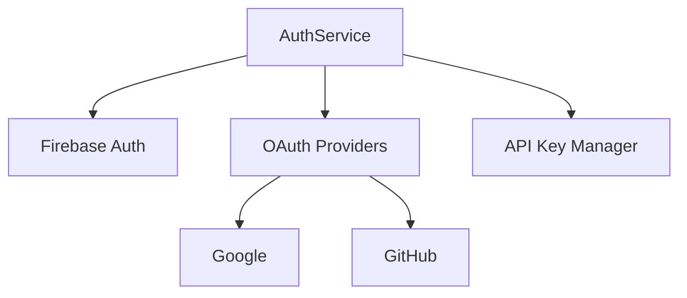

# Adding a Wiki Agent to Potpie

Complete guide to implementing a Wiki Generation Agent that creates wiki pages from code.

---

## 🎯 What is a Wiki Agent?

A specialized agent that:
- ✅ Analyzes code modules/classes/functions
- ✅ Generates comprehensive documentation
- ✅ Creates wiki-style pages (Markdown/Confluence/etc.)
- ✅ Organizes documentation hierarchically
- ✅ Cross-links related code
- ✅ Exports to wiki platforms

---

## 📊 Agent Pattern Analysis

### **Existing Agent Structure:**

All agents follow this pattern:

```python
class MyAgent(ChatAgent):
    def __init__(self, llm_provider, tools_provider, prompt_provider):
        self.llm_provider = llm_provider
        self.tools_provider = tools_provider
        self.prompt_provider = prompt_provider
    
    def _build_agent(self) -> ChatAgent:
        # Configure agent
        agent_config = AgentConfig(...)
        tools = self.tools_provider.get_tools([...])
        
        # Return Pydantic agent
        return PydanticRagAgent(...)
    
    async def run(self, ctx: ChatContext):
        return await self._build_agent().run(ctx)
    
    async def run_stream(self, ctx: ChatContext):
        async for chunk in self._build_agent().run_stream(ctx):
            yield chunk
```

---

## 🏗️ Wiki Agent Design

### **Core Capabilities:**

1. **Code Analysis**
   - Query knowledge graph for modules/classes
   - Extract docstrings and comments
   - Analyze relationships and dependencies

2. **Documentation Generation**
   - Create structured documentation
   - Generate API references
   - Add code examples
   - Create diagrams (Mermaid/PlantUML)

3. **Wiki Organization**
   - Hierarchical page structure
   - Cross-references between pages
   - Index/navigation pages
   - Search-friendly formatting

4. **Export Formats**
   - Markdown files
   - Confluence pages (via API)
   - GitHub Wiki
   - Custom formats

---

## 💻 Implementation Guide

### **Step 1: Create the Agent File**

**Location:** `app/modules/intelligence/agents/chat_agents/system_agents/wiki_agent.py`

```python
from app.modules.intelligence.agents.chat_agents.agent_config import (
    AgentConfig,
    TaskConfig,
)
from app.modules.intelligence.agents.chat_agents.pydantic_agent import PydanticRagAgent
from app.modules.intelligence.agents.chat_agents.pydantic_multi_agent import (
    PydanticMultiAgent,
    AgentType as MultiAgentType,
)
from app.modules.intelligence.agents.chat_agents.multi_agent.agent_factory import (
    create_integration_agents,
)
from app.modules.intelligence.agents.multi_agent_config import MultiAgentConfig
from app.modules.intelligence.prompts.prompt_service import PromptService
from app.modules.intelligence.provider.provider_service import ProviderService
from app.modules.intelligence.tools.tool_service import ToolService
from ...chat_agent import ChatAgent, ChatAgentResponse, ChatContext
from typing import AsyncGenerator
from app.modules.utils.logger import setup_logger

logger = setup_logger(__name__)


class WikiAgent(ChatAgent):
    """
    Agent specialized in generating wiki documentation from code.
    
    Capabilities:
    - Analyze code modules and generate comprehensive documentation
    - Create hierarchical wiki page structures
    - Generate API references with examples
    - Export to multiple formats (Markdown, Confluence, etc.)
    - Cross-link related documentation
    """
    
    def __init__(
        self,
        llm_provider: ProviderService,
        tools_provider: ToolService,
        prompt_provider: PromptService,
    ):
        self.llm_provider = llm_provider
        self.tools_provider = tools_provider
        self.prompt_provider = prompt_provider

    def _build_agent(self) -> ChatAgent:
        agent_config = AgentConfig(
            role="Documentation Specialist",
            goal="Generate comprehensive, well-structured wiki documentation from code",
            backstory="""
                You are a technical documentation expert who excels at creating clear,
                comprehensive wiki pages from codebases. You understand how to analyze code,
                extract meaningful information, and present it in an accessible format.
                Your documentation is always well-organized, includes examples, and helps
                developers understand both the 'what' and the 'why' of the code.
            """,
            tasks=[
                TaskConfig(
                    description=wiki_task_prompt,
                    expected_output="Comprehensive wiki documentation in requested format",
                )
            ],
        )
        
        # Tools for wiki generation
        tools = self.tools_provider.get_tools([
            # Code analysis tools
            "get_code_from_multiple_node_ids",
            "get_node_neighbours_from_node_id",
            "get_code_from_probable_node_name",
            "ask_knowledge_graph_queries",
            "get_nodes_from_tags",
            "analyze_code_structure",
            "fetch_file",
            
            # Documentation tools
            "create_confluence_page",  # If available
            "webpage_extractor",  # For examples
            "web_search_tool",  # For best practices
            
            # Utility tools
            "think",
            "bash_command",  # For file operations
        ])

        supports_pydantic = self.llm_provider.supports_pydantic("chat")
        should_use_multi = MultiAgentConfig.should_use_multi_agent("wiki_agent")

        logger.info(
            f"WikiAgent: supports_pydantic={supports_pydantic}, should_use_multi={should_use_multi}"
        )

        if supports_pydantic:
            if should_use_multi:
                logger.info("✅ Using PydanticMultiAgent for Wiki generation")
                
                # Delegate agents for specialized tasks
                integration_agents = create_integration_agents()
                delegate_agents = {
                    MultiAgentType.THINK_EXECUTE: AgentConfig(
                        role="Documentation Writer",
                        goal="Create clear, comprehensive documentation with examples",
                        backstory="Expert technical writer who makes complex code understandable",
                        tasks=[
                            TaskConfig(
                                description="Generate well-structured wiki documentation",
                                expected_output="Comprehensive wiki pages in requested format",
                            )
                        ],
                        max_iter=25,
                    ),
                    **integration_agents,
                }
                
                return PydanticMultiAgent(
                    self.llm_provider,
                    agent_config,
                    tools,
                    None,
                    delegate_agents,
                    tools_provider=self.tools_provider,
                )
            else:
                logger.info("Using PydanticRagAgent for Wiki generation")
                return PydanticRagAgent(self.llm_provider, agent_config, tools)
        else:
            logger.error(
                f"Model '{self.llm_provider.chat_config.model}' does not support Pydantic"
            )
            return PydanticRagAgent(self.llm_provider, agent_config, tools)

    async def _enriched_context(self, ctx: ChatContext) -> ChatContext:
        """Enrich context with project structure information."""
        
        # Get file structure
        file_structure = (
            await self.tools_provider.file_structure_tool.fetch_repo_structure(
                ctx.project_id
            )
        )
        ctx.additional_context += f"\nProject File Structure:\n{file_structure}\n"
        
        # If specific nodes requested, get their code
        if ctx.node_ids and len(ctx.node_ids) > 0:
            code_results = await self.tools_provider.get_code_from_multiple_node_ids_tool.run_multiple(
                ctx.project_id, ctx.node_ids
            )
            ctx.additional_context += f"\nTarget Code for Documentation:\n{code_results}\n"
        
        return ctx

    async def run(self, ctx: ChatContext) -> ChatAgentResponse:
        return await self._build_agent().run(await self._enriched_context(ctx))

    async def run_stream(
        self, ctx: ChatContext
    ) -> AsyncGenerator[ChatAgentResponse, None]:
        ctx = await self._enriched_context(ctx)
        async for chunk in self._build_agent().run_stream(ctx):
            yield chunk


# Task prompt for wiki generation
wiki_task_prompt = """
WIKI DOCUMENTATION GENERATION GUIDE

IMPORTANT: Follow this systematic approach to generate comprehensive wiki documentation:

1. UNDERSTAND THE SCOPE
   - Clarify what needs to be documented (module, class, function, or entire project)
   - Determine the target audience (developers, users, contributors)
   - Identify the output format (Markdown, Confluence, GitHub Wiki, etc.)

2. CODE ANALYSIS WORKFLOW
   a. Use AskKnowledgeGraphQueries to find relevant code components
   b. Use GetCodeFromProbableNodeName to get specific classes/functions
   c. Use AnalyzeCodeStructure to understand file organization
   d. Use GetNodeNeighbours to find dependencies and relationships
   e. Use FetchFile to get complete context when needed

3. DOCUMENTATION STRUCTURE
   Create wiki pages with the following sections:

   For MODULES/PACKAGES:
   - Overview and purpose
   - Architecture diagram (Mermaid/text-based)
   - Key components list
   - Dependencies
   - Getting started guide
   - API reference
   - Examples
   - Related modules

   For CLASSES:
   - Class purpose and responsibilities
   - Constructor parameters
   - Public methods with signatures
   - Properties/attributes
   - Usage examples
   - Related classes
   - Implementation notes

   For FUNCTIONS/METHODS:
   - Purpose and behavior
   - Parameters (with types and descriptions)
   - Return value
   - Exceptions/errors
   - Code examples
   - Performance notes
   - Related functions

4. CONTENT GUIDELINES
   - Extract and preserve existing docstrings
   - Add context that code alone doesn't show
   - Include practical examples
   - Explain WHY, not just WHAT
   - Cross-reference related documentation
   - Add diagrams for complex flows
   - Include common pitfalls/gotchas

5. FORMATTING STANDARDS
   - Use clear headings (##, ###)
   - Code blocks with syntax highlighting
   - Tables for parameter lists
   - Bullet points for lists
   - Links for cross-references
   - Consistent terminology

6. EXAMPLES QUALITY
   - Show common use cases
   - Include complete, runnable examples
   - Demonstrate best practices
   - Cover edge cases
   - Add comments explaining key points

7. ORGANIZATION
   - Create a logical page hierarchy
   - Generate an index/navigation page
   - Add breadcrumbs for navigation
   - Link related pages
   - Tag pages for searchability

8. EXPORT FORMAT
   Based on the requested format, structure output as:
   
   MARKDOWN:
   ```markdown
   # Page Title
   
   ## Overview
   [Description]
   
   ## API Reference
   ### ClassName
   ...
   ```
   
   CONFLUENCE:
   - Use Confluence markup
   - Create page hierarchy
   - Add labels/tags
   - Use macros (code, info, warning)
   
   GITHUB WIKI:
   - Follow GitHub Wiki conventions
   - Create _Sidebar.md for navigation
   - Use relative links

9. QUALITY CHECKS
   - Verify all code examples are accurate
   - Ensure cross-references work
   - Check for consistency
   - Validate technical accuracy
   - Test readability

10. OUTPUT FORMAT
    Structure your response as:
    
    ```
    # WIKI PAGE: [Title]
    
    [Full wiki content in requested format]
    
    ---
    
    # METADATA
    - Pages created: [number]
    - Cross-references: [number]
    - Code examples: [number]
    - Recommended hierarchy: [structure]
    ```

Use the provided tools to thoroughly analyze the code and create documentation that
is accurate, comprehensive, and helpful for the target audience.
"""
```

---

### **Step 2: Register the Agent**

**Edit:** `app/modules/intelligence/agents/agents_service.py`

Add the import:
```python
from .chat_agents.system_agents import (
    blast_radius_agent,
    code_gen_agent,
    debug_agent,
    integration_test_agent,
    low_level_design_agent,
    qna_agent,
    unit_test_agent,
    wiki_agent,  # ← ADD THIS
)
```

Add to `_system_agents()` method:
```python
def _system_agents(self, llm_provider, prompt_provider, tools_provider):
    return {
        # ... existing agents ...
        "wiki_agent": AgentWithInfo(
            id="wiki_agent",
            name="Wiki Documentation Agent",
            description="Generate comprehensive wiki documentation from code. Creates structured pages with API references, examples, and diagrams.",
            agent=wiki_agent.WikiAgent(
                llm_provider, tools_provider, prompt_provider
            ),
        ),
    }
```

---

### **Step 3: Update Agent Exports**

**Edit:** `app/modules/intelligence/agents/chat_agents/system_agents/__init__.py`

```python
from . import (
    blast_radius_agent,
    code_gen_agent,
    debug_agent,
    general_purpose_agent,
    integration_test_agent,
    low_level_design_agent,
    qna_agent,
    sweb_debug_agent,
    unit_test_agent,
    wiki_agent,  # ← ADD THIS
)

__all__ = [
    "blast_radius_agent",
    "code_gen_agent",
    "debug_agent",
    "general_purpose_agent",
    "integration_test_agent",
    "low_level_design_agent",
    "qna_agent",
    "sweb_debug_agent",
    "unit_test_agent",
    "wiki_agent",  # ← ADD THIS
]
```

---

### **Step 4: Add CLI Support**

**Edit:** `potpie_cli.py`

Add wiki agent to the agents list:
```python
@cli.command()
@click.option('--agent', '-a', 
              type=click.Choice([
                  'codebase_qna_agent',
                  'code_generation_agent', 
                  'debugging_agent',
                  'wiki_agent',  # ← ADD THIS
                  # ... others
              ]),
              default='codebase_qna_agent')
def chat(agent):
    """Interactive chat with agent"""
    ...
```

---

### **Step 5: Test the Agent**

```bash
# Test via CLI
python ./potpie_cli.py chat -p <project-id> -a wiki_agent

# Test via Web UI
# The agent will appear in "Choose Your Expert" dropdown
```

**Example queries:**
- "Generate wiki documentation for the AuthService module"
- "Create API reference for all agents"
- "Document the parsing system with examples"
- "Generate a getting started guide for developers"

---

## 🎯 Advanced Features

### **1. Confluence Integration**

If you have Confluence OAuth configured:

```python
# The agent can use create_confluence_page tool
tools = [..., "create_confluence_page", "update_confluence_page"]

# In the prompt:
"Export documentation to Confluence space <space-key>"
```

### **2. Diagram Generation**

```python
# Add to task prompt:
"""
Generate Mermaid diagrams for:
- Class hierarchies
- Sequence diagrams for key flows
- Architecture overviews
"""
```

### **3. Batch Documentation**

```python
# Query:
"Generate wiki pages for all modules in app/modules/intelligence/"

# Agent will:
# 1. Find all modules
# 2. Generate page for each
# 3. Create index page with links
# 4. Return as ZIP or multiple files
```

### **4. Custom Templates**

Create wiki templates in `app/modules/intelligence/prompts/`:

```python
# wiki_templates.py
MODULE_TEMPLATE = """
# {module_name}

## Overview
{overview}

## Components
{components}

## Dependencies
{dependencies}

## Examples
{examples}
"""
```

---

## 📊 Expected Output Example

```markdown
# AuthService Module

## Overview
The AuthService module provides authentication and authorization functionality
for the Potpie application, supporting multiple providers including Firebase,
OAuth, and API keys.

## Architecture



## Classes

### AuthService

**Purpose:** Main authentication service handling user login, registration, and session management.

**Constructor:**
```python
AuthService(db: Database, config: AuthConfig)
```

**Parameters:**
- `db` (Database): Database connection
- `config` (AuthConfig): Authentication configuration

**Methods:**

#### login(email: str, password: str) -> User
Authenticates a user with email and password.

**Parameters:**
- `email` (str): User's email address
- `password` (str): User's password

**Returns:** User object if authentication successful

**Raises:**
- `AuthenticationError`: If credentials are invalid
- `UserNotFoundError`: If user doesn't exist

**Example:**
```python
auth_service = AuthService(db, config)
try:
    user = await auth_service.login("user@example.com", "password123")
    print(f"Logged in as {user.name}")
except AuthenticationError:
    print("Invalid credentials")
```

...

## Related Documentation
- [User Management](./user-management.md)
- [OAuth Configuration](./oauth-setup.md)
- [API Reference](./api-reference.md)
```

---

## 🚀 Implementation Checklist

- [ ] Create `wiki_agent.py` in system_agents/
- [ ] Define WikiAgent class
- [ ] Create comprehensive task prompt
- [ ] Register in agents_service.py
- [ ] Update __init__.py exports
- [ ] Add CLI support (optional)
- [ ] Test with sample queries
- [ ] Document usage in AGENTS_GUIDE.md
- [ ] Add to potpie-ui dropdown
- [ ] Create example wiki pages

---

## 📝 Summary

**To add a Wiki Agent:**

1. **Create agent file** - `wiki_agent.py` following pattern
2. **Register agent** - Add to `agents_service.py`
3. **Export agent** - Update `__init__.py`
4. **Test** - Via CLI or Web UI
5. **Document** - Update guides

**Effort:** ~4-6 hours for complete implementation

**Value:** Automated wiki generation from code!

