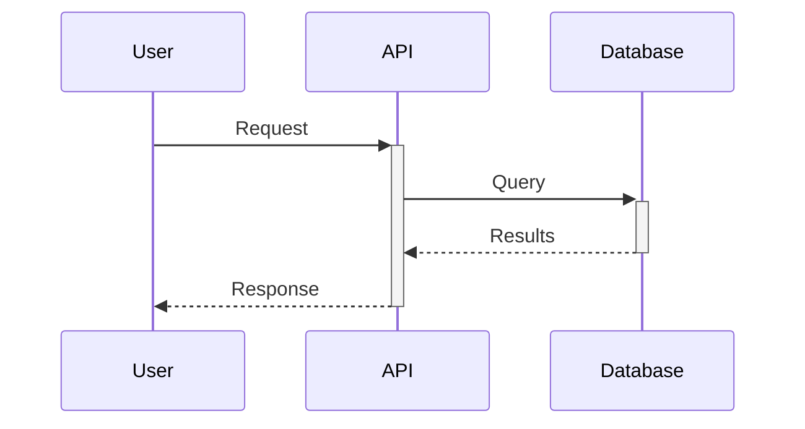

# DeepWiki Integration in Wiki Agent

This document explains how DeepWiki's proven prompts were integrated into Potpie's Wiki Agent.

---

## 🎯 What is DeepWiki?

**DeepWiki** (https://github.com/JasonTheDeveloper/deepwiki-open) is an open-source system that generates comprehensive, professional wiki documentation for code repositories using LLMs.

**Key Features:**
- Extensive Mermaid diagram generation
- Source file citations
- Multi-language support
- Professional formatting standards
- Proven prompt engineering

---

## 🔄 Integration Approach

We analyzed DeepWiki's `prompts.py` and `repo_wiki_gen.py` to extract their best practices and integrated them into Potpie's Wiki Agent.

### **What We Adopted:**

1. **Source File Disclosure**
   - Start every wiki page with `<details>` block listing ALL source files
   - Transparency about documentation sources
   - Minimum 5 files requirement

2. **Mermaid Diagram Guidelines**
   - EXTENSIVE use required (minimum 3 diagrams)
   - Strict vertical orientation (TD, not LR)
   - Detailed sequence diagram syntax (8 arrow types)
   - All diagram types supported (flowchart, sequence, class, ER, state)

3. **Source Citations**
   - Cite EVERY significant piece of information
   - Format: `Sources: [file.py:10-25]()`
   - Minimum 5 different files cited throughout

4. **Professional Formatting**
   - No preamble or markdown fences
   - Structured sections (##, ###)
   - Tables for structured data
   - Code snippets with language identifiers

5. **Quality Checklist**
   - Built-in verification checklist
   - Ensures consistency and completeness

---

## 📊 Comparison: Before vs After

| Aspect | Original Potpie Prompt | Enhanced with DeepWiki |
|--------|------------------------|------------------------|
| **Diagram Guidelines** | Basic mention | Extensive (3+ diagrams required) |
| **Source Citations** | Not emphasized | CRITICAL - every section |
| **File Disclosure** | Not required | First thing on every page |
| **Diagram Orientation** | Not specified | Strict vertical (TD) only |
| **Sequence Diagrams** | Basic | 8 arrow types, detailed syntax |
| **Quality Checks** | Informal | Built-in checklist |
| **Examples** | Minimal | Complete example output |
| **Length** | ~160 lines | ~250 lines (more detailed) |

---

## 🎨 Key Prompt Features

### **1. Strict Formatting Requirements**

```markdown
<details>
<summary>Relevant source files</summary>

- [auth/service.py](auth/service.py)
- [auth/models.py](auth/models.py)
...
</details>

# Authentication System

## Overview
...
Sources: [auth/service.py:1-50]()
```

### **2. Mermaid Diagram Standards**

**Sequence Diagram Example:**


**Arrow Types:**
- `->>` solid with arrow (requests)
- `-->>` dotted with arrow (responses)
- `->x` error
- `->>+` activate
- `-->>-` deactivate

### **3. Source Citation Format**

- Single line: `Sources: [file.py:42]()`
- Range: `Sources: [file.py:10-25]()`
- Multiple: `Sources: [file1.py:10](), [file2.py:45]()`

---

## 🔧 Technical Implementation

### **File Modified:**
`app/modules/intelligence/agents/chat_agents/system_agents/wiki_agent.py`

### **Changes:**
1. Replaced `wiki_task_prompt` with DeepWiki-enhanced version
2. Added attribution to DeepWiki
3. Integrated all best practices
4. Maintained Potpie's tool usage workflow

### **Lines of Code:**
- Original prompt: ~160 lines
- Enhanced prompt: ~250 lines
- Total file: 413 lines

---

## 📚 DeepWiki's Prompt Structure

DeepWiki uses these prompts (from `api/prompts.py`):

1. **RAG_SYSTEM_PROMPT** - For Q&A with code context
2. **DEEP_RESEARCH_*_ITERATION_PROMPT** - Multi-turn research
3. **SIMPLE_CHAT_SYSTEM_PROMPT** - Direct code queries
4. **create_page_content_prompt()** - Wiki page generation (what we adopted)
5. **create_wiki_structure_prompt()** - Wiki structure planning

We focused on #4 (page content generation) as it's most relevant to Potpie's Wiki Agent.

---

## 🎯 Benefits for Potpie

### **Improved Documentation Quality:**
- ✅ More diagrams (minimum 3 vs optional before)
- ✅ Better traceability (source citations)
- ✅ Professional formatting (DeepWiki standards)
- ✅ Consistent structure (enforced checklist)

### **Better Developer Experience:**
- ✅ Clear source file disclosure
- ✅ Visual diagrams for complex flows
- ✅ Accurate citations for verification
- ✅ Professional, readable output

### **Proven Approach:**
- ✅ Based on successful open-source project
- ✅ Battle-tested prompts
- ✅ Active community feedback
- ✅ Regular improvements

---

## 📖 Example Output

See `ADDING_WIKI_AGENT_GUIDE.md` for complete example output following DeepWiki standards.

Key features in output:
- `<details>` block with 5+ source files
- H1 title
- 3+ Mermaid diagrams (flowchart, sequence, class)
- Tables for structured data
- Source citations throughout
- Professional summary

---

## 🔗 References

- **DeepWiki Repository:** https://github.com/JasonTheDeveloper/deepwiki-open
- **DeepWiki Prompts:** `api/prompts.py`
- **Wiki Generation Logic:** `api/repo_wiki_gen.py`
- **Potpie Wiki Agent:** `app/modules/intelligence/agents/chat_agents/system_agents/wiki_agent.py`

---

## 🙏 Attribution

The Wiki Agent's prompt is adapted from DeepWiki's proven wiki generation system.
Credit to the DeepWiki team for their excellent prompt engineering and open-source contribution.

**License:** DeepWiki is MIT licensed, allowing this integration.

---

## 📝 Summary

We've integrated DeepWiki's professional wiki generation prompts into Potpie's Wiki Agent,
bringing proven best practices for:
- Extensive diagram generation
- Source file transparency
- Comprehensive citations
- Professional formatting
- Quality assurance

This makes Potpie's Wiki Agent capable of generating production-quality documentation
that matches or exceeds industry standards.

