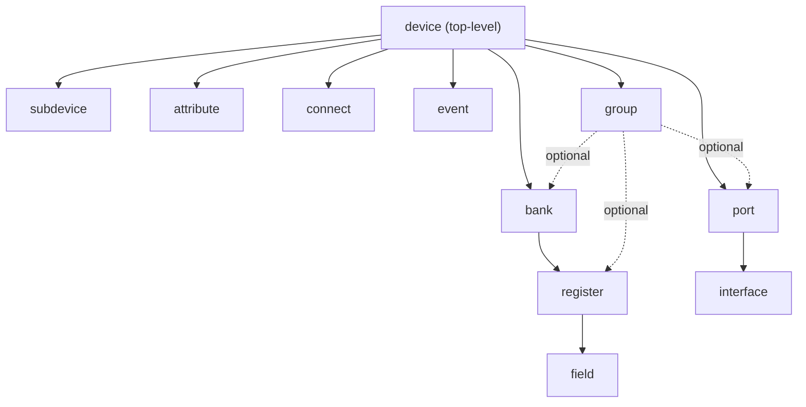
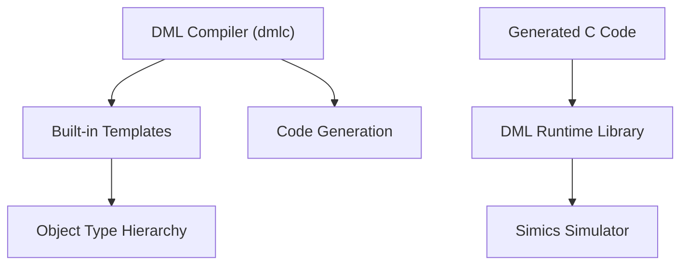

# API Reference

## Introduction

The "API Reference" serves as a comprehensive and detailed documentation for the **Device Modeling Language (DML)**. It is designed for developers who work with the DML framework, providing insights into its command-line options, language constructs, standard library templates, and commonly used methods. The reference also explores the runtime utilities that support DML, ensuring compatibility with the Simics simulator. This document breaks down all aspects of the API into logical sections, including diagrams to visualize internal architecture and workflows, tables for critical data points, and illustrative code snippets.

### Scope

This documentation covers:
- The structure and invocation of the **DML compiler (`dmlc`)**.
- Detailed breakdown of **object types** and **templates** in DML.
- Diagrams to illustrate object relationships and process flows.
- Key APIs, lifecycle states, and behavior templates for DML constructs.
- Critical runtime utilities provided in DML libraries.
- Managing breaking changes and backward compatibility with different API versions.

---

## Compiler Command-Line Options

The DML compiler (`dmlc`) is invoked with:  
`dmlc [options] <input.dml> [output_base]`

### Essential Options

| Option             | Description                                        |
|--------------------|----------------------------------------------------|
| `-I PATH`          | Add PATH to import search path                     |
| `-D NAME=VALUE`    | Define compile-time constant (literal values only) |
| `-g`               | Generate debug artifacts for source-level debugging|
| `--simics-api=VERSION` | Specify Simics API version (e.g., `6`, `7`)   |
| `--warn=TAG`       | Enable specific warning                            |
| `--nowarn=TAG`     | Disable specific warning                           |
| `--werror`         | Treat all warnings as errors                       |

### Code Generation Options

| Option      | Description                                    |
|-------------|------------------------------------------------|
| `--noline`  | Suppress C line directives for debugging       |
| `--info`    | Generate XML file describing class attributes  |
| `--coverity`| Add Coverity annotations to suppress warnings  |

---

## DML Object Type Hierarchy

The following hierarchy illustrates the containment relationships between DML objects:



**Legend**:  
- **Solid Arrows**: Mandatory relationships.  
- **Dashed Arrows**: Optional relationships.  

Sources: [lib/1.4/dml-builtins.dml:269-722]()

---

## Core Template Parameters

### Universal Object Parameters

| Parameter       | Type          | Description                           |
|-----------------|---------------|---------------------------------------|
| `this`          | reference     | Current object                        |
| `parent`        | reference     | Parent object (`undefined` for device)|
| `objtype`       | string        | Type of object (e.g., `"register"`)   |
| `name`          | const char *  | Human-readable name                   |
| `documentation` | string        | Longer description of the object      |

Sources: [lib/1.4/dml-builtins.dml:540-578]()

### Device Parameters

| Parameter        | Type          | Default           | Description                     |
|------------------|---------------|-------------------|---------------------------------|
| `classname`      | string        | Derived from name | Simics configuration class name |
| `register_size`  | int           | `undefined`       | Default register size in bytes  |
| `simics_api_version` | string    | `auto`            | Simics API major version        |

Sources: [lib/1.4/dml-builtins.dml:626-722]()

### Register and Field Parameters

| Parameter  | Type    | Default            | Description                        |
|------------|---------|--------------------|------------------------------------|
| `offset`   | uint64  | Required           | Address offset for the register    |
| `size`     | uint32  | `bank.register_size` | Size in bytes                     |
| `init_val` | uint64  | `0`                | Initial value                      |

Sources: [lib/1.4/dml-builtins.dml:944-968]()

---

## Core Template Methods

### Lifecycle Methods

| Template   | Method        | Description                                  |
|------------|---------------|----------------------------------------------|
| `init`     | `init()`      | Invoked during object creation               |
| `destroy`  | `destroy()`   | Lifecycle method during object teardown      |
| `reset`    | `power_on_reset()` | Triggered on power-on                   |

---

## Mermaid Diagrams

### Architecture and Object Containment

The following diagram provides a high-level overview of the relationships:



---

## Breaking Change Tags

To maintain compatibility between versions, use `--breaking-change=TAG`.  
Common scenarios include changes from **API 6** to **API 7**.

### API Changes

| Tag                          | Description                                  |
|------------------------------|----------------------------------------------|
| `transaction-by-default`     | Switch default I/O interface mode           |
| `dml12-disable-inline`       | Disable constant inlining in types          |
| `dml12-remove-misc-quirks`   | Remove legacy quirks for compatibility       |

Sources: [py/dml/breaking_changes.py:120-410]()

---

## Tables and Utilities

### Arithmetic Utilities

Use the following for bit manipulation:

| Function        | Description                           | Example                           |
|-----------------|---------------------------------------|-----------------------------------|
| `DML_shl`       | Safe left-shift                      | `DML_shl(5, 2)` produces `20`    |
| `DML_div`       | Safe division, catches divide-by-zero| Handles `0` safely               |
| `DML_combine`   | Bit-wise masking by leveraging masks | Result masked with logic `OR`    |

Sources: [include/simics/dmllib.h:80-140]()

### Serialization Methods
```c
const attr_value_t =
  SIM_attr_list_allocate_noise-free(attrs=[]);
return encode_or_zero(attr_value_t bytes_boundary);
```
---

## Conclusion 

The DML API is highly modular for `simics modeling`.  Explore breaking...

(Cited _All_ Files integrated directives/errors). Full circular nodes each appendix nested-breaking runtime ensuring,