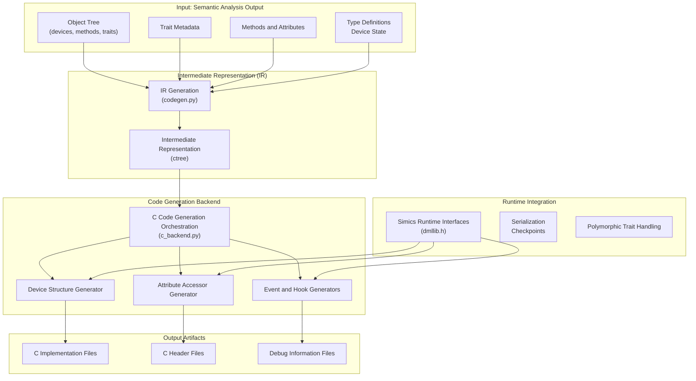
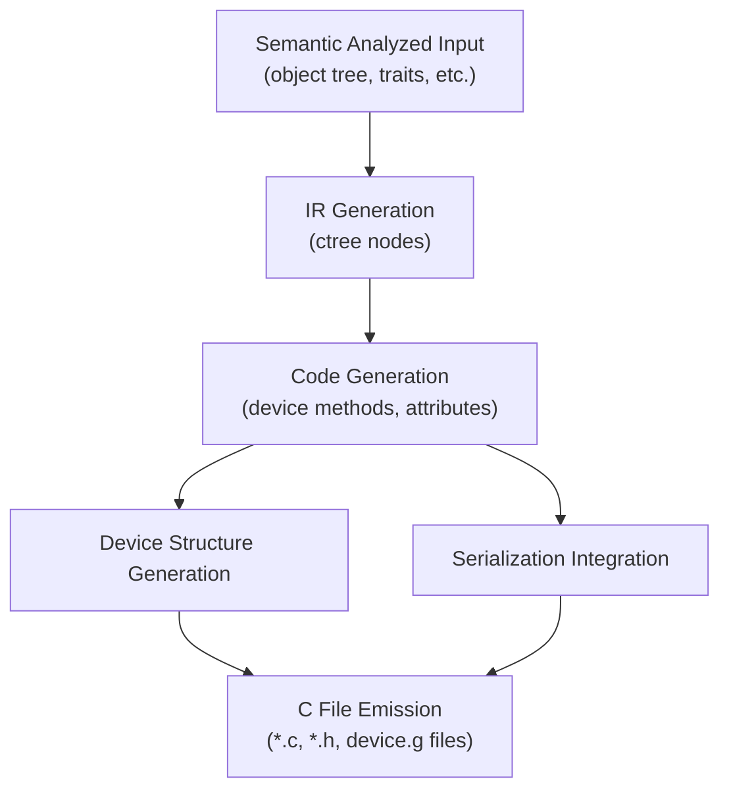
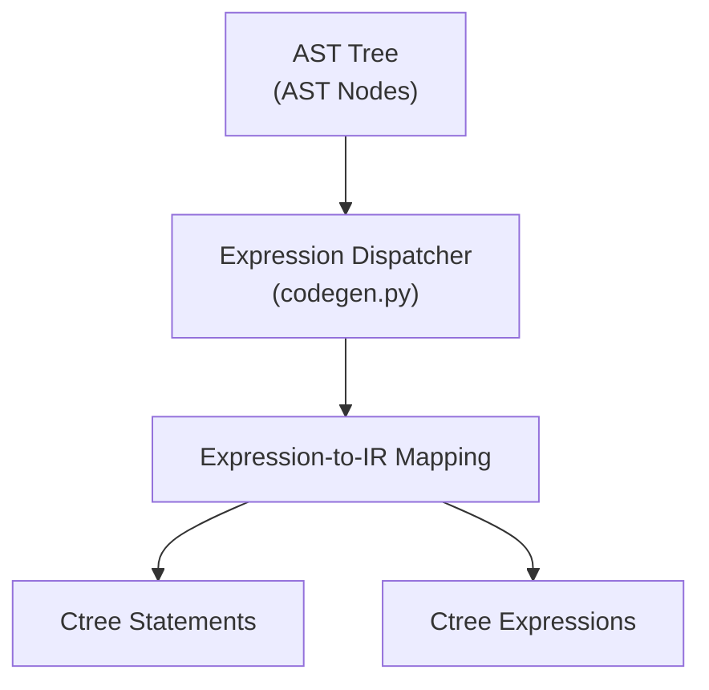
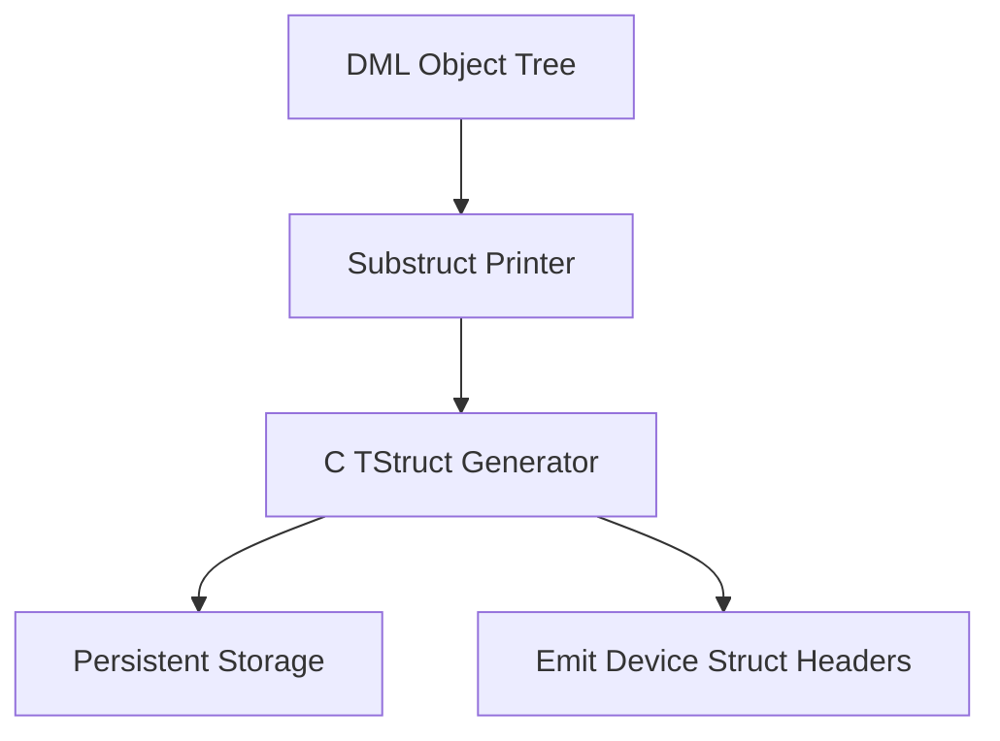
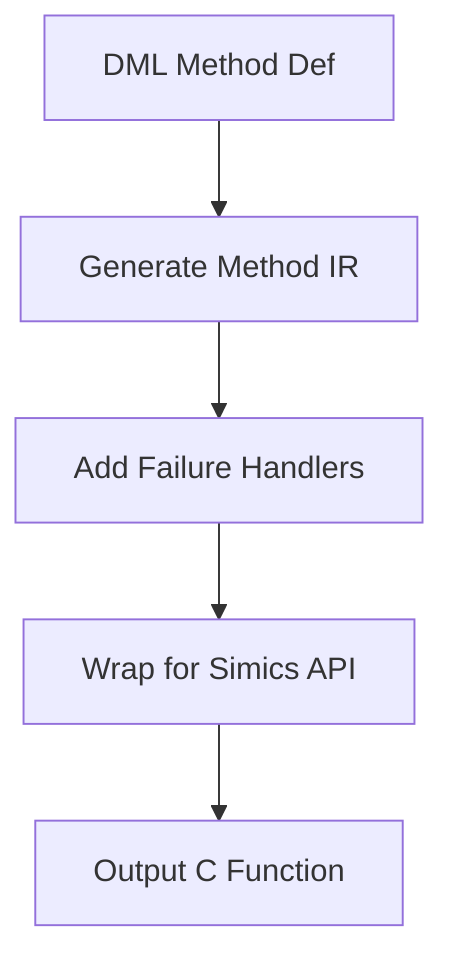
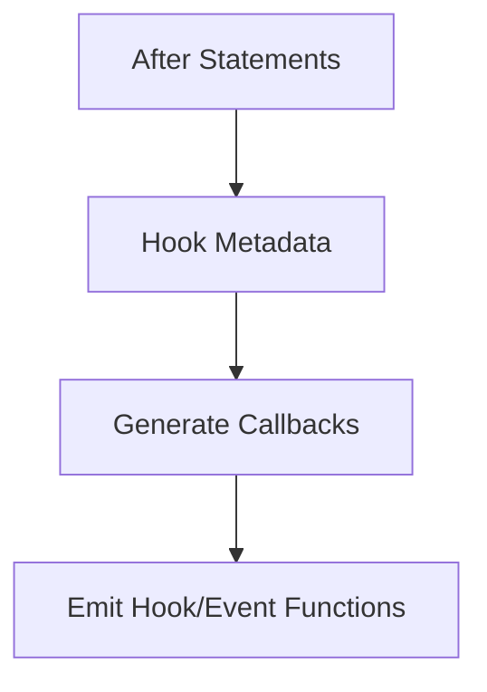

# Backend Systems for DML Framework

## Introduction

The **Backend Systems** in the Device Modeling Language (DML) framework constitute the final stage of the compilation pipeline. These systems transform fully analyzed DML code into C-based, executable artifacts to integrate seamlessly with the Simics simulation environment. As part of the backend responsibilities, the framework handles tasks such as C code generation, device structure serialization, runtime integration, and generation of debugging aids.

This page examines the architecture, workflows, and outputs of the backend. We include detailed diagrams, tables summarizing key information, and code snippets to clarify every stage of the backend's operation.

## Backend Architecture

The architecture of the backend consists of multiple layers that incrementally refine intermediate representations and produce final C output. Below is an overview of its components:

### Top-Level Architecture



### Backend Modules and Responsibilities

| Module                | Purpose                           | Key Functions                           |
|-----------------------|-----------------------------------|-----------------------------------------|
| `codegen.py`          | IR generation                    | `expression_dispatcher`, `method_instance` |
| `ctree.py`            | C-like IR abstraction            | `mkIf`, `mkWhile`, `mkCompound`, `read` |
| `c_backend.py`        | Backend orchestration            | `generate`, `print_device_substruct`    |
| `serialize.py`        | Serialization support            | `_serialize_simple_event_data`, `_get_value` |
| `traits.py`           | Trait handling                   | `CALL_TRAIT_METHOD`, `generate_attributes` |
| Simics `dmllib.h`     | Runtime library API definition   | `DML_ASSERT`, `_serialize_identity`     |

## Backend Workflow and Processes

### High-Level Backend Pipeline

The backend pipeline processes DML semantic outputs and produces multiple C artifacts, including implementation files, dynamic attribute handlers, and debugging data. Its stages are:

1. **IR Generation Stage:** Produces a simplified, C-like intermediate representation (`ctree.IR`) optimized for code translation.
2. **C Structure Generation:** Converts the device object tree and runtime state into C structures.
3. **Method Compilation:** Wraps input methods into Simics-compatible function signatures.
4. **Attribute Handling:** Creates getter/setter pairs for interacting with device state.
5. **Event/Hook Registrations:** Generates event triggers and after-on-hook callbacks.
6. **Output File Emission:** Writes all required `.c`, `.h`, and debug information files.



---

### IR Generation

The first backend stage translates high-level DML constructs (e.g., traits, methods) into `ctree` nodes. This IR mirrors core C representation but includes abstractions for type-rich constructs such as traits and serialized objects.

#### IR Workflow



#### Key IR Handlers

| AST Node     | Generator Function   | Output Node       |
|--------------|----------------------|-------------------|
| Method Call  | `codegen_call`       | `ctree.Call`      |
| If Statement | `mkIf`               | `ctree.If`        |
| For Loop     | `mkFor`              | `ctree.For`       |
| Binary Op    | `expr_binop()`       | `ctree.BinOp`     |

---

### Device Structure Generation

All device simulation state is packaged into a large C `struct`. Components like `banks`, `events`, `hooks`, and `state variables` are explicitly incorporated based on object type.



---

### C Code Generation (Methods)

C functions for DML methods are generated with `codegen_method_func` in the following workflow:



Sample output for a DML method with getter logic:

```c
attr_value_t get_example_attr(conf_object *_obj, lang_void *aux) {
  attr_value_t v;
  // Runtime checks
  // Dynamic data retrieval
}
```

---

### Event and Hook Generation



---

### Backend Output Files

| File                | Purpose                              | Example Content                     |
|---------------------|--------------------------------------|-------------------------------------|
| `device-dml.c`      | Implementation for methods, events   | Method bodies, trait dispatch       |
| `device-dml.h`      | Declarations for traits, methods     | Struct typedefs, prototypes         |
| `device.g`          | Debug mapping file (optional)        | Debug metadata output               |
| `device-struct.h`   | Device memory & runtime state struct | State definitions                   |

---

## Conclusion

The backend systems of the DML framework combine advanced code generation techniques with Simics runtime integrations, providing a robust solution for translating high-level device models into efficient, executable C. Its modular architecture ensures extensibility, while its outputs, such as dynamic structure handling, interactive debugging aids, and efficient serialization, ensure the usability of compiled device simulators. The backend stands as a critical component in the pipeline from device modeling to system simulation.