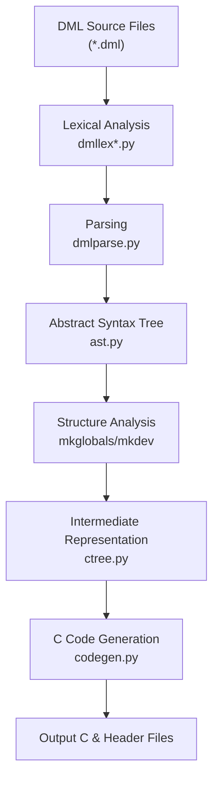
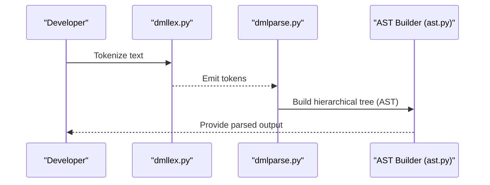
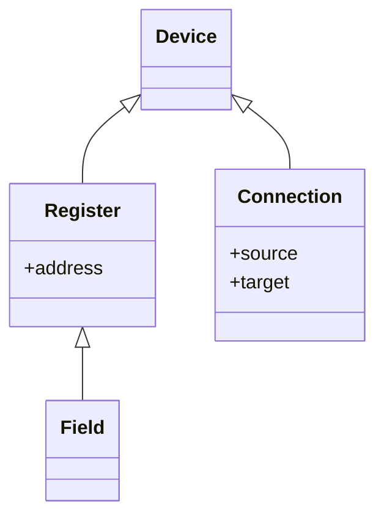
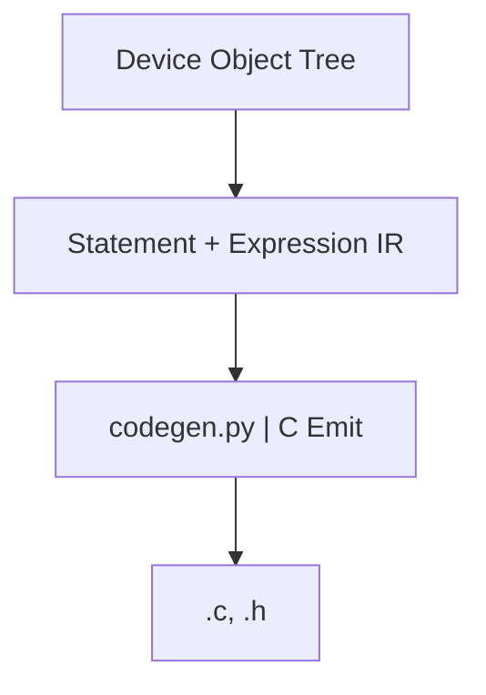
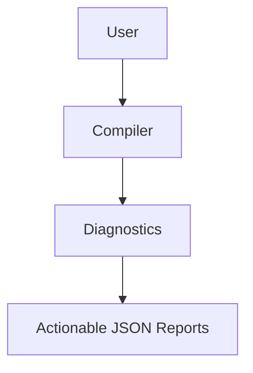

# System Architecture

## Introduction

The "System Architecture" page provides a detailed overview of the internal architecture of the Device Modeling Language (DML) compilation system, which is aimed at simplifying the development of device models for the Simics platform. The architecture outlines how DML source code is transformed into executable C code, providing modularity, extensibility, and diagnostics. Core architectural components, dataflow diagrams, and intermediary steps are detailed herein, with key emphasis on parsing, structure building, code generation, and error diagnostics.

The document also leverages communication between different modules and relationships across components and objects, giving developers a robust understanding of the system's functionality and technical workflows.

---

## Core Components & Phases

### Overview

The DML compiler (`dmlc`) employs a traditional multi-phase architecture divided into three major stages:

- **Frontend (Parsing and Lexing):** Converts source code into an Abstract Syntax Tree (AST).
- **Middle-End (Semantic Analysis):** Builds hierarchical structures for the device model.
- **Backend (Code Generation):** Transforms structures into executable C code.

### Compilation Flow Overview



The transformation flows through lexers, parsers, structure generators, and intermediate representations before producing output files.

Sources: [.deepwiki/22_Compiler_Architecture.md:75](), [.deepwiki-open/Architecture_Overview.md:103]()  

---

## Detailed Sections

### Frontend (Parsing & Lexing)

The **Frontend** is responsible for converting raw source files into an Abstract Syntax Tree (AST), preprocessing imports, and enabling compatibility with DML versions (1.2 and 1.4).

#### Responsibilities:
- **Lexing:** Uses `dmllex*.py` files to tokenize raw source files.
- **Parsing:** Constructs syntax trees from tokenized inputs using `dmlparse.py`.
- **Version Detection:** Identifies the DML version with `toplevel.determine_version()`.

#### Key Components:
- `dmlc.py`: Entry point and orchestrator.
- `toplevel.py`: Import resolution & parsing workflows.
- `ast.py`: Factory functions and node definitions for constructing ASTs.

#### Process Workflow:


Sources: [.deepwiki/22_Compiler_Architecture.md:80]()

### Middle-End (Semantic Analysis)

The **Middle-End**, or Semantic Analysis phase, evaluates parsed inputs and builds intermediate hierarchical structures such as the "Device Object Tree."

#### Responsibilities:
- **Global Variable Resolution:** `mkglobals()` collects typedefs, constants, and settings.
- **Object Tree Construction:** `mkdev()` organizes models into objects like banks, registers, fields, etc.
- **Template Expansion & Type Checking** for defining runtime consistency.

#### Key Structures:
- **Device Object Tree:** Represents device hierarchies and their relationships.
- **Type System:** Implements integer, boolean, array, and custom types.

#### Data Hierarchy:


#### Example Table:
| Function         | Purpose                               | Location  |
|------------------|---------------------------------------|-----------|
| `mkglobals()`    | Collect global symbols               | `structure.py` |
| `mkdev()`        | Build object hierarchies             | `structure.py` |
| `check_types()`  | Perform type consistency validation  | `types.py` |

Sources: [.deepwiki/22_Compiler_Architecture.md:110](), [.deepwiki-open/Component_Relationships.md:71]()

### Backend (Code Generation)

The **Backend** transforms intermediary representations into C code and applies optimizations.

#### Workflow:


#### Features of `ctree` IR:
- **Statements:** Represent high-level control flows like `If`, `For`, or `Switch`.
- **Expressions:** Encapsulate arithmetic operations, logical expressions, and casts.
- **Optimizations:** Constant folding, dead code elimination, statement reordering.

Sources: [.deepwiki-open/Architecture_Overview.md:106]()

---

## Key Data Structures

### Abstract Syntax Tree (AST)

The AST is the compiler's first hierarchical representation, encoding primary details of the source file.

#### Node Types:
| Node Type         | Purpose                               |
|-------------------|---------------------------------------|
| `ast.object`      | Define device objects                |
| `ast.param`       | Represent configurable parameters    |
| `ast.hashif`      | Handle conditional compilation blocks|

Sources: [.deepwiki-open/Component_Relationships.md:89]()

---

## AI Diagnostics

The diagnostics system uses modern AI tools to enhance error reporting and debugging, categorizing errors such as `type_mismatch` or `undefined_symbol`.

#### Data Flow:


Example Output:
```json
{
  "type": "Error",
  "code": "EUNDEF",
  "message": "Undefined symbol"
}
```

Sources: [.deepwiki-open/Architecture_Overview.md:117]()

---

## Conclusion

This document introduced the DML compilation system's architecture, highlighting parsing, structure-building, and output generation. By integrating AI diagnostics and robust modular design, the system ensures high performance and effective outcomes for complex device models. The provided data structures and workflows offer a strong foundation for further development.