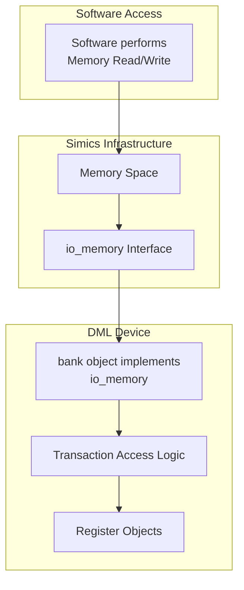

# Data Management and Flow

## Introduction

The "Data Management and Flow" feature in the Device Modeling Language (DML) framework is essential for defining and handling data flows in device models. It integrates memory-mapped I/O mechanisms, parsing, logging, and processing modules that contribute to the development and simulation of hardware models in a simulation environment. This page focuses on providing detailed documentation of the architecture, functionality, and processing workflows associated with data handling in DML.

The documentation explains technical elements such as memory-mapped I/O operations, the organization of parsing and processing logic, and the structure for efficient error handling. The page also includes visualization diagrams, tables, and code snippets to assist readers in comprehending the architecture and workflows.

---

## Memory-Mapped I/O in DML

### Overview

Memory-mapped I/O (MMIO) in DML is a technique used to expose device memory (registers, banks, etc.) to the software through predefined addresses. This mechanism allows software applications to perform read/write operations on device registers via hardware-based transactions. The DML standard library provides support for **direct bank mapping**, **function-based dispatch**, and **memory redirection** for implementing flexible MMIO structures.

---

## Architecture

### Memory I/O Architecture Diagram

### Key Components

| Component   | Responsibility                                        |
|-------------|-------------------------------------------------------|
| `io_memory` | Interface that drives transactions between software and device banks. |
| Banks       | Represented structures exposing device memory registers. |
| Registers   | Actual memory locations within a device.              |
| Handlers    | Define callable read/write mechanisms.                |

---

## Workflow: Data Flow and Processing

The process of data flow in the DML framework involves translating high-level DML definitions into simulation-ready, memory access code. 

### Key Modules

| Module Name     | Input           | Output          | Description                                                         |
|-----------------|-----------------|-----------------|---------------------------------------------------------------------|
| `Lexer`         | Source file     | Tokens          | Tokenizes the input file based on syntax grammar.                   |
| `Parser`        | Lexer tokens    | Abstract Syntax Tree (AST) | Creates structured ASTs representing the source code.               |
| `Logger`        | Errors/Warnings | Log/Output      | Logs syntax, semantic and runtime errors during processing pipeline.|
| `Codegen`       | Abstract Syntax Tree | C-code Structure | Converts structured DML into Simics/C transaction object code. **