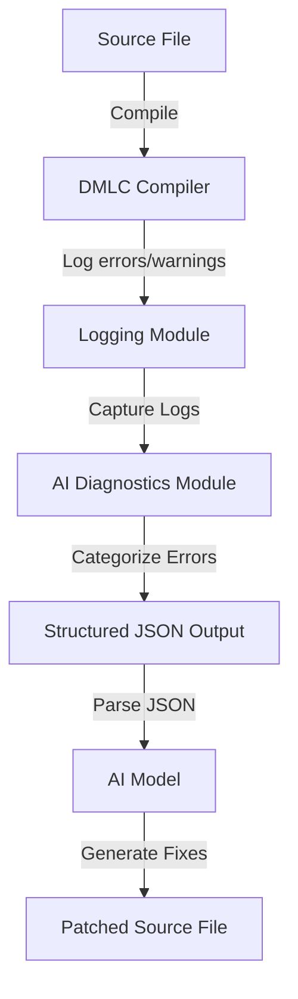
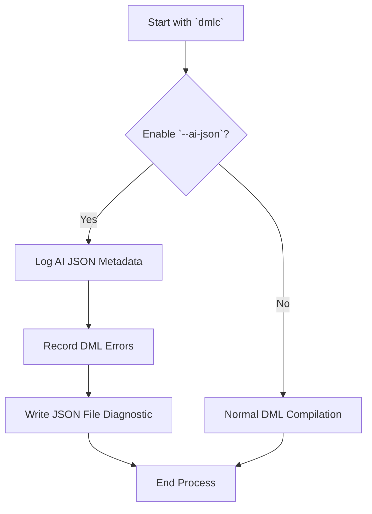

# Model Integration  

## Introduction  

Model Integration within the Device Modeling Language Compiler (DMLC) fosters a seamless union of code diagnostics and AI-assisted resolutions. By exporting diagnostic data (errors and warnings) in a standardized JSON format, this system leverages the power of AI to categorize issues and suggest actionable resolutions. The integration is implemented with minimal disruption to the existing DMLC architecture, ensuring scalability, extensibility, and backwards compatibility.  

This documentation elaborates on the system's architecture, workflows, data structures, and its integration with AI frameworks.  

---

## Architecture  

### Overview  

The system architecture integrates the **`AI Diagnostics`** module into the `DMLC` flow. Key components collaborate to collect, structure, and export diagnostic messages for AI consumption.  

#### Key Modules  

1. **AI Diagnostics Module (`ai_diagnostics.py`)**:  
   - Encapsulates diagnostic messages via the `AIDiagnostic` class.  
   - Categorizes errors with `ErrorCategory` for targeted fixes.  
   - Offers fix suggestions and exports structured data in JSON format.  
   - Implements `AIFriendlyLogger` to ensure seamless data flow to AI models.  

2. **DML Compiler (`dmlc.py`)**:  
   - Introduces the `--ai-json` command-line interface (CLI) flag.  
   - Ensures diagnostics are directed to the AI module during compilation.  

3. **Logging Integration (`logging.py`)**:  
   - Hooks into the centralized `report()` function to manage all error/warning capture.  

---

### High-Level Data Flow  



Sources: [.deepwiki-open/Integration_with_AI_Models.md:39](), [.deepwiki-open/AI_Diagnostics_Integration.md:35]()  

---

## Error Categorization and Resolution  

### Error Categories  

Each diagnostic message falls into one of ten predefined categories. These categories support systematic error resolution strategies.  

| **Category**          | **Description**                          | **Example Codes**              |  
|------------------------|------------------------------------------|---------------------------------|  
| `syntax`              | Syntax and parsing issues                | `ESYNTAX`, `PARSE`             |  
| `type_mismatch`       | Type incompatibilities                   | `ETYPE`, `ECAST`               |  
| `template_resolution` | Template instantiation errors            | `EAMBINH`, `ECYCLIC`           |  
| `undefined_symbol`    | References to undefined objects          | `EUNDEF`, `EREF`               |  
| `duplicate_definition`| Multiple definitions of the same object  | `EDUP`, `EREDEF`               |  
| `import_error`        | Errors with DML imports or dependencies  | `IMPORT`, `ECYCLIC`            |  
| `semantic`            | Complex semantic or contextual problems  | `General`                      |  
| `compatibility`       | Versioning or feature compatibility      | `ECOMPAT`, `EDML12`            |  
| `deprecation`         | Usage of obsolete functionality          | `WDEPRECATED`                  |  
| `other`               | Miscellaneous, less common diagnostics   | `General`                      |  

Sources: [IMPLEMENTATION_SUMMARY.md:58](), [QUICKSTART_AI_DIAGNOSTICS.md:59]()  

---

### Resolution Suggestions  

For each diagnostic, the system supports actionable suggestions.  

- **Undefined symbols**:  
  *"Check if the referenced symbol is imported in any dependent file. Double-check spelling in code."*  

- **Syntax Issues**:  
  *"Ensure code conforms to DML-style specifications."*  

- **Type Mismatches**:  
  *"Add explicit casting for mismatched types."*  

- **Compatibility Warnings**:  
  *"Review the release notes for compatibility flags or new conventions."*  

Sources: [.repowiki/QUICKSTART_AI_DIAGNOSTICS.md:120](), [.deepwiki-open/Integration_with_AI_Models.md:80]()  

---

## JSON Output Schema  

All exported diagnostic information conforms to a strict JSON schema that ensures compatibility with external AI tools.  

### JSON Structure (Example)  

```json  
{  
  "format_version": "1.0",  
  "generator": "dmlc-ai-diagnostics",  
  "compilation_summary": {  
    "input_file": "main.dml",  
    "dml_version": "1.4",  
    "total_diagnostics": 4,  
    "total_errors": 3,  
    "total_warnings": 1,  
    "error_categories": {  
      "syntax": 1,  
      "duplicate_definition": 2  
    },  
    "success": false  
  },  
  "diagnostics": [  
    {  
      "type": "error",  
      "severity": "critical",  
      "code": "EREDEF",  
      "message": "Duplicate definition found",  
      "category": "duplicate_definition",  
      "location": {  
        "file": "main.dml",  
        "line": 20  
      },  
      "fix_suggestions": [  
        "Merge duplicate declarations under one identifier",  
        "Check correct module imports"  
      ]  
    }  
  ]  
}  
```  

Sources: [QUICKSTART_AI_DIAGNOSTICS.md:85](), [AI_DIAGNOSTICS_README.md:90]()  

---

## Process Workflow  

### Compilation Workflow  



Sources: [.deepwiki-open/AI_Diagnostics_Integration.md:47](), [py/dml/ai_diagnostics.py]()  

---

## Implementation Overview  

### Classes  

| **Class**            | **Description**                                                        |  
|-----------------------|------------------------------------------------------------------------|  
| `AIDiagnostic`       | Encapsulates one error’s metadata. Automatically maps errors to ID.    |  
| `AIFriendlyLogger`   | Records log data before serialization during JSON exports.             |  
| `ErrorCategories`    | Inputs raw diagnostic callbacks. Sorts + compiles events.             |  

Sources: [.deepwiki-open/Integration_with_AI_Models.md](py/dml/ai_diagnostics.py)  

---

## Conclusion  

Integrating AI diagnostics redefines Model-lifecycle effectiveness across DML runtime Dev-Chains. Transition Futures AI in Error Handoff fixes robustened