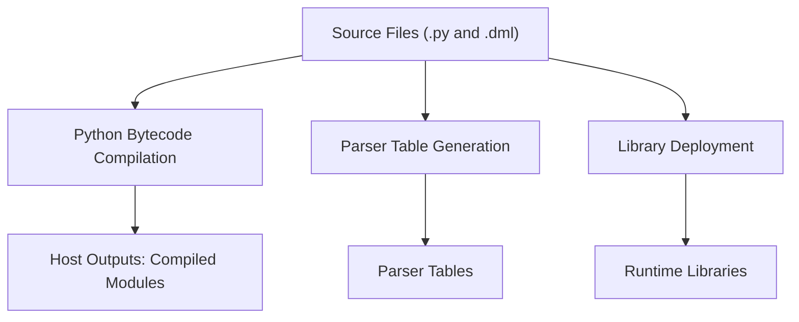
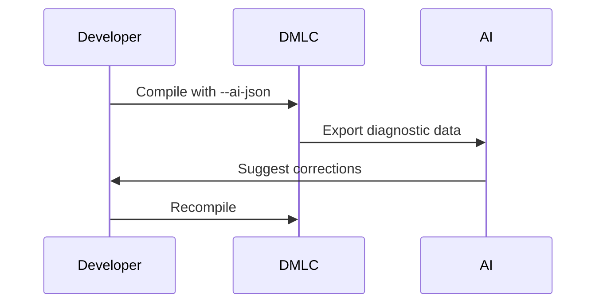

# Deployment and Infrastructure

This document provides comprehensive instructions and architectural details for deploying and integrating the Device Modeling Language Compiler (DMLC), a core component of device simulation workflows utilizing the Intel Simics simulator. The content addresses installation, configuration, build processes, deployment architecture, AI-assisted diagnostics implementation, and testing. Readers can expect to understand both the detailed technical workings and practical applications of DMLC.

---

## Introduction

The Device Modeling Language Compiler (DMLC) is a toolchain component for building and preparing functional device models used in simulation-based development workflows. By compiling `.dml` files into C code, DMLC enables seamless integration with the Intel Simics simulator for hardware design testing and validation. This guide provides essential deployment instructions, configurations, build system breakdowns, and workflows, making it an indispensable resource for developers working with DMLC.

---

## Installation and Configuration

### Prerequisites

Before deploying DMLC, ensure the following dependencies are installed and configured:

| Component                | Purpose                          | Additional Notes                                  |
|--------------------------|----------------------------------|-------------------------------------------------|
| **Python 3.x**           | Required for DMLC implementation | Includes all core modules                        |
| **PLY (Python Lex-Yacc)** | Builds parsers for `.dml` files  | Install with `pip install ply`                   |
| **GCC or compatible C compiler** | Compiles C source from DMLC | Required for post-compilation processes          |
| **Simics Base**           | Provides runtime APIs and headers | Path must be set using the `SIMICS_BASE` variable |

Sources: [.deepwiki/3_Installation_and_Build.md:22-33]()

### Environment Variables

The following environment variables need to be explicitly set to run DMLC:

| Variable                 | Description                                                | Example                                    |
|--------------------------|------------------------------------------------------------|--------------------------------------------|
| `DMLC_DIR`               | Path to locally built DMLC binaries                        | `/path/to/dmlc/linux64/bin`                |
| `SIMICS_BASE`            | Simics runtime and headers path                            | `/opt/simics/`                             |
| `DMLC_PATHSUBST`         | Maps error message paths in logs to source file locations  | `/path/to/debug/files`                     |

Sources: [.deepwiki-open/Deployment_Instructions.md:48-59]()

---

## Build System Architecture

### Build Pipeline Overview



1. _Source Files_ include Python modules (`.py`), DML standard libraries (`.dml`), and runtime headers.
2. Python sources are compiled using dedicated scripts.
3. Generated parser tables optimize lexing and parsing in DMLC.
4. Libraries are installed in version-specific directories.

Sources: [.deepwiki/3_Installation_and_Build.md:39-105]()  

### Build Commands

For a complete build:
```bash
cd modules/dmlc
make
```

To build specific targets:
```bash
# Build only the parser
make dml12_parsetab.py dml14_parsetab.py

# Build runtime libraries
make $(DMLFILES)
```

Sources: [.deepwiki/3_Installation_and_Build.md:487-505]()

---

## Deployment Workflows

### Compilation Process

```mermaid
flowchart TD
    A[Source File (.dml)] --> B[DMLC Compiler]
    B --> C[Generated C Code]
    C --> D[Simics Module]
    D --> E[Functional Device Model]
```

1. Source code in `.dml` is provided as input to DMLC.
2. The DMLC compiler generates equivalent C source files.
3. These C sources are compiled into modules compatible with Simics.
4. Simics loads the modules for simulating the functional device models.

Sources: [.deepwiki-open/Deployment_Instructions.md:106-119]()

### AI-Assisted Diagnostics Workflow



- Enabling AI Diagnostic Mode (via `--ai-json`) allows DMLC to export errors in structured JSON files.
- Tools process this JSON to offer actionable feedback to the developer.

Sources: [.deepwiki-open/Deployment_Instructions.md:124-140]()

---

## Testing Framework

### Unit Tests

Run DMLC tests to ensure code correctness:
```bash
make test-dmlc
```

Alternatively, use the Simics test runner:
```bash
bin/test-runner --suite modules/dmlc/test
```

Sources: [.deepwiki-open/Deployment_Instructions.md:82-89]()

### Testing AI Diagnostics

Example diagnostic testing command:
```bash
dmlc --ai-json diagnostic.json <test-file>.dml
cat diagnostic.json | jq '.'
```

Sources: [.deepwiki-open/Deployment_Instructions.md:92-101]()

---

## Key Commands and Outputs

### Command-Line Options

| Command Option             | Description                          |
|----------------------------|--------------------------------------|
| `--ai-json <file>`         | Outputs diagnostics in AI-readable format |
| `-I <path>`                | Adds search paths for imports       |
| `--help`                   | Outputs help information            |

Sources: [.deepwiki-open/Deployment_Instructions.md:63-73]()

---

## Glossary of Files and Directories

| File/Directory               | Purpose                                    | Path Example                       |
|------------------------------|--------------------------------------------|------------------------------------|
| `.dml` Files                 | Source code for device models             | `/modules/dmlc/src/xx.dml`         |
| `dmlc.py`                    | DML compiler entry point                  | `bin/dml/python/`                  |
| `dml*_parsetab.py`           | Parser configuration tables               | `bin/dml/python/`                  |

---

## Conclusion

DMLC is a critical component for device simulation, enabling faster development workflows. Features like AI-assisted diagnostics and comprehensive testing make it an indispensable tool for developers using the Intel Simics environment. By meticulously following build and deployment instructions, users can maximize the potential of the DML toolchain.

Sources: [.deepwiki-open/Deployment_Instructions.md](), [.deepwiki/3_Installation_and_Build.md](), [run_dmlc.sh]() 