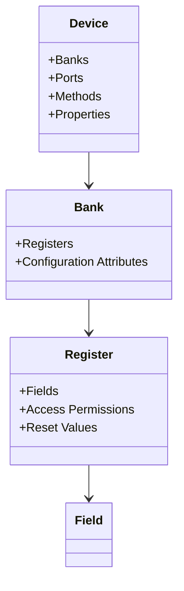
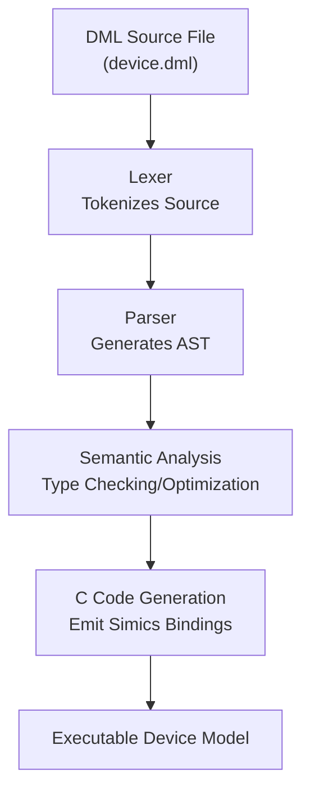
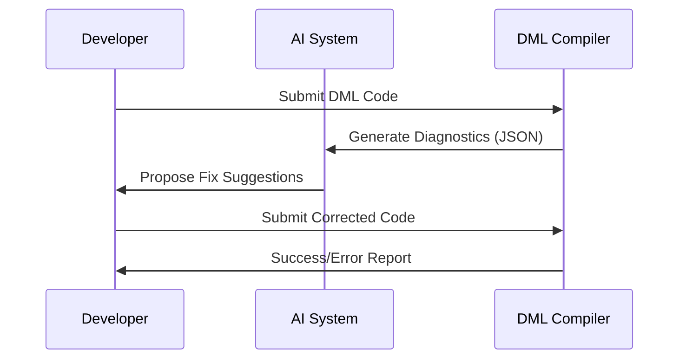

# Core Features of Device Modeling Language (DML)

## Introduction

The Device Modeling Language (DML) is a domain-specific language designed to simplify the creation of hardware device models, particularly for use in simulation environments such as Intel's Simics. It combines C-like algorithmic constructs with declarative object-oriented features, enabling developers to describe the structure, functionality, and interface of hardware devices. This page provides a deep dive into the **core features** of DML, highlighting its key components, supported functionalities, and development workflows.

---

## Core Language Features

### Object-Oriented Hardware Modeling

DML adopts an object-oriented approach to device modeling, where every component of a hardware device (e.g., registers, memory banks, fields) is modular and encapsulated as an object. These objects adhere to a strict hierarchy:

- **Device**: Represents the top-level hardware model.
- **Banks**: Define memory-mapped regions of a device.
- **Registers**: Encapsulate addressable blocks within banks.
- **Fields**: Represent bit-level access within a register.



**Key Features**:
- Encapsulation of device-specific attributes and methods.
- Containment rules that ensure the logical structure of simulated hardware models.
- Reusability using templates and shared methods.

Sources: [doc/1.4/language.md:6-50](), [doc/1.4/introduction.md:40-120]()

---

### Language Syntax and Processing Pipeline

DML features a rich, C-style syntactic structure that includes the following key constructs:
- **Type System**: Primitives (integers, floats), composite types (arrays, structs), DML-specific extensions (traits, hooks).
- **Control Structures**: Conditional expressions, loops (`for`, `while`), error handling (`try/catch`).
- **Device Methods**: Include qualifiers (`throws`, `inline`) for fine-grained behavior specification.

The compilation process in DML involves multiple stages, transforming source code into executable device models:



Sources: [py/dml/dmlparse.py:1-300](), [py/dml/codegen.py:1-100]()

---

### Rich Meta-programming with Templates

Templates in DML provide a mechanism for code abstraction and reuse. Developers can establish parameterized common patterns (e.g., register layouts, frequently used methods):

```dml
template register_template {
    param REG_NAME : string;
    param ADDRESS  : int;
    register $REG_NAME @ $ADDRESS {
        field status @ [7:0] is (read, write);
    }
}

// Instantiate Template
bank control_bank {
    use register_template(REG_NAME = "control", ADDRESS = 0x1000);
}
```

**Advantages**:
- Reduced code duplication in large devices with multiple registers.
- Enhanced maintainability through a structured inheritance/override model.

Sources: [py/dml/template.py:1-150](), [doc/1.4/introduction.md:220-335]()

---

### Memory Mapping and Hardware Registers

DML simplifies the modeling of memory-mapped devices. Registers, fields, and banks can be described with fine-grained control:

- **Access Permissions**: Specifies read-only, write-only, or read-write fields (`is (read, write)`).
- **Bit Manipulation**: In-built constructs for handling bit-level operations within registers.
- **Reset Properties**: Initialize fields using `reset` values.

```dml
dml 1.4; // DML Version Declaration

device memory_controller {
    bank config_registers {
        register r1 @ 0x00 size 4 {
            field enable @ [0] is (read, write) {
                method read() -> (bool) {
                    return this.enable;
                }
            }
        }
    }
}
```

**Table: Key Containment Rules**

| Object Level | Allowed Child Types                                   |
|--------------|-------------------------------------------------------|
| `device`     | `bank`, `register`, `method`, `trait`                 |
| `bank`       | `register`, `field`                                   |
| `register`   | `field`, `event`                                      |

Sources: [doc/1.4/language.md:300-400](), [doc/1.4/introduction.md:345-412]()

---

### Compiler Error Handling and Diagnostics

#### AI-Friendly Structured Diagnostics

The DML Compiler (`DMLC`) incorporates an advanced diagnostics system that provides structured errors and warnings in JSON. This structured output facilitates integration with AI-powered tools for automated error correction.

| **Category**         | **Example Error Code** | **Description**               |
|-----------------------|------------------------|--------------------------------|
| **Syntax Errors**     | `ESYNTAX`             | Malformed code.               |
| **Type Mismatches**   | `ETYPE`               | Assigning incompatible types. |
| **Undefined Symbols** | `EUNDEF`              | Undefined variable/reference. |

Example JSON Diagnostic Entry:

```json
{
  "type": "error",
  "code": "EUNDEF",
  "message": "Undefined symbol 'reg_x'",
  "category": "undefined_symbol",
  "location": {
    "file": "device.dml",
    "line": 42
  },
  "fix_suggestions": ["Define variable 'reg_x'", "Verify register name"]
}
```

#### Integration Workflow

Error diagnostics integrate seamlessly into CI/CD pipelines or AI frameworks:



Sources: [py/dml/messages.py:12-300](), [AI_DIAGNOSTICS_README.md:120-250]()

---

### Version Compatibility and Migration Support

DML provides strong backward compatibility across versions, allowing developers to migrate older device models (e.g., from DML `1.2`) to newer standards (e.g., DML `1.4`).

**Key Differences Between Versions:**

| **Feature**            | **DML 1.2**                  | **DML 1.4**                |
|-------------------------|-----------------------------|----------------------------|
| **Exception Handling**  | `nothrow`                  | `throws` annotation        |
| **Parameter Syntax**    | `$parameter_name`          | `parameter_name`           |
| **Code Efficiency**     | Baseline                   | ~3x faster optimizations   |

Supported migration tools and detailed error reports simplify transitioning between versions.

Sources: [doc/1.4/introduction.md:400-440](), [py/dml/dmlparse.py:175-250]()

---

## Conclusion

The Device Modeling Language (DML) represents a robust and feature-rich solution for hardware modeling in simulation environments. With its object-oriented paradigms, metaprogramming capabilities, advanced error diagnostics, and strong version compatibility, DML enables developers to create efficient and maintainable device models. Its integration with tools like AI-driven diagnostics ensures that DML remains a cutting-edge framework for both legacy and modern hardware development needs.