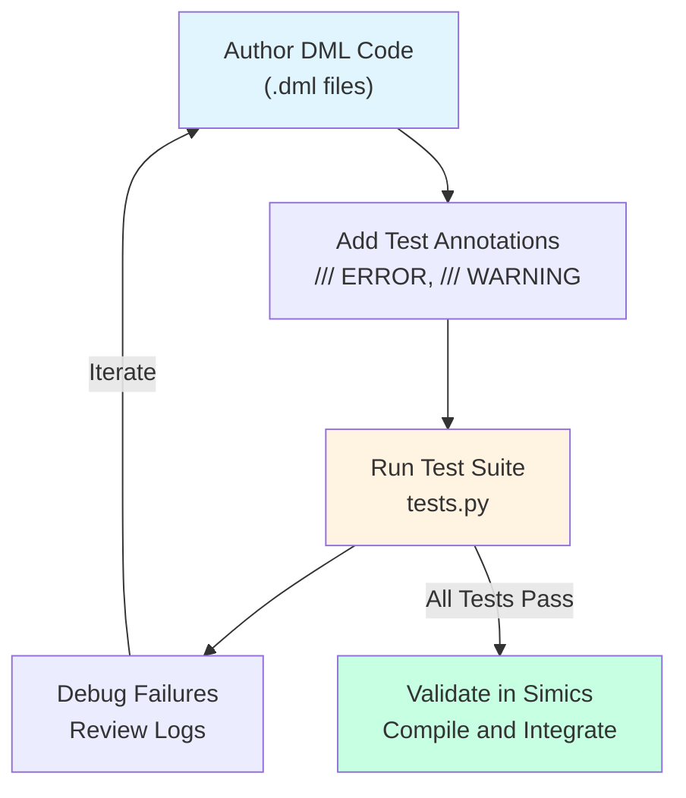
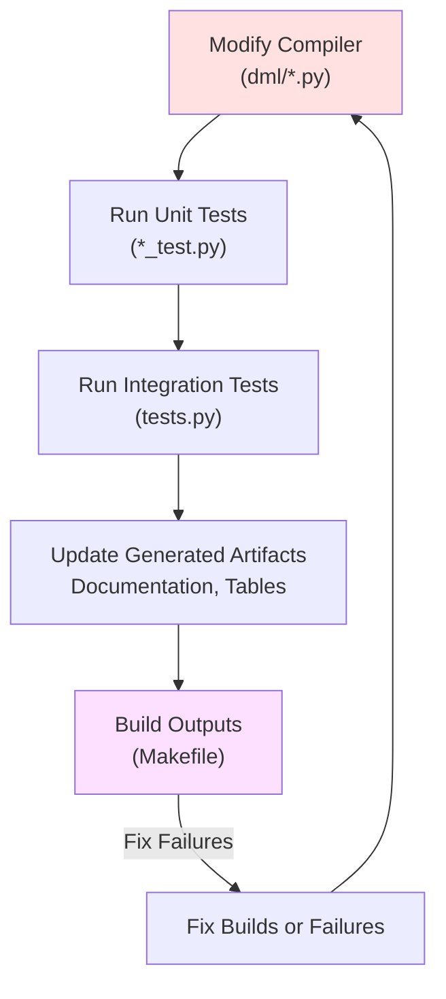
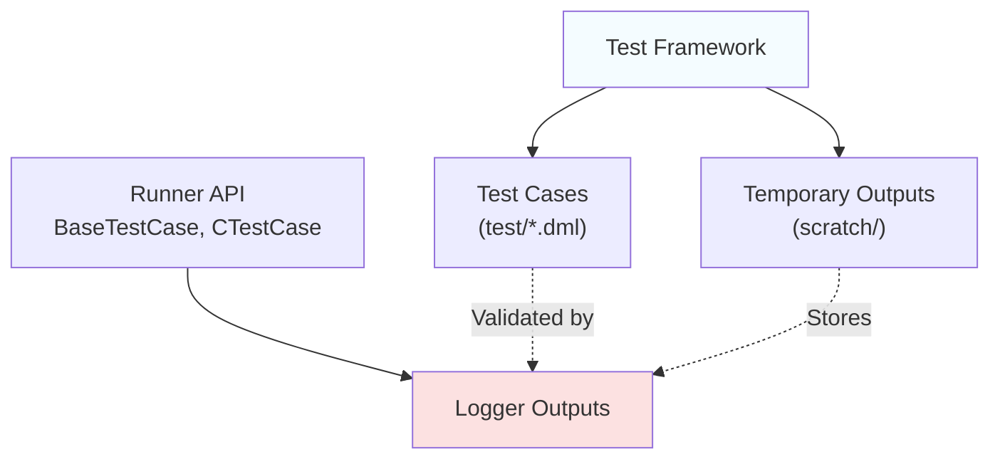
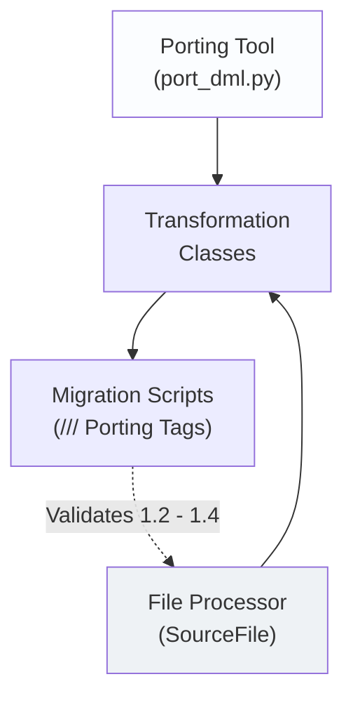
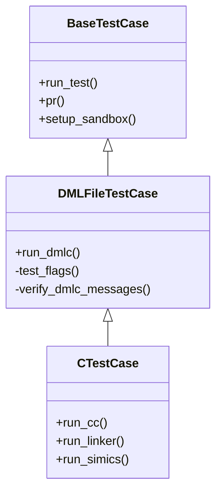
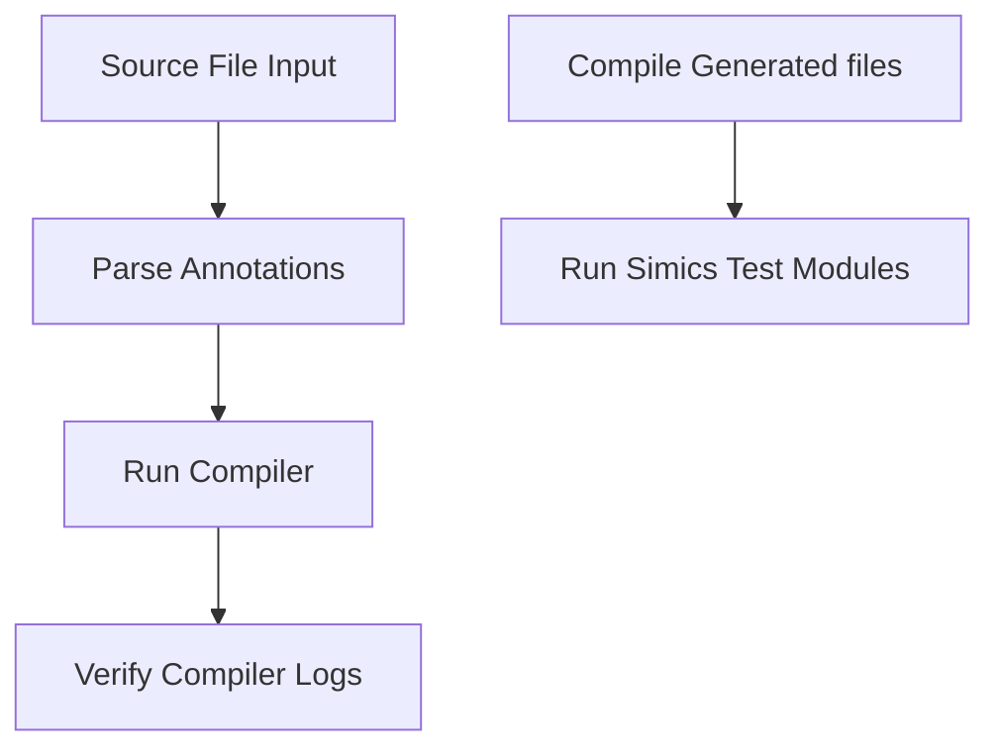

# Development and Testing  

## Introduction  

This documentation provides an in-depth guide to the "Development and Testing" workflows for the DML (Device Modeling Language) framework. It is intended for developers and contributors working on device models or the DML compiler. The guide highlights key development practices, testing mechanisms, automated porting workflows, and the infrastructure supporting DML's lifecycle: from source to execution in the Simics environment.  

The testing framework, porting tools, and compiler infrastructure ensure backward compatibility, reliable code generation, and accurate runtime functionality. This document is organized to provide seamless access to workflow overviews, tool architectures, testing systems, and functional details drawn directly from source.  

---

## Development Workflow  

### Device Model Development  

Developing device models follows these steps to ensure correctness and conformance:  

### Compiler Development  

Compiler development emphasizes maintaining consistency across the DML pipeline:  

---

## Tool Architectures  

The DML development framework integrates multiple tools to support testing, porting, building, and generating artifacts.  

### Test Infrastructure  

### Porting Framework  

---

## Test Framework  

### Architecture  

The test framework organizes functionality using object-oriented extensions:  

### Stages  

The following stages define the test pipeline:  

--- 

### Testing Workflow  

